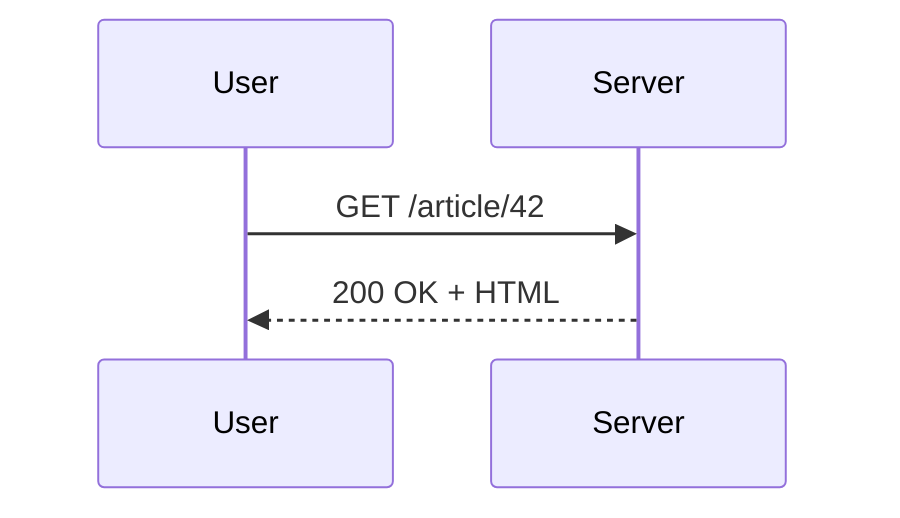

# Writing Markdown for markpage

A reference for AI agents producing Markdown documents that will be
rendered by [markpage](https://markpage.org). markpage takes
Markdown source and produces print-ready paginated PDFs entirely
client-side. All standard Markdown works; this document covers the
extensions that make markpage useful for technical specifications,
academic writing, and structured documentation.

Optimise the source for **the constructs below** when they fit —
they render cleanly into the PDF and survive copy-paste anywhere
(everything is plain text Unicode in the source).

---

## Standard Markdown

GFM-flavoured Markdown is supported as-is:

- Headings `#` through `######` (only the first 4 levels have
  distinct styling; `#####` / `######` share level 4's size).
- Emphasis: `*italic*`, `**bold**`, `~~strikethrough~~`,
  `` `inline code` ``.
- Lists: `-` / `*` unordered, `1.` ordered (renumbered automatically
  in render).
- Blockquotes: `> …`.
- Task lists: `- [ ]` / `- [x]` (real checkbox glyphs in the PDF).
- Links: `[text](url)`, autolinks `<url>`.
- Images: `` — scaled to fit the column.
- Fenced code blocks: triple backticks with an optional language
  hint for syntax-highlighting (`js`, `python`, `rust`, …).

---

## Math (MathJax / LaTeX)

Inline math between `$ … $`. Display math either between `$$ … $$`
on its own paragraph, or inside a `math` fenced block (preferred —
no requirement that the `$$` markers sit alone on their line):

````
Inline: $c = 1 / \sqrt{\mu_0 \varepsilon_0}$.

```math
\begin{align*}
  \nabla \cdot \mathbf{E} &= \frac{\rho}{\varepsilon_0} \\
  \nabla \times \mathbf{B} &= \mu_0 \mathbf{J}
    + \mu_0 \varepsilon_0 \frac{\partial \mathbf{E}}{\partial t}
\end{align*}
```
````

Full LaTeX math syntax — `\frac`, `\sqrt`, `\sum`, `\int`,
`\begin{matrix}`, `\begin{cases}`, `\mathbb{N}`, `\mathcal{O}`, etc.
You may also write Unicode characters directly (α, ℕ, ⊢, ∀) in math
mode; MathJax accepts them.

---

## Inference rules

For type systems, operational semantics, sequent calculus, etc.,
use a dedicated `inference` fenced block. Premises separated by
`;`, a line of three or more dashes, then the conclusion. The label
in parentheses appears to the right of the bar.

````
```inference (T-App)
\Gamma \vdash f : A \to B; \Gamma \vdash x : A
---
\Gamma \vdash f\,x : B
```
````

LaTeX commands (`\Gamma`, `\vdash`, `\to`) and the corresponding
Unicode (Γ, ⊢, →) are interchangeable inside the block.

**Typography heuristic** (Gunter / Scott convention, applied
automatically before MathJax sees the source) — write the source
naturally, the renderer does the right thing:

- A single capital letter immediately followed by `` or `[[` is a
  **semantic function** → rendered in calligraphic.  `Ee` ⇒ 𝓔e.
- A letter followed by digits is a **subscripted variable** →
  `e1`, `T2` ⇒ e₁, T₂.
- A multi-letter identifier **inside** `…` is a **constructor**
  of the abstract syntax → rendered in **bold**.  `Op(o, e1, e2)`
  inside brackets ⇒ **Op**(o, e₁, e₂).
- A multi-letter identifier **outside** `…` is a **function /
  auxiliary name** → rendered in sans-serif.  `apply(o, v1, v2)`
  ⇒ 𝖺𝗉𝗉𝗅𝗒(o, v₁, v₂).
- Single capital letters (`A`, `B`, `T`, `\Gamma`, …) stay italic
  — the standard math convention for type / context / term
  variables.

You can therefore write `EOp(o, e1, e2) = apply(o, Ee1, Ee2)`
verbatim and get the right rendering — no need to wrap names in
`\mathcal{}` / `\mathbf{}` / `\mathsf{}` by hand. (If you do, the
heuristic is idempotent: existing wraps are preserved.)

---

## EBNF railroad diagrams

Use the `ebnf` fence for grammars. Each production renders as a
separate railroad / syntax diagram, with the non-terminal name
right-aligned next to the diagram and an `=` sign in between (every
`=` lines up vertically — LaTeX align-on-equals convention).

````
```ebnf
expression = term, { ("+" | "-"), term };
term = factor, { ("*" | "/"), factor };
factor = number | "(", expression, ")";
number = digit, { digit };
digit = "0" | "1" | "2" | "3" | "4" | "5" | "6" | "7" | "8" | "9";
```
````

Dialect: **W3C EBNF** (the one ebnf2railroad understands). Key
syntax:

- `=` defines a production, terminated by `;`.
- `,` is concatenation (sequence).
- `|` is alternation.
- `{ … }` is zero-or-more repetition.
- `[ … ]` is optional (zero-or-one).
- `( … )` groups for precedence.
- `"…"` or `'…'` for terminal literals.
- `(* comment *)` for comments.

A parse error in the source is caught and rendered as a visible
`<pre class="ebnf-error">…</pre>` so a typo doesn't blow up the
whole document.

---

## Algebraic data types

Use the `adt` fence for BNF-ish algebraic data type definitions —
the notation common in formal-methods papers and operational
semantics. Distinct from `ebnf`: same `|` syntax, but expects
`::=` (not `=`), accepts `Ctor(arg1, arg2)` constructor calls,
and renders as a typeset table rather than a railroad diagram.

````
```adt
Expr ::= Const(c)              (* c ∈ ℝ *)
       | Vec(v)                 (* v ∈ 𝒱 *)
       | Op(o, Expr, Expr)      (* o ∈ Ω *)
       | Split(Expr)

Op   ::= Add | Sub | Mul | Div
```
````

Layout: a 4-column grid (LHS / `::=` or `|` / alternative /
annotation). All `|` line up vertically. Trailing `(* … *)`
comments on each alternative are pulled off and rendered as
right-side annotations. A definition whose every alternative is
a bare name with no args and no annotation collapses to a single
inline row (`Op` above).

Highlighting: identifiers that appear as a LHS somewhere in the
block (defined by a rule — `Expr`, `Op` here) get the type
colour. Pure constructors (`Const`, `Vec`, `Split`, `Add`, `Sub`,
`Mul`, `Div`) get the constructor colour. Lowercase identifiers
(variables like `c`, `v`, `o`) stay plain.

Use `adt` for **type definitions**; use `ebnf` for **concrete
grammars** that benefit from a syntax diagram.

---

## Mermaid diagrams

Flowcharts, sequence, class, state, gantt, ER, mindmap, etc.

````

````

> **Critical pitfall:** inside Mermaid blocks, always write arrows
> as **ASCII** — `-->`, `<--`, `->>`, `-.->`. The Mermaid parser
> does NOT accept Unicode `→` / `←`. Do not generate `-→`, `→`, or
> `⇒` inside a Mermaid fence.

---

## Charts from CSV

A `chart` fenced block reads inline CSV and emits an SVG plot.
First line is headers (column 1 = X axis label, remaining columns
= data series). Following lines are values.

````
```chart line "Audio latency"
buffer (samples), latency (ms)
64,    1.3
128,   2.7
256,   5.3
512,  10.7
1024, 21.3
```
````

Types: `line` (curves) or `bar` (histogram). Quoted title is
optional. X axis auto-detects continuous numbers, categorical
labels, or ISO 8601 dates (`YYYY-MM-DD`). Multiple data series
become coloured lines or grouped bars with an automatic legend.

---

## CSV / TSV tables

Dense tables are easier as CSV/TSV than as pipe tables:

````
```csv
Note, Concert pitch (Hz), MIDI
A4,    440.00, 69
A#4,   466.16, 70
B4,    493.88, 71
```
````

Use `csv` or `tsv` as the info string. Separator is auto-detected
(tab > `;` > `,`). Decimal commas (`3,14`) are recognised when the
field separator is `,` and there's no space around the digits.

---

## Pipe tables (GFM)

Standard pipe-and-dash syntax. Alignment is set by the separator
row:

```
| Left | Centre | Right |
|:-----|:------:|------:|
| a    | b      | c     |
```

Tables are centred horizontally on the page in the rendered PDF.

---

## Callouts (Pandoc fenced divs)

Highlight a passage with `:::` blocks. Optional title in brackets
after the class name.

```
::: warning
Careful, this operation is irreversible.
:::

::: theorem [Pythagoras]
In a right triangle, the square of the hypotenuse equals the sum
of the squares of the other two sides.
:::
```

Recognised classes:

- **Coloured boxes** (tinted background, coloured frame):
  `note` (blue), `tip` (green), `warning` (orange),
  `caution` (red), `important` (purple).
- **Academic** (plain frame, italic title, LaTeX-like):
  `theorem`, `lemma`, `proposition`, `corollary`, `definition`,
  `proof`, `example`, `remark`.

Any other class name (e.g. `::: aside`) renders with a neutral
frame — fine for ad-hoc conventions. The body of a callout accepts
the full Markdown vocabulary including math, code, and nested
constructs.

---

## Definition lists (Pandoc-style)

Term on one line, definition on the next prefixed with `:` and an
indent. Lines indented by **four spaces** (or a tab) fold into the
current definition. Multiple definitions per term are allowed.

```
DAG
:   *Directed Acyclic Graph* — a directed graph with no cycle,
    used everywhere from build systems to causal inference.

FFT
:   *Fast Fourier Transform* — the $O(n \log n)$ algorithm by
    Cooley & Tukey.
:   Also a verb. "FFT the signal" means "compute its frequency
    representation".
```

---

## Footnotes (Pandoc-style)

Reference inline with `[^id]`. Define elsewhere (typically at the
end) with `[^id]: …`. Numbers are assigned in order of first
reference; the footnote section is generated automatically with
back-links.

```
Quicksort runs in $O(n \log n)$ on average[^avg], but degrades to
$O(n^2)$ on already-sorted input unless a randomised pivot is
used[^rand].

[^avg]: Hoare, C. A. R. (1962). *Quicksort*. The Computer Journal.
[^rand]: Sedgewick proposed shuffling the array as a guard.
```

---

## Code blocks (syntax highlighting)

Fenced code blocks with a recognised language hint are
syntax-highlighted via highlight.js. The light atom-one-light
theme is used in the preview and the PDF.

The bundled language set is curated for spec writing:
`bash`/`sh`, `c`, `cpp`, `css`, `go`, `haskell`, `html`/`xml`,
`java`, `javascript`/`js`, `json`, `lua`, `markdown`/`md`,
`ocaml`, `python`/`py`, `rust`/`rs`, `scala`, `scheme`, `shell`,
`sql`, `typescript`/`ts`, `yaml`/`yml`. Any other language hint
falls through to a plain monospace block.

A custom **Faust** language is also registered (`faust` or
`dsp`), since Faust is markpage's author's project and isn't in
highlight.js core. Covers the keywords (`process`, `with`,
`letrec`, `case`, `import`, `library`, `environment`, `declare`,
`route`), types (`int`, `float`), UI primitives (`button`,
`vslider`, `hslider`, `nentry`, `vbargraph`, `hbargraph`, …),
audio shorthands (`_`, `!`, `mem`, `prefix`, `select2`,
`select3`), and module accesses like `os.osc` / `ba.beat`.

````markdown
```rust
fn quicksort<T: Ord + Clone>(xs: &[T]) -> Vec<T> {
    if xs.len() <= 1 { return xs.to_vec(); }
    let (pivot, rest) = xs.split_first().unwrap();
    let (lt, gte): (Vec<_>, Vec<_>) =
        rest.iter().cloned().partition(|x| x < pivot);
    [quicksort(&lt), vec![pivot.clone()], quicksort(&gte)].concat()
}
```

```faust
declare name "Echo";
import("stdfaust.lib");

delay = vslider("delay [ms]", 100, 1, 1000, 1) * 0.001;
fb    = vslider("feedback", 0.5, 0, 0.99, 0.01);

process = + ~ (de.delay(48000, delay * ma.SR) * fb);
```
````

---

## Mathematical Unicode in prose

Outside `$…$` and code blocks, you can write Unicode math
characters directly: α β γ, ∈ ∉ ⊆ ⊕ ⊗, ∀ ∃ ∞, ℕ ℝ ℤ ℚ ℂ, ≤ ≥ ≠, →
←, ↦ ⇒ ⇔. They render as the Unicode characters they are — no
math-mode delimiters needed. This is shorter and cleaner than
wrapping single symbols in `$…$`.

In Markdown source the editor would substitute `\alpha` → α, `\in`
→ ∈, `<=` → ≤, `|N` → ℕ as you type, but when generating Markdown
programmatically just write the Unicode directly.

---

## What is NOT supported

- **Raw HTML beyond what marked passes through** — no `<style>`,
  `<script>`, no custom elements. Use the constructs above.
- **YAML frontmatter** for document metadata (title, author, date).
  These are configured in the markpage Settings panel per profile,
  not in the source.
- **Manual page breaks** — pagination is handled by paged.js
  automatically. The `keep-with-next` style rules try to keep
  headings attached to the paragraph below.
- **Inline styles / classes on Markdown elements** — there is no
  `{.classname}` or `{#id}` annotation syntax.

---

## Style summary for spec writers

- Lead with `#` H1 for the document title, `##` for sections, `###`
  for subsections. Don't skip levels.
- Wrap definitions in `::: definition [Name]` blocks; theorems /
  lemmas / propositions get their own class.
- Use `::: note` / `::: warning` sparingly — they're for genuine
  side-channel remarks, not running prose.
- Prefer `csv` blocks for tables with more than ~3 columns or
  ~5 rows. Pipe tables are fine for compact 2×2 / 3×3 layouts.
- Mermaid for control flow, sequence diagrams, state machines.
  `chart` blocks for plotting actual data.
- Math: inline for single expressions in a sentence (`$O(n \log
  n)$`), display for anything multi-line or that deserves its own
  paragraph.
- Inference blocks for any judgement-style rule (typing, reduction,
  proof system).
- Footnotes for citations and parenthetical asides that would
  otherwise interrupt the flow.
