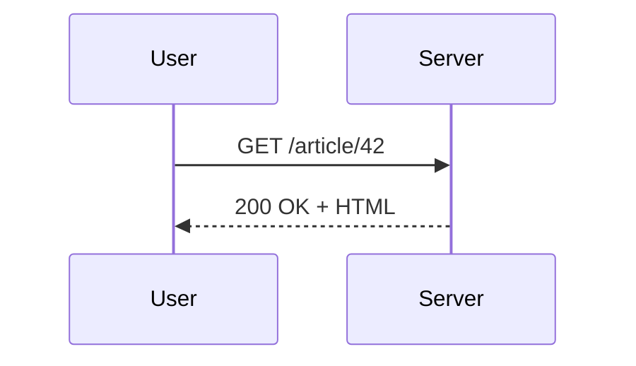
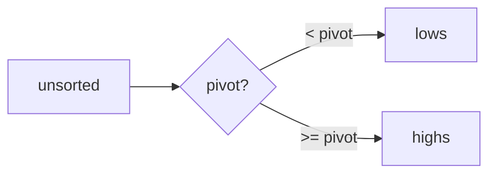

# Writing Markdown for markpage

A reference for AI agents producing Markdown documents that will be
rendered by [markpage](https://markpage.org). markpage takes
Markdown source and produces print-ready paginated PDFs entirely
client-side. All standard Markdown works; this document covers the
extensions that make markpage useful for technical specifications,
academic writing, and structured documentation.

Optimise the source for **the constructs below** when they fit —
they render cleanly into the PDF and survive copy-paste anywhere
(everything is plain text Unicode in the source).

---

## Picking the right block

Quick map from intent to construct. Detailed syntax for each is
further down.

| Need                                  | Construct                          |
| :------------------------------------ | :--------------------------------- |
| Prose, lists, links, basic emphasis   | standard Markdown                  |
| Equation, formula                     | `$ … $`, `$$ … $$`, or ` ```math ` |
| Typing / reduction / inference rule   | ` ```inference `                   |
| Commutative diagram                   | ` ```category `                    |
| Formal grammar (railroad)             | ` ```ebnf `                        |
| Algebraic data type / abstract syntax | ` ```adt `                         |
| Flowchart, sequence, state machine    | ` ```mermaid `                     |
| Signal-flow circuit (Faust-style)     | ` ```bda `                         |
| Data plot (line, bar)                 | ` ```chart `                       |
| Dense table (>3 cols or >5 rows)      | ` ```csv ` / ` ```tsv `            |
| Compact 2-3 column table              | pipe table                         |
| Note, warning, theorem, definition, … | `::: class` callout                |
| Term + gloss pairs                    | Pandoc definition list             |
| Bibliographic citation                | `[@key]`                           |
| Footnote / parenthetical aside        | `[^id]`                            |
| Source code with highlighting         | fenced code + language hint        |
| Unified diff                          | ` ```diff `                        |
| Filesystem layout or AST              | ` ```tree ` (`svg` for AST)        |
| Numbered pseudocode                   | ` ```algorithm `                   |
| Source + rendered side-by-side        | ` ```demo `                        |
| Letterhead (invoices, courriers, …)   | sender / recipient / signature     |
| Running page header / footer          | ` ```header ` / ` ```footer `      |

When two blocks fit (e.g. a tiny `csv` vs. a pipe table), prefer
the simpler one. When in doubt between `adt` and `ebnf`, ask:
*am I defining the shape of values* (→ `adt`) *or the strings a
parser accepts* (→ `ebnf`)?

---

## Prefer Unicode over LaTeX where possible

Markpage's source is meant to be human-editable. Whenever a symbol
has an obvious Unicode counterpart, **write the Unicode** rather
than the LaTeX command. Both render identically, but Unicode keeps
the source readable, greppable, and copy-pasteable.

| Prefer | Over | Prefer | Over |
| :----- | :--- | :----- | :--- |
| `α β γ` | `\alpha \beta \gamma` | `→ ←` | `\to \leftarrow` |
| `Γ Δ Σ` | `\Gamma \Delta \Sigma` | `↦ ⇒ ⇔` | `\mapsto \Rightarrow \Leftrightarrow` |
| `∀ ∃` | `\forall \exists` | `⊢ ⊨` | `\vdash \models` |
| `∈ ∉` | `\in \notin` | ` ` | `\llbracket \rrbracket` |
| `⊆ ⊕ ⊗` | `\subseteq \oplus \otimes` | `≤ ≥ ≠` | `\le \ge \neq` |
| `ℕ ℝ ℤ ℚ ℂ` | `\mathbb{N}` etc. | `x₁ y₂ aₙ` | `x_1 y_2 a_n` |
| `∞ ∂ ∇` | `\infty \partial \nabla` | `√ ∑ ∏ ∫` | `\sqrt \sum \prod \int` standalone |

This rule applies **inside `$ … $` / `$$ … $$` and inside every
rich fence** (`inference`, `category`, `adt`, `math`). MathJax
accepts these glyphs natively in math mode. Inside `category`,
identifiers are Unicode-aware, so `p₁ : P → A` is the idiomatic
form, not `p_1 : P -> A`.

**Exceptions** — keep LaTeX when:

- The construct has no clean Unicode form: `\frac{a}{b}`,
  `\sqrt{x+1}`, `\begin{cases}`, `\begin{matrix}`, accents
  (`\hat{x}`, `\bar{y}`), big operators with limits.
- You need a font command (`\mathcal{F}`, `\mathbf{v}`,
  `\mathsf{op}`) that Unicode can't express on a regular letter.
- Inside **Mermaid fences**, arrows MUST stay ASCII (`-->`,
  `->>`, `-.->`); Mermaid's parser does not accept `→` / `⇒`.

When the editor is open interactively, ligatures (`\alpha` → α,
`<=` → ≤, `|N` → ℕ) handle the conversion for you. When
generating Markdown programmatically, type the Unicode directly.

---

## Standard Markdown

GFM-flavoured Markdown is supported as-is:

- Headings `#` through `######` (only the first 4 levels have
  distinct styling; `#####` / `######` share level 4's size).
- Emphasis: `*italic*`, `**bold**`, `~~strikethrough~~`,
  `` `inline code` ``.
- Lists: `-` / `*` unordered, `1.` ordered (renumbered automatically
  in render).
- Blockquotes: `> …`.
- Task lists: `- [ ]` / `- [x]` (real checkbox glyphs in the PDF).
- Links: `[text](url)`, autolinks `<url>`.
- Images: `` — scaled to fit the column. Relative
  paths (`images/foo.png`) and HTTP URLs both work; on import, markpage
  prompts the human user once for any relative-path file it doesn't
  already know, then caches the binding so future imports of the same
  document skip the prompt.
- Fenced code blocks: triple backticks with an optional language
  hint for syntax-highlighting (`js`, `python`, `rust`, …).

---

## Math (MathJax / LaTeX)

Inline math between `$ … $`. Display math either between `$$ … $$`
on its own paragraph, or inside a `math` fenced block (preferred —
no requirement that the `$$` markers sit alone on their line):

````
Inline: $c = 1 / \sqrt{\mu_0 \varepsilon_0}$.

```math
\begin{align*}
  \nabla \cdot \mathbf{E} &= \frac{\rho}{\varepsilon_0} \\
  \nabla \times \mathbf{B} &= \mu_0 \mathbf{J}
    + \mu_0 \varepsilon_0 \frac{\partial \mathbf{E}}{\partial t}
\end{align*}
```
````

Full LaTeX math syntax — `\frac`, `\sqrt`, `\sum`, `\int`,
`\begin{matrix}`, `\begin{cases}`, `\mathbb{N}`, `\mathcal{O}`, etc.
You may also write Unicode characters directly (α, ℕ, ⊢, ∀) in math
mode; MathJax accepts them.

---

## Inference rules

For type systems, operational semantics, sequent calculus, etc.,
use a dedicated `inference` fenced block. Premises separated by
`;`, a line of three or more dashes, then the conclusion. The label
in parentheses appears to the right of the bar.

````
```inference (T-App)
\Gamma \vdash f : A \to B; \Gamma \vdash x : A
---
\Gamma \vdash f\,x : B
```
````

LaTeX commands (`\Gamma`, `\vdash`, `\to`) and the corresponding
Unicode (Γ, ⊢, →) are interchangeable inside the block.

**Typography heuristic** (Gunter / Scott convention, applied
automatically **inside `inference` blocks only**, before MathJax
sees the source) — write the source naturally, the renderer does
the right thing:

- A single capital letter immediately followed by `` or `[[` is a
  **semantic function** → rendered in calligraphic.  `Ee` ⇒ 𝓔e.
- A letter followed by digits is a **subscripted variable** →
  `e1`, `T2` ⇒ e₁, T₂.
- A multi-letter identifier **inside** `…` is a **constructor**
  of the abstract syntax → rendered in **bold**.  `Op(o, e1, e2)`
  inside brackets ⇒ **Op**(o, e₁, e₂).
- A multi-letter identifier **outside** `…` is a **function /
  auxiliary name** → rendered in sans-serif.  `apply(o, v1, v2)`
  ⇒ 𝖺𝗉𝗉𝗅𝗒(o, v₁, v₂).
- Single capital letters (`A`, `B`, `T`, `\Gamma`, …) stay italic
  — the standard math convention for type / context / term
  variables.

You can therefore write `EOp(o, e1, e2) = apply(o, Ee1, Ee2)`
verbatim and get the right rendering — no need to wrap names in
`\mathcal{}` / `\mathbf{}` / `\mathsf{}` by hand. (If you do, the
heuristic is idempotent: existing wraps are preserved.)

The heuristic does **not** fire inside regular `$ … $` / `$$ … $$`
math or inside `category` / `math` / `adt` blocks. If you want the
same effect there, write the wrappers explicitly.

---

## Commutative diagrams (category)

Use the `category` fence to describe a small category by its
morphisms and equations. The parser builds a typed graph (objects
inferred from morphism signatures), the type-checker verifies
compositions and equations, then a native SVG renderer lays the
diagram out on a grid (Mermaid `dagre` fallback for topologies the
native renderer can't place).

````
```category "Pullback"
f  : A -> C
g  : B -> C
p1 : P -> A
p2 : P -> B
h  : X -> A
k  : X -> B
u  : X -> P by (h, k)

f . p1 = g . p2
p1 . u = h
p2 . u = k
```
````

Syntax:

- `name : Source -> Target` — declares a morphism. Objects are
  the identifiers used as source/target; no separate declaration.
- `f . g` — composition (read right-to-left, like functions).
- `f = g` — equation (commutativity constraint).
- `u : X -> P by (h, k)` — declares a morphism whose existence
  is conventionally guaranteed by a universal property (pullback,
  product, equaliser, …). Rendered dashed. *Note*: markpage does
  not prove the universal property — the `by (…)` clause is a
  typographic / documentation assertion. The arguments `(h, k)`
  appear as the tuple's components.

A type error (composition with mismatched domain/codomain, or
equation whose sides have different source/target) is reported in
a red error block instead of rendering. Full grammar and
type-checking rules in `CATEGORY-SPEC.md`.

**Identifiers are Unicode-aware** — write subscripts as Unicode
glyphs (`p₁`, `p₂`, `f̃`, `π₁`) rather than LaTeX (`p_1`, `p_2`).
The same applies to Greek, blackboard-bold, and primes. The
typography heuristic of `inference` blocks does **not** run here,
so what you type is what gets rendered.

---

## EBNF railroad diagrams

Use the `ebnf` fence for grammars. Each production renders as a
separate railroad / syntax diagram, with the non-terminal name
right-aligned next to the diagram and an `=` sign in between (every
`=` lines up vertically — LaTeX align-on-equals convention).

````
```ebnf
expression = term, { ("+" | "-"), term };
term = factor, { ("*" | "/"), factor };
factor = number | "(", expression, ")";
number = digit, { digit };
digit = "0" | "1" | "2" | "3" | "4" | "5" | "6" | "7" | "8" | "9";
```
````

Dialect: **W3C EBNF** (the one ebnf2railroad understands). Key
syntax:

- `=` defines a production, terminated by `;`.
- `,` is concatenation (sequence).
- `|` is alternation.
- `{ … }` is zero-or-more repetition.
- `[ … ]` is optional (zero-or-one).
- `( … )` groups for precedence.
- `"…"` or `'…'` for terminal literals.
- `(* comment *)` for comments.

A parse error in the source is caught and rendered as a visible
`<pre class="ebnf-error">…</pre>` so a typo doesn't blow up the
whole document.

---

## Algebraic data types

Use the `adt` fence for BNF-ish algebraic data type definitions —
the notation common in formal-methods papers and operational
semantics. Distinct from `ebnf`: same `|` syntax, but expects
`::=` (not `=`), accepts `Ctor(arg1, arg2)` constructor calls,
and renders as a typeset table rather than a railroad diagram.

````
```adt
Expr ::= Const(c)              (* c ∈ ℝ *)
       | Vec(v)                 (* v ∈ 𝒱 *)
       | Op(o, Expr, Expr)      (* o ∈ Ω *)
       | Split(Expr)

Op   ::= Add | Sub | Mul | Div
```
````

Layout: a 4-column grid (LHS / `::=` or `|` / alternative /
annotation). All `|` line up vertically. Trailing `(* … *)`
comments on each alternative are pulled off and rendered as
right-side annotations. A definition whose every alternative is
a bare name with no args and no annotation collapses to a single
inline row (`Op` above).

Highlighting: identifiers that appear as a LHS somewhere in the
block (defined by a rule — `Expr`, `Op` here) get the type
colour. Pure constructors (`Const`, `Vec`, `Split`, `Add`, `Sub`,
`Mul`, `Div`) get the constructor colour. Lowercase identifiers
(variables like `c`, `v`, `o`) stay plain.

Use `adt` for **type definitions**; use `ebnf` for **concrete
grammars** that benefit from a syntax diagram.

---

## Mermaid diagrams

Flowcharts, sequence, class, state, gantt, ER, mindmap, etc.

````

````

> **Critical pitfall:** inside Mermaid blocks, always write arrows
> as **ASCII** — `-->`, `<--`, `->>`, `-.->`. The Mermaid parser
> does NOT accept Unicode `→` / `←`. Do not generate `-→`, `→`, or
> `⇒` inside a Mermaid fence.

---

## Faust block-diagram algebra (bda)

Use the `bda` fence for left-to-right signal-flow circuits, in
the spirit of the Faust audio DSP language. The body is a single
algebraic expression over five binary operators applied to
primitive boxes; markpage parses, type-checks (input/output
arities must match the operator's rule) and renders a circuit
SVG.

````
```bda "Accumulator"
1 : +~_
```

```bda delays "Accumulator with z⁻¹"
1 : +~_
```
````

Read `1 : +~_` as: feed the constant `1` into a `+` block whose
second input is fed back from its own output through the identity
wire `_` (the `~` operator inserts a one-sample delay on the
feedback path). Result: `y[n] = 1 + y[n−1]`, a counter.

Operators (highest precedence first — `~` binds tightest, `:>`
loosest):

| Op   | Name       | Meaning                                       |
| :--- | :--------- | :-------------------------------------------- |
| `~`  | recursion  | `A ~ B` — feedback loop, `B` mirrored         |
| `,`  | parallel   | side-by-side, arities add                     |
| `:`  | sequential | outputs of left feed inputs of right          |
| `<:` | split      | one output fans out to many inputs (modulo)   |
| `:>` | merge      | many outputs sum into fewer inputs (modulo)   |

Primitives: numbers (`0`, `1.5`), identity `_`, cut `!`,
arithmetic (`+`, `-`, `*`, `/`), comparisons (`<`, `>`, `==`,
`!=`, `<=`, `>=`), common math functions (`sin`, `cos`, `tan`,
`exp`, `log`, `sqrt`, `abs`, …), and any quoted label
`"my filter"` or `X[in,out]` with explicit arity.

The optional `delays` arg (or alias `faust`) draws a `z⁻¹` box
on each recursion feedback wire (the implicit one-sample delay
that makes the recursion well-defined).

A parse or arity error renders as a red error block listing each
diagnostic with its line number.

---

## Charts from CSV

A `chart` fenced block reads inline CSV and emits an SVG plot.
First line is headers (column 1 = X axis label, remaining columns
= data series). Following lines are values.

````
```chart line "Audio latency"
buffer (samples), latency (ms)
64,    1.3
128,   2.7
256,   5.3
512,  10.7
1024, 21.3
```
````

Types: `line` (curves) or `bar` (histogram). Quoted title is
optional. X axis auto-detects continuous numbers, categorical
labels, or ISO 8601 dates (`YYYY-MM-DD`). Multiple data series
become coloured lines or grouped bars with an automatic legend.

---

## CSV / TSV tables

Dense tables are easier as CSV/TSV than as pipe tables:

````
```csv
Note, Concert pitch (Hz), MIDI
A4,    440.00, 69
A#4,   466.16, 70
B4,    493.88, 71
```
````

Use `csv` or `tsv` as the info string. Separator is auto-detected
(tab > `;` > `,`). Decimal commas (`3,14`) are recognised when the
field separator is `,` and there's no space around the digits.

**Cells are plain text — no inline Markdown is parsed.** Backticks,
`**bold**`, links, math `$…$`, all render as literal characters.
If any cell needs inline code (e.g. `` `Cmd+S` ``), a hyperlink, or
emphasis, **use a pipe table instead**, regardless of how many rows
or columns it has. The "≥3 cols / ≥5 rows → csv" heuristic only
applies to plain-text data tables.

---

## Pipe tables (GFM)

Standard pipe-and-dash syntax. Alignment is set by the separator
row:

```
| Left | Centre | Right |
|:-----|:------:|------:|
| a    | b      | c     |
```

Tables are centred horizontally on the page in the rendered PDF.

---

## Callouts (Pandoc fenced divs)

Highlight a passage with `:::` blocks. Optional title in brackets
after the class name.

```
::: warning
Careful, this operation is irreversible.
:::

::: theorem [Pythagoras]
In a right triangle, the square of the hypotenuse equals the sum
of the squares of the other two sides.
:::
```

Recognised classes:

- **Coloured boxes** (tinted background, coloured frame):
  `note` (blue), `tip` (green), `warning` (orange),
  `caution` (red), `important` (purple).
- **Academic** (plain frame, italic title, LaTeX-like):
  `theorem`, `lemma`, `proposition`, `corollary`, `definition`,
  `proof`, `example`, `remark`.

Any other class name (e.g. `::: aside`) renders with a neutral
frame — fine for ad-hoc conventions. The body of a callout accepts
the full Markdown vocabulary including math, code, and nested
constructs.

**Callouts are side-channel remarks, not section content.** Each
one is a coloured, framed visual interrupt — use them sparingly so
they stay attention-grabbing. Concretely:

**Use** for:

- A genuine warning the reader must act on (browser setting,
  irreversible op, common foot-gun).
- A side rationale ("why this choice") or implementation note that
  would otherwise interrupt the main flow.
- A theorem / definition / example in academic prose.

**Do NOT use** for:

- A regular subsection. If it has a heading like `### Limitations`
  or `### Hors v1`, the content under it is structural — leave it
  as plain prose. The heading already signals what kind of content
  follows; wrapping it in `::: caution` is double-marking.
- Every paragraph that mentions a caveat — only the strongest one
  or two per document deserve the visual weight.

---

## Letterhead (sender / recipient / signature)

For invoices, devis, courriers, propositions commerciales — paired
address blocks for the émetteur and destinataire of a document, plus
an optional `signature` block for the sign-off.

````
```sender
Yann Orlarey
12 rue Exemple
69000 Lyon
SIRET 123 456 789 00012
TVA intra. FR12 345678901
```

```recipient
ACME SAS
*À l'attention de Mme Dupont*
34 avenue du Client
75002 Paris
```
````

Each line of the body is rendered as one address line, joined by
`<br>`. Inline `**bold**`, `*italic*`, and `[text](url)` work; raw
HTML is escaped. **No automatic heading** is added — if you want
*Émetteur* / *Destinataire* (or *Sender* / *Recipient*, *From* /
*To*, anything), type it as the first line of the body.

### Default layout

- **`sender`** — sits in the left column, in normal flow.
- **`recipient`** — **absolutely positioned** by default at the
  standard French DL envelope window coordinates (left edge 110 mm,
  top edge 40 mm from the A4 edge — auto-adjusted to whatever margins
  the active profile uses). Folded in Z, an A4 lands the destinataire
  inside the window of a standard DL window envelope.
- The pair is wrapped in a group with `min-height: 70 mm` to reserve
  vertical space — without it, the prose following the group would
  flow over the absolutely-positioned recipient.

### Source-order convention

**Put `sender` / `recipient` at the very beginning of your markdown**,
before any heading or paragraph. The recipient is pinned to fixed
envelope coordinates (top of page); anything you write *before* the
letterhead flows above it in source order and, when that "anything" is
too short to fill the page-top region, overlaps visually with the
recipient block. The frontmatter `title:` is fine (it renders with the
metadata block below it, which together take enough vertical space).
Body headings (`# …`, `## …`) right before the letterhead don't.

If you really need a heading before the letterhead, use
`` ```recipient flow `` to keep the recipient in normal flow as a
right column — no fixed positioning, no overlap, but no envelope-window
alignment either.

### Opt out of window positioning — `flow`

When you don't want the envelope alignment (Anglo-Saxon-style letter,
internal mockup, A5 page where the DL coordinates don't apply, …),
add `flow` to the recipient info-string:

````
```recipient flow
ACME SAS
34 avenue du Client
75002 Paris
```
````

The recipient stays in flex flow as the right column, sized like the
sender, with `margin-left: auto` for the lone-recipient case. The
flag is silently ignored on `sender` (the émetteur is always in flow).

### Sign-off — `signature`

For the closing block of a letter (image of a hand-written signature,
name, title), use ` ```signature ` at the end of the doc:

````
Cordialement,

```signature

**Yann Orlarey**
*Consultant DSP audio*
```
````

The signature block sits in the right column (`margin-left: auto`)
with a generous top margin to separate it from the salutation above,
and `break-inside: avoid` so it doesn't get split across pages. The
body uses the same inline formatter as `sender` / `recipient` —
`**bold**`, `*italic*`, ``, `[text](url)`. `window` /
`flow` flags are silently ignored on `signature` (those are
recipient-only).

**What stays in plain Markdown** around the letterhead pair:

- Document title — frontmatter `title:`
- Date, invoice number, reference — bold-prefixed paragraphs or a
  definition list
- IBAN / BIC — bold-prefixed lines
- Legal mentions — `::: caution [Mentions légales]` callout
- Items table / totals — pipe tables (for now; an `items` block with
  auto-computed totals is planned)

---

## Running page header and footer (`header` / `footer`)

Two fences that fill the page margin boxes — same three slots per
band, on a single line, separated by `|`:

````markdown
```header
Mon document | | Page {page} / {pages}
```

```footer
| © Yann Orlarey | {date}
```
````

Slot order: **left | center | right**. Empty slot = empty pipe
segment (`| Chap |` → only the center is filled, left and right are
cleared). Literal pipe in slot text: `\|`.

**Substitutions** (resolved at render time):

| Token       | Meaning                                          |
| :---------- | :----------------------------------------------- |
| `{page}`    | current page number                              |
| `{pages}`   | total page count                                 |
| `{date}`    | render date (long French form)                   |

The fence emits **no visible content** in the document body — only
the running content of every page's margin box. Place it anywhere in
the source; each fence starts a new **run** that lasts until the next
fence of the same kind overrides it. An empty fence clears the band
entirely:

````markdown
```header
```
````

**Positional args** for narrower targeting within a run:

- `header first` — applies only to the **first page of the run**.
  Typical use: a different header on the first page of a chapter.
- `header blank` — applies only to **blank pages** that the renderer
  inserts (e.g. to push the next chapter onto a recto). Useful to
  strip the running header on such pages.

A `header first` does NOT replace the default; it sits on top of it.
The first page of the run uses `first`; subsequent pages use the
default. You can combine both in the same source position:

````markdown
```header
Chapter 3 | | Page {page}
```

```header first
| Chapter 3 |
```
````

**What's NOT supported yet** (planned, see SPEC §26.10):

- `header even` / `header odd` — recto/verso selectors. Need duplex
  mode (Phase 3).
- The `{title}` variable (current chapter title) — renders empty for now.
- Inline markdown (`**bold**`, `*italic*`, `[link]()`, images) inside
  slots — CSS `content` only accepts strings and counters in v1.

**Typical use**: a fixed page header showing the document title at top-
left and a page counter at top-right; a footer with the date or a
copyright line. Drop one ` ```header ` and one ` ```footer ` near the
top of your source. Add more fences at chapter boundaries to swap
the running content per section.

---

## Definition lists (Pandoc-style)

Term on one line, definition on the next prefixed with `:` and an
indent. Lines indented by **four spaces** (or a tab) fold into the
current definition. Multiple definitions per term are allowed.

```
DAG
:   *Directed Acyclic Graph* — a directed graph with no cycle,
    used everywhere from build systems to causal inference.

FFT
:   *Fast Fourier Transform* — the $O(n \log n)$ algorithm by
    Cooley & Tukey.
:   Also a verb. "FFT the signal" means "compute its frequency
    representation".
```

---

## Footnotes (Pandoc-style)

Reference inline with `[^id]`. Define elsewhere (typically at the
end) with `[^id]: …`. Numbers are assigned in order of first
reference; the footnote section is generated automatically with
back-links.

```
Quicksort runs in $O(n \log n)$ on average[^avg], but degrades to
$O(n^2)$ on already-sorted input unless a randomised pivot is
used[^rand].

[^avg]: Hoare, C. A. R. (1962). *Quicksort*. The Computer Journal.
[^rand]: Sedgewick proposed shuffling the array as a guard.
```

---

## Citations (Pandoc-lite)

Reference inline with `[@key]`. Define elsewhere with `[@key]: …`.
Renders as a square-bracketed `[N]` link, numbered in order of
first appearance, with an auto-generated "References" section at
the end of the document. Citation keys accept letters, digits, and
`_:.-` — BibTeX-friendly.

```
Quicksort runs in $O(n \log n)$ on average[@hoare1962], improved
by Sedgewick's randomised pivot[@sedgewick1978].

[@hoare1962]: Hoare, C. A. R. (1962). *Quicksort*. The Computer Journal 5(1), 10-16.
[@sedgewick1978]: Sedgewick, R. (1978). *Implementing Quicksort programs*. CACM 21(10), 847-857.
```

The reference text is whatever Markdown you write — there's no
automated formatting style (no APA / IEEE / MLA). You control the
order of fields and the typography. References to undefined keys
pass through as literal text so a typo doesn't silently produce a
blank `[N]`.

---

## Code blocks (syntax highlighting)

Fenced code blocks with a recognised language hint are
syntax-highlighted via highlight.js. The light atom-one-light
theme is used in the preview and the PDF.

The bundled language set is curated for spec writing:
`bash`/`sh`, `c`, `cpp`, `css`, `go`, `haskell`, `html`/`xml`,
`java`, `javascript`/`js`, `json`, `lua`, `markdown`/`md`,
`ocaml`, `python`/`py`, `rust`/`rs`, `scala`, `scheme`, `shell`,
`sql`, `typescript`/`ts`, `yaml`/`yml`. Any other language hint
falls through to a plain monospace block.

A custom **Faust** language is also registered (`faust` or
`dsp`), since Faust is markpage's author's project and isn't in
highlight.js core. Covers the keywords (`process`, `with`,
`letrec`, `case`, `import`, `library`, `environment`, `declare`,
`route`), types (`int`, `float`), UI primitives (`button`,
`vslider`, `hslider`, `nentry`, `vbargraph`, `hbargraph`, …),
audio shorthands (`_`, `!`, `mem`, `prefix`, `select2`,
`select3`), and module accesses like `os.osc` / `ba.beat`.

````markdown
```rust
fn quicksort<T: Ord + Clone>(xs: &[T]) -> Vec<T> {
    if xs.len() <= 1 { return xs.to_vec(); }
    let (pivot, rest) = xs.split_first().unwrap();
    let (lt, gte): (Vec<_>, Vec<_>) =
        rest.iter().cloned().partition(|x| x < pivot);
    [quicksort(&lt), vec![pivot.clone()], quicksort(&gte)].concat()
}
```

```faust
declare name "Echo";
import("stdfaust.lib");

delay = vslider("delay [ms]", 100, 1, 1000, 1) * 0.001;
fb    = vslider("feedback", 0.5, 0, 0.99, 0.01);

process = + ~ (de.delay(48000, delay * ma.SR) * fb);
```
````

---

## Unified diffs

The `diff` fence colours each line of a unified diff: green for
additions (`+`), red for removals (`-`), neutral for context. The
`@@` hunk header gets its own tint.

````
```diff "Patch to review"
--- a/quicksort.py
+++ b/quicksort.py
@@ -1,5 +1,6 @@
 def quicksort(xs):
     if len(xs) <= 1:
         return xs
-    pivot = xs[0]
+    import random
+    pivot = random.choice(xs)
     rest = [x for x in xs if x != pivot]
```
````

A quoted caption is optional. Body is treated as text — no
language-specific highlighting.

---

## Indented trees

The `tree` fence turns an indented outline (2-space or tab
indentation) into a Unicode box-drawing tree (default) or a
top-down SVG diagram (`svg` keyword).

````
```tree "Project layout"
markpage
  src
    category.ts
    bda.ts
    chart.ts
  tests
    corpus
      22-bda.md
```

```tree svg "AST"
Expr
  Op
    Add
    Sub
```
````

Use the Unicode mode for filesystem / project structure; use
`svg` mode for syntax trees, parser derivations, etc.

**One node per line — indentation IS the hierarchy.** A wrapped
description on a more-indented continuation line becomes a spurious
child node. If your entries need annotations that don't fit on one
line, keep the block as a plain fenced code block instead: the
`tree` fence has no continuation syntax. Comments / descriptions
that fit on the same line are fine (`tree` preserves trailing text
after the node name).

---

## Algorithmic pseudocode

The `algorithm` fence typesets pseudocode in the style of LaTeX
`algorithm2e`: auto-numbered caption, numbered lines on the left
gutter, and case-sensitive keyword bolding.

Bolded keywords (the full list, fixed): `for`, `while`, `do`,
`if`, `then`, `else`, `elif`, `end`, `repeat`, `until`, `return`,
`break`, `continue`, `function`, `procedure`, `begin`, `to`,
`in`, `and`, `or`, `not`, plus the capitalised contract markers
`Input`, `Output`, `Require`, `Ensure`.

Conventions:

- **Indentation is purely visual** — preserved as leading
  whitespace, no semantic block parsing. Close every nested block
  with an explicit `end` (the keyword gets bolded).
- **No fixed assignment / comment syntax** — pick one and stay
  consistent (`x ← expr` or `x := expr`; `// …` or `▷ …`). The
  glyphs render verbatim.
- **Inline math works** — `$x_i$` or Unicode `xᵢ` inside a line
  is picked up by MathJax like anywhere else in the document.

````
```algorithm "Bubble sort"
Input: array A of length n
Output: A sorted in place
for i from 1 to n - 1 do
  for j from 0 to n - i - 1 do
    if A[j] > A[j + 1] then
      swap A[j] and A[j + 1]
    end
  end
end
return A
```
````

The quoted caption produces "Algorithm N: …" beneath the block,
counter shared with figure / table / listing captions.

---

## Captions and cross-references

Most rich blocks accept a quoted caption immediately after the
language hint. The caption is auto-numbered per kind:

- **Figure N** — for diagrams (`mermaid`, `category`, `bda`,
  `chart`, `tree`, math display `$$ … $$`)
- **Table N** — for `csv` / `tsv` blocks and pipe tables wrapped
  in a fenced div
- **Listing N** — for source-code fences with a caption
- **Algorithm N** — for `algorithm` blocks

````
```python "Quicksort"
def quicksort(xs): …
```

```category "Pullback" \label{fig:pb}
…
```
````

Append `\label{key}` to give the block a cross-reference target.
Reference it inline anywhere in the document with `\ref{key}`,
which expands to the formatted label (`Figure 3`, `Listing 1`,
…) and links to the target.

`\label{sec:foo}` on a heading lets `\ref{sec:foo}` jump to it
too. Math equations use `\label{eq:foo}` inside the `$$ … $$`
body. Labels are case-sensitive identifiers; unknown references
render as a visible `[?]` so typos surface at proof time.

**Don't over-caption.** A caption is only worth adding when the
block is a *figure / listing / table* a reader will refer to by
name (or `\ref`) elsewhere — typical in academic writing or when a
section contains multiple peer blocks of the same kind. If the
surrounding heading already names the block (e.g. `### 9.1. Schéma`
above a single TypeScript interface), an extra `"Schéma"` caption
just duplicates the heading and pollutes the figure counter. Spec /
reference docs with explicit § numbering usually need very few
captions.

---

## Demo (source + rendered side-by-side)

The `demo` fence shows the markdown source and its rendered
output side-by-side — a teaching device for showcasing a feature
alongside its visible syntax without writing the source twice.

````
```demo
```category "Triangle"
f : A -> B
g : B -> C
h : A -> C = g . f
```
```
````

Default behaviour:

- In **slides mode**: auto-zoom resizes both panes so they fit
  the slide (see [Slides mode](#slides-mode)).
- Outside slides mode: a fixed 0.85 zoom keeps the demo block
  visually distinct from the surrounding "real" content.

A positional argument overrides the zoom: ` ```demo 0.7 ` or
` ```demo zoom=0.7 ` for a fixed numeric zoom, or
` ```demo auto ` to keep auto-zoom explicit.

> **Caveat:** avoid opening a `demo` with a prose sentence
> followed by a rigid block (code, diagram, displayed equation).
> The layout has to balance a wrappable element against a rigid
> one and the result is less clean. Put the showcased block
> first.

---

## Mathematical Unicode in prose

Outside `$…$` and code blocks, you can write Unicode math
characters directly: α β γ, ∈ ∉ ⊆ ⊕ ⊗, ∀ ∃ ∞, ℕ ℝ ℤ ℚ ℂ, ≤ ≥ ≠, →
←, ↦ ⇒ ⇔. They render as the Unicode characters they are — no
math-mode delimiters needed. This is shorter and cleaner than
wrapping single symbols in `$…$`.

In Markdown source the editor would substitute `\alpha` → α, `\in`
→ ∈, `<=` → ≤, `|N` → ℕ as you type, but when generating Markdown
programmatically just write the Unicode directly.

---

## YAML frontmatter

An optional `---` block at the very top of the document, Pandoc
style, overrides per-document the metadata that would otherwise
come from the markpage Settings profile. Useful when one document
needs a different title / author / etc. than its profile, or for
defining doc-local TeX macros.

```yaml
---
title: My Talk
author: Alice Dupont
organization: Université de Lyon
date: 2026-05-21
slides: true
mathjax-preamble: |
  \newcommand{\R}{\mathbb{R}}
  \newcommand{\sem}[1]{\llbracket #1 \rrbracket}
---
```

Recognised keys:

- `title` — rendered as `<h1 class="doc-title">`, styled via
  `styles.title`. `#` headings in the body remain regular h1
  sections.
- `author`, `organization`, `date` — fill the metadata block
  shown beneath the title.
- `slides` — `true` to force the document into 16:9 slides mode
  (see [Slides mode](#slides-mode)) regardless of the profile's
  page size.
- `mathjax-preamble` — TeX source prepended to every math
  invocation in this document. Define your `\newcommand`s once
  here and use them in every formula. Cached per (preamble,
  source) pair.

Any other key is preserved in `meta.extra` for inspection but
isn't wired to a renderer. Subset of YAML: scalar key-value pairs
only, plus the `|` block-scalar for multi-line values like
`mathjax-preamble`. No lists, no nested dicts.

---

## Slides mode

Set the page format to **Slides 16:9** in markpage Settings, or
add `slides: true` to the frontmatter, to produce a Beamer-style
presentation PDF. Each `## h2 heading` starts a new slide; `# h1`
remains the title slide (auto, once).

The slide is 16:9 landscape sized to A4 width (210 × 118.125 mm)
so a body font tuned for an A4 portrait page fills the slide
comfortably without retuning. Margins are auto-clamped (top /
bottom ≤ 10 mm, left / right ≤ 15 mm) and SVG figures are capped
at 55 % of the slide content height so a title, a short
paragraph, and a figure can fit together.

Everything else — captions, cross-refs, all the rich fences —
works identically in slides mode. The `demo` fence in particular
gains its auto-zoom layout here (see *Demo*).

`markpage-slides.md` at the repo root is an official walkthrough
of every rich block in slides mode — a useful template / smoke
test.

---

## Putting it together — a small example

The fragment below combines the recurring idioms — frontmatter
with TeX macros, a labelled rich block, a cross-reference, a
callout, inline math, citations — in roughly the shape of a short
article opening. Use it as a mental template before writing.

````markdown
---
title: Quicksort revisited
author: Alice Dupont
date: 2026-05-21
mathjax-preamble: |
  \newcommand{\Oh}{\mathcal{O}}
---

# Quicksort revisited

## Average complexity

::: theorem [Average-case bound]
Randomised quicksort on $n$ distinct keys performs
$\Oh(n \log n)$ comparisons in expectation.
:::

The recurrence \ref{eq:quick} follows from picking the pivot
uniformly at random.

```math "Quicksort recurrence" \label{eq:quick}
T(n) = (n - 1) + \frac{2}{n} \sum_{k=0}^{n-1} T(k)
```

See \ref{fig:partition} for the partition step.



Hoare's original analysis[@hoare1962] used a different recurrence;
Sedgewick later[@sedgewick1978] showed the randomised variant
matches the average bound.

[@hoare1962]: Hoare, C. A. R. (1962). *Quicksort*. The Computer Journal 5(1).
[@sedgewick1978]: Sedgewick, R. (1978). *Implementing Quicksort programs*. CACM 21(10).
````

Things to notice:

- Caption + label on the same info-string line: `"Title" \label{key}`.
- `\ref{key}` expands to the formatted label (`Equation 1`,
  `Figure 1`, …) and links to the target.
- The `\Oh` macro is defined once in `mathjax-preamble` and reused
  in the body — no need to repeat `\mathcal{O}`.
- Mermaid arrows are ASCII (`-->`, `|< pivot|`) — never Unicode.
- Citations are inline `[@key]`; their definitions live at the
  bottom and a "References" section is generated automatically.

---

## What is NOT supported

- **Raw HTML beyond what marked passes through** — no `<style>`,
  `<script>`, no custom elements. Use the constructs above.
- **Manual page breaks** — pagination is handled by paged.js
  automatically. The `keep-with-next` style rules try to keep
  headings attached to the paragraph below.
- **Inline styles / classes on Markdown elements** — there is no
  `{.classname}` or `{#id}` annotation syntax. (Captions take a
  quoted string + `\label{key}`; sections take `\label{key}`.)

---

## Style summary for spec writers

- Lead with `#` H1 for the document title, `##` for sections, `###`
  for subsections. Don't skip levels.
- Wrap definitions in `::: definition [Name]` blocks; theorems /
  lemmas / propositions get their own class.
- Use `::: note` / `::: warning` sparingly — they're for genuine
  side-channel remarks, not running prose.
- Prefer `csv` blocks for tables with more than ~3 columns or
  ~5 rows. Pipe tables are fine for compact 2×2 / 3×3 layouts.
- Mermaid for control flow, sequence diagrams, state machines.
  `chart` blocks for plotting actual data.
- Math: inline for single expressions in a sentence (`$O(n \log
  n)$`), display for anything multi-line or that deserves its own
  paragraph.
- Inference blocks for any judgement-style rule (typing, reduction,
  proof system).
- Footnotes for citations and parenthetical asides that would
  otherwise interrupt the flow.
