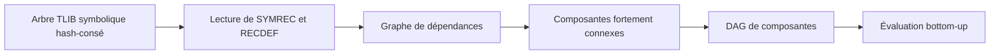

# Calcul bottom-up d’attributs sur les arbres récursifs

::: toc+
- **Objet** — définir le problème, le périmètre et les objectifs.
- **Modèle conceptuel** — séparer arbres, dépendances, algèbre, attributs et convergence.
- **Contrats génériques** — spécifier les paramètres de templates et leurs obligations.
- **Graphe de dépendances** — construire et condenser les dépendances avec DirectedGraph.
- **Algorithme d’évaluation** — calculer une fois les parties acycliques et itérer seulement dans les cycles.
- **Point fixe et accélération** — distinguer candidat, stabilisation et critère d’arrêt.
- **Intégration avec FaustAlgebra** — appliquer une algèbre Faust aux nœuds de signaux.
- **API proposée** — donner une première forme d’interface C++ sans figer l’implémentation.
- **Diagnostics et terminaison** — rendre les échecs et les approximations observables.
- **Tests de conformité** — couvrir arbres partagés, récursions et politiques de convergence.
- **Migration** — introduire le mécanisme progressivement sans casser les usages existants.
- **Questions ouvertes** — recenser les décisions qui demandent encore une expérimentation.
:::

## Objet

Cette spécification décrit un moteur générique de calcul d’attributs *bottom-up* sur des arbres TLIB, y compris lorsque ceux-ci représentent des définitions récursives. Le moteur associe un attribut de type `Attribute` à chaque nœud utile et calcule cet attribut à partir de ceux dont le nœud dépend.

Le moteur reçoit exclusivement des arbres récursifs en représentation symbolique. Cette restriction est un invariant de l’API, et non un détail d’implémentation : elle permet de conserver le hash-consing des termes, y compris des sous-termes récursifs non clos. La représentation par indices de de Bruijn est hors périmètre, car un terme non clos ne peut pas y être hash-consé indépendamment de son contexte de liaison.

Sur une partie acyclique, chaque attribut ne doit être calculé qu’une fois. Sur une partie cyclique, les attributs doivent être réévalués jusqu’à ce qu’une politique configurable reconnaisse un point fixe. La comparaison par égalité ne fait pas partie du moteur : certains domaines abstraits, notamment les intervalles, nécessitent une stabilisation par élargissement puis éventuellement par rétrécissement.

Les objectifs sont les suivants :

- rendre le type d’attribut, son initialisation et sa politique de convergence paramétrables ;
- utiliser une `FaustAlgebra<Attribute>` pour l’interprétation locale des arbres de signaux ;
- préserver le partage structurel des arbres et mémoïser les résultats ;
- identifier les composantes fortement connexes avec DirectedGraph ;
- limiter les recalculs aux nœuds réellement affectés dans une composante cyclique ;
- fournir des diagnostics précis en cas de non-convergence.

Cette première version spécifie le comportement attendu. Elle ne fixe ni le nom définitif des classes ni leur emplacement final entre `signals`, TLIB et DirectedGraph.

::: note [Portée initiale]
La première implémentation peut vivre dans la bibliothèque `signals`, où le décodage des constructeurs de signaux et `FaustAlgebra` sont disponibles. La séparation des contrats doit néanmoins permettre de migrer ensuite le moteur générique dans TLIB.
:::

## Modèle conceptuel

Le système distingue cinq éléments.

Attribut
:   Valeur calculée pour un nœud. Exemples : intervalle, type, coût, ensemble de variables libres ou propriété de causalité.

Algèbre
:   Interprétation locale d’un constructeur. Elle produit le candidat d’un nœud à partir des attributs de ses dépendances.

Résolveur de dépendances
:   Traduit les nœuds symboliques récursifs de TLIB et leurs définitions en un graphe explicite de dépendances entre unités de calcul.

Politique de point fixe
:   Fournit les valeurs initiales, stabilise les candidats successifs si nécessaire et décide quand une valeur est suffisamment stable.

Ordonnanceur
:   Condense le graphe en composantes fortement connexes, évalue le DAG résultant dans l’ordre bottom-up et pilote une file de travail à l’intérieur des cycles.

```adt
AttributeState ::= Unknown
                 | Known(Attribute)

Component ::= Acyclic(Node)
            | Cyclic(Set(Node))

Step ::= Candidate(Attribute)
       | Stable(Attribute)
       | Changed(Attribute)
```

Pour un nœud $n$ de constructeur $op$ et de dépendances $d_1, …, d_k$, le candidat est :

```math
c_n = \mathrm{op}_{\mathrm{Algebra}}(a_{d_1}, …, a_{d_k})
```

La valeur publiée n’est pas nécessairement ce candidat brut :

```math
a'_n = \mathrm{Stabilize}(n, a_n, c_n, \mathrm{contexte})
```

La composante est stable lorsque la politique accepte toutes les transitions pertinentes :

```math
\mathrm{Reached}(n, a_n, a'_n, contexte) = vrai
```

## Contrats génériques

### Type d’attribut

`Attribute` est un paramètre de template. Le moteur ne doit exiger implicitement ni constructeur par défaut, ni `operator==`, ni ordre total. Les opérations nécessaires sont fournies par les autres politiques.

Un attribut doit être copiable ou déplaçable selon le mode de stockage retenu. Une implémentation peut permettre des attributs immuables et partagés, par exemple `std::shared_ptr<const T>`, sans modifier l’algorithme.

### Algèbre locale

L’algèbre reçoit un nœud et les attributs déjà publiés de ses dépendances. Dans la spécialisation signaux, le décodage du nœud appelle l’opération correspondante de `FaustAlgebra<Attribute>`.

L’algèbre doit être déterministe relativement à ses arguments et à son contexte explicite. Elle ne décide ni de l’ordre global d’évaluation ni de la terminaison du point fixe.

### Initialisation

Une politique fournit la valeur initiale de chaque variable appartenant à une composante cyclique. Cette valeur peut dépendre du nœud et du contexte : élément bottom d’un treillis, intervalle maximal, type provisoire ou valeur définie par l’appelant.

Les nœuds acycliques n’ont pas besoin d’une valeur initiale : leur attribut est directement obtenu à partir de dépendances déjà calculées.

### Stabilisation

La stabilisation transforme le couple `(précédent, candidat)` en valeur courante. Sa forme minimale est l’identité sur le candidat. Pour une analyse abstraite, elle peut réaliser :

- une réunion monotone ;
- un élargissement après un nombre donné de changements ;
- une intersection ou un rétrécissement dans une phase ultérieure ;
- une normalisation qui évite des oscillations sans intérêt sémantique.

### Prédicat d’arrêt

Le prédicat reçoit au minimum la valeur précédente et la valeur courante. Il peut aussi consulter le nœud, le numéro d’itération, la phase et un état propre à la politique.

Il ne faut pas imposer `previous == current`. Un prédicat peut reconnaître une équivalence abstraite, une inclusion, une précision suffisante ou une tolérance numérique.

## Graphe de dépendances

### Orientation

Une arête `n → d` signifie que le calcul de `n` dépend de `d`. Cette convention correspond à celle de DirectedGraph et de ses `schedule`, où une dépendance doit précéder le nœud qui la consomme.

Les branches ordinaires d’un arbre engendrent donc des arêtes du parent vers les enfants. Le partage structurel de TLIB garantit qu’un même sous-arbre correspond à un même nœud de graphe, sous réserve que l’identité de l’unité de calcul soit bien l’identité du `Tree`.

### Récursion

Les formes récursives symboliques TLIB ne doivent pas être décrites comme un couple de nœuds distincts `rec(id, body)` et `ref(id)`. Concrètement :

- `rec(id, body)` construit ou retrouve par hash-consing le nœud symbolique interné `SYMREC(id)` ;
- le corps `body` est attaché à ce nœud par la propriété récursive `RECDEF` ;
- une occurrence récursive est ce même `Tree` symbolique partagé, et non un nœud de référence distinct ;
- dans les signaux Faust, le corps peut représenter un groupe et ses projections.

Le résolveur reconnaît un nœud `SYMREC(id)` et consulte sa propriété `RECDEF`. Il ajoute les arêtes entre ce nœud récursif partagé et les unités de calcul de son corps ou de ses projections. La revisite du même pointeur `Tree` ferme naturellement le cycle dans le graphe de dépendances ; elle ne crée aucune unité représentant une référence.

Un nœud symbolique récursif dépourvu de définition, ou une définition incompatible avec la projection demandée, est une erreur de construction et non une valeur bottom silencieuse. Le moteur n’accepte pas de forme de de Bruijn à son entrée ; une éventuelle conversion en représentation symbolique doit avoir lieu avant la préparation du plan.



### Composantes fortement connexes

Le moteur utilise `Tarjan<Node>` ou `graph2dag` de DirectedGraph. Une composante est cyclique si elle contient plusieurs nœuds ou si son unique nœud possède une boucle sur lui-même.

Le DAG des composantes est ordonnancé dépendances d’abord. Les composantes sans cycle sont évaluées une seule fois. Seules les composantes cycliques déclenchent une recherche de point fixe.

### Relations inverses

Pour éviter une réévaluation complète à chaque changement, le plan d’évaluation conserve aussi les dépendants immédiats. Si `n → d`, alors `n` appartient à `dependents[d]`. Lorsqu’un attribut de `d` change de manière significative, seuls ses dépendants dans la composante courante sont remis dans la file.

Le graphe, sa condensation, l’ordre des composantes et les relations inverses forment un plan réutilisable tant que la structure de l’arbre ne change pas.

## Algorithme d’évaluation

### Préparation

```algorithm "Construction du plan"
Input: racine root et résolveur de dépendances resolver
Output: plan d’évaluation plan
G ← resolver.build(root)
SCC ← Tarjan(G).partition()
DAG ← condensation de G selon SCC
order ← ordonnancement de DAG, dépendances d’abord
dependents ← arêtes inverses de G
return Plan(G, SCC, DAG, order, dependents)
```

### Composante acyclique

Pour une composante réduite à un nœud sans boucle, toutes les dépendances ont déjà un attribut publié. Le moteur appelle l’algèbre une fois, stocke le résultat et passe à la composante suivante.

### Composante cyclique

```algorithm "Point fixe local par file de travail"
Input: composante cyclique C, algèbre A, politique P et attributs externes cache
Output: attribut stable de chaque nœud de C
for n in C do
  current[n] ← P.initial(n)
  enqueue(worklist, n)
end
while worklist n’est pas vide do
  n ← dequeue(worklist)
  candidate ← A.evaluate(n, attributesOfDependencies(n, current, cache))
  next ← P.stabilize(n, current[n], candidate, context[n])
  if not P.reached(n, current[n], next, context[n]) then
    current[n] ← next
    for user in dependents[n] ∩ C do
      enqueueIfAbsent(worklist, user)
    end
  else
    current[n] ← P.publish(n, current[n], next, context[n])
  end
  P.checkBudget(context)
end
publish current dans cache
```

La file ne doit pas contenir plusieurs fois le même nœud. Son ordre initial doit être déterministe. Un ordre local obtenu en coupant les arêtes de retour peut améliorer la convergence, mais ne doit pas changer le résultat spécifié par la politique.

::: warning [Condition de propagation]
Le prédicat `reached` sert ici à décider si une transition peut être ignorée par les dépendants. Une politique dont la notion de convergence n’est pas locale doit fournir un contrôle au niveau de la composante, ou demander une passe finale complète avant publication.
:::

## Point fixe et accélération

### Trois responsabilités distinctes

Le calcul d’un point fixe ne doit pas être réduit à une seule opération `FixPointUpdate` :

1. l’algèbre calcule un candidat sémantique ;
2. la politique stabilise ce candidat relativement à l’historique ;
3. le prédicat reconnaît la convergence.

Cette séparation permet une politique exacte par égalité, une politique par tolérance et une analyse d’intervalles avec élargissement/rétrécissement sans modifier l’algèbre Faust.

### Phases optionnelles

Une politique peut organiser le calcul en plusieurs phases :

1. croissance depuis bottom ;
2. élargissement pour garantir ou accélérer la terminaison ;
3. rétrécissement borné pour récupérer de la précision ;
4. vérification finale du post-point fixe.

Une phase peut redémarrer la file de travail de la composante. Le nombre maximal d’itérations ou de changements doit être explicite et diagnostiqué.

### Obligations sémantiques

Le moteur ne peut pas prouver à lui seul la terminaison ni la correction d’une politique. Une politique documente :

- l’ordre abstrait ou la notion d’approximation utilisée ;
- les propriétés attendues de l’algèbre, notamment la monotonie éventuelle ;
- l’effet de `stabilize` sur la sûreté de l’approximation ;
- la signification exacte de `reached` ;
- la garantie de terminaison ou le budget de secours.

## Intégration avec FaustAlgebra

### Rôle

`FaustAlgebra<Attribute>` reste l’interface des primitives Faust : constantes, opérations numériques, délais, tables, éléments d’interface, etc. Un adaptateur de signaux :

1. reconnaît le constructeur du `Tree` ;
2. récupère les attributs de ses opérandes dans le cache ;
3. appelle la méthode correspondante de l’algèbre ;
4. retourne le candidat au moteur générique.

Le traitement structurel des nœuds symboliques récursifs `SYMREC`, de leur propriété `RECDEF`, des listes et des projections appartient au résolveur/adaptateur, et non aux opérations numériques de l’algèbre. Aucune opération de l’algèbre ne doit matérialiser un nœud de référence récursive distinct.

### `FixPointUpdate` existant

L’actuelle méthode virtuelle `FaustAlgebra<T>::FixPointUpdate(x, y)` mélange la stabilisation avec l’interprétation locale. Elle peut être conservée pendant la migration au moyen d’une politique adaptatrice :

```cpp
template <class Attribute, class Algebra, class Reached>
struct LegacyFaustFixpointPolicy {
    Algebra& algebra;
    Reached reached;

    Attribute stabilize(const Attribute& previous,
                        const Attribute& candidate)
    {
        return algebra.FixPointUpdate(previous, candidate);
    }
};
```

À terme, `FixPointUpdate` devrait être dépréciée dans `FaustAlgebra`, puis retirée lors d’une évolution d’API explicitement annoncée. La politique d’intervalle ne doit pas rester l’implémentation factice actuellement présente dans `intervalMissing.cpp`.

## API proposée

### Prototype expérimental

Un premier prototype header-only est disponible dans `signals/bottom-up-attributes.hh`. Il implémente la construction du graphe, la partition de Tarjan, l’ordonnancement du DAG condensé et une file de travail par composante cyclique. Son API reste expérimentale et sert à valider les contrats décrits ici avant toute migration vers TLIB.

Les tests de `tests/tests.cpp` couvrent actuellement un DAG avec partage, le point fixe entier `R = min(R + 1, 3)` et le point fixe asymptotique `X = (X + 2) / 2` arrêté par tolérance plutôt que par égalité exacte.

La forme suivante exprime les responsabilités sans constituer encore une API figée :

```cpp
template <class Attribute,
          class Evaluator,
          class DependencyResolver,
          class FixpointPolicy>
class BottomUpAttributes {
public:
    using node_type = typename DependencyResolver::node_type;

    BottomUpAttributes(Evaluator evaluator,
                       DependencyResolver resolver,
                       FixpointPolicy policy);

    EvaluationPlan<node_type> prepare(node_type root) const;

    Attribute evaluate(node_type root);
    Attribute evaluate(const EvaluationPlan<node_type>& plan);

    const Attribute& attribute(node_type node) const;
    const EvaluationReport& report() const;
};
```

Une politique minimale pourrait suivre ce protocole :

```cpp
struct FixpointPolicy {
    Attribute initial(Node node, FixpointContext& context);

    Attribute stabilize(Node node,
                        const Attribute& previous,
                        const Attribute& candidate,
                        FixpointContext& context);

    bool reached(Node node,
                 const Attribute& previous,
                 const Attribute& current,
                 FixpointContext& context);

    Attribute publish(Node node,
                      const Attribute& previous,
                      const Attribute& current,
                      FixpointContext& context);
};
```

Pour l’usage Faust envisagé :

```cpp
using Analysis = BottomUpAttributes<
    interval,
    FaustSignalEvaluator<interval, interval_algebra>,
    TlibRecursiveDependencyResolver,
    IntervalFixpointPolicy>;
```

Les objets de politique peuvent porter un état et être passés par valeur, référence ou pointeur selon les contraintes de durée de vie. Le concept C++ exact et l’éventuelle compatibilité C++11/C++17 restent à décider.

## Diagnostics et terminaison

Chaque évaluation produit au minimum :

- le nombre de nœuds et d’arêtes du graphe ;
- le nombre et la taille des composantes cycliques ;
- le nombre d’évaluations par nœud et par composante ;
- le nombre de stabilisations, élargissements et rétrécissements ;
- la cause d’arrêt de chaque composante ;
- le budget consommé et les nœuds encore instables en cas d’échec.

Une limite d’itérations, de changements ou d’évaluations est obligatoire comme garde-fou. Son dépassement doit produire un statut explicite `NotConverged`, accompagné de la composante et des dernières transitions. Le moteur ne doit pas publier silencieusement un résultat incomplet comme un point fixe valide.

Les autres erreurs comprennent au moins : entrée en représentation de de Bruijn, nœud `SYMREC` sans propriété `RECDEF`, projection récursive invalide, constructeur de signal non pris en charge, attribut demandé avant calcul et politique ayant produit une valeur invalide.

## Tests de conformité

### Structure et mémoïsation

- arbre ordinaire sans partage : résultat bottom-up attendu ;
- DAG avec sous-arbre partagé : une seule évaluation du sous-arbre ;
- plusieurs racines évaluées avec un même plan ou cache ;
- ordre stable entre exécutions.

### Récursion

- boucle sur un seul nœud ;
- cycle de deux nœuds ;
- composantes cycliques successives dans le DAG condensé ;
- cycle alimenté par une dépendance acyclique ;
- récursions imbriquées et groupes avec projections ;
- nœud `SYMREC` sans définition correctement rejeté ;
- entrée de de Bruijn correctement rejetée.

### Politiques

- égalité exacte sur un domaine fini ;
- convergence par équivalence sans `operator==` ;
- tolérance numérique ;
- croissance d’intervalles suivie d’un élargissement ;
- phase de rétrécissement bornée ;
- oscillation détectée par dépassement de budget.

### Intégration Faust

- comparer les résultats aux analyses existantes sur des signaux non récursifs ;
- comparer les types et intervalles sur les corpus récursifs ;
- vérifier les réponses impulsionnelles lorsque l’analyse influence le code généré ;
- mesurer le nombre de calculs avant et après ordonnanceur par composantes.

## Migration

1. Introduire dans `signals` un prototype avec `Attribute`, adaptateur Faust, politique et résolveur séparés.
2. Tester d’abord une algèbre simple sur des arbres ordinaires et partagés.
3. Ajouter la construction du graphe, Tarjan et l’évaluation des composantes cycliques.
4. Implémenter une politique d’intervalles avec diagnostics d’élargissement et de rétrécissement.
5. Comparer le prototype à l’inférence récursive actuelle de `sigtyperules.cpp`.
6. Stabiliser les concepts et les noms après mesures sur le corpus Faust.
7. Migrer le moteur indépendant de Faust dans TLIB ; conserver dans `signals` le décodage des constructeurs Faust.
8. Déprécier `FaustAlgebra::FixPointUpdate` seulement après disponibilité d’un adaptateur compatible.

Cette progression garde chaque étape testable et évite de coupler immédiatement TLIB à FaustAlgebra ou à la représentation particulière des signaux.

## Questions ouvertes

- L’unité de calcul doit-elle toujours être un `Tree`, ou faut-il représenter séparément chaque projection d’un groupe récursif ?
- La politique de convergence doit-elle décider localement par nœud, globalement par composante, ou offrir les deux niveaux ?
- Faut-il inclure directement DirectedGraph dans TLIB, ou injecter une stratégie de décomposition afin de garder TLIB indépendante ?
- Le plan doit-il accepter plusieurs racines et permettre une invalidation incrémentale ?
- Quel niveau du moteur est responsable de la parallélisation des composantes indépendantes ?
- Quel standard C++ minimal doit être préservé pour l’intégration au compilateur Faust ?
- Les attributs doivent-ils être stockés dans une table locale par évaluation, dans des propriétés TLIB optionnelles, ou dans un cache persistant explicitement fourni ?
- Comment formaliser la phase finale de vérification pour les politiques qui arrêtent sur approximation plutôt que sur égalité ?
