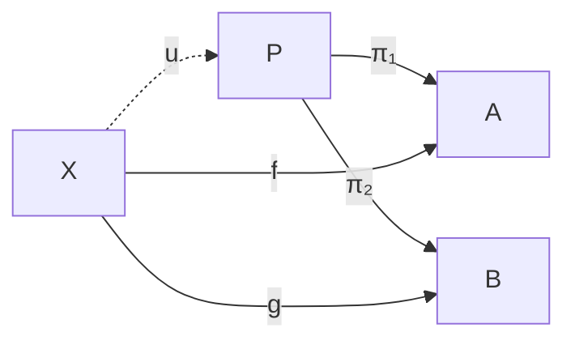
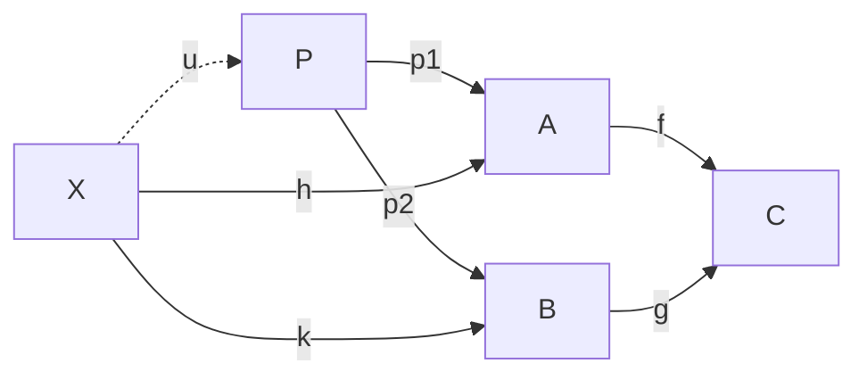
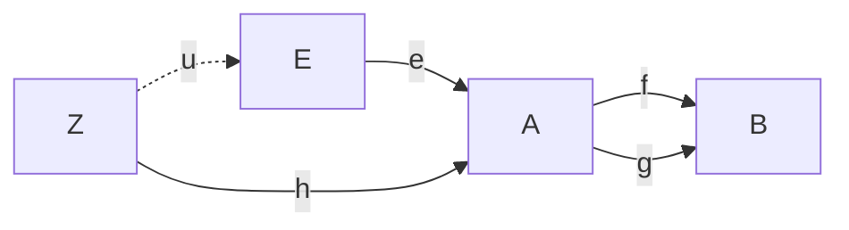
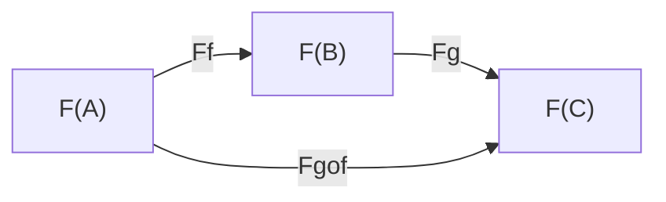

> **Statut :** livré — la fence `category` est disponible dans markpage. Ce
> document est la spécification de conception (grammaire, sémantique, rendu).

**Objet :** une syntaxe textuelle, intégrable en Markdown, pour décrire les diagrammes de théorie des catégories.

---

## 1. Motivation et principes

### 1.1 Problème

Un diagramme catégorique n'est pas un dessin : c'est la représentation graphique d'un foncteur $D : \mathcal{J} \to \mathcal{C}$ d'une petite catégorie « patron » $\mathcal{J}$ vers une catégorie ambiante $\mathcal{C}$. Le dessin est une *projection* de cet objet sur le plan ; le contenu mathématique est le foncteur lui-même.

Les langages existants couvrent mal le besoin d'une intégration Markdown :

- `tikz-cd` exige un compilateur LaTeX ; le source non compilé est peu lisible.
- `xymatrix` (paquet `xy`) souffre des mêmes limites et d'une syntaxe plus opaque.
- Mermaid sait dessiner des graphes, mais ignore la composition, le typage des morphismes et les propriétés universelles.

### 1.2 Stratégie d'implémentation

Le parser-typechecker de markpage produit un AST de catégorie présentée (objets / morphismes / équations / flèches induites). Deux backends de rendu coexistent :

- **SVG natif** (par défaut, §7.A) — moteur sur mesure pour la fourchette typique des diagrammes commutatifs (3-10 objets). Tire parti de la séparation arêtes squelettiques / raccourcis / induites pour placer les objets sur une grille où les morphismes générateurs deviennent strictement horizontaux ou verticaux, et garantit lignes droites + esthétique textbook (objets sans encadrement, têtes de flèche classiques, labels au milieu des arêtes).
- **Mermaid** (fallback, §7.B) — utilisé quand le renderer natif ne trouve pas de placement valide (topologie non plongeable sur grille). Hérite du moteur `dagre` au prix d'une esthétique moins canonique.

Notre travail à nous, dans tous les cas, se concentre là où ces deux moteurs sont aveugles — le typage des morphismes, la composition, le statut $\exists!$ des flèches universelles, la vérification de commutativité.

Voir §7 pour le détail des deux pipelines.

### 1.3 Objectifs de conception

| Principe | Conséquence syntaxique |
|---|---|
| **Dégradation gracieuse** | le source brut, sans rendu, transmet déjà la structure |
| **Déclaratif** | on décrit les morphismes et leurs types, jamais des coordonnées |
| **Fidélité mathématique** | la syntaxe encode un foncteur, pas un simple graphe |
| **Vérifiabilité** | le typage des compositions est contrôlable avant rendu |
| **Layout délégué** | placement géométrique sous-traité à Mermaid (`dagre`), §7 |

### 1.4 Le point central : signature + équations

Un diagramme **n'est pas un graphe** ; c'est un graphe *quotienté par des équations*. La spécification sépare donc deux strates :

- la **signature** — les objets et les morphismes générateurs ;
- les **équations** — les relations de commutativité, p. ex. `h = g . f`.

C'est la présentation d'une catégorie par générateurs et relations. La section des équations porte tout le sens de l'énoncé « le diagramme commute » : sans elle, on n'a qu'un graphe libre ; avec elle, une catégorie présentée.

---

## 2. Intégration Markdown

Un diagramme est un bloc de code clôturé dont l'identifiant de langage est `category` :

````markdown
```category
f : A -> B
g : B -> C
h : A -> C = g . f
```
````

Le choix du bloc de code garantit la **dégradation gracieuse** : un lecteur dont le moteur Markdown ignore `category` voit le bloc rendu comme du texte préformaté — toujours lisible. Un moteur compatible remplace le bloc par le diagramme rendu.

---

## 3. Grammaire

### 3.1 Grammaire complète (EBNF)

Une syntaxe **orientée ligne**, dans la convention des DSL graphes (Mermaid, Graphviz). Chaque ligne déclare une *seule* chose : une directive, un morphisme, ou une équation. Les objets sont **inférés** des endpoints des morphismes ; une déclaration explicite `objects:` reste possible pour les objets isolés ou pour activer la détection stricte des typos.

L'écriture des morphismes suit la convention CS / mathématique standard `f : A -> B` (« f est de type A → B »), reconnue par tout texte de catégorie ou type system.

```
diagram         ::= line+

line            ::= directive
                  | objects-decl
                  | morphism-decl
                  | induced-decl
                  | equation
                  | comment

directive       ::= "direction:" ("TB" | "BT" | "LR" | "RL")
objects-decl    ::= "objects:" objlist     # optionnel
objlist         ::= ident ("," ident)*

morphism-decl   ::= ident ":" ident "->" ident modifier? equation-suffix?
modifier        ::= "(" prop ("," prop)* ")"
equation-suffix ::= "=" path
prop            ::= "epi" | "mono" | "iso"

induced-decl    ::= ident ":" ident "->" ident "by" "(" arglist ")"
arglist         ::= (ident ("," ident)*)?       # vide pour les universels absolus (terminal / initial)

equation        ::= path "=" path
path            ::= ident ("." ident)*

ident           ::= name ("(" arglist-id ")")?  # `F(X)`, `G(h)` : un niveau de parenthèses équilibrées
name            ::= letter (letter | digit | "_")*
arglist-id      ::= ident ("," ident)*
comment         ::= "#" { any-char-but-newline }
```

### 3.2 Notes de lecture

- **Lignes indépendantes** : chaque ligne est une déclaration complète. Pas de mot-clé de section, pas d'ordre obligatoire. Le parser distingue les types de lignes par leurs tokens (`:` + `->` → morphisme ; `by` + parenthèses → induit ; `=` sans `->` ni `:` → équation ; `direction:` ou `objects:` → directive).
- **Inférence des objets** : tout identifiant cité comme domaine ou codomaine dans une déclaration `morphism-decl` ou `induced-decl` est implicitement un objet. La déclaration `objects:` n'est utile que pour (a) déclarer des objets isolés sans morphisme incident, ou (b) activer une validation stricte qui rejette tout endpoint absent de la liste.
- **Commentaires** : tout ce qui suit `#` jusqu'à la fin de ligne est ignoré. Lignes vides ignorées aussi.
- **Identifiants** : les parenthèses sont admises pour autoriser `F(X)`, `G(h)`, `Hom(A, B)` — l'application d'un foncteur fait partie du nom de l'objet ou du morphisme.
- **Sensibilité à la casse** : `A` et `a` sont distincts.
- **Unicode** : `letter` et `digit` suivent les **catégories Unicode L (letter, toutes sous-catégories) et N (number, toutes sous-catégories)** — *pas* limités à l'ASCII. Greek (`π`, `α`, `Γ`), indices/exposants Unicode (`₁`, `²`), blackboard bold (`ℕ`, `ℝ`) participent naturellement. Cohérent avec ce que produit la couche ligatures de l'éditeur (§7.B.6) — `\pi_1` devient `π₁`, un identifiant unique valide.
- **Mots-clés réservés** : `direction`, `objects`, `by`, `epi`, `mono`, `iso`, et les valeurs de direction `TB`, `BT`, `LR`, `RL`. Ne peuvent pas servir de nom d'objet ni de morphisme.

### 3.3 Disambiguation par tokens

Le parser classifie chaque ligne par les tokens qu'elle contient :

| Tokens présents | Type |
| --- | --- |
| commence par `direction:` | directive de layout |
| commence par `objects:` | déclaration explicite optionnelle |
| contient `:` et `->`, **avec** `by (…)` | morphisme induit |
| contient `:` et `->`, **avec** `= path` après les endpoints et modificateurs | morphisme + équation de raccourci |
| contient `:` et `->`, sans `by` ni `= path` | morphisme simple |
| contient `=` sans `:` ni `->` | équation autonome |
| commence par `#` ou vide | commentaire / blanc |

---

## 4. Sémantique des constructions

### 4.1 Objets — inférés ou déclarés

Les objets sont **inférés** des endpoints des morphismes : tout identifiant cité comme domaine ou codomaine devient un objet. Le triangle `f : A -> B`, `g : B -> C`, `h : A -> C` produit l'ensemble $\text{Ob}(\mathcal{J}) = \{A, B, C\}$ sans déclaration explicite.

La directive **optionnelle** `objects:` sert deux cas :

- **Objet isolé** sans morphisme incident (rare en pratique mais syntaxiquement légal) ;
- **Validation stricte des typos** : quand `objects:` est présente, tout endpoint de morphisme absent de la liste déclenche une erreur (« objet inconnu `Aaa` ») au lieu d'être silencieusement créé.

```category
# Objets inférés — pas de déclaration nécessaire
f : A -> B
g : B -> C
```

```category
# Déclaration explicite — un endpoint en dehors de la liste serait rejeté
objects: A, B, C
f : A -> B
g : B -> C
```

### 4.2 Morphismes — les générateurs

Chaque ligne `f : A -> B` déclare un morphisme *(nom, domaine, codomaine)*. Ces morphismes sont les **générateurs** de $\text{Mor}(\mathcal{J})$ ; les autres morphismes du diagramme (les composés) existent par composition mais ne sont pas listés — sauf comme **raccourcis** déclarés (§4.3 ci-dessous).

```category
f : A -> B
g : B -> C
```

#### Modificateurs

Un morphisme peut porter des annotations de propriété entre parenthèses :

| Modificateur | Signification | Rendu suggéré |
| --- | --- | --- |
| `(mono)` | monomorphisme | label suffixé `↣` |
| `(epi)` | épimorphisme | label suffixé `↠` |
| `(iso)` | isomorphisme | label suffixé `≅` |

```category
i : A -> B (mono)
p : B -> A (epi)
```

Un morphisme **identité** n'est pas un modificateur : `id_A : A -> A` est simplement un morphisme dont domaine et codomaine coïncident.

### 4.3 Équations — le quotient

Une **équation autonome** `path = path` impose une relation de commutativité, sur une ligne sans `:` ni `->` :

```category
f : A -> B
g : B -> C
h : A -> C

h = g . f          # équation autonome
```

Quand un morphisme déclaré n'est qu'un **raccourci visuel** pour une composition, l'équation peut se loger **dans la déclaration** du morphisme via le suffixe `= path` :

```category
f : A -> B
g : B -> C
h : A -> C = g . f          # raccourci co-localisé
```

Les deux formes sont sémantiquement équivalentes ; la seconde est préférée quand l'équation **définit** le morphisme à elle seule.

#### Composition : la règle de réécriture

Un `path` est une suite d'identifiants séparés par des points. Il se lit **de droite à gauche**, conformément à la convention $g \circ f$ (« $f$ puis $g$ ») :

```
g . f   ⟿   g ∘ f
```

La règle de réécriture associée, avec sa condition de bord :

```
COMPOSE :   p . q   est bien typé   ssi   cod(q) = dom(p)
            et alors   dom(p . q) = dom(q)   et   cod(p . q) = cod(p)
```

Une équation `lhs = rhs` est **bien formée** ssi `lhs` et `rhs` sont des chemins bien typés *et* partagent même domaine et même codomaine :

```
WELLTYPED-EQ :   dom(lhs) = dom(rhs)   et   cod(lhs) = cod(rhs)
```

Un vérificateur rejette toute équation mal typée **avant** le rendu.

### 4.4 Morphismes induits — les flèches universelles

C'est la construction qui distingue `category` d'une syntaxe de graphe. Un morphisme dont la déclaration porte la clause **`by (…)`** est typographiquement marqué comme **induit par une propriété universelle** (pullback, produit, équaliseur, …). La clause est une **assertion de l'auteur**, pas une preuve : markpage ne vérifie pas que les hypothèses d'une propriété universelle sont effectivement réunies. Visuellement, le morphisme induit est rendu **en pointillés** ; les arguments `(h, k)` sont enregistrés mais pas représentés graphiquement.

```category
pi1 : P -> A
pi2 : P -> B
f   : X -> A
g   : X -> B
u   : X -> P by (f, g)

pi1 . u = f
pi2 . u = g
```

La clause `by (f, g)` enregistre les morphismes dont $u$ est la factorisation. Conséquences :

- **Logique** : $u$ porte un statut $\exists!$ — elle existe et est unique.
- **Rendu** : ce statut justifie un tracé en pointillés. Le style visuel est une *conséquence* du statut logique, jamais une décision arbitraire.

Pour les **universels absolus** (objet terminal, objet initial), la liste d'arguments est vide :

```category
t : A -> T by ()
```

Une seule ligne : `T` est inféré comme codomaine, `A` comme domaine, et `t` est l'unique morphisme universel de `A` vers `T`.

---

## 5. Un seul point d'entrée

La v1 expose **uniquement** le bloc `category` déclaratif. Pas de
notation inline alternative ni de syntaxe ASCII positionnelle :

- **Cohérence pédagogique** — une seule syntaxe à apprendre, une seule
  surface API à maintenir.
- **Cohérence avec le principe « pas de coordonnées »** (§1.3) — toute
  syntaxe positionnelle entrerait en concurrence avec le layout calculé
  par le backend, et fragiliserait l'invariant « ce qui change, c'est
  le diagramme, pas son dessin ».
- **Verbosité maîtrisée** — le bloc déclaratif reste très court même
  pour un triangle (4 lignes), un carré (6 lignes). On ne sauve pas
  grand-chose à inventer une syntaxe plus dense.

Si l'usage révèle plus tard un cas vraiment courant qui mériterait
une forme abrégée, on l'ajoutera après coup — toujours en transpilant
vers la même représentation interne. Pour v1, le bloc `category` est
le point d'entrée canonique.

---

## 6. Exemples complets

### 6.1 Triangle commutatif

`h` est un raccourci pour `g ∘ f` — équation co-localisée avec la déclaration.

```category
f : A -> B
g : B -> C
h : A -> C = g . f
```

### 6.2 Propriété universelle du produit

`u` est induit par la paire `(f, g)` — clause `by` sur la même ligne. Les deux équations qui suivent expriment la commutativité du cône.

```category
pi1 : P -> A
pi2 : P -> B
f   : X -> A
g   : X -> B
u   : X -> P by (f, g)

pi1 . u = f
pi2 . u = g
```

### 6.3 Coproduit (le dual)

Obtenu en renversant toutes les flèches du produit — illustration du principe de dualité.

```category
i1 : A -> S
i2 : B -> S
f  : A -> X
g  : B -> X
v  : S -> X by (f, g)

v . i1 = f
v . i2 = g
```

### 6.4 Carré de naturalité

```category
Fh    : F(X) -> F(Y)
Gh    : G(X) -> G(Y)
eta_X : F(X) -> G(X)
eta_Y : F(Y) -> G(Y)

Gh . eta_X = eta_Y . Fh
```

### 6.5 Pullback (cône au-dessus d'un cospan)

Le pullback diffère du produit : l'apex `P` n'est plus libre, il est contraint par la commutativité de la *cospan* `A → C ← B`. Le `u : X -> P` factorise toute paire `(h, k)` qui rend le cône extérieur commutatif.

```category
f  : A -> C
g  : B -> C
p1 : P -> A
p2 : P -> B
h  : X -> A
k  : X -> B
u  : X -> P by (h, k)

f . p1 = g . p2          # le carré du pullback commute
f . h  = g . k           # cône externe au-dessus de C
p1 . u = h
p2 . u = k
```

### 6.6 Pushout (dual du pullback)

Obtenu en renversant toutes les flèches.

```category
f  : C -> A
g  : C -> B
i1 : A -> P
i2 : B -> P
h  : A -> X
k  : B -> X
u  : P -> X by (h, k)

i1 . f = i2 . g
h . f = k . g
u . i1 = h
u . i2 = k
```

### 6.7 Égaliseur (paire parallèle)

Deux morphismes `f, g : A -> B` partagent les mêmes endpoints — la grammaire les distingue par leurs noms distincts.

```category
f : A -> B
g : A -> B          # paire parallèle, mêmes endpoints
e : E -> A
h : Z -> A
u : Z -> E by (h)

f . e = g . e       # cône de l'égaliseur
f . h = g . h       # cône externe
e . u = h           # factorisation universelle
```

### 6.8 Coégaliseur (dual de l'égaliseur)

```category
f : A -> B
g : A -> B
q : B -> Q
h : B -> Z
u : Q -> Z by (h)

q . f = q . g
h . f = h . g
u . q = h
```

### 6.9 Fonctorialité de la composition

Encode `F(g ∘ f) = F(g) ∘ F(f)` — l'axiome de préservation des compositions par un foncteur. Pas d'induction, juste une équation de raccourci. Les identifiants `F(A)` exercent la grammaire récursive de §3.1.

```category
Ff   : F(A) -> F(B)
Fg   : F(B) -> F(C)
Fgof : F(A) -> F(C) = Fg . Ff
```

### 6.10 Objet terminal

L'objet terminal `T` : pour tout objet, une unique flèche vers `T`. Le cas particulier de la *forme absolue* `by ()` — arglist vide, l'unicité ne dépend d'aucun morphisme antérieur. Une seule ligne suffit.

```category
t : A -> T by ()
```

L'objet initial est le dual exact : `i : I -> A by ()`.

---

## 7. Stratégie de rendu

Deux moteurs cohabitent. Le **renderer SVG natif** (§7.A) est appliqué par défaut : il est optimisé pour les petits diagrammes typiques (3-6 objets, jusqu'à une dizaine) et garantit l'esthétique attendue par les mathématiciens — lignes droites, objets sans encadrement, placement canonique. Le **backend Mermaid** (§7.B) sert de filet de sauvetage quand le renderer natif échoue (topologie qu'il ne sait pas plonger sur grille).

---

## 7.A Renderer SVG natif (par défaut)

### 7.A.1 Justification

Les algorithmes de layout généraux (`dagre`, `elk`) sont conçus pour des graphes de centaines voire milliers de nœuds — ils privilégient la robustesse au détriment de l'esthétique sur les *petits* cas. Pour 3 à 10 objets — la fourchette de tous les diagrammes commutatifs courants — un algorithme *ad hoc* qui exploite la structure (séparation arêtes squelettiques / raccourcis / induites) produit des dessins de qualité textbook sans recourir à des heuristiques coûteuses.

Le code reste raisonnable : ~400-500 lignes de SVG explicite, sans dépendance, avec contrôle total sur typographie, têtes de flèche, placement des labels.

### 7.A.2 Classification des arêtes

Trois statuts différents, lus depuis l'AST :

- **Squelettique** — morphisme déclaré sans clause `by` ni équation de raccourci (`= path`). Représente une arête « primitive » de la structure, à placer sur la grille.
- **Raccourci** — morphisme dont la déclaration porte un suffixe `= path` avec `|path| > 1`, **ou** qui apparaît comme membre d'une équation autonome `m = path` (avec `path` ne contenant aucun induit). C'est un raccourci visuel pour une composition (typiquement `h : A -> C = g . f` dans un triangle). Une équation comme `pi1 . u = f` avec `u` induit ne marque pas `f` comme raccourci : la composition contient un induit, l'équation décrit la propriété universelle de `u`, pas une définition de `f`.
- **Induite** — morphisme avec clause `by (…)` dans sa déclaration. Statut $\exists!$, toujours dessinée distinctement (pointillé).

### 7.A.3 Phase 1 — placement sur grille

L'objectif : trouver des positions `(x, y) ∈ ℤ²` pour chaque objet telles que **chaque arête squelettique relie deux cases voisines** (distance de Manhattan = 1, donc trait strictement horizontal ou vertical). Les arêtes raccourcis et induites n'imposent aucune contrainte de placement — elles seront tracées en diagonale.

Algorithme BFS avec backtracking :

1. Choisir l'objet *ancre* : celui ayant le degré squelettique maximal. Le placer à `(0, 0)`.
2. Pile = `[ancre]`. Tant que la pile n'est pas vide :
   - Dépiler `O`. Pour chaque arête squelettique `(O, P)` ou `(P, O)` où `P` n'est pas placé :
     - Énumérer les 4 cases adjacentes à `O` (`±1` en x ou y).
     - Pour chaque candidat libre (pas d'objet déjà placé dessus), brancher.
     - Empiler `P`.
3. Scorer chaque placement complet par :
   - `+10` par arête squelettique satisfaite (H/V de distance 1).
   - `-5` par collision visuelle (deux arêtes sur la même droite grille, sans gap).
   - `-1` par objet non placé (composante déconnectée du squelette).
4. Retenir la meilleure solution. Normaliser (translation pour avoir `min(x) = min(y) = 0`).

Borne pratique : pour `n ≤ 6`, l'arbre de recherche est ≤ 4ⁿ branches = ~4000, instantané. Pour `n` jusqu'à 10 : ajout d'une heuristique de coupure (abandonner les branches dont le score partiel est déjà inférieur à la meilleure complète).

### 7.A.4 Phase 2 — rendu SVG

Une fois les positions calculées, paramètres en `em` (donc proportionnels à la taille de police du conteneur, pour préservation lors du zoom et impression PDF) :

| Élément | Spécification |
|---|---|
| Cellule de grille | `cellSize = 4em` carré |
| Marge SVG | `padding = 1em` autour du contenu |
| Label d'objet | texte centré aux coordonnées `(x * cellSize, y * cellSize)`, font hérité du body, **pas de cadre ni de fond** |
| Arête squelettique | `<line>` droit entre les *bords* des deux objets (offset de `0.6em` pour ne pas toucher le glyphe) |
| Arête raccourci | `<line>` droit diagonal, idem offset bord-à-bord |
| Arête induite | `<line stroke-dasharray="3,3">` (pointillé) |
| Tête de flèche | triangle SVG à l'extrémité cible, taille `0.5em` côté |
| Label d'arête | texte au point milieu, offset perpendiculaire `0.4em` du côté qui ne masque pas le trait, `font-size: 0.9em` |
| Style global | `currentColor` partout — hérite la couleur de texte ambiante |

Stratégie d'offset pour les labels d'arête : pour une arête horizontale, label *au-dessus* (offset y négatif) ; verticale, label *à droite* (offset x positif) ; diagonale, perpendiculaire à la pente, du côté qui ne croise pas un autre objet. Pour les **paires parallèles** (deux arêtes squelettiques entre les mêmes endpoints, ex. égaliseur `f, g : A → B`), offset opposé : une au-dessus, une en-dessous.

### 7.A.5 Cas spéciaux

- **Paire parallèle** (deux morphismes squelettiques `f, g : A → B`) : tracer les deux arêtes avec un léger offset perpendiculaire (l'une à `+0.3em`, l'autre à `-0.3em`) et placer les labels sur le côté correspondant. Visuellement on voit deux traits côte à côte avec leurs étiquettes.
- **Boucle** (`f : A → A`) : arc de cercle au-dessus de l'objet, label au sommet de l'arc.
- **Arêtes coïncidentes** (raccourci dont la diagonale traverse un autre objet) : courbure légère (arc de Bézier au lieu d'un trait droit) pour passer à côté.

### 7.A.6 Fallback : layout polygonal

Quand l'algorithme BFS ne trouve pas de placement valide (score < 0, ou squelette contient un 3-cycle de générateurs `A → B → C → A` qui ne peut pas se plonger sur ℤ²), il bascule sur une disposition polygonale :

- Placer les `n` objets aux sommets d'un polygone régulier de rayon `R = cellSize * n / (2π)`.
- Toutes les arêtes deviennent des cordes du polygone (lignes droites garanties).
- L'esthétique est moins canonique mais le rendu reste lisible.

### 7.A.7 Validation sur le corpus §6

Trace des placements attendus pour les exemples canoniques :

| § | Diagramme | Placement attendu |
| --- | --- | --- |
| 6.1 | Triangle (`f, g, h=g.f`) | `A(0,0)`, `B(1,0)`, `C(1,-1)` — L parfaite, `h` diagonal de A à C |
| 6.2 | Produit | `P(0,0)`, `A(-1,0)`, `B(1,0)`, `X(0,1)`, `u(X→P)` diagonal vertical |
| 6.4 | Carré naturalité | `F(X)(0,1)`, `F(Y)(1,1)`, `G(X)(0,0)`, `G(Y)(1,0)` — carré 2×2 |
| 6.5 | Pullback | `P(0,1)`, `A(1,1)`, `B(0,0)`, `C(1,0)`, `X(-1,1)` — carré + cône à gauche |
| 6.7 | Égaliseur | `E(0,0)`, `A(1,0)`, `B(2,0)`, `Z(1,1)` — paire parallèle `f, g` côte à côte |
| 6.9 | Fonctorialité | `F(A)(0,0)`, `F(B)(1,0)`, `F(C)(1,-1)` — L (comme triangle) |
| 6.10 | Terminal | `A(0,0)`, `T(1,0)`, `t` induit horizontal pointillé |

Pour chacun le BFS retiendra cette grille parce que c'est elle qui maximise le score (toutes les arêtes squelettiques sont H/V de distance 1).

---

## 7.B Backend Mermaid (fallback)

### 7.B.1 Quand l'utiliser

Le fallback est activé automatiquement quand le renderer SVG natif
ne trouve pas de placement satisfaisant : score final inférieur à
un seuil (typiquement lié à `n`), indiquant qu'aucun plongement sur
grille acceptable n'existe pour cette topologie. Le moteur logue un
avertissement et bascule sur Mermaid sans intervention de
l'utilisateur. (Une directive `renderer: mermaid` explicite en tête
de bloc pourrait être ajoutée à la grammaire si le besoin de
forçage manuel se présente — pas implémentée pour l'instant.)

### 7.B.2 Justification historique

Écrire un moteur de layout générique pour diagrammes commutatifs représenterait plusieurs milliers de lignes : algorithme de placement (force-directed ou *layered*), gestion de chevauchements, courbure de flèches qui passent au-dessus d'objets, choix de directions selon la topologie. C'est précisément ce que `dagre` — l'algorithme derrière Mermaid — fait déjà très bien pour la classe de graphes orientés qui nous concerne.

Mermaid est par ailleurs **déjà une dépendance** de markpage : un bloc `category` qui se compile vers du Mermaid réutilise le pipeline existant (rendu SVG, cache, export PDF, paginé).

### 7.B.3 Le pipeline en trois étapes

```
category source
      │
      ▼
[1] parser + AST           — §3 (grammaire)
      │
      ▼
[2] typechecker            — §4.3 (COMPOSE, WELLTYPED-EQ)
      │
      ▼  (rejet visible si mal typé : message d'erreur)
      │
[3] émetteur Mermaid       — §7.B.4 (table de correspondance)
      │
      ▼
mermaid `graph TB` source
      │
      ▼
pipeline mermaid existant  — dagre + rendu SVG
```

Le découpage en trois passes (parser / typechecker / émetteur) permet de tester chacune en isolation et de produire un diagnostic clair quand quelque chose cloche. Le typechecker **précède** la transpilation : l'utilisateur ne voit jamais un message d'erreur Mermaid énigmatique sur un diagramme dont l'erreur est conceptuelle.

### 7.B.4 Table de correspondance

| Construit `category` | Construit Mermaid émis |
|---|---|
| `objects: A, B, C` | un nœud par identifiant — `A[A]`, `B[B]`, `C[C]` |
| `f : A -> B` | arête solide étiquetée — `A -- f --> B` |
| `f : A -> B (mono)` | arête solide, label suffixé `↣` — `A -- "f ↣" --> B` |
| `f : A -> B (epi)` | arête solide, label suffixé `↠` — `A -- "f ↠" --> B` |
| `f : A -> B (iso)` | arête solide, label suffixé `≅` — `A -- "f ≅" --> B` |
| `u : X -> P by (f, g)` | arête **pointillée** étiquetée — `X -. u .-> P` |
| équations autonomes `path = path` | non transpilé — sert uniquement au typechecker |

La clause `by (...)` n'est pas rendue visuellement ; elle informe le typechecker du caractère universel de `u` et déclenche le style pointillé Mermaid `-. .->`.

Les équations ne se voient pas dans le diagramme rendu (Mermaid n'a rien pour ça) — elles vivent dans la prose autour, ou dans le typechecker qui les a validées. Une amélioration future pourrait afficher un *badge* `commutes ✓` à côté du diagramme quand toutes les équations sont vérifiées.

### 7.B.5 Choix de direction

Mermaid demande `graph TB` (top-bottom), `graph LR` (left-right), `BT`, ou `RL`. Heuristique appliquée :

- **2 objets** → `LR`
- **3 objets en triangle** (ABC + 3 morphismes) → `LR`, le 3ème objet placé sous l'arête diagonale par `dagre`
- **4 objets en carré** (pullback, naturalité) → `LR` si les générateurs forment un cycle clair, sinon `TB`
- **« objet universel » + cible** (terminal, équation au-dessus) → `TB`, l'objet universel au sommet
- **Par défaut** → `LR`

L'utilisateur peut forcer la direction via une **directive en-tête optionnelle** :

```category
direction: TB
f : A -> B
…
```

### 7.B.6 Typographie mathématique des labels (commune aux deux backends)

Mermaid ne rend pas LaTeX dans ses étiquettes. **L'éditeur s'en charge en amont** : la table de ligatures de `src/editor-ligatures.ts` substitue dès la frappe `\pi` → `π`, `\eta` → `η`, etc., ainsi que les indices et exposants chiffrés (`\pi_1` → `π₁`, `f^-1` → `f⁻¹`, `e^x_2` → `eˣ₂` après suffixage chiffré). Le source `category` arrive donc à notre parser **déjà en Unicode** ; la transpilation vers Mermaid est un passthrough propre, pas une seconde couche de substitution.

Couverture pratique : lettres grecques (toutes), indices et exposants à un chiffre (et `^-N` négatifs), opérateurs courants. ~95 % des labels rencontrés dans les diagrammes typiques.

::: note [Limite restante (différée à une éventuelle v2)]
Les labels qui sortent du périmètre Unicode (`\sum_{i=0}^n`, fractions, accents empilés, indices alphabétiques au-delà des quelques `ᵢⱼₓ` disponibles) rendent leur source LaTeX littéralement. Pour les traiter, il faudrait parser le SVG Mermaid après rendu et remplacer les `<text>` des labels concernés par des `<foreignObject>` contenant un rendu MathJax — gestion non triviale des coordonnées et tailles, à implémenter si une vraie demande émerge.
:::

### 7.B.7 Exemple complet de transpilation Mermaid

Source `category` tel qu'il apparaît dans l'éditeur **après** que les ligatures aient agi (l'utilisateur a tapé `\pi_1` et `\pi_2`, l'éditeur les a remplacés en temps réel par `π₁` et `π₂`) :

```category
π₁ : P -> A
π₂ : P -> B
f  : X -> A
g  : X -> B
u  : X -> P by (f, g)

π₁ . u = f
π₂ . u = g
```

Mermaid émis (les noms d'identifiants passent en l'état, aucune nouvelle substitution dans le transpilateur) :



Le typechecker a validé les deux équations avant émission ; elles ne paraissent pas dans le rendu (mais auraient bloqué la transpilation si elles avaient été mal typées).

### 7.B.8 Trois transpilations supplémentaires (corpus de validation Mermaid)

Pour s'assurer que la stratégie Mermaid tient sur des topologies variées, voici les sorties attendues pour trois des exemples §6 les plus exigeants. (Une fois Phase 1 codée, ces extraits deviendront des snapshots de test.)

**§6.5 Pullback** — 5 objets, cône externe `X`, flèche induite pointillée.



Le layout `dagre` placera vraisemblablement `X` en haut à gauche, `P` au milieu, le cospan `A → C ← B` à droite — pas le carré canonique de Mac Lane, mais lisible. L'utilisateur peut forcer `direction: TB` pour rapprocher du dessin classique.

**§6.7 Égaliseur** — la paire parallèle `f, g : A -> B` est rendue par deux arêtes étiquetées distinctes (l'utilisateur verra deux flèches presque superposées, étiquetées différemment).



`dagre` dessine deux arêtes parallèles distinctes ; certains thèmes Mermaid les *courbent* légèrement pour éviter le chevauchement. Acceptable. Si la séparation visuelle est insuffisante, une amélioration future pourrait préfixer les labels par un séparateur invisible.

**§6.9 Fonctorialité** — démontre qu'aucune `induced` n'est nécessaire pour les diagrammes purement équationnels ; les équations sont validées par le typechecker mais n'apparaissent pas dans le rendu (Mermaid n'a rien pour les afficher).



Note : les parenthèses dans les noms d'objets nécessitent un quoting `["F(A)"]` côté Mermaid (les `(` y sont des delimiters de forme de nœud). Le générateur les ajoute automatiquement quand un identifiant contient un caractère non-alphanumérique.

---

## 8. Conformité d'un moteur de rendu

Un moteur est dit **conforme** à la version 0.1 s'il satisfait les points suivants.

1. **Analyse** — il accepte toute entrée conforme à la grammaire du §3 et rejette les autres avec un diagnostic de position.
2. **Typage** — il vérifie les règles `COMPOSE` et `WELLTYPED-EQ` du §4.3 et rejette les diagrammes mal typés avant rendu.
3. **Résolution des objets/morphismes** — il vérifie que tout objet cité dans un morphisme, et tout morphisme cité dans une équation ou une clause `by`, est préalablement déclaré.
4. **Dégradation** — en l'absence de support, le bloc reste affiché comme texte préformaté (garanti par l'usage d'un bloc de code Markdown standard).
5. **Style induit** — il rend les flèches de la section `induced` dans un style distinct (pointillés recommandés).
6. **Stabilité d'émission** — pour une entrée donnée, le source Mermaid émis (ou l'équivalent SVG) est déterministe ; cela permet la mise en cache et les snapshots de tests.

Les points de placement géométrique (positions, courbure des flèches) ne sont **pas** normés : l'implémentation de référence markpage délègue à `dagre` via Mermaid ; un autre moteur conforme pourrait utiliser `tikz-cd` côté LaTeX, par exemple.

---

## 9. Limites connues et travaux futurs

### 9.1 Limites conceptuelles (héritées de la syntaxe)

- **2-cellules.** La syntaxe couvre les diagrammes 1-catégoriques. Les transformations naturelles dessinées comme flèches doubles *entre* des flèches (2-cellules) ne sont pas exprimables : le texte linéaire ne capture pas cette 2-dimensionnalité. Une section `cells:` est envisagée pour une version ultérieure.
- **Diagrammes de cordes (string diagrams).** Hors périmètre. Ils relèvent d'une syntaxe géométrique à part entière, où la déformation continue du dessin *est* une preuve d'égalité — ce n'est plus une notation mais un calcul.
- **Catégories ambiantes.** La spécification décrit le patron $\mathcal{J}$ et ses relations, mais ne nomme pas la catégorie ambiante $\mathcal{C}$ ni l'interprétation concrète des objets. Une extension pourrait ajouter une section `in: Set` et des liaisons `A := {...}`.
- **Sémantique formelle.** La fonction d'interprétation qui envoie une expression `category` vers le foncteur $D$ qu'elle dénote n'est pas encore spécifiée ; elle ferait l'objet d'une annexe dédiée.

### 9.2 Limites héritées du backend Mermaid

Le choix de transpiler vers Mermaid (§7) apporte des bénéfices considérables au prix de quelques contraintes :

- **Esthétique du layout.** `dagre` produit des placements valides et lisibles, mais pas toujours canoniques. Un pullback ne « ressemblera » pas forcément à un carré avec l'objet universel en haut à gauche tel qu'on le trouve dans Mac Lane. Pour les diagrammes très spécifiques (snake lemma, sphères de Postnikov), un rendu manuel via tikz-cd reste préférable.
- **Affichage des équations.** Mermaid ne sait pas annoter visuellement un diagramme avec « commute » ou afficher l'équation à côté. Les équations sont validées par le typechecker mais n'apparaissent pas dans le rendu (l'utilisateur les écrit en prose autour).
- **Typographie des labels.** La couche de ligatures de l'éditeur (§7.B.6) couvre lettres grecques + indices/exposants chiffrés — soit ~95 % des cas. Les expressions plus complexes (`\sum_{i=0}^n`, fractions empilées, indices alphabétiques étendus) rendront littéralement le source LaTeX tant qu'une couche MathJax dans `<foreignObject>` n'est pas implémentée.
- **Modificateurs visuels.** `mono`/`epi`/`iso` sont rendus par un caractère Unicode suffixé au label, faute de styles de tête de flèche dans Mermaid. C'est lisible mais ne suit pas la convention typographique du « crochet » des flèches en LaTeX.
- **Pas de courbure manuelle.** L'utilisateur ne peut pas demander à une flèche de passer au-dessus d'une autre par un arc particulier — `dagre` choisit.

### 9.3 Limites du renderer SVG natif

Le renderer SVG natif (§7.A) lève la plupart des limites Mermaid mais introduit ses propres bornes :

- **Plongement en grille requis.** L'algorithme BFS ne marche que si le sous-graphe squelettique se plonge sur ℤ² avec arêtes de distance 1. Un 3-cycle de morphismes générateurs (`A → B → C → A` sans aucune équation) n'admet pas de plongement valide — fallback automatique sur le polygone régulier ou sur Mermaid.
- **Diagrammes très grands.** Au-delà de ~10 objets, l'arbre de recherche explose ; le renderer abandonne et délègue à Mermaid.
- **Pas de placement manuel.** Comme Mermaid, l'utilisateur ne peut pas forcer une position. L'algorithme choisit (en cherchant à maximiser le score §7.A.3). Si le résultat n'est pas canonique, la solution est d'éditer le source pour exposer la structure différemment (réordonner morphismes, ajouter ou retirer des équations).
- **Boucles.** Les morphismes `f : A → A` sont rendus en arc, mais le placement de leur label peut chevaucher d'autres arêtes dans des configurations denses.

---

## Annexe A — Récapitulatif des sections

| Section | Rôle mathématique | Forme syntaxique | Obligatoire |
|---|---|---|---|
| `direction:` | indice de layout pour Mermaid | `TB` / `BT` / `LR` / `RL` | non |
| `objects:` | $\text{Ob}(\mathcal{J})$ | liste d'identifiants | oui |
| `morphisms:` | générateurs de $\text{Mor}(\mathcal{J})$ | triplets `f : A -> B` | oui |
| `induced:` | flèches universelles ($\exists!$) | `u : X -> P by (...)` | non |
| `equations:` | quotient (commutativité) | `path = path` | non |

## Annexe B — Mots-clés réservés

`direction`, `objects`, `morphisms`, `induced`, `equations`, `by`, `epi`, `mono`, `iso`, et les valeurs `TB`, `BT`, `LR`, `RL`.
