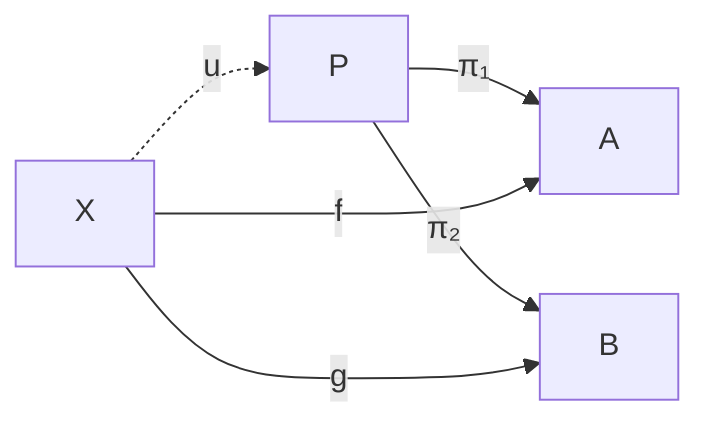
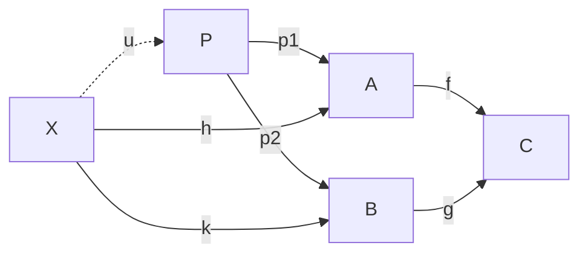
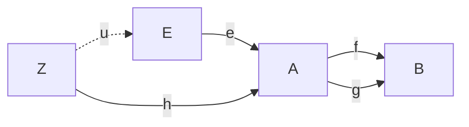
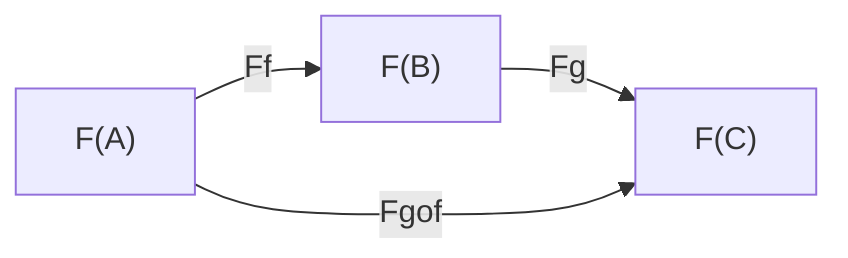

# Spécification du langage `catdiagram`

**Version :** 0.1 (brouillon)
**Objet :** une syntaxe textuelle, intégrable en Markdown, pour décrire les diagrammes de théorie des catégories.

---

## 1. Motivation et principes

### 1.1 Problème

Un diagramme catégorique n'est pas un dessin : c'est la représentation graphique d'un foncteur $D : \mathcal{J} \to \mathcal{C}$ d'une petite catégorie « patron » $\mathcal{J}$ vers une catégorie ambiante $\mathcal{C}$. Le dessin est une *projection* de cet objet sur le plan ; le contenu mathématique est le foncteur lui-même.

Les langages existants couvrent mal le besoin d'une intégration Markdown :

- `tikz-cd` exige un compilateur LaTeX ; le source non compilé est peu lisible.
- `xymatrix` (paquet `xy`) souffre des mêmes limites et d'une syntaxe plus opaque.
- Mermaid sait dessiner des graphes, mais ignore la composition, le typage des morphismes et les propriétés universelles.

### 1.2 Stratégie d'implémentation

`catdiagram` ne réinvente pas la roue du *layout graphique*. Le parser-typechecker de markpage transpile vers **Mermaid**, déjà intégré dans la pipeline de rendu : on hérite gratuitement de l'algorithme de placement (`dagre`), du tracé SVG, des flèches diagonales et de la mise en cache. Notre travail se concentre là où Mermaid ne sait rien faire — le typage des morphismes, la composition, le statut $\exists!$ des flèches universelles, la vérification de commutativité.

Voir §7 pour le détail de la transpilation.

### 1.3 Objectifs de conception

| Principe | Conséquence syntaxique |
|---|---|
| **Dégradation gracieuse** | le source brut, sans rendu, transmet déjà la structure |
| **Déclaratif** | on décrit les morphismes et leurs types, jamais des coordonnées |
| **Fidélité mathématique** | la syntaxe encode un foncteur, pas un simple graphe |
| **Vérifiabilité** | le typage des compositions est contrôlable avant rendu |
| **Layout délégué** | placement géométrique sous-traité à Mermaid (`dagre`), §7 |

### 1.4 Le point central : signature + équations

Un diagramme **n'est pas un graphe** ; c'est un graphe *quotienté par des équations*. La spécification sépare donc deux strates :

- la **signature** — les objets et les morphismes générateurs ;
- les **équations** — les relations de commutativité, p. ex. `h = g . f`.

C'est la présentation d'une catégorie par générateurs et relations. La section des équations porte tout le sens de l'énoncé « le diagramme commute » : sans elle, on n'a qu'un graphe libre ; avec elle, une catégorie présentée.

---

## 2. Intégration Markdown

Un diagramme est un bloc de code clôturé dont l'identifiant de langage est `catdiagram` :

````markdown
```catdiagram
objects:  A, B, C
morphisms:
  f : A -> B
  g : B -> C
  h : A -> C
equations:
  h = g . f
```
````

Le choix du bloc de code garantit la **dégradation gracieuse** : un lecteur dont le moteur Markdown ignore `catdiagram` voit le bloc rendu comme du texte préformaté — toujours lisible. Un moteur compatible remplace le bloc par le diagramme rendu.

---

## 3. Grammaire

### 3.1 Grammaire complète (EBNF)

```
diagram      ::= directive? obj-section mor-section induced-section? eq-section?

directive    ::= "direction:" ("TB" | "BT" | "LR" | "RL")

obj-section  ::= "objects:" objlist
objlist      ::= ident ("," ident)*

mor-section  ::= "morphisms:" morphism+
morphism     ::= ident ":" ident "->" ident modifier?
modifier     ::= "(" prop ("," prop)* ")"
prop         ::= "epi" | "mono" | "iso"

induced-section ::= "induced:" induced+
induced      ::= ident ":" ident "->" ident "by" "(" arglist ")"
arglist      ::= (ident ("," ident)*)?     # empty for absolute universals (terminal / initial)

eq-section   ::= "equations:" equation+
equation     ::= path "=" path
path         ::= ident ("." ident)*

ident        ::= name ("(" arglist-id ")")?    # `F(X)`, `G(h)` admit one balanced parenthesis level
name         ::= letter (letter | digit | "_")*
arglist-id   ::= ident ("," ident)*
comment      ::= "#" { any-char-but-newline }
```

Four points cleaned up from the v0.1 draft :

- `arglist` may be **empty** so the absolute-universal form `by ()` (terminal / initial objects, §6.10) is grammatical.
- `ident` recursively allows one level of balanced `(...)` so `F(X)`, `G(h)`, `Hom(A, B)` parse cleanly without admitting unbalanced runs like `F(X(`.
- `prop` no longer lists `id`: an identity morphism `id_A : A -> A` is just a morphism with the same domain and codomain — no separate modifier needed.
- `letter` and `digit` are interpreted as the **Unicode categories L (letter, all subcategories) and N (number, all subcategories)** — *not* limited to ASCII. Greek letters (`π`, `α`, `Γ`), Unicode subscripts and superscripts (`₁`, `²`), blackboard bold (`ℕ`, `ℝ`) all participate naturally in identifier names. This matches how the editor's ligature layer (§7.5) produces source text — `\pi_1` becomes `π₁`, and `π₁` is a single valid identifier.

### 3.2 Notes de lecture

- **Ordre des sections** : `objects`, puis `morphisms`, puis (optionnellement) `induced`, puis (optionnellement) `equations`. L'ordre suit les dépendances : on ne peut typer un morphisme qu'une fois ses objets connus.
- **Commentaires** : tout ce qui suit `#` jusqu'à la fin de ligne est ignoré.
- **Identifiants** : les parenthèses sont admises dans les identifiants pour autoriser `F(X)`, `G(h)`, etc. — l'application d'un foncteur fait partie du nom de l'objet ou du morphisme.
- **Sensibilité à la casse** : `A` et `a` sont distincts.

---

## 4. Sémantique des sections

### 4.1 `objects` — les objets

Liste les objets, c'est-à-dire l'image de $\text{Ob}(\mathcal{J})$. Chaque identifiant désigne un sommet du diagramme.

```catdiagram
objects:  X, A, B, P
```

### 4.2 `morphisms` — les générateurs

Chaque ligne `f : A -> B` est un triplet *(nom, domaine, codomaine)*. Ces morphismes sont les **générateurs** de $\text{Mor}(\mathcal{J})$ ; les autres morphismes du diagramme (les composés) ne sont pas listés ici — ils existent par composition.

Contrainte : le domaine et le codomaine doivent figurer dans `objects`.

```catdiagram
objects:  A, B, C
morphisms:
  f : A -> B
  g : B -> C
```

#### Modificateurs

Un morphisme peut porter des annotations de propriété entre parenthèses :

| Modificateur | Signification | Rendu suggéré |
|---|---|---|
| `(mono)` | monomorphisme | label suffixé `↣` (Mermaid) ou flèche à queue `↣` (LaTeX) |
| `(epi)` | épimorphisme | label suffixé `↠` (Mermaid) ou flèche à double pointe `↠` (LaTeX) |
| `(iso)` | isomorphisme | label suffixé `≅` (Mermaid) ou flèche à double sens (LaTeX) |

Un morphisme **identité** n'est pas un modificateur : `id_A : A -> A` est simplement un morphisme dont les domaine et codomaine coïncident. Le moteur de rendu peut le détecter et l'afficher en boucle s'il le souhaite (non normé).

```catdiagram
objects:  A, B
morphisms:
  i : A -> B (mono)
  p : B -> A (epi)
```

### 4.3 `equations` — le quotient

Chaque équation `chemin = chemin` impose une relation de commutativité. C'est cette section qui transforme un graphe libre en catégorie présentée.

#### Composition : la règle de réécriture

Un `path` est une suite d'identifiants séparés par des points. Il se lit **de droite à gauche**, conformément à la convention $g \circ f$ (« $f$ puis $g$ ») :

```
g . f   ⟿   g ∘ f
```

La règle de réécriture associée, avec sa condition de bord :

```
COMPOSE :   p . q   est bien typé   ssi   cod(q) = dom(p)
            et alors   dom(p . q) = dom(q)   et   cod(p . q) = cod(p)
```

Une équation `lhs = rhs` est **bien formée** ssi `lhs` et `rhs` sont des chemins bien typés *et* partagent même domaine et même codomaine :

```
WELLTYPED-EQ :   dom(lhs) = dom(rhs)   et   cod(lhs) = cod(rhs)
```

Un vérificateur rejette toute équation mal typée **avant** le rendu.

```catdiagram
objects:  A, B, C
morphisms:
  f : A -> B
  g : B -> C
  h : A -> C
equations:
  h = g . f          # bien typé : A -> C des deux côtés
```

### 4.4 `induced` — les flèches universelles

C'est la section qui distingue `catdiagram` d'une syntaxe de graphe. Une flèche `induced` n'est pas *postulée* : son existence et son unicité sont *garanties* par une propriété universelle.

```catdiagram
objects:  X, A, B, P
morphisms:
  pi1 : P -> A
  pi2 : P -> B
  f   : X -> A
  g   : X -> B
induced:
  u : X -> P  by (f, g)
equations:
  pi1 . u = f
  pi2 . u = g
```

La clause `by (f, g)` enregistre les morphismes dont $u$ est la factorisation. Conséquences :

- **Logique** : $u$ porte un statut $\exists!$ — elle existe et est unique.
- **Rendu** : ce statut justifie un tracé en pointillés. Le style visuel est une *conséquence* du statut logique, jamais une décision arbitraire.

---

## 5. Un seul point d'entrée

La v1 expose **uniquement** le bloc `catdiagram` déclaratif. Pas de
notation inline alternative ni de syntaxe ASCII positionnelle :

- **Cohérence pédagogique** — une seule syntaxe à apprendre, une seule
  surface API à maintenir.
- **Cohérence avec le principe « pas de coordonnées »** (§1.3) — toute
  syntaxe positionnelle entrerait en concurrence avec le layout calculé
  par le backend, et fragiliserait l'invariant « ce qui change, c'est
  le diagramme, pas son dessin ».
- **Verbosité maîtrisée** — le bloc déclaratif reste très court même
  pour un triangle (4 lignes), un carré (6 lignes). On ne sauve pas
  grand-chose à inventer une syntaxe plus dense.

Si l'usage révèle plus tard un cas vraiment courant qui mériterait
une forme abrégée, on l'ajoutera après coup — toujours en transpilant
vers la même représentation interne. Pour v1, le bloc `catdiagram` est
le point d'entrée canonique.

---

## 6. Exemples complets

### 6.1 Triangle commutatif

```catdiagram
objects:  A, B, C
morphisms:
  f : A -> B
  g : B -> C
  h : A -> C
equations:
  h = g . f
```

### 6.2 Propriété universelle du produit

```catdiagram
objects:  X, A, B, P
morphisms:
  pi1 : P -> A
  pi2 : P -> B
  f   : X -> A
  g   : X -> B
induced:
  u : X -> P  by (f, g)
equations:
  pi1 . u = f
  pi2 . u = g
```

### 6.3 Coproduit (le dual)

Obtenu en renversant toutes les flèches du produit — illustration du principe de dualité.

```catdiagram
objects:  X, A, B, S
morphisms:
  i1 : A -> S
  i2 : B -> S
  f  : A -> X
  g  : B -> X
induced:
  v : S -> X  by (f, g)
equations:
  v . i1 = f
  v . i2 = g
```

### 6.4 Carré de naturalité

```catdiagram
objects:  F(X), F(Y), G(X), G(Y)
morphisms:
  Fh    : F(X) -> F(Y)
  Gh    : G(X) -> G(Y)
  eta_X : F(X) -> G(X)
  eta_Y : F(Y) -> G(Y)
equations:
  Gh . eta_X = eta_Y . Fh
```

### 6.5 Pullback (cône au-dessus d'un cospan)

Le pullback diffère du produit : l'apex `P` n'est plus libre, il est contraint par la commutativité de la *cospan* `A → C ← B`. Le `u : X -> P` factorise toute paire `(h, k)` qui rend le cône extérieur commutatif.

```catdiagram
objects:  X, A, B, C, P
morphisms:
  f  : A -> C
  g  : B -> C
  p1 : P -> A
  p2 : P -> B
  h  : X -> A
  k  : X -> B
induced:
  u : X -> P  by (h, k)
equations:
  f . p1 = g . p2          # le carré du pullback commute
  f . h  = g . k            # cône externe au-dessus de C
  p1 . u = h
  p2 . u = k
```

### 6.6 Pushout (dual du pullback)

Obtenu en renversant toutes les flèches.

```catdiagram
objects:  X, A, B, C, P
morphisms:
  f  : C -> A
  g  : C -> B
  i1 : A -> P
  i2 : B -> P
  h  : A -> X
  k  : B -> X
induced:
  u : P -> X  by (h, k)
equations:
  i1 . f = i2 . g
  h . f = k . g
  u . i1 = h
  u . i2 = k
```

### 6.7 Égaliseur (paire parallèle)

Deux morphismes `f, g : A -> B` partagent les mêmes endpoints — exercice de la syntaxe : la même paire `dom -> cod` peut accueillir plusieurs morphismes nommés distinctement.

```catdiagram
objects:  E, A, B, Z
morphisms:
  f : A -> B
  g : A -> B          # paire parallèle, mêmes endpoints
  e : E -> A
  h : Z -> A
induced:
  u : Z -> E  by (h)
equations:
  f . e = g . e        # cône de l'égaliseur
  f . h = g . h         # cône externe
  e . u = h             # factorisation universelle
```

### 6.8 Coégaliseur (dual de l'égaliseur)

```catdiagram
objects:  A, B, Q, Z
morphisms:
  f : A -> B
  g : A -> B
  q : B -> Q
  h : B -> Z
induced:
  u : Q -> Z  by (h)
equations:
  q . f = q . g
  h . f = h . g
  u . q = h
```

### 6.9 Fonctorialité de la composition

Encode `F(g ∘ f) = F(g) ∘ F(f)` — l'axiome de préservation des compositions par un foncteur. Pas de section `induced` ; juste une équation. Les identifiants `F(A)` exercent la grammaire récursive de §3.1.

```catdiagram
objects:  F(A), F(B), F(C)
morphisms:
  Ff   : F(A) -> F(B)
  Fg   : F(B) -> F(C)
  Fgof : F(A) -> F(C)
equations:
  Fgof = Fg . Ff
```

### 6.10 Objet terminal

L'objet terminal `T` : pour tout objet, une unique flèche vers `T`. Le cas particulier de la *forme absolue* `by ()` — arglist vide, l'unicité ne dépend d'aucun morphisme antérieur.

```catdiagram
objects:  T, A
induced:
  t : A -> T  by ()
```

L'objet initial est le dual exact : `induced: i : I -> A by ()`.

---

## 7. Stratégie de rendu : transpilation vers Mermaid

### 7.1 Justification

Écrire un moteur de layout générique pour diagrammes commutatifs représenterait plusieurs milliers de lignes : algorithme de placement (force-directed ou *layered*), gestion de chevauchements, courbure de flèches qui passent au-dessus d'objets, choix de directions selon la topologie. C'est précisément ce que `dagre` — l'algorithme derrière Mermaid — fait déjà très bien pour la classe de graphes orientés qui nous concerne.

Mermaid est par ailleurs **déjà une dépendance** de markpage : un bloc `catdiagram` qui se compile vers du Mermaid réutilise le pipeline existant (rendu SVG, cache, export PDF, paginé).

### 7.2 Le pipeline en trois étapes

```
catdiagram source
      │
      ▼
[1] parser + AST           — §3 (grammaire)
      │
      ▼
[2] typechecker            — §4.3 (COMPOSE, WELLTYPED-EQ)
      │
      ▼  (rejet visible si mal typé : message d'erreur)
      │
[3] émetteur Mermaid       — §7.3 (table de correspondance)
      │
      ▼
mermaid `graph TB` source
      │
      ▼
pipeline mermaid existant  — dagre + rendu SVG
```

Le découpage en trois passes (parser / typechecker / émetteur) permet de tester chacune en isolation et de produire un diagnostic clair quand quelque chose cloche. Le typechecker **précède** la transpilation : l'utilisateur ne voit jamais un message d'erreur Mermaid énigmatique sur un diagramme dont l'erreur est conceptuelle.

### 7.3 Table de correspondance

| Construit `catdiagram` | Construit Mermaid émis |
|---|---|
| `objects: A, B, C` | un nœud par identifiant — `A[A]`, `B[B]`, `C[C]` |
| `f : A -> B` | arête solide étiquetée — `A -- f --> B` |
| `f : A -> B (mono)` | arête solide, label suffixé `↣` — `A -- "f ↣" --> B` |
| `f : A -> B (epi)` | arête solide, label suffixé `↠` — `A -- "f ↠" --> B` |
| `f : A -> B (iso)` | arête solide, label suffixé `≅` — `A -- "f ≅" --> B` |
| `induced: u : X -> P by (f, g)` | arête **pointillée** étiquetée — `X -. u .-> P` |
| `equations:` (relations) | non transpilé — sert uniquement au typechecker |

La clause `by (...)` n'est pas rendue visuellement ; elle informe le typechecker du caractère universel de `u` et déclenche le style pointillé Mermaid `-. .->`.

Les équations ne se voient pas dans le diagramme rendu (Mermaid n'a rien pour ça) — elles vivent dans la prose autour, ou dans le typechecker qui les a validées. Une amélioration future pourrait afficher un *badge* `commutes ✓` à côté du diagramme quand toutes les équations sont vérifiées.

### 7.4 Choix de direction

Mermaid demande `graph TB` (top-bottom), `graph LR` (left-right), `BT`, ou `RL`. Heuristique appliquée :

- **2 objets** → `LR`
- **3 objets en triangle** (ABC + 3 morphismes) → `LR`, le 3ème objet placé sous l'arête diagonale par `dagre`
- **4 objets en carré** (pullback, naturalité) → `LR` si les générateurs forment un cycle clair, sinon `TB`
- **« objet universel » + cible** (terminal, équation au-dessus) → `TB`, l'objet universel au sommet
- **Par défaut** → `LR`

L'utilisateur peut forcer la direction via une **directive en-tête optionnelle** :

```catdiagram
direction: TB
objects: ...
```

### 7.5 Typographie mathématique des labels

Mermaid ne rend pas LaTeX dans ses étiquettes. **L'éditeur s'en charge en amont** : la table de ligatures de `src/editor-ligatures.ts` substitue dès la frappe `\pi` → `π`, `\eta` → `η`, etc., ainsi que les indices et exposants chiffrés (`\pi_1` → `π₁`, `f^-1` → `f⁻¹`, `e^x_2` → `eˣ₂` après suffixage chiffré). Le source `catdiagram` arrive donc à notre parser **déjà en Unicode** ; la transpilation vers Mermaid est un passthrough propre, pas une seconde couche de substitution.

Couverture pratique : lettres grecques (toutes), indices et exposants à un chiffre (et `^-N` négatifs), opérateurs courants. ~95 % des labels rencontrés dans les diagrammes typiques.

**Limite restante (différée à une éventuelle v2)** — les labels qui sortent du périmètre Unicode (`\sum_{i=0}^n`, fractions, accents empilés, indices alphabétiques au-delà des quelques `ᵢⱼₓ` disponibles) rendent leur source LaTeX littéralement. Pour les traiter, il faudrait parser le SVG Mermaid après rendu et remplacer les `<text>` des labels concernés par des `<foreignObject>` contenant un rendu MathJax — gestion non triviale des coordonnées et tailles, à implémenter si une vraie demande émerge.

### 7.6 Exemple complet de transpilation

Source `catdiagram` tel qu'il apparaît dans l'éditeur **après** que les ligatures aient agi (l'utilisateur a tapé `\pi_1` et `\pi_2`, l'éditeur les a remplacés en temps réel par `π₁` et `π₂`) :

```catdiagram
objects:  X, A, B, P
morphisms:
  π₁ : P -> A
  π₂ : P -> B
  f  : X -> A
  g  : X -> B
induced:
  u : X -> P  by (f, g)
equations:
  π₁ . u = f
  π₂ . u = g
```

Mermaid émis (les noms d'identifiants passent en l'état, aucune nouvelle substitution dans le transpilateur) :



Le typechecker a validé les deux équations avant émission ; elles ne paraissent pas dans le rendu (mais auraient bloqué la transpilation si elles avaient été mal typées).

### 7.7 Trois transpilations supplémentaires (corpus de validation)

Pour s'assurer que la stratégie Mermaid tient sur des topologies variées, voici les sorties attendues pour trois des exemples §6 les plus exigeants. (Une fois Phase 1 codée, ces extraits deviendront des snapshots de test.)

**§6.5 Pullback** — 5 objets, cône externe `X`, flèche induite pointillée.



Le layout `dagre` placera vraisemblablement `X` en haut à gauche, `P` au milieu, le cospan `A → C ← B` à droite — pas le carré canonique de Mac Lane, mais lisible. L'utilisateur peut forcer `direction: TB` pour rapprocher du dessin classique.

**§6.7 Égaliseur** — la paire parallèle `f, g : A -> B` est rendue par deux arêtes étiquetées distinctes (l'utilisateur verra deux flèches presque superposées, étiquetées différemment).



`dagre` dessine deux arêtes parallèles distinctes ; certains thèmes Mermaid les *courbent* légèrement pour éviter le chevauchement. Acceptable. Si la séparation visuelle est insuffisante, une amélioration future pourrait préfixer les labels par un séparateur invisible.

**§6.9 Fonctorialité** — démontre qu'aucune `induced` n'est nécessaire pour les diagrammes purement équationnels ; les équations sont validées par le typechecker mais n'apparaissent pas dans le rendu (Mermaid n'a rien pour les afficher).



Note : les parenthèses dans les noms d'objets nécessitent un quoting `["F(A)"]` côté Mermaid (les `(` y sont des delimiters de forme de nœud). Le générateur les ajoute automatiquement quand un identifiant contient un caractère non-alphanumérique.

---

## 8. Conformité d'un moteur de rendu

Un moteur est dit **conforme** à la version 0.1 s'il satisfait les points suivants.

1. **Analyse** — il accepte toute entrée conforme à la grammaire du §3 et rejette les autres avec un diagnostic de position.
2. **Typage** — il vérifie les règles `COMPOSE` et `WELLTYPED-EQ` du §4.3 et rejette les diagrammes mal typés avant rendu.
3. **Résolution des objets/morphismes** — il vérifie que tout objet cité dans un morphisme, et tout morphisme cité dans une équation ou une clause `by`, est préalablement déclaré.
4. **Dégradation** — en l'absence de support, le bloc reste affiché comme texte préformaté (garanti par l'usage d'un bloc de code Markdown standard).
5. **Style induit** — il rend les flèches de la section `induced` dans un style distinct (pointillés recommandés).
6. **Stabilité d'émission** — pour une entrée donnée, le source Mermaid émis (ou l'équivalent SVG) est déterministe ; cela permet la mise en cache et les snapshots de tests.

Les points de placement géométrique (positions, courbure des flèches) ne sont **pas** normés : l'implémentation de référence markpage délègue à `dagre` via Mermaid ; un autre moteur conforme pourrait utiliser `tikz-cd` côté LaTeX, par exemple.

---

## 9. Limites connues et travaux futurs

### 9.1 Limites conceptuelles (héritées de la syntaxe)

- **2-cellules.** La syntaxe couvre les diagrammes 1-catégoriques. Les transformations naturelles dessinées comme flèches doubles *entre* des flèches (2-cellules) ne sont pas exprimables : le texte linéaire ne capture pas cette 2-dimensionnalité. Une section `cells:` est envisagée pour une version ultérieure.
- **Diagrammes de cordes (string diagrams).** Hors périmètre. Ils relèvent d'une syntaxe géométrique à part entière, où la déformation continue du dessin *est* une preuve d'égalité — ce n'est plus une notation mais un calcul.
- **Catégories ambiantes.** La spécification décrit le patron $\mathcal{J}$ et ses relations, mais ne nomme pas la catégorie ambiante $\mathcal{C}$ ni l'interprétation concrète des objets. Une extension pourrait ajouter une section `in: Set` et des liaisons `A := {...}`.
- **Sémantique formelle.** La fonction d'interprétation qui envoie une expression `catdiagram` vers le foncteur $D$ qu'elle dénote n'est pas encore spécifiée ; elle ferait l'objet d'une annexe dédiée.

### 9.2 Limites héritées du backend Mermaid

Le choix de transpiler vers Mermaid (§7) apporte des bénéfices considérables au prix de quelques contraintes :

- **Esthétique du layout.** `dagre` produit des placements valides et lisibles, mais pas toujours canoniques. Un pullback ne « ressemblera » pas forcément à un carré avec l'objet universel en haut à gauche tel qu'on le trouve dans Mac Lane. Pour les diagrammes très spécifiques (snake lemma, sphères de Postnikov), un rendu manuel via tikz-cd reste préférable.
- **Affichage des équations.** Mermaid ne sait pas annoter visuellement un diagramme avec « commute » ou afficher l'équation à côté. Les équations sont validées par le typechecker mais n'apparaissent pas dans le rendu (l'utilisateur les écrit en prose autour).
- **Typographie des labels.** La couche de ligatures de l'éditeur (§7.5) couvre lettres grecques + indices/exposants chiffrés — soit ~95 % des cas. Les expressions plus complexes (`\sum_{i=0}^n`, fractions empilées, indices alphabétiques étendus) rendront littéralement le source LaTeX tant qu'une couche MathJax dans `<foreignObject>` n'est pas implémentée.
- **Modificateurs visuels.** `mono`/`epi`/`iso` sont rendus par un caractère Unicode suffixé au label, faute de styles de tête de flèche dans Mermaid. C'est lisible mais ne suit pas la convention typographique du « crochet » des flèches en LaTeX.
- **Pas de courbure manuelle.** L'utilisateur ne peut pas demander à une flèche de passer au-dessus d'une autre par un arc particulier — `dagre` choisit.

Une réimplémentation future avec un moteur SVG dédié (estimée à ~2000 lignes) lèverait ces contraintes au prix d'un effort de développement substantiel ; à ne considérer que si une vraie demande émerge.

---

## Annexe A — Récapitulatif des sections

| Section | Rôle mathématique | Forme syntaxique | Obligatoire |
|---|---|---|---|
| `direction:` | indice de layout pour Mermaid | `TB` / `BT` / `LR` / `RL` | non |
| `objects:` | $\text{Ob}(\mathcal{J})$ | liste d'identifiants | oui |
| `morphisms:` | générateurs de $\text{Mor}(\mathcal{J})$ | triplets `f : A -> B` | oui |
| `induced:` | flèches universelles ($\exists!$) | `u : X -> P by (...)` | non |
| `equations:` | quotient (commutativité) | `path = path` | non |

## Annexe B — Mots-clés réservés

`direction`, `objects`, `morphisms`, `induced`, `equations`, `by`, `epi`, `mono`, `iso`, et les valeurs `TB`, `BT`, `LR`, `RL`.
