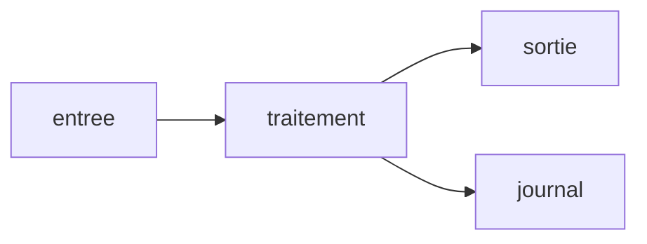
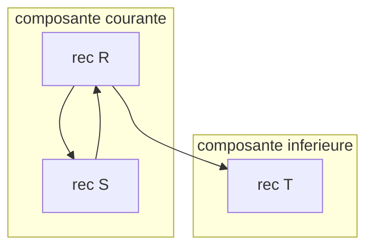

# Vitrine markpage — inventaire visuel

::: toc+
- **Texte et typographie** — les bases markdown et l'unicode mathématique.
- **Mathématiques** — inline, bloc, règles d'inférence.
- **Diagrammes** — mermaid, category, bda, ebnf, tree.
- **Données** — tableaux pipe, csv, tsv, graphiques.
- **Code** — coloration, diff, algorithmes, adt.
- **Mise en page** — callouts, colonnes, typographie locale.
- **Appareil critique** — notes, citations, listes de définition.
- **Cas limites** — ce qui a cassé au moins une fois.
:::

Chaque section montre une construction. Si un élément manque, est coupé,
déborde ou perd sa mise en forme, le défaut se voit à l'œil nu.

# Texte et typographie

## Emphase et styles inline

Du texte **gras**, *italique*, ***gras italique***, `du code inline`,
~~barré~~, un [lien externe](https://example.com), et des guillemets
« français » avec des espaces insécables.

## Unicode mathématique en prose

Les ligatures rendent α, β, γ, ∀x ∈ ℝ, ∑ᵢ₌₁ⁿ, x₁ … xₙ, A ⊆ B, f : A → B,
e, 𝒜 et 𝔸 directement lisibles dans le texte courant.

## Listes

1. Premier élément numéroté
2. Deuxième, avec un sous-niveau :
   - puce imbriquée
   - autre puce
3. Troisième

- [ ] Case à cocher vide
- [x] Case cochée

## Citation

> Une citation sur plusieurs lignes, qui doit garder sa barre latérale
> et son retrait même lorsqu'elle traverse une coupure de page.

---

# Mathématiques

## Inline

L'intégrale $\int_0^1 x^2\,dx = \tfrac{1}{3}$ apparaît dans le fil du texte,
tout comme $\alpha + \beta$, $\sum_{i=1}^{n} i$ et $\mathcal{A} \vDash \varphi$.

## Bloc

```math
\frac{\partial}{\partial t}\,\Psi(x,t)
  = -\frac{\hbar^2}{2m}\,\nabla^2 \Psi(x,t) + V(x)\,\Psi(x,t)
```

## Règle d'inférence

```inference "Produit"
Gamma |- e1 : T1
Gamma |- e2 : T2
---
Gamma |- (e1, e2) : T1 * T2
```

---

# Diagrammes

## Mermaid — flux horizontal



## Mermaid — sous-graphes (rendu naturellement haut)



## Diagramme commutatif

```category "Triangle"
f : A -> B
g : B -> C
h : A -> C = g . f
```

## Algèbre de blocs Faust

```bda "Accumulateur"
1 : +~_
```

## Rail EBNF

```ebnf
expr  = term , { "+" , term } ;
term  = factor , { "*" , factor } ;
factor = digit , { digit } ;
```

## Arbre indenté

```tree "Arborescence"
projet
  src
    main.ts
    preview.ts
  tests
    unit
```

## Arbre SVG

```tree svg "AST"
Expr
  Op
    Add
    Sub
  Const
```

---

# Données

## Tableau pipe

| Construction | Statut | Durée |
| :-- | :-: | --: |
| mermaid | ok | 12 ms |
| math | ok | 1,9 ms |
| adt | ok | 0,4 ms |

## CSV

```csv "Mesures"
nom, valeur, unité
alpha, 12, ms
beta, 34, ms
gamma, 56, ms
```

## TSV

```tsv "Onglets"
nom	valeur
delta	78
```

## Graphique — lignes

```chart line "Latence par taille de buffer" y-min=0
buffer, ms
64, 1.3
128, 2.7
256, 5.3
512, 10.1
```

## Graphique — barres

```chart bar "Codecs"
codec, ms
opus, 21
aac, 35
mp3, 44
```

---

# Code

## Coloration syntaxique

```cpp
template <class Attribute, class Algebra>
class BottomUpAttributes {
 public:
  Attribute evaluate(node_type root);   // point d'entrée
 private:
  std::map<node_type, Attribute> fCache;
};
```

## Bloc long (doit se découper proprement)

```python
def fixpoint(graph, algebra, policy):
    """Calcule le point fixe par composantes fortement connexes."""
    components = tarjan(graph)
    results = {}
    for component in components:
        if len(component) == 1 and not has_self_loop(component):
            node = component[0]
            results[node] = algebra.evaluate(node, results)
            continue
        current = {n: policy.initial(n) for n in component}
        worklist = list(component)
        while worklist:
            n = worklist.pop(0)
            candidate = algebra.evaluate(n, current)
            nxt = policy.stabilize(n, current[n], candidate)
            if not policy.reached(n, current[n], nxt):
                current[n] = nxt
                for user in dependents(n) & set(component):
                    if user not in worklist:
                        worklist.append(user)
        results.update(current)
    return results
```

## Diff unifié

```diff "Correctif"
 contexte inchangé
-const ancien = compute(x);
+const nouveau = compute(x, options);
 suite du contexte
```

## Pseudocode

```algorithm "Point fixe local"
Input: composante C, algèbre A, politique P
Output: attribut stable de chaque nœud
for n in C do
  current[n] ← P.initial(n)
  enqueue(worklist, n)
end
while worklist n'est pas vide do
  n ← dequeue(worklist)
  candidate ← A.evaluate(n, current)
  if not P.reached(n, current[n], candidate) then
    current[n] ← candidate
  end
end
return current
```

## Type algébrique

```adt
AttributeState ::= Unknown
                 | Known(Attribute)

Component ::= Acyclic(Node)
            | Cyclic(Set(Node))
```

---

# Mise en page

## Callouts

::: note
Une note d'information ordinaire.
:::

::: important [Point structurel]
Un encadré important, avec du **gras**, du `code` et une formule $x^2$.
:::

::: warning
Un avertissement.
:::

::: tip
Un conseil.
:::

## Colonnes

::: columns
Colonne de gauche : du texte qui doit rester dans sa gouttière sans
déborder sur la colonne voisine.

:::
Colonne de droite : le second flux, à la même hauteur de base que le
premier, avec sa propre longueur de ligne.
:::

## Typographie locale

::: style color=#7a1f1f size=13pt italic
Ce paragraphe porte une typographie locale : couleur, corps et italique
imposés par le bloc `::: style`.
:::

---

# Appareil critique

## Liste de définition

Fold
:   La fonction qui interprète un terme dans une algèbre : elle interprète
    récursivement les branches puis applique l'opération correspondante.

Aperture
:   Le nombre de références de Bruijn libres d'un arbre, synthétisé à la
    construction.

## Notes de bas de page

Un paragraphe appelant une note[^n1], puis une seconde[^n2] un peu plus
loin dans la même phrase.

[^n1]: Le corps de la première note, sur une seule ligne comme l'exige markpage.
[^n2]: Le corps de la seconde note.

## Citations

Une affirmation appuyée par une référence [@hoare1962].

[@hoare1962]: Hoare, C. A. R. (1962). *Quicksort*. The Computer Journal.

---

# Cas limites

Cette section rassemble ce qui a cassé au moins une fois : les régressions
connues doivent rester visiblement corrigées.

## Lettre astrale dans une formule

Le fold vers une algèbre 𝒜 s'écrit c(t₁, …, tₙ)_𝒜 = c_𝒜(t₁_𝒜, …, tₙ_𝒜)
en prose, et en bloc :

```math
c(t₁, …, tₙ)_𝒜 = c_𝒜(t₁_𝒜, …, tₙ_𝒜)
```

## Note appelée depuis une liste de définition

Terme piégeux
:   Sa définition contient un appel de note[^n3] — le cas qui rendait la
    note invisible.

[^n3]: La note appelée depuis la liste de définition.

## Paragraphe long (contrôle des veuves et orphelines)

Un paragraphe délibérément long pour traverser une coupure de page et
vérifier qu'aucune ligne isolée ne reste en bas ou en haut d'une page.
La conversion symbolique vers de Bruijn traverse le terme en propageant un
environnement : la pile des variables récursives en cours de liage, qui
donne son niveau à chaque référence rencontrée. La mémoïsation était donc
indexée par le couple terme-environnement, une clé beaucoup trop fine, car
la conversion d'un sous-terme ne dépend que de ses références libres et non
de la pile entière. Un sous-arbre clos se convertit exactement pareil sous
n'importe quel environnement, si bien que le grand graphe de signaux
partagés se trouvait reconverti intégralement sous chaque environnement
distinct d'où on l'atteignait, ce qui multiplie le travail sans rien
apporter au résultat final.

## Tableau à cellules longues

| Clé | Contenu |
| :-- | :-- |
| clos | Résultats indépendants de l'environnement : les nœuds récursifs des composantes inférieures et tout sous-arbre sans référence libre. |
| ouvert | Le squelette ouvert : les seuls sous-termes situés sur un chemin menant à une référence de la composante courante. |
