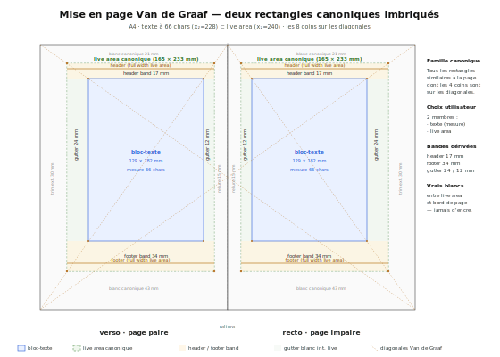
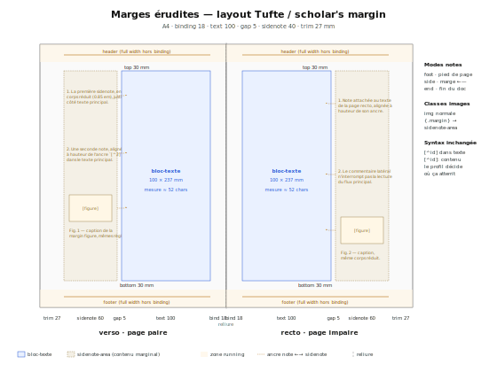

## 1. Objectif

Application web statique pour rédiger des documents Markdown et les exporter
en PDF. **Entièrement côté client** (aucun backend), déployée
automatiquement sur GitHub Pages.

## 2. Contraintes techniques

| Élément              | Choix                                                   |
| -------------------- | ------------------------------------------------------- |
| Langage              | TypeScript (vanilla, pas de framework UI)               |
| Build                | Vite                                                    |
| Parser Markdown      | [`marked`](https://github.com/markedjs/marked)          |
| Aperçu paginé        | [`paged.js`](https://pagedjs.org/)                      |
| Génération PDF       | impression navigateur (`window.print()`) sur la vue paginée |
| Éditeur de texte     | [CodeMirror 6](https://codemirror.net/)                 |
| Stockage images      | IndexedDB (origin-private)                              |
| Stockage doc         | localStorage                                            |
| Hébergement          | GitHub Pages                                            |
| CI/CD                | GitHub Actions (build + deploy)                         |
| Pas de serveur       | tout s'exécute dans le navigateur                       |

Conversion d'imports non-Markdown : `turndown` pour HTML, `mammoth` pour
DOCX. Les deux sont chargés en `import()` dynamique, donc absents du bundle
initial.

## 3. Périmètre fonctionnel

### 3.1. Éléments Markdown supportés

CommonMark + GFM de base :

- Titres `#` à `######` (h1 → h6)
- Paragraphes
- **Gras** (`**…**`) et *italique* (`*…*`), barré (`~~…~~`)
- Code en ligne `` `…` `` et blocs de code (```` ``` ````), avec
  **coloration syntaxique** via `highlight.js` sur un sous-ensemble
  curaté de langages (bash, c, cpp, css, go, haskell, html/xml, java,
  js/ts, json, lua, markdown, ocaml, python, rust, scala, scheme,
  shell, sql, yaml) plus une grammaire Faust custom (`faust` ou
  `dsp`). Thème *atom-one-light*. Langues inconnues : bloc monospace
  brut, comme un `<pre><code>` standard.
- Listes à puces (`-`, `*`) et numérotées (`1.`)
- Listes de tâches GFM (`- [ ]` / `- [x]`) — case visuelle, le toggle
  se fait en éditant la source
- Citations `>`
- Liens `[texte](url)` (cliquables dans le PDF) et autolinks `<url>`
- Règles horizontales `---`
- Images, en deux formes :
  - inline `` ou data URL
  - référence `![alt][label]` + `[label]: url` ailleurs dans le doc
- Tableaux GFM (`| col | col |` + ligne `|---|`)

Extensions markpage (toutes implémentées comme extensions `marked` ou
overrides du renderer `code`, voir §5 et §8) :

- **Diagrammes Mermaid** — bloc ```` ```mermaid ````. Voir §7.
- **Formules mathématiques** — `$$…$$` (display) et `$…$` (inline) via
  MathJax 4. Le bloc ```` ```math ```` est un alias *display* équivalent
  à `$$…$$` (convention GitHub depuis 2023). Voir §8.
- **Règles d'inférence** — bloc ```` ```inference [Label] ```` avec
  prémisses / barre de tirets / conclusion. Rendu en LaTeX
  `\dfrac{prem}{conc}` via MathJax, après pré-traitement
  typographique style Gunter (`\mathcal{}` sur fonction sémantique,
  `\mathbf{}` sur constructeur dans `…`, `\mathsf{}` sur fonction
  hors brackets, subscripts numériques). Voir §8.4.
- **Diagrammes commutatifs** — bloc ```` ```category ````. Syntaxe
  déclarative ligne-à-ligne (`f : A -> B`, équations `f . g = h`,
  morphisme universel `u : X -> P by (h, k)`). Parser →
  typechecker (compositions et égalités bien typées) → renderer
  SVG natif sur grille avec fallback Mermaid `dagre` pour les
  topologies non plongeables. Spec complète :
  `CATEGORY-SPEC.md`.
- **Diagrammes EBNF** — bloc ```` ```ebnf ````. Parsing W3C-EBNF
  via `ebnf2railroad`, une production = un diagramme railroad SVG
  inline, les `=` alignés verticalement (style LaTeX
  align-on-equals). Erreur de parsing surfacée en `<pre
  class="ebnf-error">`.
- **Types algébriques** — bloc ```` ```adt ````. Définitions
  BNF-ish `LHS ::= Ctor | Ctor(args) | …` avec annotations
  optionnelles `(* … *)`. Rendu en grid 4 colonnes (LHS / `::=`
  ou `|` / alternative / annotation), `|` alignés. Highlighting
  deux niveaux : noms qui apparaissent comme LHS quelque part →
  type defini ; les autres identifiants capitalisés →
  constructeur. Lignes non reconnues (typo `:=` au lieu de `::=`,
  prose égarée) surfacées dans un panneau d'avertissement
  ambré, jamais silencieusement omises.
- **Schémas blocs Faust (BDA)** — bloc ```` ```bda ````. Cinq
  opérateurs binaires (`~` récursion, `,` parallèle, `:` séquentiel,
  `<:` split, `:>` merge) sur des primitives (`_`, `!`, nombres,
  arithmétique, fonctions math, labels arités `X[in,out]`). Pipeline
  parser → typechecker (cohérence des arités) → renderer SVG natif.
  Option `delays` (alias `faust`) pour matérialiser le `z⁻¹`
  implicite sur les boucles de récursion. Spec complète :
  `src/bda.ts`.
- **Tableaux de données** — blocs ```` ```csv ```` et ```` ```tsv ````.
  Première ligne = en-têtes, suivantes = données. Séparateur
  auto-détecté pour `csv`. Guillemets RFC-4180 supportés.
- **Graphiques** — bloc ```` ```chart <type> [Title] ```` avec données
  CSV-like (`<type>` ∈ `line` / `bar`). Auto-détection séparateur,
  smart-comma pour les nombres FR (`3,14`), abscisses numériques /
  catégorielles / dates ISO 8601. Rendu inline SVG. Voir §16.
- **Diffs unifiés** — bloc ```` ```diff ````. Coloration par ligne
  (vert ajouts `+`, rouge suppressions `-`, neutre contexte, hunk
  header `@@…@@` teinté). Pas de coloration syntaxique du contenu —
  juste les marqueurs unifiés.
- **Arbres indentés** — bloc ```` ```tree ````. Hiérarchie indentée
  (2 espaces ou tab) → arbre Unicode box-drawing par défaut, ou
  diagramme SVG top-down avec le mot-clé `svg`. Pratique pour les
  arborescences de fichiers, ASTs, dérivations.
- **Pseudocode** — bloc ```` ```algorithm "Caption" ````. Mise en
  page façon LaTeX `algorithm2e` : numéros de ligne en gouttière,
  mots-clés (`for`, `while`, `if`, `then`, `else`, `do`, `end`,
  `return`, `repeat`, `until`, `break`, `continue`) en gras,
  caption auto-numérotée « Algorithme N ».
- **Démos pédagogiques** — bloc ```` ```demo ````. Affiche
  côte-à-côte la source markdown (mise en surbrillance comme
  markdown) et le rendu de cette même source — un outil de
  showcase qui évite d'écrire le code deux fois. Auto-zoom en mode
  slides pour faire tenir les deux panneaux dans la slide.
  Voir §13.5.
- **Captions et cross-références** — la plupart des fences riches
  acceptent une caption entre guillemets après l'info-string
  (compteurs partagés par genre : « Figure N » pour diagrammes /
  charts / arbres / math display, « Table N » pour csv/tsv,
  « Listing N » pour code source, « Algorithme N » pour algorithm).
  `\label{key}` à la suite (sur fence ou heading) crée une cible ;
  `\ref{key}` n'importe où dans le doc affiche un lien formaté
  (`Figure 3`, …). Clés inconnues → `[?]` rouge visible.
- **Encadrés (admonitions)** — syntaxe Pandoc fenced div
  `::: classname [titre] … :::`. Classes génériques (`note`, `tip`,
  `warning`, `caution`, `important`) en cadres colorés ; classes
  académiques (`theorem`, `lemma`, `proposition`, `corollary`,
  `definition`, `proof`, `example`, `remark`) en style sobre titre
  italique ; classes inconnues en cadre neutre.
- **Notes de bas de page** — syntaxe Pandoc `[^id]` (référence) +
  `[^id]: contenu` (définition). Numérotation automatique dans l'ordre
  des références (pas des définitions) ; collectées en fin de document
  sous une fine `<hr>`. Voir §17.
- **Citations bibliographiques** (Pandoc-lite) — `[@key]` en
  référence, `[@key]: texte` en définition. Rendu inline `[N]`
  numéroté dans l'ordre d'apparition ; section *References*
  auto-générée en fin de document avec back-links. Le texte de
  chaque référence est écrit manuellement en Markdown — pas de
  formatage CSL/APA/IEEE automatique. Clés `[A-Za-z0-9_:.-]+`
  (compatibles BibTeX). Clé non définie → la référence passe en
  texte littéral (évite les `[N]` blancs sur typo).
- **Listes de définitions** — syntaxe Pandoc `Terme\n:   Définition`.
  Plusieurs définitions par terme et plusieurs termes consécutifs dans
  la même `<dl>` supportés.
- **Mode slides 16:9** — page paysage à largeur A4 (210 × 118.125 mm),
  chaque `## h2` démarre une nouvelle slide. Activable via
  `pageSize: SLIDES_16_9` (réglages profil) ou `slides: true` dans
  le frontmatter par document. Marges auto-clampées,
  figures cappées à 55 % de la hauteur utile, demos avec auto-zoom
  et bleed conditionnel. Voir §13.5.

### 3.2. Hors périmètre actuel

- Import des **images embarquées dans un fichier Word** (`.docx`) :
  l'import récupère le texte, les titres, listes, gras/italique, liens
  et citations, mais pas les images
- HTML brut dans le Markdown
- Notes de bas de page **multi-paragraphes** (continuations indentées
  à la Pandoc — single-line seulement en v1)
- Numérotation automatique des admonitions académiques
  (« Théorème 1.2 », « Lemme 3 », …)

## 4. Interface utilisateur

### 4.1. Layout — single-pane

L'éditeur et l'aperçu paginé sont **deux vues du même document, jamais
visibles simultanément**. L'utilisateur bascule de l'une à l'autre par
un raccourci (`Cmd/Ctrl + Enter`) ou un bouton toolbar **Aperçu**.

```
┌─ Toolbar ─────────────────────────────────────────────────────────────┐
│ [Ouvrir] [Enregistrer] [Style ▾] [Aide]   Nom : […]   [Aperçu] [Exporter .pdf] [Réglages ▾] │
├───────────────────────────────────────────────────────────────────────┤
│                                                                       │
│   ╔═══════════════════════════════════════════════════════════════╗   │
│   ║  Vue active (l'une ou l'autre, selon le mode)                 ║   │
│   ║                                                               ║   │
│   ║  - Éditeur Markdown (CodeMirror) — par défaut au démarrage    ║   │
│   ║  - Aperçu paginé (paged.js) — quand la preview est demandée   ║   │
│   ║                                                               ║   │
│   ╚═══════════════════════════════════════════════════════════════╝   │
│                                                                       │
└───────────────────────────────────────────────────────────────────────┘
```

Le bouton **Aperçu** porte un état pressé (`aria-pressed=true`, fond
bleuté) quand on est en mode preview. Le bouton **Aide** garde son
fond jaune pâle. Les boutons **Style** et **Réglages** affichent un
caret `▾`.

L'élément `#panes` porte un `data-view="editor" | "preview"` qui pilote
via CSS la visibilité de chaque section (`display: none` sur l'autre).
Le `<section id="preview-pane">` est `tabindex="0"` pour que les
touches PgUp/PgDn et flèches scrollent l'aperçu après basculement.

::: note [Pourquoi ce choix]
Le split bidirectionnel précédent générait des boucles de feedback
ingérables : taper un caractère déclenchait re-pagination + re-sync,
qui scrollait l'aperçu, qui re-syncait l'éditeur, etc. Le single-pane
découple complètement édition et pagination — la frappe ne déclenche
plus rien dans la vue paginée (qui n'est pas visible), et la
pagination ne tourne qu'au moment d'un toggle vers la preview, sur
un doc *dirty* (voir §13.5).
:::

### 4.2. Bascule éditeur ↔ aperçu

- **Toggle (`Cmd/Ctrl + Enter` ou bouton Aperçu)** :
  - **éditeur → aperçu** : on capture l'**ancre** du curseur (ligne +
    position verticale dans le viewport éditeur), on bascule la vue,
    on re-pagine si le doc est dirty (cf. §13.5), puis on aligne
    l'aperçu sur cette ancre.
  - **aperçu → éditeur** : pas d'ancre, le curseur reste là où il
    était dans l'éditeur. La vue éditeur réapparaît telle quelle.
- **Click dans l'aperçu** = **retour éditeur avec ancrage** :
  l'utilisateur clique sur un bloc `data-line=L` à la position `yc`
  de son viewport ; on bascule en éditeur, on place le curseur en
  début de ligne `L`, et on scrolle l'éditeur pour que `L` apparaisse
  à `yc`. C'est le workflow « j'ai vu une faute, je la corrige » :
  un clic suffit.
- **Scroll dans l'aperçu** : reste local. Pas de propagation à
  l'éditeur.

Voir §14 pour les détails de la sync par ancre.

### 4.3. Comportements

- **Frappe → marque dirty** : chaque modification dans l'éditeur met
  un drapeau `dirty = true` au niveau de l'app. **Aucune autre action
  n'est déclenchée par la frappe** (pas de re-pagination, pas de
  sync, pas de re-render).
- **Persistance** : le doc est sauvegardé en `localStorage` à chaque
  modification (debounce 200 ms). Au prochain démarrage, le doc est
  restauré. Si `localStorage` est vide, c'est `HELP.md` qui est chargé
  comme document par défaut.
- **Importer** : accepte `.md`, `.markdown`, `.txt`, `.html`, `.htm`,
  `.docx`. Crée toujours un **nouveau document** dans l'index, jette
  le SHA du contenu dans le pool de blobs, bascule dessus. Pas de
  confirmation (le doc courant n'est jamais touché). À l'import, les
  data URLs inlinées sont migrées en IndexedDB. L'app bascule en mode
  éditeur (si on était en preview) et marque dirty. Limitation DOCX :
  les images embarquées dans un Word ne sont **pas** importées
  (mammoth → HTML les sort en data URLs, mais notre filtre Turndown
  les retire pour rester sur du contenu textuel propre).
- **Exporter ▾** : dropdown qui regroupe les sorties (cf. §19.4) :
  - `.md` produit un Markdown portable (data URLs en fin de doc en
    forme ref-style, voir §6).
  - `.pdf` exécute le pipeline §13.6 via paged.js.
  - `.tex` exécute le pipeline LaTeX §21.
  - **OneDrive…** : upload du `.md` via Microsoft Graph dans le
    dossier `Apps/markpage/` du OneDrive de l'utilisateur ; génère
    en plus un share-link anonyme view-only et le copie au
    presse-papier (cf. §22.1).
  - **Copier le lien de partage** / **Envoyer par email** : encode
    le doc (gzip + base64 URL-safe) dans un `?import=<payload>`
    auto-portant. Le destinataire ouvre le lien dans son markpage,
    bootstrap décode + crée un doc local. ~8 Ko de payload max
    (cf. §22.2).
  Le nom de fichier est dérivé du nom du doc courant (slugifié).
- **Aide** : ouvre la fenêtre d'aide séparée (cf. §10).
- **Style** : ouvre un menu déroulant avec les commandes de mise en forme.
  Même menu disponible au clic-droit dans l'éditeur. Les items déjà
  applicables au curseur courant sont signalés par une coche. Inclut
  également **Numéroter les sections** (cf. §15).
- **Réglages** : ouvre une fenêtre browser séparée (mêmes mécaniques
  que la fenêtre d'aide, fallback modal si popup bloqué) pour
  personnaliser le rendu PDF (§9). Les changements marquent dirty et
  re-paginent immédiatement si la preview est visible — l'idée étant
  de poser cette fenêtre à côté de l'aperçu et voir l'effet en temps
  réel.
- **Sélection ligne entière** : clic sur un numéro de ligne dans la
  gouttière sélectionne la ligne **avec son `\n` final** (jusqu'au
  début de la ligne suivante, ou jusqu'à la fin du doc pour la
  dernière ligne) ; glisser-en sélectionne plusieurs. Inclure le `\n`
  permet à Suppr / Cmd+X de retirer entièrement la ligne (pas de ligne
  vide qui reste). Les commandes wrap (gras, italique, …) restent
  correctes parce que `lineSegment` clampe chaque segment à
  `Math.min(line.to, rangeTo)`, donc le `\n` est exclu du wrapping
  même quand il est dans la sélection.
- **Insertion d'image** : trois entrées (drag-drop sur l'éditeur, paste
  d'une image du presse-papier, item « Insérer une image… » du menu Style).
  Les images sont automatiquement redimensionnées (max 2000 px) et
  réencodées (JPEG q0.85, ou PNG si l'original a une couche alpha).
  Stockées en IndexedDB (voir §6). Possible aussi par drag-drop depuis le
  web (avec limites CORS, voir §6).
- **Métadonnées centrées** (auteur / organisation / date) insérées juste
  après le premier `# Titre 1` du doc, dans l'aperçu et dans le PDF.
- **Ligatures de saisie** (cf. §18) : actives à la frappe et au paste,
  désactivées dans les fenced code blocks (sauf ` ```inference `).

### 4.4. Raccourcis clavier

**Mise en forme** (actifs quand l'éditeur a le focus) :

| Raccourci | Action |
|---|---|
| `Cmd/Ctrl` + `B` | Gras |
| `Cmd/Ctrl` + `I` | Italique |
| `Cmd/Ctrl` + `E` | Code en ligne |
| `Cmd/Ctrl` + `K` | Insérer un lien |
| `Cmd/Ctrl` + `0` | Texte normal (retire le titre) |
| `Cmd/Ctrl` + `1..4` | Titres h1-h4 |
| `Cmd/Ctrl` + `Maj` + `L` | Liste à puces |
| `Cmd/Ctrl` + `Maj` + `O` | Liste numérotée |
| `Cmd/Ctrl` + `Maj` + `Q` | Citation |
| `Cmd/Ctrl` + `Maj` + `N` | Numéroter les sections (§15) |
| `Cmd/Ctrl` + `Alt` + `I` | Insérer une image (file picker) |
| `Tab` (curseur seul ou sélection mono-ligne) | Insérer un `\t` |
| `Tab` (sélection multi-lignes) | Indenter |
| `Maj` + `Tab` | Désindenter |

**Application** (globaux, indépendants du focus) :

| Raccourci | Action |
|---|---|
| `Cmd/Ctrl` + `Enter` | Basculer éditeur ↔ aperçu |
| `Cmd/Ctrl` + `O` | Ouvrir |
| `Cmd/Ctrl` + `S` | Enregistrer .md |
| `Cmd/Ctrl` + `P` | Exporter .pdf |
| `Cmd/Ctrl` + `,` | Réglages |

Le listener global ignore les évènements déjà traités par CodeMirror
(`event.defaultPrevented`) pour éviter les conflits.

## 5. Architecture

```
src/
  main.ts              point d'entrée, montage de l'UI, raccourcis globaux
  HELP.md              tutoriel chargé au premier lancement et via Aide
  fonts.ts             enregistre les TTF de fallback côté navigateur
  editor.ts            CodeMirror : keymap formats, gutter sélection,
                       drag-drop images, surbrillance Markdown
  editor-commands.ts   commandes de transformation (toggle bold/italic,
                       set heading, list, blockquote, insert link…)
  preview.ts           Markdown → HTML via marked, styles dynamiques,
                       annotation `data-line` pour le scroll-sync
  scroll-sync.ts       sync bidirectionnelle éditeur ↔ aperçu
  storage.ts           lecture/écriture localStorage (doc + filename)
  settings.ts          modèle PdfSettings, défauts, sérialisation
  import.ts            file → markdown (turndown / mammoth via import())
  image.ts             pipeline images (process, IDB, ref-expansion,
                       extract data URLs, GC, drop/paste handlers)
  image-store.ts       wrapper IndexedDB
  mermaid.ts           lazy import + cache de mermaid.render() par source
  math.ts              lazy import + cache de MathJax tex2svg par source
  marked-config.ts     extensions marked pour `$$…$$` (math display)
                       et `$…$` (math inline)
  preview-paginated.ts paged.js + dynamic CSS Paged Media (size, margins,
                       fragmentation rules) pour la pagination écran
  print-export.ts      export PDF via window.print() : prépare le contenu,
                       applique le CSS @page, ouvre le dialogue
  vite-env.d.ts        types Vite pour `?url`, `?raw`, etc.
  style.css            styles globaux + modales
  assets/
    cauchy.png         bandeau de fond de la toolbar (manuscrit Cauchy)
  ui/
    toolbar.ts         toolbar globale
    settings-panel.ts  panneau Réglages
    style-menu.ts      menu Style + menu contextuel (clic-droit)
    help-modal.ts      modale Aide
index.html
vite.config.ts
.github/workflows/deploy.yml
```

### 5.1. Pipeline d'aperçu (= pipeline d'export)

L'aperçu et l'export PDF partagent **le même rendu via paged.js**.
La preview montre le résultat paginé à l'écran ; l'export pagine la
même chose dans un container caché et appelle `window.print()` —
d'où conformité parfaite preview ↔ PDF (cf. §13.6).

```
Doc éditeur (avec `img://uuid`)
   │
   ▼
expandRefsToBlobUrls() (preview) | expandRefsToInlineDataUrls() (export)
   ├─► IndexedDB → blobs → blob URLs (preview) ou data URLs (export, autonomes)
   │
   ▼
marked.parse() → HTML
   │
   ▼
applyPreviewMetadata() (insère bloc auteur/org/date)
   │
   ▼
annotateSourceLines() (data-line=N pour la sync §14)
   │
   ▼
renderMermaidBlocks / renderMathBlocks / renderMathInlines (en parallèle,
remplissent les placeholders avec les SVG MathJax / Mermaid)
   │
   ▼
keepLabelsWithNext() (regroupe titres + paragraphes-labels avec leur
suivant immédiat dans des `<div class="keep-with-next">`) — appelé
par paginate() / paginateOnce()
   │
   ├─► preview : paginate() → paged.js → DOM paginé écran (.pagedjs_page)
   └─► export  : paginateOnce() → paged.js dans #markpage-print-target → window.print()
```

Le pipeline ne tourne **pas** à la frappe — il est déclenché à
chaque toggle vers la preview (sur un doc dirty) ou à un changement
de réglages, jamais en arrière-plan (cf. §4.3 et §13.5). Un compteur
`previewReqId` annule un rendu obsolète si un toggle plus récent
arrive avant la fin du précédent.

### 5.2. Pipeline de sauvegarde / chargement

- **Save** :
  ```
  Editor → refifyImageUrls (inline `` → ref-style)
         → expandRefsToDataUrls (img:// → data:)
         → gcUnusedImages (purge IDB)
         → download .md
  ```
- **Open** (importFile + extractDataUrlsToStore + inlineImageRefs) :
  ```
  File → importFile (md/txt/html/docx)
       → extractDataUrlsToStore (data: → img:// via IDB)
       → inlineImageRefs (`[label]: img://…` → ``)
       → editor
  ```

L'éditeur voit toujours **inline** ; le fichier sauvegardé est toujours
**ref-style** (lisible dans un éditeur externe). Round-trip propre.

### 5.3. Tests de régression

Harness `vitest` + `happy-dom` (cf. `vitest.config.ts`). Deux suites
parcourent un **corpus** de fichiers markdown sous `tests/corpus/` et
comparent chaque sortie à un golden checké-in. Modifier le corpus ou
le code de rendu fait dériver les goldens ; `npm run test:update`
régénère, on relit le diff, on commit.

Scripts :

| Commande              | Effet                                         |
| --------------------- | --------------------------------------------- |
| `npm test`            | vérifie les goldens, échoue à la moindre dérive |
| `npm run test:watch`  | re-lance à chaque sauvegarde (dev)             |
| `npm run test:update` | régénère les goldens                           |

Suites :

- `tests/export-latex.test.ts` — pour chaque `<name>.md`, appelle
  `exportLatex(md, TEST_SETTINGS)` et snapshot `<name>.tex`. Si
  le doc contient un mermaid, snapshot aussi `<name>-mermaid-1.svg`
  (le SVG sanitisé qui finirait dans le zip — preuve que la
  sanitisation pour inkscape reste correcte).
- `tests/render-preview.test.ts` — pour chaque `<name>.md`, appelle
  `renderPreview` + `applyPreviewMetadata` sur un `<div>` happy-dom
  et snapshot `<name>.html` (la sortie marked structurelle, sans
  post-processing math / mermaid).

Mocks au niveau module (`vi.mock`) :

- `renderMermaid` → SVG-piège fabriqué exprès pour exercer les six
  branches de `sanitizeSvgForInkscape` (foreignObject, em-unit `dy`
  sur `<text>`, `display:none`, filter, max-width, fill forcing).
- `renderChart` → SVG fixe simple.
- `getImage` → blob PNG fictif.

Ces stubs garantissent que les tests testent **notre** code (parser
markdown, convertisseurs, sanitiseur SVG, application des settings)
sans dépendre d'une version donnée de mermaid ni d'un vrai moteur
de layout. Les goldens restent reproductibles sur toute machine.

Le corpus actuel couvre : titres, formatage inline, listes, blocs de
code (whitelist `language=`), math (back-conversion Unicode +
`align*` pré-emballé), tables (pipe / csv), admonitions (env amsthm
+ tcolorbox), notes de bas de page + def lists, règles d'inférence,
mermaid + chart, plus une copie de `HELP.md` comme cas
« tout-en-un » (~1000 lignes). Couverture étendue au fil des
features ajoutées.

`TEST_SETTINGS` (cf. `tests/fixtures/settings.ts`) fige date, auteur
et organisation : `DEFAULT_SETTINGS` avec `date.custom = '2026-01-01'`
et `author/organization` à `Test Author` / `Test Org`. Sans ce pin,
les goldens divergeraient à chaque jour calendaire ou changement
local des Réglages.

## 6. Stockage et gestion des images

### 6.1. Format interne

- Le doc en mémoire / localStorage utilise `` où `uuid` est
  un identifiant stable (UUID v4) lié à un blob stocké en IndexedDB.
- À l'export, la conversion `img://` → data URL se fait à la volée. Le
  data URL n'est jamais visible dans l'éditeur.

### 6.2. Insertion

- **Glisser-déposer** sur l'éditeur (capture phase, pour passer avant le
  handler de texte de CodeMirror).
- **Coller** une image du presse-papier (capture screenshot par exemple).
- Item **« Insérer une image… »** du menu Style → file picker.
- **Drag-drop depuis le web** : on extrait l'URL depuis `text/html`
  (``), `text/uri-list`, puis `text/plain` ; on `fetch()` ; on
  vérifie `Content-Type: image/*`. Échoue silencieusement avec un
  `alert()` explicite si CORS / 404 / type inadapté.

### 6.3. Traitement

- Lecture en `Image` via `URL.createObjectURL`, dessin sur un `canvas`,
  redimensionnement (max 2000 px sur le grand côté), réencodage :
  - PNG d'origine **avec alpha** → PNG (alpha détectée via `getImageData`)
  - PNG d'origine **sans alpha** → JPEG q0.85
  - autre → JPEG q0.85
- Le `Blob` produit est stocké en IDB sous la clé UUID, et l'éditeur reçoit
  ``.

### 6.5. Références externes — round-trip d'imports

Un `.md` édité hors markpage (Obsidian, repo git, static-site generator,
…) référence typiquement ses images via des chemins relatifs :
``, `[logo]: assets/logo.svg`, etc. Le format
interne `img://<sha>` est pratique pour markpage mais détruirait
l'identité du fichier au round-trip — donc on garde **les deux formes
en parallèle**.

**Deux représentations :**

| Forme | Où elle vit | Quand |
|---|---|---|
| Externe : `` | dans le `.md` (source) | tel qu'importé / sauvegardé |
| Interne : blob keyed-by-SHA | IndexedDB (store `images`, partagé avec les `img://`) | au rendu, après lookup mapping |

**Table de correspondance (`src/resource-mapping.ts`) :**

```text
markpage:resources:mapping = {
  "images/foo.png":  { sha: "abc…", firstSeen: 1717… },
  "assets/logo.svg": { sha: "def…", firstSeen: 1717… },
  …
}
```

Stockée en `localStorage`, **globale à l'instance markpage**. Toute
ressource résolue une fois reste connue, donc :

- Ré-importer le même `.md` → aucun prompt, le mapping s'auto-applique.
- Plusieurs `.md` qui partagent une image → l'image n'est demandée
  qu'une seule fois ; tous les docs profitent du même blob.

**Pipeline import :**

1. `importFile(file)` → contenu markdown.
2. `extractDataUrlsToStore(content)` hoiste les éventuelles `data:` URLs
   inline en IDB sous leur SHA (comportement pré-existant).
3. `extractExternalRefs(cleaned)` → liste des chemins externes
   (filtrée pour ignorer `img://`, `data:`, `http(s)://`, etc.).
4. Pour chaque chemin **inconnu** dans le mapping, modal
   `promptForMissingResources` : un file picker multi-sélection, matching
   par basename ; les fichiers fournis sont écrits en IDB via
   `addResource(path, blob)` qui calcule la SHA, partage le blob avec les
   `img://<sha>` du même contenu, et ajoute l'entrée mapping.
5. La source markdown **reste inchangée** — `` n'est
   pas réécrit. Le doc créé en localStorage contient la forme externe
   telle quelle.

**Pipeline rendu / preview :**

`expandRefsToBlobUrls(text)` fait deux passes :

- `img://<sha>` → `blob:` URL (existant).
- Chemins externes → lookup mapping → SHA → `blob:` URL via
  `rewriteExternalRefs`.

Un chemin sans entrée dans le mapping reste tel quel et rend
visuellement une image cassée — signal cohérent avec « le fichier
manquait, le doc n'a pas trouvé sa résolution ».

**Pipeline sauvegarde `.md` :**

`expandRefsToDataUrls(text)` n'inline **que** les `img://<sha>`. Les
chemins externes sont conservés tels quels dans la sortie. Conséquence
voulue : le `.md` exporté est byte-identique à celui importé (modulo
les images ajoutées en édition markpage, qui restent en `img://<sha>` et
sortent en data-URL inline-ref-style).

**Pipeline export PDF :**

`expandRefsToInlineDataUrls(text)` ajoute une passe
`inlineExternalRefs` après le passage standard : les chemins externes
sont aussi inlinés en data-URL pour produire un markdown auto-suffisant
que le moteur PDF rend sans dépendance externe.

**Politique de conflit :**

`addResource(path, blob, onConflict?)` détecte le cas « le path existe
déjà dans le mapping mais pointe vers un SHA différent du blob fourni »
et délègue à `onConflict`. Par défaut → `overwrite`. Le modal d'import
ne pose pas la question pour v1 — l'utilisateur fournit un fichier et
markpage écrit. Une UI de confirmation par diff de SHA est différée.

**Garbage collection :**

L'orchestrator `runGC` dans `main.ts` calcule l'union de :

- `collectImageRefs(content)` pour chaque doc (SHAs des `img://`),
- `mappedShas()` (SHAs référencés par toute entrée du mapping).

`gcUnusedImages(union)` puis `gcContentBlobs()`. Un blob disparaît
quand il n'est référencé **ni** par un `img://` **ni** par une entrée
mapping. Supprimer un doc qui était le seul à utiliser un chemin
externe libère la blob ssi le mapping est explicitement nettoyé via
`removeResource(path)` (pas d'auto-clean v1 — différé).

**Hors v1 :**

- UI dédiée pour voir / éditer / supprimer des entrées du mapping
  (« mapping orphelin », « remplacer par autre fichier »).
- Auto-clean : retirer du mapping les paths qu'aucun doc actif ne
  référence plus.
- Frontmatter `references:` pour partager le mapping avec un autre
  utilisateur sans devoir re-fournir les images.

### 6.4. Polices

L'aperçu HTML utilise une cascade unique pour le texte courant comme pour
le PDF (puisque le PDF est produit par le moteur d'impression du
navigateur sur la même vue) :

| Police | Source | Couverture principale |
|---|---|---|
| Roboto Condensed (4 variantes) | `@fontsource/roboto-condensed/*` (CSS) | Latin, Cyrillique, Grec, ponctuation générale |
| Roboto Mono Regular | `@fontsource/roboto-mono/400` (CSS) | Code |
| Noto Sans Symbols Regular | `@expo-google-fonts/noto-sans-symbols` (`?url`) | Flèches, géométrique, dingbats, divers |
| Noto Sans Math Regular | `@expo-google-fonts/noto-sans-math` (`?url`) | Opérateurs mathématiques (U+2200-22FF) |

Roboto Condensed et Roboto Mono sont enregistrées via `@font-face` du
package `@fontsource` (chargement réseau standard). Noto Symbols et Noto
Math sont chargées via la `FontFace` API au démarrage (`fonts.ts`) en
prenant les TTF complets — le sous-set fourni par `@fontsource` pour ces
polices laissait de côté plusieurs blocs Unicode utiles (ex. flèches).

Le navigateur sélectionne le glyphe en cherchant dans cette cascade
(via `font-family: "Roboto Condensed", "Noto Sans Math", "Noto Sans
Symbols", sans-serif`), donc plus besoin de la détection Canvas par
caractère qu'on faisait pour pdfmake.

## 7. Diagrammes Mermaid

Un bloc de code dont le langage est `mermaid` est rendu en SVG dans
l'aperçu **et** dans le PDF — qualité vectorielle des deux côtés
puisque le PDF est produit par le moteur d'impression du navigateur
sur la même vue (cf. §5.1). La librairie mermaid (~600 KB minifié)
est chargée paresseusement via `import()` au premier diagramme
rencontré ; les rendus sont mémorisés par source.

`renderMermaidBlocks()` post-traite le HTML produit par marked : il
trouve chaque `<code class="language-mermaid">`, appelle
`renderMermaid(source)`, et remplace le `<pre>` parent par un `<div
class="mermaid-block">` contenant le SVG (ou un `<div
class="mermaid-error">` montrant la source si le rendu échoue). Les
attributs `data-line` du scroll-sync sont reportés sur le wrapper.

Le SVG produit par mermaid passe directement dans le DOM rendu — pas
de sanitisation supplémentaire. Le navigateur gère nativement les
constructions sur lesquelles pdfmake butait jadis (`<foreignObject>`,
`marker-end orient="auto"`/`auto-start-reverse`, CSS inline dans
`<style>`, `stroke-dasharray="0"`…). C'est l'un des grands gains de
la voie impression.

### 7.1. Réglages exposés

Trois champs sur `PdfSettings`, ajustables dans le panneau Réglages :

| Champ | Défaut | Effet |
|---|---|---|
| `mermaidMaxScale` | 2 | Facteur d'agrandissement maximal du diagramme. |
| `mermaidMaxWidthPct` | 1.0 | Fraction de la largeur de la zone de texte que le diagramme peut occuper. |
| `mermaidMaxHeightPct` | 0.7 | Fraction de la hauteur de la zone de texte qu'il peut occuper. |

::: note [Note d'implémentation]
Ces réglages étaient câblés au pipeline pdfmake. Avec la voie
impression ils ne sont plus appliqués automatiquement. À reconnecter
via du CSS dans `pagedCss()` (`max-width`, `max-height` sur
`.mermaid-block svg`) — ticket de rattrapage à prévoir.
:::

## 8. Formules mathématiques

Les formules `$$…$$` (display) et `$…$` (inline) sont rendues via
[MathJax](https://www.mathjax.org/) en sortie SVG. La librairie est
chargée paresseusement (`import()`) au premier bloc math rencontré,
et chaque `(source, display)` est mémorisé une fois rendu.

Avec le pipeline impression (cf. §5.1), les formules **inline et
display sont rendues identiquement entre l'aperçu et le PDF** : le
navigateur intègre les SVG MathJax dans le flux du texte et respecte
le `vertical-align` que MathJax émet pour aligner la baseline. Plus
de fragmentation ni de fallback inline → bloc.

### 8.1. Reconnaissance Markdown

Une extension `marked` (`src/marked-config.ts`) ajoute deux types de
tokens et un override du renderer `code` :

- **`mathBlock`** (niveau block) — matche `^\$\$\n([\S\s]+?)\n\$\$`
  avec `$$` seul sur sa ligne d'ouverture comme de fermeture. Sans
  cette contrainte de ligne, des `$$` mentionnés dans des code spans
  ou fenced blocks seraient capturés à tort. Espaces/tabs en fin de
  ligne de délimiteur tolérés.
- **`mathInline`** (niveau inline) — matche
  `\$(?!\s)((?:\\.|[^$\n])+?)(?<!\s)\$(?!\d)`. Garde-fous Pandoc-style
  pour ne pas avaler des dollars de prix (« Cost $5 or $7 ») ni des
  `$$`. L'alternative `\\.` à l'intérieur du groupe permet d'écrire
  `\$` (ou tout autre caractère échappé) à l'intérieur de la formule
  sans casser la fermeture.
- **Bloc ```` ```math ```` (alias display)** — override du renderer
  `code` quand `lang === 'math'`. Émet le même placeholder
  `<div class="math-block">` que `$$…$$`. Aligné sur la convention
  GitHub. Évite le piège des `$$` qui doivent être seuls sur leur
  ligne.

Le module est importé pour ses effets de bord depuis `main.ts`, avant
tout appel à `marked.parse` ou `marked.lexer`. Les renderers
produisent des placeholders `<div class="math-block" data-math="…">`
/ `<span class="math-inline" data-math="…">` ; le contenu LaTeX est
HTML-échappé pour pouvoir loger dans l'attribut `data-math`.

### 8.2. MathJax

`src/math.ts` configure MathJax 4 (paquet `@mathjax/src` + paquets
de fontes `@mathjax/mathjax-{newcm,tex,asana,fira,stix2}-font`) en
sortie SVG :

```ts
const adaptor = browserAdaptor();
RegisterHTMLHandler(adaptor);
const tex = new TeX({ packages: AllPackages });
const svg = new SVG({
  fontCache: 'local',
  fontData: chosenFontClass,
});
const doc = mathjax.document(document, { InputJax: tex, OutputJax: svg });
```

- `AllPackages` charge tous les paquets TeX (ams, amssymb,
  textmacros, …) ; sans ça, `\begin{pmatrix}` ou `align*`
  lèveraient une erreur de parsing.
- `fontCache: 'local'` met les glyphes utilisés dans un `<defs>`
  interne à chaque SVG et y fait référence via `<use>` ; le SVG
  reste autonome sans dupliquer chaque glyph en path inline.
- `fontData` reçoit la classe `MathJax*Font` correspondant à la
  fonte choisie via le réglage `mathFontSet` (newcm par défaut,
  voir §8.5). MathJax 4 charge les variants de glyphes via
  `asyncLoad`, que `src/math.ts` route vers `mathjax-fontsets.ts`
  pour servir le bon paquet npm.

`mj.render(latex, display)` renvoie un `<mjx-container>` qui enveloppe
le SVG. On extrait le SVG racine via une regex *greedy*
(`<svg…</svg>`) parce que MathJax imbrique des `<svg>` enfants pour
les glyphes étirés (parenthèses extensibles, accolades), et un match
non-greedy ne capterait que le premier `</svg>` interne.

### 8.3. Substitution dans le DOM

Deux post-traitements parallèles au `Promise.all` du pipeline
d'aperçu :

- `renderMathBlocks(target)` trouve chaque
  `<div class="math-block" data-math="…">`, appelle
  `renderMath(source, display=true)` et insère le SVG.
- `renderMathInlines(target)` fait la même chose pour les
  `<span class="math-inline">` (avec `display=false`). Le navigateur
  pose le SVG inline dans le flux et applique le `vertical-align:
  -…ex` que MathJax émet, ce qui aligne la formule sur la baseline du
  texte environnant.

Erreurs de parsing : on ajoute la classe `math-error`, stylée en
bordure rouge avec ré-affichage de la source.

### 8.4. Bloc `inference`

Override du renderer `code` quand `lang === 'inference'` (avec étiquette
optionnelle entre parenthèses : ```` ```inference (MP) ````). Le
contenu du bloc est découpé sur une **ligne de tirets** (3 ou plus,
seule sur sa ligne) :

- au-dessus : les **prémisses**, séparées par `;` (converti en `\quad`)
  ou réparties sur plusieurs lignes (idem) ;
- en-dessous : la **conclusion**.

Le tout est emballé en `\dfrac{prémisses \quad …}{conclusion}` et
émis comme placeholder `<div class="math-block">`, traité ensuite par
le pipeline math standard. L'étiquette devient `\quad \textsf{(label)}`
à droite de la barre.

**Pas de pré-substitution ASCII → LaTeX** : on s'appuie sur les
ligatures de saisie (§18), qui restent **actives à l'intérieur de
``` ```inference ``` ``` ** (seule exception au comportement « ligatures
off dans les fenced blocks »). L'utilisateur tape `|-`, `->`, `[[`,
`|N` et la source contient déjà `⊢`, `→`, ``, `ℕ` au moment où le
renderer prend la main. MathJax 4 (avec les paquets `textmacros` et
`unicode` dans `AllPackages`) accepte ces caractères Unicode
directement en mode math.

### 8.5. Choix de la fonte (`mathFontSet`)

MathJax 4 livre cinq fontes math en paquets séparés ; le réglage
`mathFontSet` (défaut `newcm`) sélectionne celle qu'on injecte
dans `new SVG({ fontData: … })` :

| Valeur  | Paquet npm                    | Style                                                                        |
| ------- | ----------------------------- | ---------------------------------------------------------------------------- |
| `newcm` | `@mathjax/mathjax-newcm-font` | NewComputerModern, serif TeX moderne                                         |
| `fira`  | `@mathjax/mathjax-fira-font`  | Fira Math, sans-serif (s'accorde avec Roboto / Fira Sans)                    |
| `stix2` | `@mathjax/mathjax-stix2-font` | STIX 2, serif (s'accorde avec Times-like)                                    |
| `asana` | `@mathjax/mathjax-asana-font` | Asana Math, serif moderne grande x-height                                    |
| `tex`   | `@mathjax/mathjax-tex-font`   | Fonte TeX classique (variantes toutes bundlées, pas de chargement dynamique) |

Pour les quatre premières fontes les variantes (sans-serif, fraktur,
script, …) sont en chunks à charger à la demande. `src/mathjax-fontsets.ts`
enregistre statiquement chaque variante par fonte (un `import()` codé
en dur par fichier — `import.meta.glob('/node_modules/…')` ou un
template-literal `import('@…/'+v+'.js')` n'iraient pas : le premier
crée une instance dupliquée de la classe `MathJax*Font`, le second
échoue à la résolution de bare specifier au runtime). `math.ts`
mémorise un renderer **par fonte** (cache `renderers: Map<MathFontSet,
Renderer>`), et l'unique `mathjax.asyncLoad` global dispatch par nom
de fonte extrait du chemin requis.

### 8.6. Échelle des formules (`mathScale`)

Le rendu MathJax SVG dimensionne ses glyphes en unités `ex` relatives
au `font-size` du conteneur. Le réglage `mathScale` (défaut `1.0`,
exposé dans le panneau Réglages → *Formules mathématiques* en
pourcentage, plage 50-200 %, pas de 5 %) règle la `font-size` des
wrappers `.math-inline` et `.math-block` à `mathScale em`, ce qui
redimensionne uniformément le SVG sans relancer MathJax.

Cela permet de compenser visuellement les écarts d'apparence entre
les polices d'écriture (souvent à grande hauteur d'x) et les polices
MathJax (plus serrées). Aucun re-rendu : c'est du pur CSS, appliqué
à la fois dans l'aperçu HTML (`applyPreviewStyles`) et dans le
pipeline paginé (`pagedCss`).

## 9. Réglages PDF

Un panneau **Réglages** (clic sur le bouton dans la toolbar ou
`Cmd/Ctrl + ,`) configure le rendu. Les réglages sont persistés dans
`localStorage`. Les réglages typographiques (tailles + couleurs des
titres, du corps, du code, des citations) s'appliquent aussi à l'aperçu
HTML pour visualiser leur effet sans exporter.

### 9.1. Schéma

```ts
interface TextStyle {
  fontSize: number;
  color: string;
  // Headings (h1-h4) seulement — lus par les rendus preview + paged.
  underline?: boolean; // border-bottom sous le titre
  italic?: boolean;
  weight?: number;     // 300 / 400 / 500 / 600 / 700
}

interface CustomFont {
  name: string; // family CSS, ex. "Tangerine"
  url: string;  // URL Google Fonts complète (css2?family=…)
}

interface PdfSettings {
  pageSize: 'A3' | 'A4' | 'A5' | 'B5' | 'LETTER' | 'LEGAL';
  margins: { top: number; bottom: number; left: number; right: number }; // mm
  justify: boolean;
  lineHeight: number; // multiplier "à la CSS", défaut 1.25
  fonts: { headings: string; body: string; code: string };
  customFonts: CustomFont[]; // §20.6
  author:       { text: string; show: boolean; bold: boolean };
  organization: { text: string; show: boolean; bold: boolean };
  date: { mode: 'none' | 'today' | 'custom'; custom: string };
  styles: {
    h1:    TextStyle; // peut porter underline / italic / weight
    h2:    TextStyle;
    h3:    TextStyle;
    h4:    TextStyle;
    body:  TextStyle; // underline / italic / weight ignorés
    code:  TextStyle;
    quote: TextStyle & { barColor: string };
  };
  // Espacements verticaux, en em (multiple de la taille de l'élément
  // visé). Cf. §9.2.
  headingSpacing: { above: number; below: number };
  paragraphSpacing: number;
  pageNumber: {
    position:
      | 'none'
      | 'top-left' | 'top-center' | 'top-right'
      | 'bottom-left' | 'bottom-center' | 'bottom-right';
    style: { fontSize: number; italics: boolean; color: string };
  };
  // Voir §7.4 pour la sémantique.
  mermaidMaxScale: number;
  mermaidMaxWidthPct: number;
  mermaidMaxHeightPct: number;
  // Facteur multiplicatif appliqué à la taille du rendu MathJax
  // (formules inline et display), en em du corps de texte. 1.0 = taille
  // native MathJax. Voir §9.X "Échelle des formules".
  mathScale: number;
}
```

### 9.2. Comportements

- **Graisse, italique, trait sous le titre** réglables par niveau h1-h4
  (champ `weight` / `italic` / `underline` de `TextStyle`). Choix dans
  la dropdown de graisse : `300 Light / 400 Regular / 500 Medium /
  600 Semibold / 700 Bold`. Si la police choisie ne fournit pas la
  variante demandée, le navigateur **synthétise** un faux gras /
  italique (rendu moins propre — limitation documentée).
- Le **h1** est traité comme titre du document : toujours **centré**.
- h2..h6 sont toujours alignés à gauche, indépendamment de l'option
  « Justifier le texte ».
- h5 et h6 héritent automatiquement des réglages typographiques de h4.
- **Espacement vertical des titres** (`headingSpacing.above` / `below`,
  en `em` de la taille du titre) appliqué uniformément à h1-h6, plus
  une règle `:first-child` pour ne pas pousser le premier titre du
  document vers le bas.
- **Espacement entre paragraphes** (`paragraphSpacing`, en `em` du
  corps) émis comme marge symétrique sur `<p>`. Les listes,
  blockquotes, blocs de code etc. conservent leurs marges navigateur
  par défaut — collapse de marges en jeu, donc l'espace adjacent à un
  `<ul>` reste à ~1em même si `paragraphSpacing = 0`.
- En sortie paginée (paged.js / PDF), une règle `break-after: avoid`
  est posée sur h1-h6 pour éviter qu'un titre se retrouve seul en bas
  de page. La règle est **non scopée** (sélecteur simple) parce que
  le break-processor de paged.js parse le CSS lui-même et bute sur
  `:where(...)` ; un selector simple le contourne sans effet de bord
  (`break-after` n'a d'effet qu'en contexte paginé).
- Le **bloc métadonnées** (auteur / organisation / date) est centré et
  inséré juste après le premier h1 du document (ou en tête si pas de
  h1). N'apparaît que pour les éléments dont la case « Afficher » est
  cochée (auteur, organisation) ou si le mode date n'est pas
  « Pas de date ».
- Le mode **« Date du jour »** affiche la date courante au format français
  long (`Intl.DateTimeFormat('fr-FR', {dateStyle: 'long'})`),
  recalculée à chaque export / ré-affichage.
- **Justifier le texte** s'applique aux paragraphes, listes et citations,
  PDF et aperçu HTML, sauf les titres (toujours alignés).
- **Interligne** : valeur "à la CSS" (multiplicateur de la taille de
  police), appliqué identiquement à l'aperçu et au PDF puisque les
  deux passent par le même moteur.
- Les **citations** sont affichées avec une **barre verticale** à gauche
  (`border-left` sur `<blockquote>`). Couleur réglable indépendamment du
  texte de la citation.
- Le **numéro de page** apparaît dès la page 1, à mi-hauteur de la marge
  haute ou basse selon la position. Format : entier seul (ex. « 12 »).
- Bouton **Réinitialiser** revient aux valeurs par défaut.

#### Disposition de la fenêtre Réglages

La fenêtre Réglages (détachée par défaut, modale en fallback popup
bloqué) utilise un **CSS grid responsive** : chaque section est une
piste `minmax(30rem, 1fr)` avec `auto-fit`, ce qui donne
automatiquement 1 colonne en dessous de ~1020px, 2 colonnes au-delà,
3 colonnes au-delà de ~1560px. La section historique « Styles » a été
éclatée en trois cartes plus digestes (`Espacement`, `Titres`,
`Corps`) pour mieux saturer la grille — sinon un seul bloc géant
restait coincé tout en haut d'une colonne pendant que les autres
étaient vides. La fenêtre détachée s'ouvre à 1080×820 par défaut,
juste assez pour deux colonnes confortables.

### 9.3. Valeurs par défaut

| Réglage              | Valeur                                       |
| -------------------- | -------------------------------------------- |
| Format               | A4                                           |
| Marges               | haut/bas 25 mm, gauche/droite 35 mm          |
| Justifier le texte   | activé                                       |
| Interligne           | 1.25                                         |
| Auteur               | « Prénom Nom », affiché, gras                |
| Organisation         | « Mon organisation », affichée, grasse       |
| Date                 | Date du jour                                 |
| h1 / h2 / h3 / h4    | 24 / 20 / 16 / 14 pt, couleur #09438b        |
| h1-h3 / h4 — trait sous le titre | activé / désactivé              |
| h1-h4 — italique     | désactivé                                    |
| h1-h4 — graisse      | Medium (500)                                 |
| Espace titres (au-dessus / en dessous) | 1.6 / 0.6 em             |
| Espace entre paragraphes | 1.0 em                                   |
| Texte normal         | 11 pt, couleur #000000                       |
| Code                 | 10 pt, couleur #1f2328, fond #f6f8fa (fixe)  |
| Citation             | 11 pt, couleur #57606a, barre #d0d7de        |
| Numéro de page       | bas centre, 9 pt, non italique, #57606a      |
| Polices personnalisées | aucune (liste vide)                        |
| Mermaid (scale max / largeur / hauteur) | 2 / 100 % / 70 %                |

### 9.4. Multi-profil de réglages

Un utilisateur maintient plusieurs jeux de `PdfSettings` (article
scientifique sobre / note de cours aérée / diaporama vertical, etc.)
dans une **bibliothèque de profils nommés**, parallèle à celle des
documents (§19). Un seul profil est actif à la fois et s'applique à
tous les documents.

#### 9.4.1 Modèle de domaine

Un profil est une paire `p = (name, content)` où :

- **`name`** : libellé utilisateur, **unique** dans la bibliothèque.
- **`content`** : un `PdfSettings` (cf. §9.1).

Ces deux dimensions sont **logiquement indépendantes**. La relation
`name → content` est une fonction (un nom mappe vers un unique
contenu), mais `content → name` est un-à-plusieurs (plusieurs
profils peuvent avoir le même contenu — typiquement parce qu'on a
dupliqué pour garder un filet avant de modifier). Il n'y a donc pas
de bijection.

#### 9.4.2 Opérations (API publique)

Chaque opération mute soit le **nom**, soit le **contenu**, soit le
**pointeur courant**, jamais plusieurs dimensions atomiquement. Pour
renommer-et-éditer, l'utilisateur fait deux pas séparés.

| Opération                       | Touche le nom                | Touche le contenu                            | Pointeur courant                       |
| ------------------------------- | ---------------------------- | -------------------------------------------- | -------------------------------------- |
| `switch(name)`                  | —                            | —                                            | `current ← name`                       |
| `rename(oldName, newName)`      | mute (collision auto-renommée) | —                                          | suit si `oldName === current`          |
| `edit(content)`                 | —                            | rewrite du contenu du profil **courant**     | —                                      |
| `reset()`                       | —                            | `edit(DEFAULT_SETTINGS)`                     | —                                      |
| `create(name, content)`         | ajoute (collision auto-renommée) | ajoute                                   | optionnel — l'UI switche typiquement vers le nouveau |
| `duplicate(name)`               | ajoute « Copie de `name` »   | **partage** le contenu du profil source      | optionnel                              |
| `delete(name)`                  | retire ; refuse si dernier   | — (le contenu reste si d'autres noms le référencent) | si `name === current`, retombe sur le plus récent |
| `importJson(json)`              | ajoute (depuis `json.name`)  | ajoute (depuis `json.settings`)              | optionnel                              |
| `exportJson(name)`              | lit                          | lit                                          | —                                      |
| `migrateLegacy()`               | crée une entrée « Par défaut » la première fois | importe `markpage:settings`         | la pointe                              |

Trois propriétés qui tombent de cette décomposition :

1. **`edit` n'a pas de paramètre `name`** : le panneau Réglages
   n'affiche qu'un seul profil à la fois (le courant). Pour modifier
   un autre profil, on `switch(name)` puis on `edit(...)`.
2. **`duplicate` partage le contenu** : c'est observable seulement
   comme une optimisation de stockage. Sémantiquement, modifier le
   profil dupliqué n'affecte **pas** le profil d'origine
   (copy-on-write).
3. **Aucune opération ne supprime un contenu directement.** Un
   contenu n'existe que parce qu'au moins un nom le référence ; le
   contenu disparaît implicitement quand son dernier référent est
   supprimé.

#### 9.4.3 Invariants

- L'index contient **au moins un profil** à tout moment (post
  bootstrap). Si le schéma est vide et qu'aucune migration n'est
  possible, on crée un profil « Par défaut » avec
  `DEFAULT_SETTINGS`.
- Le pointeur `current` désigne **toujours** un profil existant.
  Toute opération qui pourrait l'invalider (delete) le ré-affecte
  immédiatement.
- Les `name` sont **uniques** dans la bibliothèque. Toute opération
  qui en ajouterait un en collision auto-renomme (`Mon profil` →
  `Mon profil 2`).

#### 9.4.4 Surface utilisateur

Un dropdown `[<nom du profil courant> ▾]` ancré dans la barre de
titre de la fenêtre Réglages. Pattern **switch-en-un-clic** :

- **En-tête** : un input éditable contenant le nom du profil
  courant. `Enter` = `rename(current, value)` puis fermer. `Esc` =
  annuler sans muter.
- **`+ Nouveau profil`** : `create(« Nouveau profil », currentContent)`
  + `switch(nouveau)`. Amorcer sur le contenu courant économise un
  paramétrage de zéro quand on veut tester une variante.
- **Liste des autres profils** : une ligne par profil, un clic =
  `switch(name)`. Pas de boutons hover, pas d'actions secondaires
  inlinées.
- **Séparateur**, puis trois actions qui s'appliquent au **profil
  courant uniquement** :
  - `Dupliquer` → `duplicate(current)` + `switch(copie)`.
  - `Supprimer` → `delete(current)` (désactivé s'il ne reste qu'un
    profil ; le nouveau courant devient le plus récent restant).
  - `Réinitialiser` → `reset()` (équivalent du bouton historique
    *Réinitialiser*, qu'on supprime du footer).
- **Séparateur**, puis `Importer…` (file picker `.json` →
  `importJson`) et `Exporter…` (`exportJson(current)` + téléchargement
  de `<slug du nom>.json`).

Le pattern doc-menu (actions Renommer / Dupliquer / Supprimer
révélées au hover par ligne) est délibérément abandonné ici : on a
typiquement 3-5 profils, l'action principale est *switcher*, et
agréger les actions du profil courant en bas du menu garde une
seule ligne par profil. Pour agir sur un autre profil, on switche
puis on agit — un clic de plus, mais beaucoup moins de bruit
visuel.

#### 9.4.5 Format d'import / export

Un fichier JSON par profil. Enveloppe versionnée pour permettre des
migrations futures :

```jsonc
{
  "version": 1,
  "name": "Mon profil",
  "settings": { /* PdfSettings inline */ }
}
```

- `version > 1` côté reader → erreur explicite « mise à jour de
  markpage nécessaire ».
- `name` ou `settings` manquant → erreur de validation.
- Le `name` à l'import sert d'**indice** ; si une entrée avec ce nom
  existe déjà, l'auto-rename de `create` produit `Mon profil 2`.
  Re-importer un export local crée donc une seconde entrée
  (pointant probablement vers le même contenu de façon transparente —
  cf. §9.4.6) ; à l'utilisateur de supprimer la seconde s'il préfère.

#### 9.4.6 Stockage et dédup (implémentation)

L'API publique ci-dessus ne mentionne ni SHA, ni blob. Sous le
capot, l'implémentation est **content-addressed**, calquée sur
`docs.ts` :

Trois familles de clés `localStorage` :

```
markpage:settings-profiles:index       → JSON ProfileEntry[]
markpage:settings-profiles:blob:<sha>  → JSON PdfSettings
markpage:settings-profiles:current     → uuid
```

```ts
interface ProfileEntry {
  uuid: string;         // handle interne, stable à travers les renommages
  name: string;         // unique dans l'index
  mtime: number;        // ms epoch
  contentSha: string;   // SHA-256 hex du JSON PdfSettings → clé du blob
}
```

Conséquences :

- **`duplicate` ne copie pas le contenu** : c'est une nouvelle entrée
  pointant sur la même SHA. Coût en localStorage = la taille de
  l'entrée (~120 octets), pas la taille du blob.
- **`create` / `importJson` dédupliquent automatiquement** : si la
  SHA du contenu fourni existe déjà, on n'écrit pas le blob une
  seconde fois.
- **`edit` est idempotent** sur no-op : si le contenu produit la
  même SHA que celui d'avant, on ne touche ni au blob ni à `mtime`.
  (Évite que le tri par récence ne flippe en permanence pendant que
  l'utilisateur passe la souris sur une checkbox déjà cochée.)
- **GC** : `gc()` supprime tous les blobs dont la SHA n'est plus
  référencée par aucune entrée. Cheap, idempotent ; on l'invoque au
  bootstrap et après chaque `delete`.

L'`uuid` interne sert à : (a) parler à un profil de façon stable
quand son nom est en cours de mutation, (b) router les callbacks UI
(« la ligne cliquée » → quelle entrée ?). Il n'apparaît jamais dans
l'API publique ni dans le format d'export.

La clé legacy `markpage:settings` (mono-profil) est convertie au
premier lancement par `migrateLegacy` en un profil nommé « Par
défaut », puis supprimée. Opération idempotente : si l'index existe
déjà, on n'y touche pas.

#### 9.4.7 Liaison aux documents

V1 : **profil global actif**. Un seul profil actif à la fois,
partagé par tous les documents. Switcher de profil applique
immédiatement les nouveaux réglages à l'aperçu en cours et au
prochain export.

Hors v1 : binding par document (un doc se souvient de son profil),
nécessiterait un champ `settingsProfileId` sur `DocEntry` et une
politique de migration.

### 9.5. Mode duplex (recto-verso)

Bascule de profil pour les documents destinés à l'impression
recto-verso (livret, mémoire, rapport relié). Inactive par défaut —
tous les documents sont rendus comme une suite de pages identiques
(toutes traitées comme `:right` au sens CSS Paged Media).

> **État** : design seul à ce stade. L'implémentation est planifiée
> en Phase 3 du chantier header/footer (cf. §26.10) parce que les
> args `even` / `odd` / `blank` des fences §26 dépendent
> directement de la bascule duplex pour devenir significatifs.

#### 9.5.1. Schéma — ajout à `PdfSettings`

```ts
interface PdfSettings {
  // ... clés existantes ...
  duplex: boolean;          // défaut: false
  chapterBreak: 'none' | 'next-page' | 'next-recto';  // défaut: 'none'
}
```

Les deux clés sont **indépendantes**. La combinaison `duplex: true` +
`chapterBreak: 'next-recto'` est la plus fréquente (livre relié).

`chapterBreak` est plus général que l'ancienne clé `chaptersOnRecto` :
il couvre aussi le cas simplex où l'utilisateur veut juste un saut de
page avant chaque chapitre, sans contrainte de parité.

#### 9.5.2. Marges miroir (`duplex: true`)

Quand `duplex` est activé, la sémantique de `margins.left` /
`margins.right` du profil bascule : les valeurs deviennent **intérieur
(reliure)** / **extérieur (tranche)** plutôt que gauche / droite
absolues. Le générateur CSS émet alors deux blocs `@page` :

```css
@page :left  { margin-left: <margins.right>mm; margin-right: <margins.left>mm; }
@page :right { margin-left: <margins.left>mm;  margin-right: <margins.right>mm; }
```

Les pages recto (impaires en numérotation 1-based, `:right` en CSS)
gardent les valeurs nominales ; les pages verso (paires, `:left`)
inversent. Résultat : la marge intérieure (reliure) est toujours du
même côté physique du livre, quelle que soit la face.

**Convention** : on garde les clés `margins.left` / `margins.right`
nommées ainsi dans le profil JSON (pas de `marginInner` /
`marginOuter`) pour éviter le churn d'API. La sémantique
conditionnelle est documentée ici et dans le tooltip de la fenêtre
Réglages quand `duplex` est coché.

#### 9.5.3. Saut de page avant chapitre (`chapterBreak`)

L'enum `chapterBreak` contrôle ce qui se passe à chaque h1 :

| Valeur | Effet CSS | Cas d'usage |
| :--- | :--- | :--- |
| `'none'` (défaut) | (aucune règle) | chapitres dans le flux, rapport linéaire |
| `'next-page'` | `h1 { break-before: page }` | chaque chapitre démarre sur une nouvelle page |
| `'next-recto'` | `h1 { break-before: right }` | chaque chapitre démarre sur une page recto, page verso blanche insérée si besoin |

Le ciblage est sur **h1 uniquement** : les chapitres sont des h1 par
convention markpage (§3.1). Les sous-sections (h2-h6) ne forcent
jamais de saut de page.

**Dégénérescence simplex** : sans `duplex`, paged.js traite toutes les
pages comme `:right`. La valeur `'next-recto'` se réduit alors à
`'next-page'` (toutes les pages étant déjà recto, la contrainte
recto est satisfaite trivialement et aucune page blanche n'est
insérée). Le profil reste donc valide même quand `duplex: false`.

#### 9.5.4. Interaction avec §26 (header / footer)

**Sélecteurs de pages.** Les sélecteurs `header even` / `header odd`
(idem `footer`) du §26.4 ne deviennent significatifs **que** lorsque
`duplex: true`. Sans duplex, paged.js traite toutes les pages comme
`:right`, donc :

- `header odd` s'applique à toutes les pages (équivalent à `header`).
- `header even` ne s'applique à rien.

Pas d'erreur, simplement pas d'effet. Documenté en §26.4.

**Auto-swap des slots `inner-left` / `outer-right`.** Le duplex active
aussi le **basculement automatique** des slots sémantiques de
positionnement (§9.6.6, §26.2) :

| Mode | `inner-left` | `outer-right` |
| :--- | :--- | :--- |
| Sans duplex | gauche littéral | droite littéral |
| Avec duplex | gauche sur recto, droite sur verso | droite sur recto, gauche sur verso |

Conséquence majeure : **une seule fence** `header` couvre proprement
les deux faces du livre relié — pas besoin de doubler avec un couple
`header even` / `header odd` juste pour basculer le folio côté
extérieur. C'est la propriété qui fait que l'auteur du `.md` n'a pas
à comprendre la géométrie recto/verso pour produire un livre
correctement composé.

Idem pour la scholar's margin §9.7 — les sidenotes basculent
automatiquement côté extérieur (à droite sur recto, à gauche sur
verso) en duplex sans intervention auteur.

#### 9.5.5. Pages blanches (paged.js `:blank`)

Quand `chapterBreak === 'next-recto'` insère une page verso blanche
pour pousser le prochain h1 sur recto, cette page blanche reçoit la
pseudo-classe `:blank`. Le sélecteur `header blank` / `footer blank` du §26.4
permet de la garder vraiment vide (sans header ni footer hérité), ce
qui est la convention typographique habituelle pour les pages
blanches techniques entre chapitres.

Par défaut (pas de fence `blank` explicite), les pages blanches
héritent du header/footer courant — comportement neutre, à
l'utilisateur de poser un `header blank` vide s'il veut les laisser
nues.

### 9.6. Mise en page typographique (marges dérivées, canons, running content)

> **État** : design seul à ce stade — backlog après les Phases 2-3 du
> chantier header/footer (§26.10).

L'objectif de markpage à long terme est de produire un **PDF de
qualité typographique** sans demander à l'utilisateur de comprendre
la typographie. Le §9.1 actuel expose 4 marges manuelles — c'est
suffisant pour de la note technique ou un mémo, insuffisant pour un
livre, un mémoire, un rapport de qualité éditoriale. Ce §9.6 décrit
le modèle complet à terme, fondé sur la **propriété fractale du
canon Van de Graaf** : les diagonales de construction admettent une
*famille* de rectangles similaires à la page, dans laquelle on
inscrit deux membres imbriqués — le bloc-texte et son enveloppe
canonique (la « live area »).

#### 9.6.1. Structure fractale du canon — deux rectangles imbriqués

Les diagonales Van de Graaf (cf. §26 et les SVG de référence)
définissent un canevas géométrique sur la page. Propriété clé : elles
n'admettent **pas un seul** rectangle, mais une **famille de rectangles
similaires à la page**, paramétrée par la position des coins le long
des diagonales. Markpage utilise **deux membres** de cette famille
pour structurer la mise en page :

| Rectangle  | Rôle  | Contient                                  |
| :--------- | :---- | :----------------------------------------- |
| Bloc-texte | corps | prose, formules, figures, tables           |
| Live area  | image | bloc-texte + header + footer + sidenotes (§9.7) |

L'espace **entre** les deux rectangles est dérivé géométriquement et
abrite le running content (header band, footer band, gutters). L'espace
**entre la live area et le bord de page** est **blanc canonique** —
intouchable, jamais imprimé.



#### 9.6.2. La mesure du texte (paramètre 1)

`measureChars` (45-75, défaut 66) — le nombre de caractères par ligne
du bloc-texte, contrainte fondamentale de lisibilité (Bringhurst donne
45-75 pour du texte continu en une colonne, 66 comme cible canonique).

Chaîne de calcul de la largeur :

```text
charWidth_mm    = measureAverageCharWidth(bodyFont, bodyFontSize)
textBlockWidth  = measureChars × charWidth_mm
textBlockHeight = textBlockWidth × (pageHeight / pageWidth)
```

`measureAverageCharWidth` utilise `canvas.measureText` sur une chaîne
représentative (`'abcdefghijklmnopqrstuvwxyz'` divisé par 26) pour
obtenir 1-2 % de précision. Heuristique de secours : `0.5 × bodyFontSize`
(correct pour la plupart des serif).

La hauteur dérive par **similitude à la page** — le bloc-texte est un
membre de la famille de rectangles similaires, automatiquement positionné
sur les diagonales (top-outer sur la diagonale du spread, top-inner sur
la diagonale interne de page).

**Exemple A4 / Source Serif 11pt / 66 char** :

- `charWidth_mm` ≈ 1.94 mm
- `textBlockWidth` = 66 × 1.94 = **128 mm**
- `textBlockHeight` = 128 × (297/210) = **181 mm**

#### 9.6.3. La live area (paramètre 2)

`liveAreaChars` (> `measureChars`, défaut 85) — la mesure du **second**
rectangle canonique, plus grand, qui enveloppe le bloc-texte ET tout le
running content. Même chaîne de calcul, même famille canonique, mêmes
diagonales :

```text
liveAreaWidth  = liveAreaChars × charWidth_mm
liveAreaHeight = liveAreaWidth × (pageHeight / pageWidth)
```

La contrainte `liveAreaChars > measureChars` garantit que la live area
contient strictement le bloc-texte. Le format de page borne par le haut
(une mesure trop large ferait sortir la live area de la page).

**Suite de l'exemple A4 / 11pt / measure 66 / liveArea 85** :

- `liveAreaWidth`  = 85 × 1.94 = **165 mm**
- `liveAreaHeight` = 165 × (297/210) = **233 mm**

#### 9.6.4. Bandes dérivées (header / footer / gutters)

L'espace entre les deux rectangles canoniques se décompose en quatre
bandes, dont les dimensions découlent automatiquement des deux mesures :

| Bande           | Formule géométrique     | Position                          |
| :-------------- | :---------------------- | :-------------------------------- |
| outer gutter    | `2·(x2_L − x2_T)`       | côté externe (loin de la reliure) |
| inner gutter    | `(x2_L − x2_T)`         | côté interne (vers la reliure)    |
| header band     | `top_y_T − top_y_L`     | haut de la live area              |
| footer band     | `bot_y_L − bot_y_T`     | bas de la live area               |

où `x2_T` / `x2_L` sont les coordonnées top-inner-x du texte et de la
live area dans le système de la page.

**Propriété géométrique remarquable** : `outer gutter = 2 × inner gutter`.
C'est une conséquence directe de la construction — la diagonale du spread
a une pente moitié de celle de la diagonale interne de page, donc le coin
top-outer s'éloigne deux fois plus vite que le coin top-inner quand on
agrandit la live area.

**Suite de l'exemple A4 / measure 66 / liveArea 85** :

- header band  = **17 mm** — accommode 1-2 lignes + respiration
- footer band  = **34 mm** — accommode folio + petit blanc canonique
- outer gutter = **24 mm** — blanc à droite du texte (verso) / à gauche (recto)
- inner gutter = **12 mm** — petit blanc côté reliure pour respiration

Vérification lisibilité : 181 mm / (11pt × 1.4 interligne × 0.3528 mm/pt) ≈ **33 lignes par page**, dans le sweet spot livre (30-40).

#### 9.6.5. Blancs canoniques (entre live area et bord de page)

L'espace entre la live area et le bord de page est laissé blanc, jamais
imprimé. Ces dimensions découlent automatiquement de la position de la
live area sur les diagonales — **non paramétrables séparément**. Pour
les ajuster, il faut changer `liveAreaChars` (live area plus petite →
blancs plus grands).

**Suite de l'exemple A4 / liveArea 85** :

| Bande blanche | Position                              | Valeur |
| :------------ | :------------------------------------ | :----- |
| trim externe  | bord externe page → live area outer  | **30 mm** |
| reliure       | bord interne page → live area inner  | **15 mm** |
| haut          | bord supérieur page → live area top  | **21 mm** |
| bas           | bord inférieur page → live area bot  | **43 mm** |

Propriété typographique : `bas > haut` et `outer > inner`, conformément
à la convention pour pages reliées (page « pose » visuellement vers le
bas, marge intérieure réduite parce que mangée par la reliure). C'est
garanti par la construction, pas par un réglage utilisateur.

#### 9.6.6. Position des slots du running content

Le running content (header, footer) occupe les bandes correspondantes
sur **toute la largeur de la live area**. Trois slots par bande,
alignés sur les bords de la live area (PAS sur ceux du bloc-texte) :

- **`inner-left`** — côté reliure : à GAUCHE sur recto (impair), à DROITE sur verso (pair) en mode duplex (§9.5).
- **`center`** — centre de la live area.
- **`outer-right`** — côté externe : à DROITE sur recto, à GAUCHE sur verso en mode duplex.

Sans duplex, l'auto-swap ne s'active pas — `inner-left` reste à gauche
littéralement, `outer-right` reste à droite. L'utilisateur écrit donc
**toujours** la fence de la même manière, le moteur s'occupe de basculer
le rendu en duplex.

**Convention typographique** : le folio se place côté extérieur de la
reliure (à droite sur recto, à gauche sur verso) pour rester visible
quand le livre est ouvert. En mode duplex, l'utilisateur écrit
simplement :

````
```header
| | Page {page}
```
````

…et le folio atterrit automatiquement à droite sur recto, à gauche sur
verso. Aucune fence séparée par parité nécessaire, contrairement à un
système littéral `left | center | right`.

#### 9.6.7. Schéma — additions à `PdfSettings`

```ts
interface PdfSettings {
  // ... clés existantes ...

  // Bascule manuel / dérivé
  marginMode: 'manual' | 'derived';

  // Les deux mesures qui paramètrent tout (en mode 'derived')
  measureChars:  number;   // 45-75, défaut 66 (bloc-texte)
  liveAreaChars: number;   // > measureChars, défaut 85 (live area)
}
```

Les **bandes dérivées** (header, footer, gutters) et les **blancs
canoniques** se déduisent intégralement des deux mesures + du format
de page. Aucun réglage indépendant pour `headerHeight`, `footerHeight`,
`outerTrim`, `topBlank`, etc. — ils sortent de la construction
géométrique.

Si l'utilisateur veut un header plus haut, il **baisse** `liveAreaChars`
(live area plus petite → header band plus grand par différence).

Quand `marginMode === 'derived'`, les 4 sliders `margins.*` deviennent
**read-only** et affichent les valeurs calculées (recalcul à chaque
changement de `pageSize`, `bodyFont`, `bodyFontSize`, `measureChars`,
`liveAreaChars`, ou bascule `duplex` du §9.5).

#### 9.6.8. Présets et UX

L'enjeu UX est de ne **pas** noyer l'utilisateur sous les options
typographiques. Trois niveaux d'exposition :

1. **Présets prêts à l'emploi** dans une dropdown :

| Preset | measure | liveArea | duplex | chapterBreak | notes.position | usage |
| :--- | :--- | :--- | :--- | :--- | :--- | :--- |
| Note technique | 70 | 90 | non | none | foot | mémo, doc interne |
| Rapport | 66 | 85 | non | none | foot | rapport, livre blanc |
| Article scientifique | 68 | 85 | non | none | end | article, paper |
| Livre relié | 60 | 80 | oui | next-recto | foot | livre, mémoire |
| Édition critique | 52 | 85 | oui | next-recto | side | livre annoté Tufte (cf §9.7) |

Chaque preset choisit un (`measureChars`, `liveAreaChars`, `duplex`,
`chapterBreak`, `notes.position`) cohérent. C'est la voie par défaut.
Les cinq leviers exposés couvrent tout l'éventail des mises en page,
du mémo simple à l'édition critique Tufte-style — pas un setting de
plus.

2. **Réglages avancés** dépliables (collapsible section) qui exposent
   les **deux mesures** pour ajustement fin par les utilisateurs qui
   savent ce qu'ils font.
3. **Mode `manual`** — bypass total, les 4 sliders classiques §9.1.

#### 9.6.9. Vision

Mis bout à bout, les §9.5 (duplex), §9.6 (mise en page canonique), §20
(polices) et §26 (header/footer) convergent vers un **PDF de qualité
typographique professionnelle** depuis du Markdown nu. L'utilisateur
écrit en Markdown, choisit un preset (« Livre relié », « Rapport »…),
remplit éventuellement un header et un footer — et obtient un document
que rien ne distingue d'un livre composé par un typographe.

C'est la direction structurante de markpage : pas un convertisseur
Markdown → HTML décoré, mais un **outil de mise en page paginée** qui
prend en charge les décisions typographiques que l'auteur ne veut pas
(ou ne peut pas) prendre lui-même.

La **structure fractale Van de Graaf** — page ⊃ live area ⊃ bloc-texte,
toutes similaires entre elles et alignées sur les mêmes diagonales — est
la propriété qui rend cette automatisation possible avec si peu de
paramètres : **deux mesures** (texte, live area), **un booléen duplex**,
**un enum de saut de chapitre**, **un enum de position des notes**.
Cinq leviers, point. Tout le reste — header band, footer band, gutters,
sidenote-area, marges blanches, auto-swap recto/verso, marqueurs de
notes — est **dérivé** par construction géométrique ou par convention
typographique. Plus on zoome, plus on voit la même structure. C'est
typique des canons classiques, et c'est aussi ce qui distingue un
document typographiquement maîtrisé d'un document fait au jugé.

### 9.7. Marges érudites (scholar's margin / Tufte)

> **État** : design seul à ce stade. À considérer après les marges
> dérivées §9.6 — c'est un quatrième axe optionnel qui s'enclenche
> proprement par-dessus le modèle existant.

**Pas un mode à activer, juste un usage de l'espace existant.** Le
modèle live area (§9.6) produit toujours un **outer gutter** entre le
bloc-texte et le bord externe de la live area. La taille de ce gutter
est dérivée des deux mesures (`2·(x2_L − x2_T)`, cf. §9.6.4). « Marges
érudites » désigne simplement le cas où ce gutter porte du contenu —
sidenotes, petites figures — au lieu d'être blanc. **Aucun setting
booléen n'active la zone** : la zone est toujours là, on choisit ou
non d'y mettre du contenu.

Popularisé à l'époque moderne par les livres d'Edward Tufte, c'est en
réalité une tradition ancienne — manuscrits médiévaux glossés,
éditions critiques humanistes, marginalia des incunables. Très lisible
pour les textes denses en commentaires : l'œil reste sur la ligne
principale, jette un regard latéral pour le commentaire, revient sans
perdre le fil.

#### 9.7.1. Décomposition — l'outer gutter accueille du contenu

L'outer gutter de la live area (`2·(x2_L − x2_T)` mm, cf. §9.6.4) se
décompose en deux sous-zones **toutes deux dérivées du canon** —
aucun setting utilisateur, aucune constante magique :

| Zone     | Calcul                                  | Rôle                              |
| :------- | :-------------------------------------- | :-------------------------------- |
| gap      | `innerGutter / 4`                       | gutter visuel texte ↔ sidenote    |
| sidenote | `outer gutter − gap`                    | contenu marginal                  |

Le **gap dérive de l'inner gutter** : il est proportionnel à l'écart
canonique entre les deux rectangles imbriqués. Conséquence : il
*scale* automatiquement avec les choix de mesure — si l'utilisateur
élargit l'inner gutter (live area plus grande), le gap suit, et la
sidenote-area garde un rapport visuel cohérent avec son entourage.

**Exemple A4 / mesure 52 / liveArea 85** :

- outer gutter (§9.6.4) = 2 · (240 − 218) = **44 mm**
- inner gutter (§9.6.4) = 240 − 218 = **22 mm**
- gap = 22 / 4 = **5.5 mm**
- sidenote = 44 − 5.5 = **38.5 mm** (mesure ~22 chars à corps 0.85 × 11 pt)

Vérification du *scaling* sur d'autres configurations :

| measure / liveArea | inner gutter | gap | sidenote |
| :--- | :--- | :--- | :--- |
| 66 / 85 (rapport, sans scholar) | 12 mm | 3 mm | 21 mm |
| 60 / 80 (livre relié)           | 17 mm | 4.3 mm | 29.7 mm |
| 52 / 85 (édition critique)      | 22 mm | 5.5 mm | 38.5 mm |
| 50 / 90 (Tufte généreux)        | 31 mm | 7.8 mm | 54.2 mm |

→ Le levier mental pour ajuster la largeur de sidenote reste de
**choisir une mesure de texte plus étroite** (`measureChars` ↓ → outer
gutter ↑ → sidenote ↑). Le gap suit automatiquement.



**Mesure du bloc-texte étroite par design.** Avec une zone de
commentaire latérale active, l'œil ne « court » plus jusqu'à 66
caractères — il fait des allers-retours entre le texte principal et la
marge. Un bloc-texte plus étroit (50-55 chars) aère cette lecture en
zigzag. Comparer à Tufte (*Visual Display* : 56 chars texte, marge
active ≈ 28 chars).

#### 9.7.2. Schéma — additions à `PdfSettings`

```ts
interface PdfSettings {
  // ... clés §9.5 / §9.6 existantes ...

  notes: {
    position: 'foot' | 'side' | 'end';  // §17 footnotes redirigées
  };
}
```

**Un seul paramètre exposé**, contre cinq dans les versions précédentes
de ce design — la simplification finale absorbe tout dans le canon :

- `marginalContent.enabled` → supprimé ; la zone est toujours là, on
  choisit d'y mettre du contenu via `notes.position` et/ou la classe
  `{.margin}` sur images.
- `marginalContent.width`, `marginalContent.outerTrim` → supprimés ;
  dérivés du canon (§9.6.4).
- `marginalContent.gap` → supprimé ; **dérivé du canon** en
  `innerGutter / 4` (§9.7.1). Scale avec les choix de mesure.
- `marginalContent.fontSizeRatio` → déplacé en **constante interne**
  (0.85). Modifiable en code seulement — pas de cas d'usage qui
  justifie un réglage utilisateur.
- `notes.numbered` → supprimé ; dérivé de `notes.position` :
  `'side'` → marqueur off (proximité visuelle suffit), `'foot'` et
  `'end'` → marqueur on (convention).

#### 9.7.3. Auto-swap recto/verso

L'outer gutter de la live area est, par définition canonique, **côté
extérieur** sur chaque page :

- Sur **recto** (impair) : outer gutter à droite (loin reliure) → sidenote à droite.
- Sur **verso** (pair) en mode duplex : outer gutter à gauche → sidenote à gauche.

C'est l'équivalent de la convention `outer-right` du running content
(§9.6.6). En mode duplex (§9.5), le pipeline d'implémentation §9.7.5
inverse automatiquement le `left` / `right` du positionnement absolu
selon la parité — l'auteur n'écrit le contenu qu'**une seule fois**,
les sidenotes apparaissent du bon côté de chaque page sans intervention.

#### 9.7.4. Réutilisation de la syntaxe footnote (§17)

Le grand bénéfice du modèle proposé : **aucune nouvelle syntaxe
Markdown**. Les notes restent écrites avec la syntaxe footnote
classique :

```markdown
Le théorème de Cantor[^1] établit que…

[^1]: Démontré en 1891 dans *Über eine elementare Frage der
      Mannigfaltigkeitslehre*.
```

C'est le **profil PDF** qui décide où elles atterrissent :

| `notes.position` | Rendu |
| :--- | :--- |
| `foot` (défaut) | section regroupée en bas de page (comportement §17 actuel) |
| `side` | placées en marge à hauteur de l'ancre, dans la sidenote-area |
| `end` | regroupées en fin de document (endnotes) |

Le même `.md` se compile en mode foot, side ou end selon le profil
choisi — propriété **majeure** pour la portabilité (exporter un
document pour un éditeur qui veut des endnotes, sans modifier la
source).

**Marqueurs numériques en mode `side`** : la proximité visuelle de la
note à son ancre rend le numéro superflu — il est donc **automatiquement
masqué** quand `notes.position === 'side'`. En mode `foot` ou `end`, le
marqueur est rendu (convention). Dérivé du seul `notes.position`, pas
de setting indépendant.

#### 9.7.5. Figures dans la marge

Une image markdown peut être marquée pour la sidenote-area via
une classe Pandoc-style :

```markdown
{.margin}
```

La classe `.margin` est captée par le renderer et l'image est
placée en marge à hauteur du paragraphe d'ancrage, avec largeur
auto-bornée par la **sidenote-area dérivée** (§9.7.1, = outer gutter
− gap). Pas de wrapping de texte — l'image occupe sa propre ligne
dans la marge.

Pour une image qui veut traverser texte + marge (full-bleed
horizontal), une autre classe : `{.fullwidth}`. Hors v1.

#### 9.7.6. Pipeline d'implémentation

paged.js 0.4 **ne supporte pas** les mécanismes CSS GCPM
(`float: outside`, `position: footnote` dans la marge). La voie
pratique est l'approche **Tufte-CSS** : positionnement absolu
relatif au paragraphe d'ancrage.

Étapes :

1. **Footnotes pré-positionnées au parse** — le post-processor §17
   (`appendFootnotesSection`) bascule sur un mode « inline » quand
   `notes.position === 'side'` : chaque `[^id]` est résolu en un
   `<span class="sidenote">…</span>` injecté **juste après**
   l'ancre, dans le même paragraphe. Plus de section regroupée en
   bas de page.
2. **CSS de positionnement** — `.sidenote { position: absolute;
   width: <sidenoteArea>mm; left: calc(100% + <gap>mm); font-size: 0.85em; }`,
   où `<sidenoteArea>` et `<gap>` sont des valeurs **calculées
   dynamiquement** depuis le canon (§9.7.1) : `gap = innerGutter / 4`
   et `sidenoteArea = outerGutter − gap`. Le `0.85em` (font ratio)
   reste la seule constante interne, modifiable en code seulement. On
   s'appuie sur un `position: relative` posé sur le conteneur
   `.text-column` ou directement sur chaque `<p>`.
3. **Sensibilité duplex** — sur page paire (verso), inverser
   gauche/droite via `@page :left .sidenote { left: auto; right:
   calc(100% + <gap>mm); }`. Cohérent avec l'auto-swap `inner-left` /
   `outer-right` des slots de running content §9.6.6.
4. **Collision detection (JS post-pass)** — deux sidenotes
   proches verticalement se chevauchent. Une passe DOM après
   pagination paged.js mesure les rectangles et pousse vers le bas
   chaque sidenote qui chevauche la précédente. L'ancrage idéal
   reste « hauteur du marker », l'ajustement est minimal (5-10 mm
   en typique).
5. **Figures dans la marge** — même mécanique que sidenotes pour
   les images marquées `.margin`, avec gestion d'aspect ratio.

#### 9.7.7. UX — preset « Édition critique »

Dans la dropdown de présets (§9.6.8), entrée :

```ts
Édition critique  →  {
  marginMode: 'derived',
  measureChars: 52,                // texte étroit → outer gutter ample
  liveAreaChars: 85,               // live area large → bandes confortables
  notes: { position: 'side' },     // sidenotes dans l'outer gutter
  duplex: true,                    // miroir verso + auto-swap
  chapterBreak: 'next-recto',      // h1 démarre sur recto
}
```

Cinq champs au total. Un clic dans la dropdown — l'utilisateur passe
d'un rapport classique à une édition critique Tufte-style.

Préserver le découplage : un utilisateur avancé peut partir de
« Livre relié », baisser `measureChars` pour élargir l'outer gutter,
et passer `notes.position` à `'side'` pour y placer ses notes. Aucune
autre intervention.

#### 9.7.8. Limites assumées

- **paged.js sans GCPM** : pas de flow continu d'une sidenote
  longue sur plusieurs pages. Une note qui dépasse la hauteur de
  page courante est **tronquée visuellement** (ou pousse les
  notes suivantes — résolu par la passe collision). Documenté
  comme contrainte : « les sidenotes restent courtes (≤ 8 lignes
  typiquement) ».
- **Pas de wrap texte autour des margin figures** — l'image
  occupe une bande horizontale dédiée dans la sidenote-area, le
  texte principal continue normalement à côté.
- **Pas de marker custom par note** — soit `numbered: true`
  (1, 2, 3…), soit `numbered: false` (rien), choisis globalement.
  Les exceptions ponctuelles via `[^*name]` sortent du scope v1.
- **Source LaTeX (§21)** : conversion du même `.md` en LaTeX
  Tufte (`tufte-book.cls`) — possible mais Hors v1.

#### 9.7.9. Hors v1

- **Sidenotes traversant pages** — DOM gymnastics non triviales
  pour découper un long span absolu en deux à la pagination.
- **Margin figures avec wrap texte** — texte qui contourne
  l'image dans la sidenote-area (Markdown classique ne le permet
  pas non plus, donc pas de demande user immédiate).
- **Sidenotes interactives** (collapsible, hover popup) — pertinent
  pour le HTML standalone, hors scope PDF.
- **Numérotation hybride** : certaines notes numérotées,
  d'autres pas, selon classification dans la source.

## 10. Aide intégrée

- Le tutoriel `src/HELP.md` est bundlé via `import helpMd from './HELP.md?raw'`.
- Au premier lancement (`localStorage` vide), il sert de contenu au
  document « Aide markpage » que l'index multi-doc (§19) crée
  d'office. L'utilisateur peut le lire, l'éditer, le sauvegarder ou
  repartir d'une page blanche via *+ Nouveau document*.
- Le **bouton Aide** (jaune pâle, au centre de la toolbar) ouvre une
  **fenêtre browser séparée** rendant le HELP.md **d'origine** en
  HTML, sans toucher au document de l'utilisateur. Chaque bloc de
  code y porte un bouton *Insérer dans le document* qui injecte le
  code à la position du curseur de l'éditeur. La fenêtre est
  single-instance (refocus si déjà ouverte) ; fallback automatique
  sur une modale interne si le popup est bloqué. Cmd/Ctrl+Z et
  Shift+Cmd/Ctrl+Z forwardés vers l'éditeur depuis la fenêtre
  d'aide.

## 11. Déploiement

- Workflow `.github/workflows/deploy.yml`.
- Déclenché sur `push` vers `main`.
- Étapes : checkout → install (`npm ci`) → build (`npm run build`, qui
  enchaîne `tsc --noEmit && vite build` — un échec TypeScript bloque le
  déploiement) → upload artifact → deploy via `actions/deploy-pages`.
- L'application doit fonctionner servie depuis un sous-chemin (ex.
  `https://user.github.io/markpage/`) → `base: './'` dans
  `vite.config.ts` produit des chemins relatifs.

## 12. Critères d'acceptation

1. `npm run dev` lance l'application localement, prête à éditer.
2. Le premier lancement (sans `localStorage`) charge le HELP.md.
3. Coller un Markdown couvrant les éléments §3.1 produit un aperçu HTML
   correct, et un PDF fidèle à l'aperçu (mêmes polices, mêmes glyphes
   pour les symboles `→`, `≤`, `★`…), aux limitations explicites de §3.2
   près — notamment les formules `$…$` inline qui s'affichent dans le
   flux du paragraphe à l'écran mais comme des blocs centrés en PDF.
4. Les images insérées par drag-drop, paste ou menu sont stockées en IDB,
   visibles dans l'aperçu et dans le PDF, et absentes du data URL inline
   du doc en cours.
5. Save → Open d'un doc avec images est un round-trip stable (le doc
   sauvegardé est en ref-style, l'éditeur le rouvre en inline).
6. Les raccourcis clavier de §4.3 fonctionnent.
7. Le push sur `main` publie automatiquement la nouvelle version sur
   GitHub Pages.
8. L'application charge et fonctionne sans connexion réseau une fois
   servie (toutes les polices et libs sont bundlées).

## 13. Aperçu paginé et export PDF

L'aperçu simule des pages physiques (A4/A5/Letter…) avec leurs marges,
comme dans Word ou Pages. **WYSIWYG strict** : ce qu'on voit dans la
preview correspond pixel à pixel au PDF généré, parce que les deux
passent par **paged.js** sur le même moteur de rendu navigateur.

L'export PDF (`Exporter .pdf` ou `Cmd/Ctrl + P`) pagine le contenu
**dans un container caché** via paged.js, puis appelle `window.print()`.
L'utilisateur choisit « Enregistrer au format PDF » comme destination
et **« Marges : Aucune »** dans les options du dialogue (cf. §13.7).

### 13.1. Architecture

Module `src/preview-paginated.ts` :
- Lazy-load de [paged.js](https://pagedjs.org/) (~300 KB) au
  premier rendu.
- API : `paginate(htmlEl, settings, renderTo)` — pagine pour l'aperçu,
  gère un `currentPreviewer` au niveau module (le détruit avant chaque
  re-paginate pour libérer les `ResizeObserver` attachés aux Pages).
- API : `paginateOnce(htmlEl, settings, renderTo)` — variante
  one-shot pour le pipeline print, qui ne touche pas au
  `currentPreviewer` (sinon imprimer ferait disparaître l'aperçu) et
  retourne une closure de teardown que l'appelant invoque au cleanup.
- paged.js implémente les standards W3C CSS Paged Media + CSS
  Fragmentation. Il fournit le **moteur** de pagination ; on lui
  fournit la **politique** via du CSS dynamique (§13.2).

Module `src/print-export.ts` :
- API : `exportViaPrint(source, settings, filename)`.
- Construit un sous-arbre DOM auto-suffisant (Markdown → métadonnées
  → mermaid/math/inline-math), le pose dans `#markpage-print-target`
  positionné hors-écran avec `visibility: hidden` (paged.js a besoin
  de dimensions mesurables pour fragmenter), **pagine via
  `paginateOnce`**, puis applique un stylesheet `@media print` qui
  affiche le print-target et masque tout le reste.
- Le print-target vit dans le document principal pour que les
  polices déjà chargées par l'éditeur soient disponibles au moteur
  d'impression sans round-trip iframe.
- `document.title` est temporairement remplacé par le nom de fichier
  voulu (la plupart des navigateurs s'en servent comme nom de
  fichier suggéré), restauré sur l'événement `afterprint`.

### 13.2. CSS dynamique

Généré depuis les `PdfSettings` à chaque rendu et injecté dans le
DOM (`pagedCss(settings)` dans `preview-paginated.ts`) :

```css
@page {
  size: <pageSize>;                  /* A4, A5… depuis settings.pageSize */
  margin: <top>mm <right>mm <bottom>mm <left>mm;
  @bottom-center {                   /* selon settings.pageNumber.position */
    content: counter(page);
    font-size: <pn.fontSize>pt;
    color: <pn.color>;
  }
}

/* Politique de fragmentation — minimum vital */
h1, h2, h3, h4 { break-after: avoid; }   /* pas de titre seul en bas de page */
.math-block,
.mermaid-block,
img,
.admonition,
.chart-block { break-inside: avoid; }    /* blocs visuels indivisibles */
p, li, blockquote { orphans: 3; widows: 3; }
.keep-with-next { break-inside: avoid; } /* §13.3 */

/* Images : cap proportionnel à la zone de page pour qu'une portrait
   tienne toujours sur une page. Sans ça, paged.js bouclait sur les
   docs avec image ≥ hauteur page + break-inside: avoid. */
img {
  max-width: 100%;
  max-height: <pageH - margins - 4mm>;
  width: auto; height: auto;
  object-fit: contain;
}
```

Pour le **pipeline print uniquement**, un override surcharge le
`@page margin` à `0` (`!important`). paged.js, à ce moment-là, a déjà
laid-out chaque page comme un `.pagedjs_page` div de la taille papier
exacte avec ses marges internes baked-in. Forcer `@page { margin: 0 }`
empêche Chrome d'ajouter ses propres marges « par défaut » qui
écraseraient les nôtres (cf. §13.7).

**Tableaux** : on utilise les défauts CSS, qui autorisent la coupure
entre lignes et **répètent automatiquement le `<thead>`** en haut de
chaque page (comportement Word/LaTeX standard, paged.js l'implémente
correctement).

**Citations `<blockquote>`** : également défauts CSS, avec
orphans/widows = 3. La barre verticale gauche (`border-left`) se
reprend naturellement en haut de la page suivante quand la citation
est coupée.

D'autres règles seront ajoutées **a posteriori** si on observe des
défauts visuels en pratique. La règle est de ne pas sur-spécifier.

### 13.3. Keep-with-next (titres et labels)

`break-after: avoid` sur les titres ne suffit pas toujours : paged.js
laisse parfois un titre orphelin en bas de page si le bloc qui le suit
ne tient pas sur la page courante. Solution : avant de passer le
contenu à paged.js, `keepLabelsWithNext()` enveloppe chaque **label**
avec son frère immédiat dans un `<div class="keep-with-next">` qui
porte un vrai `break-inside: avoid`. Un label est :

- un titre h1-h4, ou
- un paragraphe qui précède directement un bloc « présentable » :
  fenced code, `<table>`, ``, `.math-block`, `.mermaid-block`.
  Le cas typique est `**Matrice**` suivi de `$$…$$`, où le gras tient
  lieu de titre.

L'enveloppement est fait en **ordre inverse** du document, pour que
les chaînes (h2 → h3 → paragraphe) finissent dans des wrappers
nestés et restent groupées.

**Pré-découpe des `<pre>` trop hauts (`src/pre-split.ts`).** paged.js
ne sait pas fragmenter un `<pre>` plus haut qu'une page : avec un
wrapper `keep-with-next` autour, il produit une page quasi-vide
suivie d'une duplication partielle ; sans wrapper, il abandonne tout
le contenu qui suit. La parade est de fragmenter ces blocs **avant**
de les passer à paged.js. `splitLongPreBlocks(root, target=35,
slack=8)` parcourt les `<pre>`, et pour chacun dont le corps dépasse
`target + slack` lignes, le découpe en plusieurs `<pre>` contigus
qui partagent la même classe `language-X`.

Les points de découpe sont choisis par un scoring sur fenêtre de
recherche `[pivot - slack, pivot + slack]` autour de la position
cible. Un état de lex est calculé ligne par ligne (profondeur
brackets, commentaires `/* */`, `(* *)` OCaml nested, strings
multi-lignes `"""` / `'''`, template literals `` ` ``, line comments
`//` `#` `--`, single-line strings avec gestion des `\` escapes).
Une ligne est *éligible* si l'état de fin de ligne n'est plus dans
un construct multi-ligne. Parmi les éligibles, on préfère (score
décroissant) : ligne vide → ligne se terminant par `}` → `;` / `,`
→ ligne d'indentation minimale → autre, avec bonus si la profondeur
brackets revient à zéro ou au minimum du bloc, et pénalité de
distance au pivot. Hard cut au pivot si aucun candidat éligible
(situation pathologique — string ou commentaire de >40 lignes sans
respiration).

Chaque chunk est re-passé dans highlight.js (`highlightCode`) avec
le même langage. La coloration peut diverger légèrement d'un chunk
à l'autre quand un construct multi-ligne traverse une frontière de
chunk — accepté comme trade-off, le contenu textuel reste correct.

Continuité visuelle : les nouveaux `<pre>` portent les classes
`pre-chunk-first` / `pre-chunk-middle` / `pre-chunk-last` que
`pagedCss` utilise pour annuler `margin`, `border-radius` et
`padding` aux jonctions. À l'œil, on lit le bloc comme s'il n'avait
pas été coupé.

Sync éditeur ↔ preview : seul le premier chunk reçoit l'attribut
`data-line` du `<pre>` d'origine — les autres se résolvent au
premier via le walk d'ancêtre `[data-line]` de §14.2.

**Exclusion mode slides.** Quand `settings.pageSize === SLIDES_16_9`,
`keepLabelsWithNext(source, inSlidesMode=true)` saute le wrap des h2.
La règle `slidesBreakCss` (§13.5) leur applique `break-before: page`,
ce qui entre en conflit avec le `break-inside: avoid` du wrapper :
paged.js résout la collision en **fragmentant le wrapper en trois
morceaux** (un stub vide sur la slide courante, le h2 seul sur la
suivante, le sibling seul sur la troisième). Sans wrap, le
`break-before` du h2 fait simplement démarrer une nouvelle slide et
ce qui suit la remplit naturellement tant que ça rentre. Le bug a
été observé dans le pipeline print (`paginateOnce`) ; la preview
(`paginate`) y échappait par coïncidence selon les ordres de mesure
paged.js.

### 13.4. Aspect visuel

- Fond `#e9eaee` (gris clair) derrière les pages.
- Pages blanches avec `box-shadow: 0 2px 8px rgba(0,0,0,.18)`.
- Espacement vertical entre pages : 24 px.
- Largeur de page : 100 % de la colonne preview. La hauteur suit le
  ratio du format choisi (`297/210` pour A4).
- Le contenu à l'intérieur d'une page conserve les marges
  (`@page margin`) — on retrouve donc visuellement la zone de texte.

### 13.5. Performance et déclenchement

- **La pagination ne tourne PAS pendant la frappe.** L'éditeur marque
  le doc `dirty` à chaque modification, mais la re-pagination n'a lieu
  que :
  - au **toggle** vers la preview, si le doc est dirty (cf. §4.2) ;
  - au **changement de réglages**, immédiatement si la preview est
    affichée, sinon différé au prochain toggle.
- Annulation des paginations en cours quand un nouveau toggle survient
  (pattern `previewReqId`).
- Ordre de grandeur : ~100 ms pour un doc de 5 pages, ~1 s pour un
  doc de 50 pages. Pris une fois au toggle, c'est imperceptible.

### 13.6. Pipeline export PDF (print)

L'export PDF **réutilise paged.js** (pas seulement `window.print()`
sur du contenu vierge) :

1. Construire le sous-arbre DOM auto-suffisant (Markdown rendu →
   metadonnées → mermaid/math).
2. Le poser dans `#markpage-print-target`, hors-écran et invisible
   (`position:fixed; left:-10000px; visibility:hidden`) mais avec une
   `width: 210mm` pour que paged.js puisse mesurer.
3. `await document.fonts.ready` (les ruptures de ligne dépendent des
   métriques de fonte).
4. `await paginateOnce(content, settings, target)` — paged.js layoute
   chaque page comme un `.pagedjs_page` div à dimensions exactes.
5. Réinitialiser le style inline du target, installer la `<style>`
   `@media print` qui révèle le target et masque le reste de l'app,
   surcharge `@page margin: 0 !important`.
6. `globalThis.print()` ouvre le dialogue.
7. Sur `afterprint` (ou timeout 30 s en fallback Safari), la closure
   de teardown détache les `ResizeObserver` des Pages, le target et
   la `<style>` sont retirés.

Avantage du passage par paged.js plutôt que de laisser le moteur de
print du navigateur paginer : les marges utilisateur sont **baked
dans les `.pagedjs_page` divs**, donc Chrome ne peut pas les écraser
(à condition que l'utilisateur sélectionne « Marges : Aucune », cf.
§13.7).

### 13.7. Notes pratiques sur l'impression

::: warning

- L'utilisateur doit choisir « Enregistrer au format PDF » (ou
  équivalent) comme destination dans le dialogue d'impression.
- L'utilisateur doit **également** choisir **« Marges : Aucune »** dans
  les options « Plus de paramètres » du dialogue. Sans ça, Chrome
  ajoute ses ~12 mm de marges par-dessus les nôtres, ce qui rétrécit
  la zone imprimable et fait dépasser ou re-scaler les
  `.pagedjs_page` divs (qui font la taille exacte du papier). Cette
  contrainte est documentée dans HELP.md.
- Selon le navigateur, des en-têtes/pieds par défaut (URL, date)
  peuvent apparaître ; ils se décochent dans les options du dialogue.
- Le nom de fichier suggéré reprend le `document.title` que
  `exportViaPrint()` met temporairement à la valeur de la zone
  « Nom » de la toolbar.

:::

### 13.8. paged.js patché (null-derefs)

paged.js 0.4.3 a plusieurs null-derefs dans `findElement`,
`createBreakToken`, `nodeAfter`/`nodeBefore`, `nextSignificantNode`/
`previousSignificantNode`. Les `ResizeObserver` qu'il attache à
chaque `Page` peuvent émettre des `requestAnimationFrame` après que
le pane preview soit passé en `display:none` (ou que la cible
d'impression soit retirée), et la chaîne de walk DOM crashe sur des
nodes null transitoires.

Six null-guards défensifs sont appliqués via `patch-package` :
`patches/pagedjs+0.4.3.patch`, rejoué automatiquement par le
`postinstall` de `package.json`. Tous retournent simplement
undefined / null en amont — paged.js documente que `breakToken is
nullable`, et le walk peut bailer proprement.

## 14. Synchronisation éditeur ↔ aperçu

Le single-pane (§4.1) signifie que les deux vues ne sont jamais
visibles en même temps. La synchronisation n'est **plus** une boucle
permanente entre deux scrollers — c'est un **transfert d'ancre** au
moment précis où l'utilisateur bascule. Quatre points de sync, pas
plus.

### 14.1. Le principe : ancre (ligne, y)

Une **ancre** est une paire `(L, y)` :
- `L` : la ligne source 0-indexée que l'on souhaite « regarder ».
- `y` : la position verticale (en pixels) où elle doit apparaître dans
  le viewport de la vue cible.

Appliquer une ancre à une vue cible = scroller cette vue pour que la
ligne `L` apparaisse au pixel `y` de son viewport.

### 14.2. Cartographie

Comme avant, l'aperçu stamp un `data-line="N"` sur chaque bloc rendu
via `annotateSourceLines()`. paged.js préserve ces attributs lors du
chunking en pages. Pour aller de `L` (ligne source) à un `y` dans le
scroller de l'aperçu, on lit le `getBoundingClientRect()` du bloc
`[data-line=L]` le plus proche et on interpole linéairement entre
deux entrées si la ligne tombe entre deux blocs.

Pour le sens inverse (du `y` d'un clic à la ligne du bloc cliqué),
on remonte du `event.target` au plus proche ancêtre `[data-line]`.

### 14.3. Les quatre points de sync

| Déclencheur | Source | Cible | Quand |
|---|---|---|---|
| `Cmd+Enter` (ou bouton Aperçu) — éditeur → aperçu | curseur de l'éditeur | aperçu | au toggle |
| `Cmd+Enter` — aperçu → éditeur | (rien) | éditeur (pas de re-scroll) | au toggle |
| Click dans l'aperçu sur un bloc | bloc cliqué + position du clic | éditeur | au click |
| Re-paginate alors qu'on est en preview (settings) | curseur de l'éditeur | aperçu | après pagination |

L'ancre **éditeur → aperçu** est lue via
`editorCursorAnchor(view)` : on prend la ligne du curseur et son top
relatif au viewport (`block.top - scrollTop`). On la passe ensuite à
`applyAnchorToPreview(previewEl, anchor)`.

L'ancre **aperçu → éditeur** est lue via `previewClickAnchor(e,
previewEl)` qui remonte au `[data-line]`. Appliquée par
`applyAnchorToEditor(view, anchor)` qui place le curseur en début de
ligne et scrolle.

### 14.4. Pas de boucle, pas d'anti-boucle

Avec le single-pane, **aucune action utilisateur sur une vue ne
modifie l'autre vue de façon visible**. La frappe modifie la source
mais ne touche pas l'aperçu (qui n'est pas affiché de toute façon).
Le scroll dans l'aperçu reste local. Il n'y a donc plus de boucle de
feedback à briser, plus d'echo guard, plus de drapeau de
suppression — le code de sync s'est réduit à quatre fonctions pures
et un click-handler.

### 14.5. Performance

Chaque application d'ancre lit la `LineMap` (un walk
`querySelectorAll('[data-line]')` qui produit une table triée). Pour
un doc de quelques centaines de blocs, c'est imperceptible. La table
est reconstruite **à la demande** à chaque application d'ancre — pas
de cache, pas d'invalidation à gérer.

## 15. Numérotation des sections « par l'exemple »

Module `src/numbering.ts`. Commande exposée dans le menu Style et via
`Cmd/Ctrl + Maj + N`. Réécrit le source en place (un seul transaction,
donc un seul `Cmd+Z` annule tout).

### 15.1. Détection (premier titre = patron)

Pour chaque niveau (h1 → h6), on regarde le **premier** titre apparu
dans le document et on en déduit son style de numérotation. Les
styles reconnus :

| Premier titre | Style appliqué à tous |
|---|---|
| pas de préfixe | `none` (rien à numéroter ; le préfixe éventuel des suivants est retiré) |
| `# 1. X` / `# 1) X` / `# (1) X` | décimal flat avec le suffixe préservé |
| `# A. X` / `# a. X` | lettre majuscule / minuscule (exclut `I`/`i` qui matchent le Roman) |
| `# I. X` / `# i. X` | romain majuscule / minuscule |
| `## 1.1 X` (à un niveau k≥2) | hiérarchique : préfixe = compteurs des ancêtres + propre, séparés par `.` |
| `## 1.1. X` | hiérarchique avec point final |

### 15.2. Cas du titre du document

Convention LaTeX `article` / GitHub README : si le doc contient
**exactement un seul `# heading`** ET que celui-ci est la première
ligne non-vide après une éventuelle frontmatter YAML, alors c'est le
**titre** du document — pas une section. Dans ce cas la numérotation
**décale d'un cran** :

- raw `#` (le titre) : laissé tel quel, jamais préfixé ni dépouillé.
- raw `##` : devient « niveau 1 » logique (premier `##` détermine le
  style appliqué à tous les `##`).
- raw `###` : devient « niveau 2 » logique. Etc.

Plusieurs `#` dans le document (ou un `#` qui n'est pas en première
ligne) → pas de décalage, comportement uniforme.

### 15.3. Renumérotation

Walk linéaire sur les lignes en sautant les fenced code blocks. Pour
chaque heading :
1. compteur du niveau effectif += 1, compteurs plus profonds reset.
2. on strippe le préfixe numéroté existant (s'il y en a un) en
   utilisant la même regex que pour la détection.
3. on génère le nouveau préfixe selon le style stocké pour ce
   niveau et on le préfixe au reste du titre.

Hiérarchique au niveau k : les `k` compteurs des ancêtres (effectifs)
sont joints par `.`, optionnellement suivis d'un point final.

## 16. Graphiques (`chart`)

Module `src/chart.ts`. Self-contained : pas de dépendance externe, le
SVG est émis inline dans le DOM rendu, donc imprime crispe et stay
éditable comme un vecteur. Override du renderer `code` pour
`lang === 'chart'`.

### 16.1. Syntaxe

````
```chart <type> [Title]
x-label, y1-label[, y2-label, …]
x1, y1[, y1', …]
…
```
````

`<type>` ∈ `line` / `bar`. Title optionnel, peut être entre guillemets
pour préserver de la ponctuation. Première ligne = en-têtes (label X
+ une série Y par colonne supplémentaire). Lignes suivantes = données.
Multi-séries → palette automatique + légende en haut à droite.

### 16.2. Parsing CSV-like

- **Auto-détection du séparateur** sur la première ligne :
  tab > semicolon > comma.
- **Smart-comma** quand séparateur = `,` : une virgule entre deux
  chiffres sans whitespace n'est PAS un séparateur (regex
  `(?<!\d),|,(?!\d)`). Préserve les nombres FR `3,14`.
- **Parse number** : la virgule est normalisée en point avant
  `parseFloat`. `parseFloat("1,2")` retournerait sinon `1` (s'arrête
  à la virgule), pas NaN — donc le « si NaN, retry » silencieux
  laissait passer toutes les décimales FR.

### 16.3. Trois sortes d'axe X

- **Numérique** — toutes les valeurs parsent comme nombres. Ticks
  « nice » (1 / 2 / 5 × pow10).
- **Date** — toutes les valeurs matchent la regex ISO 8601 stricte
  (`YYYY-MM-DD` avec heure optionnelle). Granularité (jour / mois /
  année) choisie selon l'étendue ; bornes alignées (1er jan / 1er du
  mois / minuit). Les **bar charts** sur un axe date placent un tick
  par barre (au centre de chaque barre, label format date) plutôt
  qu'aux bornes calendaires — sinon les ticks tombent dans le vide
  entre les barres.
- **Catégoriel** — fallback : positions évenly spaced, label = string
  brut.

### 16.4. Bar charts

Padding de l'axe X de **demi-slot** (= la moitié du plus petit écart
entre points consécutifs) sur chaque côté, pour que la première et la
dernière barre aient de l'air et que leurs ticks ne chevauchent pas
l'axe Y. Largeur des barres = 70 % du slot, calculée en pixels via
`xToPx(x0 + slot) - xToPx(x0)` plutôt que par division naïve
`(max-min) / N` (pour respecter le padding qu'on vient d'ajouter).
Multi-séries : groupes de barres centrés sur l'abscisse, partagés
en parts égales.

Y minimum forcé à `min(0, dataMin)` pour que la hauteur d'une barre
soit toujours visuellement proportionnelle à sa valeur depuis 0.

## 17. Notes de bas de page

Module dans `src/marked-config.ts`. Deux extensions marked
(`footnoteDef` block + `footnoteRef` inline) coordonnées via une
registry au niveau module, et des hooks `preprocess` / `postprocess`
pour reset et émettre la section finale.

### 17.1. Registry partagée

```ts
const footnoteDefs = new Map<string, string>();   // id → contenu raw
const footnoteSeen: string[] = [];                // ids dans l'ordre de 1ère référence
let inFootnoteRender = false;                     // garde de réentrance (cf. 17.3)
```

`preprocess` clear ces deux entrées au début de chaque parse.

### 17.2. Tokens

- **`footnoteDef`** (block) : matche `^\[\^([^\]\n]+)\]:[ \t]*(.+)`.
  Single-line en v1. Ne rend rien (output `''`), mais inscrit
  `id → content` dans `footnoteDefs`. Le token est aussi exclu de
  `annotateSourceLines` pour ne pas décaler les `data-line`.
- **`footnoteRef`** (inline) : matche `^\[\^([^\]\n]+)\]`. Ignore les
  références dont l'`id` n'est pas dans `footnoteDefs` (faute de
  frappe → tombent en texte brut). Sinon, ajoute `id` à `footnoteSeen`
  s'il n'y est pas déjà, retourne `<sup class="footnote-ref"><a
  href="#fn-id"[id="fnref-id"]>N</a></sup>` où `N = seen.indexOf(id)
  + 1` et l'attribut `id` n'est mis QUE sur la **première**
  référence (sinon doublons d'ID DOM si l'utilisateur cite plusieurs
  fois).

### 17.3. postprocess et garde de réentrance

`postprocess` itère `footnoteSeen` en ordre, et pour chaque `id` rend
le contenu via `marked.parseInline(footnoteDefs.get(id))`, ce qui
permet **bold / italic / links / math** dans les notes. Mais
`marked.parseInline` re-déclenche les hooks `preprocess` /
`postprocess` (détail non-documenté de marked v14) — sans garde, le
preprocess interne clear la registry à la première itération et
toutes les notes suivantes se rendent vides.

D'où le drapeau `inFootnoteRender` : armé avant l'itération, désarmé
à la fin, court-circuite preprocess/postprocess pendant les
re-entrées.

Le résultat est appendé sous forme `<section class="footnotes"
role="doc-endnotes"><hr><ol>…</ol></section>` à la fin du HTML.

## 18. Ligatures de saisie

Module `src/editor-ligatures.ts`. Extension CodeMirror
`updateListener` qui surveille l'entrée utilisateur (frappe + paste)
et substitue des séquences ASCII en caractères Unicode dans la
**source** (pas seulement à l'affichage — c'est le `.md` qui contient
la version Unicode). Compatible avec les outils externes, copiable,
indexable.

### 18.1. Table

- **Brackets** : `[[` , `]]` , `<<` ⟨, `>>` ⟩.
- **Arrows** : `->` →, `<-` ←, `=>` ⇒.
- **Comparisons** : `!=` ≠, `<=` ≤, `>=` ≥.
- **Logic / proof** : `|-` ⊢, `-|` ⊣.
- **Misc** : `+-` ±, `...` …
- **Blackboard bold** : `|A` … `|Z`. Les sept lettres avec un
  codepoint BMP dédié (ℂ ℍ ℕ ℙ ℚ ℝ ℤ) gardent celui-là ; les 19
  autres viennent du bloc Mathematical Alphanumeric Symbols
  (`U+1D538+`).
- **Lettres grecques** : `\alpha` … `\omega`, leurs variantes
  (`\varepsilon`, `\varphi`, `\vartheta`, `\varpi`, `\varrho`,
  `\varsigma`), et les majuscules qui diffèrent du latin (`\Gamma`
  Γ, `\Delta` Δ, `\Theta` Θ, `\Lambda` Λ, `\Xi` Ξ, `\Pi` Π, `\Sigma`
  Σ, `\Upsilon` Υ, `\Phi` Φ, `\Psi` Ψ, `\Omega` Ω). Codepoints alignés
  sur ce que MathJax rend par défaut pour la commande LaTeX (e.g.
  `\epsilon` → ϵ lunate, `\varepsilon` → ε normal).

::: important [Contrainte de design]
Aucune clé ne peut être préfixe d'une autre. Sinon la clé courte
tirerait avant que la longue ait pu se former à la frappe (`<=`
matcherait avant qu'on tape la fin de `<=>`). C'est pourquoi des
paires comme `<->` / `<==>` / `==>` / `<=>` ne sont pas proposées en
ligatures dans cette table.
:::

### 18.2. Déclenchement

- **Frappe** (`userEvent: input.type`) : on lit les `MAX_LEN` derniers
  caractères avant le curseur et on cherche une clé qui termine
  exactement par cette queue. Première trouvée = remplacement.
- **Paste** / drop (`userEvent: input.paste` / `input.drop`) : on
  itère chaque insertion de la transaction et on remplace toutes les
  clés présentes dans le texte collé en un walk longest-first
  (`applyLigaturesToString`).
- `setValue()` programmatique (pas d'`userEvent`) : ignoré, sinon
  ouvrir un fichier déclencherait des remplacements parasites.

Le remplacement est dispatché via `queueMicrotask` (CodeMirror
n'autorise pas un dispatch synchrone depuis un updateListener). Un
`Cmd+Z` immédiatement après défait la substitution — escape hatch
standard d'une input method.

### 18.3. Contexte

Pour la **frappe** : skip les substitutions à l'intérieur de
`FencedCode`, `CodeBlock`, `InlineCode` (détectés via
`syntaxTree(state).resolveInner(pos, -1)`).

Pour le **paste / drop** : la détection par syntax-tree à la position
d'insertion ne suffit pas. Quand l'utilisateur colle un bloc complet
` ```mermaid … ``` `, la position `fromB` reportée par CodeMirror est
celle où la fence OUVRE — vue par le syntax tree comme étant
*juste avant* le code, donc encore en prose. Sans précaution, les
ligatures s'appliquaient sur le corps du fence et les étiquettes
Mermaid de la forme `-->|JSON-RPC|` voyaient leur `|J` réécrit en
`𝕁` (blackboard bold). `applyLigaturesToString` parse donc
**lui-même les fences présents dans le texte collé** : machine d'état
ligne par ligne, détection des ouvertures `` ``` `` / `~~~`
(indentables jusqu'à 3 espaces, longueur libre ≥ 3), fermeture sur
ligne contenant uniquement le marqueur d'ouverture (même caractère,
longueur ≥). Le contenu entre fences est passé verbatim.

Exception identique à la frappe : un `FencedCode` dont l'`info` est
dans `LIGATURE_FRIENDLY_FENCES` (`inference`, `category`) **garde les
ligatures actives** — le contenu sera de toute façon rendu par
MathJax qui accepte l'Unicode math directement, ou parsé par un
typechecker Unicode-aware (CD-SPEC §3.1).

## 19. Documents multiples

### 19.1. Modèle de domaine

Un document est une paire `d = (name, content)` où :

- **`name`** : libellé utilisateur, **unique** dans la bibliothèque.
- **`content`** : la source markdown du document (chaîne UTF-8).
  Cette chaîne peut contenir des références à des **ressources**
  (images) sous la forme `img://<id>` ; chaque ressource est un blob
  partagé entre documents.

Comme pour les profils de réglages (§9.4.1), les deux dimensions
sont logiquement indépendantes : `name → content` est une fonction,
`content → name` est un-à-plusieurs (deux documents peuvent
légitimement contenir le même markdown). Il n'y a pas de bijection.

Les ressources ajoutent une **deuxième couche** un-à-plusieurs :
plusieurs `content` distincts peuvent référencer la même ressource
(un logo réutilisé dans dix documents), et un même `content` peut
référencer 0..n ressources.

#### Opérations (API publique)

Mêmes principes que §9.4.2 : aucune opération ne mute à la fois nom
et contenu d'une même entrée.

| Opération                  | Touche le nom               | Touche le contenu                            | Pointeur courant                       |
| -------------------------- | --------------------------- | -------------------------------------------- | -------------------------------------- |
| `switch(name)`             | —                           | —                                            | `current ← name`                       |
| `rename(oldName, newName)` | mute (collision auto-renommée) | —                                          | suit si `oldName === current`          |
| `edit(content)`            | —                           | rewrite du contenu du doc **courant** (autosave) | —                                  |
| `create(name, content?)`   | ajoute (collision auto-renommée) | ajoute (ou doc vide si `content` omis)  | optionnel — l'UI switche vers le nouveau |
| `duplicate(name)`          | ajoute « Copie de `name` »  | **partage** le contenu et toutes les ressources référencées | optionnel              |
| `delete(name)`             | retire ; **autorise même le dernier** (l'UI crée alors un doc vide pour repartir) | — | si `name === current`, retombe sur le plus récent ou sur la nouvelle entrée vide |
| `importMd(file)`           | ajoute (depuis le nom du fichier) | ajoute (contenu du fichier, ressources data: extraites) | optionnel               |
| `exportMd(name)`           | lit                         | sérialise + inline les `img://<sha>` en ref-style | —                                |

L'édition n'a de sens que sur le doc **courant** : l'éditeur n'en
affiche qu'un à la fois. Pour modifier un autre doc, on `switch`
puis on `edit`.

#### Invariants

- L'index contient **au moins un** document après bootstrap.
  Contrairement aux profils, `delete` du dernier est **autorisé** ;
  l'UI compense en créant immédiatement un doc « Sans titre » vide
  (l'utilisateur a toujours une zone d'édition non nulle).
- Le pointeur `current` désigne **toujours** un document existant.
- Les `name` sont uniques dans la bibliothèque (auto-rename sur
  collision).
- Pour toute ressource référencée par un `content` actif, le blob
  de cette ressource existe (sinon l'image se rend en placeholder).

### 19.2. Stockage et dédup (implémentation)

L'API §19.1 ne mentionne ni SHA, ni clé `localStorage`. Sous le
capot, les deux couches (documents + ressources) sont
**content-addressed** par SHA-256, comme pour les profils (§9.4.6) :

```
markpage:docs:index   = JSON [{ uuid, name, mtime, contentSha }]
markpage:blobs:<sha>  = string                  (markdown source)
markpage:current-doc  = uuid                    (doc ouvert)
```

```ts
interface DocEntry {
  uuid: string;       // handle interne, stable à travers les renommages
  name: string;       // unique dans l'index
  mtime: number;      // ms epoch
  contentSha: string; // SHA-256 hex → clé du blob de contenu
}
```

Les **ressources** vivent dans un pool séparé, indexé en IndexedDB
plutôt qu'en `localStorage` à cause de leur taille :

```
IDB store "blobs"
  key   = sha (string, hex sha-256)
  value = { mime, data: Blob }
```

Conséquences :

- **`duplicate` ne copie pas le contenu** : nouvelle entrée
  d'index, même `contentSha`. Les ressources référencées par ce
  SHA sont automatiquement « partagées » parce qu'elles vivent
  dans leur propre pool global.
- **`edit` est idempotent** sur no-op : si le contenu produit la
  même SHA, ni le blob ni `mtime` ne bougent.
- Les images sont émises dans le markdown sous la forme
  `img://<sha>` (la SHA de l'image). Insertion : `SHA = SHA256(blob)`,
  écrire `blobs[SHA]` si nouveau, émettre la référence.

#### Migration depuis le schéma legacy

Premier lancement multi-doc :

- `markpage:doc` (mono-doc) → entrée d'index + blob de contenu, clé
  legacy supprimée.
- `img://<uuid>` en IDB → re-stocker chaque image sous sa nouvelle
  clé SHA, réécrire le doc pour passer toutes les URL en
  `img://<sha>`, supprimer les entrées IDB obsolètes.

Idempotent : relancer ne casse rien (le schéma cible est détecté
par la présence de la clé `markpage:docs:index`).

### 19.3. Garbage collection

Deux pools sont GC-és par le même algo, déclenché à chaque
sauvegarde et au démarrage :

- les blobs de **contenu de document** dans `localStorage`
  (`markpage:blobs:<sha>`),
- les blobs de **ressources** dans IndexedDB (`blobs[<sha>]`).

Algorithme :
1. `referencedContent = { entry.contentSha | entry ∈ index }`.
2. Pour chaque entry, charger son contenu et scanner les
   `img://<sha>` → `referencedResources`.
3. Drop tout blob `markpage:blobs:<sha>` ∉ `referencedContent`.
4. Drop toute entrée IDB `blobs[<sha>]` ∉ `referencedResources`.

Walk en O(N × taille moyenne de doc) — négligeable pour des
collections personnelles.

### 19.4. Toolbar

La toolbar est repensée pour densifier les actions et clarifier les
rôles. Trois groupes séparés visuellement :

```
┌─ Toolbar ─────────────────────────────────────────────────────────────┐
│ [Mon doc ▾] [Importer] [Style ▾]  │  [Aide]  │  [Aperçu] [Exporter ▾] [Réglages ▾] │
└───────────────────────────────────────────────────────────────────────┘
   ──────── édition du doc ────────    aide       ─── sortie / config ───
```

#### Groupe édition

- **[Mon doc ▾]** : combo qui fusionne *sélecteur de document* et
  *nom du doc courant*. Le bouton affiche le nom du doc courant ; le
  caret ▾ indique qu'il ouvre une liste. Click → dropdown (cf.
  ci-dessous). C'est le seul endroit où l'utilisateur voit / modifie
  le nom du doc — le champ central séparé de la version mono-doc
  disparaît.
- **[Importer]** : ex-*Ouvrir*. Renommé pour refléter le nouveau
  comportement multi-doc : *Importer* charge un fichier externe
  (.md / .docx / .txt / .html) **comme nouveau document** dans la
  liste, plutôt que d'écraser le courant.
- **[Style ▾]** : inchangé — menu de mise en forme + commande
  *Numéroter les sections*.

#### Groupe aide

- **[Aide]** : inchangé, fond jaune. Ouvre la fenêtre d'aide
  séparée (§4.2, §help-window).

#### Groupe sortie / config

- **[Aperçu]** : inchangé, toggle éditeur ↔ aperçu paginé.
- **[Exporter ▾]** : fusionne l'ancien *Enregistrer* (.md) et
  l'ancien *Exporter .pdf*. Click → menu déroulant avec trois
  entrées :
  - **.md** — télécharge le doc courant en Markdown (ancien
    *Enregistrer*).
  - **.tex** — produit l'export LaTeX (cf. §21).
  - **.pdf** — pipeline paged.js + window.print() (cf. §13.6).

  Chaque format suggère un nom de fichier dérivé du nom du doc
  (slug-ifié). Raccourcis clavier conservés : `Cmd/Ctrl + S` pour
  .md, `Cmd/Ctrl + P` pour .pdf. Pas de raccourci dédié au .tex
  pour l'instant — accessible uniquement via le menu.
- **[Réglages ▾]** : inchangé.

#### Dropdown Document

```
┌─ Document ─────────────────────────────────────────────┐
│  ┌──────────────────────────────────────────────────┐  │
│  │ Mon document                                  ⌫  │  │  ← nom courant éditable
│  └──────────────────────────────────────────────────┘  │
│                                                        │
│  + Nouveau document                                    │
│ ─────────────────────────────────────────────────────  │
│  Notes de réunion 12/05                  il y a 3 j   │
│      Renommer  Dupliquer  Supprimer  (au survol)       │
│  Article — DAG audio                     il y a 1 sem │
│      Renommer  Dupliquer  Supprimer                    │
│ ─────────────────────────────────────────────────────  │
└────────────────────────────────────────────────────────┘
```

- En haut : un input éditable contenant le nom du **doc courant**.
  Modifier → met à jour l'index immédiatement (et la valeur
  affichée sur le bouton de la toolbar). C'est le seul endroit où
  on renomme le doc actif. Touche Échap = annule l'édition,
  Entrée = valide.
- **+ Nouveau document** : crée un doc vide (nom par défaut
  *Sans titre N* unique), bascule dessus, ferme le dropdown.
- Liste des **autres** documents (le courant n'y figure pas,
  puisqu'il est représenté par l'input du haut). Triés par mtime
  décroissant. Un click sur une ligne ouvre ce doc.
- Au survol d'une ligne, trois actions apparaissent :
  *Renommer* (édition inline du nom), *Dupliquer* (clone immédiat
  avec un nom *Copie de …*), *Supprimer* (avec `confirm()`).

Pas de barre de recherche en v1 — tant qu'il y a moins d'une
vingtaine de docs, c'est inutile.

#### Pourquoi cette refonte

- *Documents* + *nom du doc* étaient deux UI distinctes pour la
  même chose (« quel est mon document courant »). Les fusionner
  réduit la charge cognitive.
- *Ouvrir* en multi-doc est trompeur (suggère « remplace ce que
  j'ai »). *Importer* dit ce qui se passe : un fichier externe
  rentre dans la liste comme nouveau doc.
- *Enregistrer* + *Exporter .pdf* sont deux variantes du même
  geste « sortir le doc dans un fichier ». Avec l'arrivée de
  l'export LaTeX, le pattern devient naturellement un menu.
  Économise un bouton.

### 19.5. Scénarios utilisateur

Workflow normal, du début à la fin.

**S1. Premier lancement** — `localStorage` vide.
1. L'app crée un doc « Aide markpage » avec le contenu de HELP.md.
2. Marque comme courant. L'éditeur affiche le tutoriel.
3. L'utilisateur lit, efface tout, écrit son propre contenu.
4. Renomme dans la toolbar centre : « Mon premier document ».
5. Autosave 200 ms après l'arrêt de la frappe (debounce existant).

**S2. Créer un nouveau document.**
1. Click *[Mon doc ▾]* → *+ Nouveau document*.
2. Le doc actuel est sauvegardé (autosave forcé). Mtime du doc
   actuel mis à jour.
3. Création d'un nouveau doc « Sans titre N » (N = plus petit
   entier rendant le nom unique), content-sha pointant sur un blob
   vide (string vide, hashée).
4. Bascule l'éditeur dessus. Page blanche.
5. Mode éditeur si on était en preview (la preview du doc précédent
   est jetée).

**S3. Switcher entre docs.**
1. Click *[Mon doc ▾]* → click sur un doc dans la liste.
2. Doc actuel sauvegardé.
3. Doc cible chargé : lecture du blob `markpage:blobs:<content-sha>`,
   `editor.setValue(...)`, mise à jour de `markpage:current-doc`.
4. Si on était en preview, on bascule en éditeur (la preview du
   doc précédent ne s'applique plus).

**S4. Importer un fichier externe** (Markdown / DOCX / HTML / TXT).
1. Click *Importer* → file picker.
2. **Pas de confirmation** : l'import en mode multi-doc ne remplace
   plus le doc courant, donc rien à protéger.
3. Création d'un **nouveau doc** dans la liste, nommé d'après le
   fichier source (sans extension).
4. Migration des éventuelles `data:` URLs vers IndexedDB
   content-addressed (identique au pipeline actuel mais clé = SHA).
5. Bascule sur le nouveau doc.

**S5. Dupliquer un doc.**
1. Survol dans la liste, click *Dupliquer*.
2. Création immédiate d'un doc avec le même `content-sha` (le blob
   est partagé puisque le contenu est identique). Nom « Copie de X ».
3. Bascule. Si l'utilisateur modifie, le hash change, un nouveau
   blob apparaît, l'original reste référencé par l'autre doc.

**S6. Renommer.**
- Pour le **doc courant** : ouvrir *[Mon doc ▾]*, taper dans
  l'input du haut, valider avec Entrée (ou Échap pour annuler).
- Pour un **autre doc** : survol dans la liste → *Renommer* →
  édition inline du nom.
- Le rename met à jour l'index, n'affecte pas le contenu ni les
  blobs.

**S7. Supprimer.**
1. Survol → *Supprimer* → `confirm()`.
2. Retire l'entrée de l'index.
3. Si c'était le doc courant : bascule sur le plus récent restant
   (ou crée un nouveau doc vide si la liste devient vide).
4. GC à la passe suivante : le blob de contenu et les images
   référencées uniquement par ce doc sont libérés.

**S8. Export `.md`.**
- *[Exporter ▾]* → *.md* télécharge le doc courant en Markdown
  (data URLs développées en référence, comme aujourd'hui).
- Raccourci `Cmd/Ctrl + S` (préservé).

**S9. Export `.pdf`.**
- *[Exporter ▾]* → *.pdf* paginate via paged.js + `window.print()`.
  Nom de fichier suggéré dérivé du nom du doc.
- Raccourci `Cmd/Ctrl + P` (préservé).

**S10. Export `.tex`.**
- *[Exporter ▾]* → *.tex* lance le pipeline LaTeX (§21). Télécharge
  un `.tex` autosuffisant, ou un `.zip` si le doc référence des
  images / SVG mermaid / chart.
- Pas de raccourci dédié — accessible uniquement via le menu.

**S11. Fermer l'onglet.**
- L'autosave debounced écrit avant fermeture si possible. En
  pratique, `beforeunload` fait un `flush()` synchrone si dirty.
- Au prochain démarrage, `current-doc` rouvre exactement où on en
  était.

### 19.6. État au démarrage

`markpage:current-doc` mémorise l'UUID du dernier doc ouvert.

- Index vide → premier run → S1 (créer le doc HELP).
- Index non vide, `current-doc` valide → ouvrir.
- Index non vide, `current-doc` invalide ou absent → ouvrir le plus
  récent (premier de l'index trié par mtime desc).
- Blob `<content-sha>` introuvable pour le doc courant (dégât du
  storage) → on logue, on remplace le content-sha par celui d'un
  blob vide, l'utilisateur récupère un doc vide avec son ancien nom
  (préserver le nom plutôt que de tout perdre).

### 19.7. Concurrence multi-onglets

Hors v1 explicite. Si l'utilisateur ouvre markpage dans deux onglets
en parallèle, les `localStorage` writes vont se piétiner — le doc
de l'onglet le plus récemment écrit gagne. Acceptable v1, l'app
n'est pas pensée pour ça.

V2 possible : écouter l'événement `storage` pour détecter les
écritures externes ; afficher un warning « ce doc a été modifié
dans un autre onglet, recharger ? ».

### 19.8. Hors v1

- Versionnage / historique de modifications par doc (snapshots).
- Tags / dossiers pour organiser.
- Recherche full-text.
- Export d'un dossier de docs en bundle zip.
- Synchronisation cloud entre appareils.

## 20. Polices configurables

### 20.1. Surface utilisateur

Trois sélecteurs dans le panneau **Réglages**, sous une section
*Polices* :

- Police des **titres** (h1-h6)
- Police du **corps**
- Police du **code** (inline et blocs)

V1 : trois `<select>` simples filtrés par famille (sans + serif pour
titres/corps, mono pour code). La spec d'origine prévoyait des
combos recherchables — non nécessaire avec ~15 entrées ; à
réintroduire le jour où le catalogue grossit.

La sélection s'applique en direct dans l'aperçu (et dans le PDF, qui
passe par le même pipeline). Combiné à la fenêtre Réglages détachée
(§4.3), l'utilisateur peut poser le panneau à côté de l'aperçu et
voir l'effet en temps réel.

L'éditeur CodeMirror reste en Roboto Condensed / Roboto Mono
indépendamment des choix utilisateur — la cohérence visuelle de
l'éditeur ne doit pas changer à chaque essai de police.

### 20.2. Catalogue

Un fichier statique `src/assets/google-fonts-catalog.json` bundlé au
build contient un sous-ensemble curé de Google Fonts (v1 : 16
entrées — 5 sans + 5 serif + 5 mono + Roboto Condensed bundlé),
typiquement :

```jsonc
[
  { "name": "Inter",          "family": "sans",  "weights": [400, 500, 700] },
  { "name": "Roboto",         "family": "sans",  "weights": [400, 500, 700] },
  { "name": "Source Sans 3",  "family": "sans",  "weights": [400, 600] },
  { "name": "Source Serif 4", "family": "serif", "weights": [400, 600] },
  { "name": "EB Garamond",    "family": "serif", "weights": [400, 700] },
  { "name": "Merriweather",   "family": "serif", "weights": [400, 700] },
  { "name": "JetBrains Mono", "family": "mono",  "weights": [400, 500] },
  { "name": "Fira Code",      "family": "mono",  "weights": [400, 500] },
  …
]
```

Le catalogue est **figé à chaque release** de l'app — pas de fetch
runtime du catalogue, pas de clé API Google. Si l'utilisateur veut
une police absente, on l'ajoute à la prochaine release (issue
GitHub).

Composition v1 : 5 polices par famille, équilibrée entre sans-serif
moderne (Inter, Roboto, Open Sans, Lato, Poppins), serif académique
(Source Serif 4, EB Garamond, Merriweather, Lora, PT Serif),
monospace (JetBrains Mono, Fira Code, Source Code Pro, IBM Plex
Mono, Roboto Mono — ce dernier bundlé). Le catalogue a vocation à
grossir au fil des releases en fonction des retours utilisateurs.

### 20.3. Chargement

#### Polices bundlées localement

Roboto Condensed et Roboto Mono restent embarquées via `@fontsource/`
(comme aujourd'hui — disponibles offline, valeurs par défaut). On
peut bundler 2-3 autres polices populaires si on le souhaite, mais
on évite l'inflation : chaque police bundlée pèse ~30-100 KB par
poids.

#### Polices Google chargées à la demande

À la sélection d'une police non-bundlée :
1. Injecter dynamiquement
   `<link rel="stylesheet" href="https://fonts.googleapis.com/css2?family=…&display=swap">`
   dans `<head>`.
2. Le navigateur charge les fichiers de police, les met en cache.
3. L'aperçu se redessine dès que `document.fonts.ready` se résout.

Première utilisation = besoin d'une connexion ; chargements suivants
servis depuis le cache navigateur. Pour un usage déconnecté
permanent, l'utilisateur peut rester sur les polices bundlées.

### 20.4. Application

`pagedCss(settings)` génère trois `font-family` (titres / corps /
code) basées sur les choix utilisateur. Ces règles s'appliquent à la
fois à l'aperçu paginé et au pipeline d'export PDF (cf. §13). Le
fallback final reste Roboto Condensed / Roboto Mono pour rester
cohérent si une police chargée n'arrive pas (réseau, etc.).

### 20.5. Hors v1

- Importer une police personnelle (.woff / .otf depuis le disque).
- Configuration par niveau de titre (h1 dans une police, h2 dans
  une autre).
- Catalogue Google complet via API dynamique + clé.
- Réglages de fluidification (line-height, letter-spacing) par
  famille.

### 20.6. Polices Google personnalisées

Pour les familles qui ne sont pas dans notre catalogue, l'utilisateur
peut coller dans Réglages une **URL Google Fonts** complète, par
exemple :

```
https://fonts.googleapis.com/css2?family=Tangerine:wght@400;700&display=swap
```

`parseGoogleFontsUrl` (dans `font-loader.ts`) valide que l'host est
`fonts.googleapis.com` puis extrait chaque paramètre `family=` du
querystring ; le nom CSS est ce qui précède `:` (les `+` deviennent
des espaces). Une seule URL peut déclarer plusieurs familles
(`?family=A&family=B`) ; on crée une entrée par famille, toutes
pointant vers la même URL.

Les entrées sont stockées dans `settings.customFonts` (cf. §9.1) et
exposées via une **chip-list** sous les trois sélecteurs Titres /
Corps / Code dans Réglages (avec une croix pour retirer). Les
familles ajoutées apparaissent **dans les trois sélecteurs**
indépendamment de leur catégorie (sans / serif / mono) — on ne peut
pas déduire de manière fiable la catégorie d'une URL pastée, donc on
laisse l'utilisateur juger.

Côté chargement, `loadGoogleFont(name)` court-circuite la fabrication
d'URL à partir du catalogue quand `name` correspond à une entrée
`customFonts` : on injecte directement l'URL fournie par
l'utilisateur, puis on attend `document.fonts.load('400 16px
"<name>"')` comme pour les autres familles.

L'export LaTeX **ignore** les polices personnalisées (le préambule
généré reste sur DejaVu via `fontspec`, cf. §21.3). C'est documenté
comme une limitation : le `.tex` est un point de départ pour
adapter avec sa propre chaîne TeX, pas un clone du PDF.

#### Hors scope custom fonts v1

- URLs venant d'autres CDN (Adobe Fonts, Bunny, Fontshare…). À
  ouvrir si la demande remonte — le filtrage actuel sur
  `fonts.googleapis.com` empêche d'injecter du CSS arbitraire.
- Mapping vers `\setmainfont{...}` en LaTeX (fragile, la police
  doit aussi être installée sur la machine qui compile).

### 20.7. Packs assortis (`src/font-packs.ts`)

Pour éviter à l'utilisateur de coordonner manuellement les **quatre**
fontes (titres / corps / code / `mathFontSet`), on livre des **packs**
pré-coordonnés visibles dans Réglages → Typographie → Polices :

| Pack id              | Titres / Corps    | Code        | Math   |
|----------------------|-------------------|-------------|--------|
| `roboto-condensed`   | Roboto Condensed  | Roboto Mono | newcm  |
| `fira`               | Fira Sans         | Fira Code   | fira   |
| `stix2`              | STIX Two Text     | Roboto Mono | stix2  |

Choisir un pack écrase les quatre slots simultanément (`fonts.headings`,
`fonts.body`, `fonts.code`, `mathFontSet`). Le pack actif est
**déduit** à chaque ouverture de la section via `detectActivePack(settings)` :
si une seule des quatre valeurs ne correspond plus, la dropdown affiche
*Personnalisé* — pas d'état pack persisté dans les settings, donc pas
de divergence entre la dropdown et la réalité.

Limite v1 : packs NewCM (texte) et TeX classique (Computer Modern) ne
sont pas livrés faute de disponibilité sur Google Fonts ; on les
ajoutera quand on aura un mécanisme de chargement non-Google pour ces
familles (`@fontsource` ou CDN dédié).

## 21. Export LaTeX

**Statut** : livré (cf. `src/export-latex.ts`,
`src/latex-math-symbols.ts`).

### 21.1. Surface utilisateur

Item **LaTeX (.tex)** dans le menu *[Exporter ▾]* de la toolbar
(§19.5). Produit un fichier `.tex` auto-suffisant, qui compile avec
`xelatex` (ou `lualatex`) ; **pas pdflatex** — le préambule utilise
`fontspec` et émet l'UTF-8 natif dans les blocs `lstlisting`, deux
choses que pdflatex ne supporte pas. Le commentaire d'en-tête du
`.tex` rappelle la cible.

Quand le doc référence des images (et / ou des SVG mermaid /
chart), le téléchargement est un **zip** contenant le `.tex` + un
dossier `images/` avec les ressources. Sans ressources, on télécharge
le `.tex` seul.

### 21.2. Pipeline

```
markdown source
   │
   ▼
marked.lexer(source)        // tokens, sans rendu HTML
   │
   ▼
walkTokens → emit LaTeX     // notre générateur (src/export-latex.ts)
   │
   ▼
combine avec préambule + closing → fichier .tex
   │
   ▼
collecte des images référencées → bundle zip si > 0
```

On parse via `marked.lexer()` plutôt que `marked.parse()` pour
travailler au niveau token et émettre du LaTeX directement, sans
passer par l'HTML intermédiaire.

### 21.3. Préambule généré

Préambule auto-suffisant taillé pour xelatex / lualatex :

```latex
\documentclass[11pt,a4paper]{article}
\usepackage{fontspec}
\IfFontExistsTF{DejaVu Serif}{\setmainfont{DejaVu Serif}}{}
\IfFontExistsTF{DejaVu Sans}{\setsansfont{DejaVu Sans}}{}
\IfFontExistsTF{DejaVu Sans Mono}{\setmonofont{DejaVu Sans Mono}}{}
\usepackage{svg}                      % uniquement si le doc a un mermaid/chart
\IfFileExists{french.ldf}{\usepackage[french]{babel}}{}
\usepackage{amsmath,amssymb,amsthm}
\usepackage{stmaryrd}                 % \llbracket / \rrbracket
\usepackage{graphicx}
\usepackage[export]{adjustbox}        % `max width=` sur \includegraphics
\usepackage{hyperref}
\usepackage{xcolor}
\usepackage{listings}
\usepackage{enumitem}
\usepackage{booktabs}
\usepackage{tabularx}                 % colonnes wrap-on-overflow
\usepackage[normalem]{ulem}           % \sout pour ~~strikethrough~~
\usepackage[breakable,skins]{tcolorbox}
\usepackage{newunicodechar}           % cf. 21.6

\newunicodechar{}{\ensuremath{\llbracket}}
… (~30 entrées, cf. 21.6)

\newtheorem{theorem}{Théorème}
\newtheorem{lemma}[theorem]{Lemme}
\newtheorem{proposition}[theorem]{Proposition}
\newtheorem{corollary}[theorem]{Corollaire}
\theoremstyle{definition}
\newtheorem{definition}{Définition}
\newtheorem{example}{Exemple}
\newtheorem{remark}{Remarque}

\title{<premier h1 ou vide>}
\author{<settings.author> \\ <settings.organization>}
\date{<settings.date>}

\begin{document}
\maketitle          % omis si le doc n'a pas de h1
…
\end{document}
```

Quelques choix qui méritent une note :

- **Pas d'`inputenc utf8` ni de `fontenc T1`** : xelatex prend
  l'UTF-8 nativement, et `fontenc T1` est incompatible avec
  `fontspec`.
- **DejaVu** plutôt que lmodern : le glyph coverage de DejaVu
  attrape les box-drawing, flèches, et symboles divers qu'on a dans
  le source des docs ; `\IfFontExistsTF` rend l'installation
  optionnelle (sans DejaVu, on retombe sur la police par défaut de
  xelatex et on vit avec quelques *Missing character* warnings).
- **`babel-french` optionnel** : pas dans les installs minimales de
  TeX Live. `\IfFileExists` garde le doc compilable même quand le
  paquet n'est pas là.
- **`svg` conditionnel** : on ne le tire que si le doc contient
  effectivement un `mermaid` / `chart`. Le paquet exige
  `--shell-escape` à la compilation et inkscape sur le `$PATH`,
  donc on évite cette dépendance quand elle n'est pas nécessaire.
- **`lstset` minimal** : `basicstyle=\ttfamily\small`,
  `breaklines=true`, `frame=single`. Pas de table `literate=` —
  xelatex passe l'UTF-8 directement à listings. Le `language=` n'est
  émis que si le langage de la fence est dans la *whitelist*
  `LISTINGS_LANGUAGE_MAP` (les noms exacts attendus par listings,
  pas les alias markdown) ; sinon le bloc est rendu sans coloration
  pour ne pas casser la compilation.

### 21.4. Conversion par élément

| Markdown | LaTeX |
|---|---|
| premier `# Titre` | `\title{Titre}` (et le titre h1 disparaît du flux ; les niveaux suivants sont décalés d'un cran) |
| `# X` (suivants) | `\section*{X}` |
| `## X` | `\section{X}` (ou `\section*` si h1 absent) |
| `### X` | `\subsection{X}` |
| `#### X` | `\subsubsection{X}` |
| `##### X` | `\paragraph{X}` |
| `**x**` | `\textbf{x}` |
| `*x*` | `\emph{x}` |
| `~~x~~` | `\sout{x}` |
| `` `x` `` | `\texttt{<escaped>}` (pas `\verb` — il échoue dans les arguments de macro comme les cellules `tabular`) |
| ` ``` ` block | `\begin{lstlisting}[language=…]…\end{lstlisting}` (`language=` uniquement si le langage est dans la whitelist) |
| `[texte](url)` | `\href{url}{texte}` |
| `<url>` autolink | `\url{url}` |
| `` | `\includegraphics[max width=\textwidth, max totalheight=0.6\textheight]{images/<sha>.<ext>}` (via adjustbox) |
| `- item` | `itemize` |
| `1. item` | `enumerate` |
| `- [ ] item` | `enumitem` avec marker `$\square$` / `$\boxtimes$` |
| `> texte` | `quote` |
| `---` | ligne horizontale (skip + `\hrulefill`) |
| Pipe table | `tabularx` avec `\toprule` / `\midrule` / `\bottomrule` (colonnes `X` pour wrap automatique) |
| `$x$` | `$<mathBodyToLatex(x)>$` |
| `$$..$$` | `\[<mathBodyToLatex(...)>\]` (sauf si le corps contient déjà `\begin{align}`/`equation`/…, auquel cas on émet le corps brut sans double-wrap) |
| ` ```math ` | idem `$$..$$` |
| ` ```mermaid ` | `\includesvg[…]{images/mermaid-<n>.svg}` |
| ` ```chart ` | `\includesvg[…]{images/chart-<n>.svg}` |
| ` ```csv ` | `tabularx` (mêmes options que les pipe tables) |
| ` ```inference ` | `\[\dfrac{prem_1 \quad …}{conc} \quad \textsf{(label)}\]` |
| `[^id]` ref | `\footnote{<def inlinée>}` à la première occurrence ; `\footnotemark[N]` aux suivantes |
| `[^id]: x` def | omis du flux |
| `Term\n: def` | `\begin{description}\item[Term] def\end{description}` |
| `::: theorem` etc. | `\begin{theorem}[titre]…\end{theorem}` (et lemma / proposition / corollary / definition / example / remark) |
| `::: note` / `tip` / `warning` / `important` / `caution` | `\begin{tcolorbox}[breakable,colback=…,colframe=…,title=…]…\end{tcolorbox}` |
| `::: <inconnu>` | `tcolorbox` neutre avec le nom de classe comme titre |

### 21.5. Ressources graphiques

Trois cas, tous bundlés dans `images/` du zip :

1. **Images insérées par l'utilisateur** (`img://<sha>` dans le
   markdown) : blob lu depuis IndexedDB, écrit dans
   `images/<sha>.<ext>`, émis comme
   `\includegraphics[max width=…, max totalheight=…]{images/<sha>.<ext>}`.

2. **Mermaid** : SVG rendu via la pipeline existante, sanitizé pour
   inkscape (cf. 21.5.1), écrit dans `images/mermaid-<n>.svg`,
   émis comme `\includesvg[…]{images/mermaid-<n>.svg}`. Nécessite
   `\usepackage{svg}` + inkscape + compilation avec
   `--shell-escape`.

3. **Chart** : idem mermaid, fichier `images/chart-<n>.svg`.

Les ressources sont préchargées en parallèle (`Promise.all`) avant
que le walker token-par-token ne tourne — le walker reste synchrone
et lit les chemins déjà résolus dans des `Map`s du contexte. Les
images réutilisées (même SHA, ou même source mermaid / chart) ne
produisent qu'**une entrée** dans le zip ; les multiples sites
d'inclusion partagent le même `\includegraphics` / `\includesvg`.

#### 21.5.1. Sanitisation des SVG pour inkscape

Les SVG produits par mermaid s'appuient sur des fonctionnalités
navigateur qu'inkscape n'implémente pas ou n'honore qu'à moitié.
Avant d'écrire le SVG dans le zip on applique :

- **Strip de propriétés CSS** sur `[style]` et dans les blocs
  `<style>` : `max-width`, `background-color`, `display`,
  `visibility`. Particulièrement `display: none` que mermaid pose
  sur un `<text>` de secours quand un `<foreignObject>` porte
  déjà le label — une fois le foreignObject converti (étape
  suivante), le `<text>` redevient le seul label visible.
- **Remplacement des `<foreignObject>`** (étiquettes HTML) par un
  `<text>` centré ajouté en dernier au groupe parent (pour
  s'assurer qu'il rend par-dessus les `<rect>` siblings, sinon les
  labels des acteurs de séquence disparaissent derrière le fond
  de leur boîte).
- **Suppression des `<filter>`** et des attributs `filter=…` :
  inkscape ne les applique pas et émet un warning à chaque
  occurrence.
- **Fill forcé sur `<text>` / `<tspan>`** : `style="fill:#333"`
  inline quand l'élément n'a pas déjà un `fill` explicite, parce
  que la spécificité du combinateur descendant CSS de mermaid
  (`text.actor>tspan{fill:#333}`) n'est pas toujours honorée par
  inkscape ; sans ça les labels héritent du gris-clair des rect
  parents et deviennent invisibles.
- **Résolution des unités `em`** sur les attributs `dy` / `dx`
  (inkscape les traite comme 0). Cas particulier : sur un `<text>`
  (mais pas sur un `<tspan>`), `dy` n'est pas honoré du tout par
  inkscape ; on absorbe le delta dans la coordonnée `y` de base et
  on supprime l'attribut `dy`. Sans ce passage, les labels des
  messages dans les diagrammes de séquence apparaissent
  systématiquement trop haut.

### 21.6. Caractères Unicode

Le source des documents markpage contient typiquement des caractères
Unicode mathématiques issus des ligatures (← → ⊢ Γ ℕ … etc.).
Deux mécaniques complémentaires les couvrent :

**(a) Zones math — back-conversion vers les commandes LaTeX.** Dans
chaque `$..$` / `\[..\]` / ` ```math ` on remplace les caractères
qu'on connaît par la commande équivalente
(`src/latex-math-symbols.ts`). Les caractères non ASCII qu'on ne
sait pas mapper sont conservés tels quels et listés dans un
commentaire en haut du `.tex` pour que l'utilisateur puisse les
substituer manuellement si la compilation échoue dessus.

| Unicode | LaTeX |
|---|---|
| → ← ⇒ ⇐ ↔ ↦ | `\to` `\leftarrow` `\Rightarrow` `\Leftarrow` `\leftrightarrow` `\mapsto` |
| ⊢ ⊣ ⊨ | `\vdash` `\dashv` `\models` |
| ≤ ≥ ≠ ± × ÷ | `\leq` `\geq` `\neq` `\pm` `\times` `\div` |
| ∀ ∃ ∈ ∉ ⊂ ⊆ ⊃ ⊇ ∪ ∩ ∅ | `\forall` `\exists` `\in` `\notin` `\subset` `\subseteq` `\supset` `\supseteq` `\cup` `\cap` `\emptyset` |
| α β γ … ω | `\alpha` `\beta` `\gamma` … `\omega` |
| Γ Δ … Ω | `\Gamma` `\Delta` … `\Omega` |
| ℕ ℤ ℚ ℝ ℂ ℙ ℍ | `\mathbb{N}` `\mathbb{Z}` `\mathbb{Q}` `\mathbb{R}` `\mathbb{C}` `\mathbb{P}` `\mathbb{H}` |
| 𝔸-𝕐 (le reste) | `\mathbb{A}`-`\mathbb{Y}` |
|   ⟨ ⟩ | `\llbracket` `\rrbracket` `\langle` `\rangle` |
| … | `\ldots` |

**(b) Prose — redirection via `newunicodechar`.** En dehors des
zones math, on laisse les caractères Unicode tels quels mais le
préambule déclare un `\newunicodechar{X}{\ensuremath{\cmd}}` pour
chaque glyph qui manque à DejaVu Serif et qu'on sait rendre via
une commande math (≈ 30 entrées : crochets sémantiques, logique,
ensembles, symboles divers). Sans ça xelatex émet une *Missing
character* warning et le glyph ne sort pas dans le PDF.

### 21.7. Métadonnées

`settings.author`, `settings.organization`, `settings.date`
deviennent `\author{…}` (joints par `\\`) et `\date{…}`. Si
masqués via les toggles `show` dans Settings, on émet `\author{}`
ou `\date{}` vide. Si le doc commence par un `# H1`, le titre
alimente `\title{}` et `\maketitle` est émis ; sinon les deux sont
omis.

### 21.8. Limitations connues v1

- **xelatex / lualatex obligatoires** : pas de support pdflatex
  (fontspec + UTF-8 natif dans listings).
- **Polices** : DejaVu en dur, on ne dérive pas (encore) la
  sélection depuis `settings.fonts`. Si DejaVu n'est pas installé,
  xelatex tombe sur la police par défaut et émet des warnings
  *Missing character* sur tout ce qui sort de l'ASCII étendu.
- **Diagrammes** : `mermaid` / `chart` exigent `\usepackage{svg}` +
  inkscape sur le `$PATH` + compilation avec `--shell-escape`.
- **Pas de bibliographie** : les notes restent des `\footnote` /
  `\footnotemark`.
- **PDF visuellement différent** du natif paged.js : LaTeX flotte
  les figures, hyphène différemment, choisit ses sauts de page —
  c'est attendu, l'export LaTeX est un point de départ pour
  adapter au style d'un journal, pas un clone du PDF.
- **Back-conversion math non exhaustive** : tout caractère non
  mappé est conservé tel quel et listé dans le commentaire d'en-
  tête du `.tex`.

## 22. Partage de documents

Deux voies de partage, complémentaires : OneDrive pour les
documents arbitrairement gros (passe par un compte Microsoft), et
le lien URL auto-portant pour les petits documents (zéro infra,
indépendant de toute identité).

### 22.1. Upload OneDrive (`src/onedrive.ts`)

- **Auth** : MSAL Browser v5, scope `Files.ReadWrite.AppFolder`
  uniquement (limite l'accès au sous-dossier `Apps/markpage/` —
  Microsoft n'exige pas de "verification" pour ce scope, contrairement
  à `Files.ReadWrite` qui donne accès au Drive entier).
- **Flow** : `loginRedirect` (et non popup) — la fenêtre principale
  navigue vers Microsoft puis revient. Plus fiable que popup car ne
  dépend pas du couple `window.opener` qui se perd lors du saut
  cross-origin.
- **Survie du round-trip** : sessionStorage stocke `markpage:onedrive-pending`
  = `{ docUuid }` avant le `loginRedirect`. Au retour, `processOAuthRedirect()`
  appelé tôt dans `bootstrap()` parse le hash, restaure `?doc=<uuid>`
  (Microsoft drop la query string), et signale à bootstrap qu'il faut
  re-déclencher l'upload une fois l'app montée.
- **Upload** : `PUT https://graph.microsoft.com/v1.0/me/drive/special/approot:/<file>:/content`
  avec `Content-Type: text/markdown`. Précédé d'un `GET` du même
  endpoint pour provisionner le dossier (les comptes OneDrive personnels
  créent `approot` lazily — un PUT immédiat 404).
- **Share link** : suivi par un `POST .../items/{id}/createLink` avec
  `{ type: 'view', scope: 'anonymous' }`. L'URL renvoyée est copiée
  au presse-papier (avec fallback si Clipboard API échoue).
- **Client ID** : `a7a78205-d67d-4088-a38f-7a9d2e0b3f10` (app
  registration Azure AD enregistrée pour markpage.org). Surchargeable
  via `VITE_ONEDRIVE_CLIENT_ID` pour les forks.

### 22.2. Lien auto-portant (`src/share-url.ts`)

URL de la forme `https://markpage.org/?import=<payload>` où `payload`
est :

1. Le `.md` source avec images inlinées en `data:` URLs (via
   `expandRefsToDataUrls`).
2. Compressé par `CompressionStream('gzip')` (API native, pas de
   dépendance JS).
3. Encodé en base64 URL-safe (`-_` au lieu de `+/`, pas de padding).

Plafond dur à **8000 caractères** de payload (`MAX_SHARE_PAYLOAD`).
Au-delà : message d'erreur orientant vers l'export OneDrive. Cette
limite est conservatrice : les URLs longues passent dans les
navigateurs (~30 Ko) mais Slack / Outlook / Gmail tronquent ou
mettent en garde au-delà de ~8-16 Ko.

Le destinataire ouvre le lien dans son markpage ; `bootstrap()`
détecte `?import=` tôt dans son init, décode via
`DecompressionStream('gzip')`, appelle `createDoc(name, source)` pour
créer un doc local, puis réécrit l'URL en `?doc=<new-uuid>` pour ne
pas re-importer au reload.

### 22.3. `mailto:` comme transport

L'item "Envoyer par email" génère la même URL que "Copier le lien
de partage", puis fait `window.location.href = 'mailto:?subject=…&body=…'`.
Le `mailto:` ne supporte pas les pièces jointes (limitation
historique du standard, raison sécurité). On encapsule donc le lien
dans le corps — au final équivalent à du copier-coller manuel, mais
en un clic au lieu de deux.

## 23. Internationalisation (FR / EN)

### 23.1 Deux langues, deux axes

Deux dimensions distinctes, gérées séparément :

- **Langue de l'interface** (UI lang) : libellés des boutons, menus,
  panneaux, dialogs. C'est une **préférence utilisateur**, persistée
  dans `localStorage` sous `markpage:ui-lang`. Indépendante du
  document — un utilisateur français peut produire un PDF anglais
  et inversement.
- **Langue du document** (doc lang) : champ `language: 'fr' | 'en'`
  de `PdfSettings` (§9.1), donc **profile-aware** (chaque profil
  peut viser une langue de doc différente). Pilote le préambule
  LaTeX (`babel`, noms `\newtheorem`) et le format `Intl` de la date
  du bloc métadonnées.

Au premier lancement, les deux sont initialisées sur la même valeur
détectée via `navigator.language` (fr-* → 'fr', tout le reste →
'en'). Ensuite chacune évolue indépendamment.

### 23.2 Module i18n (côté UI)

`src/i18n/locale.ts` :

- `initLocale()` : appelé au bootstrap. Lit `markpage:ui-lang`, ou
  détecte via `navigator.language` au premier lancement. Renvoie la
  langue résolue (pour passer à `ensureActiveProfile` comme seed).
- `getLanguage()` / `setLanguage(lang)` : accesseurs. Le setter
  persiste et **recharge la page** — chaque composant lit `t(...)`
  à la construction, c'est plus simple que d'invalider chaque nœud
  DOM traduit.

`src/i18n/strings.ts` :

- `FR` est la **référence**, un record `{ [key]: string }`.
- `EN` est typé via `Record<keyof typeof FR, string>` — toute clé
  manquante ou en surplus côté EN échoue à la compilation.
- `t(key, params?)` lit la locale active, retombe sur EN en filet
  de sécurité, et interpole les placeholders `{name}`.

Les clés sont à plat avec un namespace par point (`'toolbar.import'`,
`'menu.profile.delete-confirm'`). Simple à lire, simple à grep.

### 23.3 Langue du document (côté LaTeX et dates)

`PdfSettings.language` est lu par :

- `formatDate(d, language)` dans `src/settings.ts` : sélectionne le
  formatter `Intl.DateTimeFormat` adéquat (`fr-FR` ou `en-US`).
- `buildPreamble(ctx)` dans `src/export-latex.ts` : choisit
  `\usepackage[french]{babel}` ou `\usepackage[english]{babel}`, et
  émet `theoremEnvLines(language)` pour produire « Théorème /
  Lemme / … » ou « Theorem / Lemma / … ». Le commentaire d'en-tête
  du `.tex` et les warnings (caractères math non mappés, présence de
  SVG) sont aussi localisés.

Les **identifiants** des environnements amsthm (`theorem`, `lemma`,
…) restent identiques entre les locales — seuls leurs **noms
d'affichage** changent. Donc un `\begin{theorem}…\end{theorem}`
dans le corps fonctionne quelle que soit la langue choisie.

### 23.4 HELP.md → HELP.fr.md + HELP.en.md

Le tutoriel intégré existe en deux versions, bundlées via
`import helpMdFr from './HELP.fr.md?raw'` et `helpMdEn`. Sélection
à `helpMdForLocale(uiLocale)` :

- Au premier lancement, sert de contenu pour le doc « Aide markpage »
  (ou son équivalent EN).
- À chaque clic sur le bouton **Aide**, la version correspondant à
  la langue UI courante est rouverte.

Les deux fichiers ont la même structure (mêmes titres, mêmes
blocs de code, mêmes exemples), seul le texte rédactionnel change.
La référence est `HELP.fr.md` ; `HELP.en.md` doit suivre quand on
modifie l'une ou l'autre.

### 23.5 Tests

`tests/export-latex.test.ts` reste sur la locale par défaut (`fr`)
pour la couverture principale. `tests/export-latex-en.test.ts`
reprend un sous-ensemble du corpus (`01-headings`, `07-admonitions`,
`10-mermaid`) avec `TEST_SETTINGS_EN`, snapshote sous le suffixe
`.en.tex`. Trois cas suffisent — ils exercent l'intégralité des
parties **language-aware** du préambule (babel, noms theorem,
bannière, warning SVG).

### 23.6 Hors v1

- Langues au-delà de FR / EN (l'archi le permet : ajouter une clé à
  `STRINGS`, traduire toutes les entrées, étendre `Language` type).
- Préférence UI ↔ doc lang dé-couplées dans une UX qui rappelle le
  lien (par exemple « la langue de votre doc est différente de
  l'UI — vraiment ? »). Pas évident que ça vaille le coût.
- Format de date personnalisable (style court / médium / long, ou
  même un pattern custom à la `moment.js`). Aujourd'hui figé à
  `dateStyle: 'long'`.

## 24. Frontmatter YAML (`src/frontmatter.ts`)

Un bloc `---` optionnel en tête de doc qui surcharge la métadonnée
profil pour ce document précis, plus une porte d'entrée pour des
macros TeX globales.

### 24.1. Syntaxe acceptée

Pandoc-style — fence d'ouverture et de fermeture sur leur propre
ligne, paires `clé: valeur` à l'intérieur. Pour les valeurs
multilignes (utilisée par `mathjax-preamble`), notation block scalar
`|` :

```yaml
---
title: Étude des automates
author: Alice Dupont
organization: Université de Lyon
date: 2026-05-21
mathjax-preamble: |
  \newcommand{\R}{\mathbb{R}}
  \newcommand{\sem}[1]{\llbracket #1 \rrbracket}
---
```

Sous-ensemble très limité (pas de listes, pas de dicts imbriqués) qui
couvre nos 5 clés reconnues. On a un parser fait main de ~120 lignes
pour éviter de dépendre de `js-yaml` (~30 KB gzip).

### 24.2. Clés reconnues

| Clé                  | Effet                                                                                                             |
| -------------------- | ----------------------------------------------------------------------------------------------------------------- |
| `title`              | Rendu comme `<h1 class="doc-title">`, stylé via `styles.title`. Les `#` du corps deviennent de vrais h1-sections. |
| `author`             | Override de `settings.author.text` dans le bloc métadonnée du title-block.                                        |
| `organization`       | Idem pour `settings.organization.text`.                                                                           |
| `date`               | Idem pour `settings.date` ; chaîne libre (pas de reformatage Intl).                                               |
| `mathjax-preamble`   | Source TeX collé avant chaque invocation de `renderMath()` pour ce doc.                                           |

Toute autre clé est conservée dans `meta.extra` (objet) pour debug ou
extension future, mais n'est pas câblée à un rendu.

### 24.3. Pipeline

`parseFrontmatter(source)` est appelé dans les trois entry-points qui
rendent un doc :

- `main.ts` `updatePreview()` (live preview)
- `print-export.ts` `buildPrintContent()` (export PDF)
- `demo.ts` (iframes du showcase)

Le `meta` extrait est passé en paramètre à :

- `renderPreview(target, source)` — qui re-parse en interne pour avoir
  accès au `title` et l'injecter en tête du DOM rendu
- `applyPreviewMetadata(target, settings, meta?)` — qui priorise les
  champs `author`/`organization`/`date` du `meta` sur ceux du profil
- `renderMathBlocks(target, fontSet, preamble?)` /
  `renderMathInlines(target, fontSet, preamble?)` — qui propagent le
  `preamble` jusqu'à `renderMath()`

`renderMath()` colle `preamble + '\n' + source` avant l'appel MathJax,
et inclut `preamble` dans sa clé de cache pour éviter qu'un changement
de préambule renvoie un SVG périmé.

### 24.4. Limitations connues v1

- Pas de support pour des listes (`tags: [a, b, c]`) ni dicts imbriqués
  → la valeur passe en `extra` mais ne sera pas typée.
- Pas de chomping `|+` (préserver les trailing newlines) ni de
  folded `>` — `|` et `|-` traités identiquement.
- Pas d'override `language` (la langue doc reste settings-only — à
  ajouter si le besoin remonte).

## 25. Letterhead — blocs `sender` / `recipient` / `signature` (`src/letterhead.ts`)

Deux fences spécialisés pour les documents à en-tête type facture,
devis, courrier formel, proposition commerciale. Un bloc « émetteur »
en flux à gauche, et un bloc « destinataire » positionné par défaut
à l'emplacement standard d'une enveloppe à fenêtre DL française.

### 25.1. Surface utilisateur

````
```sender
Yann Orlarey
12 rue Exemple
69000 Lyon
SIRET 123 456 789 00012
TVA intra. FR12 345678901
```

```recipient
ACME SAS
*À l'attention de Mme Dupont*
34 avenue du Client
75002 Paris
```
````

Chaque ligne non vide du corps devient une ligne d'adresse, jointes
par `<br>` (les adresses sont denses, pas paragraphées). Le formatage
inline `**gras**`, `*italique*`, `[texte](url)` est supporté via un
mini-formateur regex local — pas d'appel à `marked.parseInline` qui
relancerait les hooks `preprocess` / `postprocess` (cf. §17.3 sur le
gardien `inFootnoteRender`).

**Aucun label automatique** n'est rendu. L'utilisateur qui veut un
en-tête « Émetteur » / « Destinataire » (ou « From » / « To », …) le
tape comme première ligne du corps en `**gras**`. Ça simplifie l'API
(plus d'override à documenter) et laisse l'utilisateur en contrôle.

### 25.2. Layout par défaut

| Bloc | Position |
| :--- | :--- |
| `sender` | flex, colonne gauche (50 %) du groupe |
| `recipient` | **`position: absolute`**, calibré pour la fenêtre d'enveloppe DL FR (110 mm × 40 mm depuis le bord du A4) |

La position du recipient est calculée depuis les marges du profil
actif : CSS `left: ${110 - m.left}mm; top: ${40 - m.top}mm; width: 85mm`.
L'ancre `position: absolute` est `.pagedjs_pagebox` (que paged.js
positionne en relative nativement). Quelle que soit la configuration
des marges, le coin haut-gauche du recipient atterrit à exactement
110 mm × 40 mm du bord du A4 — tolérance constructeur d'enveloppe
±5 mm, on est dans le clou.

**Convention d'ordre source.** Le recipient étant à position fixe en
haut de page, il **ne peut pas être poussé** par du contenu qui le
précède dans la source markdown. Le sender, lui, est en flux normal et
descend en fonction de ce qui est au-dessus. Conclusion : si tu mets
un heading court (`## facture`) immédiatement *avant* le letterhead,
le sender démarre quelques mm sous le heading et tombe vis-à-vis du
recipient — chevauchement visuel. Il n'existe pas de fix CSS pur qui
couvre ce cas sans casser les autres (sender absolu casserait l'usage
courant avec titre frontmatter + métadonnées). La convention pratique
est de placer le letterhead **en premier** dans la source ; si on veut
un titre au-dessus, soit on utilise le `title:` frontmatter (qui
amène le bloc métadonnées et pousse assez), soit on bascule en
`recipient flow` (plus de window, mais plus de chevauchement non plus).

### 25.3. Opt-out — `recipient flow`

Quand on ne veut pas l'alignement enveloppe (courrier style
anglo-saxon, maquette interne, page A5 où les coordonnées DL n'ont
plus de sens), le flag `flow` remet le recipient en flux flex :

````
```recipient flow
ACME SAS
34 avenue du Client
75002 Paris
```
````

Émet `<div class="letterhead letterhead-recipient letterhead-flow">`.
CSS pose `margin-left: auto` sur ce sélecteur, ce qui donne au
recipient seul (sans sender) une position colonne droite, et au
recipient avec sender la colonne droite du couple.

Le flag est **silencieusement ignoré sur `sender`** — l'émetteur
n'est jamais positionné en absolute.

### 25.4. Pipeline DOM — `groupLetterheads`

Émission HTML par bloc : `<div class="letterhead letterhead-{kind}
letterhead-{window|flow}">body lignes jointes par <br></div>`.

Une passe DOM `groupLetterheads(root)` parcourt les enfants top-level
du root, détecte les runs de `.letterhead` siblings consécutifs, et
les enveloppe chacun dans un `<div class="letterhead-group">`.
Appelée dans `paginate()` / `paginateOnce()` **après**
`annotateSourceLines` pour que les `data-line` des `<pre>` d'origine
soient préservés sur les `.letterhead` (le scroll-sync §14.2 remonte
aux ancêtres `[data-line]`, donc le wrap dans un group transparent
ne casse rien).

Quand au moins un enfant du run porte la classe `letterhead-window`,
le group reçoit aussi la classe `letterhead-group--window`. CSS pose
alors `min-height: 70mm` sur le groupe — réservation verticale
indispensable parce que le recipient absolu sort du flux, sinon le
contenu qui suit le groupe flue depuis le bas du sender (5 lignes ≈
35 mm) et passe **par-dessus** le recipient (qui descend jusqu'à ~65
mm). 70 mm couvre 6 lignes d'adresse + l'offset top de 15 mm.

**Piège CSS Flex L1 — containing-block des absolus.** Per la spec
flex L1, un conteneur `display: flex` est le containing-block de ses
enfants `position: absolute` **même quand il est lui-même
static-positioned**. Conséquence : si on laisse le group en flex, le
recipient absolu s'ancre dessus, et `top: 15mm` devient « 15 mm sous
le haut du group » au lieu de « 15 mm sous le haut de la pagebox ».
Sans titre au-dessus, ces deux origines coïncident et tout marche.
**Avec** un `<h1>` au-dessus, le group descend de la hauteur du
titre et le recipient suit, ratant la fenêtre de l'enveloppe.

Fix : quand le group porte `letterhead-group--window`, on bascule en
`display: block` — plus de conteneur flex, plus de containing-block
intermédiaire. Le sender garde sa moitié via une largeur explicite,
le recipient absolu remonte la chaîne jusqu'à `.pagedjs_pagebox` et
ses coordonnées window restent calibrées par rapport au bord page,
indépendamment de ce qui précède.

`keepLabelsWithNext` saute également l'enveloppement d'un `<h1>` qui
précède un `.letterhead-group` — défense en profondeur, parce qu'un
wrapper `break-inside: avoid` pourrait aussi devenir un
containing-block selon les implémentations.

CSS clés dans `pagedCss(settings)` :

```css
.letterhead-group { display: flex; gap: 4mm; align-items: flex-start; margin: 0 0 1.4em; break-inside: avoid; }
.letterhead { flex: 0 1 calc(50% - 2mm); line-height: 1.4; }
.letterhead-recipient.letterhead-flow { margin-left: auto; }
.letterhead-recipient.letterhead-window {
  position: absolute;
  left: <110 - m.left>mm;
  top:  <40  - m.top >mm;
  width: 85mm;
  margin: 0;
  flex: none;
}
.letterhead-group--window {
  display: block;        /* override flex — sinon group = CB des absolus */
  min-height: 70mm;
}
.letterhead-group--window > .letterhead-sender {
  width: calc(50% - 2mm); /* compensation : plus de flex, donc largeur explicite */
}
```

### 25.5. Configurations possibles

| Source | Rendu |
| :--- | :--- |
| `sender` + `recipient` (défaut) | sender à gauche en flux, recipient à 110×40 mm absolu ; group réserve 70 mm |
| `sender` seul | sender colonne gauche ; pas de réservation verticale |
| `recipient` seul (défaut window) | recipient à 110×40 mm absolu ; group réserve 70 mm |
| `recipient flow` seul | recipient colonne droite en flux (poussé par `margin-left: auto`) — équivalent du comportement pré-v0.10 |
| `sender` + `recipient flow` | côte-à-côte 50/50 en flux, comme deux blocs symétriques |
| `signature` | colonne droite en flux (`margin-left: auto`), `margin-top: 2em` pour séparer du « Cordialement » au-dessus, `break-inside: avoid` |

`signature` ignore `window` et `flow` — ces flags sont spécifiques au
recipient. Le bloc partage l'infrastructure `letterhead` (corps inline
formaté pareil — `**gras**`, `*italique*`, ``,
`[texte](url)`) et passe par `groupLetterheads` ; un signature seul se
retrouve dans un group d'un enfant, le `margin-left: auto` le pousse à
droite de la zone flex. Cas typique : image de signature + nom +
fonction en fin de lettre.

### 25.6. Hors v1

- **Localisation des labels par `settings.language`** — ajout d'un
  paramètre `language` au renderer + mapping FR/EN. Différé tant que
  le besoin EN ne remonte pas.
- **Bloc `items` avec calculs automatiques** (qté × PU HT, sommes, TVA,
  TTC, formatage `Intl.NumberFormat('fr-FR', …)`) — sortirait les
  factures du « table pipe + saisie manuelle des totaux » actuel.
  Pertinent quand le volume de devis/factures dépasse l'épisodique.
- **Export LaTeX** des deux blocs (`minipage` + `\hfill`) — la facture
  reste donc rendue PDF via paged.js uniquement. Ajout simple le jour
  où on en a besoin pour compiler hors navigateur.

## 26. En-têtes et pieds de page — blocs `header` / `footer` (`src/page-running.ts`)

Deux fences spécialisés pour les **contenus courants** des marges de
page en sortie PDF : titre du document à gauche, titre de section au
centre, numéro de page à droite — ou toute autre composition à
3 zones. Le modèle est **« set-and-forget jusqu'à la prochaine
occurrence »** : un fence posé dans la source markdown s'applique à la
page courante et à toutes les pages suivantes jusqu'à ce qu'un nouveau
fence du même type le remplace. Inspiré de CSS Paged Media (zones
`@top-left` / `@top-center` / `@top-right`, idem bottom, et de la
notion de named pages), réduit à un sous-ensemble pragmatique pour
l'authoring.

### 26.1. Pourquoi des fences plutôt que du frontmatter

Le frontmatter YAML (§24) fournit déjà un canal « set-once pour le
document entier » : il **suffit** pour un en-tête statique du début à
la fin. Mais il **ne permet pas** ce qui est le vrai cas d'usage
intéressant : faire **évoluer** le header/footer en cours de document.

Cas typiques où l'évolution compte :

- Page de garde sans header ni footer, puis re-activation au début
  du corps du document.
- Header de chapitre qui change quand on entre dans une nouvelle
  partie (« Partie I — Théorie » → « Partie II — Pratique »).
- Footer qui disparaît sur la dernière page (mentions légales en
  pied unique).
- Annexe avec un footer différent du corps.

Les fences sont **block-level**, **positionnés** dans le flux source,
et **dispatchés sur l'info string** — le seul point d'extension que
CommonMark laisse explicitement aux outils. Cohérent avec le
traitement des autres blocs spécialisés (`mermaid`, `chart`, `sender`,
`recipient`, `signature`).

### 26.2. Surface utilisateur

Trois slots par bande, séparés par `|` sur **une ligne** :

````
```header
Mon document | Chapitre 1 | Page {page} / {pages}
```

```footer
{date} | | © Yann Orlarey
```
````

Slot vide = pipe vide. `| Chapitre 1 |` rend uniquement le centre.

Pipe littéral : `\|` (échappement antislash).

Le formatage inline standard est supporté à l'intérieur de chaque
slot, via le même mini-formateur regex local que les letterheads
(§25) : `**gras**`, `*italique*`, `[texte](url)`, ``.

**Alphabet sémantique des slots** : les trois positions canoniques
s'appellent **`inner-left | center | outer-right`** (cf. §9.6.6 pour
la justification typographique).

- Sans mode duplex (§9.5) : `inner-left` se rend littéralement à
  gauche, `outer-right` littéralement à droite. L'utilisateur peut
  raisonner en termes de left/right sans rien apprendre de neuf.
- En mode duplex : `inner-left` reste « côté reliure » (gauche sur
  recto, **droite sur verso**), `outer-right` reste « côté extérieur »
  (droite sur recto, **gauche sur verso**). L'auto-swap est silencieux —
  l'auteur écrit la fence une seule fois.

Conséquence pratique : un folio écrit dans le slot de droite
(`outer-right`) atterrit automatiquement du bon côté du livre relié
(extérieur de la reliure) sans nécessiter une `header even` séparée
(§26.4).

### 26.3. Variables substituées

| Variable | Substitution |
| :--- | :--- |
| `{page}` | numéro de la page courante (entier, base 1) |
| `{pages}` | nombre total de pages dans le document rendu |
| `{title}` | titre courant (h1 le plus récent, sinon h2 — sinon vide) |
| `{date}` | date du rendu, format court FR/EN selon `settings.language` |

Mécanisme d'implémentation :

- `{page}` / `{pages}` → équivalents CSS `counter(page)` /
  `counter(pages)` dans `@page { @top-left { content: ... } }`.
- `{title}` → CSS `string-set` posé sur les headings (`h1 {
  string-set: page-title content() }`) + `content: string(page-title)`
  dans la zone de marge.
- `{date}` → substitution **statique** au moment de la génération CSS
  (paged.js n'a pas d'équivalent natif).

Pas de format imposé pour les compteurs en v1 (entier décimal). Les
formes `{page:roman}` / `{page:02d}` pourront être ajoutées sans
casser la compatibilité (regex permissive sur le nom).

### 26.4. Sélecteurs de page — args

Sur le modèle de `recipient flow` (§25.3), le fence accepte un arg
positionnel qui détermine **sur quelles pages** la règle s'applique :

| Arg | Pages cibles | Équivalent CSS |
| :--- | :--- | :--- |
| *(aucun)* | toutes les pages depuis la position | `@page` |
| `first` | uniquement la première page du run | `@page :first` |
| `even` | pages paires (verso si recto-démarre) | `@page :left` |
| `odd` | pages impaires (recto) | `@page :right` |
| `blank` | pages blanches insérées par paged.js | `@page :blank` |

**`even` et `odd` n'agissent qu'avec le mode duplex** (`duplex: true`
dans le profil, cf. §9.5.4). Sans duplex, paged.js traite toutes les
pages comme `:right` : `odd` s'applique partout (équivalent à
*aucun*), `even` ne s'applique nulle part. Pas d'erreur, juste pas
d'effet visible. Idem `blank` : il ne se déclenche qu'avec
`chapterBreak: 'next-recto'` qui insère réellement des pages verso
blanches (§9.5.3, §9.5.5).

Les args peuvent **se cumuler dans le document** : un `header first`
au début de chapitre 1 + un `header` plus loin = première page un
header, pages suivantes un autre. Les sélecteurs s'écrasent par type
(un nouveau `header first` remplace l'ancien `header first`, sans
toucher au `header` "all").

### 26.5. Effacement (fence vide)

Un fence sans contenu **efface** le slot pour les pages suivantes :

````markdown
```header
```
````

Émet « pas de header » à partir de cette position — utile pour la
page de garde, la dernière page, ou tout simplement pour annuler un
header de chapitre précédent. Ne ramène **pas** au défaut du profil
(sinon il serait impossible de tout vider). Pour revenir au défaut
profil il faut le re-saisir explicitement.

### 26.6. Interaction avec le profil PDF (§9)

Le profil JSON peut fournir un header/footer **par défaut** (clés
`pageHeader` / `pageFooter` à ajouter dans `PdfSettings`, chaînes au
format pipe identique à la syntaxe fence).

**Règle de priorité** : un fence du document **remplace intégralement**
la bande concernée (les 3 slots ensemble) à partir de sa position, sans
fusion partielle slot par slot avec le profil. Justification : la
fusion serait surprenante (« j'efface le slot gauche, pourquoi le
défaut profil ne revient pas ? ») ; le « remplacement total + fence
vide pour effacer » est plus prédictible.

### 26.7. Pipeline d'implémentation

Module `src/page-running.ts` :

1. **Extraction** — une passe pré-parse balaye la source markdown,
   extrait toutes les fences `header` / `footer` avec leur position
   (offset ligne) et leur arg, et **les remplace par des marqueurs
   invisibles** dans le markdown (commentaires HTML ou divs vides à
   classe sentinelle).
2. **Découpe en runs** — les marqueurs sont ordonnés par position. Un
   run = un intervalle entre deux marqueurs du même type/arg, traduit
   en named-page CSS (`page: run-N` sur les éléments DOM de
   l'intervalle).
3. **Génération CSS** — pour chaque run, émission d'un bloc
   `@page run-N { @top-left { content: ... } @top-center { ... }
   @top-right { ... } }` (idem `@bottom-*` pour footer). Les
   substitutions `{page}` / `{pages}` / `{title}` deviennent
   `counter()` / `string()`, `{date}` est substitué en dur.
4. **Injection** — le CSS généré est concaténé à la sortie de
   `pagedCss(settings)` avant la passe paged.js.

Annotation `data-line` préservée sur les marqueurs pour que le
scroll-sync (§14.2) puisse remonter à la fence d'origine.

### 26.8. Limites assumées en v1

- **3 slots par bande** uniquement (left / center / right). Pas
  d'accès aux 4 coins (`@top-left-corner`, etc.) — trop spécialisé,
  trop fragile en cross-renderer.
- **1 ligne par slot** (jointe par `<br>` HTML si besoin de
  multi-ligne, mais déconseillé : les zones de marge paged.js ont une
  hauteur fixe).
- **Pas de named pages utilisateur** (`@page chapter1 { ... }`). Les
  named pages sont générées en interne par le pipeline mais pas
  exposées dans la syntaxe markdown.
- **Pas de `{title}` filtré par niveau** (toujours le heading le plus
  récent, h1 ou h2 confondu). Affinements possibles : `{title:1}` /
  `{title:2}` si le besoin remonte.
- **Pas de formats compteurs** (`{page:roman}` etc.) — entier
  décimal en v1, syntaxe extensible.

### 26.9. Hors v1

- **Marges de page différentes par run** (`@page run-N { margin: ... }`)
  — la mécanique named-page le permettrait sans coût mais ouvre la
  porte à des bugs de pagination ; à étudier si le besoin remonte.
- **Header/footer en sortie LaTeX** (§21) — `fancyhdr` packet, mapping
  identique des 3 slots. Naturel le jour où l'export LaTeX intègre les
  letterheads.
- **Substitutions dynamiques personnalisées** (`{custom-var}` lues du
  frontmatter) — pour les workflows type « numéro de version, nom du
  client » sans recompiler le profil.

### 26.10. État d'implémentation

Le chantier est découpé en quatre phases livrables séparément. La
spec §26.1–§26.9 décrit le **design cible complet** ; le tableau ci-
dessous indique ce qui est effectivement livré à chaque phase.

| Phase | Livré ? | Couverture |
| :---- | :------ | :--------- |
| **1. Foundation** | **oui** | Fences `header` / `footer`, syntaxe `l \| c \| r`, variables `{page}` `{pages}` `{date}`, fence vide = bande effacée, escape `\\\|`. Pas d'args : la dernière fence du document gagne pour toute sa bande. |
| **2. Runs + args `first` / `blank`** | **oui** | Partition en runs, named pages (`mp-section-N`), sélecteurs `first` et `blank` activés, accumulation d'état (un fence ne touche qu'à son slot `(kind, arg)`, le reste est hérité). |
| **3. Duplex** | non | Active `even` / `odd` (cf. §9.5.4) et l'auto-swap `inner-left` / `outer-right` (§9.6.6). Dépend de l'implémentation §9.5. |
| **4. `{title}` + inline markdown** | non | `string-set` sur les headings, `**gras**` / `*italique*` / `[lien]()` dans les slots via `running()` + element. |

**Phase 1** suffit pour la majorité des cas réels (courrier, facture,
rapport unifié) — un seul couple header/footer fixe par document. **Les
phases 2-4** traitent les usages multi-section (livre, mémoire,
documentation paginée par chapitre).

Module : `src/page-running.ts`. Wiring : `src/marked-config.ts`
enregistre les handlers ; `src/preview-paginated.ts:paginate` et
`paginateOnce` appellent `applyPageRunningRuns(source)` après le parse
markdown (mutation DOM : tag inline `page: mp-section-N` sur chaque
top-level child de la run courante) et passent le CSS retourné comme
second stylesheet à `previewer.preview()` — chemin sûr, éviter de
dépendre du fait que paged.js scanne ou non les `<style>` du body.

## 27. À décider plus tard

- Mode sombre de l'éditeur.
- Export d'un HTML autonome.
- Notes de bas de page **multi-paragraphes** (continuations 4-espaces
  à la Pandoc).
- Numérotation automatique des admonitions académiques (« Théorème
  1.2 », « Lemme 3 ») avec compteurs CSS ou DOM.
- Préambule MathJax par document avec **ligatures `\mathlig{X}{Y}`**
  pré-substituées (les `\newcommand` classiques sont déjà supportés
  via la clé `mathjax-preamble:` du frontmatter, voir §24.2 ; ce
  qui reste à faire c'est la détection des `\mathlig` au parsing du
  préambule pour les convertir en pré-substitutions textuelles
  avant `doc.convert()`).
