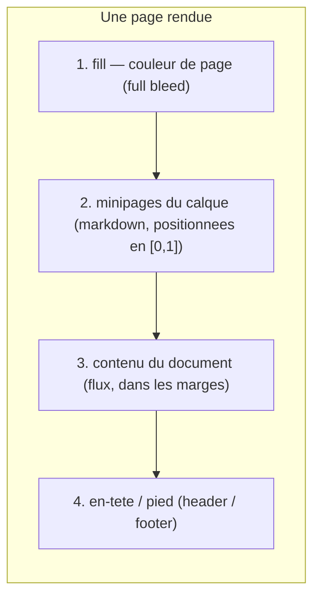
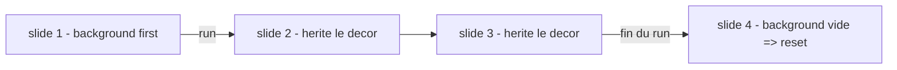

> **Statut :** **design exploratoire, non figé.** Ce document propose un bloc
> ` ::: background ` qui pose un **calque de fond** sur la page : des **minipages
> markdown** (contenu récursif) placées à des **coordonnées relatives**, derrière
> le contenu du document. Méthodo **pilotée par invariants** (comme
> [GITHUB-SYNC-SPEC](GITHUB-SYNC-SPEC.md) / [VOLUMES-SPEC](VOLUMES-SPEC.md)) :
> B1–B5 (§1) sont la source de vérité.
>
> **La v0.2 remplace le modèle de la v0.1** (un fence ` ```background ` à corps
> DSL `image`/`text`/`fill`) par un modèle plus *markpage-native* : un **bloc
> `:::`** dont le corps est du **markdown récursif** (une *minipage* à la LaTeX),
> un **construct unique** (pas de conteneur), des coordonnées **[0,1]²** avec
> **ancre auto-alignée**, et un **reset par bloc vide**. **Rien n'est implémenté ;
> le nom (`background`) reste révisable** (§9). À terme, référencer depuis
> [AI-AUTHORING.md](../AI-AUTHORING.md) et [FEATURES.md](../FEATURES.md).

**Objet :** offrir une **mise en page libre** dans markpage — placer des blocs de
contenu (texte, images, et n'importe quel construct markpage) à des positions
arbitraires d'une page — pour deux usages que le flux vertical du Markdown ne
sert pas : les **affiches / couvertures** (la page *est* la composition) et les
**gabarits de slide** (un décor récurrent derrière le contenu). On réutilise
**tout le pipeline de rendu** récursivement plutôt qu'un vocabulaire ad hoc.

::: tip [Comment lire ce document]
Les **Invariants** (§1) et le **Modèle** (§2) sont le cœur stable. La **Syntaxe**
(§3–§5) est une proposition concrète. Le **Rendu** (§7) esquisse l'implémentation.
Tout est **exploratoire** : on fige les invariants, on itère le reste.
:::

## 1. Invariants

Le design évolue **par invariants**, posés un par un (méthodo
[FORMAL-METHOD-SPEC](FORMAL-METHOD-SPEC.md)). B1–B5 sont la **source de vérité** ;
§2–§8 en sont la déclinaison.

**B1 — Calque de fond, hors flux.** Le bloc **ne participe pas au flux** : il
**décore la page**. Le contenu normal (corps, contenu de slide) se rend
**par-dessus** (z-order : fond derrière). Le bloc n'occupe **aucune hauteur** à sa
position source — comme ` ```header ` / ` ```footer `.

**B2 — Un construct unique, reset par bloc vide.** Il n'y a **pas de conteneur** :
chaque bloc ` ::: background ` **est** une minipage posée sur le calque de fond de
la page. Plusieurs blocs **s'accumulent**. Un bloc ` ::: background ` **vide**
(sans attribut ni contenu) **efface** le calque — exactement comme un
` ```header ` / ` ```footer ` vide efface sa bande. Pas d'orphelin possible : un
bloc cible **toujours** le fond de la page courante.

**B3 — Contenu = minipage markdown récursive.** Le corps du bloc est du **markdown
complet**, rendu par **le même pipeline** que le document (titres, listes, images,
math, `chart`, `category`…). **`size` dit la taille, `at` dit l'endroit** : une
minipage **dimensionnée** (`size`) a une **largeur relative** et une **hauteur
automatique** (comme une `minipage` LaTeX), placée par `at`. **Sans `size`, la
minipage recouvre toute la page** — c'est le **fond plein** (un `fill` la peint,
une image plein cadre la remplit). `text` et `image` ne sont donc **pas** des
primitives — ce sont juste du markdown.

**B4 — Coordonnées [0,1]², ancre auto-alignée.** Une position `at` est un point
`(x, y)` avec `x, y ∈ [0,1]` ; origine **haut-gauche**, `(1,1)` = **bas-droite**.
Par **défaut**, on aligne le point `(x, y)` **de la page** avec le **même** point
`(x, y)` **de la minipage** (ancre = position). Override possible. Repère **full
bleed** par défaut (bord à bord), **zone de contenu** avec `margins`.

**B5 — Cascade par bloc.** Une minipage vaut pour **la page courante et les
suivantes**, jusqu'à effacement (B2) — sémantique de cascade des en-têtes / pieds
(§26.5 de l'app). `first` la restreint à la **première page du run** (couverture).

::: important
B1 + B2 + B5 font de ce bloc le **pendant « fond » des fences `header`/`footer`** :
même mécanique de cascade et de reset, mais un **calque markdown pleine surface**
derrière le contenu, au lieu d'une bande de marge. Réutiliser cette machinerie
(et le pipeline de rendu pour le corps) est le fil conducteur de l'implémentation.
:::

## 2. Le modèle

Une page rendue est un **empilement de calques**, du fond vers l'avant :



Le bloc fournit les calques **1 et 2** (le *fond*). Sur une **couverture**, le
flux (3) est typiquement **vide** — toute la page vit dans le fond ; sur une
**slide**, le contenu (3) se pose **par-dessus** le décor (1–2).

La **cascade** (B5) attache le calque à une suite de pages ; un **bloc vide** le
ferme (B2) :



## 3. Syntaxe

Un bloc Pandoc `:::` de classe `background`. L'**info-string** porte les
**attributs** de placement ; le **corps** est du **markdown** (la minipage).

````markdown
::: background at=0.5,0.4 size=0.6
# **Rapport annuel**

*Direction de la recherche — 2026*
:::
````

Grammaire de l'info-string :

```ebnf
infoString = "background", { ws, attr } ;
attr       = "first"
           | "margins"
           | ( "at", "=", coord )
           | ( "size", "=", fraction )
           | ( "anchor", "=", coord )
           | ( "fill", "=", color ) ;
coord      = fraction, ",", fraction ;
fraction   = "0" | "1" | ( "0", ".", digit, { digit } ) | ( ".", digit, { digit } ) ;
color      = ( "#", hexDigit, { hexDigit } ) | cssName ;
```

| Attribut | Défaut | Rôle |
| :-- | :-- | :-- |
| `size=w` | *(pleine page)* | Largeur de la minipage = `w ×` largeur du repère ; **hauteur auto**. **Absente ⇒ minipage pleine page** (tout le repère). |
| `at=x,y` | `0.5,0.5` | Position (ancre) de la minipage **dimensionnée**, en [0,1]² (B4). Sans `size` (pleine page), `at` ne s'applique pas. |
| `anchor=ax,ay` | `= at` | Point de la minipage aligné sur `at` (override de l'ancre auto). |
| `fill=color` | — | Couleur de fond derrière la minipage : **toute la page sans `size`**, sinon la boîte de la minipage. |
| `first` | — | Décore la **première page du run** seulement (B5). |
| `margins` | — | Repère = **zone de contenu** au lieu de full bleed (B4). |

::: note [Une seule règle : `size` décide pleine page vs positionné]
- **`size` absent** → la minipage **est** la page (le repère entier) : **fond
  plein** (`fill` pour une couleur, une image pour un visuel).
- **`size` présent** → minipage **dimensionnée** (largeur `size`, hauteur auto),
  placée par `at`.
- **bloc nu** (ni `size`, ni `fill`, ni contenu) → **reset** (B2).
:::

::: note [Corps = markdown récursif]
Le corps accepte **tout** le vocabulaire markpage : titres, listes, emphase,
images ``, math `$…$`, et même les fences (`chart`, `category`…). Les refs
d'image sont les refs markpage habituelles (chemins relatifs / assets importés).
Il n'y a **pas** de primitives `text`/`image` : on écrit du markdown.
:::

## 4. Coordonnées & ancre (B4)

Coordonnées en **[0,1]²**, origine haut-gauche. L'**ancre auto-alignée** aligne le
point `(x, y)` de la **page** avec le **même** point de la **minipage** :

| `at` | Résultat (ancre par défaut) |
| :-- | :-- |
| `0,0` | minipage **collée en haut-gauche** |
| `1,1` | collée en **bas-droite** |
| `0.5,0.5` | **centrée** |
| `1,0` | coin **haut-droite** |
| `0.5,0` | **centrée en haut** |

> Conséquence : placer dans un **coin** ne déborde **jamais** (l'ancre suit le
> coin). C'est l'`anchor` d'un *node* TikZ, réglé automatiquement.

**Override.** `anchor=ax,ay` aligne un *autre* point de la minipage sur `at` —
p.ex. `at=0.5,0.5 anchor=0,0` pose le **coin haut-gauche** de la minipage au
**centre** de la page.

**Repère.** Full bleed par défaut (`0,0`–`1,1` = bords de la **feuille**, marges
comprises) ; `margins` restreint le repère à la **zone de contenu**.

| Repère | `0,0` | `1,1` | Mot-clé |
| :-- | :-- | :-- | :-- |
| **Full bleed** (défaut) | coin de la **feuille** | coin opposé | — |
| **Zone de contenu** | coin de la zone de texte | coin opposé | `margins` |

::: warning [Full bleed ⇒ impression jusqu'au bord]
markpage imprime via paged.js avec `@page { margin: 0 }` (cf. print-export,
[SPEC §13.6](SPEC.md)) : les marges sont dans les `div` de page. Le calque de fond
se pose **avant** ces marges → il atteint le bord. À documenter dans le dialogue
d'impression (« Marges : Aucune »).
:::

## 5. Cascade & reset (B5, B2)

Aligne sur la sémantique des fences `header` / `footer` (§26.5 de l'app) :

Poser (cascade)
:   Un ` ::: background at=… ` décore la **page courante** et **toutes les
    suivantes**. Plusieurs blocs **s'accumulent** sur le calque.

Première page seulement
:   ` ::: background first at=… ` ne décore que la **première page du run** — une
    **couverture** distincte du décor récurrent.

Effacer
:   Un ` ::: background ` **vide** (ni attribut ni contenu) **efface tout le
    calque** pour les pages suivantes.

````markdown
::: background
:::
````

::: caution [Le reset est « tout effacer »]
En V1, pas d'identité par élément : le bloc vide efface **l'ensemble** du calque.
Pour *changer* un seul élément, on efface puis on repose la composition. Porte de
sortie future si besoin d'effacement partiel : des **calques nommés** (§8).
:::

## 6. Rapport à la pagination & au mode slides

::: note
Le bloc ne **force pas** de saut de page : il décore **la page sur laquelle il
tombe**, et la cascade fait le reste.
:::

- **Couverture.** Placer les blocs en tête de document avec `first` : ils
  décorent la page 1 seulement ; le contenu suivant repousse en page 2 (ou un
  titre / `chapterBreak` démarre la suite sur une nouvelle page).
- **Mode slides** (`slides: true`, [§slides](../AI-AUTHORING.md)). Chaque `## h2`
  ouvre une **slide = une page**. Des blocs posés **avant la première `##`**
  deviennent le **gabarit de toutes les slides** ; un bloc vide plus loin **coupe**
  le décor ; de nouveaux blocs le **remplacent**. C'est le cas « gabarit
  récurrent ».

## 7. Rendu (esquisse d'implémentation)

::: caution [Conception, pas encore de code]
Cette section esquisse *comment* on rendrait le bloc ; elle n'engage pas l'API.
:::

- **Parsing** : étendre le parseur de blocs `:::` pour accepter des **attributs**
  `clé=valeur` dans l'info-string (aujourd'hui : `::: classe [Titre]`). Le corps
  reste du markdown.
- **Rendu du corps** : le markdown de chaque bloc passe par **le même pipeline**
  que le document (récursif) → un fragment HTML. La minipage est un conteneur de
  **largeur = `size × largeur-repère`**, hauteur auto.
- **Positionnement** : conteneur en position absolue dans un **calque page-sized**
  (z-index **sous** le contenu) ; `left/top` = `at` en `%` ; l'**ancre** via
  `transform: translate(calc(-1 * ax * 100%), calc(-1 * ay * 100%))` (ax,ay =
  ancre). `fill` → couleur de fond du calque (ou du conteneur).
- **Paginé** (paged.js) : le calque se **rattache à chaque page** du run, derrière
  la zone de contenu — réutiliser la **machinerie de cascade** des en-têtes/pieds
  (mêmes runs, même reset), et un *handler* qui clone le calque dans chaque
  `.pagedjs_page` (sous `.pagedjs_page_content`). **Full bleed** : le calque
  s'étend à la **boîte de page** entière.

::: note [Réutilisations]
Cascade & reset : moteur des en-têtes/pieds. Rendu du corps : pipeline markpage.
Refs d'images : [resource-mapping](../src/resource-mapping.ts). Renderer du
bloc : façon [`@orlarey/blocks`](../packages/blocks/) ou un *extension*
`marked-config`.
:::

## 8. Non-buts & différés

::: caution

- **Formes & flèches** (rectangles, lignes, cercles, flèches d'annotation) —
  hors V1. Le cas « figures annotées » relèverait d'un bloc distinct.
- **Image plein cadre** (`fit cover` pour qu'une **photo** remplisse une minipage
  pleine page) — différé. Le **fond uni pleine page** est, lui, **supporté** (un
  ` ::: background fill=… ` sans `size`, §3) ; seule une photo recadrée plein cadre
  demande un `fit` (sinon l'image garde son ratio).
- **Effacement partiel / calques nommés** (`::: background layer=foo`, reset
  ciblé) — différé ; V1 = un seul calque, reset global.
- **Rotation** des minipages (`rotate=<deg>`) — différé (facile à ajouter comme
  attribut).
- **Fond par défaut** via Réglages → Page — différé ; pendant des en-têtes/pieds
  par défaut.
- **Animation / interactivité** — hors sujet (sortie = PDF statique).
:::

## 9. Nom du bloc (retenu : `background`, révisable)

`background` : nom **commun** (cohérent avec `header`/`footer`/`columns`/`note`),
qui dit l'intention (**fond de page**) et la parenté avec les bandes de
running-content. Alternatives écartées mais notées :

| Nom | Pour | Contre |
| :-- | :-- | :-- |
| **`background`** *(retenu)* | convention markpage, parenté `header`/`footer` | un peu générique ; `background at=…` se lit comme un nom « placé » |
| `place` | se lit bien avec `at=` (verbe « poser ») | seul **verbe** (rompt la convention de noms communs) |
| `backdrop` / `frame` | « décor » / « cadre » | `backdrop at=…` se lit mal ; `frame` évoque une bordure |

::: note
Choix **confirmé** : `background` (explicite). Alternatives conservées pour mémoire.
:::

## 10. Exemples

**Une couverture** (`first` l'isole, le corps démarre en page 2). Le **1ᵉʳ bloc
sans `at` = fond plein** ; les suivants sont positionnés :

````markdown
::: background first fill=#f4efe6
:::

::: background first at=0.5,0.42 size=0.7
# **Rapport annuel**

*Direction de la recherche — 2026*
:::

::: background first at=0.92,0.06 size=0.15

:::

# Rapport annuel
…le corps du rapport commence ici (page 2)…
````

**Un gabarit de slide récurrent** (fond plein + bandeau + logo + pied hérités sur
toutes les slides ; le contenu se rend par-dessus) :

````markdown
::: background first at=0.5,0.5 size=0.8
# **markpage**

Une démo en slides
:::

::: background fill=#fbfbf9
:::
::: background at=0.5,0.0 size=1.0

:::
::: background at=0.94,0.05 size=0.06

:::
::: background at=0.5,0.97 size=0.5
*© Yann Orlarey*
:::

## Première slide de contenu
- le décor (fond + bandeau + logo + pied) est **hérité** ici et sur les suivantes
- le contenu se rend **par-dessus**

## Deuxième slide
…idem…
````

::: tip
L'**ordre source** des blocs **est** le z-order du calque ; le contenu Markdown de
la page/slide se pose **au-dessus de l'ensemble** (B1).
:::

## 11. Compagnon — bloc de style récursif (`::: style`)

Le markdown ne porte ni couleur ni réglage typographique local. Plutôt qu'un
attribut `color=` **spécifique** à `background`, on **joue la récursivité** : un
bloc **générique** ` ::: style <params> ` qui applique des **overrides
typographiques** à son contenu markdown, utilisable **partout** — flux normal
**et** à l'intérieur d'une minipage de fond.

````markdown
::: style color=#ffffff size=28pt align=center font="Inter" weight=700
# Titre clair, grand, centré sur un fond sombre
:::
````

Paramètres = le **sous-ensemble typographique** du `Style` par élément de markpage :
`color`, `size` (pt), `font` (famille), `weight`, `italic`, `underline`, `align`,
`line-height`.

- **généralise `color`** (ce n'est qu'un paramètre parmi d'autres) ;
- **composable & récursif** : un ` ::: style ` dans un ` ::: background ` donne le
  titre clair / grand / centré sur fond sombre — sans rien de spécial ;
- **sa propre feature** : il **dépasse** le fond de page (il sert partout) et
  mériterait **sa propre spec** (`STYLE-SPEC`). Mentionné ici car il **résout** la
  typo des couvertures.

::: warning [Décision de politique à acter]
markpage **refuse aujourd'hui** le style en ligne / les classes (`{.classe}`, HTML
brut) — la typo vit dans le **profil de Réglages**, par élément (AI-AUTHORING,
« *What is NOT supported* »). Un ` ::: style ` **introduit du style local** : c'est
un **renversement assumé** de cette règle (contrôlé, paramètres nommés, pas de CSS
brut), justifié par les couvertures/affiches que le profil ne peut pas exprimer.
**À trancher consciemment** — et idéalement dans `STYLE-SPEC`, pas ici.
:::

## 12. Questions ouvertes

**Tranché :** `size` décide (absent ⇒ **pleine page**, fond plein supporté ;
présent ⇒ minipage `size` × hauteur auto, placée par `at`) ; `fill` derrière la
minipage ; **typo locale via ` ::: style `** (§11), comme bloc **compagnon** à
spécifier à part.

Restant :

- **`::: style`** : feature à part entière, **acté** → voir
  [STYLE-SPEC](STYLE-SPEC.md) (le style local contrôlé est **assumé**).
- **`at` par défaut** d'une minipage dimensionnée sans `at` : centre `0.5,0.5`
  (proposé) ?
- **Image plein cadre** (`fit cover`) — différé (§8).
- **Numérotation sur une couverture** — **orthogonal** (pagination), à part.
