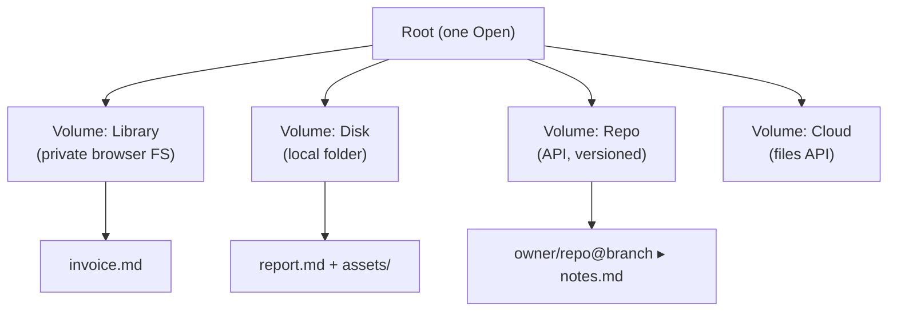

# Blueprint — a desktop-like file system for a serverless web app

*A reusable, project-agnostic design document. Drop it at the root of a new
repository and hand it to an AI coding agent (e.g. Claude Code) as the spec for
building the file system. It is written in portable Markdown (no special
extensions) so it renders anywhere. Extracted from
[markpage](https://github.com/orlarey/markpage), where it ships as of 0.32.x —
markpage is cited as the worked example, but nothing here depends on it.*

## Thesis

Offer, inside a **static web app** (no server, no installation, the user's data
stays on their machine), the experience of a **desktop application**: a single
*Open*, one root, **mounted volumes**, visible folders and files, opened and
saved explicitly. The whole challenge is mapping that familiar model onto the
**constrained primitives** of the browser sandbox — without ever losing data.

> **How to use this with an AI.** Give the agent sections 1–5 as context (the
> *what* and the *why*), then drive section 6 (the recipe) one step at a time.
> The "Anatomy" table names the modules to create; the invariants are the
> acceptance criteria. Tell the agent explicitly it may not claim to have tested
> the native file-picker flows (see the caveat in §6).

## 1. The mental model

Fix this vocabulary before any code — give it to the AI as a preamble.

- **Root** — the app's **single** namespace. One *Open* command exposes it. No
  multiple "open from X" commands.
- **Volume** — a **mounted**, browsable tree backed by one storage *engine*.
  Identity = `(logical root, backend)`. Examples: a private browser FS, a local
  folder, a remote repository.
- **Mount** — attaching a volume to the root **and persisting** that attachment
  so it is found again on next launch. Unmounting ≠ deleting the content.
- **Document** — the edited unit. It has *committed* content (last save) and a
  *working copy* (current edits).
- **Origin** — the **single** volume a document belongs to. Editing happens **in
  place**: saving rewrites the origin.
- **Perimeter** — the set of files that "belong" to a document: the main file
  plus its resources (relative-path images). The perimeter is what travels when
  you save to a remote volume.



## 2. The sandbox constraints (what forces the design)

This is the most transferable part: the browser does **not** give you a
desktop-grade disk. The design follows from these limits.

**Two access primitives, which cannot be merged.**

- **The mount** — a *folder* whose handle you keep and **re-browse** (tree,
  read/write). *File System Access* API (`showDirectoryPicker`) → **Chromium
  only**.
- **The picked file** — the user **points at one file**, once. `<input
  type=file>` (everywhere) or `showOpenFilePicker` (Chromium). No tree, no free
  navigation of the disk.

> **Direct consequence.** You **cannot** make a loose file (in *Downloads*, say)
> "be" a volume — the browser forbids enumerating the disk. You can only **unify
> the UX** (a single *Open* that offers the volumes **and** an "open a file from
> this device" action). Plumbing ≠ presentation.

**Persistence — three tiers, each for a precise use.**

| Need | Mechanism | Why |
| :-- | :-- | :-- |
| Private FS, offline, always present | **OPFS** (Origin Private File System) | A real per-origin file system, invisible to the OS file manager |
| Non-serializable handles, binary blobs | **IndexedDB** | `FileSystemHandle` is structured-clonable but not JSON-serializable; same for images |
| Small tables (mounts, mappings) | **localStorage** | Simple, synchronous, enough for light metadata |

**Permissions & lifecycle.**

- Disk access requires a **user gesture**; the RW permission often has to be
  **re-requested after a tab reload** (the handle persists, the permission does
  not).
- **No file-watching**: to detect an external change you **poll** (disk mtime,
  remote `ETag`/`sha`) on focus/visibility plus an interval.

**Network & conflicts.**

- A remote volume is a **REST API** (git repo, file cloud). Conflicts are
  detected by **version identity** (`ETag`, git sha), never by client-side
  content diffing.
- Every remote write is **conditional** (If-Match / expected ref) so you never
  overwrite blindly.

## 3. The invariants

Invariant-driven, so they double as acceptance criteria.

**I1 — One namespace.** A single *Open* command. No separate "open from disk /
from repo / import": those are *locations* or *consequences of format*, not
commands.

**I2 — Volume = (root, backend).** The mount is persisted. **Unmounting is
forbidden while a document from that volume is open** (otherwise you orphan a
live origin).

**I3 — Single origin, edit in place.** A document belongs to the volume it was
opened from; *Save* rewrites there. No simultaneous multiple origins.

**I4 — Open in place, or import a copy.** A file's fate **follows from its
format**, not from a command: a **native** format (the app's own, e.g. `.md`)
**opens in place**; a **foreign** format (`.docx`, `.html`, `.txt`) is
**converted** into a **copy** in the private FS. "Import" is therefore not a
command, just an *Open* of a foreign format.

**I5 — Save = (volume, path).** *Save As* picks a `(volume, folder, name)`
target. The notion of "link to a repo/disk" **disappears**: linking is just
saving elsewhere.

**I6 — No data loss, ever.** For a remote, versioned volume:

- **Verbatim** — the file written is exactly the document (byte for byte), not a
  re-serialization.
- **Closed perimeter** — you publish the main file **and** its relative
  resources, together.
- **Divergence → non-destructive fork** — if the origin moved on its side, you
  **do not overwrite**: you write a **new file** `foo-<sha>.md` and re-link the
  document to that fork. Detection is by **version identity** (sha/ETag), never
  by heuristic.

> **The rule that makes I6 real:** every remote write is conditional, and every
> divergence produces a fork, not an overwrite. This is what separates a toy
> editor from a safe tool.

## 4. The operations

**Open.** The unified browser lists the root (the volumes), then descends the
chosen volume's tree. Opening an entry:

- native format → **open in place** (the document takes that volume as origin);
- foreign format → **import as a copy** (into the private FS).

The same dialog offers **"Open a file…"** — a file from the device, outside any
mounted volume — via the native picker on Chromium, falling back to `<input>`
elsewhere. Same format-driven routing.

**Save / Save As.** *Save* commits the working copy and, if the document has an
origin, rewrites there (conditional write for remotes). *Save As* picks a new
target `(volume, folder, name)` — this is also how you "publish" to a remote
volume.

**The remote-save state machine** (2×2):

| Edited locally? | Origin moved ahead? | Transition |
| :-- | :-- | :-- |
| no | no | **No-op** |
| no | yes | **Reload** (incoming fast-forward) |
| yes | no | **Fast-forward** (simple push) |
| yes | yes | **Fork** (`foo-<sha>.md`, never an overwrite) |

The no-loss proof: every cell either keeps both versions or modifies none.

**Reload / Unlink / Delete.**

- **Reload** — a manual *pull* from the origin (the polled remote signals it
  moved ahead).
- **Unlink** — drop the origin (the backend content is left intact).
- **Delete** — a **soft** delete to a **Trash** (a place in the private FS),
  restorable and emptyable.

## 5. Anatomy of an implementation

Generic roles and the file you would create for each (names are suggestions):

| Role | Responsibility | Suggested module |
| :-- | :-- | :-- |
| **Volume abstraction** | Common interface `state / list / readText` (+ write via the document layer); one adapter per backend | `volumes.ts` |
| **Mount registry** | Mount/unmount, **persist** (disk handles in IndexedDB, repos in localStorage), `listVolumes()` | `volume-registry.ts` |
| **Unified browser** | Modal: root → volume → folders; *open* / *save* modes; "Open a file…"; trash | `ui/volume-browser.ts` |
| **Backend: private FS** | OPFS, the "always there" origin, flat or nested | `docs.ts`, `opfs.ts` |
| **Backend: disk** | File System Access; persisted handles; bundle `content.md` + `assets/<sha>.<ext>` | `disk-link.ts` |
| **Backend: repo** | REST + **Git Data API** (atomic commit blob → tree → commit → ref) | `repo-sync.ts` |
| **Backend: cloud** | Files API (app-folder), `ETag` + If-Match | `cloud.ts` |
| **Resource mapping** | Resolve relative-path images ↔ their binary (by sha), for rendering and publishing | `resource-mapping.ts` |
| **Import (format consequence)** | Convert a foreign format to the native one + hoist images | `import.ts` |
| **Orchestration** | Wire *Open/Save/Reload/Unlink*, the origin indicator, the polling | `main.ts` |

The minimal volume interface to reproduce:

```ts
interface Volume {
  readonly id: string;
  readonly kind: string;
  readonly label: string;
  state(): Promise<'ready' | 'needs-permission' | 'offline' | 'error'>;
  list(path: string): Promise<VolumeEntry[]>; // '' = root
  readText(path: string): Promise<string>;
}
interface VolumeEntry {
  name: string;
  path: string;          // relative to the volume, no leading /
  type: 'file' | 'dir';
  isNative: boolean;     // true → open in place; false → import (I4)
}
```

## 6. Recipe for an AI agent

An **ordered** plan; each step is shippable and testable on its own. Give the
agent §1–§5 as context, then these steps one at a time.

> **Verification caveat: native pickers are not automatable.** The *File System
> Access* / `<input type=file>` pickers **cannot be driven** in a headless test.
> Unit-test the **pure parts** (listing helpers, bundle serialization, feature
> gating); the pick→write→read flows are **verified by hand** by a human, in a
> real Chromium browser. Instruct the agent not to claim it tested those flows.

**Step 0 — Frame it.** Capture the vocabulary (§1) and invariants (§3) in a spec
file. Everything else refers back to it.

**Step 1 — Volume abstraction + first backend.** Define the `Volume` interface
(§5) and the **private-FS** (OPFS) adapter: the "always there", offline origin
that needs no permission. *Verify*: unit tests of the pure listing helpers.

**Step 2 — Mount registry.** Mount/unmount, **persist** (disk handles in
IndexedDB — they are not JSON-serializable; repos/identifiers in localStorage),
expose `listVolumes()`. *Pitfall*: never store a handle as JSON. *Verify*: a
mount survives a tab reload.

**Step 3 — Unified browser.** One modal: the root (volumes as top-level folders)
→ the volume's tree. *open* and *save* modes (save adds a name field).
*loading / empty / error* states (a remote volume is async). *Verify*:
navigation, breadcrumb, Esc / click-outside.

**Step 4 — Open, format-driven (I4).** On selection: native format → open in
place; foreign format → import a copy. Add **"Open a file…"** to the dialog:
`showOpenFilePicker` (Chromium) **or** the `<input type=file>` fallback
(everywhere). *Pitfall*: do **not** gate that button on File System Access
availability, or browsers without mounts lose all file input.

**Step 5 — Save / Save As (I5).** *Save* commits + (if origin) rewrites. *Save
As* picks `(volume, folder, name)`; this command **absorbs** any old "Link
to…". *Manual verify*: create in the private FS, *Save As* to a disk folder,
check the files in the OS file manager.

**Step 6 — Origin & origin operations.** An **origin indicator** (volume +
path). A single *Reload* (pull, routed by origin), a single *Unlink*.
**Forbid unmounting** a volume that has an open document (I2).

**Step 7 — The remote-sync engine (I6).** For a versioned repo: compute the
**blob sha** locally on the **raw bytes**; publish as one **atomic commit** (blob
→ tree → commit → *conditional* ref update); on **divergence** (the ref moved),
write **`foo-<sha>.md`** and re-link — no overwrite. Implement the **2×2 state
machine** from §4. *Manual verify*: edit the same origin from two tabs →
divergence must produce a fork.

**Step 8 — Trash.** Soft delete to a place in the private FS; restore / purge /
empty. *Verify*: a deleted document is restorable until the trash is emptied.

> **Cross-cutting pitfall — keyboard shortcuts.** If the editor is a
> *contentEditable* (CodeMirror, etc.), **Firefox does not bubble** `Ctrl/Cmd`+key
> combos up to the `window` listener the way Chromium does. Bind app shortcuts
> **inside the editor keymap** (not only on `window`), and keep the global
> handler for the unfocused-editor case, guarded by `if (e.defaultPrevented)
> return` to avoid a double trigger.

## 7. Pitfalls and lessons (checklist)

- **Non-serializable handles** → IndexedDB (structured clone), never JSON.
- **RW permission re-requested** after reload: model a *needs-permission* state
  and a re-grant triggered by a click.
- **"Open a file…" not gated** on File System Access (keep the `<input>`
  fallback), or Safari/Firefox lose import.
- **A picked file is not a volume**: unify the UX, not the plumbing.
- **Remote writes always conditional** + divergence → fork (never an overwrite).
- **No file-watching**: poll mtime/ETag on focus + interval.
- **OAuth-redirect `interaction_in_progress`** (MSAL-style flows): clear the
  stuck flag and replay the redirect-promise handler on startup.
- **Import that always copies**: route by **format** (a native file opens in
  place), otherwise you lose the link to the origin.

## 8. Decisions & alternatives

**Path A vs path B.** Two ways to introduce volumes:

- **Path A — a UX layer** over an existing model (a document lives in the private
  FS and carries an origin *link*). Incremental, ships fast, reuses the existing
  backends.
- **Path B — a data model**: a document truly **belongs** to a volume (origin is
  a first-class property, not a grafted link). Cleaner, but a rewrite of the
  document module.

**Recommendation**: aim for **B as the mental model, ship via A**. State that
debt explicitly so "link" and "ownership" don't get confused later.

> **And "sharing"?** "Shared" is not a fifth primitive: it is a **property of a
> remote volume** (several devices open the same origin). This model does **not**
> promise real-time collaboration — it promises **loss-free conflicts** (I6).
> Say so instead of implying it.
