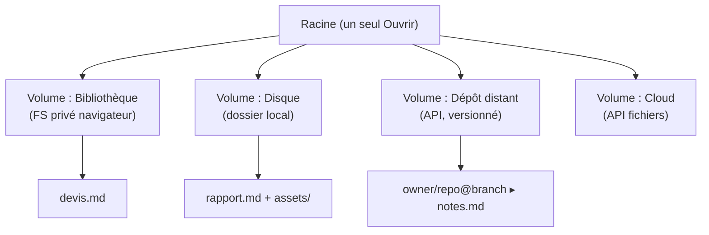

> **Statut :** blueprint réutilisable, extrait de markpage 0.32.x. Ce document
> n'est pas la spec d'une fonctionnalité à venir : c'est le **modèle, les
> invariants, les contraintes et la recette d'implémentation** du système de
> fichiers de markpage, généralisés pour être **réemployés dans un autre
> projet** — typiquement en le donnant tel quel à une IA comme Claude Code.
> markpage sert d'**exemple concret** : chaque pièce générique est reliée au
> fichier qui l'incarne (cf. [VOLUMES-SPEC](VOLUMES-SPEC.md) et
> [GITHUB-SYNC-SPEC](GITHUB-SYNC-SPEC.md) pour le détail interne).

**Thèse.** Offrir, dans une **appli web statique** (pas de serveur, pas
d'installation, données chez l'utilisateur), l'expérience d'une **application
de bureau** : un seul *Ouvrir*, une racine, des **volumes montés**, des
dossiers et des fichiers visibles, ouverts et enregistrés explicitement. Le
défi est de plaquer ce modèle familier sur les **primitives contraintes** du
bac à sable navigateur, sans jamais perdre de données.

::: tip [Comment lire ce document]
Les sections **Modèle**, **Contraintes** et **Invariants** sont le cœur
réutilisable (vrai pour n'importe quel projet). La section **Recette pour une
IA** est la marche à suivre concrète. La colonne « markpage » des tableaux
montre une implémentation de référence — à transposer, pas à copier mot pour
mot.
:::

## 1. Le modèle mental

Vocabulaire (à fixer avant tout code — le donner à l'IA en préambule) :

Racine
: L'espace de noms **unique** de l'appli. Un seul point d'entrée *Ouvrir*
  l'expose. Pas d'« ouvrir depuis X » multiples.

Volume
: Un arbre **monté**, navigable, adossé à un *backend* (moteur de stockage).
  Identité = `(racine logique, backend)`. Exemples : un FS privé navigateur,
  un dossier disque, un dépôt distant.

Montage
: L'acte d'attacher un volume à la racine (et de **persister** ce rattachement
  pour le retrouver au prochain démarrage). Démonter ≠ supprimer le contenu.

Document
: L'unité éditée. Il a un contenu *committé* (dernier enregistrement) et une
  *copie de travail* (édition en cours).

Origine
: Le volume **unique** auquel un document est rattaché. L'édition se fait
  **en place** : enregistrer réécrit l'origine.

Périmètre
: L'ensemble des fichiers qui « appartiennent » à un document — le `.md` plus
  ses ressources (images en chemin relatif). C'est ce périmètre qui voyage
  lors d'un enregistrement vers un volume distant.



::: note
markpage monte **quatre** volumes : Bibliothèque (OPFS), Disque (File System
Access), Dépôt GitHub (REST + Git Data API), OneDrive (Microsoft Graph). Les
trois premiers backends **existaient déjà** : le modèle « volumes » est une
**re-présentation unifiée** par-dessus, pas une réécriture (c'est la *voie A*,
cf. §8).
:::

## 2. Les contraintes du bac à sable (ce qui force le design)

C'est la partie la plus transférable : le navigateur n'offre **pas** un accès
disque d'appli de bureau. Le design découle de ces limites.

**Deux primitives d'accès, non fusionnables.**

- **Le montage** — un *dossier* dont on garde le handle et qu'on **re-parcourt**
  (arborescence, lecture/écriture). API *File System Access*
  (`showDirectoryPicker`) → **Chromium uniquement**.
- **Le fichier pické** — l'utilisateur **désigne un fichier**, une fois.
  `<input type=file>` (partout) ou `showOpenFilePicker` (Chromium). Pas
  d'arborescence, pas de navigation libre du disque.

::: warning [Conséquence directe]
On **ne peut pas** faire qu'un fichier isolé (dans *Téléchargements*, p. ex.)
« soit » un volume : le navigateur interdit d'énumérer le disque. On peut
seulement **unifier l'UX** (un seul *Ouvrir* qui propose les volumes **et** une
action « ouvrir un fichier de l'appareil »). Plomberie ≠ présentation.
:::

**Persistance — trois étages, chacun pour un usage précis.**

| Besoin | Mécanisme | Pourquoi |
| :-- | :-- | :-- |
| FS privé, hors-ligne, toujours présent | **OPFS** | Un vrai système de fichiers par origine, invisible à l'utilisateur OS |
| Handles non sérialisables, blobs binaires | **IndexedDB** | `FileSystemHandle` se *structured-clone* mais pas en JSON ; idem images |
| Petites tables (montages, mapping) | **localStorage** | Simple, synchrone, suffisant pour des métadonnées légères |

**Permissions & cycle de vie.**

- L'accès disque exige un **geste utilisateur** ; la permission RW doit souvent
  être **re-demandée après un rechargement** d'onglet (le handle persiste, pas
  la permission).
- **Pas de file-watching** : pour détecter un changement externe, on **scrute**
  (mtime sur disque, `eTag`/`sha` côté distant) sur focus/visibilité + un
  intervalle.

**Réseau & conflits.**

- Un volume distant = une **API REST** (dépôt git, cloud de fichiers). Les
  conflits se détectent par **identité de version** (`eTag`, sha git), jamais
  par diff de contenu côté client.
- Toute écriture distante est **conditionnelle** (If-Match / ref attendue) pour
  ne jamais écraser à l'aveugle.

## 3. Les invariants

Méthodo « pilotée par invariants » (comme [VOLUMES-SPEC](VOLUMES-SPEC.md) et
[GITHUB-SYNC-SPEC](GITHUB-SYNC-SPEC.md)). Énoncés **génériques** ; entre
parenthèses, leur nom dans markpage.

**I1 — Un seul espace de noms** (V1). Une seule commande *Ouvrir*. Pas de
« ouvrir depuis le disque / depuis le dépôt / importer » séparés : ce sont des
*emplacements* ou des *conséquences de format*, pas des commandes.

**I2 — Volume = (racine, backend)** (V2). Le montage est persisté. **Démonter
est interdit si un document de ce volume est ouvert** (sinon on orpheline une
origine vivante).

**I3 — Origine unique, édition en place** (V3). Un document appartient au
volume où on l'a ouvert ; *Enregistrer* y réécrit. Pas d'origines multiples
simultanées.

**I4 — Ouvrir en place, ou importer une copie** (V4). Le sort d'un fichier
**découle de son format**, pas d'une commande : un format **natif** (`.md`)
s'ouvre **en place** ; un **format étranger** (`.docx`, `.html`, `.txt`) est
**converti** en une **copie** dans le FS privé. *Importer* n'est donc pas une
commande, juste un *Ouvrir* d'un format étranger.

**I5 — Enregistrer = (volume, chemin)** (V5). *Enregistrer sous* choisit un
couple (volume, dossier, nom). La notion de « lier à un dépôt/disque »
**disparaît** : lier, c'est enregistrer ailleurs.

**I6 — Aucune perte, jamais** (R1–R4). Pour un volume distant et versionné :

- **Verbatim** : le fichier écrit est exactement le document (octet pour
  octet), pas une re-sérialisation.
- **Périmètre clos** : on publie le `.md` **et** ses ressources relatives,
  ensemble.
- **Divergence → fork non destructif** : si l'origine a avancé de son côté, on
  **n'écrase pas** — on écrit un **nouveau fichier** `foo-<sha>.md` et on
  relie le document à ce fork. La détection se fait par **identité de version**
  (sha/eTag), jamais par heuristique.

::: important
I6 est ce qui distingue un « éditeur jouet » d'un outil sûr. La règle
opérationnelle : **toute écriture distante est conditionnelle et toute
divergence produit un fork, pas un écrasement.**
:::

## 4. Les opérations

**Ouvrir.** Le navigateur unifié liste la racine (les volumes), puis descend
dans l'arbre du volume choisi. Ouvrir une entrée :

- format natif → **ouverture en place** (le document prend ce volume pour
  origine) ;
- format étranger → **import en copie** (vers le FS privé).

Le même dialogue propose **« Ouvrir un fichier… »** (un fichier de l'appareil,
hors de tout volume monté) — picker natif sur Chromium, repli `<input>`
ailleurs. Même règle de routage par format.

**Enregistrer / Enregistrer sous.** *Enregistrer* committe la copie de travail
et, si le document a une origine, y réécrit (écriture conditionnelle pour le
distant). *Enregistrer sous* choisit une nouvelle cible (volume, dossier, nom)
— c'est aussi la façon de « publier » vers un volume distant.

**La machine à états du Save distant** (2×2, généralisation de R1–R4) :

| Édité localement ? | Origine a avancé ? | Transition |
| :-- | :-- | :-- |
| non | non | **No-op** (rien à faire) |
| non | oui | **Recharger** (fast-forward entrant) |
| oui | non | **Avance rapide** (push simple) |
| oui | oui | **Fork** (`foo-<sha>.md`, jamais d'écrasement) |

La preuve d'absence de perte : chaque case conserve les deux versions ou n'en
modifie aucune.

**Recharger / Délier / Supprimer.**

- **Recharger** : un *pull* manuel depuis l'origine (le distant scruté indique
  une avance).
- **Délier** : retirer l'origine (le contenu côté backend est laissé intact).
- **Supprimer** : suppression **douce** vers une **Corbeille** (un lieu du FS
  privé), restaurable, vidable.

## 5. Anatomie d'une implémentation

Rôles génériques → fichier de référence dans markpage :

| Rôle générique | Responsabilité | markpage |
| :-- | :-- | :-- |
| **Abstraction Volume** | Interface commune `state / list / readText` (+ write via la couche document) ; un adaptateur par backend | `src/volumes.ts` |
| **Registre des montages** | Monter/démonter, **persister** (handles en IDB, dépôts en localStorage), `listVolumes()` | `src/volume-registry.ts` |
| **Navigateur unifié** | Modal racine → volume → dossiers ; modes *open* / *save* ; « Ouvrir un fichier… » ; corbeille | `src/ui/volume-browser.ts` |
| **Backend : FS privé** | OPFS, l'origine « toujours là », plate ou arborescente | `src/docs.ts`, `src/opfs.ts` |
| **Backend : disque** | File System Access ; handles persistés ; bundle `content.md` + `assets/<sha>.<ext>` | `src/disk-link.ts` |
| **Backend : dépôt** | REST + **Git Data API** (commit atomique blob→tree→commit→ref) | `src/github.ts`, `src/github-sync.ts` |
| **Backend : cloud** | API fichiers (app-folder), `eTag` + If-Match | `src/onedrive.ts` |
| **Table de mapping ressources** | Résout les images en **chemin relatif** ↔ leur binaire (sha), pour rendu/PDF et publication | `src/resource-mapping.ts` |
| **Import (conséquence de format)** | Convertir un format étranger en markdown + hisser les images | `src/import.ts` |
| **Orchestration** | Câble *Ouvrir/Enregistrer/Recharger/Délier*, l'indicateur d'origine, la scrutation | `src/main.ts` |

L'interface minimale d'un volume (à reproduire) :

```ts
interface Volume {
  readonly id: string;
  readonly kind: string;
  readonly label: string;
  state(): Promise<'ready' | 'needs-permission' | 'offline' | 'error'>;
  list(path: string): Promise<VolumeEntry[]>; // '' = racine
  readText(path: string): Promise<string>;
}
interface VolumeEntry {
  name: string;
  path: string;            // relatif au volume, sans / initial
  type: 'file' | 'dir';
  isNative: boolean;       // true → ouvrir en place ; false → importer (I4)
}
```

## 6. Recette pour une IA (Claude Code)

Marche à suivre **ordonnée**, chaque étape livrable et testable indépendamment.
Donnez à l'agent les §1–§5 en contexte, puis ces étapes une à une.

::: caution [Vérification : les pickers natifs ne sont pas automatisables]
Les sélecteurs *File System Access* / `<input type=file>` **ne se pilotent pas**
en test headless. On teste **unitairement les parties pures** (helpers de
listing, sérialisation de bundle, feature-gating) ; les flux pick→write→read
sont **vérifiés à la main** par un humain, sur un navigateur Chromium réel.
Dire explicitement à l'IA de ne pas prétendre avoir testé ces flux.
:::

**Étape 0 — Cadrer.** Fixer le vocabulaire (§1) et les invariants (§3) dans un
fichier de spec du projet. Tout le reste s'y réfère.

**Étape 1 — L'abstraction Volume + le premier backend.** Définir l'interface
`Volume` (§5) et l'adaptateur du **FS privé** (OPFS) : c'est l'origine
« toujours là », hors-ligne, qui ne dépend d'aucune permission.
*Vérif* : tests unitaires des helpers de listing purs.

**Étape 2 — Le registre des montages.** Monter/démonter, **persister** (handles
disque en IndexedDB — ils ne sont pas JSON-sérialisables ; dépôts/identifiants
en localStorage), exposer `listVolumes()`. *Piège* : ne jamais stocker un
handle en JSON. *Vérif* : un montage survit à un rechargement d'onglet.

**Étape 3 — Le navigateur unifié.** Un modal : racine (les volumes en dossiers
de premier niveau) → arbre du volume. Modes *open* et *save* (le mode *save*
ajoute un champ nom). États *chargement / vide / erreur* (un volume distant est
asynchrone). *Vérif* : navigation, fil d'Ariane, Échap/clic-extérieur.

**Étape 4 — Ouvrir, piloté par le format (I4).** À la sélection : format natif
→ ouverture en place ; format étranger → import en copie. Ajouter **« Ouvrir un
fichier… »** dans le dialogue : `showOpenFilePicker` (Chromium) **ou** repli
`<input type=file>` (partout). *Piège* : **ne pas** gater ce bouton sur la
disponibilité de File System Access, sinon les navigateurs sans montage perdent
toute entrée de fichiers.

**Étape 5 — Enregistrer / Enregistrer sous (I5).** *Enregistrer* committe + (si
origine) réécrit. *Enregistrer sous* choisit (volume, dossier, nom) ; cette
commande **absorbe** tout ancien « Lier à… ». *Vérif* manuelle : créer en FS
privé, *Enregistrer sous* vers un dossier disque, vérifier les fichiers dans le
gestionnaire de l'OS.

**Étape 6 — Origine & opérations sur l'origine.** Un **indicateur d'origine**
(volume + chemin). Un seul *Recharger* (pull, routé selon l'origine), un seul
*Délier*. **Interdire le démontage** d'un volume dont un document est ouvert
(I2).

**Étape 7 — Le moteur de sync distant (I6).** Pour un dépôt versionné :
calculer le **sha de blob** localement sur les **octets bruts** ; publier en un
**commit atomique** (blob → tree → commit → mise à jour de ref *conditionnelle*) ;
sur **divergence** (la ref a bougé), écrire **`foo-<sha>.md`** et relier — pas
d'écrasement. Implémenter la **machine 2×2** du §4. *Vérif* manuelle : éditer la
même origine depuis deux onglets → la divergence doit produire un fork.

**Étape 8 — Corbeille.** Suppression douce vers un lieu du FS privé ;
restaurer / purger / vider. *Vérif* : un document supprimé est restaurable tant
que la corbeille n'est pas vidée.

::: tip [Raccourcis clavier — piège transversal]
Si l'éditeur est un *contentEditable* (CodeMirror, etc.), **Firefox ne fait pas
remonter** les combinaisons `Ctrl/Cmd`+touche jusqu'au listener `window` comme
Chromium. Lier les raccourcis applicatifs **dans le keymap de l'éditeur** (pas
seulement sur `window`), et garder le handler global pour l'éditeur non
focalisé, protégé par `if (e.defaultPrevented) return` pour éviter le double
déclenchement.
:::

## 7. Pièges et leçons (récapitulatif)

::: warning

- **Handles non sérialisables** → IndexedDB (structured clone), jamais JSON.
- **Permission RW re-demandée** après rechargement : prévoir un état
  *needs-permission* et un ré-octroi déclenché par un clic.
- **« Ouvrir un fichier… » non gaté** sur File System Access (repli `<input>`),
  sinon Safari/Firefox perdent l'import.
- **Un fichier pické n'est pas un volume** : unifier l'UX, pas la plomberie.
- **Écriture distante toujours conditionnelle** + divergence → fork (jamais
  d'écrasement).
- **Pas de file-watching** : scruter mtime/eTag sur focus + intervalle.
- **`interaction_in_progress`** (flux OAuth par redirection, type MSAL) : purger
  le flag coincé et rejouer `handleRedirectPromise` au démarrage.
- **Import qui copie toujours** : router par **format** (un natif s'ouvre en
  place), sinon on perd le lien à l'origine.
:::

## 8. Décisions & alternatives

**Voie A vs voie B.** Deux façons d'introduire les volumes :

- **Voie A — couche UX** par-dessus un modèle existant (un document vit dans le
  FS privé et porte un *lien* d'origine). Incrémentale, livrable vite, réutilise
  les backends en place.
- **Voie B — modèle de données** : un document **appartient** vraiment à un
  volume (origine = propriété première, pas un lien greffé). Plus pur, mais
  refonte du module documents.

**Recommandation** : viser **B comme modèle mental**, livrer par **A**. markpage
a livré la voie A (0.32.0) ; la voie B reste un cap. Énoncer cette dette
explicitement évite de confondre « lien » et « appartenance » plus tard.

::: note [Et le partage ?]
« Partagé » n'est pas une 5ᵉ primitive : c'est une **propriété d'un volume
distant** (plusieurs appareils ouvrent la même origine). Ce modèle ne promet
**pas** de collaboration temps réel — il promet des **conflits sans perte**
(I6). Le dire au lieu de le sous-entendre.
:::
