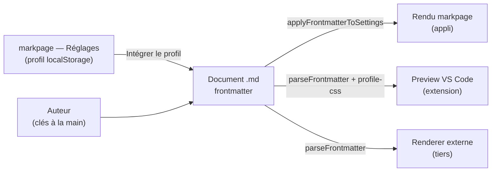

> **Statut :** **descriptif** (markpage 0.33.x). Ce document décrit le
> frontmatter **tel qu'il est implémenté**, pas un design en cours — contrairement
> à [VOLUMES-SPEC](VOLUMES-SPEC.md). Il fait foi pour les **trois consommateurs**
> du frontmatter : l'appli markpage, l'**extension VS Code** de preview, et tout
> **renderer externe**. Toute évolution du parser ou des clés s'amende **ici**.
> Implémentation : parser [`packages/markpage-render/src/frontmatter.ts`](../packages/markpage-render/src/frontmatter.ts)
> (`parseFrontmatter`, `embedProfileInFrontmatter`), application
> [`src/settings.ts`](../src/settings.ts) (`applyFrontmatterToSettings`,
> `serializeProfile`), consommation extension
> [`vscode/src/webview/profile-css.ts`](../vscode/src/webview/profile-css.ts) +
> [`preview.ts`](../vscode/src/webview/preview.ts).

**Objet :** le frontmatter est le bloc `---` optionnel en **tête** d'un document
Markdown. Il porte les **métadonnées** (titre, auteur, date…) et, depuis la
0.33, les **réglages de mise en page et de typographie** du document. Sa raison
d'être : faire du `.md` un document **auto-descriptif** — qui se rend de la même
façon dans l'appli et dans n'importe quel outil qui lit son frontmatter, **sans
dépendre d'un état applicatif** (le profil rangé dans le `localStorage` de
l'appli).

## 1. Le contrat

Le frontmatter est un **contrat** entre plusieurs producteurs / consommateurs :



Trois principes gouvernent ce contrat :

Source unique
:   Ce qui est **dans le document** est portable et fait autorité pour les
    consommateurs externes. Les réglages de **style/typographie** de l'appli
    (preset, polices, marges…) vivent par défaut dans le `localStorage` et ne
    sont **pas** visibles d'un tiers — sauf si l'auteur les **fige dans le
    frontmatter** (clés de mise en page, ou profil complet ; cf. §5).

Export unidirectionnel
:   markpage **écrit** le profil dans le frontmatter (commande « Intégrer le
    profil de style », §5) mais **ne le relit pas** : son propre rendu reste
    piloté par son profil `localStorage`. Le bloc `markpage-profile` est donc un
    **export** pour les renderers externes, pas une entrée que markpage
    reconsommerait — ce qui évite toute ambiguïté de précédence côté appli.

Tolérance ascendante
:   Une clé **inconnue** n'est jamais une erreur : elle est conservée dans
    `meta.extra` (cf. §2). Un document écrit par une version future s'ouvre sans
    casser.

## 2. Syntaxe acceptée

::: warning [Ce n'est pas du YAML complet]
Le parser est un **sous-ensemble** volontairement minuscule de YAML — juste ce
qu'il faut, sans dépendance externe. Écrire du YAML « riche » (objets imbriqués,
listes) **échoue silencieusement** : la clé part dans `extra` et n'est pas
appliquée. Connaître les limites ci-dessous évite ce piège.
:::

Le bloc s'ouvre par une ligne `---` **en toute première ligne** du document et se
ferme par une ligne `---`. Entre les deux, le parser accepte :

Paires `clé: valeur`
:   Une clé (`[A-Za-z_][\w-]*` — lettres, chiffres, `_`, `-`), un `:`, puis la
    valeur (tout le reste de la ligne). Exemple : `page-size: A4`.

Valeurs quotées
:   Les guillemets `"…"` ou `'…'` entourant **toute** la valeur sont retirés.
    `title: "Mon: titre"` → `Mon: titre`. Sinon la valeur brute est prise telle
    quelle (espaces de bord élagués).

Scalaires de bloc `|`
:   `clé: |` puis des lignes **indentées** : leur contenu (désindenté de
    l'indentation commune) devient la valeur multi-ligne. Sert à
    `mathjax-preamble` et à `markpage-profile`. `|-` est accepté comme `|` (pas
    de distinction de *chomping*).

Commentaires et lignes vides
:   Une ligne dont le premier caractère non blanc est `#`, ou une ligne vide, est
    ignorée.

Ce qui **n'est pas** supporté :

| Construct YAML | Supporté ? | Conséquence |
| :-- | :--: | :-- |
| `clé: valeur` scalaire | ✅ | appliqué |
| `clé: \|` bloc multi-ligne | ✅ | appliqué |
| `# commentaire`, ligne vide | ✅ | ignoré |
| **objet imbriqué** (`a:` puis `  b: c`) | ❌ | clé inconnue → `extra` |
| **liste** (`- item`) | ❌ | ignoré / `extra` |
| **ancres / alias** (`&a`, `*a`) | ❌ | littéral |

::: note
Un bloc `---` **non refermé** est traité comme du corps : l'auteur voit son texte
littéral plutôt que de perdre silencieusement du contenu. La ligne vide qui suit
le `---` de fermeture est absorbée pour que le corps démarre proprement.
:::

## 3. Catalogue des clés

### 3.1 Métadonnées

| Clé | Type | Effet |
| :-- | :-- | :-- |
| `title` | texte | Titre du document, rendu en `<h1 class="doc-title">` centré, au-dessus du bloc de métadonnées. Les `#` du corps restent des sections h1 normales. |
| `author` | texte | Ligne auteur du bloc de métadonnées (gras par défaut). |
| `organization` | texte | Ligne organisation (gras par défaut). |
| `date` | texte | Ligne date (texte libre : `2026-05-21` ou « 21 mai 2026 »). |
| `subtitle` | texte | Sous-titre (réservé ; conservé tel quel). |

Le bloc de métadonnées (auteur / organisation / date, centrés sous le titre)
suit l'ordre ci-dessus. Dans l'appli, leur affichage et leur graisse dépendent
du profil (`metadataLines`) ; dans l'extension, l'auteur et l'organisation sont
en gras, la date en normal.

### 3.2 Comportement

`slides`
:   Booléen. `true` force le format **diapositives 16:9** (`pageSize:
    SLIDES_16_9`) quel que soit le profil — chaque `## h2` démarre une diapo.
    Booléens acceptés : `true` / `yes` / `on` / `1` (insensibles à la casse) ;
    tout le reste est faux.

`mathjax-preamble`
:   Bloc `|`. Source TeX **préfixée à chaque invocation MathJax** du document :
    on y définit ses `\newcommand` une fois, réutilisables dans toutes les
    formules.

````markdown
mathjax-preamble: |
  \newcommand{\R}{\mathbb{R}}
  \newcommand{\sem}[1]{\llbracket #1 \rrbracket}
````

### 3.3 Style sémantique

Le panneau **Réglages** écrit en priorité une description courte des intentions
typographiques. Toutes ces clés sont facultatives ; une valeur égale au défaut
est omise.

La stratégie normative de synchronisation, de réinitialisation des recettes et
d'historique est définie dans [SETTINGS-SPEC](SETTINGS-SPEC.md).

| Clé | Valeurs | Défaut | Effet |
| :-- | :-- | :-- | :-- |
| `document-type` | `tech-note`, `report`, `paper`, `book`, `letter`, `slides` | `report` | Recette de format, mesure, marges, recto-verso, chapitres et placement initial des notes. |
| `appearance` | `classic`, `modern`, `academic`, `technical` | `modern` | Recette coordonnée pour les fontes du corps, des titres, du code et des mathématiques. |
| `density` | `compact`, `normal`, `airy` | `normal` | Interligne, espacements verticaux et padding des blocs. |
| `body-size` | nombre de points | `11` | Taille du corps et échelle dérivée des titres. |
| `paragraphs` | `spacing`, `indent` | `spacing` | Séparation par espace vertical ou retrait de première ligne. |
| `alignment` | `left`, `justify` | `left` | Alignement du corps. |
| `accent` | couleur CSS | `#09438b` | Couleur coordonnée des titres, liens et encadrés. |
| `pagination` | `none`, `center`, `outer` | `center` | Absence, centrage ou placement extérieur du folio. |
| `notes` | `foot`, `side`, `end` | `foot` | Placement des notes. |

Ces intentions sont **compilées avant le rendu** en réglages détaillés. Une clé
avancée explicite dans la même couche, par exemple
`styles.h2.color: "#7a1f5c"` ou `font-body: Lora`, est ensuite appliquée et
l'emporte. Les anciennes clés détaillées restent donc compatibles, mais le
prochain passage par Réglages retire celles que la recette explique déjà.

Exemple minimal :

````yaml
---
document-type: book
appearance: classic
paragraphs: indent
---
````

### 3.4 Mise en page

| Clé | Valeurs | Défaut | Effet |
| :-- | :-- | :-- | :-- |
| `page-size` | `A3` `A4` `A5` `B5` `LETTER` `LEGAL` (insensible à la casse) | `A4` | Format de page. `SLIDES_16_9` est **exclu** : passer par `slides: true`. Une valeur inconnue est ignorée (on garde le défaut). |
| `margins` | 1, 2, 3 ou 4 nombres (mm), à la **CSS** | `25 25 35 35` | Marges de page. Force le mode marges **manuel** côté appli. |
| `page-numbers` | booléen | `true` | Numéro de page en pied (centré). |

Les marges suivent le *box model* CSS — `marginBox()` les développe :

| Forme | Interprétation |
| :-- | :-- |
| `margins: 20` | les 4 côtés = 20 |
| `margins: 25 35` | haut/bas = 25, gauche/droite = 35 |
| `margins: 10 20 30` | haut = 10, gauche/droite = 20, bas = 30 |
| `margins: 10 20 30 40` | haut, droite, bas, gauche (ordre CSS) |

Côté appli ([`applyFrontmatterToSettings`](../src/settings.ts)) : `margins` impose
`marginMode: 'manual'` (sinon le mode *derived* recalcule et les ignorerait) ;
`page-numbers` (dé)pose le jeton `{page}` dans le pied (`footer`).

### 3.5 Typographie

| Clé | Type | Cible |
| :-- | :-- | :-- |
| `font-body` | nom de famille | corps de texte (`fonts.body`) |
| `font-heading` | nom de famille | titres (`fonts.headings`) |
| `font-mono` | nom de famille | code (`fonts.code`) |

Défauts (profil par défaut de markpage) : corps et titres `Roboto Condensed`,
code `Roboto Mono`. Pour la typographie **fine** (taille, couleur, graisse,
marges… par élément), voir le profil complet, §5.

### 3.6 Profil machine — `markpage-profile`

Bloc `|` contenant un **JSON** : le profil de style complet, écrit par markpage
pour les renderers externes (cf. §5). Réservé à l'export machine ; les clés
plates ci-dessus restent la voie **lisible** pour un humain.

## 4. Précédence

Quand plusieurs sources fixent le même réglage, l'ordre est :

```
clé plate du frontmatter  >  markpage-profile  >  défauts (profil appli / thème)
```

::: tip [Conséquence pratique]
On peut laisser markpage **figer le profil complet** (§5) puis **surcharger une
seule valeur à la main** avec une clé plate — `font-body: Lora` au-dessus d'un
`markpage-profile` l'emporte. Côté extension, la clé plate est posée en style
*inline* sur la page (gagne sur le `<style>` du profil), et la mise en page est
lue `clé plate ?? profil ?? défaut`.
:::

## 5. Le profil de style portable

### Ce que markpage écrit

La commande **Fichier → « Intégrer le profil de style »**
([`serializeProfile`](../src/settings.ts) + [`embedProfileInFrontmatter`](../packages/markpage-render/src/frontmatter.ts))
sérialise les réglages actifs en JSON et l'insère (ou le **remplace** s'il
existe déjà) dans le bloc `markpage-profile`. Forme du JSON :

````json
{
  "fonts":  { "headings": "...", "body": "...", "code": "..." },
  "styles": { "body": { ... }, "h1": { ... }, "quote": { ... }, ... },
  "pageSize": "A4",
  "margins": { "top": 25, "bottom": 25, "left": 35, "right": 35 },
  "pageNumbers": true
}
````

`styles` couvre **17 éléments** : `body`, `title`, `h1`–`h4`, `code-inline`,
`inline-link`, `metadata`, `code-block`, `quote`, `math-block`, `mermaid`,
`callout`, `table`, `caption`, `running-content`. Chaque entrée est un `Style`
dont les attributs sont :

| Attribut | Unité | Attribut | Unité |
| :-- | :-- | :-- | :-- |
| `family` | nom | `lineHeight` | multiplicateur |
| `fontSize` | pt | `padding` | em |
| `color` | `#rrggbb` | `background` | couleur |
| `weight` | 100–900 | `border{Top,Right,Bottom,Left}` | booléen |
| `italic` | booléen | `borderColor` | `#rrggbb` |
| `underline` | booléen | `borderWidth` | px |
| `align` | `left`/`center`/`right`/`justify` | `borderRadius` | px |
| `marginAbove` / `marginBelow` | em | | |

### Ce que l'extension lit

[`profile-css.ts`](../vscode/src/webview/profile-css.ts) traduit ce profil en CSS
scopé sous `#markpage-preview`, en mappant chaque clé d'élément vers un sélecteur
(p. ex. `callout` → `.admonition`, `code-block` → `pre`, `caption` →
`.caption`). `running-content` n'est **pas** mappé (sans objet dans la preview
continue). La mise en page (`pageSize` / `margins` / `pageNumbers`) est lue en
**repli** quand les clés plates correspondantes sont absentes.

::: important
Le profil est un **export à sens unique**. markpage l'**écrit** mais continue de
rendre depuis son profil `localStorage` ; il ne **relit** pas `markpage-profile`.
Le rôle du bloc est de rendre le document fidèle **ailleurs** (extension,
tiers).
:::

## 6. Inconnues et inspection

Toute clé non reconnue est rangée dans `meta.extra` (table `clé → texte`) par
`parseFrontmatter`, sans être câblée à un renderer. C'est le mécanisme de
**tolérance ascendante** : un document écrit par une version plus récente
s'ouvre sans erreur, et un outil tiers peut inspecter ses propres clés.

## 7. Non-buts et différés

::: caution
- **Numérotation des titres au rendu** — il n'existe **pas** de clé
  `number-headings`. Dans markpage, numéroter les titres est une **commande
  éditeur** (`renumberHeadings`, `Cmd/Ctrl + Shift + N`) qui réécrit le **texte
  source** (`## 1.2 Titre`) ; ce n'est pas un réglage de rendu, donc pas
  « portable » par le frontmatter. L'ajouter supposerait une nouvelle capacité de
  rendu (compteurs CSS) côté appli **et** extension — décision séparée.
- **YAML imbriqué** — objets et listes ne sont pas parsés (§2). Toute structure
  riche passe par le bloc `markpage-profile` (JSON dans un scalaire `|`).
- **Raw HTML** — hors sujet ici (et échappé partout, cf.
  [AI-AUTHORING](../AI-AUTHORING.md) « What is NOT supported »).
:::

## 8. Implémentation

| Rôle | Fichier |
| :-- | :-- |
| Parser + type `Frontmatter` + `embedProfileInFrontmatter` | [`packages/markpage-render/src/frontmatter.ts`](../packages/markpage-render/src/frontmatter.ts) |
| Application sur les réglages + `serializeProfile` | [`src/settings.ts`](../src/settings.ts) |
| Rendu du bloc titre/métadonnées (appli) | [`src/preview.ts`](../src/preview.ts) |
| Commande « Intégrer le profil de style » | [`src/ui/file-menu.ts`](../src/ui/file-menu.ts) + [`src/main.ts`](../src/main.ts) |
| Consommation par la preview VS Code | [`vscode/src/webview/profile-css.ts`](../vscode/src/webview/profile-css.ts), [`preview.ts`](../vscode/src/webview/preview.ts) |
| Tests | [`tests/settings-layout.test.ts`](../tests/settings-layout.test.ts) |

## 9. Exemple complet

````markdown
---
title: Rapport trimestriel
author: Sakina Bakha
organization: ASSA AZEKKA
date: 2026-06-26
page-size: A4
margins: 25 35
page-numbers: true
font-body: Lora            # surcharge lisible, l'emporte sur le profil
mathjax-preamble: |
  \newcommand{\R}{\mathbb{R}}
markpage-profile: |
  {"fonts":{"headings":"Inter","body":"Lora","code":"Fira Code"},"styles":{"body":{"fontSize":11,"lineHeight":1.3,"align":"justify"},"h1":{"fontSize":22,"color":"#14223a"},"quote":{"borderLeft":true,"borderColor":"#888","borderWidth":3,"padding":1}},"pageSize":"A4","margins":{"top":25,"bottom":25,"left":35,"right":35},"pageNumbers":true}
---

# Rapport trimestriel

Le corps du document commence ici…
````

Dans cet exemple : `font-body: Lora` (clé plate) l'emporte sur `fonts.body` du
profil ; tout le reste de la typographie vient du `markpage-profile` ; l'appli
markpage applique titre/marges/page-size/page-numbers via
`applyFrontmatterToSettings` et rend avec **son** profil ; l'extension VS Code
reproduit la typographie complète depuis le bloc.
