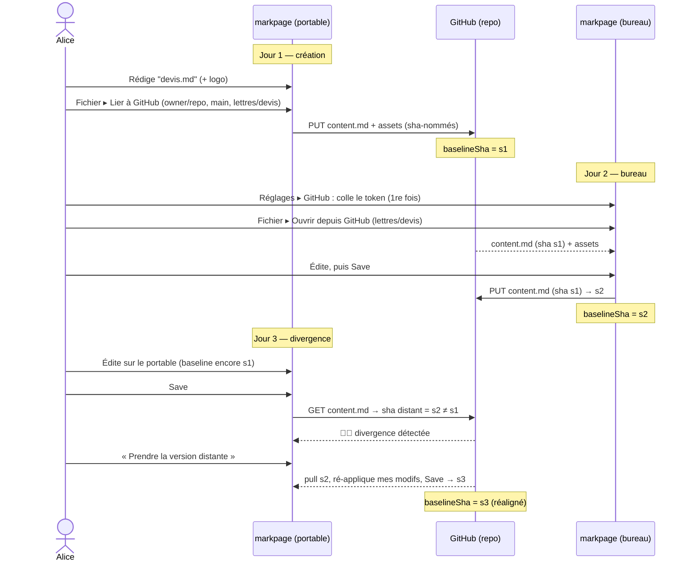

> **Statut :** design — non encore implémenté. Document de conception ; le plan
> d'implémentation en fin de fichier est prévisionnel.

**Objet :** permettre d'éditer **un même document markpage depuis plusieurs
plateformes** (portable, bureau, autre navigateur) en s'appuyant sur un **dépôt
GitHub** comme stockage partagé et versionné — **sans serveur**, fidèle à l'ADN
de markpage (appli statique, données chez l'utilisateur).

## 1. Contexte et limites actuelles

markpage stocke les documents **localement** (bundles OPFS, repli localStorage).
Les mécanismes de partage existants ne couvrent pas le travail multi-plateforme
sur **le même** document :

| Mécanisme | Ce qu'il fait | Limite pour le partage |
| :-- | :-- | :-- |
| Lien-disque (`disk-link.ts`) | miroir local fichier/dossier, sync bidirectionnelle | **même machine** uniquement (File System Access) |
| OneDrive (`onedrive.ts`) | upload du `.md` + lien de partage | **sens unique** (push), pas de retour |
| Lien de partage (`share-url.ts`) | doc encodé dans une URL `?import=` | **one-shot**, plafonné ~8 Ko, copie figée |
| Export `.md` / `.pdf` / `.tex` | fichiers autonomes | pas de va-et-vient |

Un dépôt GitHub comble le manque : un **backend versionné**, accessible de
partout, partageable en partageant le dépôt, avec l'**historique git gratuit**.

## 2. Périmètre

::: note [Modèle « façon git », pas temps réel]
La synchronisation est **asynchrone** : on *pull* → on édite → on *push*, comme
avec git. Le **collaboratif temps réel** (type Google Docs) est **hors
périmètre** : il exige un serveur / CRDT, incompatible avec une appli statique.
:::

**Dans le périmètre (v1) :**

- Lier un document à un emplacement GitHub (`owner/repo`, branche, chemin).
- **Save → commit & push** ; **Recharger → pull**.
- Détection de **divergence** distante et résolution (réutilise l'existant
  Phase 4 : badge ⛓️‍💥, *garder ma version* / *prendre la version distante*).
- Images du bundle versionnées dans le dépôt.

**Hors périmètre (v1) :** fusion 3-voies automatique ; édition concurrente
temps réel ; pull requests / revue ; gestion fine des branches (création,
merge) ; dépôts privés d'organisation avec SSO imposé (selon les contraintes
du token).

## 3. Authentification — jeton personnel (PAT), sans serveur

markpage fait déjà de l'OAuth client-side pour OneDrive (MSAL + PKCE), mais ce
n'est **pas transposable à GitHub** : le endpoint d'échange de token de GitHub
n'envoie pas d'en-têtes CORS, donc un vrai « Se connecter avec GitHub »
nécessiterait un **proxy serveur**. On choisit donc le **jeton personnel
fine-grained (PAT)** :

- l'**API REST** `api.github.com` **est** CORS-friendly → lire/écrire un fichier
  marche **directement depuis le navigateur** avec le token, **zéro serveur** ;
- l'utilisateur **colle son token une seule fois par appareil** ; il est stocké
  en local et réutilisé pour **tous** ses documents liés.

::: tip [Réglage quasi-indolore]
Dans **Réglages → GitHub**, un bouton **« Créer un token → »** ouvre la page
GitHub de création **pré-remplie** (permission *Contents: read and write*,
expiration au choix) avec un mode d'emploi en trois lignes. Coller le token,
c'est tout.
:::

Token
:   *Fine-grained personal access token* GitHub, scopé à un ou plusieurs dépôts,
    permission **Contents: read/write** (lecture/écriture de fichiers).

Stockage
:   Le token vit en local (IndexedDB du domaine), jamais transmis ailleurs qu'à
    `api.github.com`. Aucune autre donnée ne quitte la machine.

::: warning [Sécurité du token]
Un PAT accorde l'écriture sur les dépôts ciblés. On limite la portée : scope
**mono-dépôt** conseillé, **expiration** réglable, révocable à tout moment côté
GitHub. markpage échappe déjà tout HTML (pas de surface XSS), mais le token
reste un secret local — à ne pas exposer sur une machine partagée.
:::

## 4. Modèle de données

Le lien GitHub se calque sur le **lien-disque** (`disk-link.ts`) : un document
peut être lié à une **cible distante**, persistée dans son `DocEntry`.

Champs du `GithubLink` (stocké dans `index.json`, à côté du `DocEntry`) :

| Champ | Rôle |
| :-- | :-- |
| `owner` | propriétaire du dépôt (utilisateur ou organisation) |
| `repo` | nom du dépôt |
| `branch` | branche cible, ex. `main` |
| `path` | dossier-bundle dans le dépôt, ex. `lettres/2026/devis` |
| `baselineSha` | sha git du `content.md` au dernier sync — sert à détecter la divergence |

**Mapping bundle → dépôt** (réutilise le schéma sha-nommé existant) :

```tree "Disposition d'un bundle dans le dépôt"
lettres/devis/
  content.md
  assets/
    a1b2c3….png
    d4e5f6….jpg
```

Le `baselineSha` est le **point de référence** : si le `sha` distant du
`content.md` diffère du `baselineSha` au moment d'un Save, c'est qu'un autre
appareil a poussé entre-temps → **divergence**.

## 5. Opérations et API GitHub

Toutes via l'API REST *contents* (CORS-OK), `Authorization: Bearer <token>` :

| Opération markpage | Appel GitHub |
| :-- | :-- |
| Lister / lire un fichier | `GET /repos/{owner}/{repo}/contents/{path}?ref={branch}` |
| Créer / mettre à jour | `PUT /repos/{owner}/{repo}/contents/{path}` (`message`, `content` base64, `sha?`, `branch`) |
| Vérifier la divergence | `GET …/contents/{path}` → comparer `sha` distant au `baselineSha` |

- **Lier à GitHub** — l'utilisateur saisit `owner/repo`, branche, chemin. Si le
  chemin contient déjà un `content.md`, **confirmer l'écrasement** (ou proposer
  *prendre la version distante*) ; sinon écrire le bundle et mémoriser le
  `baselineSha`.
- **Save (commit & push)** — après le commit local, **un commit par Save** :
  `PUT contents` du `content.md` et de chaque `assets/<sha>.<ext>` avec le `sha`
  connu, message **fixe** `markpage: <nom du document>`. Les `assets/` orphelins
  côté dépôt sont **laissés en place** (pas de nettoyage). Met à jour
  `baselineSha`.
- **Recharger (pull)** — `GET contents` du `content.md` + des assets manquants,
  remplace le contenu local (commit propre, comme le *pull* du lien-disque),
  met à jour `baselineSha`.
- **Divergence** — détectée au Save (le `sha` distant ≠ `baselineSha`) ou à la
  vérification périodique : badge **⛓️‍💥**, menu **garder ma version**
  (force-push avec le `sha` distant) / **prendre la version distante** (pull).
- **Délier** — efface le `GithubLink` ; le dépôt est laissé intact.

## 6. Scénario détaillé

Alice rédige un devis sur son **portable**, le pousse sur GitHub, puis le
reprend le lendemain sur son **bureau**. Le surlendemain, une édition croisée
crée une divergence, qu'elle résout.



Pas à pas :

1. **Jour 1 (portable).** Alice écrit `devis.md` avec un logo. *Fichier ▸ Lier à
   GitHub* → `owner/repo`, branche `main`, chemin `lettres/devis`. markpage
   pousse `content.md` + `assets/<sha>.png` ; `baselineSha = s1`. Badge 🔗.
2. **Jour 2 (bureau).** Premier usage : *Réglages ▸ GitHub*, bouton *Créer un
   token →*, colle le token. *Fichier ▸ Ouvrir depuis GitHub* → `lettres/devis`.
   markpage pull (`s1`), affiche le document lié.
3. Alice édite, **Save** → push `content.md` (avec `sha s1`) → nouveau `s2` ;
   `baselineSha = s2` sur le bureau.
4. **Jour 3 (portable).** La baseline du portable est restée `s1`. Alice édite,
   **Save** → markpage voit que le `sha` distant est `s2 ≠ s1` → **divergence**,
   badge ⛓️‍💥, le Save est suspendu.
5. Alice choisit **« Prendre la version distante »** → pull `s2`, markpage
   ré-applique son édition locale par-dessus, Save → `s3` ; `baselineSha = s3`.
   (Variante : **« Garder ma version »** → push forcé sur `s2`.)

::: note
Si rien n'a divergé (cas nominal), l'étape 4 se résume à un push direct : le
`sha` distant égale la baseline, aucun conflit.
:::

## 7. Interface utilisateur

- **Réglages → GitHub** : champ token (masqué) + bouton *Créer un token →* +
  état (« connecté en tant que @alice », via `GET /user`).
- **Menu Fichier** (gated : token présent) :
  - *Ouvrir depuis GitHub…* — saisie `owner/repo` puis **navigateur de
    dossiers** du dépôt (parcours des chemins).
  - *Lier à GitHub…* — lie le document courant.
  - *Recharger depuis GitHub* / *Délier* (si lié).
- **Badge** sur le titre : 🔗 lié & à jour, ⛓️‍💥 divergence (clic → résolution),
  réutilisant exactement l'affordance du lien-disque (`toolbar.ts`).

## 8. Gestion des erreurs

| Cas | Réaction |
| :-- | :-- |
| Token absent / invalide / expiré | message clair + bouton *Créer un token* ; le doc reste local |
| `404` (repo/chemin introuvable) | proposer de créer le chemin, ou corriger la cible |
| Divergence (`sha` distant ≠ baseline) | badge ⛓️‍💥 + résolution (cf. §6) |
| `403` rate limit | indiquer l'attente (quota REST authentifié : 5000 req/h) |
| Hors-ligne | Save/Recharger échouent proprement ; le doc reste éditable en local |

## 9. Décisions actées

- **Granularité des commits** : **un commit par Save** (simple ; pas de
  regroupement *git-trees* en v1).
- **Message de commit** : **fixe**, `markpage: <nom du document>` (non éditable
  en v1).
- **Ouvrir depuis GitHub** : **vrai navigateur** de dépôt → dossiers (parcours
  des chemins via l'API contents), pas seulement une saisie de chemin.
- **Assets orphelins** : **laissés en place** côté dépôt — pas de nettoyage
  automatique du dossier `assets/` lors d'un Save.

## 10. Plan d'implémentation

Par phases incrémentales, chacune livrable seule :

1. **`github.ts`** — client REST minimal (token en IndexedDB, `getFile`,
   `putFile`, `getUser`, encodage base64 ↔ contenu), + feature-gating.
2. **Auth & Réglages** — panneau GitHub (token, bouton *Créer un token →*,
   état connecté).
3. **Lier / Save / Recharger** — bundle ↔ dépôt, `baselineSha`, calqué sur
   `disk-link.ts` ; câblage menu Fichier + badge.
4. **Divergence & résolution** — détection au Save + réutilisation du flux
   conflit Phase 4 (⛓️‍💥, garder/prendre).
5. **Ouvrir depuis GitHub** — saisie du dépôt + **navigateur de dossiers** du
   dépôt (parcours des chemins via l'API contents).

::: note [Tests]
Le client REST pur (`github.ts`) est unit-testable en mockant `fetch`. Les flux
UI (lier/push/pull/conflit) se testent surtout manuellement contre un dépôt de
test ; un éventuel e2e mockerait `api.github.com`.
:::
