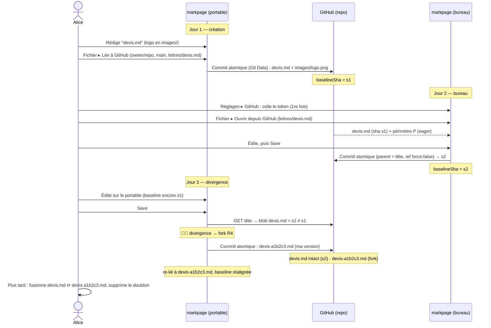

> **Statut :** livré (markpage 0.32.0). Spec **pilotée par invariants**
> (voir « Invariants » ci-dessous). La **v0.7** ajoute la **machine à états du
> Save** (§5) : un 2×2 `(édité localement ?) × (dépôt avancé ?)` → quatre
> transitions (No-op / Recharger / Avance rapide / Fork), avec la **preuve
> qu'aucune ne perd d'information**. La v0.6 avait fermé les coins issus des
> revues croisées (Codex + Claude Desktop) : re-test R4, `gitBlobSha` sur octets
> bruts, déterminisme du nommage, chemins P octet-exacts, SHA-1 v1, coût `1+N`.
> Le modèle reste celui des **fichiers `.md` naturels** (R1–R4). Le plan en fin
> de fichier est prévisionnel.

**Objet :** permettre d'éditer **un même document markpage depuis plusieurs
plateformes** (portable, bureau, autre navigateur) en s'appuyant sur un **dépôt
GitHub** comme stockage partagé et versionné — **sans serveur**, fidèle à l'ADN
de markpage (appli statique, données chez l'utilisateur).

## Invariants

Cette spec évolue **par invariants**, posés et validés un par un (méthodologie
[FORMAL-METHOD-SPEC](FORMAL-METHOD-SPEC.md)). Les invariants ci-dessous (R1–R4 +
périmètre P) sont la **source de vérité** ; les sections modèle / opérations /
scénario (§4–§6) en sont la **déclinaison opérationnelle**.

### R1 — le markdown externe est *verbatim*

Le contenu d'un `foo.md` lié à GitHub est **identique** dans markpage et dans le
dépôt — **octet pour octet**. En particulier, les **références d'images**
(``, ``, …) sont **conservées telles quelles** :
markpage **ne réécrit jamais** le markdown (pas de `img://<sha>` dans le contenu
stocké) et **n'applique aucune normalisation** (ni reformatage, ni *munging* du
frontmatter). Le mapping éventuel entre nom externe d'image et stockage interne
se fait **en dehors** du markdown — une table « chemin relatif → contenu », tenue
à côté, remplie au pull et consultée au rendu.

**Conséquences :**

- Tant qu'on **n'ajoute pas d'image depuis markpage**, toute édition — y compris
  **supprimer une référence d'image** — est un **simple commit de `foo.md`**, au
  diff identique à celui qu'un humain ferait à la main.
- Le **rendu / aperçu** résout les chemins relatifs via la table, **sans toucher**
  au markdown.
- Supprimer une référence d'image **ne supprime pas** le fichier image (orphelin
  laissé) — cohérent avec §9.

::: note
R1 implique que markpage **désactive ses réécritures internes** (`refifyImageUrls`
/ `img://`) pour un document lié à GitHub : le contenu stocké est le markdown
**naturel** du dépôt.
:::

### Périmètre P — les images servies localement

**Périmètre P** = l'ensemble des images que markpage **récupère et sert
localement** pour un `foo.md` lié. Une référence appartient à P **si et seulement
si** c'est un **chemin relatif résolvant vers un fichier du même dépôt** (sur la
branche liée), résolu **relativement au dossier de `foo.md`** ; les `../` sont
**admis tant qu'on reste dans la racine du dépôt** (un ``
écrit naturellement est donc dans P).

**Hors de P** — markpage ne les met pas dans la table. Deux cas, au comportement
**différent** :

- **`data:` (base64 inline)** — **auto-contenu** : s'affiche **partout** (aperçu,
  présentation, **export PDF**, hors-ligne). Rien à récupérer.
- **URL absolues `http(s)://` / protocole-relatif `//…`** — ressources **web
  externes** : s'affichent à l'**écran (aperçu/présentation) quand on est en
  ligne** (le navigateur les charge), mais **ne sont PAS embarquées dans l'export
  PDF** (markpage n'inline que `data:`, `img://` et les chemins relatifs mappés)
  → **cassées dans le PDF** et absentes hors-ligne. (Les inliner automatiquement
  se heurterait au **CORS** — d'où le choix de ne pas le faire.)

Une référence relative qui **ne résout pas** (fichier absent, ou qui sortirait
de la racine du dépôt) est **hors P** : elle n'échoue pas l'import et manque
simplement au rendu.

::: warning [Résolution des chemins — octet-exacte (git), pas FS-locale]
La correspondance chemin ↔ fichier se fait sur les **chemins git tels quels**
(octet-exacts, **sensibles à la casse**), **jamais** via le système de fichiers
local. `images/Logo.png` et `images/logo.png` sont **deux chemins distincts**,
même si macOS/Windows les confondraient. Aucune normalisation Unicode ni
repli de casse — c'est le corollaire de R1 côté chemins.
:::

### R2 — pull / import

Au **pull / import** — épinglé au **commit courant** de la branche, pour que
`foo.md` et ses images forment un instantané cohérent — markpage :

1. stocke `foo.md` **verbatim** (R1) ;
2. **récupère immédiatement tout le périmètre P** dans la table « chemin relatif
   → contenu » du document ; le doc se rend ensuite **hors-ligne** ;
3. laisse les références hors P telles quelles (les absolues se rendent via le
   navigateur).

Un **pull ultérieur reconstruit** la table : il rafraîchit `foo.md` et tout son
périmètre à l'état du nouveau commit. Entre deux pulls, markpage sert sa copie ;
markpage **ne surveille pas** le dépôt (la détection fine « telle image a changé »
relèvera d'un invariant ultérieur sur la divergence).

::: note [Implémentation — la table existe déjà]
La « table chemin relatif → contenu » **est** le **mapping de ressources**
existant de markpage : `mapping[chemin] = { sha }`. L'aperçu le résout déjà en
`blob:` (`expandRefsToBlobUrls`) et l'export PDF en `data:` (`inlineExternalRefs`),
**sans réécrire** le markdown. Le pull (R2) revient donc à **peupler ce mapping**
et à ranger les blobs (`putBlobBySha`). R1 (refs verbatim) correspond au
comportement déjà en place pour ces « refs externes ».
:::

### R3 — ajouter une image depuis markpage

Ajouter une image (drop / coller / insertion) dans un `foo.md` lié est la
**seule** opération qui *modifie* le markdown au-delà des éditions de texte.

**Dossier — en une phrase :** la nouvelle image va **à côté de sa voisine la plus
proche** ; à défaut de voisine (le doc ne référence aucune image), dans le
**`images/` le plus proche** en remontant du dossier du doc jusqu'à la racine du
dépôt, sinon on **crée `images/`** dans le dossier du doc.

- *Voisine la plus proche* = la référence d'image dont la **position dans le
  texte** est la plus proche du point d'insertion (avant ou après ; égalité →
  celle d'avant). Conséquence agréable : les images d'un doc **se regroupent**
  naturellement, sans rien imposer.

**Nom — en une phrase :** le **nom d'origine** du fichier ; **si ce nom est déjà
pris par un contenu différent**, on suffixe par le **hash court du contenu**
(`titi-a1b2c3d4.png`).

- Repli sans nom (coller du presse-papier) : `image-N.<ext>`.
- **Déduplication** : avant de nommer, si ce **contenu** est déjà mappé à un
  chemin (même `sha`), on **réutilise** ce chemin — le suffixe ne sert que quand
  le *nom* est pris par un *autre* contenu. Le hash court est **déterministe** →
  même image, même nom sur **tous les appareils** (pas de divergence de nommage).
- **Collision du suffixe lui-même** (rarissime) : on **rallonge le hash** de
  contenu (8 → 12 → … hex), **jamais** un compteur ordinal (`-2`, `-3`). Un
  ordinal dépendrait de l'ordre local et **casserait le déterminisme
  inter-appareils** ; un hash plus long, lui, reste une **fonction du contenu**.

markpage **insère `` verbatim** dans `foo.md` et inscrit
`mapping[chemin] = { sha }`. Le chemin est **dans P par construction** (jamais
d'`../` hors dépôt ni d'absolu pour les ajouts de markpage). Le **fichier image
et le `foo.md` modifié** sont committés **ensemble au prochain Save** ; ensuite,
c'est une image **normale du périmètre** (R1/R2/P).

**Anti-écrasement au commit** — le choix du nom (ci-dessus) se fait à
l'insertion, contre l'état **local** ; mais un autre appareil a pu, entre-temps,
créer un fichier au **même chemin** dans le dépôt. Donc **au Save**, juste avant
de construire le commit, on **re-vérifie chaque image neuve contre l'arbre
distant** : chemin absent → on écrit ; même contenu (même blob) → on **réutilise**
sans rien réécrire ; **contenu différent** → on **renomme** (suffixe hash, R3) et
on **corrige la référence** dans `foo.md` avant de committer. Conséquence : « **jamais
d'écrasement** » (R4) vaut **aussi pour les images**, pas seulement pour `foo.md`.

::: warning [`gitBlobSha` opère sur des octets bruts]
La comparaison « même blob » recalcule le `sha` git **en local** :
`sha1("blob " + len + "\0" + contenu)`. **`len` = longueur en octets** et
`contenu` = **`Uint8Array` brut** — jamais une `string`, jamais de conversion
d'encodage ni de normalisation de fins de ligne. En JS, `"é".length === 1` mais
**2 octets** en UTF-8 : calculer sur une `string` produirait un faux `sha`, donc
de faux « blobs différents » → renommages parasites, **et violerait R1** (verbatim)
sur tout contenu non-ASCII. Tout le pipeline d'écriture manipule des octets.
:::

### R4 — divergence : jamais d'écrasement

Quand le dépôt **et** markpage ont changé depuis le dernier sync, on ne tranche
**pas** à la machine et on ne perd **aucune** information : on **matérialise les
deux versions** comme des fichiers, et l'humain réconcilie quand il veut (modèle
« git »).

**En une phrase :** au Save, si le `sha` distant de `foo.md` diffère de la
baseline, markpage commit **ta** version dans un fichier frère `foo-<sha>.md`,
laisse `foo.md` porter la version du dépôt, et **se re-lie au frère** (variante A).

- **Baseline** = le `sha` du blob `foo.md` au **dernier sync réussi** (lien,
  pull, ou push). markpage le mémorise par document (`baselineSha`).
- **Détection** — au **Save uniquement** (pas de surveillance continue). On lit le
  `sha` distant de `foo.md` :
  - `distant == baseline` → **avance rapide** : on pousse (`foo.md` + images
    neuves de R3), nouvelle baseline = `sha` résultant.
  - `distant != baseline` → **divergence** → on ne touche **pas** à `foo.md` ; on
    bascule en mode fork (ci-dessous).
- **Fork (variante A retenue)** :
  1. la version locale est committée dans un **frère** `foo-<sha>.md`, où `<sha>`
     est le **hash court du contenu local** au moment du fork — déterministe, donc
     re-sauver la même version ne crée pas dix fichiers (même convention `-sha`
     que R3). Si ce chemin **existe déjà** dans l'arbre distant : **même blob** →
     re-lien **idempotent, sans nouveau commit** ; **blob différent** → on
     **rallonge le hash** (jamais d'ordinal, cf. R3) ;
  2. `foo.md` **reste la version du dépôt**, intacte (les autres appareils ne sont
     pas perturbés) ;
  3. markpage **se re-lie** à `foo-<sha>.md` (devenu son miroir fidèle, R1),
     baseline = `sha` du frère → plus de divergence, l'édition continue **sans
     interruption**.
- **Résolution** = un acte **humain, différé** : ouvrir `foo.md` et `foo-<sha>.md`,
  fusionner à la main, puis **supprimer le doublon**. markpage n'impose aucune
  fusion 3-voies.
- **Contrepartie assumée** : tant que la fusion n'est pas faite, on a **forké** —
  on ne contribue plus à `foo.md`. C'est visible (badge ⛓️‍💥 + le frère dans le
  dépôt) et c'est le prix de « zéro perte ».

> **Les images ne font pas partie de la baseline** : la divergence se mesure sur
> **`foo.md` seul**. Une image changée seule côté dépôt (sans toucher `foo.md`)
> n'est **pas** un conflit ; « Recharger » rafraîchit les images (R2). Les images
> neuves de la version forkée (R3) sont committées avec `foo-<sha>.md`.

::: note [Deux conséquences à expliciter]

- **Idempotence du commit (re-test R4 obligatoire)** : `force: false` peut
  échouer (422) si la branche avance pendant qu'on construit le commit. La
  re-tentative **reprend à l'étape 1** et **re-évalue R4** (re-lecture de l'arbre,
  re-test sur le blob `foo.md`) — **jamais** une simple ré-émission du même
  commit. *Invariant : toute (re)construction de commit re-évalue R4.*
- **Fork dans l'arbre de l'autre branche** : le frère est committé sur
  `base_tree = T`, qui peut déjà contenir des **images ajoutées par l'autre
  appareil**. Si le `foo.md` forké ne les référence pas, ce sont de simples
  **orphelins** (laissés en place, cohérent §9) — pas une corruption.

:::

## 1. Contexte et limites actuelles

markpage stocke les documents **localement** (bundles OPFS, repli localStorage).
Les mécanismes de partage existants ne couvrent pas le travail multi-plateforme
sur **le même** document :

| Mécanisme | Ce qu'il fait | Limite pour le partage |
| :-- | :-- | :-- |
| Lien-disque (`disk-link.ts`) | miroir local fichier/dossier, sync bidirectionnelle | **même machine** uniquement (File System Access) |
| OneDrive (`onedrive.ts`) | upload du `.md` + lien de partage | **sens unique** (push), pas de retour |
| Lien de partage (`share-url.ts`) | doc encodé dans une URL `?import=` | **one-shot**, plafonné ~8 Ko, copie figée |
| Export `.md` / `.pdf` / `.tex` | fichiers autonomes | pas de va-et-vient |

Un dépôt GitHub comble le manque : un **backend versionné**, accessible de
partout, partageable en partageant le dépôt, avec l'**historique git gratuit**.

## 2. Périmètre

::: note [Modèle « façon git », pas temps réel]
La synchronisation est **asynchrone** : on *pull* → on édite → on *push*, comme
avec git. Le **collaboratif temps réel** (type Google Docs) est **hors
périmètre** : il exige un serveur / CRDT, incompatible avec une appli statique.
:::

**Dans le périmètre (v1) :**

- Lier un document à un **fichier `foo.md`** d'un dépôt (`owner/repo`, branche,
  chemin), markdown **verbatim** (R1).
- **Save → commit & push** (R3/R4) ; **Recharger → pull** (R2).
- **Divergence** détectée au Save, résolue **sans perte** par un fork
  `foo-<sha>.md` (R4) — réconciliation humaine, jamais d'écrasement.
- Images aux **chemins relatifs** du dépôt (**périmètre P**), récupérées d'emblée
  pour le rendu/PDF/hors-ligne.

**Hors périmètre (v1) :** fusion 3-voies automatique ; édition concurrente
temps réel ; pull requests / revue ; gestion fine des branches (création,
merge) ; dépôts privés d'organisation avec SSO imposé (selon les contraintes
du token).

## 3. Authentification — jeton personnel (PAT), sans serveur

markpage fait déjà de l'OAuth client-side pour OneDrive (MSAL + PKCE), mais ce
n'est **pas transposable à GitHub** : le endpoint d'échange de token de GitHub
n'envoie pas d'en-têtes CORS, donc un vrai « Se connecter avec GitHub »
nécessiterait un **proxy serveur**. On choisit donc le **jeton personnel
fine-grained (PAT)** :

- l'**API REST** `api.github.com` **est** CORS-friendly → lire/écrire un fichier
  marche **directement depuis le navigateur** avec le token, **zéro serveur** ;
- l'utilisateur **colle son token une seule fois par appareil** ; il est stocké
  en local et réutilisé pour **tous** ses documents liés.

::: tip [Réglage quasi-indolore]
Dans **Réglages → GitHub**, un bouton **« Créer un token → »** ouvre la page
GitHub de création **pré-remplie** (permission *Contents: read and write*,
expiration au choix) avec un mode d'emploi en trois lignes. Coller le token,
c'est tout.
:::

Token
:   *Fine-grained personal access token* GitHub, scopé à un ou plusieurs dépôts,
    permission **Contents: read/write** (lecture/écriture de fichiers).

Stockage
:   Le token vit en local (IndexedDB du domaine), jamais transmis ailleurs qu'à
    `api.github.com`. Aucune autre donnée ne quitte la machine.

::: warning [Sécurité du token — ce n'est pas un coffre-fort]
IndexedDB stocke le PAT **en clair** dans le profil du navigateur : ce n'est
**pas** un stockage chiffré. On assume ce compromis pour une v1 sans serveur, et
on l'**encadre** :

- **portée minimale** : scope **mono-dépôt** conseillé, permission **Contents:
  read/write** seule, **expiration** réglable, révocable côté GitHub à tout
  moment ;
- **bouton « Oublier le token »** dans Réglages (efface IndexedDB — déjà
  `clearToken`) ; à utiliser sur une machine partagée ;
- défense en profondeur déjà en place : **CSP stricte**, **zéro HTML actif**
  (tout est échappé) → pas de surface XSS pour exfiltrer le token ;
- le token n'est transmis qu'à `api.github.com`, jamais ailleurs.
:::

::: note [État de l'art — pourquoi le PAT, pas l'OAuth]
Les CMS *git-backed* qui visent le navigateur seul butent sur le même mur :
**Decap CMS** (ex-Netlify CMS) impose un **serveur OAuth** pour « Se connecter
avec GitHub ». **Pages CMS** et **TinaCMS** éditent eux aussi les fichiers du
dépôt directement (contenu en Markdown dans Git, pas de base séparée) — la même
philosophie que markpage. Côté écriture, **GitJournal** / **Obsidian Git**
montrent la voie « Markdown + Git = portabilité multi-appareils ». Le PAT est le
**seul** chemin qui préserve « markpage = appli statique, sans serveur ».
:::

## 4. Modèle de données

Le lien GitHub se calque sur le **lien-disque** (`disk-link.ts`) : un document
peut être lié à une **cible distante**, persistée dans son `DocEntry`. Mais
conformément à **R1**, la cible est un **fichier `foo.md` naturel** (pas un
dossier-bundle), et les images sont des **fichiers ordinaires** aux chemins
relatifs du dépôt (**périmètre P**).

Champs du `GithubLink` (stocké dans `index.json`, à côté du `DocEntry`) :

| Champ | Rôle |
| :-- | :-- |
| `owner` | propriétaire du dépôt (utilisateur ou organisation) |
| `repo` | nom du dépôt |
| `branch` | branche cible, ex. `main` |
| `path` | chemin du **fichier** dans le dépôt, ex. `lettres/2026/devis.md` |
| `baselineSha` | sha git du blob `foo.md` au dernier sync — point de référence de **R4** |

**Disposition dans le dépôt** — aucune (R1) : `foo.md` et ses images vivent là où
l'utilisateur les met, comme dans n'importe quel dépôt.

```tree "Un dépôt parfaitement ordinaire — markpage n'impose rien"
lettres/
  devis.md          ← le foo.md lié (markdown verbatim)
  images/
    logo.png        ← 
shared/
  charte.png        ←  depuis devis.md (../ dans P)
```

**Table chemin → contenu** — markpage ne range **rien de spécial** dans le dépôt :
le « mapping » qui résout les images (`mapping[chemin] = { sha }`) est la **table
de ressources interne déjà existante** ([image.ts](src/image.ts), `loadMapping`),
peuplée au pull (R2) et à l'ajout d'image (R3). Elle vit **hors** du markdown et
**hors** du dépôt — le `.md` distant n'en porte aucune trace.

Le `baselineSha` est le **point de référence** : si le `sha` distant de `foo.md`
diffère du `baselineSha` au moment d'un Save, un autre appareil a poussé
entre-temps → **divergence** (R4).

## 5. Opérations et API GitHub

Toutes via l'API REST (CORS-OK), `Authorization: Bearer <token>`. La **lecture**
utilise l'API *contents* / *git blobs* ; l'**écriture** utilise la **Git Database
API** pour garantir **un seul commit atomique par Save** (R3/R4) — l'API
*contents* committerait un fichier à la fois (N images ⇒ N+1 commits).

### Lecture

| Opération | Appel GitHub |
| :-- | :-- |
| Lire `foo.md` | inline si **≤ 1 Mo** ; sinon **fallback** `GET …/git/blobs/{sha}` (base64, **≤ 100 Mo**) |
| Énumérer le périmètre P | `GET /repos/{o}/{r}/git/trees/{treeSha}?recursive=1` (un seul appel) |
| Lire une image | inline si **≤ 1 Mo** ; sinon `GET …/git/blobs/{sha}` (base64, **≤ 100 Mo**) |

::: note [Limites de l'eager fetch (R2)]
Récupérer tout le périmètre P d'emblée doit être **borné** : on fixe une **taille
max par image** (au-delà, image **ignorée** avec avertissement — elle reste
référencée, juste non rendue hors-ligne, cf. *hors P*) et un **garde-fou sur le
total** (taille/nombre cumulés → avertissement avant de tout télécharger). Au-delà
de **100 Mo**, l'API ne sert plus le blob : l'image est traitée comme hors P.
:::

### Écriture atomique (Save)

Git Database API, dans l'ordre :

1. `GET …/git/ref/heads/{branch}` → commit de tête `C` ; puis
   `GET …/git/commits/{C}` → `tree.sha` = arbre `T` (la ref ne donne **pas**
   directement l'arbre).
2. **Test de divergence (R4)** — comparer le `sha` du **blob `foo.md`** dans `T`
   au `baselineSha`. *Cette comparaison porte sur `foo.md` **seul**.*
3. **Anti-écrasement des images (R3 au commit)** — pour chaque **image neuve**,
   regarder son chemin dans `T` : absent → OK ; présent **même blob** → dédup, on
   réutilise ; présent **blob différent** → on **ne remplace pas** : renommer
   l'image (suffixe hash court, cf. R3) **et corriger la référence dans `foo.md`**
   *avant* de construire le commit. (Le `sha` git d'un blob se **recalcule
   localement** — `sha1("blob "+len+"\0"+contenu)` — donc cette comparaison ne
   coûte aucun fetch.)
4. **Construction du commit** (blobs → tree → commit) :
   - `POST …/git/blobs` pour `foo.md` et chaque image neuve retenue (base64) ;
   - `POST …/git/trees` avec `base_tree = T` (les chemins inchangés sont conservés
     tels quels — on ne réécrit ni ne supprime rien d'autre) ;
   - `POST …/git/commits` avec `parents = [C]`, message **fixe**
     `markpage: <nom du document>`.
5. `PATCH …/git/refs/heads/{branch}` avec `force: false` (fast-forward only).

- **Le `force: false` n'est que le garde-fou de concurrence sur la ref** : si un
  autre push a fait avancer la branche entre l'étape 1 et l'étape 5 (`C` n'est
  plus la tête), GitHub refuse (422). On **re-tente** depuis l'étape 1 (avec la
  nouvelle tête) — ce n'est *pas* en soi une divergence.
- **La divergence, elle, est décidée à l'étape 2** sur `foo.md` seul :
  - *pas de divergence* (`foo.md` de `T` == `baselineSha`) → on construit sur `C`
    et on pousse ; tout autre changement distant (autre fichier, image sans
    rapport) est **préservé** par `base_tree = T`. `baselineSha` ← nouveau blob.
  - *divergence* (`foo.md` de `T` != `baselineSha`) → **fork R4** : le commit ne
    contient pas `foo.md` mais un **frère** `foo-<sha>.md`. Même prudence qu'à
    l'étape 3 : si ce chemin existe déjà dans `T` avec le **même blob**, on **se
    re-lie sans nouveau commit** (idempotent) ; avec un **blob différent**, on
    **rallonge le hash** (jamais d'ordinal, cf. R3) — jamais d'écrasement.
    `foo.md` distant est laissé intact ; markpage **se re-lie** au frère
    (`baselineSha` ← son blob). Aucune perte.
- Les images **orphelines** côté dépôt sont **laissées en place** (pas de
  nettoyage).

### Autres opérations

- **Lier à GitHub** — l'utilisateur désigne `owner/repo`, branche, et un
  **fichier** `foo.md` (existant → on l'**importe** ; nouveau → on le **crée**
  verbatim via le même flux d'écriture). Import = **R2** : `foo.md` stocké tel
  quel + récupération **eager** de tout le périmètre P (énuméré via le *tree*
  récursif). `baselineSha` = blob de `foo.md`.
- **Recharger (pull)** — **R2** : relire `foo.md` (verbatim) + **reconstruire la
  table** (re-fetch de tout P → images du dépôt rafraîchies), remplace le contenu
  local (commit propre) ; `baselineSha` ← blob distant.
- **Délier** — efface le `GithubLink` ; le dépôt est laissé intact.

### Machine à états du Save (R4)

Au moment d'un Save, trois `sha` de blob `foo.md` suffisent à décider :

- **`B`** = `baselineSha` (au dernier sync réussi, mémorisé localement) ;
- **`R`** = blob `foo.md` dans l'arbre de tête distant `T` (lu aux étapes 1–2) ;
- **`L`** = blob du contenu **local** (`gitBlobSha` recalculé, octets bruts).

Deux questions binaires — *« édité localement ? »* (`L ≠ B`) et *« avancé côté
dépôt ? »* (`R ≠ B`) — donnent **quatre transitions**, et **quatre seulement** :

| | **`R = B`** (dépôt inchangé) | **`R ≠ B`** (dépôt avancé) |
| :-- | :-- | :-- |
| **`L = B`** (pas d'édition) | **No-op** — rien à faire | **Recharger** — rien à pousser ; proposer un pull R2 (pas un fork : aucune édition locale à protéger) |
| **`L ≠ B`** (édité) | **Avance rapide** — commit FF sur `C`, `PATCH ref`, `B ← L` | **Divergence → Fork** — frère `foo-<sha>.md`, `foo.md` intact, re-lien, `B ← sha` du frère |

Deux mécanismes **orthogonaux** à cette table (ils ne créent pas d'état, ils
s'appliquent *pendant* la construction du commit) :

- **Anti-écrasement d'image (R3)** — à chaque écriture (Avance rapide *ou* Fork),
  une image neuve dont le chemin existe déjà dans `T` avec un **blob différent**
  est **renommée** (réf corrigée dans `foo.md`) avant le commit.
- **Garde-fou de concurrence (422)** — si la ref a avancé entre les étapes 1 et 5,
  `PATCH … force:false` échoue ; on **boucle sur l'étape 1** et on **re-évalue
  toute la table** (la tête `C`, donc `R`, ont pu changer). *Aucun commit n'est
  visible tant que la ref n'a pas avancé en fast-forward.*

::: tip [Vérification : aucune transition ne perd d'information]

- **No-op** : rien n'est écrit. Trivialement sans perte.
- **Recharger** : `L = B`, donc adopter `R` n'écrase **aucune** édition locale.
- **Avance rapide** : `R = B` ⇒ le `foo.md` distant n'a **pas** bougé depuis la
  baseline, on ne peut donc pas écraser une version plus récente ; `base_tree = T`
  préserve tout le reste ; l'anti-écrasement protège les images.
- **Fork** : les **deux** versions deviennent des fichiers **distincts** ; rien
  n'est remplacé (`foo.md` distant intact, frère sur un chemin neuf).
- **Retry 422** : la tentative avortée a créé des objets git **non référencés**
  (la ref n'a pas bougé → GC GitHub) ; rien de visible n'est perdu, et la
  re-évaluation R4 garantit qu'on ne pousse jamais sur une base périmée.

:::

## 6. Scénario détaillé

Alice rédige un devis sur son **portable**, le pousse sur GitHub, puis le
reprend le lendemain sur son **bureau**. Le surlendemain, une édition croisée
crée une divergence, résolue **sans perte** par un fork (R4).



Pas à pas :

1. **Jour 1 (portable).** Alice écrit `devis.md` avec un logo en
   `images/logo.png`. *Fichier ▸ Lier à GitHub* → `owner/repo`, branche `main`,
   fichier `lettres/devis.md`. markpage pousse `devis.md` **verbatim** +
   `images/logo.png` ; `baselineSha = s1`. Badge 🔗.
2. **Jour 2 (bureau).** Premier usage : *Réglages ▸ GitHub*, bouton *Créer un
   token →*, colle le token. *Fichier ▸ Ouvrir depuis GitHub* → `lettres/devis.md`.
   markpage importe (R2) : `devis.md` tel quel + tout le périmètre P récupéré
   d'emblée (rendu/PDF hors-ligne).
3. Alice édite, **Save** → push `devis.md` (avec `sha s1`) → nouveau `s2` ;
   `baselineSha = s2` sur le bureau.
4. **Jour 3 (portable).** La baseline du portable est restée `s1`. Alice édite,
   **Save** → markpage voit que le `sha` distant est `s2 ≠ s1` → **divergence**.
   Plutôt que d'écraser, markpage **forke** (R4) : il commit sa version dans
   `lettres/devis-a1b2c3.md`, laisse `devis.md` (= `s2`) intact, et **se re-lie**
   au frère. Aucune perte ; Alice continue d'éditer sans interruption.
5. **Quand elle veut**, Alice ouvre les deux fichiers, **fusionne à la main** ce
   qui doit l'être dans `devis.md`, puis **supprime** `devis-a1b2c3.md`. Le
   document partagé est réaligné.

::: note
Si rien n'a divergé (cas nominal), l'étape 4 se résume à un push direct : le
`sha` distant égale la baseline, aucun fork.
:::

## 7. Interface utilisateur

- **Réglages → GitHub** : champ token (masqué) + bouton *Créer un token →* +
  état (« connecté en tant que @alice », via `GET /user`).
- **Menu Fichier** (gated : token présent) :
  - *Ouvrir depuis GitHub…* — saisie `owner/repo` puis **navigateur de
    dossiers** du dépôt jusqu'au **fichier `.md`** voulu.
  - *Lier à GitHub…* — lie le document courant à un fichier `.md`.
  - *Recharger depuis GitHub* / *Délier* (si lié).
- **Badge** sur le titre : 🔗 lié & à jour, réutilisant l'affordance du
  lien-disque (`toolbar.ts`).
- **Divergence (R4)** — pas de menu de résolution à trancher : au Save divergent,
  markpage **forke automatiquement** et affiche un **avis unique** nommant les
  deux fichiers (« ta version → `foo-<sha>.md` ; `foo.md` = dépôt ; fusionne quand
  tu veux »). Le doc reste éditable, re-lié au frère.

## 8. Gestion des erreurs

| Cas | Réaction |
| :-- | :-- |
| Token absent / invalide / expiré | message clair + bouton *Créer un token* ; le doc reste local |
| `404` **au moment de lier** (repo/chemin introuvable) | proposer de créer le fichier, ou corriger la cible |
| `404` sur un doc **déjà lié** (`foo.md` supprimé/déplacé) | **divergence structurelle** : proposer **Recréer `foo.md`** / **Fork local** / **Délier** |
| Divergence (blob `foo.md` ≠ baseline) | fork `foo-<sha>.md` (R4) + avis ; aucune perte (cf. §6) |
| `422` sur `PATCH ref` (la branche a avancé) | **re-tenter** le push (garde-fou de concurrence, pas une divergence — §5) |
| `403` / `409` / `422` (branche protégée, signature requise, SSO org non levé, perms insuffisantes) | message explicite citant la cause GitHub ; le doc reste local et éditable |
| `403` rate limit | indiquer l'attente (quota REST authentifié : 5000 req/h ; un pull = `1 + N` requêtes — voir §9) |
| Dépôt en **SHA-256** | `gitBlobSha` local (SHA-1) ne correspondrait pas → **non supporté en v1** (détecter et avertir) |
| Image > 100 Mo / au-delà des limites eager (R2) | image **ignorée** + avertissement (traitée comme hors P) |
| Hors-ligne | Save/Recharger échouent proprement ; le doc reste éditable en local |

## 9. Décisions actées

- **Granularité des commits** : **un commit atomique par Save** — `foo.md` et ses
  images neuves dans **un seul** commit, via la **Git Database API** (blobs →
  tree → commit → `PATCH ref force:false`). L'API *contents* (un fichier/commit)
  est écartée pour l'écriture.
- **Message de commit** : **fixe**, `markpage: <nom du document>` (non éditable
  en v1).
- **Garde-fou de concurrence** : `force: false` sur le `PATCH ref` ; un échec
  (422) signifie « la branche a avancé » → **re-tenter**, ce n'est pas une
  divergence (qui se mesure sur le blob `foo.md` seul).
- **Ouvrir depuis GitHub** : **vrai navigateur** de dépôt → dossiers → **fichier
  `.md`** (parcours des chemins via l'API contents), pas seulement une saisie.
- **Images orphelines** : **laissées en place** côté dépôt — pas de nettoyage
  automatique lors d'un Save.
- **Divergence non destructive** (R4) : fork `foo-<sha>.md`, jamais d'écrasement
  ni de fusion 3-voies automatique ; réconciliation humaine et différée.
- **« Jamais d'écrasement » vaut aussi pour les images** : au commit, chaque image
  neuve est re-vérifiée contre l'arbre distant (`sha` git **recalculé localement**,
  zéro fetch) ; collision de contenu → renommer + corriger la réf dans `foo.md`.
  Même prudence pour le frère `foo-<sha>.md`.
- **`gitBlobSha` sur octets bruts** : `sha1("blob "+len+"\0"+contenu)`, `len` en
  **octets**, contenu en `Uint8Array` — jamais une `string` (sinon R1 violé sur
  le non-ASCII). Voir l'encadré en R3.
- **Déterminisme du nommage** : toute dé-collision **rallonge le hash de contenu**,
  jamais d'ordinal — vrai pour les images (R3) **et** le frère de fork (R4).
- **Chemins du périmètre P** : correspondance **octet-exacte** sur les chemins git
  (sensible à la casse, sans normalisation), indépendante du FS local. Voir R1/P.
- **Dépôts SHA-1 uniquement (v1)** : `gitBlobSha` local suppose SHA-1 ; un dépôt
  SHA-256 est détecté et **refusé** (sinon faux « blobs différents »).
- **Coût d'un pull (R2)** : `1` (tree récursif) `+ N` blobs (un par image hors
  inline ≤ 1 Mo). Pas de récupération **groupée** de blobs côté API → le coût est
  intrinsèque ; négligeable pour un doc normal, **borné + averti** au-delà
  (dépôts pathologiques), sous le quota de 5000 req/h.

## 10. Plan d'implémentation

Par phases incrémentales, chacune livrable seule :

1. **`github.ts`** — client REST (token en IndexedDB, `getUser`, lecture
   *contents*/*blobs* avec fallback > 1 Mo, lecture du commit de tête → arbre,
   énumération *tree* récursive, base64, **`gitBlobSha(bytes)` local**) **+
   écriture Git Data** (`createBlob`, `createTree`, `createCommit`,
   `updateRef force:false`) ; feature-gating.
2. **Auth & Réglages** — panneau GitHub (token, bouton *Créer un token →*,
   état connecté, bouton **Oublier le token**).
3. **Lier / Save / Recharger** — `foo.md` verbatim ↔ dépôt avec la table de
   ressources (R1/R2/R3), `baselineSha`, push **atomique** (Git Data) ; câblage du
   menu Fichier et du badge.
4. **Divergence (R4)** — test sur le blob `foo.md` au Save + **fork automatique**
   `foo-<sha>.md` + re-lien + avis ; re-tentative sur 422 (ref avancée).
5. **Ouvrir depuis GitHub** — saisie du dépôt + **navigateur de dossiers**
   jusqu'au fichier `.md` (parcours des chemins via l'API contents).

::: note [Tests]
Le client REST pur (`github.ts`) est unit-testable en mockant `fetch`. Les flux
UI (lier/push/pull/conflit) se testent surtout manuellement contre un dépôt de
test ; un éventuel e2e mockerait `api.github.com`.
:::
