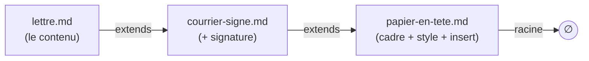
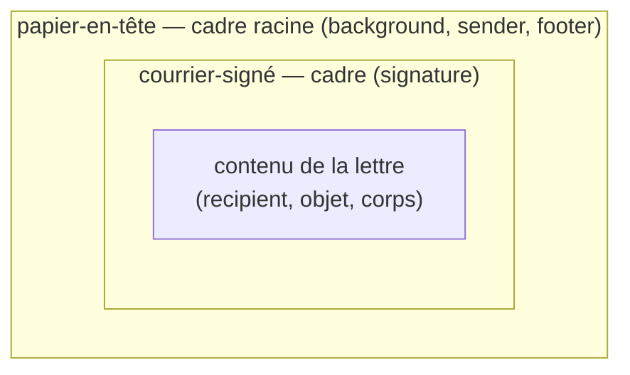
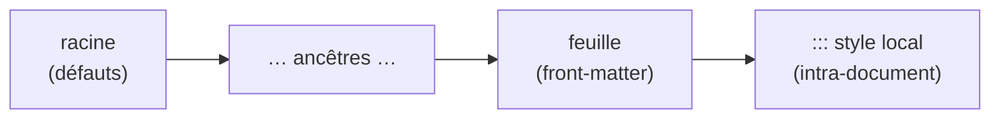

> **Statut :** **design exploratoire V1, non figé** — méthodo **pilotée par
> invariants** (S1–S6, §1, comme [GITHUB-SYNC-SPEC](GITHUB-SYNC-SPEC.md) /
> [VOLUMES-SPEC](VOLUMES-SPEC.md)). **Compagnon** de
> [FRONTMATTER-SPEC](FRONTMATTER-SPEC.md) et [STYLE-SPEC](STYLE-SPEC.md) : il
> en généralise la précédence. Rien n'est implémenté ; on **spécifie**. À terme
> référencé depuis [AI-AUTHORING.md](../AI-AUTHORING.md) et
> [FEATURES.md](../FEATURES.md). Implémentation à venir : un **résolveur de
> chaîne `extends`** + un **moteur d'aplatissement** (deepMerge des front-matters
> + repli des corps via `insert`) dans
> [`@orlarey/markpage-render`](../packages/markpage-render/), **partagé** appli
> ↔ extension VS Code.

**Objet :** rendre un document `.md` **autonome** (auto-suffisant) tout en
gardant l'édition **DRY**, en **jouant la récursivité** : un *style*, un
*preset*, un *template*, un *papier à en-tête* n'est **rien d'autre qu'un autre
document Markdown** ; un document « s'appuie sur » un style en **référençant** ce
document parent. On obtient une **pile chaînée** de `.md`, qu'on **aplatit** en
**un seul** `.md` — celui rendu *in fine*.

## Le trou d'autonomie (motivation)

markpage a aujourd'hui **trois mécanismes** d'apparence qui ne se recouvrent que
**partiellement** :

| Mécanisme | Porte | Vit | Portable avec le `.md` ? |
| :-- | :-- | :-- | :-- |
| **Front-matter** (clés plates) | métadonnées, `page-size`, `margins`, `font-*`… | dans le `.md` | ✅ lisible mais **incomplet** |
| **`markpage-profile:`** (embed) | le profil **complet** en **JSON** | dans le `.md` | ✅ mais **opaque** |
| **Profil / Réglages** | la **matrice de style par-élément**, header/footer, customFonts… | dans l'**appli** | ❌ **pas dans le fichier** |

::: warning [La conséquence]
La matrice de style par-élément n'a **aucune** représentation en clés plates :
un `.md` qui s'appuie sur le profil actif **n'est pas autonome** — il se rend
*différemment* selon l'état de l'appli. On peut être *lisible mais incomplet*,
*complet mais opaque*, ou *dépendant de l'appli* — jamais les trois.
:::

::: tip [Le renversement]
**Réglages / Styles / Front-matter ne sont pas trois choses : c'est UNE seule**
— l'« apparence d'un document » — vue par trois interfaces. Plutôt que de les
unifier *dans l'appli*, on les unifie **dans le format** : une apparence est un
**document Markdown** comme un autre. L'autonomie devient alors une **opération
sur les documents** — l'**aplatissement** —, pas un état d'appli.
:::

## 1. Invariants

Le design évolue **par invariants**, posés un par un (méthodo
[FORMAL-METHOD-SPEC](FORMAL-METHOD-SPEC.md)). S1–S6 sont la **source de vérité**.

**S1 — Tout est document.** Un style, un preset, un template, un papier à
en-tête **est un document markpage ordinaire** (front-matter + corps), souvent
**réduit à un front-matter**. **Aucun type spécial**, aucun nouveau format : les
mêmes règles de rendu s'appliquent à une couche de style et à une lettre.

**S2 — Récursivité & chaînage.** Un document **référence un parent** par la clé
de front-matter **`extends`**. La profondeur est **arbitraire** (lettre →
courrier → papier à en-tête → …). La résolution **suit la chaîne** jusqu'à la
**racine** (le document sans `extends`).

**S3 — Aplatissement déterministe.** Le rendu d'une feuille `L` est
`render(flatten(L))`, où **`flatten`** est une **fonction pure** (§4) produisant
**un seul** document `.md` **auto-suffisant**. Deux piles équivalentes donnent le
même aplati ; l'aplati se rend identiquement partout (appli, extension, export).

**S4 — Précédence enfant-gagne.** Dans la fusion des front-matters, **la feuille
surcharge ses parents** (le plus spécifique gagne). C'est la **généralisation**
des précédences déjà posées : *clés plates > profil*
([FRONTMATTER-SPEC](FRONTMATTER-SPEC.md)) et *`::: style` local > profil*
([STYLE-SPEC](STYLE-SPEC.md)).

**S5 — Corps : insertion ou concaténation.** Le corps d'un parent est un
**cadre** ; le bloc **`insert`** (vide) **matérialise le trou** où le corps
de l'enfant s'insère. **En l'absence** de `insert`, le corps de l'enfant
est **concaténé** après celui du parent.

**S6 — Autonomie par aplatissement.** On **édite** une pile concise (DRY) ; on
**rend / exporte** l'**aplati**, qui est **autonome**. C'est la réponse au trou
d'autonomie : la pile est pour l'auteur, l'aplati est pour le partage et le
rendu.

## 2. Le modèle — une pile de documents

Une feuille pointe vers son parent via `extends` ; chaque maillon est un `.md`.



À l'**aplatissement**, les **cadres s'emboîtent** autour du contenu de la
feuille — la racine (papier à en-tête) est l'**enveloppe la plus externe** :



Definition list des rôles :

couche (layer)
:   Un `.md` de la pile. Une **couche de style** est typiquement réduite à un
    front-matter ; une **couche template** ajoute un **cadre** de corps (avec un
    trou `insert`).

racine (root)
:   La couche **sans `extends`**. Porte les défauts les plus génériques et le
    cadre le plus externe.

feuille (leaf)
:   Le document qu'on **édite et rend**. Le plus spécifique ; **gagne** sur tous
    ses ancêtres.

## 3. Syntaxe

Deux ajouts, tous deux **rétrocompatibles** (un `.md` sans `extends` ni
`insert` se comporte comme aujourd'hui).

### 3.1. La clé `extends`

Une **clé de front-matter** dont la valeur **référence** la couche parente.

```ebnf
frontMatterKey = "extends", ":", ws, reference ;
reference      = bareName | quotedName ;
bareName       = identChar, { identChar } ;
quotedName     = '"', { character }, '"' ;
identChar      = letter | digit | "-" | "_" | "/" | "." ;
```

::: note [Résolution de la référence — esquisse, §12]
*Comment* `reference` désigne un document (nom dans la bibliothèque ? chemin ?
URL ? bundle partagé ?) est **laissé ouvert** (lien avec
[VOLUMES-SPEC](VOLUMES-SPEC.md) et le partage de `.md`). V1 pose la **sémantique**
(la chaîne, la fusion) indépendamment du **nommage**.
:::

### 3.2. Le bloc `insert`

Un fenced block de langage `insert`, **a priori vide**, qui marque **où** le
corps de l'enfant s'insère dans le corps du parent.

```ebnf
insertBlock = fence, "insert", [ ws, slotName ], newline, fence ;
slotName    = identChar, { identChar } ;
fence       = "```" ;
```

- **Corps vide** : c'est le **trou** (le cas V1). Le contenu de l'enfant le
  remplace.
- `slotName` (**différé**, §11) : trous **nommés** multiples. V1 = **un seul**
  trou, le **premier** rencontré.

## 4. Aplatissement (règles de réécriture)

`flatten` est défini par deux règles de réécriture pures. La **chaîne** se lit
de la feuille `L` vers la racine `Pₙ` ; les front-matters fusionnent **racine →
feuille** (l'enfant écrase), les corps se replient **feuille → racine** (chaque
ancêtre **enveloppe** l'accumulé).

```algorithm "flatten(L) — calcul du document rendu" \label{alg:flatten}
Input: document feuille L
Output: document aplati (front-matter fusionné, corps replié), auto-suffisant

chaine ← [L]                          ▷ … puis P1, P2, …, Pn (racine en dernier)
n ← L
while n possède une clé extends do
  n ← resoudre(n.extends)             ▷ §12 ; ERREUR si cycle ou référence absente
  chaine ← chaine ++ [n]
end

fm ← {}                               ▷ S4 : l'enfant gagne
for A in reverse(chaine) do           ▷ de la racine vers la feuille
  fm ← deepMerge(fm, frontMatter(A) privé de la clé extends)
end

corps ← body(L)                       ▷ S5 : chaque ancêtre enveloppe l'accumulé
for A in chaine[2..] do               ▷ P1, …, Pn
  corps ← insertInto(body(A), corps)
end

return assemble(fm, corps)
```

```algorithm "insertInto(cadre, contenu)" \label{alg:insert}
Input: cadre (corps du parent), contenu (l'accumulé de l'enfant)
Output: corps fusionné

if cadre contient au moins un bloc ```insert then
  return cadre où le PREMIER ```insert est remplacé par contenu   ▷ S5
else
  return cadre ++ "\n\n" ++ contenu      ▷ concaténation : cadre, puis contenu
end
```

::: important [`deepMerge` — la matrice de style fusionne par feuille]
`deepMerge` descend dans les **dictionnaires imbriqués** (la matrice de style :
`styles.h1.color`, `styles.body.fontSize`…) et fusionne **par élément et par
attribut** — un parent qui fixe `styles.h1.color` et un enfant qui fixe
`styles.h1.size` produisent un `h1` avec **les deux**. Les **scalaires** (et les
clés plates `page-size`, `margins`, `font-*`) : l'enfant **remplace** — sauf les
valeurs de reset `revert` / `unset` / `initial` (§9.2) qui **retirent** la clé
héritée. La fusion des **listes** (`customFonts`…) — *append* vs *replace* — est
une **question ouverte** (§12).
:::

## 5. Précédence (vue d'ensemble)

L'`extends` **étend** la chaîne de précédence existante, sans la contredire :



Du **moins** au **plus** spécifique : **racine → … → feuille → `::: style`
local**. Autrement dit, l'aplati produit un front-matter unique (par S4), puis
les overrides **intra-document** de [STYLE-SPEC](STYLE-SPEC.md) restent le niveau
**le plus fin**, inchangés.

## 6. Exemples complets

::: caution [Affichage littéral]
Les exemples sont dans des fences à **quatre backticks** : leur contenu (y
compris `insert`, `sender`, `:::`, le front-matter) s'affiche
**tel quel**, sans être rendu.
:::

**(i) `papier-en-tete.md`** — la racine : front-matter de mise en page + un
cadre (logo en fond, expéditeur, pied) avec **le trou** :

````markdown
---
page-size: A4
margins: 45 25 35 25
font-heading: Source Serif 4
---

:::: background at=0.92,0.07 size=0.12

::::

```sender
**Association Assa Azekka**
Maison des Associations de Tardy
4 boulevard Robert Maurice — 42100 Saint-Étienne
```

```footer
| Assa Azekka • Maison des Associations de Tardy • 42100 Saint-Étienne |
```

```insert
```
````

**(ii) `courrier-signe.md`** — `extends` le papier ; son corps est un cadre :
**le trou** (pour la lettre), puis la signature de la présidente :

````markdown
---
extends: papier-en-tete
---

```insert
```

```signature
**Sakina Bakha**
*Présidente*
```
````

**(iii) `lettre.md`** — `extends` le courrier ; rien que le **contenu** :

````markdown
---
extends: courrier-signe
---

```recipient
Monsieur le Maire
Hôtel de Ville
2 Pl. du Breuil — 42700 Firminy
```

Paris, le 27 juin 2026

**Objet :** Demande de lettre de soutien

Monsieur le Maire,

Notre association accueille une artiste étrangère et sollicite le soutien
institutionnel de la Ville…

Dans l'attente de votre retour, veuillez agréer, Monsieur le Maire,
l'expression de notre considération respectueuse.
````

**(iv) L'aplati** `flatten(lettre.md)` — front-matter fusionné (racine, rien à
surcharger ici) + corps replié (le papier enveloppe le courrier qui enveloppe la
lettre) ; **un seul `.md` autonome**, prêt à rendre :

````markdown
---
page-size: A4
margins: 45 25 35 25
font-heading: Source Serif 4
---

:::: background at=0.92,0.07 size=0.12

::::

```sender
**Association Assa Azekka**
Maison des Associations de Tardy
4 boulevard Robert Maurice — 42100 Saint-Étienne
```

```footer
| Assa Azekka • Maison des Associations de Tardy • 42100 Saint-Étienne |
```

```recipient
Monsieur le Maire
Hôtel de Ville
2 Pl. du Breuil — 42700 Firminy
```

Paris, le 27 juin 2026

**Objet :** Demande de lettre de soutien

Monsieur le Maire,

Notre association accueille une artiste étrangère et sollicite le soutien
institutionnel de la Ville…

Dans l'attente de votre retour, veuillez agréer, Monsieur le Maire,
l'expression de notre considération respectueuse.

```signature
**Sakina Bakha**
*Présidente*
```
````

::: note [Pourquoi cet ordre]
Le trou du **papier** reçoit le **courrier** ; le trou du **courrier** reçoit la
**lettre** ; la signature du courrier suit la lettre. D'où l'ordre final :
fond + expéditeur + pied (papier) → destinataire + objet + corps (lettre) →
signature (courrier). La **récursivité fait tout** — aucune option spéciale.
:::

## 7. Cas-limites

cycle
:   `A extends B`, `B extends A` (ou plus long) → **erreur** signalée (bloc rouge
    type `::: caution`), pas de boucle infinie. `flatten` détecte le maillon déjà
    vu.

référence manquante
:   `extends: inexistant` → **erreur** visible ; option de **fallback** (rendre
    la feuille seule, sans cadre) — *à décider* (§11).

plusieurs `insert`
:   V1 : on remplit **le premier**, les autres restent vides (donc supprimés à
    l'aplatissement). Trous **nommés** → différé (§11).

absence de `insert`
:   **concaténation** : corps du parent, puis corps de l'enfant (S5). C'est le
    cas d'un papier à en-tête « sans trou » : l'en-tête précède, la lettre suit.

front-matter racine vs feuille
:   La racine pose les défauts ; chaque enfant **surcharge** (S4). Une feuille
    peut donc juste régler `title:` et hériter de toute la mise en page.

## 8. Rapport aux mécanismes existants

Cette pile **subsume** les notions actuelles de style / preset / template :

profils & presets
:   Un **profil** = une **couche parente** réduite à un front-matter de style.
    Un **preset** (Classic, Rapport, Édition critique…) = une couche racine
    fournie. « Appliquer un profil » = poser `extends: <profil>`.

template
:   = une couche parente avec un **cadre de corps** (un `insert` + du
    contenu autour). « Nouvelle lettre » = créer une feuille `extends:
    modele-lettre`.

[FRONTMATTER-SPEC](FRONTMATTER-SPEC.md)
:   Les **clés plates** restent le **langage** du front-matter de **chaque**
    couche. `extends` est une **nouvelle clé** ; la précédence *clés plates >
    profil* devient le cas à deux maillons de S4.

[STYLE-SPEC](STYLE-SPEC.md)
:   `::: style` reste les overrides **intra-document**, le niveau **le plus
    spécifique** (§5) — inchangé.

[BACKGROUND-SPEC](BACKGROUND-SPEC.md) & letterhead
:   `::: background`, `sender` / `recipient` / `signature`,
    `header` / `footer` sont les **contenus typiques** d'une couche
    *papier à en-tête* — exactement l'exemple §6.

embed `markpage-profile`
:   L'**aplati** peut soit rester en **clés lisibles**, soit **auto-embarquer**
    le profil ; les deux satisfont S6 (autonomie). L'embed JSON devient un
    *détail de sérialisation* de l'aplati, plus l'unique voie vers l'autonomie.

## 9. Rapport à CSS — emprunts

Le front-matter markpage est déjà *CSS-flavored* : noms en kebab-case
(`font-heading`, `line-height`, `page-numbers`), le **shorthand `margins`** (1 à
4 valeurs, ordre CSS), couleurs `#rrggbb`, `weight` 100–900, `align`. Et la
précédence *clé plate > profil > défaut*
([FRONTMATTER-SPEC](FRONTMATTER-SPEC.md)) **est** une cascade — que `extends`
(S4) généralise. Trois emprunts CSS supplémentaires valent d'être notés : chacun
comble un **trou du modèle actuel**.

### 9.1. Tokens & `var()` — factoriser une valeur dans une couche

Aujourd'hui une couche « papier à en-tête » **répète** `#0b3d91` partout (titres,
filets, accent) : le `deepMerge` (§4) ne fusionne que des valeurs *concrètes*,
jamais réutilisées. Les **custom properties** CSS résolvent exactement ça —
définir un *token* une fois, le référencer par `var()` :

````yaml
# couche papier-en-tête
--brand: "#0b3d91"
--accent: "#c0392b"
styles.h1.color: var(--brand)
styles.h2.color: var(--brand)
quote.borderColor: var(--accent)
````

::: tip [Pourquoi ça épouse la pile]
Le token vit dans **une** couche, ses références dans une **autre**. Un courrier
qui `extends` le papier n'a qu'à redéfinir `--brand: "#1a5f3a"` et **tout le
dérivé suit**. C'est le chaînon manquant du *DRY-dans-une-couche*.
:::

La syntaxe est **arrêtée** pour V1 :

déclaration
:   une **clé plate** préfixée `--`, valeur scalaire quelconque (`--brand:
    "#0b3d91"`, `--measure: 66`). Reste dans le sous-ensemble *clés scalaires
    plates* de [FRONTMATTER-SPEC](FRONTMATTER-SPEC.md) — aucune clé markpage ne
    commence par `--`, donc zéro collision. C'est la custom property CSS, telle
    quelle.

référence
:   `var(--name)`, avec fallback optionnel `var(--name, défaut)`, admise dans
    **n'importe quelle valeur** (couleur, taille, fonte, nombre…). Le token est
    un scalaire **non typé** : la substitution a lieu, *puis* la validation
    par-clé habituelle s'applique au résultat — un token couleur posé dans une
    taille échoue exactement comme une mauvaise valeur écrite à la main.

résolution
:   au **rendu**, contre l'ensemble des tokens **après `deepMerge`** (l'enfant
    gagne) — comme CSS résout les custom properties au *computed value*.
    `flatten` (§4) reste donc **inchangé** : il fusionne, il ne résout pas.

token → token
:   `--accent: var(--brand)` est permis ; résolution itérative jusqu'au point
    fixe, **cycle = erreur** (même politique que les cycles `extends`, §3.1 /
    §7).

token absent
:   `var(--x)` sans fallback ni définition → **erreur visible** (les typos
    remontent, comme un `\ref` cassé).

````yaml
--measure: 66
measureChars: var(--measure)          # un token de taille, pas qu'une couleur
styles.h1.color: var(--brand, #111)   # fallback si --brand n'est pas défini
````

### 9.2. `revert` / `unset` / `initial` — dé-poser une valeur héritée

Le `deepMerge` (§4) est **override-only** : un enfant peut *poser* une valeur,
jamais **dé-poser** celle d'un parent — une feuille est donc *prisonnière* des
choix de ses ancêtres. CSS a le mot juste : des **valeurs de reset** qui
*retirent* au lieu de remplacer.

````yaml
extends: papier-en-tete
font-heading: revert      # PAS la police de titre du papier
styles.h1.color: unset    # h1 revient au défaut, pas à la couleur héritée
````

À spécifier dans les règles de réécriture (§4) : `revert` / `unset` / `initial`
sont des valeurs **reconnues** par `deepMerge` qui suppriment la clé héritée
(retour au défaut markpage) plutôt que d'écrire une valeur concrète.

### 9.3. `@layer` — le modèle formel de la pile

Les **cascade layers** CSS (`@layer`) sont *littéralement* la STACK-SPEC : des
couches **nommées, explicitement ordonnées**, la dernière l'emporte — et
**orthogonalement** à la spécificité (une couche entière perd face à une couche
postérieure, quel que soit le poids du sélecteur). C'est le bon vocabulaire pour
décrire S4, et ça suggère qu'une couche pourrait déclarer son **rôle/nom** —
utile pour déboguer l'aplati (« cette valeur vient de quelle couche ? »).

### 9.4. À considérer plus tard / à laisser

héritage (inherited vs non-inherited)
:   Définir `body` comme **base** dont `h1…h6` héritent la police sauf override
    — réduit la répétition. markpage le fait déjà à demi (`font-body` /
    `font-heading`).

shorthands ↔ longhands
:   `margins` est déjà un shorthand ; un `font:` / `border:` suivrait le même
    principe — avec le piège CSS qu'un shorthand **reset** les longhands non
    cités.

à laisser de côté
:   sélecteurs / spécificité complète, `!important`, `@media`, `calc()` — markpage
    gagne à garder le modèle *par-élément* simple (le coût dépasse le bénéfice).

## 10. Round-trip Réglages ↔ front-matter

**Décision (V1) :** le panneau **Réglages** est un **éditeur structuré du
front-matter du document courant** — *sa propre feuille*. Bouger un curseur
écrit une clé dans le front-matter du `.md` actif ; éditer le texte du
front-matter rafraîchit le panneau. La GUI et le texte sont **deux vues de la
même couche**.

Correspondance contrôle ↔ clé :

clés plates
:   page / fontes / numéros — `page-size`, `margins`, `font-body`,
    `font-heading`, `font-mono`, `page-numbers` (déjà le langage de
    [FRONTMATTER-SPEC](FRONTMATTER-SPEC.md)).

matrice par-élément
:   chaque attribut d'un élément → une clé **pointée** `styles.<élément>.<attr>`
    (`styles.h1.color`, `styles.body.fontSize`, `styles.quote.borderColor`) —
    les mêmes clés que le `deepMerge` (§4) fusionne, désormais **lisibles** dans
    le front-matter au lieu de l'embed JSON opaque.

tokens
:   les `--name` (§9.1) remontent comme une petite palette « thème » qui pilote
    plusieurs contrôles d'un coup.

Ce qu'écrit le panneau dans la feuille, après quelques réglages :

````yaml
---
page-size: A4
margins: 25 35
font-body: Lora
styles.h1.color: "#14223a"
styles.h1.fontSize: 22
styles.body.align: justify
---
````

::: tip [La dissolution du trou d'autonomie]
Les trois mécanismes (Réglages / matrice Styles / front-matter) **cessent d'en
être trois** : Réglages *est* l'édition du front-matter. Tout document devient
**auto-suffisant** (S6) — son apparence vit dans son propre `.md`, en clair.
L'embed `markpage-profile` JSON n'est plus qu'une sérialisation compacte
alternative, plus l'unique voie vers l'autonomie.
:::

**Rapport à `extends` (V1).** L'édition atterrit **toujours sur la feuille**.
Une couche de style partagée (papier à en-tête, preset…) est elle-même un
`.md` : on l'édite en l'**ouvrant** (elle est alors *sa propre* feuille). Le
panneau **n'écrit jamais en douce dans un parent** — donc aucun effet de bord
sur les autres documents qui l'`extends`ent.

::: note [Évolution différée — le modèle « DevTools » (D)]
B est la **réduction à une seule couche** d'un modèle plus riche : vue
**calculée** (l'aplati) + **provenance** par propriété (« vient de
*papier-en-tête*, via `var(--brand)` ») + **sélecteur de couche cible**
(feuille = override local, ancêtre = style partagé) + geste **« revenir à
l'hérité »** (= écrit `revert` / `unset`, §9.2). Différé (§11) : V1 n'édite que
la feuille, sans sélecteur ni provenance.
:::

## 11. Non-buts & différés

::: caution

- **Trous nommés multiples** (`insert` nommés) — différé ; V1 = **un seul**
  trou (le premier).
- **Variables / paramètres de template** (`{{recipient}}`, substitutions) —
  différé ; V1 = composition de **contenu**, pas de **paramétrage**.
- **Boucles / conditionnels** dans les couches — **hors sujet** (ce n'est pas un
  langage de template).
- **Résolution de la référence** (nom de bibliothèque vs chemin vs URL vs
  bundle) — **esquissée** seulement (§3.1, §12) ; la sémantique d'aplatissement
  n'en dépend pas.
- **Round-trip « DevTools » (modèle D)** — vue calculée + provenance + sélecteur
  de couche cible + « revenir à l'hérité » — différé ; V1 = B, le panneau édite
  **la feuille** (§10).
:::

## 12. Questions ouvertes

- **Nom de la clé** : `extends` (retenu) vs `base` / `on` / `style` / `from`.
- **Nom du bloc** : `insert` (retenu) vs `slot` / `content` / `body`.
- **Sens de la concaténation** par défaut : *parent puis enfant* (proposé) — à
  confirmer (un cas où l'enfant doit précéder ?).
- **Fusion des listes** (`customFonts`, header/footer multiples…) : *append* ou
  *replace* ? Probablement *replace* (cohérent avec « l'enfant gagne »), avec une
  syntaxe d'*append* explicite plus tard.
- **Tokens dans `::: style`** : `var(--x)` est-il résolu aussi dans les
  overrides locaux `::: style` (§5), dont l'allowlist STYLE-SPEC n'admet pas le
  CSS brut ? (La déclaration `--name` et la portée *toute valeur* sont
  **arrêtées**, §9.1.)
- **Trous nommés** : `insert nom` côté cadre, `extends` + ciblage côté enfant —
  quelle syntaxe pour « ce contenu va dans tel trou » ?
- **Résolution & partage** : comment l'appli résout `extends` et **garantit
  l'autonomie au partage** — *flatten automatique à l'export* ? bundle de la
  chaîne ? (lien [VOLUMES-SPEC](VOLUMES-SPEC.md)).
- **Promotion vers une couche partagée** : depuis B (le panneau édite la
  feuille, §10), quel **geste** extrait un réglage vers un parent `extends`é
  (« créer un style à partir de ces réglages », « pousser cette couleur dans
  *papier-en-tête* ») ? C'est le pont B → C/D, à dessiner.

## 13. Esquisse d'implémentation

::: caution [Conception, pas encore de code]
Cette section esquisse *comment* on câblerait l'aplatissement ; elle n'engage
pas l'API.
:::

- **Résolveur de chaîne** : à partir d'une feuille, suivre `extends` (détecter
  cycles / références manquantes), renvoyer la liste `[L, P₁, …, Pₙ]`.
- **Moteur d'aplatissement** : `deepMerge` des front-matters (racine → feuille)
  + repli des corps via `insert` (`insertInto`, §4). Fonction **pure**,
  testable au niveau parseur (corpus `tests/corpus/`).
- **Intégration rendu** : `render(flatten(L))` partout — appli **et** extension
  VS Code, via [`@orlarey/markpage-render`](../packages/markpage-render/) (le
  même point de partage que `paginationCss` / `keepLabelsWithNext`).
- **Export** : `flatten` est aussi l'opération « exporter un `.md` autonome ».
