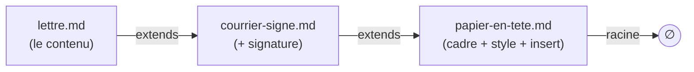
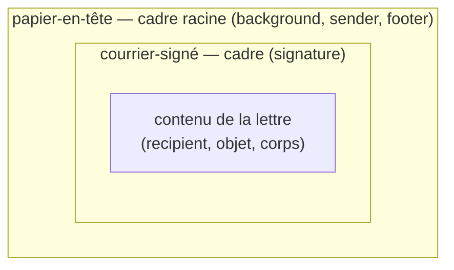
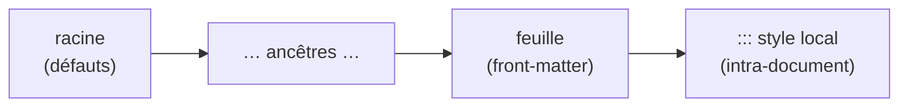

> **Statut :** **design exploratoire V1, non figé** — méthodo **pilotée par
> invariants** (S1–S6, §1, comme [GITHUB-SYNC-SPEC](GITHUB-SYNC-SPEC.md) /
> [VOLUMES-SPEC](VOLUMES-SPEC.md)). **Compagnon** de
> [FRONTMATTER-SPEC](FRONTMATTER-SPEC.md) et [STYLE-SPEC](STYLE-SPEC.md) : il
> en généralise la précédence. Rien n'est implémenté ; on **spécifie**. À terme
> référencé depuis [AI-AUTHORING.md](../AI-AUTHORING.md) et
> [FEATURES.md](../FEATURES.md). Implémentation à venir : un **résolveur de
> chaîne `extends`** + un **moteur d'aplatissement** (deepMerge des front-matters
> + repli des corps via `insert`) dans
> [`@orlarey/markpage-render`](../packages/markpage-render/), **partagé** appli
> ↔ extension VS Code.

**Objet :** rendre un document `.md` **autonome** (auto-suffisant) tout en
gardant l'édition **DRY**, en **jouant la récursivité** : un *style*, un
*preset*, un *template*, un *papier à en-tête* n'est **rien d'autre qu'un autre
document Markdown** ; un document « s'appuie sur » un style en **référençant** ce
document parent. On obtient une **pile chaînée** de `.md`, qu'on **aplatit** en
**un seul** `.md` — celui rendu *in fine*.

## Le trou d'autonomie (motivation)

markpage a aujourd'hui **trois mécanismes** d'apparence qui ne se recouvrent que
**partiellement** :

| Mécanisme | Porte | Vit | Portable avec le `.md` ? |
| :-- | :-- | :-- | :-- |
| **Front-matter** (clés plates) | métadonnées, `page-size`, `margins`, `font-*`… | dans le `.md` | ✅ lisible mais **incomplet** |
| **`markpage-profile:`** (embed) | le profil **complet** en **JSON** | dans le `.md` | ✅ mais **opaque** |
| **Profil / Réglages** | la **matrice de style par-élément**, header/footer, customFonts… | dans l'**appli** | ❌ **pas dans le fichier** |

::: warning [La conséquence]
La matrice de style par-élément n'a **aucune** représentation en clés plates :
un `.md` qui s'appuie sur le profil actif **n'est pas autonome** — il se rend
*différemment* selon l'état de l'appli. On peut être *lisible mais incomplet*,
*complet mais opaque*, ou *dépendant de l'appli* — jamais les trois.
:::

::: tip [Le renversement]
**Réglages / Styles / Front-matter ne sont pas trois choses : c'est UNE seule**
— l'« apparence d'un document » — vue par trois interfaces. Plutôt que de les
unifier *dans l'appli*, on les unifie **dans le format** : une apparence est un
**document Markdown** comme un autre. L'autonomie devient alors une **opération
sur les documents** — l'**aplatissement** —, pas un état d'appli.
:::

## 1. Invariants

Le design évolue **par invariants**, posés un par un (méthodo
[FORMAL-METHOD-SPEC](FORMAL-METHOD-SPEC.md)). S1–S6 sont la **source de vérité**.

**S1 — Tout est document.** Un style, un preset, un template, un papier à
en-tête **est un document markpage ordinaire** (front-matter + corps), souvent
**réduit à un front-matter**. **Aucun type spécial**, aucun nouveau format : les
mêmes règles de rendu s'appliquent à une couche de style et à une lettre.

**S2 — Récursivité & chaînage.** Un document **référence un parent** par la clé
de front-matter **`extends`**. La profondeur est **arbitraire** (lettre →
courrier → papier à en-tête → …). La résolution **suit la chaîne** jusqu'à la
**racine** (le document sans `extends`).

**S3 — Aplatissement déterministe.** Le rendu d'une feuille `L` est
`render(flatten(L))`, où **`flatten`** est une **fonction pure** (§4) produisant
**un seul** document `.md` **auto-suffisant**. Deux piles équivalentes donnent le
même aplati ; l'aplati se rend identiquement partout (appli, extension, export).

**S4 — Précédence enfant-gagne.** Dans la fusion des front-matters, **la feuille
surcharge ses parents** (le plus spécifique gagne). C'est la **généralisation**
des précédences déjà posées : *clés plates > profil*
([FRONTMATTER-SPEC](FRONTMATTER-SPEC.md)) et *`::: style` local > profil*
([STYLE-SPEC](STYLE-SPEC.md)).

**S5 — Corps : insertion ou concaténation.** Le corps d'un parent est un
**cadre** ; le bloc **`insert`** (vide) **matérialise le trou** où le corps
de l'enfant s'insère. **En l'absence** de `insert`, le corps de l'enfant
est **concaténé** après celui du parent.

**S6 — Autonomie par aplatissement.** On **édite** une pile concise (DRY) ; on
**rend / exporte** l'**aplati**, qui est **autonome**. C'est la réponse au trou
d'autonomie : la pile est pour l'auteur, l'aplati est pour le partage et le
rendu.

## 2. Le modèle — une pile de documents

Une feuille pointe vers son parent via `extends` ; chaque maillon est un `.md`.



À l'**aplatissement**, les **cadres s'emboîtent** autour du contenu de la
feuille — la racine (papier à en-tête) est l'**enveloppe la plus externe** :



Definition list des rôles :

couche (layer)
:   Un `.md` de la pile. Une **couche de style** est typiquement réduite à un
    front-matter ; une **couche template** ajoute un **cadre** de corps (avec un
    trou `insert`).

racine (root)
:   La couche **sans `extends`**. Porte les défauts les plus génériques et le
    cadre le plus externe.

feuille (leaf)
:   Le document qu'on **édite et rend**. Le plus spécifique ; **gagne** sur tous
    ses ancêtres.

## 3. Syntaxe

Deux ajouts, tous deux **rétrocompatibles** (un `.md` sans `extends` ni
`insert` se comporte comme aujourd'hui).

### 3.1. La clé `extends`

Une **clé de front-matter** dont la valeur **référence** la couche parente.

```ebnf
frontMatterKey = "extends", ":", ws, reference ;
reference      = bareName | quotedName ;
bareName       = identChar, { identChar } ;
quotedName     = '"', { character }, '"' ;
identChar      = letter | digit | "-" | "_" | "/" | "." ;
```

::: note [Résolution de la référence — esquisse, §10]
*Comment* `reference` désigne un document (nom dans la bibliothèque ? chemin ?
URL ? bundle partagé ?) est **laissé ouvert** (lien avec
[VOLUMES-SPEC](VOLUMES-SPEC.md) et le partage de `.md`). V1 pose la **sémantique**
(la chaîne, la fusion) indépendamment du **nommage**.
:::

### 3.2. Le bloc `insert`

Un fenced block de langage `insert`, **a priori vide**, qui marque **où** le
corps de l'enfant s'insère dans le corps du parent.

```ebnf
insertBlock = fence, "insert", [ ws, slotName ], newline, fence ;
slotName    = identChar, { identChar } ;
fence       = "```" ;
```

- **Corps vide** : c'est le **trou** (le cas V1). Le contenu de l'enfant le
  remplace.
- `slotName` (**différé**, §9) : trous **nommés** multiples. V1 = **un seul**
  trou, le **premier** rencontré.

## 4. Aplatissement (règles de réécriture)

`flatten` est défini par deux règles de réécriture pures. La **chaîne** se lit
de la feuille `L` vers la racine `Pₙ` ; les front-matters fusionnent **racine →
feuille** (l'enfant écrase), les corps se replient **feuille → racine** (chaque
ancêtre **enveloppe** l'accumulé).

```algorithm "flatten(L) — calcul du document rendu" \label{alg:flatten}
Input: document feuille L
Output: document aplati (front-matter fusionné, corps replié), auto-suffisant

chaine ← [L]                          ▷ … puis P1, P2, …, Pn (racine en dernier)
n ← L
while n possède une clé extends do
  n ← resoudre(n.extends)             ▷ §10 ; ERREUR si cycle ou référence absente
  chaine ← chaine ++ [n]
end

fm ← {}                               ▷ S4 : l'enfant gagne
for A in reverse(chaine) do           ▷ de la racine vers la feuille
  fm ← deepMerge(fm, frontMatter(A) privé de la clé extends)
end

corps ← body(L)                       ▷ S5 : chaque ancêtre enveloppe l'accumulé
for A in chaine[2..] do               ▷ P1, …, Pn
  corps ← insertInto(body(A), corps)
end

return assemble(fm, corps)
```

```algorithm "insertInto(cadre, contenu)" \label{alg:insert}
Input: cadre (corps du parent), contenu (l'accumulé de l'enfant)
Output: corps fusionné

if cadre contient au moins un bloc ```insert then
  return cadre où le PREMIER ```insert est remplacé par contenu   ▷ S5
else
  return cadre ++ "\n\n" ++ contenu      ▷ concaténation : cadre, puis contenu
end
```

::: important [`deepMerge` — la matrice de style fusionne par feuille]
`deepMerge` descend dans les **dictionnaires imbriqués** (la matrice de style :
`styles.h1.color`, `styles.body.fontSize`…) et fusionne **par élément et par
attribut** — un parent qui fixe `styles.h1.color` et un enfant qui fixe
`styles.h1.size` produisent un `h1` avec **les deux**. Les **scalaires** (et les
clés plates `page-size`, `margins`, `font-*`) : l'enfant **remplace**. La fusion
des **listes** (`customFonts`…) — *append* vs *replace* — est une **question
ouverte** (§9).
:::

## 5. Précédence (vue d'ensemble)

L'`extends` **étend** la chaîne de précédence existante, sans la contredire :



Du **moins** au **plus** spécifique : **racine → … → feuille → `::: style`
local**. Autrement dit, l'aplati produit un front-matter unique (par S4), puis
les overrides **intra-document** de [STYLE-SPEC](STYLE-SPEC.md) restent le niveau
**le plus fin**, inchangés.

## 6. Exemples complets

::: caution [Affichage littéral]
Les exemples sont dans des fences à **quatre backticks** : leur contenu (y
compris `insert`, `sender`, `:::`, le front-matter) s'affiche
**tel quel**, sans être rendu.
:::

**(i) `papier-en-tete.md`** — la racine : front-matter de mise en page + un
cadre (logo en fond, expéditeur, pied) avec **le trou** :

````markdown
---
page-size: A4
margins: 45 25 35 25
font-heading: Source Serif 4
---

:::: background at=0.92,0.07 size=0.12

::::

```sender
**Association Assa Azekka**
Maison des Associations de Tardy
4 boulevard Robert Maurice — 42100 Saint-Étienne
```

```footer
| Assa Azekka • Maison des Associations de Tardy • 42100 Saint-Étienne |
```

```insert
```
````

**(ii) `courrier-signe.md`** — `extends` le papier ; son corps est un cadre :
**le trou** (pour la lettre), puis la signature de la présidente :

````markdown
---
extends: papier-en-tete
---

```insert
```

```signature
**Sakina Bakha**
*Présidente*
```
````

**(iii) `lettre.md`** — `extends` le courrier ; rien que le **contenu** :

````markdown
---
extends: courrier-signe
---

```recipient
Monsieur le Maire
Hôtel de Ville
2 Pl. du Breuil — 42700 Firminy
```

Paris, le 27 juin 2026

**Objet :** Demande de lettre de soutien

Monsieur le Maire,

Notre association accueille une artiste étrangère et sollicite le soutien
institutionnel de la Ville…

Dans l'attente de votre retour, veuillez agréer, Monsieur le Maire,
l'expression de notre considération respectueuse.
````

**(iv) L'aplati** `flatten(lettre.md)` — front-matter fusionné (racine, rien à
surcharger ici) + corps replié (le papier enveloppe le courrier qui enveloppe la
lettre) ; **un seul `.md` autonome**, prêt à rendre :

````markdown
---
page-size: A4
margins: 45 25 35 25
font-heading: Source Serif 4
---

:::: background at=0.92,0.07 size=0.12

::::

```sender
**Association Assa Azekka**
Maison des Associations de Tardy
4 boulevard Robert Maurice — 42100 Saint-Étienne
```

```footer
| Assa Azekka • Maison des Associations de Tardy • 42100 Saint-Étienne |
```

```recipient
Monsieur le Maire
Hôtel de Ville
2 Pl. du Breuil — 42700 Firminy
```

Paris, le 27 juin 2026

**Objet :** Demande de lettre de soutien

Monsieur le Maire,

Notre association accueille une artiste étrangère et sollicite le soutien
institutionnel de la Ville…

Dans l'attente de votre retour, veuillez agréer, Monsieur le Maire,
l'expression de notre considération respectueuse.

```signature
**Sakina Bakha**
*Présidente*
```
````

::: note [Pourquoi cet ordre]
Le trou du **papier** reçoit le **courrier** ; le trou du **courrier** reçoit la
**lettre** ; la signature du courrier suit la lettre. D'où l'ordre final :
fond + expéditeur + pied (papier) → destinataire + objet + corps (lettre) →
signature (courrier). La **récursivité fait tout** — aucune option spéciale.
:::

## 7. Cas-limites

cycle
:   `A extends B`, `B extends A` (ou plus long) → **erreur** signalée (bloc rouge
    type `::: caution`), pas de boucle infinie. `flatten` détecte le maillon déjà
    vu.

référence manquante
:   `extends: inexistant` → **erreur** visible ; option de **fallback** (rendre
    la feuille seule, sans cadre) — *à décider* (§9).

plusieurs `insert`
:   V1 : on remplit **le premier**, les autres restent vides (donc supprimés à
    l'aplatissement). Trous **nommés** → différé (§9).

absence de `insert`
:   **concaténation** : corps du parent, puis corps de l'enfant (S5). C'est le
    cas d'un papier à en-tête « sans trou » : l'en-tête précède, la lettre suit.

front-matter racine vs feuille
:   La racine pose les défauts ; chaque enfant **surcharge** (S4). Une feuille
    peut donc juste régler `title:` et hériter de toute la mise en page.

## 8. Rapport aux mécanismes existants

Cette pile **subsume** les notions actuelles de style / preset / template :

profils & presets
:   Un **profil** = une **couche parente** réduite à un front-matter de style.
    Un **preset** (Classic, Rapport, Édition critique…) = une couche racine
    fournie. « Appliquer un profil » = poser `extends: <profil>`.

template
:   = une couche parente avec un **cadre de corps** (un `insert` + du
    contenu autour). « Nouvelle lettre » = créer une feuille `extends:
    modele-lettre`.

[FRONTMATTER-SPEC](FRONTMATTER-SPEC.md)
:   Les **clés plates** restent le **langage** du front-matter de **chaque**
    couche. `extends` est une **nouvelle clé** ; la précédence *clés plates >
    profil* devient le cas à deux maillons de S4.

[STYLE-SPEC](STYLE-SPEC.md)
:   `::: style` reste les overrides **intra-document**, le niveau **le plus
    spécifique** (§5) — inchangé.

[BACKGROUND-SPEC](BACKGROUND-SPEC.md) & letterhead
:   `::: background`, `sender` / `recipient` / `signature`,
    `header` / `footer` sont les **contenus typiques** d'une couche
    *papier à en-tête* — exactement l'exemple §6.

embed `markpage-profile`
:   L'**aplati** peut soit rester en **clés lisibles**, soit **auto-embarquer**
    le profil ; les deux satisfont S6 (autonomie). L'embed JSON devient un
    *détail de sérialisation* de l'aplati, plus l'unique voie vers l'autonomie.

## 9. Non-buts & différés

::: caution

- **Trous nommés multiples** (`insert` nommés) — différé ; V1 = **un seul**
  trou (le premier).
- **Variables / paramètres de template** (`{{recipient}}`, substitutions) —
  différé ; V1 = composition de **contenu**, pas de **paramétrage**.
- **Boucles / conditionnels** dans les couches — **hors sujet** (ce n'est pas un
  langage de template).
- **Résolution de la référence** (nom de bibliothèque vs chemin vs URL vs
  bundle) — **esquissée** seulement (§3.1, §10) ; la sémantique d'aplatissement
  n'en dépend pas.
:::

## 10. Questions ouvertes

- **Nom de la clé** : `extends` (retenu) vs `base` / `on` / `style` / `from`.
- **Nom du bloc** : `insert` (retenu) vs `slot` / `content` / `body`.
- **Sens de la concaténation** par défaut : *parent puis enfant* (proposé) — à
  confirmer (un cas où l'enfant doit précéder ?).
- **Fusion des listes** (`customFonts`, header/footer multiples…) : *append* ou
  *replace* ? Probablement *replace* (cohérent avec « l'enfant gagne »), avec une
  syntaxe d'*append* explicite plus tard.
- **Trous nommés** : `insert nom` côté cadre, `extends` + ciblage côté enfant —
  quelle syntaxe pour « ce contenu va dans tel trou » ?
- **Résolution & partage** : comment l'appli résout `extends` et **garantit
  l'autonomie au partage** — *flatten automatique à l'export* ? bundle de la
  chaîne ? (lien [VOLUMES-SPEC](VOLUMES-SPEC.md)).
- **Round-trip UI** : le panneau **Réglages** devient-il l'**éditeur d'une couche
  de style** (le parent `extends`é), plutôt qu'un état d'appli séparé ? Ce serait
  la dissolution complète du trou d'autonomie.

## 11. Esquisse d'implémentation

::: caution [Conception, pas encore de code]
Cette section esquisse *comment* on câblerait l'aplatissement ; elle n'engage
pas l'API.
:::

- **Résolveur de chaîne** : à partir d'une feuille, suivre `extends` (détecter
  cycles / références manquantes), renvoyer la liste `[L, P₁, …, Pₙ]`.
- **Moteur d'aplatissement** : `deepMerge` des front-matters (racine → feuille)
  + repli des corps via `insert` (`insertInto`, §4). Fonction **pure**,
  testable au niveau parseur (corpus `tests/corpus/`).
- **Intégration rendu** : `render(flatten(L))` partout — appli **et** extension
  VS Code, via [`@orlarey/markpage-render`](../packages/markpage-render/) (le
  même point de partage que `paginationCss` / `keepLabelsWithNext`).
- **Export** : `flatten` est aussi l'opération « exporter un `.md` autonome ».
