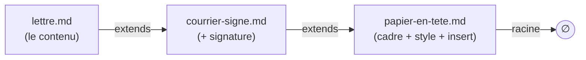
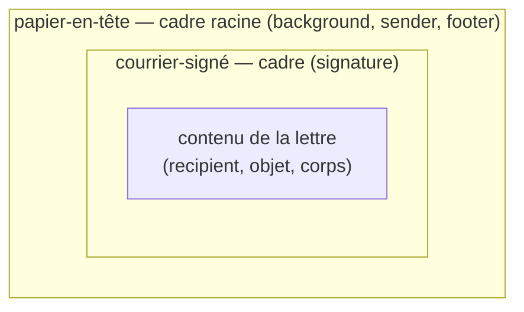
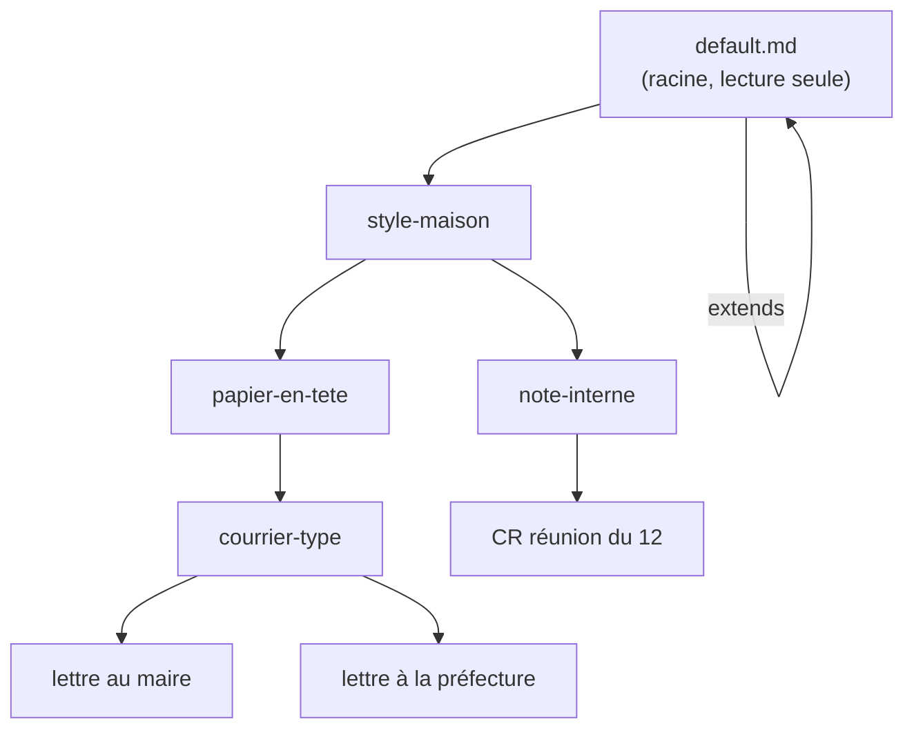
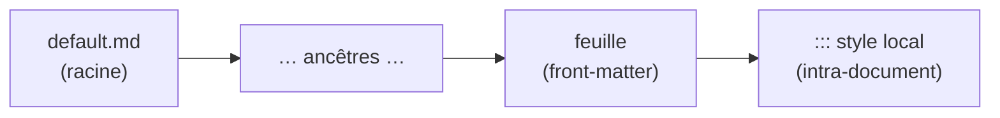

> **Statut :** **design exploratoire V1, non figé** — méthodo **pilotée par
> invariants** (S1–S6, §1, comme [GITHUB-SYNC-SPEC](GITHUB-SYNC-SPEC.md) /
> [VOLUMES-SPEC](VOLUMES-SPEC.md)). **Compagnon** de
> [FRONTMATTER-SPEC](FRONTMATTER-SPEC.md) et [STYLE-SPEC](STYLE-SPEC.md) : il
> en généralise la précédence. Rien n'est implémenté ; on **spécifie**. À terme
> référencé depuis [AI-AUTHORING.md](../AI-AUTHORING.md) et
> [FEATURES.md](../FEATURES.md). Implémentation à venir : un **résolveur de
> chaîne `extends`** + un **moteur d'aplatissement** (merge des front-matters
> + repli des corps via `insert`) dans
> [`@orlarey/markpage-render`](../packages/markpage-render/), **partagé** appli
> ↔ extension VS Code.

**Objet :** rendre un document `.md` **autonome** (auto-suffisant) tout en
gardant l'édition **DRY**, en **jouant la récursivité** : un *style*, un
*preset*, un *template*, un *papier à en-tête* n'est **rien d'autre qu'un autre
document Markdown** ; un document « s'appuie sur » un style en **référençant** ce
document parent. On obtient une **pile chaînée** de `.md`, qu'on **aplatit** en
**un seul** `.md` — celui rendu *in fine*.

## Le trou d'autonomie (motivation)

markpage a aujourd'hui **trois mécanismes** d'apparence qui ne se recouvrent que
**partiellement** :

| Mécanisme | Porte | Vit | Portable avec le `.md` ? |
| :-- | :-- | :-- | :-- |
| **Front-matter** (clés plates) | métadonnées, `page-size`, `margins`, `font-*`… | dans le `.md` | ✅ lisible mais **incomplet** |
| **`markpage-profile:`** (embed) | le profil **complet** en **JSON** | dans le `.md` | ✅ mais **opaque** |
| **Profil / Réglages** | la **matrice de style par-élément**, header/footer, customFonts… | dans l'**appli** | ❌ **pas dans le fichier** |

::: warning [La conséquence]
La matrice de style par-élément n'a **aucune** représentation en clés plates :
un `.md` qui s'appuie sur le profil actif **n'est pas autonome** — il se rend
*différemment* selon l'état de l'appli. On peut être *lisible mais incomplet*,
*complet mais opaque*, ou *dépendant de l'appli* — jamais les trois.
:::

::: tip [Le renversement]
**Réglages / Styles / Front-matter ne sont pas trois choses : c'est UNE seule**
— l'« apparence d'un document » — vue par trois interfaces. Plutôt que de les
unifier *dans l'appli*, on les unifie **dans le format** : une apparence est un
**document Markdown** comme un autre. L'autonomie devient alors une **opération
sur les documents** — l'**aplatissement** —, pas un état d'appli.
:::

## 1. Invariants

Le design évolue **par invariants**, posés un par un (méthodo
[FORMAL-METHOD-SPEC](FORMAL-METHOD-SPEC.md)). S1–S6 sont la **source de vérité**.

**S1 — Tout est document.** Un style, un preset, un template, un papier à
en-tête **est un document markpage ordinaire** (front-matter + corps), souvent
**réduit à un front-matter**. **Aucun type spécial**, aucun nouveau format : les
mêmes règles de rendu s'appliquent à une couche de style et à une lettre. Même
la **racine** est un document : `default.md` (§3.1).

**S2 — Récursivité & chaînage.** **Tout** document **référence un parent** par la
clé de front-matter **`extends`** — un champ à **valeur par défaut** (`default.md`).
La profondeur est **arbitraire** (lettre → courrier → papier à en-tête → …). La
résolution **suit la chaîne** jusqu'à **`default.md`**, dont l'`extends` pointe
sur **lui-même** (le point fixe, §3.1).

**S3 — Aplatissement déterministe.** Le rendu d'une feuille `L` est
`render(flatten(L))`, où **`flatten`** est une **fonction pure** (§5) produisant
**un seul** document `.md` **auto-suffisant**. Deux piles équivalentes donnent le
même aplati ; l'aplati se rend identiquement partout (appli, extension, export).

**S4 — Précédence enfant-gagne.** Dans la fusion des front-matters, **la feuille
surcharge ses parents** (le plus spécifique gagne). C'est la **généralisation**
des précédences déjà posées : *clés plates > profil*
([FRONTMATTER-SPEC](FRONTMATTER-SPEC.md)) et *`::: style` local > profil*
([STYLE-SPEC](STYLE-SPEC.md)).

**S5 — Corps : insertion ou concaténation.** Le corps d'un parent est un
**cadre** ; le bloc **`insert`** (vide) **matérialise le trou** où le corps
de l'enfant s'insère. **En l'absence** de `insert`, le corps de l'enfant
est **concaténé** après celui du parent.

**S6 — Autonomie par aplatissement.** On **édite** une pile concise (DRY) ; le
**rendu** travaille sur l'**aplati** autonome (`render(flatten(L))`). En V1,
*Enregistrer* persiste la **source** (la pile, `extends` préservé) ; l'**export**
d'un `.md` autonome — pour le partage — procède du même `flatten`, mais est
**différé** (§12). La pile est pour l'auteur, l'aplati pour le rendu.

## 2. Le modèle — une pile de documents

Une feuille pointe vers son parent via `extends` ; chaque maillon est un `.md`.



À l'**aplatissement**, les **cadres s'emboîtent** autour du contenu de la
feuille — la racine (papier à en-tête) est l'**enveloppe la plus externe** :



Definition list des rôles :

couche (layer)
:   Un `.md` de la pile. Une **couche de style** est typiquement réduite à un
    front-matter ; une **couche template** ajoute un **cadre** de corps (avec un
    trou `insert`).

racine (root)
:   **`default.md`** — le document dont l'`extends` pointe sur **lui-même** (le
    point fixe). Tout document y aboutit ; il porte les défauts d'usine.
    Auto-généré, lecture seule (§3.1).

feuille (leaf)
:   Le document qu'on **édite et rend**. Le plus spécifique ; **gagne** sur tous
    ses ancêtres.

## 3. L'arbre des styles et le bootstrap

Au-dessus de la racine `default.md`, l'utilisateur **construit** ses documents
Markdown réutilisables — styles, papiers à en-tête, templates. Reliés par
`extends` (**un seul parent** par document), ils forment un **arbre** dont la
racine est **`default.md`**.



`default.md`
:   la **racine** — son `extends` pointe sur **lui-même** (le point fixe) ;
    auto-généré, lecture seule (§3.1).

`style-maison`, `papier-en-tete`, `courrier-type`, `note-interne`
:   les **couches réutilisables** — le « dossier spécial » — à **toute
    profondeur** (§3.2).

`lettre au maire`, `lettre à la préfecture`, `CR réunion du 12`
:   **tes documents** : des **feuilles greffées** par `extends` sous la couche
    choisie. « Choisir un style » = choisir le **parent** d'une nouvelle feuille,
    pas se poser sur un nœud existant.

`flatten`(ton doc) est le **chemin de ta feuille jusqu'à `default.md`**, fusionné
de haut en bas (§5).

### 3.1. Le document racine `default.md`

La racine de l'arbre est un **vrai document**, `default.md`, **auto-généré** par
l'appli à partir de ses **valeurs d'usine hard-codées**. Il fixe une valeur par
défaut pour **chaque** champ de front-matter (`page-size`, `margins`, fontes, la
matrice de style…) — *y compris* `extends`, dont le défaut est **`default.md`** :
son `extends` **pointe sur lui-même**.

**Omettre** un champ = hériter de la valeur de `default.md`. Omettre `extends`
vaut donc **`extends: default.md`** : tout document s'enracine dans `default.md`
sans rien écrire. Un **doc vierge** a un front-matter **vide** et se rend
entièrement depuis `default.md` — le comportement actuel, enfin nommé. C'est le
« défauts markpage » qu'affiche le panneau Réglages (§11).

Cette auto-référence est le **point fixe** de la résolution : la remontée de la
chaîne s'y arrête (le **cas de base** — le seul cycle autorisé, §8). C'est le
`/` de l'arbre des styles : le parent de `/` est `/`.

::: note [`default.md` est géré par l'appli]
`default.md` est **régénéré** depuis les valeurs hard-codées (à l'install, à
chaque montée de version) et reste en **lecture seule** : on ne l'édite jamais —
sinon un `.md` ne se rendrait pareil que chez qui a le même `default.md`, et le
trou d'autonomie se rouvrirait. Pour un look personnel, on **construit au-dessus**
(§3.3). **S1 reste pur** : même la racine est un document.
:::

### 3.2. Étendre est universel ; « style » = curation

**Un document peut `extends` n'importe quel autre document.** Il n'y a pas de
*type* « style » (S1) : un style n'est qu'un document que d'autres étendent.
C'est ce qui permet qu'une « lettre au maire » devienne *de facto* un template,
sans cérémonie. La seule interdiction structurelle est le **cycle** (§8).

Le **« dossier Styles »** n'est donc **pas** un gating mais de la **curation** :
être un style = **y être enregistré**, ce qui rend le doc **découvrable** dans le
sélecteur « Nouveau à partir de… » :

| | mécanisme (`extends`) | curation (dossier Styles) |
| :-- | :-- | :-- |
| **quoi** | résout un **nom** dans l'espace de noms (§4.1) | l'**emplacement** du doc (dans Styles) |
| **rôle** | peut étendre **n'importe quel** doc | **propose** les docs de Styles dans le picker |
| **hors de Styles** | marche (on nomme le doc) | le doc n'apparaît juste pas dans le picker |

Le statut « style » est donc une affaire d'**emplacement**, **pas un champ** du
front-matter : le document ne se *déclare* pas style, sa **place** le fait
(cohérent avec « tout est document »). Le geste = *Enregistrer dans Styles* ;
« Extraire un style » (§3.4) y enregistre directement.

Sur **Disque / Dépôt** (vrais chemins), c'est un **vrai dossier `styles/`** :
l'appartenance = l'emplacement, et elle **voyage** au partage. La **Bibliothèque
est plate** (VOLUMES, « que des `.md` ») : « Styles » y est une **collection**
(un marqueur d'appartenance dans l'index), *présentée* comme un dossier. La
**résolution** (§4.1) reste **par nom**, indépendante de l'emplacement.

### 3.3. Scénario de bootstrap

De l'install vierge à une bibliothèque réutilisable.

**Acte 0 — Rien.** *Nouveau document* : front-matter **vide**, Réglages montre
tout en « hérité » (de `default.md`). On écrit.

**Acte 1 — Un *style maison*.** On règle titres / corps / accent dans Réglages
(écrit dans la feuille, marqué « local »). Geste **« Extraire un style »** : le
delta part dans un nouveau doc `style-maison`, la feuille le remplace par
`extends`.

````yaml
# ta feuille, après « Extraire un style » :
extends: style-maison
````

````yaml
# style-maison.md (créé, marqué réutilisable) :
font-heading: Source Serif 4
styles.body.align: justify
--accent: "#0b3d91"
````

**Acte 2 — Le *papier à en-tête*.** Nouveau doc `papier-en-tete`,
`extends: style-maison` (il hérite la typo) ; on lui donne un **corps-cadre** :
`sender`, `footer`, un `::: background` logo, et un `insert` (le trou).

**Acte 3 — Le *courrier type*.** `courrier-type`, `extends: papier-en-tete` ; on
ajoute `signature` + son propre `insert`.

**Acte 4 — Réutiliser.** *Nouveau → à partir de `courrier-type`* → une feuille
sous `courrier-type`, corps vide. On écrit la lettre. Rendu = lettre ⊂ courrier ⊂
papier ⊂ style ⊂ `default.md`.

**Acte 5 — Le défaut perso.** Si la plupart des docs partent de `style-maison`,
on pose *« style par défaut des nouveaux documents = style-maison »* : *Nouveau
document* naît alors avec `extends: style-maison`.

### 3.4. Les trois gestes

Tout le bootstrap tient en trois gestes d'appli, **tous bâtis sur `extends`** :

extraire un style
:   promeut les **deltas locaux** de la feuille → un nouveau doc (marqué
    réutilisable) et remplace par `extends`. Le pont feuille → couche partagée
    (§13).

nouveau à partir de `<couche>`
:   crée une feuille avec `extends: <couche>` — *choisir un style* = choisir le
    **parent** d'une nouvelle feuille.

style par défaut des nouveaux documents
:   un réglage qui nomme la couche `extends`ée d'office par *Nouveau document* —
    le « défaut perso », sans machinerie neuve.

## 4. Syntaxe

Deux ajouts, tous deux **rétrocompatibles** (un `.md` sans `extends` ni
`insert` se comporte comme aujourd'hui).

### 4.1. La clé `extends`

Une **clé de front-matter** dont la valeur **référence** la couche parente.

```ebnf
frontMatterKey = "extends", ":", ws, reference ;
reference      = bareName | quotedName ;
bareName       = identChar, { identChar } ;
quotedName     = '"', { character }, '"' ;
identChar      = letter | digit | "-" | "_" | "/" | "." ;
```

**Résolution (décidée).** `reference` est un **nom/chemin dans l'espace de noms
VOLUMES** ([VOLUMES-SPEC](VOLUMES-SPEC.md)), résolu **relativement au volume de
la feuille** (V3) :

Bibliothèque
:   un **nom** de document (la Bibliothèque est plate, le nom est la clé) —
    `extends: papier-en-tete`.

Disque / Dépôt
:   un **chemin relatif** dans le dossier monté ou le `repo@branche` —
    `extends: styles/papier.md`.

Le mécanisme **réutilise celui des images** (FILE-MANAGEMENT-SPEC) : la ref est
résolue une fois, le **binding mémorisé**, avec un **prompt** si la cible est
introuvable — aucun mécanisme nouveau.

::: note [Différé — refs distantes & versionnage]
Les refs **URL / distantes** (un « CDN de styles ») et l'**épinglage de
version** d'un parent partagé sont **hors V1** (§12).
:::

### 4.2. Le bloc `insert`

Un fenced block de langage `insert`, **a priori vide**, qui marque **où** le
corps de l'enfant s'insère dans le corps du parent.

```ebnf
insertBlock = fence, "insert", [ ws, slotName ], newline, fence ;
slotName    = identChar, { identChar } ;
fence       = "```" ;
```

- **Corps vide** : c'est le **trou** (le cas V1). Le contenu de l'enfant le
  remplace.
- `slotName` (**différé**, §12) : trous **nommés** multiples. V1 = **un seul**
  trou, le **premier** rencontré.

### 4.3. Les clés de la matrice de style

La matrice de style **par-élément** se sérialise en **clés plates pointées** —
une clé scalaire par couple (élément, attribut) :

````yaml
styles.h1.color:          "#14223a"
styles.h1.fontSize:       22
styles.body.align:        justify
styles.quote.borderColor: "#888"
````

C'est la **forme canonique** : elle reste dans le sous-ensemble *clés scalaires
plates* de [FRONTMATTER-SPEC](FRONTMATTER-SPEC.md) (une clé pointée **n'est pas**
un dict imbriqué), elle est **lisible / greppable / diffable**, et le `merge`
(§5) fusionne **par attribut** sans effort (un parent qui pose `styles.h1.color`
et un enfant qui pose `styles.h1.fontSize` donnent un `h1` avec les deux). Une
**feuille** ne porte que ses **deltas** (`default.md` porte, lui, la matrice
complète — verbeux mais auto-généré, §3.1).

::: note [L'embed JSON reste reconnu — en lecture]
La clé `markpage-profile` (matrice en JSON, §9) est **toujours lue** (rétro-compat
des `.md` existants), mais **n'est plus la forme émise** : markpage écrit
désormais des clés pointées. C'est ce qui ferme l'opacité visée par le round-trip
(§11).
:::

## 5. Aplatissement (règles de réécriture)

`flatten` est défini par deux règles de réécriture pures. La **chaîne** se lit
de la feuille `L` vers la racine `default.md` ; les front-matters fusionnent
**racine → feuille** (l'enfant écrase), les corps se replient **feuille → racine**
(chaque ancêtre **enveloppe** l'accumulé).

::: note [`flatten` est *render-time* — V1]
`flatten` ne sert qu'au **rendu** (`render(flatten(L))`, S3) et **n'est jamais
persisté** : *Enregistrer* écrit la **feuille telle quelle** (source, `extends`
préservé). L'**export autonome** (flatten-on-export) et le **bundle de la
clôture** `extends` pour partager les couches sont **différés** (§12) — V1
sauvegarde le `.md` **non aplati**.
:::

```algorithm "flatten(L) — calcul du document rendu" \label{alg:flatten}
Input: document feuille L
Output: document aplati (front-matter fusionné, corps replié), auto-suffisant

chaine ← [L]                          ▷ … puis P1, …, default.md (en dernier)
n ← L
while resoudre(n.extends) ≠ n do      ▷ s'arrête au point fixe : default.md extends lui-même
  n ← resoudre(n.extends)             ▷ §13 ; ERREUR si cycle (autre que le point fixe) ou réf absente
  chaine ← chaine ++ [n]
end

defaultFm ← frontMatter(dernier de chaine)   ▷ = default.md (les valeurs d'usine)
fm ← {}                               ▷ S4 : l'enfant gagne
for A in reverse(chaine) do           ▷ de default.md vers la feuille
  fm ← merge(fm, frontMatter(A) privé de extends)   ▷ fusion plate, clé par clé
end
for K in fm tel que fm[K] ∈ {revert, unset, initial} do
  fm[K] ← defaultFm[K]                ▷ passe de reset : retour à la valeur d'usine (§10.2)
end                                   ▷ var(--…) reste non résolu : substitution au rendu (§10.1)

corps ← body(L)                       ▷ S5 : chaque ancêtre enveloppe l'accumulé
for A in chaine[2..] do               ▷ P1, …, default.md (corps vide → no-op)
  corps ← insertInto(body(A), corps)
end

return assemble(fm, corps)
```

```algorithm "insertInto(cadre, contenu)" \label{alg:insert}
Input: cadre (corps du parent), contenu (l'accumulé de l'enfant)
Output: corps fusionné

if cadre contient au moins un bloc ```insert then
  return cadre où le PREMIER ```insert est remplacé par contenu   ▷ S5
else
  return cadre ++ "\n\n" ++ contenu      ▷ concaténation : cadre, puis contenu
end
```

::: important [`merge` — fusion plate, l'enfant gagne]
La matrice étant en **clés pointées** (§4.3), il n'y a **aucun dict imbriqué** à
descendre : `merge` est une **fusion plate, clé par clé**, où l'**enfant
remplace**. La granularité **par attribut** est automatique — `styles.h1.color`
et `styles.h1.fontSize` sont deux clés distinctes : un parent et un enfant qui
touchent chacun l'une **gardent les deux**. Deux valeurs ont un sens spécial :

- **reset** — `revert` / `unset` / `initial` (§10.2) : la clé revient à la valeur
  de **`default.md`** (on échappe ainsi aux ancêtres, l'intention de §10.2),
  via la **passe de reset** de `flatten`. *(V1 confond les trois ; la distinction
  fine CSS `revert` ≠ `unset` est différée.)*
- **listes** — `customFonts`… : *append* vs *replace*, **question ouverte** (§13).

*(`merge` ne résout pas `var(--…)` : la substitution des tokens est au **rendu**,
§10.1.)*
:::

## 6. Précédence (vue d'ensemble)

L'`extends` **étend** la chaîne de précédence existante, sans la contredire :



Du **moins** au **plus** spécifique : **racine → … → feuille → `::: style`
local**. Autrement dit, l'aplati produit un front-matter unique (par S4), puis
les overrides **intra-document** de [STYLE-SPEC](STYLE-SPEC.md) restent le niveau
**le plus fin**, inchangés.

## 7. Exemples complets

::: caution [Affichage littéral]
Les exemples sont dans des fences à **quatre backticks** : leur contenu (y
compris `insert`, `sender`, `:::`, le front-matter) s'affiche
**tel quel**, sans être rendu.
:::

**(i) `papier-en-tete.md`** — la racine : front-matter de mise en page + un
cadre (logo en fond, expéditeur, pied) avec **le trou** :

````markdown
---
page-size: A4
margins: 45 25 35 25
font-heading: Source Serif 4
---

:::: background at=0.92,0.07 size=0.12

::::

```sender
**Association Assa Azekka**
Maison des Associations de Tardy
4 boulevard Robert Maurice — 42100 Saint-Étienne
```

```footer
| Assa Azekka • Maison des Associations de Tardy • 42100 Saint-Étienne |
```

```insert
```
````

**(ii) `courrier-signe.md`** — `extends` le papier ; son corps est un cadre :
**le trou** (pour la lettre), puis la signature de la présidente :

````markdown
---
extends: papier-en-tete
---

```insert
```

```signature
**Sakina Bakha**
*Présidente*
```
````

**(iii) `lettre.md`** — `extends` le courrier ; rien que le **contenu** :

````markdown
---
extends: courrier-signe
---

```recipient
Monsieur le Maire
Hôtel de Ville
2 Pl. du Breuil — 42700 Firminy
```

Paris, le 27 juin 2026

**Objet :** Demande de lettre de soutien

Monsieur le Maire,

Notre association accueille une artiste étrangère et sollicite le soutien
institutionnel de la Ville…

Dans l'attente de votre retour, veuillez agréer, Monsieur le Maire,
l'expression de notre considération respectueuse.
````

**(iv) L'aplati** `flatten(lettre.md)` — front-matter fusionné (racine, rien à
surcharger ici) + corps replié (le papier enveloppe le courrier qui enveloppe la
lettre) ; **un seul `.md` autonome**, prêt à rendre :

````markdown
---
page-size: A4
margins: 45 25 35 25
font-heading: Source Serif 4
---

:::: background at=0.92,0.07 size=0.12

::::

```sender
**Association Assa Azekka**
Maison des Associations de Tardy
4 boulevard Robert Maurice — 42100 Saint-Étienne
```

```footer
| Assa Azekka • Maison des Associations de Tardy • 42100 Saint-Étienne |
```

```recipient
Monsieur le Maire
Hôtel de Ville
2 Pl. du Breuil — 42700 Firminy
```

Paris, le 27 juin 2026

**Objet :** Demande de lettre de soutien

Monsieur le Maire,

Notre association accueille une artiste étrangère et sollicite le soutien
institutionnel de la Ville…

Dans l'attente de votre retour, veuillez agréer, Monsieur le Maire,
l'expression de notre considération respectueuse.

```signature
**Sakina Bakha**
*Présidente*
```
````

::: note [Pourquoi cet ordre]
Le trou du **papier** reçoit le **courrier** ; le trou du **courrier** reçoit la
**lettre** ; la signature du courrier suit la lettre. D'où l'ordre final :
fond + expéditeur + pied (papier) → destinataire + objet + corps (lettre) →
signature (courrier). La **récursivité fait tout** — aucune option spéciale.
:::

## 8. Cas-limites

cycle
:   `A extends B`, `B extends A` (ou plus long) → **erreur** signalée (bloc rouge
    type `::: caution`), pas de boucle infinie. `flatten` détecte le maillon déjà
    vu. **Seule exception** : l'auto-référence `default.md extends default.md`,
    qui est le **cas de base** de la résolution (le point fixe, §3.1) — pas une
    erreur. Toute autre auto-référence ou cycle reste une erreur.

référence manquante
:   `extends: inexistant` → **erreur** visible ; option de **fallback** (rendre
    la feuille seule, sans cadre) — *à décider* (§12).

plusieurs `insert`
:   V1 : on remplit **le premier**, les autres restent vides (donc supprimés à
    l'aplatissement). Trous **nommés** → différé (§12).

absence de `insert`
:   **concaténation** : corps du parent, puis corps de l'enfant (S5). C'est le
    cas d'un papier à en-tête « sans trou » : l'en-tête précède, la lettre suit.

front-matter racine vs feuille
:   La racine pose les défauts ; chaque enfant **surcharge** (S4). Une feuille
    peut donc juste régler `title:` et hériter de toute la mise en page.

## 9. Rapport aux mécanismes existants

Cette pile **subsume** les notions actuelles de style / preset / template :

profils & presets
:   Un **profil** = une **couche parente** réduite à un front-matter de style.
    Un **preset** (Classic, Rapport, Édition critique…) = une couche **fournie
    dans Styles**, enfant de `default.md`. « Appliquer un profil » = poser
    `extends: <profil>`.

template
:   = une couche parente avec un **cadre de corps** (un `insert` + du
    contenu autour). « Nouvelle lettre » = créer une feuille `extends:
    modele-lettre`.

[FRONTMATTER-SPEC](FRONTMATTER-SPEC.md)
:   Les **clés plates** restent le **langage** du front-matter de **chaque**
    couche. `extends` est une **nouvelle clé** ; la précédence *clés plates >
    profil* devient le cas à deux maillons de S4.

[STYLE-SPEC](STYLE-SPEC.md)
:   `::: style` reste les overrides **intra-document**, le niveau **le plus
    spécifique** (§6) — inchangé.

[BACKGROUND-SPEC](BACKGROUND-SPEC.md) & letterhead
:   `::: background`, `sender` / `recipient` / `signature`,
    `header` / `footer` sont les **contenus typiques** d'une couche
    *papier à en-tête* — exactement l'exemple §7.

embed `markpage-profile`
:   forme **JSON compacte** de la matrice. **Lue** en rétro-compat, mais **plus
    émise** : la forme canonique est désormais les **clés pointées** (§4.3). Elle
    n'est donc plus l'unique voie vers l'autonomie — les clés lisibles suffisent.

## 10. Rapport à CSS — emprunts

Le front-matter markpage est déjà *CSS-flavored* : noms en kebab-case
(`font-heading`, `line-height`, `page-numbers`), le **shorthand `margins`** (1 à
4 valeurs, ordre CSS), couleurs `#rrggbb`, `weight` 100–900, `align`. Et la
précédence *clé plate > profil > défaut*
([FRONTMATTER-SPEC](FRONTMATTER-SPEC.md)) **est** une cascade — que `extends`
(S4) généralise. Trois emprunts CSS supplémentaires valent d'être notés : chacun
comble un **trou du modèle actuel**.

### 10.1. Tokens & `var()` — factoriser une valeur dans une couche

Aujourd'hui une couche « papier à en-tête » **répète** `#0b3d91` partout (titres,
filets, accent) : le `merge` (§5) ne fusionne que des valeurs *concrètes*,
jamais réutilisées. Les **custom properties** CSS résolvent exactement ça —
définir un *token* une fois, le référencer par `var()` :

````yaml
# couche papier-en-tête
--brand: "#0b3d91"
--accent: "#c0392b"
styles.h1.color: var(--brand)
styles.h2.color: var(--brand)
quote.borderColor: var(--accent)
````

::: tip [Pourquoi ça épouse la pile]
Le token vit dans **une** couche, ses références dans une **autre**. Un courrier
qui `extends` le papier n'a qu'à redéfinir `--brand: "#1a5f3a"` et **tout le
dérivé suit**. C'est le chaînon manquant du *DRY-dans-une-couche*.
:::

La syntaxe est **arrêtée** pour V1 :

déclaration
:   une **clé plate** préfixée `--`, valeur scalaire quelconque (`--brand:
    "#0b3d91"`, `--measure: 66`). Reste dans le sous-ensemble *clés scalaires
    plates* de [FRONTMATTER-SPEC](FRONTMATTER-SPEC.md) — aucune clé markpage ne
    commence par `--`, donc zéro collision. C'est la custom property CSS, telle
    quelle.

référence
:   `var(--name)`, avec fallback optionnel `var(--name, défaut)`, admise dans
    **n'importe quelle valeur** (couleur, taille, fonte, nombre…). Le token est
    un scalaire **non typé** : la substitution a lieu, *puis* la validation
    par-clé habituelle s'applique au résultat — un token couleur posé dans une
    taille échoue exactement comme une mauvaise valeur écrite à la main.

résolution
:   au **rendu**, contre l'ensemble des tokens **après `merge`** (l'enfant
    gagne) — comme CSS résout les custom properties au *computed value*.
    `flatten` (§5) reste donc **inchangé** : il fusionne, il ne résout pas.

token → token
:   `--accent: var(--brand)` est permis ; résolution itérative jusqu'au point
    fixe, **cycle = erreur** (même politique que les cycles `extends`, §4.1 /
    §8).

token absent
:   `var(--x)` sans fallback ni définition → **erreur visible** (les typos
    remontent, comme un `\ref` cassé).

````yaml
--measure: 66
measureChars: var(--measure)          # un token de taille, pas qu'une couleur
styles.h1.color: var(--brand, #111)   # fallback si --brand n'est pas défini
````

### 10.2. `revert` / `unset` / `initial` — dé-poser une valeur héritée

Le `merge` (§5) est **override-only** : un enfant peut *poser* une valeur,
jamais **dé-poser** celle d'un parent — une feuille est donc *prisonnière* des
choix de ses ancêtres. CSS a le mot juste : des **valeurs de reset** qui
*retirent* au lieu de remplacer.

````yaml
extends: papier-en-tete
font-heading: revert      # PAS la police de titre du papier
styles.h1.color: unset    # h1 revient au défaut, pas à la couleur héritée
````

**Spécifié** dans `flatten` (la **passe de reset**, §5) : `revert` / `unset` /
`initial` ramènent la clé à la valeur de **`default.md`** — on échappe ainsi à
ce qu'un ancêtre avait posé — au lieu d'écrire une valeur concrète. *(V1 confond
les trois ; la nuance CSS `revert` ≠ `unset` est différée.)*

### 10.3. `@layer` — le modèle formel de la pile

Les **cascade layers** CSS (`@layer`) sont *littéralement* la STACK-SPEC : des
couches **nommées, explicitement ordonnées**, la dernière l'emporte — et
**orthogonalement** à la spécificité (une couche entière perd face à une couche
postérieure, quel que soit le poids du sélecteur). C'est le bon vocabulaire pour
décrire S4, et ça suggère qu'une couche pourrait déclarer son **rôle/nom** —
utile pour déboguer l'aplati (« cette valeur vient de quelle couche ? »).

### 10.4. À considérer plus tard / à laisser

héritage (inherited vs non-inherited)
:   Définir `body` comme **base** dont `h1…h6` héritent la police sauf override
    — réduit la répétition. markpage le fait déjà à demi (`font-body` /
    `font-heading`).

shorthands ↔ longhands
:   `margins` est déjà un shorthand ; un `font:` / `border:` suivrait le même
    principe — avec le piège CSS qu'un shorthand **reset** les longhands non
    cités.

à laisser de côté
:   sélecteurs / spécificité complète, `!important`, `@media`, `calc()` — markpage
    gagne à garder le modèle *par-élément* simple (le coût dépasse le bénéfice).

## 11. Round-trip Réglages ↔ front-matter

**Décision (V1).** Le panneau **Réglages** **lit la pile** et **écrit la
feuille** :

- **Affichage = valeurs calculées.** Le panneau montre `flatten`( `default.md`
  → ancêtres `extends` → feuille ) — le **même `flatten` que le rendu**
  (§5). Le front-matter de la feuille est le **delta du dessus**. Sans ça, un
  document qui `extends` une couche riche montrerait un panneau quasi **vide**,
  déconnecté de son rendu.
- **Édition = la feuille.** Bouger un curseur écrit une clé dans le front-matter
  du `.md` **courant** — même si la valeur affichée était **héritée** d'un
  ancêtre (ça crée alors un **override local**). Éditer le texte du front-matter
  de la feuille rafraîchit le panneau : pour ses **clés propres**, GUI et texte
  sont deux vues de la même couche.

**Indice de provenance (léger, V1).** Les valeurs **héritées** s'affichent
**atténuées**, les valeurs **posées localement** (feuille) sont **mises en
avant**, avec un geste **« revenir à l'hérité »** (= écrit `revert` / `unset`,
§10.2) qui retire l'override. Pas de « quel ancêtre » : la **provenance complète**
(couche source, token) reste D (§12).

Correspondance contrôle ↔ clé :

clés plates
:   page / fontes / numéros — `page-size`, `margins`, `font-body`,
    `font-heading`, `font-mono`, `page-numbers` (déjà le langage de
    [FRONTMATTER-SPEC](FRONTMATTER-SPEC.md)).

matrice par-élément
:   chaque attribut d'un élément → une clé **pointée** `styles.<élément>.<attr>`
    (`styles.h1.color`, `styles.body.fontSize`, `styles.quote.borderColor`) — la
    forme canonique (§4.3), **lisible** dans le front-matter au lieu de l'embed
    JSON opaque, fusionnée par le `merge` (§5).

tokens
:   les `--name` (§10.1) remontent comme une petite palette « thème » qui pilote
    plusieurs contrôles d'un coup.

Ce qu'écrit le panneau dans la feuille, après quelques réglages :

````yaml
---
page-size: A4
margins: 25 35
font-body: Lora
styles.h1.color: "#14223a"
styles.h1.fontSize: 22
styles.body.align: justify
---
````

::: tip [La dissolution du trou d'autonomie]
Les trois mécanismes (Réglages / matrice Styles / front-matter) **cessent d'en
être trois** : Réglages *est* l'édition du front-matter. Tout document devient
**auto-suffisant** (S6) — son apparence vit dans son propre `.md`, en clair.
L'embed `markpage-profile` JSON n'est plus qu'une sérialisation compacte
alternative, plus l'unique voie vers l'autonomie.
:::

**Rapport à `extends` (V1).** L'édition atterrit **toujours sur la feuille**.
Une couche de style partagée (papier à en-tête, preset…) est elle-même un
`.md` : on l'édite en l'**ouvrant** (elle est alors *sa propre* feuille). Le
panneau **n'écrit jamais en douce dans un parent** — donc aucun effet de bord
sur les autres documents qui l'`extends`ent.

::: note [Évolution différée — le modèle « DevTools » (D)]
V1 fournit déjà la **vue calculée**, l'**indice hérité/local** et le geste
**« revenir à l'hérité »**. **D** ajoute la **provenance complète** (quelle
couche source, via quel token : « vient de *papier-en-tête*, via `var(--brand)`
») et un **sélecteur de couche cible** — écrire dans un **ancêtre** (style
partagé), pas seulement la feuille. Différé (§12).
:::

## 12. Non-buts & différés

::: caution

- **Trous nommés multiples** (`insert` nommés) — différé ; V1 = **un seul**
  trou (le premier).
- **Variables / paramètres de template** (`{{recipient}}`, substitutions) —
  différé ; V1 = composition de **contenu**, pas de **paramétrage**.
- **Boucles / conditionnels** dans les couches — **hors sujet** (ce n'est pas un
  langage de template).
- **Autonomie au partage** — *flatten-on-export* (produire un `.md` autonome) et
  **bundle de la clôture `extends`** (partager les couches éditables) — différé ;
  V1 = *Enregistrer* garde la **source non aplatie** (§5, S6). La **résolution**
  de la référence, elle, est **arrêtée** (§4.1).
- **Refs distantes & versionnage** — refs **URL** (« CDN de styles ») et
  **épinglage** d'un parent partagé qui change après coup — hors V1 (§4.1).
- **Round-trip « DevTools » (modèle D)** — **provenance complète** (couche
  source, token) + **sélecteur de couche cible** (écrire dans un ancêtre) —
  différé. V1 a déjà la vue calculée, l'indice hérité/local et « revenir à
  l'hérité » (§11).
:::

## 13. Questions ouvertes

- **Nom de la clé** : `extends` (retenu) vs `base` / `on` / `style` / `from`.
- **Nom du bloc** : `insert` (retenu) vs `slot` / `content` / `body`.
- **Sens de la concaténation** par défaut : *parent puis enfant* (proposé) — à
  confirmer (un cas où l'enfant doit précéder ?).
- **Fusion des listes** (`customFonts`, header/footer multiples…) : *append* ou
  *replace* ? Probablement *replace* (cohérent avec « l'enfant gagne »), avec une
  syntaxe d'*append* explicite plus tard.
- **Tokens dans `::: style`** : `var(--x)` est-il résolu aussi dans les
  overrides locaux `::: style` (§6), dont l'allowlist STYLE-SPEC n'admet pas le
  CSS brut ? (La déclaration `--name` et la portée *toute valeur* sont
  **arrêtées**, §10.1.)
- **Trous nommés** : `insert nom` côté cadre, `extends` + ciblage côté enfant —
  quelle syntaxe pour « ce contenu va dans tel trou » ?
- **Promotion vers une couche partagée** : depuis B (le panneau édite la
  feuille, §11), quel **geste** extrait un réglage vers un parent `extends`é
  (« créer un style à partir de ces réglages », « pousser cette couleur dans
  *papier-en-tête* ») ? C'est le pont B → C/D, à dessiner.

## 14. Esquisse d'implémentation

::: caution [Conception, pas encore de code]
Cette section esquisse *comment* on câblerait l'aplatissement ; elle n'engage
pas l'API.
:::

- **Résolveur de chaîne** : à partir d'une feuille, suivre `extends` jusqu'au
  **point fixe** (`default.md` qui s'`extends` lui-même), renvoyer la liste
  `[L, …, default.md]` ; **erreur** sur tout autre cycle ou réf absente. Chaque
  `extends` est résolu dans l'**espace de noms VOLUMES** (relativement au volume
  de la feuille, V3), binding mémorisé + prompt sur miss — la machinerie des
  refs d'images (§4.1).
- **Moteur d'aplatissement** : `merge` **plat** des front-matters (racine →
  feuille) + **passe de reset** (`revert`/`unset` → valeur de `default.md`) +
  repli des corps via `insert` (`insertInto`, §5). Fonction **pure**, testable au
  niveau parseur (corpus `tests/corpus/`).
- **Intégration rendu** : `render(flatten(L))` partout — appli **et** extension
  VS Code, via [`@orlarey/markpage-render`](../packages/markpage-render/) (le
  même point de partage que `paginationCss` / `keepLabelsWithNext`).
- **Persistance (V1)** : *Enregistrer* écrit la **feuille telle quelle** (source,
  `extends` préservé) ; `flatten` ne tourne qu'au rendu, jamais à la sauvegarde.
- **Export autonome (différé)** : le même `flatten` produirait un `.md` autonome
  à partager ; hors V1 (§12).
