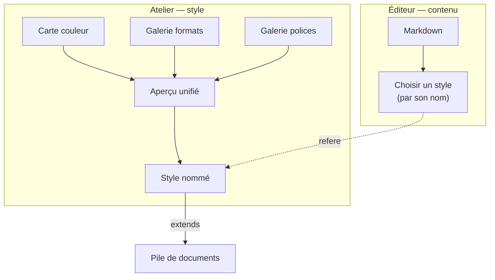

> **Statut :** **design exploratoire V1, non figé** — méthodo **pilotée par
> invariants** (I1–I7, §9), comme [STACK-SPEC](STACK-SPEC.md) /
> [VOLUMES-SPEC](VOLUMES-SPEC.md). **Compagnon** de
> [SETTINGS-SPEC](SETTINGS-SPEC.md) (qu'il remplace à terme côté UI),
> [STACK-SPEC](STACK-SPEC.md) (sérialisation) et [STYLE-SPEC](STYLE-SPEC.md).
> Rien n'est implémenté ; on **spécifie**. Cinq maquettes interactives
> accompagnent ce document (§ liens en fin). Implémentation partagée appli ↔
> extension VS Code via [`@orlarey/markpage-render`](../packages/markpage-render/).

**Objet :** remplacer le système de réglages actuel — jugé **trop complexe**, sa
double vue *Essentiel / Avancé* ne fonctionnant pas en termes d'UX — par un
**atelier de style** reposant sur **peu de primitives** et des **règles
algorithmiques**. Le résultat tient en une phrase :

> un **style** = une **carte de couleurs** × un choix de **galerie-formats** × un
> choix de **galerie-polices**.

::: toc+
- **Le problème** — pourquoi la double vision échoue, et le vrai axe de découpe.
- **Principe directeur** — deux surfaces, deux archétypes d'interaction.
- **Définition du style** — trois choix composables.
- **Axe couleur — la carte** — teinte, crans saturation × valeur, neutres, fonds.
- **Axe format — la galerie de documents** — gabarits, fixé vs ajustable.
- **Axe polices — la galerie de paires** — paires curées, taille de base.
- **L'atelier** — sélection partagée, aperçu unifié, nommage du style.
- **Sérialisation** — branchement sur la pile de documents.
- **Invariants** — I1–I7, le contrat.
- **À trancher / hors V1** — paramètres ouverts.
:::

---

## Le problème

Le système actuel fait ~3 700 lignes sur trois fichiers et empile **trois
modèles mentaux** pour la même chose :

| Couche | Nature | Coût cognitif |
| :-- | :-- | :-- |
| **Essentiel** | déclarer une *intention* (type + apparence + quelques dials) qui se **déploie** en réglages concrets | modèle sémantique, descendant |
| **Avancé** | un rail de ~15 rubriques réglant **chaque** bouton (h1–h4 séparément, code, citation, math…) | modèle impératif, exhaustif |
| **Provenance** | par-dessus : chaque champ affiche s'il vient du type, de l'apparence, ou s'il est *surchargé* (↶) | troisième couche |

Le décompte des degrés de liberté est le vrai coupable : **18 éléments × ~9
attributs ≈ 150 boutons individuels**. Régler `h1`, `h2`, `h3`, `h4` et le titre
*séparément*, c'est cinq décisions là où une échelle typographique en donnerait
une.

::: important [Le diagnostic central]
Le basculement *Essentiel ⇄ Avancé* échoue parce que **les deux vues n'ont pas
la même forme** : l'une parle intention, l'autre parle boutons. On perd le
contexte en passant de l'une à l'autre, et on ne sait jamais laquelle fait
autorité. Le mauvais axe de découpe était **simple / avancé**. Le bon axe est
**contenu / style**.
:::

---

## Principe directeur

### Deux surfaces, séparées par l'axe contenu / style

L'édition du **contenu** et la conception du **style** deviennent deux outils
distincts.

::: columns
**L'éditeur (contenu)**

On écrit du Markdown. Le seul contrôle de style est **un menu : choisir un style
par son nom**. Zéro bouton de style. Degrés de liberté côté rédaction : **1**.

---

**L'atelier (style)**

Un **contenu figé** (un spécimen montrant toutes les constructions). On **clique
un élément** pour régler ses propriétés en direct. Toute la richesse vit ici,
isolée, sur du contenu figé, utilisée de temps en temps.
:::

L'infrastructure existe déjà à moitié : un style **est** un document nommé
([STACK-SPEC](STACK-SPEC.md) — `extends: <nom>`), avec les commandes *Extraire un
style* / *Nouveau à partir de…*. « Choisir un style » = choisir ce qu'on
`extends`. C'est une **re-façade**, pas une réécriture.

### Deux archétypes d'interaction, pas un moule unique

Découverte structurante : la métaphore « carte + crans » n'est **la** bonne
réponse que pour la **couleur** — le seul axe vraiment *continu et relationnel*.
**Presque tout le reste se sert mieux d'une galerie** de choix raisonnables.

| Archétype | Pour | Pourquoi |
| :-- | :-- | :-- |
| **La carte** | couleur | espace continu : familles de tons, rotation de teinte, contraste géométrique |
| **La galerie** | format, polices | choix **discrets et corrélés** qu'on reconnaît d'un coup d'œil |

::: note
Ne pas forcer l'uniformité entre axes est *précisément* ce qui rend l'atelier
simple. Chaque axe réduit les degrés de liberté à sa manière : la couleur par
**regroupement**, les polices et le format par **choix dans un catalogue**, les
tailles (quand elles restent réglables) par **règle générative**.
:::

---

## Définition du style

::: definition [Style]
Un **style** est le triplet composable

$$\text{style} = (\text{couleur},\; \text{format},\; \text{polices})$$

où *couleur* est une configuration de la carte, *format* un choix dans la
galerie-documents, *polices* un choix dans la galerie-paires. Les trois se
choisissent **indépendamment** et se **combinent** dans un aperçu unique.
:::

L'architecture d'ensemble :



Le côté contenu prend **un** style par son nom ; ce nom **encapsule** les trois.
L'atelier est là où ce style se **compose** à partir des trois sélecteurs.

---

## Axe couleur — la carte

C'est le seul axe *carte*. Un **bac** fixe une **teinte** (hue) ; à l'intérieur,
un élément se pose sur un **cran** de la carte **saturation × valeur**.

### Crans, pas continuum

::: definition [Cran]
Une position **discrète et aimantée** dans un espace de réglage. La carte
couleur en présente une grille $C_{sat} \times C_{val}$ ; une icône d'élément
glissée **saute** de cran en cran, elle ne prend jamais une valeur libre.
:::

L'aimantation est ce qui empêche de rouvrir les 150 degrés de liberté sous une
forme spatiale : on ne fixe pas « saturation 34 % », on pose l'élément sur *le*
cran.

### Neutres et fonds

- Une **colonne de gris** (saturation 0, blanc → noir pur) borde la palette à
  gauche, **même largeur** que les colonnes teintées. Elle donne les **neutres
  purs** que la carte à teinte fixe ne peut pas produire (encre noire franche,
  filets gris, blanc pur). Un élément déposé là **ignore la teinte** et ne bouge
  plus quand on la fait tourner.
- Deux éléments sont des **fonds** : `page` et `cover`. Ils sont cerclés sur la
  carte. Tout texte doit **contraster** avec le fond sous lequel il s'affiche —
  et comme le contraste vient de l'axe **valeur** (vertical), il est
  **géométrique** : `page` en haut (clair), l'encre en bas (sombre).

### Coordination et couture

Faire tourner la teinte d'un bac fait **pivoter toute la famille** en gardant ses
écarts de saturation et de valeur. Les rapports survivent, la cohérence est
mécanique.

::: warning [La seule couture entre axes]
`cover` est le **point de contact** entre la carte-couleur et la galerie-formats :
la **galerie** décide *s'il y a* une couverture, la **carte** décide *de sa
couleur*. C'est la seule entorse à l'orthogonalité des trois axes ; on la
**nomme** plutôt que de prétendre à l'étanchéité totale.
:::

Éléments portés par la carte (V1) :

```adt
Fond    ::= page | cover
Texte   ::= titre | h1 | h2 | h3 | h4
          | corps | notes | légende | code | en-tête
Couleur ::= Teinté(sat, val)      (* sur la palette, suit la teinte *)
          | Neutre(val)           (* colonne de gris, hors teinte *)
```

---

## Axe format — la galerie de documents

Le format de page n'est **pas** un espace de réglages fins : c'est un choix
**structurel** (couverture, recto-verso, canon, marges, folio…) dont les
décisions vont **ensemble** et dessinent un *genre de document*. Une **galerie
de vignettes** — on reconnaît la forme d'un coup d'œil — remplace les cases à
cocher. Ces gabarits **sont** les types de document markpage.

### Fixé par le gabarit vs ajustable

::: important [La ligne de partage]
La quasi-totalité du format vient **avec le gabarit** et n'est **jamais** réglée
à la main. Ne restent ajustables que les points **circonstanciels et
portables**.
:::

| Fixé par le gabarit (= le type) | Ajustable (portable / circonstanciel) |
| :-- | :-- |
| recto-verso, canon, marges & miroir, bandes en-tête / pied, folio, sauts de chapitre | **taille physique** (A4 / Letter / A5 / B5) |
| | **couverture** on/off (sauf lettre, déduite du contenu) |

Régler *canon ou pas* ou *les marges header/footer* à la main rouvrirait le piège
des 150 boutons sur l'axe le moins fait pour ça : le canon **dérive** ces valeurs
(voir [SETTINGS-SPEC](SETTINGS-SPEC.md), mode *derived*). Le gabarit les fixe.

### Les gabarits (V1)

| Gabarit | Recto-verso | Canon | En-tête | Folio | Couverture |
| :-- | :-: | :-: | :-: | :-- | :-: |
| Note technique | — | — | ✓ | centré | — |
| Rapport | — | ✓ | — | centré | ✓ |
| Article | — | ✓ | — | centré | — |
| Livre | ✓ | ✓ | ✓ | extérieur | ✓ |
| Lettre | — | — | — | — | — (verrouillé) |
| Diapos | — | — | — | — | — (16:9) |

La **couverture de la lettre** est verrouillée à *non* : son émetteur est dans le
bloc `sender` (voir [AI-AUTHORING](../AI-AUTHORING.md), *Letterhead*) — une
couverture la répéterait. Décision **déduite du contenu**, pas offerte comme
réglage.

---

## Axe polices — la galerie de paires

Choisir une police est un choix **discret et corrélé** : la paire
**titres / corps / code** va ensemble et porte un caractère. On la reconnaît en
la **lisant** — pas en composant une échelle. Donc une **galerie**, où chaque
carte est un **mini-spécimen** dans ses vraies polices.

::: important [Pas de carte taille × graisse]
Une première piste — une carte 2D où l'on pré-positionne les rôles par une règle
générative (taille = ancre × ratio^niveau) — a été **écartée** : elle demande à
l'utilisateur de *composer une échelle typographique*, un travail de designer que
la galerie lui épargne. **L'échelle (ratio) et les graisses sont bakées dans
chaque paire.**
:::

Il ne reste **qu'une poignée globale** : la **taille de base** (le corps). Titres,
notes, code en découlent par le ratio de la paire.

### Paires (V1, indicatives)

| Paire | Titres | Corps | Caractère |
| :-- | :-- | :-- | :-- |
| Moderne | sans | sans | humaniste, neutre |
| Classique | serif | serif | serif de livre, sobre |
| Éditorial | grotesque | serif | titres tranchés, corps lisible |
| Élégant | serif ancienne | serif ancienne | raffiné |
| Technique | condensé | sans | dense, façon rapport |
| Contraste | grotesque | serif ancienne | fort écart titre / corps |

::: caution [Dépendance polices]
Les vraies paires supposent des fontes **disponibles**. markpage embarque déjà
Roboto Condensed / Mono ; pour des paires curées (Palatino, une didone…) il
faudra trancher **quoi bundler vs charger** — recoupe la feuille de route
*catalogue de polices*. Une paire ne doit jamais retomber silencieusement sur un
générique en production.
:::

---

## L'atelier

L'atelier réunit les trois sélecteurs sur le **même document figé**, reliés par
deux mécanismes :

Sélection partagée
:   Cliquer un élément sur **une** carte le met en évidence sur les autres et
    affiche sa fiche complète (couleur, police, taille). C'est la **colle** qui
    fait d'un tas de sélecteurs un atelier cohérent — toute carte future
    (espacement, blocs) s'y branche pareil.

Aperçu unifié
:   Un seul aperçu applique **les trois axes d'un coup** : couverture colorée si
    le format en a une, polices de la paire à la taille de base, couleurs de la
    carte, mobilier de page (bande d'en-tête, folio) selon le gabarit. Un bandeau
    en pied **nomme** le style résultant (« *Rapport · Classique · 10,5 pt ·
    teinte 213° · avec couverture* »).

Présentation retenue : **trois onglets** (Format / Polices / Couleur) et un
aperçu **persistant** à droite.

---

## Sérialisation

Un style se **sérialise proprement** sur le modèle de la pile
([STACK-SPEC](STACK-SPEC.md)) : un document-style porte, en clés de front-matter
ou dérivées,

```yaml
document-type: report        # choix galerie-formats
page-size: A4                # ajustable circonstanciel
cover: true                  # ajustable circonstanciel
font-pair: classique         # choix galerie-polices
font-base: 10.5              # la poignée globale
color-hue: 213               # bac (teinte)
# + la table des crans par élément (couleur), forme à figer
```

Un document contenu fait `extends: <ce-style>` ; l'aplatissement
([STACK-SPEC](STACK-SPEC.md), moteur `extends` + `insert`) produit le `.md`
autonome rendu *in fine*. Les clés existantes (`page-size`, `margins`, `font-*`,
[FRONTMATTER-SPEC](FRONTMATTER-SPEC.md)) restent le vocabulaire ; ce qui manque
(la table des crans couleur, la paire, l'ancre) est à **ajouter au vocabulaire de
la pile** — c'est le vrai travail d'intégration.

::: warning [Le piège de dérivation, déjà rencontré]
Les réglages sont dérivés au rendu d'un **patch de pile**, pas du type de
document en direct. Le `document-type` est développé en clés concrètes **à
l'écriture**. Ajouter un drapeau au modèle d'un type **ne l'atteint pas** au
rendu — il faut l'inscrire au vocabulaire de la pile. Vérifié à la sonde lors du
correctif « lettre sans couverture ».
:::

---

## Invariants

Le contrat que toute implémentation doit préserver.

I1 — **Style = (couleur, format, polices)**
:   Trois choix composables et indépendants ; leur combinaison, plus rien
    d'autre, définit le style.

I2 — **Deux archétypes seulement**
:   La *carte* pour la couleur ; la *galerie* pour le format et les polices. Pas
    de troisième métaphore, pas d'uniformisation forcée.

I3 — **Aimantation, jamais de valeur libre par élément**
:   Sur la carte, une icône saute de cran en cran. Aucune saisie de valeur
    continue par élément dans le flux courant.

I4 — **Le gabarit fixe le genre ; seul le circonstanciel est ajustable**
:   Recto-verso, canon, marges, bandes, folio viennent avec le gabarit. Taille
    physique et couverture sont les seules exceptions ajustables.

I5 — **`page` et `cover` sont les fonds ; tout texte contraste**
:   Le contraste est géométrique (axe valeur). Un titre de couverture
    auto-contraste avec sa couverture.

I6 — **Un style est sérialisable et se branche sur la pile**
:   Il s'exprime en front-matter / clés de pile et se rend via `extends` +
    aplatissement. Aucun style ne vit uniquement dans l'appli.

I7 — **Côté rédaction, un seul degré de liberté**
:   Choisir un style par son nom. Toute la richesse est dans l'atelier, jamais
    dans l'éditeur de contenu.

---

## À trancher / hors V1

- **Nombre de crans** de la carte couleur ($C_{sat}$, $C_{val}$, pas de gris) —
  paramètre de spec, pas une vérité des maquettes. Trop de crans rouvre les
  degrés de liberté ; trop peu étouffe.
- **Nombre de bacs couleur** : un seul (teinte) + les neutres suffit-il presque
  toujours, ou faut-il un **second bac** pour un accent tranché ? Les maquettes
  n'en montrent qu'un.
- **Vocabulaire de pile** pour la table des crans couleur, la paire, l'ancre — la
  forme exacte à figer (recoupe [STACK-SPEC](STACK-SPEC.md) et
  [FRONTMATTER-SPEC](FRONTMATTER-SPEC.md)).
- **Catalogue de polices** : quoi bundler vs charger (feuille de route
  *catalogue de polices*).
- **Échappatoire fine** : la fiche d'élément de l'atelier est le lieu naturel
  pour saisir une valeur exacte sur un cas récalcitrant, **sans** polluer les
  cartes — à spécifier si le besoin se confirme.
- **Autres axes possibles** en galeries (espacement / densité, habillage des
  blocs) — à dérouler après V1 s'ils se justifient.

---

## Maquettes de référence

Cinq prototypes interactifs matérialisent cette spec :

- **Carte couleur** (teinte, crans, neutres, `page` + `cover`) —
  <https://claude.ai/code/artifact/f5cfa593-c49a-4218-89d9-92a5404433ca>
- **Galerie de formats** —
  <https://claude.ai/code/artifact/130ee92b-59ae-41b2-bae9-d060d4f64583>
- **Galerie de polices** —
  <https://claude.ai/code/artifact/ba08606f-7622-4e1e-ad95-b6cbbf884d80>
- **Atelier complet** (les trois axes + aperçu unifié) —
  <https://claude.ai/code/artifact/fdf65c95-d2fd-42c7-a30f-554e9e3c80b3>
