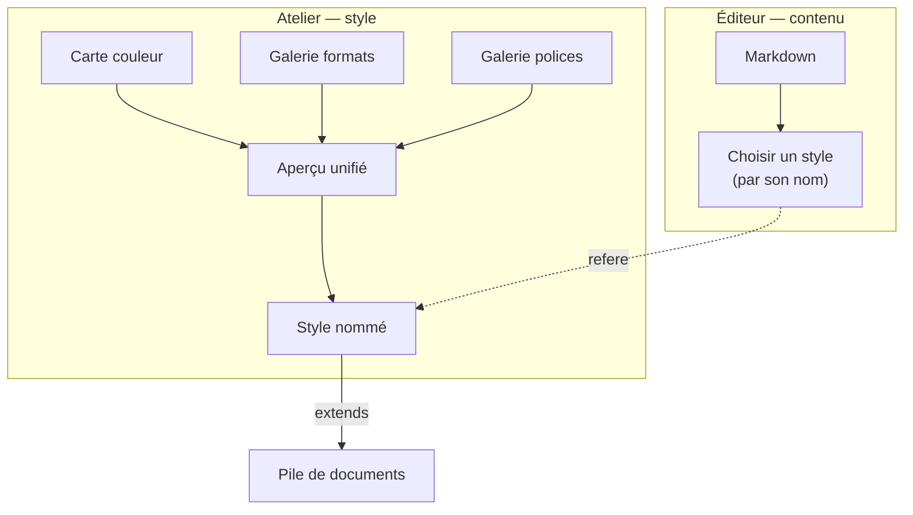

> **Statut :** **design exploratoire V1, non figé** — méthodo **pilotée par
> invariants** (I1–I7, §9), comme [STACK-SPEC](STACK-SPEC.md) /
> [VOLUMES-SPEC](VOLUMES-SPEC.md). **Compagnon** de
> [SETTINGS-SPEC](SETTINGS-SPEC.md) (qu'il remplace à terme côté UI),
> [STACK-SPEC](STACK-SPEC.md) (sérialisation) et [STYLE-SPEC](STYLE-SPEC.md).
> Rien n'est implémenté ; on **spécifie**. Implémentation partagée appli ↔
> extension VS Code via [`@orlarey/markpage-render`](../packages/markpage-render/).
>
> **v0.2** affine le principe directeur — « règles algorithmiques » devient
> **règles génératrices** — et consigne les évolutions issues de **trois nouvelles
> maquettes interactives** (couleur / polices / pages), voir *Évolutions depuis
> les maquettes*.
>
> **v0.3** introduit un **quatrième axe — l'appareil courant** (composition des
> *running materials* en en-tête / pied) et son instrument, et consigne
> l'unification des quatre facettes dans une **maquette unique et versionnée**
> (`prototypes/editeur-style.html`), voir *Axe appareil* et *Vers un seul outil*.
>
> **v0.4** consigne l'**identité de style** (nom / auteur / version / date) et les
> **deux formats de fichier** — *source* ré-éditable vs *compilé* distribuable — qui
> font de l'éditeur un outil **déployable** pour designers. L'architecture de
> compilation faisant foi est dans [STYLE-ALIGNMENT](STYLE-ALIGNMENT.md) ; voir
> *Identité & distribution*. La section *Sérialisation* (modèle front-matter
> `document-type`/`color-crans`/`extends`) est **caduque** — supplantée par ce
> modèle « source → compilateur → artefact plat ».

**Objet :** remplacer le système de réglages actuel — jugé **trop complexe**, sa
double vue *Essentiel / Avancé* ne fonctionnant pas en termes d'UX — par un
**atelier de style** reposant sur **peu de primitives** et des **règles
génératrices**. Le résultat tient en une phrase :

> un **style** = une **carte de couleurs** × un choix de **galerie-formats** × un
> choix de **galerie-polices**.

::: toc+
- **Le problème** — pourquoi la double vision échoue, et le vrai axe de découpe.
- **Principe directeur** — deux surfaces, deux archétypes d'interaction.
- **Définition du style** — trois choix composables.
- **Axe couleur — la carte** — teinte, crans saturation × valeur, neutres, fonds.
- **Axe format — la galerie de documents** — gabarits, fixé vs ajustable.
- **Axe polices — la galerie de paires** — paires curées, taille de base.
- **Axe appareil — l'appareil courant** — running materials, zones, pile → séquence, miroir.
- **L'atelier** — sélection partagée, aperçu unifié, nommage du style, identité & distribution.
- **Évolutions depuis les maquettes** — le principe unifiant et ce qui a bougé depuis la v0.1.
- **Sérialisation** — branchement sur la pile de documents.
- **Invariants** — I1–I7, le contrat.
- **À trancher / hors V1** — paramètres ouverts.
:::

---

## Le problème

Le système actuel fait ~3 700 lignes sur trois fichiers et empile **trois
modèles mentaux** pour la même chose :

| Couche | Nature | Coût cognitif |
| :-- | :-- | :-- |
| **Essentiel** | déclarer une *intention* (type + apparence + quelques dials) qui se **déploie** en réglages concrets | modèle sémantique, descendant |
| **Avancé** | un rail de ~15 rubriques réglant **chaque** bouton (h1–h4 séparément, code, citation, math…) | modèle impératif, exhaustif |
| **Provenance** | par-dessus : chaque champ affiche s'il vient du type, de l'apparence, ou s'il est *surchargé* (↶) | troisième couche |

Le décompte des degrés de liberté est le vrai coupable : **18 éléments × ~9
attributs ≈ 150 boutons individuels**. Régler `h1`, `h2`, `h3`, `h4` et le titre
*séparément*, c'est cinq décisions là où une échelle typographique en donnerait
une.

::: important [Le diagnostic central]
Le basculement *Essentiel ⇄ Avancé* échoue parce que **les deux vues n'ont pas
la même forme** : l'une parle intention, l'autre parle boutons. On perd le
contexte en passant de l'une à l'autre, et on ne sait jamais laquelle fait
autorité. Le mauvais axe de découpe était **simple / avancé**. Le bon axe est
**contenu / style**.
:::

---

## Principe directeur

### Deux surfaces, séparées par l'axe contenu / style

L'édition du **contenu** et la conception du **style** deviennent deux outils
distincts.

::: columns
**L'éditeur (contenu)**

On écrit du Markdown. Le seul contrôle de style est **un menu : choisir un style
par son nom**. Zéro bouton de style. Degrés de liberté côté rédaction : **1**.

---

**L'atelier (style)**

Un **contenu figé** (un spécimen montrant toutes les constructions). On **clique
un élément** pour régler ses propriétés en direct. Toute la richesse vit ici,
isolée, sur du contenu figé, utilisée de temps en temps.
:::

L'infrastructure existe déjà à moitié : un style **est** un document nommé
([STACK-SPEC](STACK-SPEC.md) — `extends: <nom>`), avec les commandes *Extraire un
style* / *Nouveau à partir de…*. « Choisir un style » = choisir ce qu'on
`extends`. C'est une **re-façade**, pas une réécriture.

### Deux archétypes d'interaction, pas un moule unique

Découverte structurante : la métaphore « carte + crans » n'est **la** bonne
réponse que pour la **couleur** — le seul axe vraiment *continu et relationnel*.
**Presque tout le reste se sert mieux d'une galerie** de choix raisonnables.

| Archétype | Pour | Pourquoi |
| :-- | :-- | :-- |
| **La carte** | couleur | espace continu : familles de tons, rotation de teinte, contraste géométrique |
| **La galerie** | format, polices | choix **discrets et corrélés** qu'on reconnaît d'un coup d'œil |

::: note
Ne pas forcer l'uniformité entre axes est *précisément* ce qui rend l'atelier
simple. Chaque axe réduit les degrés de liberté à sa manière : la couleur par
**regroupement**, les polices et le format par **choix dans un catalogue**, les
tailles (quand elles restent réglables) par **règle générative**.
:::

### Le principe unifiant : la règle génératrice et ses exceptions

Les maquettes (v0.2) ont fait émerger, **sous** les deux archétypes, un principe
plus profond et **commun aux trois familles** — c'est lui qu'on retient.

::: important [Règle génératrice + spécificités locales]
Chaque famille se **scinde en deux**, disposées sur **deux panneaux** :

- **à gauche, une règle *génératrice*** (globale, abstraite) qui **engendre toute
  une famille de valeurs coordonnées** à partir de très peu de paramètres, avec un
  **invariant de coordination** ;
- **à droite, l'objet concret**, rendu vivant : les **spécificités locales** (les
  exceptions posées élément par élément) **et l'aperçu**.
:::

C'est ce qui **dompte** les ~150 degrés de liberté : on ne règle pas 150 boutons,
on règle **une règle** et quelques **exceptions relatives** à cette règle.

| Famille | Règle génératrice (gauche) | Spécificités locales (droite) |
| :-- | :-- | :-- |
| **Couleur** | une **teinte** maîtresse → toute la famille se dérive ; une **famille B** en découle par un **angle d'harmonie** | le **cran** de chaque élément (sat × val, ou neutre) et sa **famille** A/B |
| **Typographie** | une **base** + un **ratio** aimanté → l'échelle modulaire ($\text{taille} = \text{base} \cdot \text{ratio}^{\text{cran}}$) | le **cran** surchargé d'un élément, son **alignement**, filet, petites capitales |
| **Pages** | le **canon de Van de Graaf** → les marges (ses **diagonales** en repère) | chaque **trait** tiré librement hors canon, le bloc de texte déplacé |

« Carte » et « galerie » de la v0.1 ne sont plus deux archétypes concurrents mais
**deux mises en œuvre** du même schéma : la carte couleur *est* une règle
génératrice (la teinte) avec ses crans (les exceptions) ; les galeries étaient une
règle génératrice **figée dans un preset**. La v0.2 **ré-ouvre** la règle à
l'édition directe (échelle typo, marges) tout en gardant le preset comme point de
départ. Cette relecture **affine l'invariant I2** (voir *Évolutions*).

---

## Définition du style

::: definition [Style]
Un **style** est le triplet composable

$$\text{style} = (\text{couleur},\; \text{format},\; \text{polices})$$

où *couleur* est une configuration de la carte, *format* un choix dans la
galerie-documents, *polices* un choix dans la galerie-paires. Les trois se
choisissent **indépendamment** et se **combinent** dans un aperçu unique.
:::

L'architecture d'ensemble :



Le côté contenu prend **un** style par son nom ; ce nom **encapsule** les trois.
L'atelier est là où ce style se **compose** à partir des trois sélecteurs.

---

## Axe couleur — la carte

C'est le seul axe *carte*. Un **bac** fixe une **teinte** (hue) ; à l'intérieur,
un élément se pose sur un **cran** de la carte **saturation × valeur**.

### Crans, pas continuum

::: definition [Cran]
Une position **discrète et aimantée** dans un espace de réglage. La carte
couleur en présente une grille **6 × 6** (saturation × valeur) **plus une
colonne de neutres** ; une icône d'élément glissée **saute** de cran en cran,
elle ne prend jamais une valeur libre.
:::

La taille **6 × 6 + gris** est **figée** (I3) : assez de nuances pour une famille
riche, assez peu pour ne pas rouvrir les degrés de liberté.

L'aimantation est ce qui empêche de rouvrir les 150 degrés de liberté sous une
forme spatiale : on ne fixe pas « saturation 34 % », on pose l'élément sur *le*
cran.

### Neutres et fonds

- Une **colonne de gris** (saturation 0, blanc → noir pur) borde la palette à
  gauche, **même largeur** que les colonnes teintées. Elle donne les **neutres
  purs** que la carte à teinte fixe ne peut pas produire (encre noire franche,
  filets gris, blanc pur). Un élément déposé là **ignore la teinte** et ne bouge
  plus quand on la fait tourner.
- Deux éléments sont des **fonds** : `page` et `cover`. Ils sont cerclés sur la
  carte. Tout texte doit **contraster** avec le fond sous lequel il s'affiche —
  et comme le contraste vient de l'axe **valeur** (vertical), il est
  **géométrique** : `page` en haut (clair), l'encre en bas (sombre).

### Coordination et couture

Faire tourner la teinte d'un bac fait **pivoter toute la famille** en gardant ses
écarts de saturation et de valeur. Les rapports survivent, la cohérence est
mécanique.

::: warning [La seule couture entre axes]
`cover` est le **point de contact** entre la carte-couleur et la galerie-formats :
la **galerie** décide *s'il y a* une couverture, la **carte** décide *de sa
couleur*. C'est la seule entorse à l'orthogonalité des trois axes ; on la
**nomme** plutôt que de prétendre à l'étanchéité totale.
:::

Éléments portés par la carte (V1) :

```adt
Fond    ::= page | cover
Texte   ::= titre | h1 | h2 | h3 | h4
          | corps | notes | légende | code | en-tête
Couleur ::= Teinté(sat, val)      (* sur la palette, suit la teinte *)
          | Neutre(val)           (* colonne de gris, hors teinte *)
```

---

## Axe format — la galerie de documents

Le format de page n'est **pas** un espace de réglages fins : c'est un choix
**structurel** (couverture, recto-verso, canon, marges, folio…) dont les
décisions vont **ensemble** et dessinent un *genre de document*. Une **galerie
de vignettes** — on reconnaît la forme d'un coup d'œil — remplace les cases à
cocher. Ces gabarits **sont** les types de document markpage.

### Fixé par le gabarit vs ajustable

::: important [La ligne de partage]
La quasi-totalité du format vient **avec le gabarit** et n'est **jamais** réglée
à la main. Ne restent ajustables que les points **circonstanciels et
portables**.
:::

| Fixé par le gabarit (= le type) | Ajustable (portable / circonstanciel) |
| :-- | :-- |
| recto-verso, canon, marges & miroir, bandes en-tête / pied, folio, sauts de chapitre | **taille physique** (A4 / Letter / A5 / B5) |
| | **couverture** on/off (sauf lettre, déduite du contenu) |

Régler *canon ou pas* ou *les marges header/footer* à la main rouvrirait le piège
des 150 boutons sur l'axe le moins fait pour ça : le canon **dérive** ces valeurs
(voir [SETTINGS-SPEC](SETTINGS-SPEC.md), mode *derived*). Le gabarit les fixe.

### Les gabarits (V1)

| Gabarit | Recto-verso | Canon | En-tête | Folio | Couverture |
| :-- | :-: | :-: | :-: | :-- | :-: |
| Note technique | — | — | ✓ | centré | — |
| Rapport | — | ✓ | — | centré | ✓ |
| Article | — | ✓ | — | centré | — |
| Livre | ✓ | ✓ | ✓ | extérieur | ✓ |
| Lettre | — | — | — | — | — (verrouillé) |
| Diapos | — | — | — | — | — (16:9) |

La **couverture de la lettre** est verrouillée à *non* : son émetteur est dans le
bloc `sender` (voir [AI-AUTHORING](../AI-AUTHORING.md), *Letterhead*) — une
couverture la répéterait. Décision **déduite du contenu**, pas offerte comme
réglage.

---

## Axe polices — la galerie de paires

Choisir une police est un choix **discret et corrélé** : la paire
**titres / corps / code** va ensemble et porte un caractère. On la reconnaît en
la **lisant** — pas en composant une échelle. Donc une **galerie**, où chaque
carte est un **mini-spécimen** dans ses vraies polices.

::: important [Pas de carte taille × graisse]
Une première piste — une carte 2D où l'on pré-positionne les rôles par une règle
générative (taille = ancre × ratio^niveau) — a été **écartée** : elle demande à
l'utilisateur de *composer une échelle typographique*, un travail de designer que
la galerie lui épargne. **L'échelle (ratio) et les graisses sont bakées dans
chaque paire.**
:::

Il ne reste **qu'une poignée globale** : la **taille de base** (le corps). Titres,
notes, code en découlent par le ratio de la paire.

### Paires (V1, indicatives)

Une paire fixe **quatre rôles** : titres, corps, code (toujours monospace), et
**maths** (voir ci-dessous). La colonne *Maths* nomme le jeu de fontes MathJax
qui **s'harmonise** avec le texte.

| Paire | Titres | Corps | Maths | Caractère |
| :-- | :-- | :-- | :-- | :-- |
| Moderne | sans | sans | Fira Math | humaniste, neutre |
| Classique | serif | serif | New CM | serif de livre, sobre |
| Éditorial | grotesque | serif | STIX Two | titres tranchés, corps lisible |
| Élégant | serif ancienne | serif ancienne | New CM | raffiné |
| Technique | condensé | sans | Fira Math | dense, façon rapport |
| Contraste | grotesque | serif ancienne | STIX Two | fort écart titre / corps |

### La police mathématique

Les maths (MathJax) sont un **quatrième rôle** de la paire, **pas** un axe à part
ni un réglage exposé : elle doit **s'accorder** au texte — un corps serif appelle
des maths serif (New CM, STIX Two), un corps sans appelle des maths sans (Fira
Math). Le rôle *maths* est donc **baké dans la paire**, comme l'échelle et les
graisses. Jeux MathJax candidats : **New CM**, **Fira Math**, **STIX Two**,
**Asana**, **TeX**.

La **seule poignée** propre aux maths est `mathScale` — le corps des formules
**relatif** au corps du texte — qui **existe déjà** dans markpage (les maths
paraissent souvent trop petites ou trop grosses selon la fonte). Elle vit à côté
de la taille de base.

::: caution [Dépendances fontes — texte ET maths]
Deux limites à porter en implémentation. **(1) Texte :** les paires supposent des
fontes **disponibles** ; markpage embarque déjà Roboto Condensed / Mono, mais
des paires curées (Palatino, une didone…) posent la question **bundler vs
charger** (feuille de route *catalogue de polices*). Une paire ne doit jamais
retomber silencieusement sur un générique en production. **(2) Maths :** le
**sélecteur de jeu de fontes MathJax** était différé en attendant la stabilité de
`mathjax-full@4` (seul `mathScale` a été livré). V1 pourra donc n'harmoniser que
sur un **sous-ensemble** disponible, quitte à compléter quand v4 se stabilise.
:::

---

## Axe appareil — l'appareil courant

Le **mobilier de page répété** — titre courant, folio, chapitre, section… posé
dans les bandes en-tête / pied — est un axe **de composition** à part entière.
Trois axes le touchent, chacun répondant à une question distincte :

| Axe | Question | Ce qu'il fixe |
| :-- | :-- | :-- |
| **Pages** *(format)* | **où ?** | la **géométrie** : bandes (`headerTop` / `footerBottom`), aire courante (`runInner` / `runOuter`) |
| **Polices** | **à quoi ça ressemble ?** | le **style** du rôle `running-content` (fonte, cran, filet, PC) |
| **Appareil** | **quoi ?** | la **composition** — quels matériaux, dans quelle zone, sur quelle page |

::: definition [Appareil courant]
La table `{ bande × parité × zone → pile de matériaux }` qui décide **ce qui
apparaît** dans chaque emplacement de marge. Douze emplacements : **2 bandes**
(en-tête / pied) × **2 parités** (verso / recto) × **3 zones structurelles**
(inner / center / outer). Ce n'est pas un gadget : il se compile **1:1** sur les
*margin boxes* CSS Paged Media (`@top-left/center/right`, `@bottom-*`), chaque
matériau devenant une valeur `content` (`counter(page)`, `string(...)`, littéral).
:::

### Règle génératrice (gauche) + composition directe (droite)

Fidèle au principe unifiant :

- **à gauche**, la **règle génératrice** : des **presets d'appareil** (styles
  prédéfinis — *Vierge*, *Savant*, *Folio en pied*, *Titres en tête*, *Bords*)
  qui composent l'ensemble d'un clic, plus le champ de **texte libre** (le contenu
  du jeton `texte`) ;
- **à droite**, l'**instrument** = la double-page schématique où vivent les
  décisions locales. Les **12 zones** sont des cibles de *drop* ; à côté, une
  **réserve** de jetons glissables. On **glisse** réserve → zone (placer),
  zone → zone (déplacer), zone → dehors (retirer), avec **insertion positionnelle**
  dans la pile (le niveau de lâcher choisit le rang).

Matériaux de la réserve (V1) — le **folio arabe** et le **folio romain** sont
**deux jetons distincts** (plus de menu de numérotation) :

```adt
Matériau ::= folio | folioRomain | titreDoc | chapitre
           | section | auteur | date | texte
Zone     ::= [ Matériau ]          (* une PILE, ordonnée *)
Appareil ::= { bande × parité × zone → Zone }
```

### Paire verso / recto explicite

Verso et recto se composent **indépendamment** (listes séparées) — c'est ce qui
permet le classique *titre du livre en verso, titre de chapitre en recto*. La
**position** couture / bord, elle, est en **miroir automatique** : `inner` colle
toujours à la couture, `outer` au bord extérieur ; sur un verso, les zones
physiques gauche / droite s'échangent.

### Pile (édition) → séquence (page), inversée en verso

::: important [Le miroir de l'appareil]
Une zone est une **pile verticale** dans l'éditeur — facile à réordonner, **haut =
côté couture, bas = côté bord**. Sur la **page**, cette pile se rend **en ligne**
(séquence horizontale, séparateur `·`). Le miroir d'une double-page étant une
réflexion **gauche ↔ droite** autour de la couture, la séquence est **inversée en
verso** : `[chapitre, folio]` donne « chapitre · folio » en recto (zone droite) et
« folio · chapitre » en verso (zone gauche) — sur les deux pages, le chapitre reste
près de la couture, le folio près du bord. Empiler *verticalement* la pile en verso
**romprait** le miroir ; le rendre *en ligne inversée* le **maintient**.
:::

Les bandes sont **ancrées sur la géométrie de page** (`headerTop` / `footerBottom`,
aire `runInner` / `runOuter`), **pas** dans le bloc de texte : une bande s'affiche
dès qu'une de ses zones est non vide (aucune case en-tête / pied à cocher).

---

## L'atelier

L'atelier réunit les trois sélecteurs sur le **même document figé**, reliés par
deux mécanismes :

Sélection partagée
:   Cliquer un élément sur **une** carte le met en évidence sur les autres et
    affiche sa fiche complète (couleur, police, taille). C'est la **colle** qui
    fait d'un tas de sélecteurs un atelier cohérent — toute carte future
    (espacement, blocs) s'y branche pareil.

Aperçu unifié
:   Un seul aperçu applique **les trois axes d'un coup** : couverture colorée si
    le format en a une, polices de la paire à la taille de base, couleurs de la
    carte, mobilier de page (bande d'en-tête, folio) selon le gabarit. Un bandeau
    en pied **nomme** le style résultant (« *Rapport · Classique · 10,5 pt ·
    teinte 213° · avec couverture* »).

Présentation retenue : **trois onglets** (Format / Polices / Couleur) et un
aperçu **persistant** à droite.

### Identité & distribution

Dès lors que des designers **produisent et diffusent** des styles, un style porte
une **identité** éditable dans l'en-tête de l'atelier : **nom**, **auteur**,
**version**, **date**. Ces champs décrivent le style, pas son rendu (voir
[STYLE-ALIGNMENT](STYLE-ALIGNMENT.md) — *Identité du style et distribution*).

L'atelier expose **deux formats de fichier**, reflet direct de la compilation à
sens unique :

Source — *ré-éditable*
:   `<slug>.mpstyle-src.json`. Sérialise l'**état génératif entier** de l'éditeur.
    Le designer le **garde** et le **rouvre** (*Ouvrir…*) pour continuer à éditer.
    C'est le **master**.

Compilé — *distribuable*
:   `<slug>.mpstyle.json`. Le `FUNDAMENTAL_STYLE` **plat** de markpage, tout
    résolu. C'est ce qu'on **importe dans markpage** ; il ne se **rouvre pas**
    comme éditable (compilation lossy à l'envers).

Le nom de fichier **dérive du nom** du style (slug, accents dépliés) — fini le code
opaque. L'**attribution** (`author`/`version`/`date`) voyage dans le conteneur du
compilé, relue et conservée par markpage ; la préservation **intégrale** passe par
le format source. Principe : **diffuser l'artefact, garder la source.**

---

## Évolutions depuis les maquettes

Trois maquettes interactives autonomes ont été construites — **couleur**,
**polices**, **pages** (`prototypes/editeur-{couleurs,polices,pages}.html`,
servies en local). Elles ont validé le principe unifiant (§*Principe directeur*)
et fait bouger plusieurs décisions de la v0.1.

::: note [Terminologie]
« Règles **algorithmiques** » devient « règles **génératrices** » : le mot dit
mieux qu'une règle-maîtresse *engendre* une famille entière avec un invariant de
coordination, et que les réglages fins en sont des *exceptions relatives*.
:::

Ce qui a bougé (⟳ = revient sur une décision v0.1) :

⟳ Échelle typographique ré-ouverte
:   §*Polices* avait **écarté** la « carte taille × graisse » au profit d'une
    galerie de paires. La maquette la **ré-introduit, interactive** : on part
    d'une paire (familles + ratio + maths), puis on **surcharge** chaque rôle et
    on **règle l'échelle** — ratio **aimanté** sur les ratios nommés (tierce,
    quarte, quinte, nombre d'or…), **crans réglables** par élément. La paire reste
    le **point de départ**, plus l'unique choix.

⟳ Marges directement éditables
:   §*Format* posait « marges **jamais** réglées à la main ». L'éditeur de pages
    les rend **glissables** : double-page permanente, **diagonales du canon en
    repère** (le canon *guide*, ne *verrouille* pas), poignées **hors page** pour
    ne pas masquer les intersections, bloc de texte déplaçable. Les gabarits
    restent des **presets** de départ.

⟳ Deuxième famille de teinte
:   §*Tranché* disait « un seul bac ». La maquette ajoute une **famille B
    relative** : $H_2 = H_1 + \text{angle}$ (analogue +30°, triadique +120°,
    split-complémentaire +150°, complémentaire +180°, + réglage fin). $H_1$ reste
    **maître** — le tourner pivote les deux familles, l'angle re-choisit leur
    rapport. Chaque élément choisit sa famille (A/B) ; les **neutres** restent
    partagés, hors teinte.

Roster unifié (noms anglais)
:   Les trois familles partagent **la même liste d'éléments**. Tous ne portent pas
    tous les axes (table ci-dessous).

`math` reçoit une couleur
:   Comme `code`, `math` devient un élément **à double axe** : une **couleur** *et*
    une **échelle × corps** (jugée en ligne dans un paragraphe de corps). Les
    surfaces `page` / `cover` restent **couleur seule**.

Alignement ≠ justification
:   L'ancienne puce « justification » (G/C/D/**J**) des titres devient
    **alignement** (G/C/D) — « justifié » n'a pas de sens sur un titre. La
    **justification** (remplir les deux bords) est une propriété des
    **paragraphes / corps**, distincte.

`running-content` : alignement structurel
:   L'en-tête / pied n'a **pas** d'alignement libre — ses **trois zones** (inner /
    center / outer) sont *spine-aware* : inner = gauche, center = centre, outer =
    droite (miroir en verso). Il garde couleur, taille (cran d'apparat), filet et
    petites capitales.

Appareil courant — nouvelle facette (4ᵉ axe)
:   La **composition** des *running materials* devient un axe propre
    (§*Axe appareil*), à côté de couleur / polices / pages. Il **complète** le rôle
    `running-content` : Polices en règle le *style*, **Appareil** en règle le
    *contenu* (quels matériaux, quelle zone, quelle page). Zones = **piles** ;
    pile (éditeur) → **séquence en ligne inversée en verso** (miroir) ; folio arabe
    et romain en **deux jetons**.

`cover` = style seul dans l'éditeur
:   La **présence** d'une couverture et son **contenu** relèvent de la **mise en
    page**, pas de l'éditeur de style : les cases « document avec couverture » /
    « bloc métadonnées » en ont été **retirées**. Ne restent, côté style, que le
    **zoom** et l'**alignement** du bloc de couverture. *(Discipline de tri :
    règle ? spécificité ? — sinon, hors de l'outil.)*

### Le roster unifié et ses axes

Chaque élément ne porte pas forcément les trois axes — `couleur` (cran + famille),
`taille` (cran modulaire **ou** échelle × corps), `détails` (alignement · filet ·
petites capitales) :

| élément | couleur | taille | détails |
| :-- | :-: | :-: | :-- |
| `page` *(surface)* | ✓ | — | — |
| `cover` *(surface)* | ✓ | — | — |
| `running-content` | ✓ | cran | filet · PC · **alignement structurel** |
| `title` · `subtitle` | ✓ | cran | alignement · filet · PC |
| `h1` · `h2` · `h3` · `h4` | ✓ | cran | alignement · filet · PC |
| `body` | ✓ | cran *(ancre)* | **justification** (du paragraphe) |
| `code` | ✓ | échelle × corps | — |
| `math` | ✓ | échelle × corps | — |
| `caption` · `note` | ✓ | cran | — |
| `metadata` | ✓ | cran | alignement · filet · PC |

### Vers un seul outil

But : réunir les familles en **un seul outil**, sur une **coquille commune** — un
sélecteur de facette (**Couleur / Polices / Pages / Appareil**, les quatre au-dessus
des deux panneaux d'édition) ; à gauche les **règles génératrices** de la facette
active, à droite un **panneau hybride** : un **artefact** live (une vraie page **à
l'échelle** — vues Couverture / Recto / Chapitre / Recto-verso — reflétant toutes
les facettes, toujours visible) **+** l'**instrument** de la facette (carte,
échelle, double-page à poignées, ou double-page à zones-piles pour l'appareil). Un
seul **modèle de style** partagé ; changer de facette ne perd rien. La séparation
artefact ↔ instrument est **glissable**.

::: note [Clusters d'éléments sur une même case (carte couleur)]
Quand plusieurs éléments partagent un même cran, leurs pastilles se **regroupent en
pile compacte** (superposition en éventail) dans la case, et se **déploient au
survol** sur un fond translucide élevé — lisibles et attrapables individuellement
sans rouvrir la grille.
:::

::: important [Invariant I2 affiné]
« Deux archétypes seulement » (carte / galerie) est **remplacé** par un principe
unique — **règle génératrice + spécificités locales** — dont carte, échelle et
double-page sont trois instances. Les autres invariants (aimantation des crans,
sérialisation du cran, un seul degré de liberté côté rédaction, fonds qui
contrastent) **tiennent**.
:::

---

## Sérialisation

::: warning [Section caduque — conservée comme trace de conception]
Ce modèle (sérialiser le style en **clés de front-matter** `document-type` /
`color-crans` / `extends`, aplati par le moteur de pile) a été **abandonné**. La
sérialisation effective est désormais **deux fichiers** — *source* génératif et
*compilé* plat — décrits en *§ Identité & distribution* et, pour l'architecture,
dans [STYLE-ALIGNMENT](STYLE-ALIGNMENT.md). markpage **ne dérive plus** de style
depuis le front-matter (6 clés minimales, qui n'overrident rien). On garde le texte
ci-dessous pour mémoire du raisonnement « stocker le cran, pas la couleur », qui
reste vrai — mais côté **source de l'éditeur**, pas côté front-matter markpage.
:::

Un style se **sérialise** sur le modèle de la pile
([STACK-SPEC](STACK-SPEC.md)) : un document-style porte, en clés de front-matter
ou dérivées,

```yaml
document-type: report        # choix galerie-formats
page-size: A4                # ajustable circonstanciel
cover: true                  # ajustable circonstanciel
font-pair: classique         # choix galerie-polices (fixe titres/corps/code/maths)
font-base: 10.5              # la poignée globale
math-scale: 1.0              # corps des maths, relatif au texte
color-hue: 213               # LE bac — une seule teinte (I : un seul bac)
color-crans: "page:n0 cover:4,4 titre:4,4 h1:4,3 h2:3,2 corps:n4 notes:n3 code:n4 en-tete:n2"
```

Un document contenu fait `extends: <ce-style>` ; l'aplatissement
([STACK-SPEC](STACK-SPEC.md), moteur `extends` + `insert`) produit le `.md`
autonome rendu *in fine*.

### La table des crans (le cœur de l'intégration)

::: important [Stocker le cran, pas la couleur]
Chaque élément a une **position** sur la carte, pas un hexadécimal. On sérialise
**le cran**, pas la couleur résolue — sinon la coordination « une seule teinte,
toute la famille pivote » (§4) ne survivrait pas à la sauvegarde. `color-crans`
encode la table `{élément → cran}` : `4,3` = saturation-cran 4, valeur-cran 3
(teinté) ; `n4` = neutre cran 4 (hors teinte). La couleur finale est **dérivée**
de `color-hue` + le cran au rendu.
:::

Contrainte réelle : le front-matter markpage est un **sous-ensemble plat de
YAML** — paires scalaires, **pas** de listes ni de dictionnaires imbriqués
([FRONTMATTER-SPEC](FRONTMATTER-SPEC.md)). La table ne peut donc pas être un dict
YAML. **Forme retenue : une chaîne scalaire compacte**, une seule clé
`color-crans` listant toutes les positions :

```yaml
color-hue: 213
color-crans: "page:n0 cover:4,4 titre:4,4 h1:4,3 h2:3,2 corps:n4 notes:n3 code:n4 en-tete:n2"
```

Une clé, dense, portable ; un petit **parseur maison** la relit (jetons
`élément:cran`, `cran` = `s,v` teinté ou `n<i>` neutre). Écarté : une clé plate
par élément (`color-h1: 4,3`…), plus lisible mais verbeuse et bruyante dans le
front-matter.

C'est **ça, « figer le vocabulaire de pile »** : la forme est arrêtée, reste à
écrire le code qui la lit et la dérive en couleurs. Les clés existantes
(`page-size`, `margins`, `font-*`) restent le vocabulaire ; ce qui s'ajoute
(`color-hue`, `color-crans`, `font-pair`, `font-base`, `math-scale`) est le vrai
**premier chantier** d'intégration.

::: warning [Le piège de dérivation, déjà rencontré]
Les réglages sont dérivés au rendu d'un **patch de pile**, pas du type de
document en direct. Le `document-type` est développé en clés concrètes **à
l'écriture**. Ajouter un drapeau au modèle d'un type **ne l'atteint pas** au
rendu — il faut l'inscrire au vocabulaire de la pile. Vérifié à la sonde lors du
correctif « lettre sans couverture ».
:::

---

## Invariants

Le contrat que toute implémentation doit préserver.

I1 — **Style = (couleur, format, polices)**
:   Trois choix composables et indépendants ; leur combinaison, plus rien
    d'autre, définit le style.

I2 — **Deux archétypes seulement** *(affiné en v0.2)*
:   La *carte* pour la couleur ; la *galerie* pour le format et les polices. Pas
    de troisième métaphore, pas d'uniformisation forcée. **v0.2** relit ces
    archétypes comme deux instances d'un principe unique — *règle génératrice +
    spécificités locales* (§*Principe directeur*).

I3 — **Aimantation, jamais de valeur libre par élément**
:   Sur la carte, une icône saute de cran en cran. Aucune saisie de valeur
    continue par élément dans le flux courant.

I4 — **Le gabarit fixe le genre ; seul le circonstanciel est ajustable**
:   Recto-verso, canon, marges, bandes, folio viennent avec le gabarit. Taille
    physique et couverture sont les seules exceptions ajustables.

I5 — **`page` et `cover` sont les fonds ; tout texte contraste**
:   Le contraste est géométrique (axe valeur). Un titre de couverture
    auto-contraste avec sa couverture.

I6 — **Un style est sérialisable et se branche sur la pile**
:   Il s'exprime en front-matter / clés de pile et se rend via `extends` +
    aplatissement. Aucun style ne vit uniquement dans l'appli.

I7 — **Côté rédaction, un seul degré de liberté**
:   Choisir un style par son nom. Toute la richesse est dans l'atelier, jamais
    dans l'éditeur de contenu.

---

## Tranché

- **Nombre de crans** de la carte couleur : **6 × 6 + colonne de gris**, figé
  (§4, I3).
- **Couleur — deux familles de teinte** *(révisé en v0.2)* : une teinte
  **maîtresse** + une **famille B relative** (angle d'harmonie), plus les neutres
  partagés hors teinte. Révise le « un seul bac » de la v0.1 — voir *Évolutions*.
- **Police mathématique** : quatrième rôle **baké dans la paire**, harmonisé au
  texte ; seule poignée propre = `math-scale` (§6).
- **Sérialisation de la couleur** : **une chaîne scalaire compacte** unique
  (`color-crans: "…"`), pas une clé par élément (§8).

## À trancher / hors V1

- **Jeu de fontes MathJax** : quels jeux réellement disponibles en V1 (dépend de
  la stabilité `mathjax-full@4`) et lesquels associer à chaque paire.
- **Catalogue de polices** : quoi bundler vs charger (feuille de route
  *catalogue de polices*).
- **Sérialisation de l'appareil** : la composition `{ bande × parité × zone → pile }`
  (§*Axe appareil*) devra suivre la même discipline **chaîne scalaire compacte** que
  `color-crans` dans le front-matter plat — forme exacte à arrêter.
- **Échappatoire fine** : la fiche d'élément de l'atelier est le lieu naturel
  pour saisir une valeur exacte sur un cas récalcitrant, **sans** polluer les
  cartes — à spécifier si le besoin se confirme.
- **Autres axes possibles** en galeries (espacement / densité, habillage des
  blocs) — à dérouler après V1 s'ils se justifient.

---

## Maquettes de référence

**v0.3 — maquette unifiée** (`prototypes/editeur-style.html`, versionnée, servie
via `python3 -m http.server`) : la coquille commune à **quatre facettes**
(Couleur / Polices / Pages / **Appareil**), artefact à l'échelle + instrument par
facette. C'est la référence vivante ; les trois maquettes v0.2 ci-dessous restent
comme sources de chaque famille.

**v0.2 — maquettes interactives locales** (`prototypes/`, servies via
`python3 -m http.server`), une par famille, déjà coulées dans la coquille
gauche-règles / droite-objet :

- **Éditeur de couleurs** — `prototypes/editeur-couleurs.html` : teinte maîtresse
  et famille B (angle d'harmonie), carte à deux familles avec neutres, aperçu.
- **Éditeur de polices** — `prototypes/editeur-polices.html` : échelle modulaire
  interactive (base + ratio aimanté, crans réglables), alignement / filet /
  petites capitales par élément, `code` & `math` × corps jugés en ligne.
- **Éditeur de pages** — `prototypes/editeur-pages.html` : double-page, diagonales
  du canon en repère, marges libres à **poignées externes**, bloc de texte
  déplaçable, poignées d'angle, ligne de titre.

**v0.1 — maquettes d'origine** (Claude artifacts) :

- **Carte couleur** —
  <https://claude.ai/code/artifact/f5cfa593-c49a-4218-89d9-92a5404433ca>
- **Galerie de formats** —
  <https://claude.ai/code/artifact/130ee92b-59ae-41b2-bae9-d060d4f64583>
- **Galerie de polices** —
  <https://claude.ai/code/artifact/ba08606f-7622-4e1e-ad95-b6cbbf884d80>
- **Atelier complet** (les trois axes + aperçu unifié) —
  <https://claude.ai/code/artifact/fdf65c95-d2fd-42c7-a30f-554e9e3c80b3>
