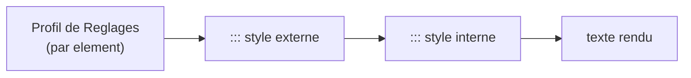

> **Statut :** **design exploratoire, non figé.** **Compagnon** de
> [BACKGROUND-SPEC](BACKGROUND-SPEC.md) (qui s'en sert pour styler le titre d'une
> couverture). Ce document propose un bloc ` ::: style ` qui applique des
> **overrides typographiques locaux** à son contenu **markdown récursif**.
> Méthodo **pilotée par invariants** (comme [GITHUB-SYNC-SPEC](GITHUB-SYNC-SPEC.md)
> / [VOLUMES-SPEC](VOLUMES-SPEC.md)) : S1–S4 (§1) sont la source de vérité.
> **Rien n'est implémenté.** À terme, référencer depuis
> [AI-AUTHORING.md](../AI-AUTHORING.md) et [FEATURES.md](../FEATURES.md).

**Objet :** pouvoir **régler localement la typographie** d'un fragment de
document — couleur, taille, police, graisse, alignement… — sans passer par le
profil de Réglages (qui est *par élément*, global au document). Motivation
immédiate : un **titre de couverture** clair / grand / centré sur fond sombre
(cf. [BACKGROUND-SPEC](BACKGROUND-SPEC.md)), mais l'outil sert **partout** dans le
flux. On **joue la récursivité** de markpage : le corps est du markdown complet,
rendu par le même pipeline.

::: important [Un renversement de politique, assumé]
markpage **refuse aujourd'hui** le style en ligne et les classes (`{.classe}`,
HTML brut) : la typo vit dans le **profil**, par élément (cf.
[AI-AUTHORING](../AI-AUTHORING.md) « *What is NOT supported* »). ` ::: style `
**réintroduit du style local** — mais **contrôlé** : un **allowlist** de
propriétés typographiques **nommées et validées**, **jamais** de CSS ni de HTML
brut. C'est l'exception **assumée** (§4), justifiée par les couvertures / affiches
que le profil ne peut pas exprimer.
:::

## 1. Invariants

Le design évolue **par invariants**, posés un par un (méthodo
[FORMAL-METHOD-SPEC](FORMAL-METHOD-SPEC.md)). S1–S4 sont la **source de vérité**.

**S1 — Style local contrôlé.** ` ::: style ` applique un **allowlist** fixe de
propriétés **typographiques** à son contenu. Les valeurs sont **validées** ; il
n'y a **pas** de CSS arbitraire, **pas** de noms de propriété libres, **pas** de
HTML brut. Le style local est l'**exception assumée** à la règle « pas de style en
ligne » (§4).

**S2 — Récursif & composable.** Le corps est du **markdown complet**, rendu par
**le même pipeline** que le document. Les overrides **héritent** (cascade CSS) ;
les ` ::: style ` **s'imbriquent**, l'**interne l'emporte** sur l'externe.

**S3 — Typographie seulement.** L'allowlist V1 est **typographique** (couleur,
taille, police, graisse, italique, soulignement, alignement, interligne). **Pas
de boîte** (fond, bordure, padding, marges) — ça relève du fond
` ::: background ` / `fill` ([BACKGROUND-SPEC](BACKGROUND-SPEC.md)) ou d'un futur
` ::: box ` (§7).

**S4 — Surcharge locale du profil.** Les paramètres **surchargent localement** le
profil de Réglages (par élément). Précédence : **` ::: style ` (local) > profil**
— cohérente avec la précédence *clés plates > profil* du frontmatter
([FRONTMATTER-SPEC](FRONTMATTER-SPEC.md)).

## 2. Syntaxe

Un bloc Pandoc `:::` de classe `style`. L'**info-string** porte les **paramètres**
(allowlist) ; le **corps** est du **markdown**.

````markdown
::: style color=#ffffff size=28pt align=center font="Inter" weight=700
# Titre clair, grand, centré
:::
````

Grammaire de l'info-string :

```ebnf
infoString = "style", { ws, attr } ;
attr       = ( "color", "=", color )
           | ( "size", "=", number, "pt" )
           | ( "font", "=", family )
           | ( "weight", "=", number )
           | ( "align", "=", align )
           | ( "line-height", "=", number )
           | "italic"
           | "underline" ;
align      = "left" | "center" | "right" | "justify" ;
color      = ( "#", hexDigit, { hexDigit } ) | cssName ;
family     = quoted | bareWord ;
```

| Paramètre | Valeurs | Propriété (cible) |
| :-- | :-- | :-- |
| `color=` | `#rrggbb` ou nom CSS | couleur du texte |
| `size=` | nombre + `pt` | taille de police |
| `font=` | famille (`"Inter"`, `Lora`…) | police |
| `weight=` | 100–900 | graisse |
| `italic` | *(drapeau)* | italique |
| `underline` | *(drapeau)* | souligné |
| `align=` | `left`/`center`/`right`/`justify` | alignement |
| `line-height=` | multiplicateur (`1.3`) | interligne |

::: note [Calé sur le `Style` par élément de markpage]
L'allowlist est le **sous-ensemble typographique** de l'interface `Style` des
Réglages ([`src/settings.ts`](../src/settings.ts)) : mêmes notions (family,
fontSize, color, weight, italic, underline, align, lineHeight), même unités
(taille en **pt**). Les attributs de **boîte** du `Style` (background, bordures,
padding) sont **hors V1** (S3).
:::

## 3. Composition & précédence

L'imbrication suit la **cascade CSS** : le ` ::: style ` le plus **interne**
l'emporte ; ce qu'il ne fixe pas est **hérité** de l'externe, puis du **profil**.



````markdown
::: style font="Lora" color=#333333
Tout ce bloc est en Lora gris.

::: style size=22pt weight=700
Ce sous-bloc reste en Lora gris, mais grand et gras.
:::
:::
````

::: tip
` ::: style ` **n'invente pas** une nouvelle police / palette : il **réutilise**
les familles disponibles (profil, `customFonts`) et accepte les couleurs CSS. Il
ne fait que **surcharger localement** ce que le profil pose globalement.
:::

## 4. Politique & sécurité

::: warning [Pourquoi c'est sûr malgré le « style en ligne »]
- **Allowlist fermé** : seules les ~8 propriétés du §2 sont reconnues ; tout
  paramètre inconnu est **ignoré** (ou signalé), jamais propagé.
- **Valeurs validées** : `color` doit parser comme couleur, `size` comme
  `nombre pt`, `weight` comme 100–900, `align` comme énum, `font` comme **nom de
  famille** assaini, `line-height` comme nombre. **Aucune** valeur libre (pas de
  `url()`, pas de `;`/`}`, pas d'`expression()`).
- **Pas de CSS ni HTML brut** : on ne passe **jamais** de chaîne CSS ; le
  renderer **mappe** chaque paramètre validé vers **une** propriété. Le corps
  reste du markdown — le **raw HTML y est toujours échappé**
  ([AI-AUTHORING](../AI-AUTHORING.md)).
:::

Conséquence : ` ::: style ` est du **style local contrôlé**, pas une porte vers
CSS/HTML arbitraire. La politique « pas de raw HTML » est **intacte** ; seule la
règle « pas de style local » est **assouplie**, de façon bornée.

## 5. Rapport au reste de markpage

Profil de Réglages
:   Pose la typo **par élément**, globale au document. ` ::: style ` la
    **surcharge localement** (S4) sans la modifier.

Frontmatter (`font-body`/`font-heading`/`font-mono`)
:   Choisit les **familles** du document ([FRONTMATTER-SPEC](FRONTMATTER-SPEC.md)).
    ` ::: style font=… ` peut **basculer** localement vers une autre famille
    disponible.

Bloc ` ::: background `
:   Le cas d'usage moteur : un ` ::: style ` **dans** une minipage de fond donne
    le titre clair/grand/centré sur fond sombre (cf.
    [BACKGROUND-SPEC](BACKGROUND-SPEC.md)).

## 6. Rendu (esquisse d'implémentation)

::: caution [Conception, pas encore de code]
Cette section esquisse *comment* on rendrait le bloc ; elle n'engage pas l'API.
:::

- **Parsing** : étendre le parseur de blocs `:::` pour accepter des attributs
  `clé=valeur` + drapeaux dans l'info-string — **partagé** avec ` ::: background `
  ([BACKGROUND-SPEC §7](BACKGROUND-SPEC.md)).
- **Allowlist → CSS** : une table `paramètre → propriété` mappe chaque attribut
  **validé** vers une propriété, posée en **style inline** sur un wrapper
  (`<div>` ou `<span>` selon le contenu). Tout le reste est **rejeté**.
- **Corps** : rendu **récursivement** par le pipeline markpage (le wrapper hérite
  vers son contenu via la cascade CSS).
- **Renderer** : façon [`@orlarey/blocks`](../packages/blocks/) ou un *extension*
  `marked-config`, mutualisé avec le parseur d'attributs de ` ::: background `.

## 7. Non-buts & différés

::: caution

- **Style *inline*** (un mot coloré **au milieu** d'un paragraphe) — différé :
  markpage n'a **pas** de syntaxe d'attribut inline (`[texte]{…}`), et ` ::: ` est
  un bloc. À rouvrir si le besoin s'impose (forme inline dédiée).
- **Style de boîte** (fond, bordure, padding, marges) — hors V1 (S3). Relève de
  ` ::: background `/`fill`, ou d'un futur ` ::: box `.
- **Styles nommés réutilisables** (`::: style use=titre-couverture`) — différé ;
  V1 = paramètres explicites à chaque usage.
- **CSS arbitraire / propriétés libres** — **jamais** (S1, §4).
- **Animation / interactivité** — hors sujet (sortie = PDF statique).
:::

## 8. Exemples

**Un titre coloré et centré** (flux normal) :

````markdown
::: style color=#b1002e size=26pt align=center weight=700
Avis de tempête
:::
````

**Imbrication** (l'interne l'emporte) :

````markdown
::: style font="Lora" color=#333333
Paragraphe en Lora gris.

::: style size=20pt italic
Une aparté, toujours en Lora gris, mais plus grande et en italique.
:::
:::
````

**Dans une couverture** (` ::: style ` à l'intérieur d'une minipage de fond) :

````markdown
::: background first fill=#0b1f3a
:::

::: background first at=0.5,0.42 size=0.7
::: style color=#ffffff size=34pt align=center weight=700
Rapport annuel
:::
:::
````

::: tip
Le ` ::: style ` est **dans** la minipage ` ::: background ` : le titre hérite
sa couleur claire et sa taille, posé sur le fond plein sombre. C'est la
**composition** récursive qui fait tout — aucun attribut spécial sur
` ::: background `.
:::

## 9. Questions ouvertes

- **Style inline** (un jour ?) — une forme pour colorer **un mot** sans casser le
  paragraphe (syntaxe d'attribut inline dédiée).
- **Unités de `size`** : `pt` (proposé) ; faut-il du **relatif** (`em`, `%`,
  multiplicateur du corps) pour un texte qui suit la taille de base ?
- **Liste exacte des paramètres** : le §2 suffit-il, ou manque-t-il
  `letter-spacing`, `small-caps`, `uppercase` … ?
- **Styles nommés** (§7) — utile pour répéter un même style (titres de section
  d'une affiche) ?
- **Nom** : `style` (retenu) vs `type` / `format` / `text`.
