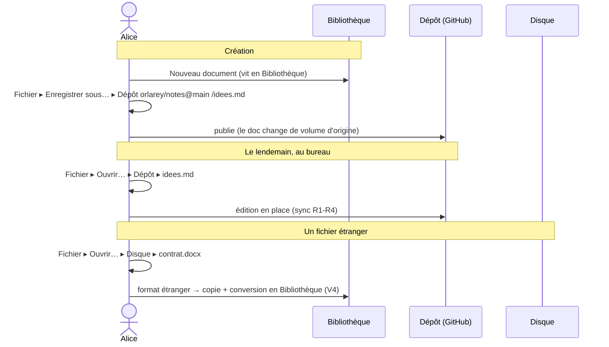

> **Statut :** design exploratoire (v0.1) — non implémenté. Spec **pilotée par
> invariants** (voir « Invariants »). Elle unifie l'ouverture / l'enregistrement
> de documents au-dessus de trois backends qui existent déjà
> (`docs.ts`, `disk-link.ts`, `github-sync.ts` — cf.
> [GITHUB-SYNC-SPEC](GITHUB-SYNC-SPEC.md)). Le plan en fin de fichier est
> prévisionnel.

**Thèse :** offrir une expérience d'**application de bureau traditionnelle** —
un seul *Ouvrir*, une racine, des **volumes montés**, des dossiers, des fichiers
— **sans installation et sans serveur**, fidèle à l'ADN de markpage (appli
statique, données chez l'utilisateur).

::: toc+

- **Contexte** — pourquoi un *Ouvrir* par origine est un anti-pattern.
- **Le modèle** — l'espace de noms unifié et ses volumes.
- **Invariants** — le modèle « volume » en cinq règles.
- **Opérations** — Ouvrir, Enregistrer, Monter / Démonter.
- **Conséquences** — la dissolution d'« Importer » et de « Lier ».
- **Carrefour** — couche UX vs modèle de données.
- **Scénario** — une journée de travail multi-volumes.
- **Interface** — l'esquisse du navigateur.
- **Correspondance avec le code** — ce qui existe déjà.
- **Plan** — par où commencer.

:::

## 1. Contexte — un *Ouvrir* par origine

markpage a aujourd'hui **une commande d'ouverture par provenance** : *Ouvrir*
(bibliothèque), *Ouvrir depuis le disque*, *Ouvrir depuis GitHub*, *Importer*.
C'est exactement l'anti-pattern que les systèmes d'exploitation ont résolu il y
a quarante ans : **un seul** *Ouvrir* sur un **espace de noms unifié** — une
racine, des **volumes montés** (disque interne, clés USB, partages réseau), et
dans chacun une arborescence.

L'utilisateur ne devrait pas choisir *où chercher* avant de chercher : il ouvre,
il parcourt, il choisit. Le *où* est une coordonnée dans l'espace, pas une
commande distincte.

## 2. Le modèle — un espace de noms, des volumes

Un **volume** est une arborescence montée à la racine de markpage. Trois types,
adossés à des backends **déjà présents** :

Bibliothèque
:   Le **système de fichiers privé du navigateur** (OPFS, repli localStorage —
    `docs.ts`). **Toujours montée**, hors-ligne, sans permission, invisible dans
    le Finder. C'est le « disque interne » de markpage, là où vit un document
    neuf. **L'utilisateur n'y voit que les documents `.md`** ; leurs **images**
    sont stockées dans un *content-addressed store* interne — bien présentes,
    mais **pas exposées comme des fichiers** (substrat, pas entrées navigables).
    Pas de création de dossiers ⇒ **liste plate** (v1).

Disque
:   Un **dossier réel de la machine**, monté via *File System Access*
    (`disk-link.ts`). **Chromium uniquement**. Monté en choisissant un dossier ;
    le *handle* est persisté, la permission re-demandée au besoin.

Dépôt
:   Un **dépôt GitHub** `propriétaire/dépôt@branche`, monté si un **PAT** est
    présent (`github-sync.ts`). Lecture/écriture via l'API REST + Git Data ; la
    synchronisation obéit aux invariants R1–R4 de
    [GITHUB-SYNC-SPEC](GITHUB-SYNC-SPEC.md).

```tree "L'espace de noms unifié de markpage"
markpage
  Bibliothèque            (OPFS — toujours là, hors-ligne, plate : que des .md)
    Sans titre.md
    showcase.md
  Disque ▸ ~/Documents    (un dossier monté, Chrome, File System Access)
    rapport.md
    images
      logo.png
  orlarey/markpage@main   (un dépôt monté, si PAT)
    lettres
      devis.md
    images
      en-tete.png
```

::: note [Une re-présentation, pas un nouveau moteur]
Les trois backends existent et sont éprouvés. Cette spec ne décrit **aucun**
moteur de stockage neuf : elle unifie leur **présentation** (un navigateur) et
leur **vocabulaire** (ouvrir / enregistrer / monter). Le risque est surtout
d'UX et de modèle, pas d'infrastructure.
:::

## Invariants

Le modèle évolue **par invariants**, posés et validés un par un (méthodologie
[FORMAL-METHOD-SPEC](FORMAL-METHOD-SPEC.md)). Cinq règles suffisent.

### V1 — un seul espace de noms

Tout document ouvrable vit dans un **volume monté**. *Ouvrir* parcourt l'**union**
des volumes montés ; il n'existe **aucune** commande d'ouverture spécifique à une
origine. *Importer* non plus n'est plus une commande (cf. V4).

### V2 — un volume = (racine, backend)

Un volume est une **racine** parcourable adossée à un **backend** parmi trois :
Bibliothèque (toujours montée), Disque (un dossier), Dépôt (un `repo@branche`).
**Monter / démonter ne touche jamais au contenu** : c'est un acte de *présence
dans l'espace de noms*, pas une copie ni une suppression.

### V3 — l'origine d'un document est son volume

Un document **appartient au volume où on l'a ouvert** ; il s'y édite **en place**.
La synchronisation est une **propriété du volume**, pas une action séparée : un
`.md` du volume Dépôt se synchronise selon R1–R4, un `.md` du volume Disque se
miroite sur le fichier, un `.md` de Bibliothèque reste local. *« Lier »
disparaît* (cf. V5).

### V4 — *Ouvrir* en place, ou *Importer* une copie

Le sort d'un fichier à l'ouverture dépend de **son format**, pas de son volume :

- un **`.md` (markdown)** éditable s'**ouvre en place** dans son volume ;
- un **format étranger** (`.docx`, `.html`, `.txt`, une URL, un lien de partage)
  se **copie et se convertit** dans la **Bibliothèque** — c'est exactement ce
  qu'« Importer » faisait, devenu une simple conséquence du format.

### V5 — *Enregistrer* = (volume, chemin)

*Enregistrer* écrit dans le **volume d'origine** du document. *Enregistrer sous…*
choisit **un volume + un chemin** : c'est l'unique geste de **publication /
déplacement** entre volumes. Les commandes *Lier à GitHub*, *Lier au disque*,
*OneDrive* fusionnent toutes dans ce seul *Enregistrer sous*.

::: tip [La symétrie qui paie]
*Ouvrir* et *Enregistrer sous* parlent désormais **la même langue** :
`(volume, chemin)`. Tout le reste en découle — « Lier » n'est qu'un
*Enregistrer sous* vers un volume distant, « Importer » qu'un *Ouvrir* d'un
format étranger.
:::

## 3. Opérations

Ouvrir
:   Un **navigateur** (barre latérale de volumes → arborescence → fichier).
    Selon V4 : `.md` → édition en place ; format étranger → import en
    Bibliothèque.

Enregistrer
:   Écrit dans le volume d'origine (V5). Pour le volume Dépôt, c'est la machine à
    états R4 (avance rapide / fork) ; pour Disque, l'écriture du fichier ; pour
    Bibliothèque, le commit local.

Enregistrer sous…
:   Choisit `(volume, chemin)` cible. Vers un volume distant = *publier* (le
    document change de volume d'origine, ou en crée une copie — cf. carrefour).

Monter un volume
:   Disque : *picker* de dossier. Dépôt : `propriétaire/dépôt@branche` (PAT
    requis). La liste des volumes montés est **persistée** (handles en IndexedDB,
    dépôts en réglage). Bibliothèque est montée d'office.

Démonter un volume
:   Le retire de l'espace de noms **sans** toucher au backend (le dossier reste
    sur le disque, le dépôt sur GitHub). **Refusé tant qu'un document de ce
    volume est ouvert** : il faut d'abord fermer ces documents. *Corollaire de
    V3 : un document ouvert a toujours son volume d'origine monté* — on n'a donc
    jamais d'origine « pendante ». (Bibliothèque ne se démonte pas.)

Supprimer
:   Envoie le document à la **Corbeille** (suppression douce, restaurable). C'est
    la **seule fonction irréductible** de l'ancien gestionnaire « Fichiers… » :
    on la garde comme **commande dédiée** (*Supprimer…*) + un **lieu** (la
    Corbeille), pas comme un gestionnaire. En v1, opération de la **Bibliothèque**
    uniquement ; sur Disque/Dépôt, effacer un vrai fichier est une opération du
    backend, **différée** (§9) — « retirer de markpage » s'y résume à **fermer**
    le document.

## 4. Conséquences — ce qui disparaît

::: important [Trois éléments s'évaporent]

- **« Importer »** n'est plus une commande : c'est la branche « format étranger »
  de *Ouvrir* (V4).
- **« Lier à … »** n'est plus un concept : c'est *Enregistrer sous* vers un
  volume (V5). Le moteur de lien (R1–R4 pour GitHub, miroir pour le disque)
  **reste** — seul le *vocabulaire* de surface change.
- **Le gestionnaire « Fichiers… »** disparaît : lister/ouvrir → le navigateur ;
  renommer → inline sur le titre ; dupliquer → *Enregistrer sous* ; et sa seule
  fonction propre, **supprimer**, devient la commande *Supprimer…* + la Corbeille
  (un lieu, pas un gestionnaire).

:::

Le menu **Fichier** s'allège d'autant : plus de *Ouvrir depuis le disque*, *Ouvrir
depuis GitHub*, *Importer*, *Lier à GitHub*, *Lier au disque* — remplacés par
**Ouvrir…** et **Enregistrer sous…**, tous deux pilotés par le même navigateur de
volumes.

## 5. Carrefour — couche UX ou modèle de données ?

Deux niveaux d'ambition, à trancher avant de coder :

**A — Volumes comme couche UX** (par-dessus le modèle actuel). Le navigateur
remplace prompts et commandes ; *sous le capot*, « ouvrir depuis le volume Dépôt »
reste « créer un doc Bibliothèque + un `githubLink` » (l'existant). Incrémental,
faible risque, le modèle de données ne bouge presque pas.

**B — Volumes comme modèle de données.** Un document **appartient** réellement à
un volume ; la Bibliothèque n'est qu'un volume parmi d'autres. Plus pur, mais
c'est une **refonte** de `docs.ts` / `index.json` et de la notion de lien.

::: note [Recommandation]
**Viser B comme modèle mental** (c'est lui qui rend le vocabulaire cohérent et
qui dicte l'UI), mais **livrer par A** : l'UX unifiée par-dessus l'existant,
puis converger vers B si le besoin se confirme. On gagne la cohérence
conceptuelle sans le risque d'un *big-bang*.
:::

## 6. Scénario

Alice écrit une note sur son portable, la publie sur un dépôt, la reprend au
bureau, puis ouvre un `.docx` reçu par mail.



Pas à pas :

1. **Création.** Un nouveau document naît en **Bibliothèque** (sans réseau).
2. **Publication.** *Enregistrer sous…* → volume **Dépôt**, chemin `idees.md`. Le
   document a désormais le Dépôt pour origine ; les Save suivants suivent R4.
3. **Reprise.** Au bureau, *Ouvrir…* → **Dépôt** → `idees.md` (V3, édition en
   place).
4. **Format étranger.** *Ouvrir…* → **Disque** → `contrat.docx` : V4 le copie +
   convertit en Bibliothèque (l'ancien « Importer »), sans toucher au `.docx`.

## 7. Interface

- **Navigateur de volumes** (un seul, partagé par *Ouvrir* et *Enregistrer
  sous*) : barre latérale listant les volumes montés (façon *Finder*), fil
  d'Ariane, liste de fichiers/dossiers. En pied : *Monter un dossier…* (Chrome),
  *Monter un dépôt…* (si PAT).
- **États de volume** visibles : Bibliothèque (toujours OK), Disque
  (permission à (re)accorder), Dépôt (en ligne / hors-ligne, `@branche`).
- **Indicateur d'origine** sur le titre du document : le volume + le chemin
  (remplace les badges 🔗 disque / GitHub épars).
- **Réglages → GitHub** : le PAT devient *« le sésame pour monter des volumes
  Dépôt »* ; on y gère la **liste des dépôts montés**.
- **Plus de gestionnaire *Fichiers…*** : *Supprimer…* est une commande, la
  **Corbeille** une zone du volume Bibliothèque dans le navigateur (restaurer /
  vider). *Renommer* reste inline sur le titre ; *Dupliquer* = *Enregistrer
  sous* en Bibliothèque.

## 8. Correspondance avec le code existant

| Volume | Backend actuel | Monter | Ouvrir | Enregistrer |
| :-- | :-- | :-- | :-- | :-- |
| Bibliothèque | `docs.ts` (OPFS) | d'office | `loadDocContent` | `commitDoc` |
| Disque | `disk-link.ts` (FS Access) | `pickDirectory` + handle IDB | `readFileHandle` | `writeFileHandle` |
| Dépôt | `github-sync.ts` (R1–R4) | `repo@branche` + PAT | `importFromGithub` | `saveToGithub` |

Autrement dit : la couche « volume » est une **façade** sur des fonctions déjà
écrites. En suivant la voie **A**, l'essentiel du travail est l'**UI du
navigateur** + le routage `(volume, chemin) → backend`.

## 9. Hors périmètre (v1)

- **Volumes en écriture concurrente temps réel** (hors sujet — cf. R4, async).
- **Déplacer/renommer/supprimer** des fichiers *dans* un volume distant depuis le
  navigateur (au-delà d'ouvrir/enregistrer) — utile, mais différé.
- **Nouveaux backends** (GitLab, WebDAV, Dropbox) — l'architecture les accueille,
  mais v1 = Bibliothèque + Disque + Dépôt.
- **Arborescence de la Bibliothèque** : aujourd'hui plate (liste de docs) ; des
  dossiers internes sont un raffinement séparé.

## 10. Plan d'implémentation (voie A)

Par étapes incrémentales, chacune livrable seule :

1. **Abstraction `Volume`** — interface commune (`list(path)`, `readFile`,
   `writeFile`, `kind`, `state`) + trois adaptateurs sur l'existant.
2. **Navigateur** — modal unique (barre latérale volumes + arborescence),
   branché sur *Ouvrir…*.
3. **Bascule *Ouvrir*** — V1/V4 : remplacer Ouvrir / depuis disque / depuis
   GitHub / Importer par le navigateur.
4. **Bascule *Enregistrer sous*** — V5 : `(volume, chemin)`, absorbe *Lier* et
   *OneDrive*.
5. **Nettoyage du menu Fichier** + indicateur d'origine + gestion des volumes
   montés (Réglages).

::: note [Méthode]
On reste *spec-first* : valider d'abord les **invariants V1–V5** (et le
carrefour A/B), puis dérouler le plan. Rien n'est codé tant que le modèle n'est
pas stabilisé.
:::
