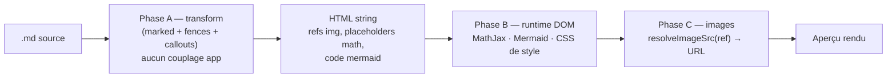
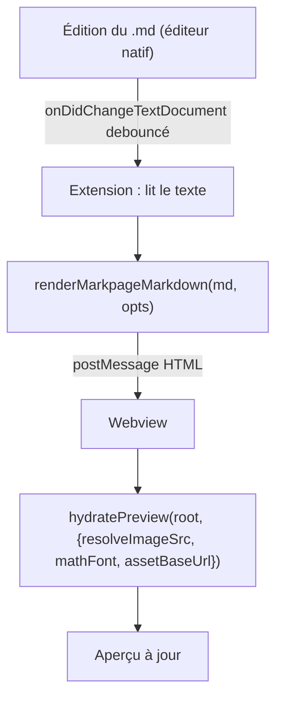

> **Statut :** design (v0.1) — non encore livré. Spec d'une **extension VS Code**
> qui prévisualise un fichier Markdown avec **toutes les extensions markpage**
> (fences DSL, callouts, math, mermaid, mosaïque, en-têtes…), en **réutilisant le
> moteur de rendu** de markpage plutôt qu'en le réécrivant. S'appuie sur le
> découplage déjà engagé (`@orlarey/blocks`, `@orlarey/marked`) ; cf. l'inventaire
> en §4.

**Thèse.** Donner aux utilisateurs de **VS Code** un aperçu **fidèle** des
documents Markdown au format markpage — la même sortie que le volet d'aperçu de
l'appli web — **sans dupliquer la logique de rendu**. On factorise le pipeline de
rendu markpage dans un **package partagé** consommé à la fois par l'appli web et
par un **webview** d'extension VS Code.

::: tip [Périmètre v1]
**Aperçu seul**, en lecture. Pas d'édition dans le webview (on garde l'éditeur
texte natif de VS Code), pas de pagination paged.js ni d'export PDF, pas de
volumes/sync. Le but : *voir* le `.md` rendu comme dans markpage.
:::

## 1. Décision d'architecture

Deux voies pour un aperçu Markdown dans VS Code :

A — **Plugins de l'aperçu intégré** (`markdown.markdownItPlugins`)
: L'aperçu Markdown natif de VS Code utilise **markdown-it**. markpage est en
  **marked**. Réutiliser l'aperçu intégré imposerait de **réécrire toutes les
  extensions** en markdown-it → on jette la factorisation. **Rejeté.**

B — **Webview qui rend lui-même** (retenu)
: L'extension ouvre un **panneau webview** et y exécute le **pipeline marked de
  markpage**. Un webview *est* un navigateur → MathJax, Mermaid, mesure canvas et
  le CSS markpage fonctionnent tels quels. On réutilise le code, on ne le
  réécrit pas.

::: warning
Le piège classique est de vouloir s'accrocher à l'aperçu intégré. Le moteur
(markdown-it) y est incompatible avec markpage (marked). **Le webview
auto-rendu** est ce qui rend la réutilisation possible.
:::

## 2. Le pipeline de rendu (déjà en trois phases)

L'analyse du code markpage (cf. §4) montre un pipeline **déjà découplé** en trois
phases, sans couplage à l'état de l'appli :



- **Phase A — transform** ([marked-config.ts](../src/marked-config.ts)) :
  markdown → **string HTML**, refs images intactes, placeholders math,
  `<code class=\"language-mermaid\">`. **Pur**, aucun accès DOM/stockage.
- **Phase B — runtime** ([preview.ts](../src/preview.ts)) : sur le DOM rendu —
  typeset MathJax, rendu Mermaid + *namespacing* d'IDs, injection du CSS. Requiert
  un DOM + les libs (fournis par le webview).
- **Phase C — images** ([image.ts](../src/image.ts)) : résolution des refs en
  URL affichable. **Seule vraie couture d'environnement** (store sha ↔ fichiers).

## 3. Le package partagé `@orlarey/markpage-render`

Un **3ᵉ package** (après `@orlarey/blocks` et `@orlarey/marked`), consommé par
l'appli web **et** l'extension. API cible :

```ts
// @orlarey/markpage-render
export function renderMarkpageMarkdown(md: string, opts: RenderOptions): string;       // phase A
export function hydratePreview(root: HTMLElement, opts: RuntimeOptions): Promise<void>; // phases B + C

export interface RenderOptions {
  style?: StylePreset;
  mathFont?: MathFontSet;
  header?: string; footer?: string;
  numbering?: NumberingConfig;
}
export interface RuntimeOptions {
  resolveImageSrc?: (ref: string) => string; // la couture (§5)
  mathFont?: MathFontSet;
  assetBaseUrl?: string;                      // racine des fontes MathJax / assets
}
```

L'appli web garde son orchestration ; elle **importe** ce package au lieu d'avoir
le pipeline en propre. C'est la suite directe de l'extraction `@orlarey/blocks`.

## 4. Inventaire (ce qui bouge, ce qui reste)

### Bucket A — déplacé dans le package (transform pur)

| Module | Rôle | Note |
| :-- | :-- | :-- |
| [marked-config.ts](../src/marked-config.ts) | dispatcher fences + callouts + footnotes + def-lists + `toc+` | cœur ; 0 couplage app |
| [algorithm.ts](../src/algorithm.ts), [ebnf.ts](../src/ebnf.ts), [letterhead.ts](../src/letterhead.ts), [refs.ts](../src/refs.ts), [captions.ts](../src/captions.ts) | renderers de fences / refs-labels / légendes | purs |
| [highlight.ts](../src/highlight.ts) | coloration (31 langues + Faust) | pur |
| [mosaic.ts](../src/mosaic.ts), [numbering.ts](../src/numbering.ts), [frontmatter.ts](../src/frontmatter.ts) | galerie / numérotation / YAML | purs (mosaic mesure via DOM → phase B) |
| `@orlarey/blocks`, `@orlarey/marked` | chart/bda/category/adt/diff/tree | **déjà packagés** |

### Bucket B — couche runtime (DOM, réutilisable en webview)

| Module | Rôle | Dépendance |
| :-- | :-- | :-- |
| [math.ts](../src/math.ts) + [mathjax-fontsets.ts](../src/mathjax-fontsets.ts) | TeX → SVG (lazy MathJax, multi-fontes) | MathJax |
| [mermaid.ts](../src/mermaid.ts) | mermaid → SVG + namespacing d'IDs | Mermaid (lazy) |
| [typography.ts](../src/typography.ts) | mesure de texte (canvas) | `document` (webview OK) |
| [page-running.ts](../src/page-running.ts) | running headers/footers | **pagination seulement** → optionnel |

### Bucket C — les coutures (fournies par l'hôte)

| Couture | markpage | VS Code |
| :-- | :-- | :-- |
| **Résolution images** | `img://<sha>` → blob (IDB) / `resource-mapping` | chemin relatif → `webview.asWebviewUri(...)` |
| **Options de rendu** | presets, font math, header/footer, `measureChars` | passées en objet (déjà la bonne forme) |
| **CSS / thème** | `style.css` + presets + typographie | mêmes feuilles bundlées ; thème clair/sombre VS Code en option |

→ **Une seule interface neuve** : `resolveImageSrc(ref) => url`.

### Bucket D — reste app-only (hors package)

Éditeur CodeMirror, OPFS/`docs.ts`, **volumes**, `settings` UI, **store image
IndexedDB** + `resource-mapping` (le *backend* ; seule l'*interface* est
partagée), **paged.js** ([preview-paginated.ts](../src/preview-paginated.ts)) +
export PDF. L'extension fournit ses propres versions des coutures.

## 5. La couture images en VS Code

C'est l'unique brique vraiment nouvelle.

- Les `.md` VS Code référencent des images par **chemin relatif/absolu de
  fichier** (pas de `img://<sha>` — ce schéma n'existe que dans markpage).
- `resolveImageSrc(ref)` résout `ref` contre le **dossier du document** puis le
  convertit en URI webview :
  `panel.webview.asWebviewUri(Uri.joinPath(docDir, ref))`.
- Le webview doit déclarer `localResourceRoots` couvrant le dossier du document
  (et les assets du bundle). Hors de ces racines → image bloquée par la CSP.

::: note
Comme `img://<sha>` est propre à markpage, l'extension n'a pas à le gérer : la
couture se réduit à « chemin de fichier → URI webview ». Le package expose
néanmoins le *point d'extension* pour que l'appli web continue de brancher sa
résolution sha.
:::

## 6. Structure de l'extension VS Code

### Manifeste (`package.json`)

- **Commande** `markpage.openPreview` (+ « to the Side ») et icône d'éditeur,
  façon aperçu Markdown natif. **Pas** de `customEditor` qui remplacerait
  l'éditeur texte — on **ajoute** un panneau, on ne retire rien.
- `activationEvents` : à l'ouverture d'un `.md` / sur la commande.
- Contributions de configuration : font math, preset de style, thème.

### Le webview

- Un `WebviewPanel` à côté de l'éditeur actif.
- HTML shell + **bundle** (le package de rendu + MathJax + Mermaid + CSS).
- **CSP stricte** avec **nonce** sur chaque `<script>`/`<style>` inline ;
  `img-src ${webview.cspSource} https: data:` ; `script-src 'nonce-…'`.
- `localResourceRoots` = dossier du document **+** dossier des assets de
  l'extension (fontes MathJax, feuilles de style).

### Flux de rendu



- **Mise à jour live** : `workspace.onDidChangeTextDocument` (debouncé ~150 ms)
  sur le document suivi → re-render.
- **Scroll-sync** éditeur ↔ aperçu : **différé v2** (le rendu annote déjà les
  lignes source — réutilisable plus tard).
- **Thème** : lire `window.activeColorTheme` → choisir le preset markpage ou
  injecter des variables ; v1 peut livrer le rendu clair par défaut.

## 7. Plan d'implémentation

**Étape 1 — Extraire `@orlarey/markpage-render`.** Déplacer le Bucket A (+ B en
second point d'entrée), faire que l'appli web l'**importe** (zéro changement
fonctionnel côté markpage). *Vérif* : la suite de tests + l'aperçu web inchangés.

**Étape 2 — Définir la couture.** Sortir la résolution d'images derrière
`resolveImageSrc` ; l'appli web branche sa version sha, le package n'en dépend
plus. *Vérif* : aperçu web toujours bon avec la résolution injectée.

**Étape 3 — Coquille d'extension.** Scaffold (`yo code` ou minimal) : commande +
WebviewPanel + CSP + `localResourceRoots`. Afficher un HTML statique. *Vérif* :
le panneau s'ouvre, CSP sans erreur console.

**Étape 4 — Brancher le rendu.** `renderMarkpageMarkdown` côté extension →
`postMessage` → `hydratePreview` côté webview, avec `resolveImageSrc` =
`asWebviewUri`. *Vérif manuelle* : un `.md` markpage (math, mermaid, chart,
mosaïque, images) rendu fidèlement.

**Étape 5 — Live + thème + packaging.** Mise à jour à la frappe, mapping de
thème, bundle des fontes MathJax routées en URI webview. *Vérif manuelle* : édition
en direct, mode sombre, math avec la bonne fonte.

## 8. Périmètre & hors-périmètre

- **v1** : aperçu fidèle (toutes fences + math + mermaid + images), live update,
  un thème.
- **Hors-périmètre v1** : édition dans le webview, pagination/PDF, scroll-sync,
  volumes/sync, multi-fontes math exhaustives, export.
- **Différés** : scroll-sync (les annotations de ligne existent déjà), export PDF
  (réutiliser paged.js dans le webview), commande « Exporter ».

## 9. Risques & pièges

::: warning

- **CSP des webviews** : scripts/styles inline exigent un **nonce** ; MathJax et
  Mermaid injectent du `<style>`/`<svg>` — vérifier qu'ils passent la CSP.
- **Fontes MathJax** : chargées par `asyncLoad` (dynamique) ; sous webview, il
  faut **router `asyncLoad` vers des URI webview** et embarquer les données de
  fonte (sinon math cassé). C'est le point de packaging le plus délicat.
- **URI d'images** : chemins hors `localResourceRoots` bloqués ; gérer les
  chemins absolus et les images hors du workspace.
- **Taille du bundle** (MathJax surtout) : viser le lazy-load et un seul jeu de
  fontes par défaut.
- **Mermaid sous CSP** : Mermaid 10+ peut nécessiter `securityLevel` adapté et
  un nonce pour ses styles.
:::

## 10. Décisions actées

- **Webview auto-rendu** (pas l'aperçu intégré markdown-it) — §1.
- **Réutilisation par package** (`@orlarey/markpage-render`), pas de duplication.
- **Aperçu seul en v1** ; l'édition reste à l'éditeur texte natif de VS Code.
- **Une seule couture** d'environnement : `resolveImageSrc`.
