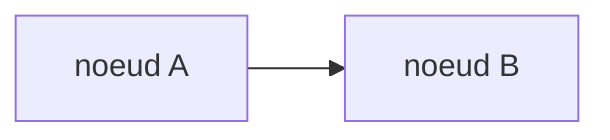

# Balayage des constructions

## adt

```adt
Expr ::= Const(c)
       | Vec(v)
       | Op(o, Expr, Expr)
```

## algorithm

```algorithm "Tri"
Input: liste L
for x in L do
  swap(x)
end
return L
```

## bda

```bda "Accumulateur"
1 : +~_
```

## category

```category "Triangle"
f : A -> B
g : B -> C
h : A -> C = g . f
```

## chart

```chart line "Latence" y-min=0
buffer, ms
64, 1.3
128, 2.7
256, 5.3
```

## csv

```csv "Mesures"
nom, valeur
alpha, 12
beta, 34
```

## diff

```diff "Patch"
 contexte
-ancien
+nouveau
```

## ebnf

```ebnf
expr = term , { "+" , term } ;
term = digit , { digit } ;
```

## inference

```inference "Typage"
Gamma |- e1 : T1
Gamma |- e2 : T2
---
Gamma |- (e1, e2) : T1 * T2
```

## math

```math
\int_0^1 x^2 \, dx = \frac{1}{3}
```

Inline : $\alpha + \beta$ et $\sum_{i=1}^{n} i$.

## mermaid



## tree unicode

```tree "Arbo"
projet
  src
    main.ts
```

## tree svg

```tree svg "AST"
Expr
  Op
    Add
    Sub
```

## tsv

```tsv "Onglets"
nom	valeur
gamma	56
```

## admonition

::: important [Point clé]
Un encadré d'avertissement avec du **gras** et du `code`.
:::

## liste de définition

Terme
:   Sa définition sur une ligne suffisamment longue pour occuper de la place.

## note de bas de page

Un paragraphe avec une note[^n1].

[^n1]: Le corps de la note.

## tableau

| Colonne | Valeur |
| :-- | --: |
| alpha | 12 |
| beta | 34 |
