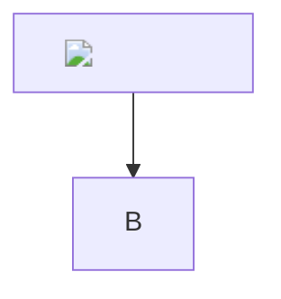

# Titre  {#id" onmouseover="window.__x=1" data-t="hid}

Paragraphe  et `code `.

[lien js](javascript:window.__x=1) [lien JS](JAVASCRIPT:window.__x=1) [lien sp]( javascript:window.__x=1)
[lien data](data:text/html,<script>alert(1)</script>) [lien vb](vbscript:msgbox(1))
<javascript:window.__x=1>
[titre](https://example.com "" onmouseover="window.__x=1" data-t="linktitle")
  

Note[^n] et renvoi \ref{sec:}.

[^n]: Pied 

## Section  \label{sec:" onmouseover="window.__x=1" data-t="label}

$\href{javascript:window.__x=1}{clic}$ $\unicode{}$ $\class{" onmouseover="window.__x=1" data-t="mjclass}{y}$ $\cssId{" onmouseover="window.__x=1" data-t="mjid}{z}$ $\style{" onmouseover="window.__x=1" data-t="mjstyle}{w}$ $\evil$ $\text{}$

```math
\href{javascript:window.__x=1}{bloc}
```

```inference ()
A 
---
B
```

```category ""
f : A -> B
g : B -> C
```

```ebnf
r = "", x;
```

```adt
E ::= C(c) (*  *)
```

```bda delays ""
1 : +~_
```

```chart line ""
x, y
1, 2
2, 3
```

```chart bar "b"
a, v
k, 3
```

```mosaic ""


```

```csv
h, v
c, 1
```

```diff ""
--- a/
+++ b/x
@@ -1 +1 @@
-
+
```

```tree svg ""
R
  C
```

```tree
R
  C
```

```algorithm ""
Input: 
for i from 1 to n do
  x
end
```



```"><script>window.__x=1</script>
code
```

```python 
x = 1
```

::: warning 
Corps 
:::

::: theorem []
T
:::

::: style color=red" onmouseover="window.__x=1" data-t="style-color font="" onmouseover="window.__x=1" data-t="style-font" size=12pt
Stylé
:::

::: background fill=#000" onmouseover="window.__x=1" data-t="bg-fill at=0.5,0.5
:::

::: background image=javascript:window.__x=1
:::

::: toc+
:::

```sender
S 
[x](javascript:window.__x=1)
```

```recipient
R 
```

```signature

****
```

```header
H  | | {page}
```

```footer
F  | {date}
```

| a | b |
|---|---|
|  | [x](javascript:window.__x=1) |
