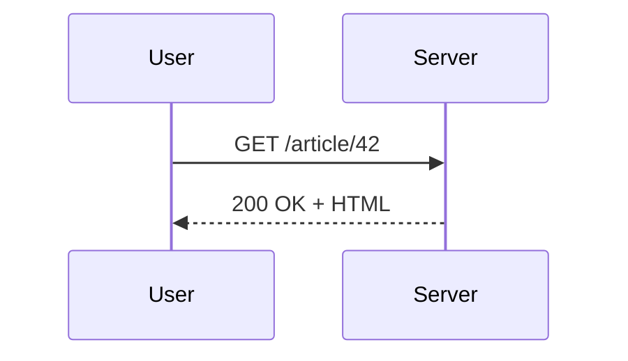

## Markdown standard, paginé

Tous les éléments Markdown habituels fonctionnent — titres, gras,
italique, listes, code en ligne. Ce que vous tapez sort dans le PDF.

````demo
### Trois corollaires

1. **La représentation n'est pas la chose représentée.**
2. **Un label peut mentir même si l'image est fidèle.**
3. **Une fois qu'on le voit, on ne peut plus l'oublier.**
````

## Tableaux denses depuis du CSV

Coller un CSV (ou TSV) dans un fence produit un tableau auto-aligné,
première ligne = en-tête.

````demo
```csv "Fréquences"
Note, Fréquence (Hz), MIDI
A4,  440.00, 69
A#4, 466.16, 70
B4,  493.88, 71
C5,  523.25, 72
```
````

## Code coloré syntaxiquement

Une vingtaine de langages bundlés, plus une grammaire Faust custom.

````demo
```python "Quicksort"
def quicksort(xs):
    if len(xs) <= 1:
        return xs
    pivot, rest = xs[0], xs[1:]
    return (
        quicksort([x for x in rest if x < pivot])
        + [pivot]
        + quicksort([x for x in rest if x >= pivot])
    )
```
````

## Diffs unifiés avec coloration par ligne

Un fence ```diff colore chaque ligne — vert ajouts, rouge suppressions.

````demo
```diff "Un patch à reviewer"
--- a/quicksort.py
+++ b/quicksort.py
@@ -1,5 +1,6 @@
 def quicksort(xs):
     if len(xs) <= 1:
         return xs
-    pivot = xs[0]
+    import random
+    pivot = random.choice(xs)
     rest = [x for x in xs if x != pivot]
```
````

## Arbres depuis une source indentée

Un fence ```tree convertit une hiérarchie indentée en arbre Unicode.

````demo
```tree "Layout du projet"
markpage
  src
    category.ts
    bda.ts
  tests
    corpus
      22-bda.md
```
````

## Algorithmes en pseudocode

Un fence ```algorithm met en page du pseudocode façon LaTeX
algorithm2e — caption auto-numérotée, lignes numérotées, mots-clés
en gras.

````demo
```algorithm "Bubble sort"
Input: tableau A de longueur n
Output: A trié en place
for i from 1 to n - 1 do
  for j from 0 to n - i - 1 do
    if A[j] > A[j + 1] then
      swap A[j] and A[j + 1]
    end
  end
end
return A
```
````

## Mathématiques avec MathJax

Du LaTeX math rendu par MathJax — inline, displayed, systèmes alignés.

````demo
Les équations de Maxwell sous forme différentielle :

$$
\begin{align*}
\nabla \cdot \mathbf{E} &= \frac{\rho}{\varepsilon_0} \\
\nabla \cdot \mathbf{B} &= 0 \\
\nabla \times \mathbf{E} &= -\frac{\partial \mathbf{B}}{\partial t} \\
\end{align*}
$$
````

## Règles d'inférence

Un fence ```inference rend prémisses / barre / conclusion via MathJax.

````demo
```inference (T-App)
\Gamma \vdash f : A \to B; \Gamma \vdash x : A
---
\Gamma \vdash f\,x : B
```
````

## Diagrammes catégoriques type-checkés

Un fence ```category déclare une catégorie par ses morphismes. Le
typechecker valide compositions et équations avant le rendu SVG.

````demo
```category "Pullback"
f  : A -> C
g  : B -> C
p1 : P -> A
p2 : P -> B
h  : X -> A
k  : X -> B
u  : X -> P by (h, k)

f . p1 = g . p2
p1 . u = h
p2 . u = k
```
````

## Schémas blocs à la Faust (BDA)

Un fence ```bda accepte la Block-Diagram Algebra — cinq opérateurs
binaires (`~ : , <: :>`) sur des primitives, rendu en circuit
gauche-droite. L'option `delays` matérialise le `z⁻¹` implicite.

````demo
```bda delays "Accumulateur"
1 : +~_
```
````

## BDA — croisement de deux câbles

Un grand classique BDA : permuter deux signaux en exploitant le modulo
du split. Les `!` cuts absorbent les copies redondantes (invisibles
au rendu).

````demo
```bda "Croisement"
_,_ <: !,_,_,!
```
````

## Diagrammes Mermaid

Flowcharts, séquences, classes — décrits avec quelques lignes, rendus
en SVG.

````demo

````

## Charts inline depuis du CSV

Un fence ```chart lit un mini-CSV et émet un SVG (courbe ou barres).

````demo
```chart line "Latence audio"
buffer (échantillons), latence (ms)
64,    1.3
128,   2.7
256,   5.3
512,  10.7
1024, 21.3
```
````

## Grammaires EBNF en diagrammes ferroviaires

Un source EBNF dans un fence ```ebnf devient un diagramme ferroviaire
par production.

````demo
```ebnf
expression = term, { ("+" | "-"), term };
term = factor, { ("*" | "/"), factor };
factor = number | "(", expression, ")";
```
````

## Types algébriques

Un bloc ```adt accepte des définitions BNF avec les `|` alignés.

````demo
```adt "Syntaxe abstraite"
Expr ::= Const(c)              (* c ∈ ℝ *)
       | Vec(v)                 (* v ∈ 𝒱 *)
       | Op(o, Expr, Expr)      (* o ∈ Ω *)

Op   ::= Add | Sub | Mul | Div
```
````

## Listes de définitions

Un terme sur une ligne, sa définition préfixée par `:` sur la suivante.

````demo
DAG
:   *Directed Acyclic Graph* — un graphe orienté sans cycle.

FFT
:   *Fast Fourier Transform* — l'algorithme en $O(n \log n)$ de
    Cooley & Tukey qui a rendu le DSP tractable.
````

## Encadrés et théorèmes

Des fenced divs Pandoc (`::: theorem`, `::: warning`, `::: note`).

````demo
::: theorem [Pythagore]
Dans un triangle rectangle, le carré de l'hypoténuse est égal à la
somme des carrés des deux autres côtés.
:::

::: warning
Cette action est irréversible. Faites une sauvegarde d'abord.
:::
````

## Notes de bas de page

Référencez avec `[^id]`, définissez ailleurs. Numéros automatiques
dans l'ordre d'apparition, regroupées en fin de doc.

Quicksort tourne en $O(n \log n)$ en moyenne[^avg], mais dégrade en
$O(n^2)$ sur des entrées déjà triées sans pivot aléatoire[^rand].

[^avg]: Hoare, C. A. R. (1962). *Quicksort*. The Computer Journal.
[^rand]: Sedgewick a proposé un shuffle préalable. Temps espéré
    linéaire.

## Citations bibliographiques

Citez avec `[@key]` inline ; définissez `[@key]: …` ailleurs.

Quicksort tourne en $O(n \log n)$ en moyenne[@hoare1962], mais dégrade
en $O(n^2)$ sans pivot aléatoire[@sedgewick1978].

[@hoare1962]: Hoare, C. A. R. (1962). *Quicksort*. The Computer Journal 5(1), 10-16.
[@sedgewick1978]: Sedgewick, R. (1978). *Implementing Quicksort programs*. CACM 21(10), 847-857.

## Crédits

markpage est open-source, sous licence MIT, assemblé à partir de
logiciels libres.

- **Édition et rendu** : [CodeMirror](https://codemirror.net/),
  [marked](https://marked.js.org/), [paged.js](https://pagedjs.org/).
- **Diagrammes et formules** : [Mermaid](https://mermaid.js.org/),
  [MathJax](https://www.mathjax.org/),
  [ebnf2railroad](https://github.com/matthijsgroen/ebnf2railroad).
- **Coloration** : [highlight.js](https://highlightjs.org/).

Merci à toutes les personnes qui maintiennent ces projets.
