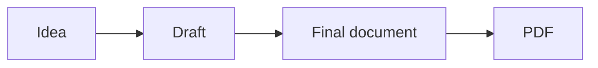
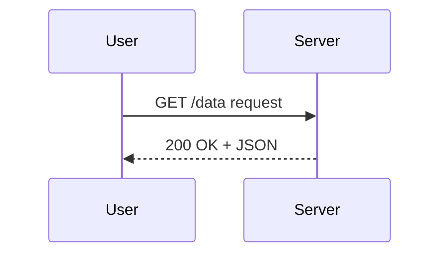
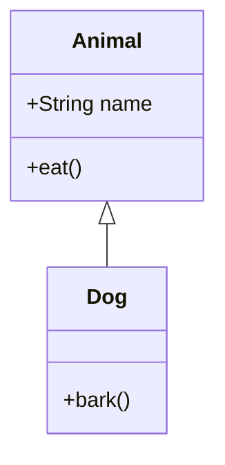
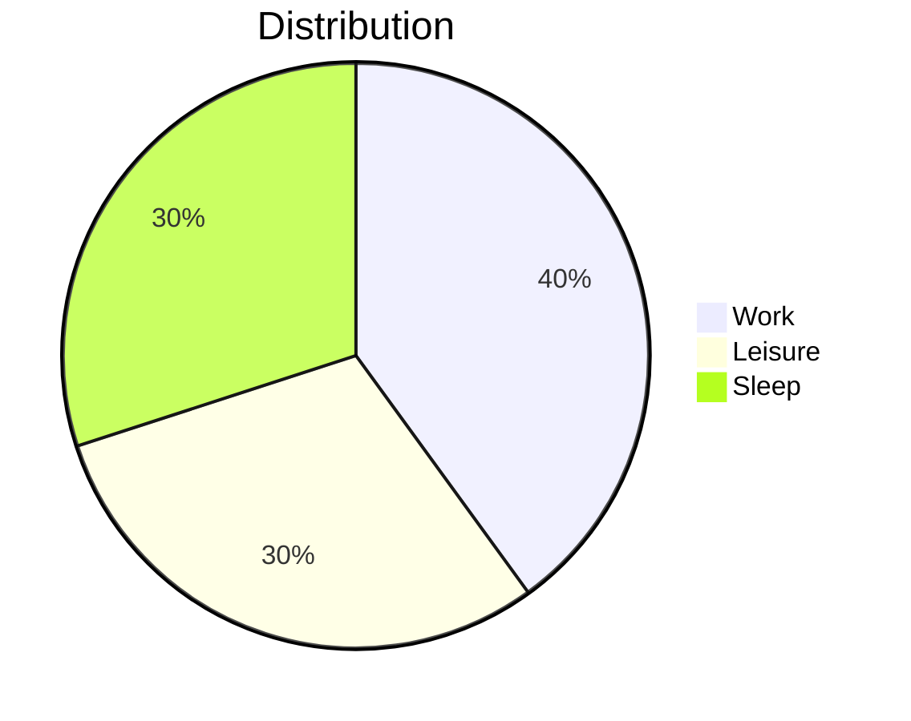

# Welcome to markpage

**markpage** is an editor that produces PDFs ready to print or share.
You write almost plain text, and the app takes care of the layout.

You are currently reading this tutorial **inside the editor** — it is
itself a markpage document. Feel free to edit it, or start with a
blank page.

The **Help** button (yellow background) reopens this help page any
time, without touching your own document.

## Getting started \label{sec:start}

You only need **five or six tools** to write most documents. Follow
this tutorial step by step — the idea is that you write your first
document as you read.

### The principle

markpage uses a convention called **Markdown**. You write almost plain
text with **a few simple marks** that indicate formatting. No menus to
learn, no required shortcuts.

To give you an idea, this tutorial itself is written in Markdown. On
the right you see the typeset version (clicking **Preview**), and
here on the left you see the "real" source. You can look at the
left side any time to see "how it's done".

### Go ahead, write your first document

Select all the editor content (`Cmd/Ctrl + A`) and delete. The page
is blank. Let's go.

### The main title

On the first line, type a hash (`#`), a space, then the title of your
document:

```
# My first document
```

That's it. The `#` at the start of the line means *"what follows is
a heading"*. Just one line, no period at the end, no closing — you
just go to the next line when you're done.

> **Note**: this first `#` heading of the document acts as the
> **cover page** in the PDF (centred, followed by author,
> organisation and date if you fill them in under **Settings**). Your
> internal sections should therefore use `##` (two hashes) or `###`
> (three) instead.

### A section

Skip a line, then type two hashes followed by your section title:

```
## Introduction
```

### Some text

Below the heading, type your paragraph normally, like in an email.
Skip a blank line to start a new paragraph.

### Emphasis: *italic* and **bold**

To put a word in *italic*, surround it with **one** asterisk:

```
The word *important* is in italic.
```

For **bold**, surround it with **two** asterisks:

```
The word **important** is in bold.
```

> **Tip**: if asterisks feel tedious to type, select the word and
> press `Cmd/Ctrl + I` for italic or `Cmd/Ctrl + B` for bold — just
> like in Word. The result is exactly the same.

### A sub-section

Three hashes for a deeper heading level:

```
### My main ideas
```

You can go down to six hashes, but in practice three is enough for
most documents.

### Inserting an image

Three options:

1. **Drag-and-drop** an image from your desktop straight into the
   editor.
2. **Paste** a screenshot (`Cmd/Ctrl + V` after capturing it).
3. **Style** button in the toolbar → *"Insert image…"*.

The image is automatically resized and compressed (2000 px max on
each side), and gets inserted at the cursor position.

### The toolbar \label{sec:toolbar}

At the top of the screen, a handful of buttons:

- **My doc ▾** — shows the current document's name; opens the list
  of your documents, lets you create / rename / duplicate / delete.
- **Import** — adds a file (`.md`, `.txt`, `.html`, `.docx`) as a
  new document, without touching the current one.
- **Style ▾** — a formatting menu (headings, bold, lists, insert
  image…). **Right-clicking** in the editor opens the same menu.
- **Help** (yellow) — opens this tutorial.
- **Preview** — toggles between editor and paginated rendering.
- **Export ▾** — produces a Markdown file (`.md`), a PDF, a LaTeX
  source (`.tex`), uploads to OneDrive, or generates a share link
  you can paste into email / chat (cf. *Exporting your document*
  below).
- **Settings ▾** — customise the PDF render (author, margins,
  fonts…). Opens in a **separate window** that you can place next
  to the preview to see each change in real time.

### Seeing the preview

You write in **editor** mode (plain text). To see what your document
will look like in the PDF, switch to **preview** mode:

- shortcut `Cmd/Ctrl + Enter`
- or click the **Preview** button

You see your document as it will be printed.

To go back to the editor, **click anywhere in the preview**: the
cursor lands right on the line you clicked. Handy: if you spot a
typo, click on it and you land straight on the word in the editor
to fix it. Or press `Cmd/Ctrl + Enter` again.

### Exporting to PDF \label{sec:pdf-export}

Click on **Export ▾** then **PDF (.pdf)**, or use the shortcut
`Cmd/Ctrl + P` directly.

The browser opens its print dialog. Choose:

- **Destination**: *Save as PDF*
- **Margins**: ⚠ **None** (see the box below)

Click **Save**, give the file a name, you're done.

> **⚠ Important — select "Margins: None"**
>
> In the print dialog, open "More settings" and pick **"Margins:
> None"**. Otherwise the browser adds its own margins on top of the
> ones markpage already handles, which shrinks the printable area
> and makes the content overflow. The margins visible in the PDF
> are **always** the ones you chose under **Settings**, never the
> ones from the print dialog.

### And that's it

You know how to write a document with markpage. Most notes, reports
and short articles need nothing more than these few tools.

If you need anything else — lists, quotes, tables, math formulas,
diagrams, callouts, footnotes, charts — the rest of this tutorial
documents every advanced feature. Read at your own pace, or go
write your document now and come back later.

---

## Going further \label{sec:further}

Everything that follows is **optional**. Pick what you need. Each
section is independent. This part gathers what you need to **write
a richer document**: more Markdown elements, callouts, footnotes,
tables, charts. For **scientific typography** (math formulas,
ligatures, inference rules) and **Mermaid diagrams**, see the next
part *Going even further*.

### More Markdown elements

#### Lists

**Bullet lists**: a dash (`-`) or an asterisk (`*`) at the start of
the line:

```
- First idea
- Second idea
- Third idea
```

**Numbered lists**: a number followed by a period:

```
1. First step
2. Second step
3. Third step
```

(The numbers you type don't matter — Markdown renumbers; you can
type them all as `1.`)

**Nested lists**: indent by four spaces or one tab for a sub-list:

```
- Main idea
    - Sub-idea
    - Another sub-idea
- Second idea
```

#### Quotes

A chevron (`>`) at the start of the line:

```
> What is conceived clearly is expressed clearly.
> — Boileau
```

#### Links

```
Visit [Boileau's site](https://example.com).
```

The bracketed text becomes clickable, pointing at the URL in
parentheses. Shortcut: select the text, `Cmd/Ctrl + K`, paste the
URL.

#### Horizontal rules

Three dashes on a line of their own:

```
---
```

#### Inline code and code blocks

For **inline code** in a paragraph, surround it with backticks:
`` `let x = 42` `` gives `let x = 42`.

For an **entire code block**, surround it with three backticks each
on its own line:

````
```
function add(a, b) {
    return a + b;
}
```
````

#### Task lists

A checklist: dash, space, then `[ ]` (to do) or `[x]` (done):

```
- [x] Write draft
- [x] Proofread
- [ ] Send to the committee
- [ ] Prepare final version
```

The boxes are **purely visual**: to check / uncheck, edit the
`[ ]` to `[x]` directly in the markdown.

#### Simple tables

Classic Markdown for small tables:

```
| Name   | Age |
|--------|-----|
| Alice  | 32  |
| Bob    | 27  |
```

(For **dense data tables**, see the *Data tables (CSV / TSV)*
section below.)

### Managing multiple documents \label{sec:multi-doc}

markpage keeps **all your documents** in the browser. The list lives
behind the **My doc ▾** button, which also shows the name of the
document you're currently editing.

#### The My doc ▾ menu

- **Rename the current doc**: click in the field at the top of the
  menu, type, confirm with Enter. (Esc cancels.)
- **+ New document**: creates an empty document and switches to it.
  The previous doc stays in place, you can come back to it at any
  time.
- **Reload**: to the right of the name field, reloads the current
  doc from a file on disk (handy when the file has been modified by
  an external editor). The doc's name in markpage is preserved; only
  the content is replaced.
- **List of other documents**: sorted by modification date. Click
  a name to open it. On hover, four actions appear:
  - *Rename* — edits the name directly in the list.
  - *Reload* — replaces the content from a file on disk.
  - *Duplicate* — clones the document.
  - *Delete* — with a confirmation prompt.

#### Importing a file

The **Import** button (shortcut `Cmd/Ctrl + O`) adds an external
file as a **new document** in the list, without touching the one
you're working on. Accepted formats: `.md`, `.txt`, `.html`, `.docx`
(Word).

> **Note about Word files**: when importing a `.docx`, the text,
> headings, lists, bold/italic, links and quotes are recovered, but
> **not the images**. If your Word document contained photos, you'll
> need to re-insert them manually after import.

#### Exporting your document

The **Export ▾** button offers several options:

| Option | Shortcut | Effect |
|---|---|---|
| **Markdown (.md)** | `Cmd/Ctrl + S` | Downloads your document as Markdown |
| **PDF (.pdf)** | `Cmd/Ctrl + P` | Produces the final PDF |
| **LaTeX (.tex)** | — | Produces a LaTeX source compilable with `xelatex` |
| **OneDrive…** | — | Uploads the `.md` to your OneDrive (`Apps/markpage/` folder) and copies an anonymous share link |
| **Copy share link** | — | Encodes the document into a `?import=…` URL ready to paste into Slack / email / SMS |
| **Send by email** | — | Same URL, opened in your mail client with the link pre-filled |

The **Markdown** format (`.md`) is an open, plain-text format,
readable anywhere. You can send it to someone who doesn't use
markpage — they'll open it in any text editor.

The **LaTeX** format (`.tex`) is useful when you want to fine-tune
the layout with a LaTeX compiler, or submit your document to a
journal that requires `.tex` sources. When your document contains
images or diagrams (mermaid, chart), the download is a **`.zip`
file** containing the `.tex` and an `images/` directory. Compile
with:

```
xelatex --shell-escape your-document.tex
```

(`--shell-escape` is only needed when the document contains
diagrams, and requires `inkscape` to be installed.) The header
comment in the `.tex` reminds you of these prerequisites.

**OneDrive** asks for a Microsoft sign-in on first use (OAuth
popup, scope `Files.ReadWrite.AppFolder` — markpage only ever sees
the `Apps/markpage/` folder, not the rest of your Drive). The
generated share link is anonymous and view-only: anyone you give
it to can download the `.md`, but no one can modify it in your
OneDrive.

**The share link** is a self-contained URL: the whole document
(text + base64-inlined images) is gzip-compressed and packed into
the URL itself. No server, no account required. The recipient
opens the link in their browser and the document is auto-imported
as a fresh local document in their markpage. Cap: ~8 KB payload
(≈ 5-10 pages of normal Markdown) — beyond that, use OneDrive
instead.

The exported filename matches your document's name (the one shown
on **My doc ▾**).

Your work is **saved automatically** in the browser, so if you
close the tab by mistake, everything is recovered the next time
you open it.

### Customising the PDF render (Settings) \label{sec:settings}

The **Settings ▾** button (shortcut `Cmd/Ctrl + ,`) opens a
**separate window** where you can configure the PDF without touching
the content. **Tip**: switch to Preview mode first, open Settings,
place the window next to the preview — every change reflects in
real time on the paginated document.

The window is organised into several **cards** grouped in a side
rail by theme: *Document* (author, date, format, header, footer),
*Layout* (presets, margins, duplex, notes), *Typography* (fonts,
matching packs, per-element styling), *Content* (math, Mermaid
diagrams).

The sections below cover the main levers.

#### Page format, margins and canon \label{sec:layout}

The **Layout** card gathers the page format, margin mode (manual
or derived) and ready-to-use presets.

- **Page format**: A4, A5, Letter, Legal, B5, A3, plus **Slides
  16:9** for a Beamer-style presentation PDF (see *Slides mode*
  below).

- **Presets**: five coherent combos to get going in one click; each
  preset sets margins, line measure, duplex mode and note placement
  in one go.
  - *Tech note* — derived margins, ~70-character measure, simplex,
    footnotes.
  - *Report* — derived margins, ~66-character measure, simplex
    (sober default).
  - *Paper* — derived margins, ~68-character measure, notes
    collected at end of document.
  - *Book* — derived margins, ~60-character measure, **duplex**,
    new chapter on a recto.
  - *Critical edition* — wide derived margins, ~52-character measure,
    duplex, **margin notes** Tufte-style.

  Tweaking any one lever after picking a preset flips the dropdown
  to "Custom".

- **Margin mode**. Two modes.
  - *Manual* — the four Top / Bottom / Left / Right fields (in
    millimetres) are editable and the result depends solely on your
    values.
  - *Derived* — markpage computes the margins from the Van de Graaf
    construction (the book canon). You set the **line measure**
    (`measureChars`, the number of characters wide a body line is —
    ideally between 45 and 75 for readability, cf. Bringhurst) and
    the **live-area width** (`liveAreaChars`, wider than the
    measure: it holds the header, footer and margin notes). The
    text block and the live area are then two rectangles similar to
    the page, on the same diagonals — the inner/outer ratio is 1:2,
    same for top/bottom. The manual sliders are disabled (the values
    shown are advisory).

- **Duplex (recto-verso)**: checkbox. Enables a two-page layout
  (recto on the right, verso on the left) with automatic
  inner/outer margin mirroring. The cover (page 1) stays alone on
  the right in the preview, then spreads follow. In the preview
  you actually see the two facing pages side by side with the
  spine in the middle.

- **Chapter break**: three options for what happens at each `# H1`
  heading.
  - *None* — the heading follows the flow.
  - *Next page* (`next-page`) — every `h1` starts on a new page.
  - *Next recto* (`next-recto`) — every `h1` starts on a recto
    (insert a blank page if needed). Book convention.

- **Notes**: *foot* (per-page, default), *side* (Tufte style,
  derived margins required), or *end* (end of document). See the
  *Notes* section below.

> **💡 Visual margin overlay** — Toggle the debug overlay with the
> **Guides** button in the toolbar, or the `Cmd/Ctrl + Shift + G`
> shortcut. Three rectangles appear on every page: the page outline
> (grey), the live area (green) and the text block (orange), plus
> the canon diagonals. Handy to see where your headers, footers and
> notes actually land. Toggle again to hide.

#### Header and footer \label{sec:running}

To show a header, a footer or a page number, two complementary
mechanisms:

**The two Settings fields** "Default header" and "Default footer"
in the *Page* card. They apply to the whole document unless a fence
in the markdown overrides them (see below). The syntax is the same
as a fence body: three slots separated by `|`. By default the footer
holds a centered page counter: ` | {page} | `.

**The `\`\`\`header` / `\`\`\`footer` fences** in the document
itself. They take effect from their position in the source until
the end of the document (or until the next fence of the same kind),
and **override** the Settings default for the matching band. Three
slots:

````markdown
```header
left | centre | right
```
````

Example: a header with the document title on the right, and a
footer with a page counter on the right and the date on the left:

````markdown
```header
 |  | {title}
```

```footer
{date} |  | page {page} / {pages}
```
````

**Variables available** inside slots:

- `{page}` — current page number.
- `{pages}` — total page count.
- `{title}` — text of the most recent `# H1` crossed (useful for a
  running chapter title in the header).
- `{date}` — document date (as set in Settings).

**Inline formatting** in slots:

- `**text**` — bold.
- `*text*` — italic.
- `***text***` — bold italic.

You can mix fixed text and variables:
`Welcome to **markpage** | | {page} / {pages}`.

**Typography** of headers/footers: *Typography* card → *Header /
footer*. Font, size, colour, weight, italic — defaults aim for a
light grey (`#57606a`, ~9 pt) so they don't compete with the body
text.

> ⚠ Limitation: a slot that combines **both** a variable
> (`{page}`) **and** mid-slot emphasis (`Page **{page}**`) renders
> the asterisks literally. To bold the counter, wrap the **whole**
> slot in asterisks (`**{page}**`).

#### Notes: foot of page, margin, end of document \label{sec:notes-modes}

The **Notes** field (*Layout* card) controls where Pandoc notes
(`[^id]` + definition, see *Footnotes* below for the syntax) land.

- *Foot of page* (`foot`, default) — each note is placed
  **automatically at the foot of the page** that holds its anchor,
  like in a printed book. The body marker and the foot-of-page
  number are generated and numbered by paged.js.

- *In the margin* (`side`) — each note slides into the outer
  gutter, at the height of its anchor (Tufte CSS). The number
  shows as both an in-body superscript and a small superscript at
  the start of the note. **Requires derived margin mode** (markpage
  needs to know the gutter width to place the note); in manual
  mode this setting falls back to *end of document*.

- *End of document* (`end`) — all notes are gathered at the end of
  the document in a numbered *Notes* section.

#### Margin figures \label{sec:margin-figures}

In derived margin mode (outer gutter known) you can drop a figure
into the margin with the Pandoc attribute syntax:

```
{.margin}
```

The image aligns in the outer gutter (right on recto, left on
verso in duplex), at the height of the paragraph that holds it.
Its width is capped to the gutter width so it doesn't overflow.
The `.margin` class only affects placement — you can combine it
with a caption: `{.margin}`.

#### Typography \label{sec:typography}

The *Typography* card — global and per-element levers.

- **Fonts** for headings, body and code — picked from a catalogue of
  ~17 Google Fonts (Inter, EB Garamond, JetBrains Mono…). Fonts
  are loaded on demand; first use needs a connection, after that
  the browser caches them. Roboto Condensed and Roboto Mono are
  bundled and work offline. *Note: the editor itself always keeps
  Roboto Condensed / Mono regardless of your choices — the
  input zone's appearance doesn't change.*

- **Matching pack** — a dropdown above the three font selectors that
  aligns all four font slots (headings / body / code / math font)
  to a pre-coordinated pack in one click. Three packs ship by
  default: *Roboto Condensed + NewCM* (the historical default),
  *Fira Sans + Fira Math* (modern sans-serif, recommended for
  math-heavy documents), *STIX Two + STIX Math* (large-x-height
  serif for long academic texts). Tweaking any single slot
  switches the dropdown to "Custom".

- **Custom Google Fonts** — for a family outside the catalogue,
  paste the Google Fonts URL (for example
  `https://fonts.googleapis.com/css2?family=Tangerine:wght@400;700&display=swap`)
  into the "+ Add" field, confirm. The font appears immediately
  in all three pickers (Headings / Body / Code) and can be removed
  with a click on the cross on its chip.

- **Spacing** — three ratios that control the document's vertical
  density:
  - *Above / below headings* (default `1.6` / `0.6`):
    space above a heading of size T equals `ratio × T`.
    Deliberately asymmetric — more air above, so the heading
    "belongs" to the section that follows.
  - *Between paragraphs* (default `1.0`): symmetric margin
    applied to each paragraph.

- **Per element** (title, h1 to h4, body, inline code, code block,
  quote, link, metadata, math block, callout, Mermaid, table,
  caption, **header / footer**): for each, size, colour, **weight**
  (Light / Regular / Medium / Semibold / Bold), **italic**, and
  depending on the type a **border**, **background**, **above /
  below margin**. If the chosen font doesn't ship the requested
  weight or italic cut, the browser *synthesises* a fake bold /
  italic, usually less pretty — the fix is to pick a more complete
  font, or to include the desired weight in your custom Google
  Fonts URL.

- **Justification** of text and **line spacing** in the *Body*
  sub-card.

- **Mermaid diagrams** (*Content* card): max upscale, max width, max
  height (cf. *Mermaid diagrams* section below).

- **Math formulas** (*Content* card):
  - *Math font* — five math fonts to pick from: NewComputerModern
    (default, TeX serif), Fira Math (sans-serif, pairs with Roboto /
    Fira Sans), STIX 2 or Asana (modern serifs), or classic TeX.
  - *Formula scale* (50-200 %, default 100 %) — adjusts the size of
    MathJax glyphs to match the visual size of the body font (some
    large-x-height fonts make formulas look too small).

Settings are **remembered between sessions**. To revert to the
default values, open the **Profile** menu at the top of the Settings
window (cf. next section) and click *Reset*.

### Multiple settings profiles

You can keep **several settings sets** under different names — for
example a "Research article" profile that's sober, a "Course notes"
profile that's airy, an "A5 slides" third one — and switch between
them in one click. Only one profile is active at a time and applies
to all your documents.

The current profile's dropdown lives **at the top of the Settings
window**, next to the title. It shows the active profile's name
followed by `▾`.

Inside the menu:

- **The current name is editable** at the top. Type, confirm with
  `Enter`, the profile is renamed.
- **+ New profile** creates a profile starting from a copy of the
  current settings (useful for testing a variant without breaking
  the existing one) and switches to it.
- **The list below** shows the other profiles. **One click =
  switch** to that profile. The preview and PDF adapt
  immediately.
- At the **bottom of the menu**, three actions apply to the
  **current profile only**:
  - *Duplicate* — creates a copy named "Copy of …" and switches
    to it.
  - *Delete* (with confirmation) — disabled if only one profile is
    left; the most recent remaining profile becomes the new
    current.
  - *Reset* — reverts to the default values **without changing the
    name**, equivalent of the historical Reset button.
- **Import…** opens a `.json` file picker (a colleague's profile
  export, for example). **Export…** downloads the current profile
  as `<profile-name>.json`. The format is self-contained and human-
  readable if needed.

### Slides mode (16:9 presentation) \label{sec:slides}

markpage can produce a **Beamer-style presentation PDF**: landscape
16:9 page format (A4 width, so 210 × 118.1 mm), and **every
`## section heading` starts a new slide**. The `# document title`
remains the title slide.

Two ways to opt in:

- **Settings → Page → Format = Slides 16:9** — applies to every doc
  in the current profile. Best suited to a dedicated "Slides"
  profile.
- **Per-document YAML frontmatter** — handy when a single doc
  should be slides without rebinding your profile:

```yaml
---
title: My talk
slides: true
---
```

The frontmatter `slides: true` overrides whatever format was picked
in the settings.

Minimal example:

```markdown
---
title: Block-diagram algebras
slides: true
---

## Motivation

The Faust language rests on five binary operators…

## The operators

- `~` recursion
- `,` parallel
- `:` sequential
- `<:` split
- `:>` merge

## Demo
\`\`\`bda
1 : +~_
\`\`\`
```

Three slides: title (auto), Motivation, The operators, Demo.

**Everything else works** as in a regular document: captions,
cross-refs, MathJax formulas, `mermaid` / `category` / `bda` /
`chart` blocks — you get the same typography on slides.

**Practical tip**: create a dedicated settings profile for slides
(larger body size, sans-serif fonts tuned for projection, more
generous margins). You then keep your "document" and "slides"
profiles separate and switch as needed.

**`demo` fence**: for teaching slides, the ` ```demo` fence shows
the markdown source side-by-side with its rendered output.
Auto-zoom resizes both panes so they fit the slide.

```markdown
\`\`\`demo
\`\`\`bda "Accumulator"
1 : +~_
\`\`\`
\`\`\`
```

*Caveat*: avoid opening a `demo` with a prose sentence followed
by a rigid block (code, diagram, displayed equation). The layout
then has to balance a wrappable element against a rigid one and
the result is less clean. Put the showcased block first.

### Special characters and symbols

Arrows (→, ←, ↑, ↓), math operators (≤, ≥, ≠), miscellaneous
symbols (★, ♥, ✓) are handled correctly, on screen as in the PDF.

### Numbering sections \label{sec:numbering}

To number the headings of a long document without configuring a
menu, just **show the example on the first heading of each level**:
the **Number sections** command (`Cmd/Ctrl + Shift + N`, or the
**Style** menu → *Number sections*) detects the numbering style you
wrote, then applies it to all other headings of the same level.

Example. You write:

```
# 1. Introduction

## 1.1 Context

## Goals

# Method

## Data

# Results
```

…you run the command, and the document becomes:

```
# 1. Introduction

## 1.1 Context

## 1.2 Goals

# 2. Method

## 2.1 Data

# 3. Results
```

The first `#` (h1) announces a flat decimal style (`1.`); the first
`##` (h2) announces a hierarchical style (`1.1`). The command
remembers and applies. If your first heading has no numbering, that
level won't be numbered at all, and any numeric prefix on later
headings at that level is removed (cleanup pass).

**Recognised styles** per level:

| First heading | Style applied |
|---|---|
| `# 1. Foo` | `1.`, `2.`, `3.`, … |
| `# 1) Foo` | `1)`, `2)`, `3)`, … |
| `# (1) Foo` | `(1)`, `(2)`, `(3)`, … |
| `# A. Foo` | `A.`, `B.`, …, `Z.`, `AA.` |
| `# a. Foo` | `a.`, `b.`, … |
| `# I. Foo` | `I.`, `II.`, `III.`, … |
| `# i. Foo` | `i.`, `ii.`, … |
| `## 1.1 Foo` | hierarchical: `1.1`, `1.2`, `2.1`, … |
| `## 1.1. Foo` | hierarchical with trailing period |
| (no prefix) | no numbering for that level |

Hierarchical numbering needs every parent level to be numbered
itself.

### Data tables (CSV / TSV)

For a dense table, writing the pipe-style syntax by hand is
tedious. You can instead paste a **CSV** or a **TSV** in a *fenced
block*:

````
```csv
Note, Concert pitch (Hz), MIDI
A4,    440.00, 69
A#4,   466.16, 70
B4,    493.88, 71
```
````

The **separator** is a comma for `csv`, a tab for `tsv`. The
**first line** becomes the table header, the following ones the
data.

If one of your cells contains the separator (for example a comma
in a name), surround it with double quotes:

````
```csv
Name, Description
"Doe, John", "Author, founder"
```
````

To insert a literal quote in a quoted cell, double it: `""`.

### Definition lists

For a list of **terms with their definitions** (glossary, notation,
dictionary), use the Pandoc syntax: a term on one line, then its
definition on the next line prefixed by `:` and at least one space.

```
DAG
:   Directed Acyclic Graph — a directed graph with no cycle.

FFT
:   Fast Fourier Transform, the $O(n \log n)$ algorithm by
    Cooley & Tukey.
```

Several definitions for the same term: add other `:` lines below.

```
Polynomial
:   An expression of the form $a_0 + a_1 x + \dots + a_n x^n$.
:   An object of the Faust language that represents the same thing.
```

Inside terms and definitions you can use inline Markdown (bold,
italic, code, formulas, links).

### Footnotes \label{sec:footnotes}

You can add a **footnote** with the Pandoc syntax: a footnote call
`[^id]` in the text, and the definition `[^id]: content` anywhere
in the document (usually at the end).

```
The discrete Fourier transform[^dft] is the base tool for
analysing a digital signal.

[^dft]: See Cooley & Tukey (1965) for the fast algorithm.
```

The `id` identifier can be a number, a word, or a short label — it
only serves to link the call to its definition, and never appears
in the render. Footnotes are **numbered automatically** in the
order they appear in the text (not in the order of the definitions).

**The placement** depends on the *Notes* setting (*Layout* card):
*foot of page* (default, each note at the foot of the page that
holds its anchor), *in the margin* (outer gutter, at anchor height
— Tufte style), or *end of document*. See the *Notes: foot of
page, margin, end of document* section above for the three modes.

Inside a footnote you can use **`bold`**, *italic*, `inline code`,
links, or even `$math$`. The same footnote can be referenced
several times — all the occurrences point to the same entry.

Clicking on the call `¹` jumps to the note; clicking on the `↩` at
the end of the note returns to the call.

### Citations \label{sec:citations}

To cite a paper or a book, use the **Pandoc-lite syntax**: `[@key]`
in the text, with the definition `[@key]: reference text` at the
end of the document.

```
Quicksort runs in $O(n \log n)$ on average[@hoare1962], but
degrades to $O(n^2)$ on already-sorted input without a randomised
pivot[@sedgewick1978].

[@hoare1962]: Hoare, C. A. R. (1962). *Quicksort*. The Computer Journal 5(1), 10-16.
[@sedgewick1978]: Sedgewick, R. (1978). *Implementing Quicksort programs*. CACM 21(10), 847-857.
```

The rendering: each call becomes `[1]`, `[2]`, … numbered in order
of appearance (a repeated reference keeps its number). A
**References** section is generated at the end of the document
with the definitions, in citation order, each with a `↩` back-link
to the call.

Keys accept letters, digits, and `_:.-` (BibTeX-friendly). A
reference to an undefined key stays as literal text in the render
— avoids blank `[N]` markers on typos.

The reference text is written in Markdown: you keep control of the
format (italic for the title, bold for the author, …). No
automated CSL / APA / IEEE formatting.

### Cross-references \label{sec:xrefs}

To write "see the \ref{sec:math} section" or "cf. algorithm 1"
without copying numbers by hand, attach a **`\label{key}`** to your
target and reference it from anywhere in the document with
**`\ref{key}`**:

- on a **heading**: `## Settings \label{sec:settings}`
- on a **captioned block** (figure, table, algorithm, listing):
  `\label{}` after the caption — ` ```algorithm "Quicksort" \label{alg:sort} `
- on a **display equation**: `\label{}` inside the `$$ … $$` —
  automatically triggers right-side numbering (`amsmath` style)

`\ref{key}` adapts its output to the kind of target:

- **Section** → the heading text itself (markpage sections aren't
  numbered by default, so a number would be meaningless). Example:
  "see \ref{sec:settings}" becomes "see *Customising the PDF render
  (Settings)*", clickable.
- **Figure / table / algorithm / listing / equation** → the number
  assigned by their caption or `\tag` (always shown next to the
  target). Example: "algorithm \ref{alg:sort}" → "algorithm 2".

You write the **lead-in word** ("see", "algorithm", "equation", …)
yourself — the engine only provides the number or the title, which
keeps the grammar natural.

> **Key conventions.** Anything goes, but the `sec:`, `fig:`, `tab:`,
> `alg:`, `lst:`, `eq:` prefixes are classic LaTeX usage: a glance
> tells you the kind of target, and the names stay unique across
> kinds.

**Broken reference.** A `\ref{nonexistent-key}` renders as a red
`[?]` with a tooltip ("référence inconnue: …") — you spot the typo
right away, no silent failure in the PDF.

> **This help page itself.** All the major sections are labelled:
> `sec:start`, `sec:toolbar`, `sec:settings`, `sec:math`,
> `sec:mermaid`, etc. So you can reference them from your own
> documents to point at a piece of the documentation.

### Callouts (notes, theorems…) \label{sec:callouts}

You can highlight a passage with a **callout**: open with `:::`
followed by the callout name, write your content, close with `:::`
alone on a line. This is the Pandoc *fenced div* syntax.

```
::: warning
Careful, this operation is irreversible.
:::
```

The recognised callout names fall in two families:

- **Generic** (coloured frame, tinted background):
  `note` (blue), `tip` (green), `warning` (orange), `caution` (red),
  `important` (purple).
- **Academic** (plain frame, italic title, LaTeX-like):
  `theorem`, `lemma`, `proposition`, `corollary`, `definition`,
  `proof`, `example`, `remark`.

You can add a **title** in brackets after the name:

```
::: theorem [Pythagoras]
In a right triangle, the square of the hypotenuse equals the sum
of the squares of the other two sides.
:::
```

…displays with the title **"Theorem — Pythagoras"**.

If you write a callout with a name that isn't in the list above
(for example `::: aside`), it's rendered with a neutral frame —
useful for your own conventions.

The inside of a callout is Markdown like the rest: formatted text,
lists, formulas, even tables.

### Charts \label{sec:charts}

To draw a curve or chart from data, use a `chart` *fenced block*:

````
```chart line "Latency by buffer size"
buffer, latency (ms)
64,  12
128,  8
256,  5
512,  3
1024, 2
```
````

Available types are **`line`** (curve) and **`bar`** (histogram).
The quoted title after the type is optional.

The **first line** gives the headers: the first column becomes the
X-axis label, the following columns become as many **data series**
(each one its colour, and an automatic legend if more than one
series).

The following **data lines** contain the values. If the first
column is numeric, the X axis is continuous; if it contains text
labels (months, categories…), the X axis is categorical.

#### CSV format: French commas

The field separator is **auto-detected** on the first line:

- if there is a tab → separator = tab,
- otherwise if there is a semicolon → separator = `;`,
- otherwise → separator = `,`.

When the separator is `,`, **commas between two digits** (with no
space around them) are recognised as **decimal commas**, so `3,14`
stays a single number. The separating comma is then written
followed by a space: `foo, 3,14` gives two cells `foo` and `3,14`.

For rare ambiguous cases (`1,2,3,4` compact), switch to `;` or to
TSV — or add spaces: `1, 2, 3, 4`.

Numbers in cells accept both formats (period or decimal comma) —
`3.14` and `3,14` are equivalent.

#### Time series

If the first column contains **ISO 8601 dates** (`YYYY-MM-DD`,
optionally with a time), the X axis is treated as a time scale.
The app picks appropriate ticks automatically (day, month or year
depending on the range):

````
```chart line "Downloads"
date, total
2025-01-15, 120
2025-02-15, 180
2025-03-15, 245
2025-04-15, 310
```
````

Ambiguous formats (FR `15/01/2025` and US `01/15/2025`) are **not**
recognised — always use ISO 8601, which is unambiguous.

#### Multiple series

````
```chart bar "Codec comparison"
Codec, Size (KB), Time (ms)
MP3, 4200, 120
Opus, 3800, 95
FLAC, 12500, 280
```
````

Two side-by-side bars per category, with a legend at the top right
identifying each series.

---

## Going even further \label{sec:expert}

This last part gathers **more specialised tools**: input ligatures
that make mathematical Unicode comfortable to type, LaTeX formulas,
inference rules, and Mermaid diagrams (flowcharts, sequences,
states, etc., each with its own syntax). If you're writing a
research article, a course, an algorithm spec, or technical
documentation, you'll find what you need here. Otherwise you can
skip straight to Credits.

### YAML frontmatter \label{sec:frontmatter}

At the top of a document, you can insert a **YAML block** (between
two `---` lines) that overrides the profile metadata for that
specific document:

```yaml
---
title: A study of finite automata
author: Alice Dupont
organization: Université de Lyon
date: 2026-05-21
mathjax-preamble: |
  \newcommand{\R}{\mathbb{R}}
  \newcommand{\sem}[1]{\llbracket #1 \rrbracket}
---
```

Recognised keys:

- **`title`** — the document title. Rendered large, centred, styled
  via *Settings → Typography → Document title*. When this key is
  present, the `# Heading`s in the body act as **real section
  headings** (left-aligned, more discreet, styled via *Heading 1*),
  instead of being promoted to the title role.
- **`author`**, **`organization`**, **`date`** — override the
  matching profile fields. Handy for a co-authored document, or a
  document dated differently from the profile default.
- **`mathjax-preamble`** — TeX source (multi-line via `|`) pasted
  before **every** MathJax formula in the document. Ideal for
  defining once `\newcommand{\R}{\mathbb{R}}` and using it in every
  formula without repeating the definition.
- **`slides`** — `true` to produce a 16:9 presentation PDF where
  every `## heading` starts a new slide (see *\ref{sec:slides}*).
  Forces `pageSize` to `SLIDES_16_9` regardless of the active
  profile's setting.

The block is fully optional — a document without frontmatter keeps
working as before, with the first `#` in the body promoted to the
document title automatically.

### Input ligatures

To save you from looking up each Unicode symbol in a character
table, the editor **replaces on the fly** certain ASCII sequences
with their mathematical equivalent. Two mechanics coexist:

**Short symbol sequences** are replaced as soon as they're complete:

| Type | Get | Type | Get |
|---|---|---|---|
| `[[` |  | `]]` |  |
| `->` | → | `<-` | ← |
| `=>` | ⇒ | | |
| `<=` | ≤ | `>=` | ≥ |
| `!=` | ≠ | `+-` | ± |
| `\|-` | ⊢ | `-\|` | ⊣ |
| `...` | … | | |

> The **angle brackets** `⟨` and `⟩` are only available via `\langle`
> and `\rangle` (see below). No `<<` / `>>` ligature — those stay
> available literally (useful for bit-shift operators in code, etc.).

**LaTeX commands** (`\xxx`) wait for a **terminator character**
(space, punctuation, operator, newline) before firing. Type `\alpha`
then a space: the space stays, and `\alpha` is replaced by α. This
rule lets overlapping names (`\in`, `\int`, `\infty`; `\subset`,
`\subseteq`) coexist without a shorter prefix shadowing a longer
command.

**Greek letters**:

| Type | Get | Type | Get | Type | Get |
|---|---|---|---|---|---|
| `\alpha` | α | `\iota` | ι | `\rho` | ρ |
| `\beta` | β | `\kappa` | κ | `\sigma` | σ |
| `\gamma` | γ | `\lambda` | λ | `\tau` | τ |
| `\delta` | δ | `\mu` | μ | `\upsilon` | υ |
| `\epsilon` | ϵ | `\nu` | ν | `\phi` | ϕ |
| `\zeta` | ζ | `\xi` | ξ | `\chi` | χ |
| `\eta` | η | `\omicron` | ο | `\psi` | ψ |
| `\theta` | θ | `\pi` | π | `\omega` | ω |

Typographic variants:
`\varepsilon` ε, `\varphi` φ, `\vartheta` ϑ, `\varpi` ϖ, `\varrho` ϱ,
`\varsigma` ς.

Uppercase (only those that differ from Latin):
`\Gamma` Γ, `\Delta` Δ, `\Theta` Θ, `\Lambda` Λ, `\Xi` Ξ, `\Pi` Π,
`\Sigma` Σ, `\Upsilon` Υ, `\Phi` Φ, `\Psi` Ψ, `\Omega` Ω.

**Set theory & quantifiers**:
`\in` ∈, `\notin` ∉, `\subset` ⊂, `\supset` ⊃, `\subseteq` ⊆,
`\supseteq` ⊇, `\cup` ∪, `\cap` ∩, `\emptyset` ∅, `\forall` ∀,
`\exists` ∃.

**Logic**: `\wedge` ∧, `\vee` ∨, `\neg` ¬.

**Relations**: `\approx` ≈, `\equiv` ≡, `\cong` ≅, `\sim` ∼,
`\propto` ∝, `\perp` ⊥, `\parallel` ∥.

**Operators**: `\oplus` ⊕, `\otimes` ⊗, `\circ` ∘, `\bullet` •,
`\cdot` ⋅, `\times` ×, `\div` ÷.

**Calculus**: `\partial` ∂, `\nabla` ∇, `\infty` ∞, `\sum` ∑,
`\prod` ∏, `\int` ∫, `\oint` ∮.

**Constants**: `\aleph` ℵ, `\hbar` ℏ.

**Ellipses**: `\cdots` ⋯, `\vdots` ⋮, `\ddots` ⋱, `\ldots` …

**Long arrows**: `\mapsto` ↦, `\Leftarrow` ⇐, `\Rightarrow` ⇒,
`\Leftrightarrow` ⇔.

**Angle brackets**: `\langle` ⟨, `\rangle` ⟩.

**Subscripts and superscripts** (digits only): `_0`…`_9` become ₀…₉
and `^0`…`^9` become ⁰…⁹. The negative form `^-1`…`^-9` produces
⁻¹…⁻⁹ (handy for inverses). Examples: `\pi_1` → π₁, `x_1` → x₁,
`f^-1` → f⁻¹, `e^2` → e². To avoid the ligature in the rare case
of an italic word ending in a digit (`_label_1_`), use asterisks
instead (`*label_1*`).

> To write a command **literally** in prose (for instance to document
> `\alpha`), double the backslash: `\\alpha` stays as-is in the
> source — and renders as `\alpha` in Markdown, which interprets
> `\\` as an escaped backslash. Inside a code block, ligatures are
> also disabled.

For **"blackboard bold" letters** (set symbols), `|` followed by
any uppercase letter gives its doubled version:

| Type | Get | Type | Get | Type | Get |
|---|---|---|---|---|---|
| `\|A` | 𝔸 | `\|J` | 𝕁 | `\|S` | 𝕊 |
| `\|B` | 𝔹 | `\|K` | 𝕂 | `\|T` | 𝕋 |
| `\|C` | ℂ | `\|L` | 𝕃 | `\|U` | 𝕌 |
| `\|D` | 𝔻 | `\|M` | 𝕄 | `\|V` | 𝕍 |
| `\|E` | 𝔼 | `\|N` | ℕ | `\|W` | 𝕎 |
| `\|F` | 𝔽 | `\|O` | 𝕆 | `\|X` | 𝕏 |
| `\|G` | 𝔾 | `\|P` | ℙ | `\|Y` | 𝕐 |
| `\|H` | ℍ | `\|Q` | ℚ | `\|Z` | ℤ |
| `\|I` | 𝕀 | `\|R` | ℝ | | |

The replacement modifies the document's **source** (not just the
display), so the Unicode characters are there if you copy the text
elsewhere.

To undo a ligature that fired when you wanted the literal text,
press `Cmd/Ctrl + Z` immediately after — the substitution is
undone, the ASCII text is restored.

### Math formulas \label{sec:math}

You can include **LaTeX formulas**, either **as a block** between
`$$ … $$` (the formula is centred on its own line), or **inline**
between `$ … $` in the middle of a sentence. Rendering uses
[MathJax](https://www.mathjax.org/) and produces a PDF of
professional typographic quality.

For blocks, you can also use a *fenced block* with the language
`math` — that's the GitHub convention and it avoids the `$$`
trap of requiring those marks alone on their line:

````
```math
x = \frac{-b \pm \sqrt{b^2 - 4ac}}{2a}
```
````

The render is strictly identical to `$$ … $$`.

#### Useful examples

**Sums and integrals**

```
$$
\sum_{i=1}^{n} i^2 = \frac{n(n+1)(2n+1)}{6}
\qquad
\int_{0}^{\infty} e^{-x^2}\,dx = \frac{\sqrt{\pi}}{2}
$$
```

$$
\sum_{i=1}^{n} i^2 = \frac{n(n+1)(2n+1)}{6}
\qquad
\int_{0}^{\infty} e^{-x^2}\,dx = \frac{\sqrt{\pi}}{2}
$$

**Matrix**

```
$$
A = \begin{pmatrix}
1 & 2 & 3 \\
4 & 5 & 6 \\
7 & 8 & 9
\end{pmatrix}
$$
```

$$
A = \begin{pmatrix}
1 & 2 & 3 \\
4 & 5 & 6 \\
7 & 8 & 9
\end{pmatrix}
$$

**Aligned equation system**

```
$$
\begin{align*}
f(x)   &= ax^2 + bx + c \\
f'(x)  &= 2ax + b \\
f''(x) &= 2a
\end{align*}
$$
```

$$
\begin{align*}
f(x)   &= ax^2 + bx + c \\
f'(x)  &= 2ax + b \\
f''(x) &= 2a
\end{align*}
$$

**Inline formula**: type for example
`Let $\epsilon > 0$ such that…` and you get:

Let $\epsilon > 0$ such that…

#### Things to know

- Formula size matches the current text size; if you change the
  **Body text** setting under **Settings**, formulas grow or shrink
  proportionally.
- If a formula is wider than the page's text area, it is
  automatically scaled down to fit.
- The usual LaTeX commands work: `\frac`, `\sqrt`, `\sum`, `\int`,
  `\lim`, `\vec`, `\partial`, Greek letters (`\alpha`, `\beta`, …),
  operators (`\pm`, `\times`, `\le`), arrows (`\to`,
  `\Rightarrow`), environments `pmatrix` / `bmatrix` / `align*`,
  etc.

### Inference rules \label{sec:inference}

To write an **inference rule** (logical deduction, operational
semantics, etc.), use a *fenced block* with the language
`inference`:

````
```inference (MP)
Γ ⊢ A; Γ ⊢ A → B
-------------------
Γ ⊢ B
```
````

The block is rendered as LaTeX `\dfrac{premises}{conclusion}` via
MathJax. A **line of dashes** (3 dashes or more, alone on its line)
separates the premises from the conclusion. Premises are separated
by `;` or split across several lines. The optional **label** in
parentheses after `inference` (here `(MP)` for modus ponens)
appears to the right of the bar.

Inside an `inference` block, **input ligatures** remain active —
you can type `|-`, `->`, `[[`, `|N`, etc. and get the Unicode
characters (⊢, →, , ℕ, …) directly, which MathJax knows how to
render in math mode as-is. It's the only exception to the usual
"ligatures disabled in code blocks" behaviour.

For LaTeX commands that have no Unicode equivalent in our ligatures
(for example `\Gamma`, `\forall`, `\exists`, `\Rightarrow`,
`\leq`), type them directly.

### Declarative category diagrams \label{sec:category}

For **commutative diagrams** (squares, triangles, pullbacks, equalizers,
universal properties), the ` ```category ` fence offers a simple
**declarative** syntax: each line declares a morphism in the standard
CS / math convention `f : A -> B`, and the engine computes the layout
automatically.

Commutative triangle:

````
```category
f : A -> B
g : B -> C
h : A -> C = g . f
```
````

The `= g . f` suffix declares `h` as a shortcut for the composition
`g ∘ f` — the typechecker validates commutativity before rendering,
and `h` is drawn as a secondary edge.

**Pullback** (cone over a cospan):

````
```category "Pullback universal property"
f  : A -> C
g  : B -> C
p1 : P -> A
p2 : P -> B
h  : X -> A
k  : X -> B
u  : X -> P by (h, k)

f . p1 = g . p2
p1 . u = h
p2 . u = k
```
````

The **`by (h, k)`** clause marks `u` as a **universal arrow**: it
exists and is unique by the property of `h` and `k`. The engine draws
it **dashed** (textbook convention for universal factorisations). The
following equations express the cone's commutativity.

**Keywords**:

| Form | Meaning |
| --- | --- |
| `f : A -> B` | morphism |
| `f : A -> B (mono)` | monomorphism (label suffixed `↣`) |
| `f : A -> B (epi)` | epimorphism (label suffixed `↠`) |
| `f : A -> B (iso)` | isomorphism (label suffixed `≅`) |
| `h : A -> B = g . f` | morphism + shortcut equation |
| `u : X -> P by (f, g)` | induced morphism (dashed render) |
| `g . f = h . k` | standalone equation (commutativity) |
| `direction: TB` | force layout direction (`TB`, `BT`, `LR`, `RL`) |
| `objects: T, X` | optional declaration (isolated objects or strict typo detection) |

**What the engine does for you**:

- **Object inference** from morphism endpoints — no need to list them.
- **Typechecking**: ill-typed compositions (`f . g` when
  `cod(g) ≠ dom(f)`) and equations whose sides don't share
  domain/codomain are rejected before rendering, with a positional
  diagnostic.
- **Automatic layout**: two-pass algorithm, optimising for horizontal
  and vertical arrows first, then expanding to a rotated frame
  (45° + scaling) if the topology requires it (pullback, pushout…).
  Edge labels positioned on the outside of the figure.
- **Captions and cross-refs** like any captionable block: `"Title"
  \label{fig:xxx}` after `category` numbers as `Figure N` and enables
  `\ref{fig:xxx}` elsewhere in the document.

**Editor input ligatures** (\pi → π, digit subscripts) are active
inside the block — `\pi_1` typed becomes `π₁` and the parser accepts
Unicode identifiers (Greek letters, subscripts, superscripts).

> **Full spec** in `CATEGORY-SPEC.md` at the repository root — EBNF
> grammar, typing semantics, rendering strategy, and a canonical
> corpus of ten diagrams (triangle, product, coproduct, naturality
> square, pullback, pushout, equalizer, coequalizer, functoriality,
> terminal object).

### Faust-style block diagrams (BDA) \label{sec:bda}

For **interconnected block diagrams** in the Faust style, the
` ```bda ` fence accepts an algebraic expression (the *Block-Diagram
Algebra* at the foundation of the Faust language) and lays it out
automatically, left to right.

An expression combines **primitives** (boxes) via **five binary
composition operators**:

| Op | Composition | Precedence | Associativity | Constraint |
| --- | --- | --- | --- | --- |
| `~` | recursion (feedback loop) | 4 (highest) | right | `inputs(A) ≥ outputs(B)` and `outputs(A) ≥ inputs(B)` |
| `,` | parallel | 3 | left | none |
| `:` | sequential | 2 | left | `outputs(A) = inputs(B)` |
| `<:` | split (fan-out) | 1 | left | `inputs(B)` is a positive multiple of `outputs(A)` |
| `:>` | merge (fan-in) | 1 | left | `outputs(A)` is a positive multiple of `inputs(B)` |

A **primitive** is characterised by its number of inputs and outputs
`(n, m)`. The fence accepts:

- **Identifiers** (`Foo`, `gain`, `Γ`…) — `(1, 1)` by default,
  otherwise annotated `Foo[n, m]`.
- **Quoted labels** for names with spaces or special characters:
  `"my filter"[2, 1]`.
- **Numbers** (`0`, `42`, `3.14`) — arity `(0, 1)`.
- **Arithmetic and comparison operators** `+ - * / % ^ < > <= >= == != & |` — arity `(2, 1)`.
- **1-arg math functions** `sin cos tan asin acos atan sinh cosh tanh exp log log10 sqrt abs floor ceil rint` — arity `(1, 1)`.
- **2-arg math functions** `min max pow atan2` — arity `(2, 1)`.
- **Structural primitives**: `_` (identity wire, `(1, 1)`) and `!`
  (cut, drops a signal, `(1, 0)`).

The **accumulator** is the canonical example — a counter that
increments on every sample, the Faust idiom `1 : + ~ _`:

````
```bda
1 : +~_
```
````

`+ ~ _` feeds the output of `+` (through the wire `_`) back into its
second input; the constant `1` feeds the first input each cycle.

**Multi-wire recursion**: for `A ~ B`, the typechecker requires
`inputs(A) ≥ outputs(B)` and `outputs(A) ≥ inputs(B)`; `B` is drawn
**rotated 180°** above `A` (Faust convention), letting the feedback
wires nest concentrically without crossings.

**Cross — a classic BDA idiom**: swap two signals via the split's
modulo, with redundant copies absorbed by `!` (rendered invisible):

````
```bda
_,_ <: !,_,_,!
```
````

**`z⁻¹` markers**: the `delays` option (alias `faust`) places a
small white square at each A→B fork, materialising the unit delay
implicit in `~`:

````
```bda delays "Faust accumulator"
1 : +~_
```
````

**Captions and cross-refs** work like any captionable block:
`"Title" \label{fig:xxx}` after `bda` (and before or after options
like `delays`) numbers the figure as `Figure N`, and `\ref{fig:xxx}`
refers to it elsewhere in the document.

### Mermaid diagrams \label{sec:mermaid}

[Mermaid](https://mermaid.js.org/) lets you describe a diagram with
a few lines of text. Place your code in a block whose language is
`mermaid`:

````

````

…and you get:


The diagram is rendered as **SVG**, both in the preview **and** in
the PDF (vector quality, no pixelation when printed).

#### A few examples

**Sequence diagram** (exchange between two actors):



**Class diagram**:



**Pie chart**:



Other recognised types: `stateDiagram`, `gantt`, `mindmap`, etc. —
see the [Mermaid documentation](https://mermaid.js.org/) for the
full list.

#### Settings

The **Mermaid diagrams** section of the **Settings** panel offers
three controls to adjust diagram size in the PDF:

- **Max upscale**: maximum scale-up factor (default 2). Small
  diagrams are scaled up to this factor; never beyond.
- **Max width (% of text)**: fraction of the page width (excluding
  margins) the diagram can occupy (default 100 %).
- **Max height (% of text)**: fraction of the page height
  (excluding margins) the diagram can occupy (default 70 %).

---

## Credits

markpage is an open-source project assembled from free software.
Thanks to everyone who maintains these projects:

- **Editing and rendering**:
  [CodeMirror](https://codemirror.net/) for the editor,
  [marked](https://marked.js.org/) for the Markdown parser,
  [paged.js](https://pagedjs.org/) for paginated layout
  (the preview and the PDF both go through the browser's print
  engine on this same rendering).
- **Diagrams and formulas**:
  [Mermaid](https://mermaid.js.org/) for flowcharts and sequence
  diagrams,
  [MathJax](https://www.mathjax.org/) for LaTeX formulas,
  [ebnf2railroad](https://github.com/matthijsgroen/ebnf2railroad) and
  [railroad-diagrams](https://github.com/tabatkins/railroad-diagrams)
  for EBNF syntax diagrams.
- **Syntax highlighting**:
  [highlight.js](https://highlightjs.org/) for fenced code blocks.
- **Imports**:
  [Mammoth.js](https://github.com/mwilliamson/mammoth.js) for Word
  (`.docx`) import,
  [Turndown](https://github.com/mixmark-io/turndown) for HTML →
  Markdown conversion.
- **Fonts**:
  [Roboto Condensed](https://fonts.google.com/specimen/Roboto+Condensed) and
  [Roboto Mono](https://fonts.google.com/specimen/Roboto+Mono)
  (Christian Robertson, Google),
  [Noto Sans Math](https://fonts.google.com/noto/specimen/Noto+Sans+Math) and
  [Noto Sans Symbols](https://fonts.google.com/noto/specimen/Noto+Sans+Symbols)
  (Google) for mathematical characters and symbols.
- **Build tools**:
  [Vite](https://vitejs.dev/) and [TypeScript](https://www.typescriptlang.org/).

markpage's source code is on
[GitHub](https://github.com/orlarey/markpage).

---

That's it. You can now:

- Erase this content and start writing your own document
- Save it to find it again later
- Click **Help** any time to revisit this tutorial

Happy writing.
