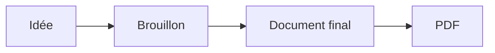
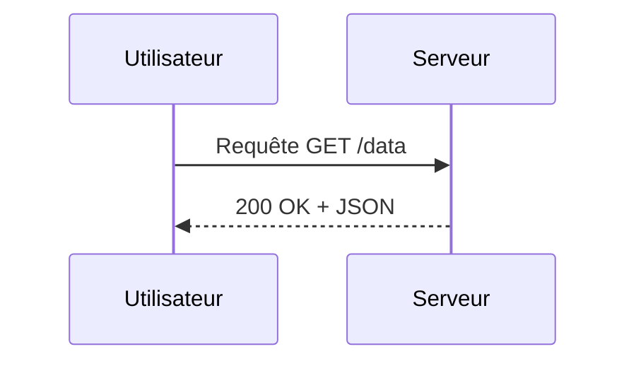
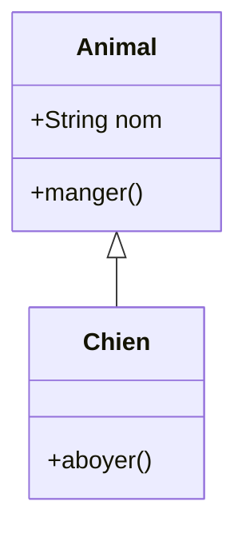
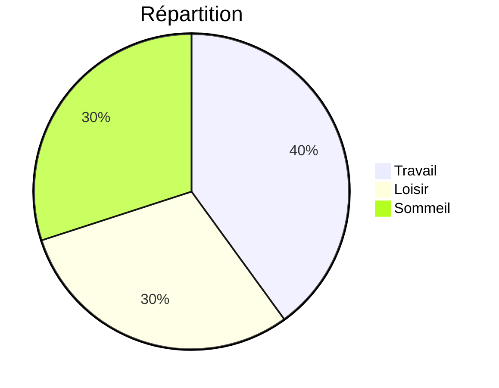

# Bienvenue dans markpage

**markpage** est un éditeur qui produit des PDF prêts à imprimer ou à
partager. Vous écrivez du texte presque normal, et l'app s'occupe de
la mise en forme.

Vous lisez actuellement ce tutoriel **dans l'éditeur** — c'est
lui-même un document markpage. Vous pouvez le modifier librement, ou
repartir d'une page blanche.

Le bouton **Aide** (sur fond jaune) rouvre cette page d'aide à tout
moment, sans toucher à votre document.

## Pour commencer

Vous n'avez besoin que de **cinq ou six outils** pour écrire la
plupart des documents. Suivez ce tutoriel pas à pas — l'idée est que
vous écriviez votre premier document tout en lisant.

### Le principe

markpage utilise une convention qui s'appelle **Markdown**. Vous écrivez
du texte presque normal, avec **quelques signes** simples qui indiquent
la mise en forme. Pas de menus à apprendre, pas de raccourcis
obligatoires.

Pour vous donner une idée, ce tutoriel lui-même est écrit en Markdown.
À droite vous voyez la version mise en page (en cliquant sur **Aperçu**),
et ici à gauche vous voyez la "vraie" source. Vous pouvez à tout
moment regarder à gauche pour voir « comment c'est fait ».

### Allez-y, écrivez votre premier document

Sélectionnez tout le contenu de l'éditeur (`Cmd/Ctrl + A`) et
supprimez. La page est blanche. On y va.

### Le titre principal

Sur la première ligne, tapez un dièse (`#`), un espace, puis le titre
de votre document :

```
# Mon premier document
```

C'est tout. Le `#` au début de la ligne signifie *« ce qui suit est
un titre »*. Une seule ligne, pas de point final, pas de fermeture —
on saute simplement à la ligne quand on a fini.

> **À noter** : ce premier titre `#` du document sert de **couverture**
> dans le PDF (centré, suivi de l'auteur, l'organisation et la date si
> vous les renseignez dans **Réglages**). Vos sections internes
> utiliseront donc plutôt `##` (deux dièses) ou `###` (trois).

### Une section

Sautez une ligne, puis tapez deux dièses suivis du titre de votre
section :

```
## Introduction
```

### Du texte

Sous le titre, tapez votre paragraphe normalement, comme dans un mail.
Sautez une ligne pour faire un nouveau paragraphe.

### Mettre en valeur : *italique* et **gras**

Pour mettre un mot en *italique*, entourez-le d'**un** astérisque :

```
Le mot *important* est en italique.
```

Pour le **gras**, entourez de **deux** astérisques :

```
Le mot **important** est en gras.
```

> **Astuce** : si les astérisques vous semblent fastidieux à taper,
> sélectionnez le mot et appuyez sur `Cmd/Ctrl + I` pour l'italique
> ou `Cmd/Ctrl + B` pour le gras — comme dans Word. Le résultat
> est exactement le même.

### Une sous-section

Trois dièses pour un titre de niveau plus profond :

```
### Mes idées principales
```

Vous pouvez descendre jusqu'à six dièses, mais en pratique trois
suffisent pour la plupart des documents.

### Insérer une image

Trois moyens, au choix :

1. **Glisser-déposer** une image depuis le Bureau directement dans
   l'éditeur.
2. **Coller** une capture d'écran (`Cmd/Ctrl + V` après l'avoir
   capturée).
3. Bouton **Style** dans la toolbar → *« Insérer une image… »*.

L'image est automatiquement redimensionnée et compressée (max 2000 px
de côté), et s'insère à la position du curseur.

### La toolbar

En haut de l'écran, quelques boutons :

- **Mon doc ▾** — montre le nom du document courant ; ouvre la liste
  de vos documents, permet d'en créer / renommer / dupliquer /
  supprimer.
- **Importer** — ajoute un fichier (`.md`, `.txt`, `.html`,
  `.docx`) comme nouveau document, sans toucher au courant.
- **Style ▾** — un menu de mise en forme (titres, gras, listes,
  insérer une image…). Le **clic-droit** dans l'éditeur ouvre le
  même menu.
- **Aide** (jaune) — ouvre ce tutoriel.
- **Aperçu** — bascule entre l'éditeur et le rendu paginé.
- **Exporter ▾** — produit un fichier Markdown (`.md`), un PDF, un
  source LaTeX (`.tex`), envoie vers OneDrive, ou génère un lien de
  partage que vous pouvez coller dans un email / chat (cf. *Exporter
  votre document* plus bas).
- **Réglages ▾** — personnaliser le rendu PDF (auteur, marges,
  polices…). S'ouvre dans une **fenêtre séparée** que vous pouvez
  poser à côté de l'aperçu pour voir l'effet de chaque changement
  en temps réel.

### Voir l'aperçu

Vous écrivez en mode **éditeur** (texte brut). Pour voir à quoi votre
document ressemblera dans le PDF, basculez en mode **aperçu** :

- raccourci `Cmd/Ctrl + Enter`
- ou clic sur le bouton **Aperçu**

Vous voyez votre document tel qu'il sera imprimé.

Pour revenir à l'éditeur, **cliquez n'importe où dans l'aperçu** : le
curseur revient pile sur la ligne cliquée. Pratique : si vous voyez
une faute, cliquez dessus, vous arrivez direct au mot dans l'éditeur
pour la corriger. Ou rappuyez sur `Cmd/Ctrl + Enter`.

### Exporter en PDF

Cliquez sur **Exporter ▾** puis **PDF (.pdf)**, ou utilisez le
raccourci `Cmd/Ctrl + P` directement.

Le navigateur ouvre son dialogue d'impression. Choisissez :

- **Destination** : *Enregistrer au format PDF*
- **Marges** : ⚠ **Aucune** (voir l'encadré ci-dessous)

Cliquez sur **Enregistrer**, donnez un nom au fichier, c'est fait.

> **⚠ Important — sélectionnez "Marges : Aucune"**
>
> Dans le dialogue d'impression, ouvrez « Plus de paramètres » et
> sélectionnez **« Marges : Aucune »**. Sinon, le navigateur ajoute
> ses propres marges par-dessus celles déjà gérées par markpage, ce
> qui rétrécit la zone imprimable et fait dépasser le contenu. Les
> marges visibles dans le PDF sont **toujours** celles que vous
> avez choisies dans **Réglages**, jamais celles du dialogue
> d'impression.

### Et voilà

Vous savez écrire un document avec markpage. La majorité des notes,
comptes-rendus, articles courts ne demandent rien de plus que ces
quelques outils.

Si vous avez besoin d'autre chose — listes, citations, tableaux,
formules mathématiques, diagrammes, encadrés, notes de bas de page,
graphiques — la suite documente toutes les fonctions avancées. Lisez
à votre rythme, ou retournez écrire votre document maintenant et
revenez plus tard.

---

## Pour aller plus loin

Tout ce qui suit est **optionnel**. Picorez selon vos besoins. Chaque
section est indépendante. Cette partie regroupe ce qui sert à
**rédiger un document riche** : plus d'éléments Markdown, encadrés,
notes de bas de page, tableaux, graphiques. Pour la **typographie
scientifique** (formules math, ligatures, règles d'inférence) et les
**diagrammes Mermaid**, voir la partie suivante *Pour aller encore
plus loin*.

### Encore d'autres éléments Markdown

#### Listes

**Listes à puces** : un tiret (`-`) ou un astérisque (`*`) en début de
ligne :

```
- Première idée
- Deuxième idée
- Troisième idée
```

**Listes numérotées** : un nombre suivi d'un point :

```
1. Première étape
2. Deuxième étape
3. Troisième étape
```

(Les numéros que vous tapez n'ont pas d'importance — Markdown
renumérote ; vous pouvez tout taper en `1.`)

**Listes imbriquées** : indentez de quatre espaces ou d'une
tabulation pour une sous-liste :

```
- Idée principale
    - Sous-idée
    - Autre sous-idée
- Deuxième idée
```

#### Citations

Un chevron (`>`) en début de ligne :

```
> Ce qui se conçoit bien s'énonce clairement.
> — Boileau
```

#### Liens

```
Visitez [le site de Boileau](https://exemple.fr).
```

Le texte entre crochets devient cliquable, vers l'URL entre
parenthèses. Raccourci : sélectionnez le texte, `Cmd/Ctrl + K`,
collez l'URL.

#### Lignes horizontales

Trois tirets sur une ligne seule :

```
---
```

#### Code en ligne et blocs de code

Pour du code **en ligne** dans un paragraphe, entourez-le d'accents
graves : `` `let x = 42` `` donne `let x = 42`.

Pour un **bloc de code** entier, entourez de trois accents graves
chacune sur sa propre ligne :

````
```
function add(a, b) {
    return a + b;
}
```
````

#### Listes de tâches

Une checklist : un tiret, un espace, puis `[ ]` (à faire) ou `[x]`
(fait) :

```
- [x] Écrire le brouillon
- [x] Relire
- [ ] Envoyer au comité
- [ ] Préparer la version finale
```

Les cases sont **purement visuelles** : pour cocher / décocher,
modifiez le `[ ]` en `[x]` directement dans le markdown.

#### Tableaux simples

Markdown classique pour de petits tableaux :

```
| Nom    | Âge |
|--------|-----|
| Alice  | 32  |
| Bob    | 27  |
```

(Pour les **tableaux de données denses**, voir la section *Tableaux
de données (CSV / TSV)* plus bas.)

### Gérer plusieurs documents

markpage garde **tous vos documents** dans le navigateur. La liste se
trouve derrière le bouton **Mon doc ▾**, qui affiche aussi le nom
du document que vous éditez actuellement.

#### Le menu Mon doc ▾

- **Renommer le doc courant** : cliquez dans le champ en haut du
  menu, tapez, validez avec Entrée. (Échap annule.)
- **+ Nouveau document** : crée un document vide et bascule
  dessus. Le doc précédent reste en place, vous pouvez y revenir
  à tout moment.
- **Liste des autres documents** : triés par date de modification.
  Cliquez sur un nom pour l'ouvrir. Au survol, trois actions
  apparaissent :
  - *Renommer* — édite le nom directement dans la liste.
  - *Dupliquer* — clone le document.
  - *Supprimer* — avec une demande de confirmation.

#### Importer un fichier

Le bouton **Importer** (raccourci `Cmd/Ctrl + O`) ajoute un fichier
externe comme **nouveau document** dans la liste, sans toucher à
celui sur lequel vous travaillez. Formats acceptés : `.md`,
`.txt`, `.html`, `.docx` (Word).

> **À noter pour les fichiers Word** : à l'import d'un `.docx`, le
> texte, les titres, les listes, le gras/italique, les liens et les
> citations sont récupérés, mais **pas les images**. Si votre
> document Word contenait des photos, vous devrez les réinsérer
> manuellement après import.

#### Exporter votre document

Le bouton **Exporter ▾** propose plusieurs options :

| Option | Raccourci | Effet |
|---|---|---|
| **Markdown (.md)** | `Cmd/Ctrl + S` | Télécharge votre document au format Markdown |
| **PDF (.pdf)** | `Cmd/Ctrl + P` | Produit le PDF final |
| **LaTeX (.tex)** | — | Produit un source LaTeX compilable avec `xelatex` |
| **OneDrive…** | — | Envoie le `.md` dans votre OneDrive (dossier `Apps/markpage/`) et copie un lien de partage anonyme |
| **Copier le lien de partage** | — | Encode le document dans une URL `?import=…` à coller dans Slack / email / SMS |
| **Envoyer par email** | — | Même URL, ouverte dans votre client mail avec le lien pré-rempli |

Le format **Markdown** (`.md`) est un format texte ouvert, lisible
partout. Vous pouvez l'envoyer à quelqu'un qui n'utilise pas markpage —
il l'ouvrira dans n'importe quel éditeur de texte.

Le format **LaTeX** (`.tex`) est utile si vous voulez retoucher
finement la mise en page avec un compilateur LaTeX, ou soumettre
votre document à un journal qui demande des sources `.tex`. Quand
votre document contient des images ou des diagrammes (mermaid,
chart), le téléchargement est un **fichier `.zip`** contenant le
`.tex` et un dossier `images/`. Compilez avec :

```
xelatex --shell-escape votre-document.tex
```

(`--shell-escape` n'est nécessaire que si le document contient des
diagrammes, et exige qu'`inkscape` soit installé.) Le commentaire
en tête du `.tex` rappelle ces prérequis.

**OneDrive** demande une connexion Microsoft à la première
utilisation (popup OAuth, scope `Files.ReadWrite.AppFolder` —
markpage n'a accès qu'au dossier `Apps/markpage/`, pas au reste
de votre Drive). Le lien de partage généré est anonyme et en
lecture seule : n'importe qui à qui vous le donnez peut télécharger
le `.md`, mais personne ne peut le modifier dans votre OneDrive.

**Le lien de partage** est une URL auto-portante : tout le document
(texte + images en base64) est gzip-compressé puis encodé dans
l'URL elle-même. Aucune connexion serveur, aucun compte requis. Le
destinataire ouvre le lien dans son navigateur et le document est
importé automatiquement comme un nouveau document local dans son
markpage. Limite : ~8 Ko de payload (≈ 5-10 pages de markdown
normal) — au-delà, utilisez OneDrive plutôt.

Le nom du fichier exporté reprend le nom de votre document (celui
affiché sur **Mon doc ▾**).

Votre travail est **automatiquement sauvegardé** dans le navigateur,
donc si vous fermez l'onglet par accident, tout est récupéré à la
prochaine ouverture.

### Personnaliser le rendu PDF (Réglages)

Le bouton **Réglages ▾** (raccourci `Cmd/Ctrl + ,`) ouvre une
**fenêtre séparée** où vous pouvez configurer le PDF sans toucher
au contenu. **Astuce** : passez d'abord en mode Aperçu, ouvrez les
Réglages, posez la fenêtre à côté de l'aperçu — chaque modification
se reflète en temps réel sur le document paginé.

La fenêtre s'organise en plusieurs **cartes** (Auteur et date, Page,
Polices, Marges, Espacement, Titres, Corps, Numéro de page,
Diagrammes Mermaid). Si vous élargissez la fenêtre, les cartes
**passent automatiquement sur deux ou trois colonnes** côte à côte
pour réduire le scroll.

Ce que vous pouvez régler :

- **Auteur, organisation, date** affichés sous le titre principal
- **Format de page** (A4, A5, Letter…)
- **Marges** en millimètres
- **Justification** du texte
- **Interligne**
- **Polices** des titres, du corps et du code — choisies parmi un
  catalogue de ~15 polices Google Fonts (Inter, EB Garamond,
  JetBrains Mono…). Les polices sont chargées à la demande ; la
  première utilisation nécessite une connexion, ensuite le
  navigateur les met en cache. Roboto Condensed et Roboto Mono
  sont embarquées et fonctionnent hors-ligne. *Note : l'éditeur
  lui-même garde toujours Roboto Condensed / Mono, indépendamment
  de vos choix — la cohérence de la zone de saisie ne change pas.*
- **Polices Google personnalisées** — pour une famille hors
  catalogue, copiez l'URL Google Fonts (par exemple
  `https://fonts.googleapis.com/css2?family=Tangerine:wght@400;700&display=swap`)
  dans le champ « + Ajouter », validez. La police apparaît
  immédiatement dans les trois sélecteurs (Titres / Corps / Code)
  et peut être retirée d'un clic sur la croix de sa chip.
- **Espacement** — trois ratios qui contrôlent la densité verticale
  du document :
  - *Au-dessus / en dessous des titres* (`1.6` / `0.6` par défaut) :
    l'espace au-dessus d'un titre de taille T est `ratio × T`.
    Asymétrique exprès — plus d'air au-dessus, pour que le titre
    « appartienne » à la section qui suit.
  - *Entre paragraphes* (`1.0` par défaut) : marge symétrique
    appliquée à chaque paragraphe.
- **Titres (h1 à h4)** — pour chacun : taille, couleur, **graisse**
  (Light / Regular / Medium / Semibold / Bold), **italique**, et
  **trait** (border-bottom sous le titre). Si la police choisie ne
  fournit pas la graisse ou l'italique demandée, le navigateur
  *synthétise* un faux gras / italique, en général moins joli — la
  solution est de choisir une police plus complète, ou d'inclure
  le poids voulu dans votre URL Google Fonts personnalisée.
- **Corps** — taille et couleur du texte normal, du code, et de la
  citation (avec sa barre verticale).
- **Numéro de page** : position, taille, couleur, italique
- **Diagrammes Mermaid** : agrandissement max, largeur max,
  hauteur max (cf. section *Diagrammes Mermaid* plus bas).
- **Formules mathématiques** :
  - *Police des formules* — cinq fontes math au choix : NewComputerModern
    (défaut, serif TeX), Fira Math (sans-serif, idéal avec Roboto / Fira),
    STIX 2 ou Asana (serifs modernes), ou la fonte TeX classique.
  - *Échelle des formules* (50-200 %, défaut 100 %) — pour ajuster la
    taille des glyphes au visuel de la police choisie (certaines polices
    à grande hauteur d'x font paraître les formules trop petites).

Les réglages sont **mémorisés entre vos sessions**. Pour revenir aux
valeurs par défaut, ouvrez le menu **Profil** en haut de la fenêtre
Réglages (cf. section suivante) et cliquez sur *Réinitialiser*.

### Plusieurs profils de réglages

Vous pouvez maintenir **plusieurs jeux de réglages** sous des noms
différents — par exemple un profil « Article scientifique » sobre, un
autre « Notes de cours » aéré, un troisième « Diaporama A5 » — et
basculer de l'un à l'autre en un clic. Un seul profil est actif à la
fois et s'applique à tous vos documents.

Le dropdown du profil courant se trouve **en haut de la fenêtre
Réglages**, à côté du titre. Il affiche le nom du profil actif suivi
de `▾`.

À l'intérieur du menu :

- **Le nom courant est éditable** en haut. Tapez, validez par
  `Entrée`, le profil est renommé.
- **+ Nouveau profil** crée un profil à partir de la copie des
  réglages actuels (utile pour tester une variante sans casser
  l'existant) et bascule dessus.
- **La liste en dessous** liste les autres profils. **Un clic =
  bascule** vers ce profil. L'aperçu et le PDF s'adaptent
  immédiatement.
- En **bas du menu**, trois actions s'appliquent au **profil courant
  uniquement** :
  - *Dupliquer* — crée une copie nommée « Copie de … » et bascule
    dessus.
  - *Supprimer* (avec confirmation) — désactivé s'il ne reste qu'un
    profil ; le profil le plus récent restant devient le nouveau
    courant.
  - *Réinitialiser* — revient aux valeurs par défaut **sans changer
    le nom**, équivalent du Reset historique.
- **Importer…** ouvre un sélecteur de fichier `.json` (export d'un
  profil de votre collègue, par exemple). **Exporter…** télécharge
  le profil courant comme `<nom-du-profil>.json`. Format auto-suffisant
  et lisible à la main si besoin.

### Caractères spéciaux et symboles

Les flèches (→, ←, ↑, ↓), les opérateurs mathématiques (≤, ≥, ≠), les
symboles divers (★, ♥, ✓) sont gérés correctement, à l'écran comme
dans le PDF.

### Numérotation des sections

Pour numéroter les titres d'un long document sans configurer de menu,
il suffit de **donner l'exemple sur le premier titre de chaque
niveau** : la commande **Numéroter les sections**
(`Cmd/Ctrl + Maj + N`, ou bien menu **Style** → *Numéroter les
sections*) détecte le style de numérotation que vous avez écrit, puis
l'applique à tous les autres titres du même niveau.

Exemple. Vous écrivez :

```
# 1. Introduction

## 1.1 Contexte

## Objectifs

# Méthode

## Données

# Résultats
```

…vous lancez la commande, et le document devient :

```
# 1. Introduction

## 1.1 Contexte

## 1.2 Objectifs

# 2. Méthode

## 2.1 Données

# 3. Résultats
```

Le premier `#` (h1) annonce un style décimal plat (`1.`) ; le premier
`##` (h2) annonce un style hiérarchique (`1.1`). La commande retient
et applique. Si votre premier titre n'a aucune numérotation, ce
niveau ne sera pas numéroté du tout, et tout préfixe numérique
éventuel des titres suivants à ce niveau sera retiré (mise au propre).

**Styles reconnus** par niveau :

| Premier titre | Style appliqué |
|---|---|
| `# 1. Foo` | `1.`, `2.`, `3.`, … |
| `# 1) Foo` | `1)`, `2)`, `3)`, … |
| `# (1) Foo` | `(1)`, `(2)`, `(3)`, … |
| `# A. Foo` | `A.`, `B.`, …, `Z.`, `AA.` |
| `# a. Foo` | `a.`, `b.`, … |
| `# I. Foo` | `I.`, `II.`, `III.`, … |
| `# i. Foo` | `i.`, `ii.`, … |
| `## 1.1 Foo` | hiérarchique : `1.1`, `1.2`, `2.1`, … |
| `## 1.1. Foo` | hiérarchique avec point final |
| (sans préfixe) | aucune numérotation pour ce niveau |

La numérotation hiérarchique a besoin que tous les niveaux parents
soient eux-mêmes numérotés.

### Tableaux de données (CSV / TSV)

Pour un tableau dense, écrire la syntaxe pipe-style à la main est
fastidieux. Vous pouvez à la place coller un **CSV** ou un **TSV**
dans un *fenced block* :

````
```csv
Note, Concert pitch (Hz), MIDI
A4,    440.00, 69
A#4,   466.16, 70
B4,    493.88, 71
```
````

Le **séparateur** est la virgule pour `csv`, la tabulation pour `tsv`.
La **première ligne** devient l'en-tête du tableau, les suivantes les
données.

Si l'une de vos cellules contient le séparateur (par exemple une
virgule dans un nom), entourez-la de guillemets doubles :

````
```csv
Nom, Description
"Doe, John", "Auteur, fondateur"
```
````

Pour insérer un guillemet littéral dans une cellule entre guillemets,
doublez-le : `""`.

### Listes de définitions

Pour une liste de **termes avec leur définition** (glossaire,
notation, dictionnaire), utilisez la syntaxe Pandoc : un terme sur
une ligne, puis sa définition sur la ligne suivante préfixée par
`:` et au moins une espace.

```
DAG
:   Directed Acyclic Graph — un graphe orienté sans cycle.

FFT
:   Fast Fourier Transform, l'algorithme en $O(n \log n)$ de
    Cooley & Tukey.
```

Plusieurs définitions pour le même terme : ajoutez d'autres lignes
`:` à la suite.

```
Polynôme
:   Une expression de la forme $a_0 + a_1 x + \dots + a_n x^n$.
:   Un objet du langage Faust qui représente la même chose.
```

À l'intérieur des termes et des définitions vous pouvez utiliser du
Markdown inline (gras, italique, code, formules, liens).

### Notes de bas de page

Vous pouvez ajouter une **note de bas de page** avec la syntaxe
Pandoc : un appel de note `[^id]` dans le texte, et la définition
`[^id]: contenu` n'importe où dans le document (généralement à la
fin).

```
La transformée de Fourier discrète[^dft] est l'outil de base pour
analyser un signal numérique.

[^dft]: Voir Cooley & Tukey (1965) pour l'algorithme rapide.
```

L'identifiant `id` peut être un nombre, un mot, ou un libellé court —
il sert seulement à relier l'appel à sa définition, et n'apparaît
nulle part dans le rendu. Les notes sont **numérotées
automatiquement** dans l'ordre où elles apparaissent dans le texte
(pas dans l'ordre des définitions), et regroupées en fin de document.

À l'intérieur d'une note vous pouvez utiliser **`gras`**, *italique*,
`code inline`, des liens, ou même `$math$`. Une même note peut être
référencée plusieurs fois — toutes les occurrences pointent vers la
même entrée.

Cliquer sur l'appel `¹` saute à la note ; cliquer sur le `↩` à la
fin de la note revient à l'appel.

### Citations bibliographiques

Pour citer un article ou un livre, utilisez la **syntaxe
Pandoc-lite** : `[@key]` dans le texte, avec la définition
`[@key]: texte de la référence` en bas de document.

```
Quicksort tourne en $O(n \log n)$ en moyenne[@hoare1962], mais
dégénère à $O(n^2)$ sur une entrée déjà triée sans pivot
aléatoire[@sedgewick1978].

[@hoare1962]: Hoare, C. A. R. (1962). *Quicksort*. The Computer Journal 5(1), 10-16.
[@sedgewick1978]: Sedgewick, R. (1978). *Implementing Quicksort programs*. CACM 21(10), 847-857.
```

Le rendu : chaque appel devient `[1]`, `[2]`, … numéroté dans
l'ordre d'apparition (une référence réutilisée garde son numéro).
Une section **References** est générée en fin de document avec les
définitions, dans l'ordre des appels, chacune avec un back-link
`↩` qui ramène à l'appel.

Les clés acceptent lettres, chiffres et `_:.-` (compatibles
BibTeX). Une référence à une clé non définie reste en texte
littéral dans le rendu — ça évite les `[N]` blancs sur typo.

Le texte de la référence est écrit en Markdown : vous gardez la
main sur le format (italique pour le titre, gras pour l'auteur,
…). Pas de formatage CSL / APA / IEEE automatique.

### Encadrés (notes, théorèmes…)

Vous pouvez mettre en valeur un passage avec un **encadré** : ouvrez
avec `:::` suivi du nom de l'encadré, écrivez votre contenu, fermez
avec `:::` seul sur une ligne. C'est la syntaxe Pandoc des *fenced
divs*.

```
::: warning
Attention, cette opération est irréversible.
:::
```

Les noms d'encadrés reconnus se rangent en deux familles :

- **Génériques** (cadre coloré, fond teinté) :
  `note` (bleu), `tip` (vert), `warning` (orange), `caution` (rouge),
  `important` (violet).
- **Académiques** (cadre sobre, titre en italique, façon LaTeX) :
  `theorem`, `lemma`, `proposition`, `corollary`, `definition`,
  `proof`, `example`, `remark`.

Vous pouvez ajouter un **titre** entre crochets après le nom :

```
::: theorem [Pythagore]
Dans un triangle rectangle, le carré de l'hypoténuse est égal à
la somme des carrés des deux autres côtés.
:::
```

…s'affiche avec le titre **« Théorème — Pythagore »**.

Si vous écrivez un encadré avec un nom qui n'est pas dans la liste
ci-dessus (par exemple `::: aside`), il sera rendu avec un cadre
neutre — utile pour vos propres conventions.

L'intérieur d'un encadré est du Markdown comme le reste : texte mis
en forme, listes, formules, voire des tableaux.

### Graphiques

Pour tracer une courbe ou un diagramme à partir de données, utilisez
un *fenced block* `chart` :

````
```chart line "Latence par taille de buffer"
buffer, latence (ms)
64,  12
128,  8
256,  5
512,  3
1024, 2
```
````

Les types disponibles sont **`line`** (courbe) et **`bar`**
(histogramme). Le titre entre guillemets après le type est
facultatif.

La **première ligne** donne les en-têtes : la première colonne
devient le label de l'axe X, les colonnes suivantes deviennent autant
de **séries de données** (chacune sa couleur, et une légende
automatique si plus d'une série).

Les **lignes de données** suivantes contiennent les valeurs. Si la
première colonne est numérique, l'axe X est continu ; si elle
contient des labels textuels (mois, catégories…), l'axe X est
catégorique.

#### Format CSV : virgules françaises

Le séparateur de champ est **détecté automatiquement** sur la
première ligne :

- s'il y a une tabulation → séparateur = tabulation,
- sinon s'il y a un point-virgule → séparateur = `;`,
- sinon → séparateur = `,`.

Quand le séparateur est `,`, les **virgules entre deux chiffres**
(sans espace autour) sont reconnues comme **virgules décimales**,
donc `3,14` reste un seul nombre. La virgule séparatrice s'écrit
alors suivie d'un espace : `foo, 3,14` donne deux cellules `foo` et
`3,14`.

Pour les rares cas ambigus (`1,2,3,4` compact), passez en `;` ou en
TSV — ou ajoutez des espaces : `1, 2, 3, 4`.

Les nombres dans les cellules acceptent les deux formats (point ou
virgule décimale) — `3.14` et `3,14` sont équivalents.

#### Séries chronologiques

Si la première colonne contient des **dates au format ISO 8601**
(`YYYY-MM-DD`, éventuellement avec heure), l'axe X est traité comme
une échelle temporelle. L'app choisit automatiquement les graduations
appropriées (jour, mois ou année selon l'étendue) :

````
```chart line "Téléchargements"
date, total
2025-01-15, 120
2025-02-15, 180
2025-03-15, 245
2025-04-15, 310
```
````

Les formats ambigus (FR `15/01/2025` et US `01/15/2025`) ne sont
**pas** reconnus — utilisez toujours ISO 8601, qui est sans
ambiguïté.

#### Plusieurs séries

````
```chart bar "Comparaison de codecs"
Codec, Taille (Ko), Temps (ms)
MP3, 4200, 120
Opus, 3800, 95
FLAC, 12500, 280
```
````

Deux barres côte à côte par catégorie, avec une légende en haut à
droite identifiant chaque série.

---

## Pour aller encore plus loin

Cette dernière partie regroupe les outils **plus spécialisés** :
ligatures de saisie qui rendent l'Unicode mathématique confortable à
taper, formules en LaTeX, règles d'inférence, et diagrammes Mermaid
(flowcharts, séquences, états, etc., chacun avec sa propre syntaxe).
Si vous écrivez un article de recherche, un cours, une spec
d'algorithme, ou de la documentation technique, vous y trouverez votre
compte. Sinon vous pouvez sauter directement aux Crédits.

### Ligatures de saisie

Pour vous éviter de chercher chaque symbole Unicode dans une table de
caractères, l'éditeur **remplace au vol** certaines séquences ASCII
par leur équivalent mathématique. Deux mécaniques cohabitent :

Les **séquences courtes de symboles** sont remplacées dès qu'elles
sont complètes :

| Tapez | Obtenez | Tapez | Obtenez |
|---|---|---|---|
| `[[` |  | `<<` | ⟨ |
| `]]` |  | `>>` | ⟩ |
| `->` | → | `<-` | ← |
| `=>` | ⇒ | | |
| `<=` | ≤ | `>=` | ≥ |
| `!=` | ≠ | `+-` | ± |
| `\|-` | ⊢ | `-\|` | ⊣ |
| `...` | … | | |

Les **commandes LaTeX** (`\xxx`) attendent un **caractère terminateur**
(espace, ponctuation, opérateur, retour à la ligne) avant de se
substituer. Vous tapez `\alpha` puis un espace : l'espace reste, et
`\alpha` est remplacé par α. Cette règle permet à des noms qui se
chevauchent (`\in`, `\int`, `\infty` ; `\subset`, `\subseteq`) de
coexister sans qu'un préfixe ne court-circuite un nom plus long.

**Lettres grecques** :

| Tapez | Obtenez | Tapez | Obtenez | Tapez | Obtenez |
|---|---|---|---|---|---|
| `\alpha` | α | `\iota` | ι | `\rho` | ρ |
| `\beta` | β | `\kappa` | κ | `\sigma` | σ |
| `\gamma` | γ | `\lambda` | λ | `\tau` | τ |
| `\delta` | δ | `\mu` | μ | `\upsilon` | υ |
| `\epsilon` | ϵ | `\nu` | ν | `\phi` | ϕ |
| `\zeta` | ζ | `\xi` | ξ | `\chi` | χ |
| `\eta` | η | `\omicron` | ο | `\psi` | ψ |
| `\theta` | θ | `\pi` | π | `\omega` | ω |

Variantes typographiques :
`\varepsilon` ε, `\varphi` φ, `\vartheta` ϑ, `\varpi` ϖ, `\varrho` ϱ,
`\varsigma` ς.

Majuscules (seulement celles qui diffèrent du latin) :
`\Gamma` Γ, `\Delta` Δ, `\Theta` Θ, `\Lambda` Λ, `\Xi` Ξ, `\Pi` Π,
`\Sigma` Σ, `\Upsilon` Υ, `\Phi` Φ, `\Psi` Ψ, `\Omega` Ω.

**Théorie des ensembles & quantificateurs** :
`\in` ∈, `\notin` ∉, `\subset` ⊂, `\supset` ⊃, `\subseteq` ⊆,
`\supseteq` ⊇, `\cup` ∪, `\cap` ∩, `\emptyset` ∅, `\forall` ∀,
`\exists` ∃.

**Logique** : `\wedge` ∧, `\vee` ∨, `\neg` ¬.

**Relations** : `\approx` ≈, `\equiv` ≡, `\cong` ≅, `\sim` ∼,
`\propto` ∝, `\perp` ⊥, `\parallel` ∥.

**Opérateurs** : `\oplus` ⊕, `\otimes` ⊗, `\circ` ∘, `\bullet` •,
`\cdot` ⋅, `\times` ×, `\div` ÷.

**Analyse** : `\partial` ∂, `\nabla` ∇, `\infty` ∞, `\sum` ∑,
`\prod` ∏, `\int` ∫, `\oint` ∮.

**Constantes** : `\aleph` ℵ, `\hbar` ℏ.

**Points de suspension** : `\cdots` ⋯, `\vdots` ⋮, `\ddots` ⋱,
`\ldots` …

**Grandes flèches** : `\mapsto` ↦, `\Leftarrow` ⇐, `\Rightarrow` ⇒,
`\Leftrightarrow` ⇔.

> Pour écrire une commande **littéralement** dans la prose (par
> exemple pour documenter `\alpha`), doublez le backslash :
> `\\alpha` reste tel quel dans la source — et rend comme `\alpha`
> en Markdown, qui interprète `\\` comme un backslash échappé. À
> l'intérieur d'un bloc code, les ligatures sont également
> désactivées.

Pour les **lettres "blackboard bold"** (ensembles), `|` suivi de
n'importe quelle lettre majuscule donne sa version doublée :

| Tapez | Obtenez | Tapez | Obtenez | Tapez | Obtenez |
|---|---|---|---|---|---|
| `\|A` | 𝔸 | `\|J` | 𝕁 | `\|S` | 𝕊 |
| `\|B` | 𝔹 | `\|K` | 𝕂 | `\|T` | 𝕋 |
| `\|C` | ℂ | `\|L` | 𝕃 | `\|U` | 𝕌 |
| `\|D` | 𝔻 | `\|M` | 𝕄 | `\|V` | 𝕍 |
| `\|E` | 𝔼 | `\|N` | ℕ | `\|W` | 𝕎 |
| `\|F` | 𝔽 | `\|O` | 𝕆 | `\|X` | 𝕏 |
| `\|G` | 𝔾 | `\|P` | ℙ | `\|Y` | 𝕐 |
| `\|H` | ℍ | `\|Q` | ℚ | `\|Z` | ℤ |
| `\|I` | 𝕀 | `\|R` | ℝ | | |

Le remplacement modifie le **source** du document (pas seulement
l'affichage), donc les caractères Unicode sont là si vous copiez le
texte ailleurs.

Pour annuler une ligature qui s'est déclenchée alors que vous vouliez
le texte littéral, faites `Cmd/Ctrl + Z` immédiatement après — la
substitution se défait, le texte ASCII est restauré.

### Formules mathématiques

Vous pouvez inclure des **formules en LaTeX**, soit **en bloc** entre
`$$ … $$` (la formule s'affiche centrée sur sa propre ligne), soit
**inline** entre `$ … $` au milieu d'une phrase. Le rendu utilise
[MathJax](https://www.mathjax.org/) et produit un PDF de qualité
typographique professionnelle.

Pour les blocs, vous pouvez aussi utiliser un *fenced block* avec le
langage `math` — c'est la convention GitHub et ça évite le piège des
`$$` qui doivent être seuls sur leur ligne :

````
```math
x = \frac{-b \pm \sqrt{b^2 - 4ac}}{2a}
```
````

Le rendu est strictement identique à `$$ … $$`.

#### Exemples utiles

**Sommes et intégrales**

```
$$
\sum_{i=1}^{n} i^2 = \frac{n(n+1)(2n+1)}{6}
\qquad
\int_{0}^{\infty} e^{-x^2}\,dx = \frac{\sqrt{\pi}}{2}
$$
```

$$
\sum_{i=1}^{n} i^2 = \frac{n(n+1)(2n+1)}{6}
\qquad
\int_{0}^{\infty} e^{-x^2}\,dx = \frac{\sqrt{\pi}}{2}
$$

**Matrice**

```
$$
A = \begin{pmatrix}
1 & 2 & 3 \\
4 & 5 & 6 \\
7 & 8 & 9
\end{pmatrix}
$$
```

$$
A = \begin{pmatrix}
1 & 2 & 3 \\
4 & 5 & 6 \\
7 & 8 & 9
\end{pmatrix}
$$

**Système d'équations alignées**

```
$$
\begin{align*}
f(x)   &= ax^2 + bx + c \\
f'(x)  &= 2ax + b \\
f''(x) &= 2a
\end{align*}
$$
```

$$
\begin{align*}
f(x)   &= ax^2 + bx + c \\
f'(x)  &= 2ax + b \\
f''(x) &= 2a
\end{align*}
$$

**Formule inline** : tapez par exemple
`Soit $\epsilon > 0$ tel que…` et vous obtenez :

Soit $\epsilon > 0$ tel que…

#### À savoir

- La taille des formules s'aligne sur la taille du texte courant ; si
  vous changez le réglage **Texte normal** dans **Réglages**, les
  formules grandissent ou rétrécissent en proportion.
- Si une formule est plus large que la zone de texte de la page, elle
  est automatiquement réduite pour tenir.
- Les commandes LaTeX usuelles fonctionnent : `\frac`, `\sqrt`,
  `\sum`, `\int`, `\lim`, `\vec`, `\partial`, lettres grecques
  (`\alpha`, `\beta`, …), opérateurs (`\pm`, `\times`, `\le`),
  flèches (`\to`, `\Rightarrow`), environnements `pmatrix` /
  `bmatrix` / `align*`, etc.

### Règles d'inférence

Pour écrire une **règle d'inférence** (déduction logique, sémantique
opérationnelle, etc.), utilisez un *fenced block* avec le langage
`inference` :

````
```inference (MP)
Γ ⊢ A; Γ ⊢ A → B
-------------------
Γ ⊢ B
```
````

Le bloc est rendu en LaTeX `\dfrac{prémisses}{conclusion}` via
MathJax. Une **ligne de tirets** (3 tirets ou plus, seule sur sa
ligne) sépare les prémisses de la conclusion. Les prémisses sont
séparées par `;` ou réparties sur plusieurs lignes. L'**étiquette**
facultative entre parenthèses après le `inference` (ici `(MP)` pour
modus ponens) apparaît à droite de la barre.

À l'intérieur d'un bloc `inference`, les **ligatures de saisie**
restent actives — vous pouvez taper `|-`, `->`, `[[`, `|N`, etc. et
obtenir directement les caractères Unicode (⊢, →, , ℕ, …) que
MathJax sait rendre tels quels en mode math. C'est la seule
exception au comportement habituel "ligatures désactivées dans les
blocs de code".

Pour les commandes LaTeX qui n'ont pas d'équivalent Unicode dans nos
ligatures (par exemple `\Gamma`, `\forall`, `\exists`, `\Rightarrow`,
`\leq`), tapez-les directement.

### Diagrammes Mermaid

[Mermaid](https://mermaid.js.org/) permet de décrire un diagramme avec
quelques lignes de texte. Placez votre code dans un bloc dont le
langage est `mermaid` :

````

````

…et vous obtenez :


Le diagramme est rendu en **SVG**, dans l'aperçu **et** dans le PDF
(qualité vectorielle, sans pixellisation à l'impression).

#### Quelques exemples

**Diagramme de séquence** (échange entre deux acteurs) :



**Diagramme de classes** :



**Camembert** :



Autres types reconnus : `stateDiagram`, `gantt`, `mindmap`, etc. — voir
la [documentation Mermaid](https://mermaid.js.org/) pour la liste
complète.

#### Réglages

La section **Diagrammes Mermaid** du panneau **Réglages** propose
trois contrôles pour adapter la taille des diagrammes dans le PDF :

- **Agrandissement max.** : facteur d'agrandissement maximal
  (par défaut 2). Les petits diagrammes sont agrandis jusqu'à ce
  facteur ; jamais au-delà.
- **Largeur max. (% du texte)** : fraction de la largeur de la page
  (hors marges) que le diagramme peut occuper (par défaut 100 %).
- **Hauteur max. (% du texte)** : fraction de la hauteur de la page
  (hors marges) que le diagramme peut occuper (par défaut 70 %).

---

## Crédits

markpage est un projet open source assemblé à partir de logiciels libres.
Merci à toutes les personnes qui maintiennent ces projets :

- **Édition et rendu** :
  [CodeMirror](https://codemirror.net/) pour l'éditeur,
  [marked](https://marked.js.org/) pour le parser Markdown,
  [paged.js](https://pagedjs.org/) pour la mise en page paginée
  (l'aperçu et le PDF passent par le moteur d'impression du
  navigateur sur ce même rendu).
- **Diagrammes et formules** :
  [Mermaid](https://mermaid.js.org/) pour les flowcharts et
  diagrammes de séquence,
  [MathJax](https://www.mathjax.org/) pour les formules LaTeX,
  [ebnf2railroad](https://github.com/matthijsgroen/ebnf2railroad) et
  [railroad-diagrams](https://github.com/tabatkins/railroad-diagrams)
  pour les diagrammes syntaxiques EBNF.
- **Coloration syntaxique** :
  [highlight.js](https://highlightjs.org/) pour les blocs de code.
- **Imports** :
  [Mammoth.js](https://github.com/mwilliamson/mammoth.js) pour
  l'import Word (`.docx`),
  [Turndown](https://github.com/mixmark-io/turndown) pour la conversion
  HTML → Markdown.
- **Polices** :
  [Roboto Condensed](https://fonts.google.com/specimen/Roboto+Condensed) et
  [Roboto Mono](https://fonts.google.com/specimen/Roboto+Mono)
  (Christian Robertson, Google),
  [Noto Sans Math](https://fonts.google.com/noto/specimen/Noto+Sans+Math) et
  [Noto Sans Symbols](https://fonts.google.com/noto/specimen/Noto+Sans+Symbols)
  (Google) pour les caractères mathématiques et les symboles.
- **Outils de build** :
  [Vite](https://vitejs.dev/) et [TypeScript](https://www.typescriptlang.org/).

Le code source de markpage est sur
[GitHub](https://github.com/orlarey/markpage).

---

C'est tout. Vous pouvez maintenant :

- Effacer ce contenu et commencer à rédiger votre propre document
- L'enregistrer pour le retrouver plus tard
- Cliquer sur **Aide** à tout moment pour revoir ce tutoriel

Bonne écriture.
