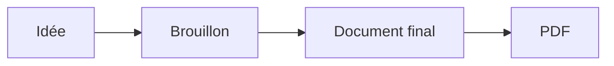
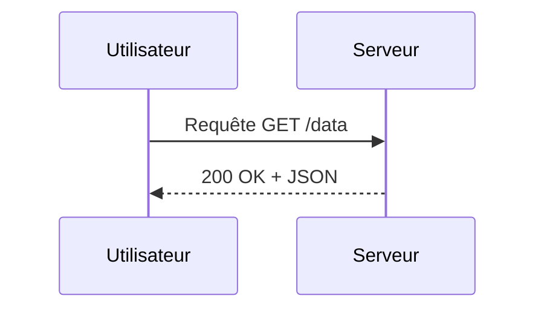
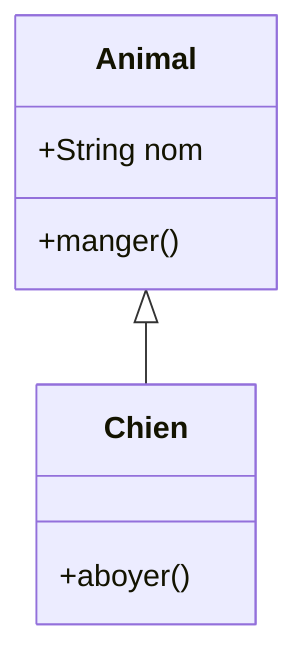
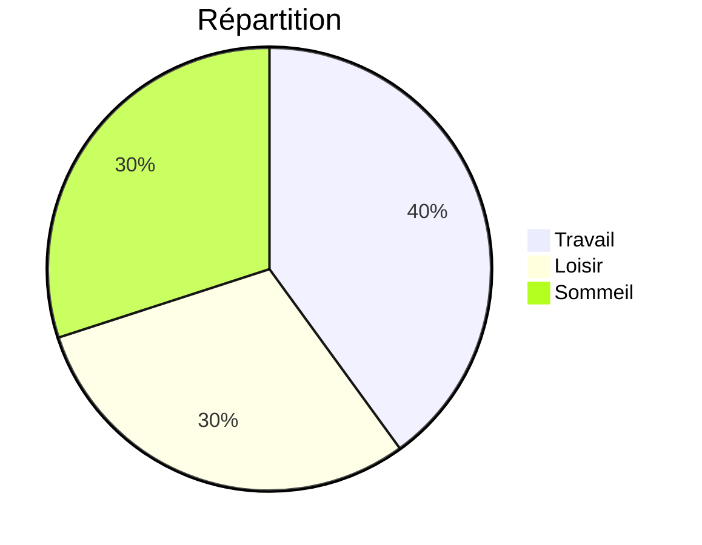
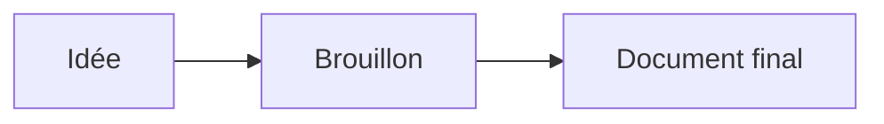
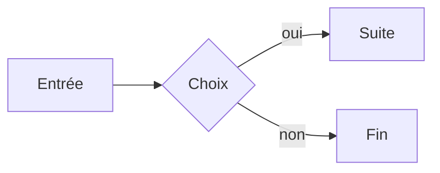

# Bienvenue dans markpage

**markpage** est un éditeur qui produit des PDF prêts à imprimer ou à
partager. Vous écrivez du texte presque normal, et l'app s'occupe de
la mise en forme.

Vous lisez actuellement ce tutoriel **dans l'éditeur** — c'est
lui-même un document markpage. Vous pouvez le modifier librement, ou
repartir d'une page blanche.

Le bouton **Aide** (sur fond jaune) rouvre cette page d'aide à tout
moment, sans toucher à votre document.

## Pour commencer \label{sec:start}

Vous n'avez besoin que de **cinq ou six outils** pour écrire la
plupart des documents. Suivez ce tutoriel pas à pas — l'idée est que
vous écriviez votre premier document tout en lisant.

### Le principe

markpage utilise une convention qui s'appelle **Markdown**. Vous écrivez
du texte presque normal, avec **quelques signes** simples qui indiquent
la mise en forme. Pas de menus à apprendre, pas de raccourcis
obligatoires.

Pour vous donner une idée, ce tutoriel lui-même est écrit en Markdown.
À droite vous voyez la version mise en page (en cliquant sur **Aperçu**),
et ici à gauche vous voyez la "vraie" source. Vous pouvez à tout
moment regarder à gauche pour voir « comment c'est fait ».

### Allez-y, écrivez votre premier document

Sélectionnez tout le contenu de l'éditeur (`Cmd/Ctrl + A`) et
supprimez. La page est blanche. On y va.

### Le titre principal

Sur la première ligne, tapez un dièse (`#`), un espace, puis le titre
de votre document :

```
# Mon premier document
```

C'est tout. Le `#` au début de la ligne signifie *« ce qui suit est
un titre »*. Une seule ligne, pas de point final, pas de fermeture —
on saute simplement à la ligne quand on a fini.

> **À noter** : ce premier titre `#` du document sert de **couverture**
> dans le PDF (centré, suivi de l'auteur, l'organisation et la date si
> vous les renseignez dans **Réglages**). Vos sections internes
> utiliseront donc plutôt `##` (deux dièses) ou `###` (trois).

### Une section

Sautez une ligne, puis tapez deux dièses suivis du titre de votre
section :

```
## Introduction
```

### Du texte

Sous le titre, tapez votre paragraphe normalement, comme dans un mail.
Sautez une ligne pour faire un nouveau paragraphe.

### Mettre en valeur : *italique* et **gras**

Pour mettre un mot en *italique*, entourez-le d'**un** astérisque :

```
Le mot *important* est en italique.
```

Pour le **gras**, entourez de **deux** astérisques :

```
Le mot **important** est en gras.
```

> **Astuce** : si les astérisques vous semblent fastidieux à taper,
> sélectionnez le mot et appuyez sur `Cmd/Ctrl + I` pour l'italique
> ou `Cmd/Ctrl + B` pour le gras — comme dans Word. Le résultat
> est exactement le même.

### Une sous-section

Trois dièses pour un titre de niveau plus profond :

```
### Mes idées principales
```

Vous pouvez descendre jusqu'à six dièses, mais en pratique trois
suffisent pour la plupart des documents.

### Insérer une image

Trois moyens, au choix :

1. **Glisser-déposer** une image depuis le Bureau directement dans
   l'éditeur.
2. **Coller** une capture d'écran (`Cmd/Ctrl + V` après l'avoir
   capturée).
3. Bouton **Style** dans la toolbar → *« Insérer une image… »*.

L'image est automatiquement redimensionnée et compressée (max 2000 px
de côté), et s'insère à la position du curseur.

### Murs d'images (mosaïque) \label{sec:mosaic}

Pour monter plusieurs photos en un **mur d'images** — une galerie
justifiée, sans espace, façon Flickr — placez une image par ligne dans
un bloc `mosaic` :

````
```mosaic "Sortie du 1er mai"


```
````

Les images, **jamais rognées**, sont regroupées en rangées qui
remplissent exactement la largeur du texte ; les hauteurs de rangée
s'ajustent pour former un rectangle net. Options dans l'info-string,
après le titre optionnel :

- `height=<pt>` — hauteur de rangée visée (plus petit ⇒ plus d'images
  par rangée) ;
- `gap=<pt>` — gouttière entre les images (0 par défaut) ;
- `last=natural` — laisse la dernière rangée à sa taille naturelle au
  lieu de l'étirer.

Un titre entre guillemets ajoute une légende numérotée (*Figure N*).

### La toolbar \label{sec:toolbar}

En haut de l'écran, quelques boutons :

- **Fichier ▾** — tout ce qui touche au document : *Nouveau*, *Ouvrir…*,
  *Enregistrer* / *Enregistrer sous…*, *Mettre à la corbeille*,
  *Importer un fichier*, l'export (Markdown / PDF / LaTeX) et le partage
  (cf. *Ouvrir, enregistrer, partager* plus bas).
- **Le nom du document** (au centre) — modifiable pour un document de la
  Bibliothèque ; pour un document lié à un volume, il affiche son nom de
  fichier et une pastille d'origine.
- **Format ▾** — un menu de mise en forme (titres, gras, listes,
  insérer une image…). Le **clic-droit** dans l'éditeur ouvre le
  même menu.
- **Vue ▾** — *Aperçu* (bascule éditeur / rendu paginé), *Présenter*
  (plein écran), *Repères* (overlay de mise en page).
- **Réglages** — personnaliser le rendu PDF (auteur, marges,
  polices…). S'ouvre dans une **fenêtre séparée** que vous pouvez
  poser à côté de l'aperçu pour voir l'effet de chaque changement
  en temps réel.
- **?** (jaune) — ouvre ce tutoriel.

### Voir l'aperçu

Vous écrivez en mode **éditeur** (texte brut). Pour voir à quoi votre
document ressemblera dans le PDF, basculez en mode **aperçu** :

- raccourci `Cmd/Ctrl + Enter`
- ou clic sur le bouton **Aperçu**

Vous voyez votre document tel qu'il sera imprimé.

Pour revenir à l'éditeur, **cliquez n'importe où dans l'aperçu** : le
curseur revient pile sur la ligne cliquée. Pratique : si vous voyez
une faute, cliquez dessus, vous arrivez direct au mot dans l'éditeur
pour la corriger. Ou rappuyez sur `Cmd/Ctrl + Enter`.

### Exporter en PDF \label{sec:pdf-export}

Cliquez sur **Fichier ▾** puis **PDF (.pdf)**, ou utilisez le
raccourci `Cmd/Ctrl + P` directement.

Le navigateur ouvre son dialogue d'impression. Choisissez :

- **Destination** : *Enregistrer au format PDF*
- **Marges** : ⚠ **Aucune** (voir l'encadré ci-dessous)

Cliquez sur **Enregistrer**, donnez un nom au fichier, c'est fait.

> **⚠ Important — sélectionnez "Marges : Aucune"**
>
> Dans le dialogue d'impression, ouvrez « Plus de paramètres » et
> sélectionnez **« Marges : Aucune »**. Sinon, le navigateur ajoute
> ses propres marges par-dessus celles déjà gérées par markpage, ce
> qui rétrécit la zone imprimable et fait dépasser le contenu. Les
> marges visibles dans le PDF sont **toujours** celles que vous
> avez choisies dans **Réglages**, jamais celles du dialogue
> d'impression.

### Et voilà

Vous savez écrire un document avec markpage. La majorité des notes,
comptes-rendus, articles courts ne demandent rien de plus que ces
quelques outils.

Si vous avez besoin d'autre chose — listes, citations, tableaux,
formules mathématiques, diagrammes, encadrés, notes de bas de page,
graphiques — la suite documente toutes les fonctions avancées. Lisez
à votre rythme, ou retournez écrire votre document maintenant et
revenez plus tard.

---

## Pour aller plus loin \label{sec:further}

Tout ce qui suit est **optionnel**. Picorez selon vos besoins. Chaque
section est indépendante. Cette partie regroupe ce qui sert à
**rédiger un document riche** : plus d'éléments Markdown, encadrés,
notes de bas de page, tableaux, graphiques. Pour la **typographie
scientifique** (formules math, ligatures, règles d'inférence) et les
**diagrammes Mermaid**, voir la partie suivante *Pour aller encore
plus loin*.

### Encore d'autres éléments Markdown

#### Listes

**Listes à puces** : un tiret (`-`) ou un astérisque (`*`) en début de
ligne :

```
- Première idée
- Deuxième idée
- Troisième idée
```

**Listes numérotées** : un nombre suivi d'un point :

```
1. Première étape
2. Deuxième étape
3. Troisième étape
```

(Les numéros que vous tapez n'ont pas d'importance — Markdown
renumérote ; vous pouvez tout taper en `1.`)

**Listes imbriquées** : indentez de quatre espaces ou d'une
tabulation pour une sous-liste :

```
- Idée principale
    - Sous-idée
    - Autre sous-idée
- Deuxième idée
```

#### Citations

Un chevron (`>`) en début de ligne :

```
> Ce qui se conçoit bien s'énonce clairement.
> — Boileau
```

#### Liens

```
Visitez [le site de Boileau](https://exemple.fr).
```

Le texte entre crochets devient cliquable, vers l'URL entre
parenthèses. Raccourci : sélectionnez le texte, `Cmd/Ctrl + K`,
collez l'URL.

#### Lignes horizontales

Trois tirets sur une ligne seule :

```
---
```

#### Code en ligne et blocs de code

Pour du code **en ligne** dans un paragraphe, entourez-le d'accents
graves : `` `let x = 42` `` donne `let x = 42`.

Pour un **bloc de code** entier, entourez de trois accents graves
chacune sur sa propre ligne :

````
```
function add(a, b) {
    return a + b;
}
```
````

#### Listes de tâches

Une checklist : un tiret, un espace, puis `[ ]` (à faire) ou `[x]`
(fait) :

```
- [x] Écrire le brouillon
- [x] Relire
- [ ] Envoyer au comité
- [ ] Préparer la version finale
```

Les cases sont **purement visuelles** : pour cocher / décocher,
modifiez le `[ ]` en `[x]` directement dans le markdown.

#### Tableaux simples

Markdown classique pour de petits tableaux :

```
| Nom    | Âge |
|--------|-----|
| Alice  | 32  |
| Bob    | 27  |
```

(Pour les **tableaux de données denses**, voir la section *Tableaux
de données (CSV / TSV)* plus bas.)

#### Diffs (texte comparé) \label{sec:diff}

Pour afficher un patch (avant / après) ou un extrait de revue de
code, utilisez la fence `diff` : chaque ligne est colorisée selon son
premier caractère (`+` ajouté en vert, `-` retiré en rouge, `@@` en
en-tête de hunk, le reste en contexte).

````
```diff
@@ exemple ligne 12 @@
 function hello(name) {
-  console.log('Bonjour ' + name);
+  console.log(`Bonjour ${name}`);
 }
```
````

Aucune option : tout est dans le contenu.

#### Arbres (Unicode ou SVG) \label{sec:tree}

La fence `tree` transforme une **outline indentée** en arbre. Par
défaut, rendu Unicode avec connecteurs `├──` / `└──` (idéal pour les
arborescences de fichiers ou de code) ; ajoutez l'argument `svg`
pour un diagramme top-down (utile pour les arbres syntaxiques).

````
```tree
src/
  preview.ts
  preview-paginated.ts
  ui/
    settings-form.ts
    help-window.ts
```
````

Rendu Unicode (par défaut) :

```
src/
├── preview.ts
├── preview-paginated.ts
└── ui/
    ├── settings-form.ts
    └── help-window.ts
```

Pour un arbre syntaxique en SVG :

````
```tree svg
S
  NP
    Det "le"
    N "chat"
  VP
    V "mange"
```
````

L'unité d'indentation est détectée automatiquement (la première ligne
indentée donne le pas). Les blocs `tree` sont captionnables comme une
figure : `` ```tree "Mon arbre" `` ``.

#### Algorithmes (pseudo-code) \label{sec:algorithm}

La fence `algorithm` rend un pseudo-code style *algorithm2e* : numéros
de ligne à gauche, mots-clés (`for`, `while`, `if`, `then`, `else`,
`return`, `Input`, `Output`, `Require`…) en gras, indentation
préservée.

````markdown
```algorithm "Tri à bulles"
Input: tableau A de n entiers
Output: A trié en ordre croissant
for i = 1 to n-1 do
  for j = 0 to n-i-1 do
    if A[j] > A[j+1] then
      swap A[j] and A[j+1]
return A
```
````

La caption entre guillemets est optionnelle ; combinée avec
`\label{alg:tri}` après la caption, l'algorithme devient numéroté et
référençable via `\ref{alg:tri}` (voir *Références croisées* plus bas).

#### Démos pédagogiques (source + rendu côte à côte) \label{sec:demo}

La fence `demo` affiche **côte à côte** la source markdown et son
rendu — pratique pour les slides de cours ou pour montrer une syntaxe
au lecteur sans avoir à recopier deux fois.

````markdown
```demo
**Gras**, *italique*, [un lien](https://example.com).

> Une citation pour illustrer.
```
````

Argument optionnel : `zoom=auto` (défaut, ajuste à la hauteur de la
slide en mode slides), `zoom=0.7` (facteur explicite entre 0.1 et
2.0). Caption + label fonctionnent comme partout
(`` ```demo "Listes" \label{fig:listes} ``).

### Ouvrir, enregistrer, partager \label{sec:multi-doc}

markpage gère vos documents comme une **application de bureau** — un
seul *Ouvrir*, des dossiers, des fichiers — mais **sans installation
ni serveur**. Tout passe par le menu **Fichier ▾**.

#### Un seul « Ouvrir », plusieurs sources

**Fichier ▸ Ouvrir…** (`Cmd/Ctrl + O`) ouvre un **navigateur de
fichiers** unique. À sa racine, vos **volumes** — les endroits où
vivent vos documents :

| Volume | Ce que c'est | Disponibilité |
|---|---|---|
| **Bibliothèque** | vos documents stockés dans le navigateur — privés, hors-ligne, toujours là | partout |
| **Dossier** | un vrai dossier de votre machine | Chrome / Edge |
| **Dépôt GitHub** | un dépôt git, pour éditer un même document depuis plusieurs appareils | avec un jeton (voir plus bas) |
| **OneDrive** | votre dossier `Apps/markpage/` | après connexion Microsoft |

Entrez dans un volume, naviguez les dossiers, cliquez un `.md` pour
l'ouvrir. En bas du navigateur : **Monter un dossier…**, **Monter un
dépôt…**, **Connecter OneDrive…** ajoutent un volume (un `⏏` à côté
d'un volume le retire ; il n'est jamais effacé du disque ou du dépôt).

Un nouveau document (*Fichier ▸ Nouveau*) naît dans la **Bibliothèque**.
Ouvrir un `.md` depuis un autre volume l'édite **en place** : à chaque
Save, il y est republié.

> **À garder en tête.** markpage **publie et reprend** des fichiers — ce
> n'est **pas** de l'édition à plusieurs en temps réel (type Google Docs).
> Chaque *Save* synchronise **un fichier** ; si deux versions divergent,
> le conflit est géré **sans rien perdre** (voir GitHub et OneDrive plus
> bas). Et « partager » ne veut pas dire la même chose partout : un
> **droit d'accès** au dépôt (GitHub), un **lien/dossier** de compte
> (OneDrive), ou une **copie figée** sans compte (lien de partage).

#### Le nom et l'origine du document

Le titre, au centre de la barre, est **modifiable** pour un document de
la Bibliothèque. Pour un document **lié** à un volume, le titre montre
son **nom de fichier** (non modifiable) et une **pastille** rappelle son
origine : `🐙 dépôt ▸ dossier/`, le dossier sur le disque, ou
`☁️ OneDrive`.

#### Enregistrer et publier

- **Enregistrer** (`Cmd/Ctrl + S`) — sauvegarde le document ; s'il est
  lié à un volume, il y est aussi republié.
- **Enregistrer sous…** — choisit **un volume + un dossier + un nom**.
  C'est ainsi qu'on **publie** un document de la Bibliothèque vers
  GitHub, le disque ou OneDrive. Pour un document déjà lié, le dialogue
  s'ouvre **dans son dossier d'origine**, le nom pré-rempli : il suffit
  de le retoucher.

#### Supprimer : la Corbeille

**Fichier ▸ Mettre à la corbeille…** envoie le document courant à la
**Corbeille** — une suppression douce, **réversible**. La Corbeille est
un dossier de la Bibliothèque dans le navigateur : on y **restaure** ou
**supprime définitivement** chaque document, et on peut la **vider**.

#### Importer un fichier

**Fichier ▸ Importer un fichier…** ajoute un fichier externe comme
**nouveau document** dans la Bibliothèque. Formats : `.md`, `.txt`,
`.html`, `.docx` (Word).

> **À noter pour les fichiers Word** : à l'import d'un `.docx`, le
> texte, les titres, les listes, le gras/italique, les liens et les
> citations sont récupérés, mais **pas les images**. Si votre
> document Word contenait des photos, vous devrez les réinsérer
> manuellement après import.

#### Travailler avec GitHub

Un **dépôt GitHub** vous permet d'éditer le **même document** depuis
plusieurs appareils (portable, bureau, autre navigateur), versionné,
**sans serveur**.

1. **Le jeton.** Dans **Réglages ▸ GitHub**, collez un *jeton personnel
   fine-grained* (le bouton *Créer un token →* ouvre la page GitHub
   pré-remplie ; permission **Contents : lecture et écriture**). Le
   jeton reste **sur cet appareil** ; utilisez *Oublier le token* sur
   une machine partagée.
2. **Monter le dépôt** depuis le navigateur (*Monter un dépôt…*), puis
   ouvrez un `.md`. Il s'édite en place ; **Save** le republie.
3. Sur un autre appareil : même jeton, *Monter un dépôt…*, ouvrez le
   même fichier — vous reprenez votre travail. **Recharger** (menu
   Fichier) récupère la dernière version distante.

> **Jamais d'écrasement.** Si le dépôt **et** votre copie ont changé
> depuis la dernière synchro, markpage ne tranche pas à votre place et
> ne perd rien : au Save, votre version est enregistrée dans un fichier
> **frère** `foo-<sha>.md` ; `foo.md` garde la version du dépôt. Vous
> fusionnez les deux quand vous voulez, puis supprimez le doublon.

#### Travailler avec OneDrive

**Connecter OneDrive…** ouvre une connexion Microsoft (la page se
recharge une fois). markpage n'accède qu'à votre dossier privé
`Apps/markpage/` (scope `Files.ReadWrite.AppFolder`), pas au reste de
votre Drive. Ensuite, parcourez / ouvrez / enregistrez comme pour les
autres volumes. Si le fichier a changé sur OneDrive depuis votre
dernière synchro, markpage **vous demande** avant d'écraser.

#### Exporter et partager

Le menu **Fichier ▾** propose aussi :

| Option | Raccourci | Effet |
|---|---|---|
| **Markdown (.md)** | `Cmd/Ctrl + S` | Télécharge le document au format Markdown |
| **PDF (.pdf)** | `Cmd/Ctrl + P` | Produit le PDF final |
| **LaTeX (.tex)** | — | Produit un source LaTeX compilable avec `xelatex` |
| **Copier le lien de partage** | — | Encode le document dans une URL `?import=…` à coller dans Slack / email / SMS |
| **Envoyer par email** | — | Même URL, ouverte dans votre client mail |

Le format **Markdown** (`.md`) est un format texte ouvert, lisible
partout — envoyez-le à quelqu'un qui n'utilise pas markpage, il
l'ouvrira dans n'importe quel éditeur.

Le format **LaTeX** (`.tex`) sert à retoucher finement la mise en page
avec un compilateur LaTeX, ou à soumettre à un journal. Si le document
contient des images ou des diagrammes (mermaid, chart), le
téléchargement est un **`.zip`** (le `.tex` + un dossier `images/`).
Compilez avec :

```
xelatex --shell-escape votre-document.tex
```

(`--shell-escape` n'est nécessaire qu'avec des diagrammes, et exige
qu'`inkscape` soit installé.)

**Le lien de partage** est une URL auto-portante : tout le document
(texte + images en base64) est gzip-compressé puis encodé dans l'URL.
Aucun serveur, aucun compte. Le destinataire ouvre le lien et le
document est importé comme un nouveau document local dans son markpage.
Limite : ~8 Ko de payload (≈ 5-10 pages) — au-delà, passez par un
volume (GitHub / OneDrive).

Votre travail est **automatiquement sauvegardé** dans le navigateur,
donc si vous fermez l'onglet par accident, tout est récupéré à la
prochaine ouverture.

### Personnaliser le rendu PDF (Réglages) \label{sec:settings}

Le bouton **Réglages ▾** (raccourci `Cmd/Ctrl + ,`) ouvre une
**fenêtre séparée** où vous pouvez configurer le PDF sans toucher
au contenu. **Astuce** : passez d'abord en mode Aperçu, ouvrez les
Réglages, posez la fenêtre à côté de l'aperçu — chaque modification
se reflète en temps réel sur le document paginé.

La fenêtre s'organise en plusieurs **cartes** réparties dans une
barre latérale par thème : *Document* (auteur, date, format,
en-tête, pied de page), *Mise en page* (préréglages, marges,
recto-verso, notes), *Typographie* (polices, packs assortis, par
élément du document), *Contenu* (math, diagrammes Mermaid).

Les sections ci-dessous détaillent les principaux leviers.

#### Format, marges et canon de mise en page \label{sec:layout}

La carte **Mise en page** rassemble le format de page, le choix
des marges (manuelles ou dérivées) et les présets prêts à l'emploi.

- **Format de page** : A4, A5, Letter, Legal, B5, A3, plus
  **Slides 16:9** pour un PDF de présentation à la Beamer (voir
  *Mode slides* plus bas).

- **Préréglages** : cinq combinaisons cohérentes pour démarrer en un
  clic ; chaque préréglage règle d'un coup les marges, la mesure de
  ligne, le recto-verso et le placement des notes.
  - *Note technique* — marges dérivées, mesure ~70 caractères,
    simplex, notes de bas de page.
  - *Rapport* — marges dérivées, mesure ~66 caractères, simplex
    (défaut sobre).
  - *Article* — marges dérivées, mesure ~68 caractères, notes
    regroupées en fin de document.
  - *Livre* — marges dérivées, mesure ~60 caractères, **recto-verso**,
    nouveau chapitre sur recto.
  - *Édition critique* — marges dérivées larges, mesure ~52 caractères,
    recto-verso, notes **en marge** à la Tufte.

  Modifier un seul levier après avoir choisi un préréglage bascule
  la dropdown en « Personnalisé ».

- **Mode de marges**. Deux modes au choix.
  - *Manuel* — les quatre champs Haut / Bas / Gauche / Droite (en
    millimètres) sont éditables, et le résultat dépend uniquement de
    vos valeurs.
  - *Dérivé* — markpage calcule les marges à partir de la
    construction de Van de Graaf (canon du livre). Vous fixez la
    **mesure de ligne** (`measureChars`, le nombre de caractères de
    largeur d'une ligne de corps de texte, idéalement entre 45 et 75
    pour la lisibilité, cf. Bringhurst) et la **largeur de l'aire
    vivante** (`liveAreaChars`, plus large que la mesure : c'est elle
    qui contient l'en-tête, le pied de page et les notes en marge).
    Le bloc de texte et l'aire vivante sont alors deux rectangles
    similaires à la page, posés sur les mêmes diagonales — la
    proportion intérieure/extérieure est de 1:2, idem pour haut/bas.
    Les sliders manuels sont alors désactivés (les valeurs montrées
    sont indicatives).

- **Recto-verso (duplex)** : case à cocher. Active la mise en page
  en double page (recto à droite, verso à gauche) avec inversion
  automatique des marges intérieures/extérieures. La page de
  couverture (page 1) reste seule à droite dans l'aperçu, puis les
  spreads se suivent. En aperçu, vous voyez physiquement les deux
  pages côte à côte avec le pli au centre.

- **Saut de chapitre** : trois options pour le comportement à
  chaque titre `# H1`.
  - *Aucun* — le titre suit le flux.
  - *Page suivante* (`next-page`) — chaque `h1` démarre sur une
    nouvelle page.
  - *Recto suivant* (`next-recto`) — chaque `h1` démarre sur un
    recto (insère une page blanche si nécessaire). Convention livre.

- **Notes** : *bas de page* (par page, défaut), *en marge* (style
  Tufte, mode dérivé requis), ou *fin de document*. Voir la section
  *Notes* plus bas.

> **💡 Aperçu visuel des marges** — Activez l'overlay de debug
> avec le bouton **Repères** dans la toolbar, ou le raccourci
> `Cmd/Ctrl + Shift + G`. Trois rectangles apparaissent sur
> chaque page : le contour de la page (gris), l'aire vivante (vert)
> et le bloc de texte (orange), plus les diagonales du canon.
> Pratique pour voir où vos en-têtes, pieds de page et notes
> viennent se loger. Cliquez à nouveau pour masquer.

#### En-tête et pied de page \label{sec:running}

Pour afficher un en-tête, un pied de page ou un numéro de page,
deux mécanismes complémentaires :

**Les deux champs Réglages** « En-tête par défaut » et « Pied de
page par défaut » dans la carte *Page*. Ils s'appliquent à tout le
document tant qu'un fence dans le markdown ne les remplace pas (voir
ci-dessous). La syntaxe est la même qu'un fence : trois slots
séparés par des `|`. Par défaut, le pied de page contient le numéro
de page centré : ` | {page} | `.

**Les fences `\`\`\`header` / `\`\`\`footer`** dans le document
lui-même. Ils prennent effet à partir de leur position dans la
source jusqu'à la fin du document (ou jusqu'au prochain fence du
même type), et **remplacent** le défaut Réglages pour la bande
correspondante. Trois slots :

````markdown
```header
gauche | centre | droite
```
````

Exemple : un en-tête avec le titre du document à droite, et un
pied de page avec un numéro de page à droite et la date à gauche :

````markdown
```header
 |  | {title}
```

```footer
{date} |  | page {page} / {pages}
```
````

**Variables disponibles** dans les slots :

- `{page}` — numéro de page courant.
- `{pages}` — nombre total de pages.
- `{title}` — texte du dernier `# H1` croisé (utile pour rappeler
  le chapitre courant en haut de page).
- `{date}` — date du document (telle que définie dans Réglages).

**Mise en forme inline** dans les slots :

- `**texte**` — gras.
- `*texte*` — italique.
- `***texte***` — gras italique.

Vous pouvez mélanger texte fixe et variables :
`Bienvenue dans **markpage** | | {page} / {pages}`.

**Typographie** des en-têtes/pieds de page : carte *Typographie* →
*En-tête / pied de page*. Police, taille, couleur, graisse, italique
— les défauts visent une légère grise (`#57606a`, ~9 pt) pour ne
pas concurrencer le corps de texte.

> ⚠ Limitation : un slot qui combine **à la fois** une variable
> (`{page}`) **et** une emphase mid-slot (`Page **{page}**`) rend
> les astérisques littéralement. Pour mettre le numéro en gras,
> entourez **tout** le slot d'astérisques (`**{page}**`).

#### Notes : bas de page, en marge, fin de document \label{sec:notes-modes}

Le champ **Notes** (carte *Mise en page*) contrôle où atterrissent
les notes Pandoc (`[^id]` + définition, voir *Notes de bas de page*
plus loin pour la syntaxe).

- *Bas de page* (`foot`, défaut) — chaque note est placée
  **automatiquement au pied de la page** où se trouve son appel,
  comme dans un livre imprimé. La marque dans le corps et le numéro
  en pied de page sont générés et numérotés par paged.js.

- *En marge* (`side`) — chaque note glisse dans la gouttière
  extérieure, à la hauteur de son appel (Tufte CSS). Le numéro
  apparaît à la fois en exposant dans le corps et en petit exposant
  au début de la note. **Requiert le mode marges dérivé** (sinon
  markpage ne connaît pas la largeur de la gouttière où poser la
  note) ; en mode manuel, ce réglage retombe sur le mode *fin de
  document*.

- *Fin de document* (`end`) — toutes les notes sont rassemblées en
  fin de document dans une section *Notes* numérotée.

#### Figures en marge \label{sec:margin-figures}

En mode marges dérivé (gouttière extérieure connue), vous pouvez
placer une figure dans la marge avec la syntaxe d'attribut Pandoc :

```
{.margin}
```

L'image s'aligne dans la gouttière extérieure (droite sur recto,
gauche sur verso en duplex), à la hauteur du paragraphe qui la
contient. Sa largeur est cappée à la largeur de la gouttière pour
ne pas déborder. La classe `.margin` n'affecte que ce placement —
vous pouvez la combiner avec une légende `{.margin}`.

#### Typographie \label{sec:typography}

Carte *Typographie* — les leviers globaux et par élément.

- **Polices** des titres, du corps et du code — choisies parmi un
  catalogue de ~17 polices Google Fonts (Inter, EB Garamond,
  JetBrains Mono…). Les polices sont chargées à la demande ; la
  première utilisation nécessite une connexion, ensuite le
  navigateur les met en cache. Roboto Condensed et Roboto Mono
  sont embarquées et fonctionnent hors-ligne. *Note : l'éditeur
  lui-même garde toujours Roboto Condensed / Mono, indépendamment
  de vos choix — la cohérence de la zone de saisie ne change pas.*

- **Pack assorti** — au-dessus des trois sélecteurs de police,
  une dropdown qui aligne les 4 fontes (titres / corps / code /
  fonte math) en un clic vers un pack pré-coordonné. Trois packs
  livrés : *Roboto Condensed + NewCM* (défaut, valeur historique),
  *Fira Sans + Fira Math* (sans-serif moderne, recommandé pour les
  docs avec beaucoup de math), *STIX Two + STIX Math* (serif à
  grand x-height pour les longs textes académiques). Si vous
  modifiez une seule des fontes individuellement, la dropdown
  passe en « Personnalisé ».

- **Polices Google personnalisées** — pour une famille hors
  catalogue, copiez l'URL Google Fonts (par exemple
  `https://fonts.googleapis.com/css2?family=Tangerine:wght@400;700&display=swap`)
  dans le champ « + Ajouter », validez. La police apparaît
  immédiatement dans les trois sélecteurs (Titres / Corps / Code)
  et peut être retirée d'un clic sur la croix de sa chip.

- **Espacement** — trois ratios qui contrôlent la densité verticale
  du document :
  - *Au-dessus / en dessous des titres* (`1.6` / `0.6` par défaut) :
    l'espace au-dessus d'un titre de taille T est `ratio × T`.
    Asymétrique exprès — plus d'air au-dessus, pour que le titre
    « appartienne » à la section qui suit.
  - *Entre paragraphes* (`1.0` par défaut) : marge symétrique
    appliquée à chaque paragraphe.

- **Par élément** (titre, h1 à h4, corps, code en ligne, bloc de
  code, citation, lien, métadonnées, formule en bloc, encadré,
  Mermaid, tableau, légende, **en-tête / pied de page**) : pour
  chacun, taille, couleur, **graisse** (Light / Regular / Medium /
  Semibold / Bold), **italique**, et selon le type une **bordure**,
  un **fond**, des **marges au-dessus / en-dessous**. Si la police
  choisie ne fournit pas la graisse ou l'italique demandée, le
  navigateur *synthétise* un faux gras / italique, en général moins
  joli — la solution est de choisir une police plus complète, ou
  d'inclure le poids voulu dans votre URL Google Fonts personnalisée.

- **Justification** du texte et **interligne** dans la sous-carte
  *Corps*.

- **Diagrammes Mermaid** (carte *Contenu*) : agrandissement max,
  largeur max, hauteur max (cf. section *Diagrammes Mermaid* plus
  bas).

- **Formules mathématiques** (carte *Contenu*) :
  - *Police des formules* — cinq fontes math au choix : NewComputerModern
    (défaut, serif TeX), Fira Math (sans-serif, idéal avec Roboto / Fira),
    STIX 2 ou Asana (serifs modernes), ou la fonte TeX classique.
  - *Échelle des formules* (50-200 %, défaut 100 %) — pour ajuster la
    taille des glyphes au visuel de la police choisie (certaines polices
    à grande hauteur d'x font paraître les formules trop petites).

Les réglages sont **mémorisés entre vos sessions**. Pour revenir aux
valeurs par défaut, ouvrez le menu **Profil** en haut de la fenêtre
Réglages (cf. section suivante) et cliquez sur *Réinitialiser*.

### Plusieurs profils de réglages

Vous pouvez maintenir **plusieurs jeux de réglages** sous des noms
différents — par exemple un profil « Article scientifique » sobre, un
autre « Notes de cours » aéré, un troisième « Diaporama A5 » — et
basculer de l'un à l'autre en un clic. Un seul profil est actif à la
fois et s'applique à tous vos documents.

Le dropdown du profil courant se trouve **en haut de la fenêtre
Réglages**, à côté du titre. Il affiche le nom du profil actif suivi
de `▾`.

À l'intérieur du menu :

- **Le nom courant est éditable** en haut. Tapez, validez par
  `Entrée`, le profil est renommé.
- **+ Nouveau profil** crée un profil à partir de la copie des
  réglages actuels (utile pour tester une variante sans casser
  l'existant) et bascule dessus.
- **La liste en dessous** liste les autres profils. **Un clic =
  bascule** vers ce profil. L'aperçu et le PDF s'adaptent
  immédiatement.
- En **bas du menu**, trois actions s'appliquent au **profil courant
  uniquement** :
  - *Dupliquer* — crée une copie nommée « Copie de … » et bascule
    dessus.
  - *Supprimer* (avec confirmation) — désactivé s'il ne reste qu'un
    profil ; le profil le plus récent restant devient le nouveau
    courant.
  - *Réinitialiser* — revient aux valeurs par défaut **sans changer
    le nom**, équivalent du Reset historique.
- **Importer…** ouvre un sélecteur de fichier `.json` (export d'un
  profil de votre collègue, par exemple). **Exporter…** télécharge
  le profil courant comme `<nom-du-profil>.json`. Format auto-suffisant
  et lisible à la main si besoin.

### Mode slides (présentation 16:9) \label{sec:slides}

markpage sait produire un **PDF de présentation à la Beamer** : page
au format paysage 16:9 (largeur d'une A4, soit 210 × 118.1 mm), et
**chaque `## titre de section` démarre une nouvelle slide**. Le
`# titre du document` reste pour la slide de titre.

Deux façons de l'activer :

- **Réglages → Page → Format = Slides 16:9** — affecte tous les
  documents du profil courant. Conseillé pour un profil dédié
  « Diaporamas ».
- **Frontmatter YAML par document** — pratique quand un seul doc
  doit basculer en slides sans toucher au profil :

```yaml
---
title: Mon talk
slides: true
---
```

Le `slides: true` du frontmatter prend le pas sur le format choisi
dans les réglages.

Exemple minimal :

```markdown
---
title: Algèbres de blocs-diagrammes
slides: true
---

## Motivation

Le langage Faust repose sur 5 opérateurs binaires…

## Les opérateurs

- `~` récursion
- `,` parallèle
- `:` séquentiel
- `<:` split
- `:>` merge

## Démo
\`\`\`bda
1 : +~_
\`\`\`
```

Trois slides : titre (auto), Motivation, Les opérateurs, Démo.

**Tout le reste fonctionne** comme dans un document classique :
captions, références croisées, formules MathJax, blocs `mermaid`,
`category`, `bda`, `chart`, etc. — vous bénéficiez du même rendu
typographique sur slides.

**Astuce pratique** : créez un profil de réglages dédié au format
slides (taille de corps plus grosse, polices sans-serif pour la
projection, marges plus généreuses). Vous gardez vos profils
« document » et « slides » et basculez selon le contexte.

**Bloc `demo`** : pour des slides pédagogiques, le fence
` ```demo` affiche côte à côte la source markdown et son rendu.
Le zoom automatique adapte les deux panneaux pour qu'ils tiennent
dans la slide.

```markdown
\`\`\`demo
\`\`\`bda "Accumulateur"
1 : +~_
\`\`\`
\`\`\`
```

*Caveat* : évitez qu'un bloc `demo` commence par une phrase de
prose suivie d'un bloc rigide (code, diagramme, équation
displayed). Le layout doit alors composer entre un élément qui
peut wrapper et un élément qui ne le peut pas, et le résultat est
moins propre. Mettez directement le bloc à présenter en première
position.

### Caractères spéciaux et symboles

Les flèches (→, ←, ↑, ↓), les opérateurs mathématiques (≤, ≥, ≠), les
symboles divers (★, ♥, ✓) sont gérés correctement, à l'écran comme
dans le PDF.

### Numérotation des sections \label{sec:numbering}

Pour numéroter les titres d'un long document sans configurer de menu,
il suffit de **donner l'exemple sur le premier titre de chaque
niveau** : la commande **Numéroter les sections**
(`Cmd/Ctrl + Maj + N`, ou bien menu **Style** → *Numéroter les
sections*) détecte le style de numérotation que vous avez écrit, puis
l'applique à tous les autres titres du même niveau.

Exemple. Vous écrivez :

```
# 1. Introduction

## 1.1 Contexte

## Objectifs

# Méthode

## Données

# Résultats
```

…vous lancez la commande, et le document devient :

```
# 1. Introduction

## 1.1 Contexte

## 1.2 Objectifs

# 2. Méthode

## 2.1 Données

# 3. Résultats
```

Le premier `#` (h1) annonce un style décimal plat (`1.`) ; le premier
`##` (h2) annonce un style hiérarchique (`1.1`). La commande retient
et applique. Si votre premier titre n'a aucune numérotation, ce
niveau ne sera pas numéroté du tout, et tout préfixe numérique
éventuel des titres suivants à ce niveau sera retiré (mise au propre).

**Styles reconnus** par niveau :

| Premier titre | Style appliqué |
|---|---|
| `# 1. Foo` | `1.`, `2.`, `3.`, … |
| `# 1) Foo` | `1)`, `2)`, `3)`, … |
| `# (1) Foo` | `(1)`, `(2)`, `(3)`, … |
| `# A. Foo` | `A.`, `B.`, …, `Z.`, `AA.` |
| `# a. Foo` | `a.`, `b.`, … |
| `# I. Foo` | `I.`, `II.`, `III.`, … |
| `# i. Foo` | `i.`, `ii.`, … |
| `## 1.1 Foo` | hiérarchique : `1.1`, `1.2`, `2.1`, … |
| `## 1.1. Foo` | hiérarchique avec point final |
| (sans préfixe) | aucune numérotation pour ce niveau |

La numérotation hiérarchique a besoin que tous les niveaux parents
soient eux-mêmes numérotés.

### Tableaux de données (CSV / TSV)

Pour un tableau dense, écrire la syntaxe pipe-style à la main est
fastidieux. Vous pouvez à la place coller un **CSV** ou un **TSV**
dans un *fenced block* :

````
```csv
Note, Concert pitch (Hz), MIDI
A4,    440.00, 69
A#4,   466.16, 70
B4,    493.88, 71
```
````

Le **séparateur** est la virgule pour `csv`, la tabulation pour `tsv`.
La **première ligne** devient l'en-tête du tableau, les suivantes les
données.

Si l'une de vos cellules contient le séparateur (par exemple une
virgule dans un nom), entourez-la de guillemets doubles :

````
```csv
Nom, Description
"Doe, John", "Auteur, fondateur"
```
````

Pour insérer un guillemet littéral dans une cellule entre guillemets,
doublez-le : `""`.

### Listes de définitions

Pour une liste de **termes avec leur définition** (glossaire,
notation, dictionnaire), utilisez la syntaxe Pandoc : un terme sur
une ligne, puis sa définition sur la ligne suivante préfixée par
`:` et au moins une espace.

```
DAG
:   Directed Acyclic Graph — un graphe orienté sans cycle.

FFT
:   Fast Fourier Transform, l'algorithme en $O(n \log n)$ de
    Cooley & Tukey.
```

Plusieurs définitions pour le même terme : ajoutez d'autres lignes
`:` à la suite.

```
Polynôme
:   Une expression de la forme $a_0 + a_1 x + \dots + a_n x^n$.
:   Un objet du langage Faust qui représente la même chose.
```

À l'intérieur des termes et des définitions vous pouvez utiliser du
Markdown inline (gras, italique, code, formules, liens).

### Notes de bas de page \label{sec:footnotes}

Vous pouvez ajouter une **note de bas de page** avec la syntaxe
Pandoc : un appel de note `[^id]` dans le texte, et la définition
`[^id]: contenu` n'importe où dans le document (généralement à la
fin).

```
La transformée de Fourier discrète[^dft] est l'outil de base pour
analyser un signal numérique.

[^dft]: Voir Cooley & Tukey (1965) pour l'algorithme rapide.
```

L'identifiant `id` peut être un nombre, un mot, ou un libellé court —
il sert seulement à relier l'appel à sa définition, et n'apparaît
nulle part dans le rendu. Les notes sont **numérotées
automatiquement** dans l'ordre où elles apparaissent dans le texte
(pas dans l'ordre des définitions).

**Le placement** dépend du réglage *Notes* (carte *Mise en page*) :
*bas de page* (défaut, chaque note en pied de la page où se trouve
son appel), *en marge* (gouttière extérieure, à la hauteur de
l'appel — style Tufte), ou *fin de document*. Voir la section
*Notes : bas de page, en marge, fin de document* plus haut pour le
détail des trois modes.

À l'intérieur d'une note vous pouvez utiliser **`gras`**, *italique*,
`code inline`, des liens, ou même `$math$`. Une même note peut être
référencée plusieurs fois — toutes les occurrences pointent vers la
même entrée.

Cliquer sur l'appel `¹` saute à la note ; cliquer sur le `↩` à la
fin de la note revient à l'appel.

### Citations bibliographiques \label{sec:citations}

Pour citer un article ou un livre, utilisez la **syntaxe
Pandoc-lite** : `[@key]` dans le texte, avec la définition
`[@key]: texte de la référence` en bas de document.

```
Quicksort tourne en $O(n \log n)$ en moyenne[@hoare1962], mais
dégénère à $O(n^2)$ sur une entrée déjà triée sans pivot
aléatoire[@sedgewick1978].

[@hoare1962]: Hoare, C. A. R. (1962). *Quicksort*. The Computer Journal 5(1), 10-16.
[@sedgewick1978]: Sedgewick, R. (1978). *Implementing Quicksort programs*. CACM 21(10), 847-857.
```

Le rendu : chaque appel devient `[1]`, `[2]`, … numéroté dans
l'ordre d'apparition (une référence réutilisée garde son numéro).
Une section **References** est générée en fin de document avec les
définitions, dans l'ordre des appels, chacune avec un back-link
`↩` qui ramène à l'appel.

Les clés acceptent lettres, chiffres et `_:.-` (compatibles
BibTeX). Une référence à une clé non définie reste en texte
littéral dans le rendu — ça évite les `[N]` blancs sur typo.

Le texte de la référence est écrit en Markdown : vous gardez la
main sur le format (italique pour le titre, gras pour l'auteur,
…). Pas de formatage CSL / APA / IEEE automatique.

### Références croisées \label{sec:xrefs}

Pour écrire « voir la section sur les \ref{sec:math} » ou « cf.
l'algorithme 1 » sans recopier de numéro à la main, attachez un
**`\label{clé}`** à votre cible et référencez-la depuis n'importe où
dans le document avec **`\ref{clé}`** :

- sur un **titre** : `## Réglages \label{sec:settings}`
- sur un **bloc captionné** (figure, tableau, algorithme, listing) :
  `\label{}` après la caption — ` ```algorithm "Tri à bulles" \label{alg:tri} `
- sur une **équation** en bloc : `\label{}` à l'intérieur du
  `$$ … $$` — déclenche automatiquement la numérotation à droite
  (style `amsmath`)

Le rendu de `\ref{clé}` s'adapte au type de cible :

- **Section** → le titre de la section lui-même (les sections n'étant
  pas numérotées par défaut dans markpage, montrer un numéro serait
  parlant pour personne). Exemple : « voir la \ref{sec:settings} »
  devient « voir la *Personnaliser le rendu PDF (Réglages)* »,
  cliquable.
- **Figure / tableau / algorithme / listing / équation** → le numéro
  attribué par leur caption ou leur `\tag` (toujours visible à côté
  de la cible). Exemple : « algorithme \ref{alg:tri} » → « algorithme
  2 ».

C'est vous qui écrivez le **mot d'introduction** (« voir la »,
« algorithme », « équation », …) — le moteur fournit seulement le
numéro ou le titre, ce qui laisse la grammaire naturelle.

> **Conventions de clés.** Tout est libre, mais le préfixe `sec:`,
> `fig:`, `tab:`, `alg:`, `lst:`, `eq:` est l'usage LaTeX classique :
> ça permet de retrouver une référence d'un coup d'œil et garde les
> noms uniques entre les types de cibles.

**Référence cassée.** Une `\ref{clé-inexistante}` rend un `[?]` en
rouge avec un *tooltip* (« référence inconnue : … ») — vous repérez
le typo immédiatement, sans qu'il passe en silence dans le PDF.

> **Cette page d'aide elle-même.** Toutes les sections importantes
> sont étiquetées : `sec:start`, `sec:toolbar`, `sec:settings`,
> `sec:math`, `sec:mermaid`, etc. Vous pouvez donc renvoyer vers
> elles depuis vos propres documents si vous souhaitez faire
> référence à un point de la documentation.

### Encadrés (notes, théorèmes…) \label{sec:callouts}

Vous pouvez mettre en valeur un passage avec un **encadré** : ouvrez
avec `:::` suivi du nom de l'encadré, écrivez votre contenu, fermez
avec `:::` seul sur une ligne. C'est la syntaxe Pandoc des *fenced
divs*.

```
::: warning
Attention, cette opération est irréversible.
:::
```

Les noms d'encadrés reconnus se rangent en deux familles :

- **Génériques** (cadre coloré, fond teinté) :
  `note` (bleu), `tip` (vert), `warning` (orange), `caution` (rouge),
  `important` (violet).
- **Académiques** (cadre sobre, titre en italique, façon LaTeX) :
  `theorem`, `lemma`, `proposition`, `corollary`, `definition`,
  `proof`, `example`, `remark`.

Vous pouvez ajouter un **titre** entre crochets après le nom :

```
::: theorem [Pythagore]
Dans un triangle rectangle, le carré de l'hypoténuse est égal à
la somme des carrés des deux autres côtés.
:::
```

…s'affiche avec le titre **« Théorème — Pythagore »**.

Si vous écrivez un encadré avec un nom qui n'est pas dans la liste
ci-dessus (par exemple `::: aside`), il sera rendu avec un cadre
neutre — utile pour vos propres conventions.

L'intérieur d'un encadré est du Markdown comme le reste : texte mis
en forme, listes, formules, voire des tableaux.

### Colonnes \label{sec:columns}

Pour disposer du contenu **côte à côte**, utilisez un *fenced div*
`::: columns` et séparez les colonnes par une ligne `---`. Chaque
segment devient une colonne de largeur égale — pratique sur une slide
pour un avant/après ou un découpage texte-et-figure.

```
::: columns
**Avant**

- lent
- verbeux

---

**Après**

- rapide
- concis
:::
```

Deux `---` donnent trois colonnes, et ainsi de suite. Chaque colonne
est du Markdown normal (texte, listes, images, formules…). Cela
fonctionne en mode paginé comme en mode slides ; le bloc reste sur une
seule page, donc gardez-le assez court pour tenir (sur une slide c'est
automatique). À l'export LaTeX, les colonnes sont empilées.

### Graphiques \label{sec:charts}

Pour tracer une courbe ou un diagramme à partir de données, utilisez
un *fenced block* `chart` :

````
```chart line "Latence par taille de buffer"
buffer, latence (ms)
64,  12
128,  8
256,  5
512,  3
1024, 2
```
````

Les types disponibles sont **`line`** (courbe) et **`bar`**
(histogramme). Le titre entre guillemets après le type est
facultatif.

La **première ligne** donne les en-têtes : la première colonne
devient le label de l'axe X, les colonnes suivantes deviennent autant
de **séries de données** (chacune sa couleur, et une légende
automatique si plus d'une série).

Les **lignes de données** suivantes contiennent les valeurs. Si la
première colonne est numérique, l'axe X est continu ; si elle
contient des labels textuels (mois, catégories…), l'axe X est
catégorique.

#### Format CSV : virgules françaises

Le séparateur de champ est **détecté automatiquement** sur la
première ligne :

- s'il y a une tabulation → séparateur = tabulation,
- sinon s'il y a un point-virgule → séparateur = `;`,
- sinon → séparateur = `,`.

Quand le séparateur est `,`, les **virgules entre deux chiffres**
(sans espace autour) sont reconnues comme **virgules décimales**,
donc `3,14` reste un seul nombre. La virgule séparatrice s'écrit
alors suivie d'un espace : `foo, 3,14` donne deux cellules `foo` et
`3,14`.

Pour les rares cas ambigus (`1,2,3,4` compact), passez en `;` ou en
TSV — ou ajoutez des espaces : `1, 2, 3, 4`.

Les nombres dans les cellules acceptent les deux formats (point ou
virgule décimale) — `3.14` et `3,14` sont équivalents.

#### Séries chronologiques

Si la première colonne contient des **dates au format ISO 8601**
(`YYYY-MM-DD`, éventuellement avec heure), l'axe X est traité comme
une échelle temporelle. L'app choisit automatiquement les graduations
appropriées (jour, mois ou année selon l'étendue) :

````
```chart line "Téléchargements"
date, total
2025-01-15, 120
2025-02-15, 180
2025-03-15, 245
2025-04-15, 310
```
````

Les formats ambigus (FR `15/01/2025` et US `01/15/2025`) ne sont
**pas** reconnus — utilisez toujours ISO 8601, qui est sans
ambiguïté.

#### Plusieurs séries

````
```chart bar "Comparaison de codecs"
Codec, Taille (Ko), Temps (ms)
MP3, 4200, 120
Opus, 3800, 95
FLAC, 12500, 280
```
````

Deux barres côte à côte par catégorie, avec une légende en haut à
droite identifiant chaque série.

---

## Pour aller encore plus loin \label{sec:expert}

Cette dernière partie regroupe les outils **plus spécialisés** :
ligatures de saisie qui rendent l'Unicode mathématique confortable à
taper, formules en LaTeX, règles d'inférence, et diagrammes Mermaid
(flowcharts, séquences, états, etc., chacun avec sa propre syntaxe).
Si vous écrivez un article de recherche, un cours, une spec
d'algorithme, ou de la documentation technique, vous y trouverez votre
compte. Sinon vous pouvez sauter directement aux Crédits.

### Frontmatter YAML \label{sec:frontmatter}

En tête de document, vous pouvez insérer un **bloc YAML** (entre deux
lignes de `---`) qui surcharge la métadonnée du profil pour ce
document précis :

```yaml
---
title: Une étude des automates finis
author: Alice Dupont
organization: Université de Lyon
date: 2026-05-21
mathjax-preamble: |
  \newcommand{\R}{\mathbb{R}}
  \newcommand{\sem}[1]{\llbracket #1 \rrbracket}
---
```

Les clés reconnues :

- **`title`** — le titre du document. Affiché en gros, centré, stylé
  via *Réglages → Typographie → Titre du document*. Quand cette clé
  est présente, vos `# Heading` dans le corps deviennent de **vrais
  titres de section** (alignés à gauche, plus discrets, stylés via
  *Titre 1*), au lieu d'être promus au statut de titre principal.
- **`author`**, **`organization`**, **`date`** — surchargent les
  champs correspondants du profil. Pratique pour un document
  co-signé ou daté différemment du défaut.
- **`mathjax-preamble`** — du code TeX (multi-ligne avec `|`)
  collé avant **chaque** formule MathJax du document. Idéal pour
  définir une fois `\newcommand{\R}{\mathbb{R}}` et l'utiliser dans
  toutes les formules sans repéter la définition.
- **`slides`** — `true` pour produire un PDF de présentation 16:9
  où chaque `## titre` démarre une nouvelle slide (voir
  *\ref{sec:slides}*). Force `pageSize` à `SLIDES_16_9` quel que
  soit le réglage du profil courant.

Le bloc est entièrement optionnel — un document sans frontmatter
continue à fonctionner exactement comme avant, le premier `#` du
corps devient automatiquement le titre.

### Ligatures de saisie

Pour vous éviter de chercher chaque symbole Unicode dans une table de
caractères, l'éditeur **remplace au vol** certaines séquences ASCII
par leur équivalent mathématique. Deux mécaniques cohabitent :

Les **séquences courtes de symboles** sont remplacées dès qu'elles
sont complètes :

| Tapez | Obtenez | Tapez | Obtenez |
|---|---|---|---|
| `[[` |  | `]]` |  |
| `->` | → | `<-` | ← |
| `=>` | ⇒ | | |
| `<=` | ≤ | `>=` | ≥ |
| `!=` | ≠ | `+-` | ± |
| `\|-` | ⊢ | `-\|` | ⊣ |
| `...` | … | | |

> Les **chevrons** `⟨` et `⟩` (angle brackets) s'obtiennent uniquement
> via `\langle` et `\rangle` (cf. ci-dessous). Pas de ligature `<<` /
> `>>` — celles-ci restent disponibles littéralement (utile par
> exemple pour les opérateurs de décalage de bits dans du code).

Les **commandes LaTeX** (`\xxx`) attendent un **caractère terminateur**
(espace, ponctuation, opérateur, retour à la ligne) avant de se
substituer. Vous tapez `\alpha` puis un espace : l'espace reste, et
`\alpha` est remplacé par α. Cette règle permet à des noms qui se
chevauchent (`\in`, `\int`, `\infty` ; `\subset`, `\subseteq`) de
coexister sans qu'un préfixe ne court-circuite un nom plus long.

> **La règle, en une phrase.** Tout symbole mathématique possède une
> forme Unicode et une forme `\commande` équivalentes, reliées par une
> table unique : l'éditeur convertit `\commande␣` en symbole Unicode,
> et l'export LaTeX fait exactement l'inverse — sauf les échappements
> (`\#`), les accents et le texte (`\sqrt`, `\text{}`) et les macros à
> argument (`\mathbb{N}`), qui ne sont pas des symboles. Donc **tout**
> symbole connu de l'export PDF/LaTeX est aussi une ligature. Les
> listes ci-dessous sont une visite guidée, pas un catalogue exhaustif.

**Lettres grecques** :

| Tapez | Obtenez | Tapez | Obtenez | Tapez | Obtenez |
|---|---|---|---|---|---|
| `\alpha` | α | `\iota` | ι | `\rho` | ρ |
| `\beta` | β | `\kappa` | κ | `\sigma` | σ |
| `\gamma` | γ | `\lambda` | λ | `\tau` | τ |
| `\delta` | δ | `\mu` | μ | `\upsilon` | υ |
| `\epsilon` | ϵ | `\nu` | ν | `\phi` | ϕ |
| `\zeta` | ζ | `\xi` | ξ | `\chi` | χ |
| `\eta` | η | `\omicron` | ο | `\psi` | ψ |
| `\theta` | θ | `\pi` | π | `\omega` | ω |

Variantes typographiques :
`\varepsilon` ε, `\varphi` φ, `\vartheta` ϑ, `\varpi` ϖ, `\varrho` ϱ,
`\varsigma` ς.

Majuscules (seulement celles qui diffèrent du latin) :
`\Gamma` Γ, `\Delta` Δ, `\Theta` Θ, `\Lambda` Λ, `\Xi` Ξ, `\Pi` Π,
`\Sigma` Σ, `\Upsilon` Υ, `\Phi` Φ, `\Psi` Ψ, `\Omega` Ω.

**Théorie des ensembles & quantificateurs** :
`\in` ∈, `\notin` ∉, `\subset` ⊂, `\supset` ⊃, `\subseteq` ⊆,
`\supseteq` ⊇, `\cup` ∪, `\cap` ∩, `\emptyset` ∅, `\forall` ∀,
`\exists` ∃.

**Logique** : `\wedge` ∧, `\vee` ∨, `\neg` ¬.

**Relations** : `\approx` ≈, `\equiv` ≡, `\cong` ≅, `\sim` ∼,
`\propto` ∝, `\perp` ⊥, `\parallel` ∥.

**Opérateurs** : `\oplus` ⊕, `\otimes` ⊗, `\circ` ∘, `\bullet` •,
`\cdot` ⋅, `\times` ×, `\div` ÷.

**Analyse** : `\partial` ∂, `\nabla` ∇, `\infty` ∞, `\sum` ∑,
`\prod` ∏, `\int` ∫, `\oint` ∮.

**Constantes** : `\aleph` ℵ, `\hbar` ℏ.

**Points de suspension** : `\cdots` ⋯, `\vdots` ⋮, `\ddots` ⋱,
`\ldots` …

**Grandes flèches** : `\mapsto` ↦, `\Leftarrow` ⇐, `\Rightarrow` ⇒,
`\Leftrightarrow` ⇔.

**Chevrons** : `\langle` ⟨, `\rangle` ⟩.

**Indices et exposants** (chiffres uniquement) : `_0`…`_9` deviennent
₀…₉ et `^0`…`^9` deviennent ⁰…⁹. La forme négative `^-1`…`^-9` donne
⁻¹…⁻⁹ (utile pour les inverses). Exemples : `\pi_1` → π₁, `x_1` →
x₁, `f^-1` → f⁻¹, `e^2` → e². Pour éviter une ligature dans le rare
cas d'un mot italique terminé par un chiffre (`_label_1_`), préférer
les astérisques (`*label_1*`).

> Pour écrire une commande **littéralement** dans la prose (par
> exemple pour documenter `\alpha`), doublez le backslash :
> `\\alpha` reste tel quel dans la source — et rend comme `\alpha`
> en Markdown, qui interprète `\\` comme un backslash échappé. À
> l'intérieur d'un bloc code, les ligatures sont également
> désactivées.

Pour les **lettres "blackboard bold"** (ensembles), `|` suivi de
n'importe quelle lettre majuscule donne sa version doublée :

| Tapez | Obtenez | Tapez | Obtenez | Tapez | Obtenez |
|---|---|---|---|---|---|
| `\|A` | 𝔸 | `\|J` | 𝕁 | `\|S` | 𝕊 |
| `\|B` | 𝔹 | `\|K` | 𝕂 | `\|T` | 𝕋 |
| `\|C` | ℂ | `\|L` | 𝕃 | `\|U` | 𝕌 |
| `\|D` | 𝔻 | `\|M` | 𝕄 | `\|V` | 𝕍 |
| `\|E` | 𝔼 | `\|N` | ℕ | `\|W` | 𝕎 |
| `\|F` | 𝔽 | `\|O` | 𝕆 | `\|X` | 𝕏 |
| `\|G` | 𝔾 | `\|P` | ℙ | `\|Y` | 𝕐 |
| `\|H` | ℍ | `\|Q` | ℚ | `\|Z` | ℤ |
| `\|I` | 𝕀 | `\|R` | ℝ | | |

Le remplacement modifie le **source** du document (pas seulement
l'affichage), donc les caractères Unicode sont là si vous copiez le
texte ailleurs.

Pour annuler une ligature qui s'est déclenchée alors que vous vouliez
le texte littéral, faites `Cmd/Ctrl + Z` immédiatement après — la
substitution se défait, le texte ASCII est restauré.

### Formules mathématiques \label{sec:math}

Vous pouvez inclure des **formules en LaTeX**, soit **en bloc** entre
`$$ … $$` (la formule s'affiche centrée sur sa propre ligne), soit
**inline** entre `$ … $` au milieu d'une phrase. Le rendu utilise
[MathJax](https://www.mathjax.org/) et produit un PDF de qualité
typographique professionnelle.

Pour les blocs, vous pouvez aussi utiliser un *fenced block* avec le
langage `math` — c'est la convention GitHub et ça évite le piège des
`$$` qui doivent être seuls sur leur ligne :

````
```math
x = \frac{-b \pm \sqrt{b^2 - 4ac}}{2a}
```
````

Le rendu est strictement identique à `$$ … $$`.

#### Exemples utiles

**Sommes et intégrales**

```
$$
\sum_{i=1}^{n} i^2 = \frac{n(n+1)(2n+1)}{6}
\qquad
\int_{0}^{\infty} e^{-x^2}\,dx = \frac{\sqrt{\pi}}{2}
$$
```

$$
\sum_{i=1}^{n} i^2 = \frac{n(n+1)(2n+1)}{6}
\qquad
\int_{0}^{\infty} e^{-x^2}\,dx = \frac{\sqrt{\pi}}{2}
$$

**Matrice**

```
$$
A = \begin{pmatrix}
1 & 2 & 3 \\
4 & 5 & 6 \\
7 & 8 & 9
\end{pmatrix}
$$
```

$$
A = \begin{pmatrix}
1 & 2 & 3 \\
4 & 5 & 6 \\
7 & 8 & 9
\end{pmatrix}
$$

**Système d'équations alignées**

```
$$
\begin{align*}
f(x)   &= ax^2 + bx + c \\
f'(x)  &= 2ax + b \\
f''(x) &= 2a
\end{align*}
$$
```

$$
\begin{align*}
f(x)   &= ax^2 + bx + c \\
f'(x)  &= 2ax + b \\
f''(x) &= 2a
\end{align*}
$$

**Formule inline** : tapez par exemple
`Soit $\epsilon > 0$ tel que…` et vous obtenez :

Soit $\epsilon > 0$ tel que…

#### À savoir

- La taille des formules s'aligne sur la taille du texte courant ; si
  vous changez le réglage **Texte normal** dans **Réglages**, les
  formules grandissent ou rétrécissent en proportion.
- Si une formule est plus large que la zone de texte de la page, elle
  est automatiquement réduite pour tenir.
- Les commandes LaTeX usuelles fonctionnent : `\frac`, `\sqrt`,
  `\sum`, `\int`, `\lim`, `\vec`, `\partial`, lettres grecques
  (`\alpha`, `\beta`, …), opérateurs (`\pm`, `\times`, `\le`),
  flèches (`\to`, `\Rightarrow`), environnements `pmatrix` /
  `bmatrix` / `align*`, etc.

### Règles d'inférence \label{sec:inference}

Pour écrire une **règle d'inférence** (déduction logique, sémantique
opérationnelle, etc.), utilisez un *fenced block* avec le langage
`inference` :

````
```inference (MP)
Γ ⊢ A; Γ ⊢ A → B
-------------------
Γ ⊢ B
```
````

Le bloc est rendu en LaTeX `\dfrac{prémisses}{conclusion}` via
MathJax. Une **ligne de tirets** (3 tirets ou plus, seule sur sa
ligne) sépare les prémisses de la conclusion. Les prémisses sont
séparées par `;` ou réparties sur plusieurs lignes. L'**étiquette**
facultative entre parenthèses après le `inference` (ici `(MP)` pour
modus ponens) apparaît à droite de la barre.

À l'intérieur d'un bloc `inference`, les **ligatures de saisie**
restent actives — vous pouvez taper `|-`, `->`, `[[`, `|N`, etc. et
obtenir directement les caractères Unicode (⊢, →, , ℕ, …) que
MathJax sait rendre tels quels en mode math. C'est la seule
exception au comportement habituel "ligatures désactivées dans les
blocs de code".

Pour les commandes LaTeX qui n'ont pas d'équivalent Unicode dans nos
ligatures (par exemple `\Gamma`, `\forall`, `\exists`, `\Rightarrow`,
`\leq`), tapez-les directement.

### Diagrammes catégoriques déclaratifs \label{sec:category}

Pour les **diagrammes commutatifs** (carrés, triangles, pullbacks,
equalizers, propriétés universelles), le fence ` ```category ` offre
une syntaxe **déclarative** simple : chaque ligne décrit un morphisme
dans la convention CS / mathématique standard `f : A -> B`, et le
moteur calcule le layout automatiquement.

Triangle commutatif :

````
```category
f : A -> B
g : B -> C
h : A -> C = g . f
```
````

Le suffixe `= g . f` déclare `h` comme raccourci pour la composition
`g ∘ f` — le typechecker valide la commutativité avant le rendu, et la
flèche `h` est dessinée comme arête secondaire.

**Pullback** (cône au-dessus d'un cospan) :

````
```category "Propriété universelle du pullback"
f  : A -> C
g  : B -> C
p1 : P -> A
p2 : P -> B
h  : X -> A
k  : X -> B
u  : X -> P by (h, k)

f . p1 = g . p2
p1 . u = h
p2 . u = k
```
````

La clause **`by (h, k)`** marque `u` comme **flèche universelle** :
elle existe et est unique grâce aux deux morphismes `h` et `k`. Le
moteur la dessine **en pointillé** (convention textbook pour les
factorisations universelles). Les équations qui suivent expriment la
commutativité du cône.

**Mots-clés** :

| Forme | Sens |
| --- | --- |
| `f : A -> B` | morphisme |
| `f : A -> B (mono)` | monomorphisme (label suffixé `↣`) |
| `f : A -> B (epi)` | épimorphisme (label suffixé `↠`) |
| `f : A -> B (iso)` | isomorphisme (label suffixé `≅`) |
| `h : A -> B = g . f` | morphisme + équation de raccourci |
| `u : X -> P by (f, g)` | morphisme induit (rendu pointillé) |
| `g . f = h . k` | équation autonome (commutativité) |
| `direction: TB` | force la direction du layout (`TB`, `BT`, `LR`, `RL`) |
| `objects: T, X` | déclaration optionnelle (objets isolés ou détection stricte des typos) |

**Ce que le moteur fait pour vous** :

- **Inférence des objets** depuis les endpoints des morphismes — pas
  besoin de les lister.
- **Typechecking** : compositions mal typées (`f . g` quand
  `cod(g) ≠ dom(f)`) et équations dont les deux côtés n'ont pas les
  mêmes domaine/codomaine sont rejetées avant le rendu, avec un
  diagnostic positionnel.
- **Layout automatique** : algorithme à deux passes, optimise pour
  flèches horizontales / verticales en premier, puis bascule sur un
  repère élargi (45° + expansion) si la topologie l'exige (pullback,
  pushout…). Étiquettes positionnées à l'extérieur de la figure.
- **Captions et cross-refs** comme tout bloc captionnable : `"Titre"
  \label{fig:xxx}` après `category` numérote en `Figure N` et permet
  `\ref{fig:xxx}` ailleurs dans le document.

Les **ligatures de saisie** (\pi → π, indices chiffrés) sont actives
dans le bloc — `\pi_1` tapé devient `π₁` et le parser accepte les
identifiants Unicode (lettres grecques, indices, exposants).

> **Spec complète** dans `docs/CATEGORY-SPEC.md` —
> grammaire EBNF, sémantique de typage, stratégie de rendu, corpus
> canonique de dix diagrammes (triangle, produit, coproduit, carré
> de naturalité, pullback, pushout, égaliseur, coégaliseur,
> fonctorialité, objet terminal).

### Diagrammes en blocs à la Faust (BDA) \label{sec:bda}

Pour les **schémas en blocs interconnectés** style Faust, le fence
` ```bda ` accepte une expression algébrique (la *Block-Diagram
Algebra* qui est à la base du langage Faust) et la dessine
automatiquement, en lisant de gauche à droite.

Une expression combine des **primitives** (boîtes) via **cinq
opérateurs binaires** de composition :

| Op | Composition | Priorité | Associativité | Contrainte |
| --- | --- | --- | --- | --- |
| `~` | récursion (boucle de feedback) | 4 (forte) | droite | `inputs(A) ≥ outputs(B)` et `outputs(A) ≥ inputs(B)` |
| `,` | parallèle | 3 | gauche | aucune |
| `:` | séquentiel | 2 | gauche | `outputs(A) = inputs(B)` |
| `<:` | split (fan-out) | 1 | gauche | `inputs(B)` multiple positif de `outputs(A)` |
| `:>` | merge (fan-in) | 1 | gauche | `outputs(A)` multiple positif de `inputs(B)` |

Une **primitive** est caractérisée par son nombre d'entrées et de
sorties `(n, m)`. Le fence accepte :

- **Identifiants** (`Foo`, `gain`, `Γ`…) — par défaut `(1, 1)`, sinon
  annotés avec `Foo[n, m]`.
- **Labels entre guillemets** pour les noms avec espaces ou caractères
  spéciaux : `"my filter"[2, 1]`.
- **Nombres** (`0`, `42`, `3.14`) — arité `(0, 1)`.
- **Opérateurs arithmétiques et de comparaison** `+ - * / % ^ < > <= >= == != & |` — arité `(2, 1)`.
- **Fonctions math 1-arg** `sin cos tan asin acos atan sinh cosh tanh exp log log10 sqrt abs floor ceil rint` — arité `(1, 1)`.
- **Fonctions math 2-arg** `min max pow atan2` — arité `(2, 1)`.
- **Primitives structurelles** : `_` (identité, fil qui passe `(1, 1)`)
  et `!` (cut, absorbe le signal `(1, 0)`).

L'**accumulateur** est l'exemple canonique — un compteur qui
s'incrémente à chaque échantillon, équivalent Faust `1 : + ~ _` :

````
```bda
1 : +~_
```
````

Le `+ ~ _` ré-injecte la sortie de `+` (via le fil `_`) dans sa
deuxième entrée ; le `1` constant alimente la première à chaque tour.

**Récursion multi-fils** : pour `A ~ B`, le typechecker exige
`inputs(A) ≥ outputs(B)` et `outputs(A) ≥ inputs(B)` ; le bloc `B`
est dessiné **rotation 180°** au-dessus de `A` (convention Faust), ce
qui permet aux fils de feedback de s'imbriquer concentriquement sans
se croiser.

**Cross — un grand classique** : on permute deux signaux en
exploitant le modulo du split, les copies redondantes finissent dans
les `!` (qui sont rendus invisibles) :

````
```bda
_,_ <: !,_,_,!
```
````

**Marqueurs `z⁻¹`** : l'option `delays` (alias `faust`) place un
petit carré blanc à la bifurcation de chaque fil A→B, matérialisant
le délai unitaire implicite du `~` :

````
```bda delays "Accumulateur Faust"
1 : +~_
```
````

**Captions et cross-refs** comme tout bloc captionnable : `"Titre"
\label{fig:xxx}` après `bda` (et avant ou après les options comme
`delays`) numérote en `Figure N`, et `\ref{fig:xxx}` y renvoie
ailleurs dans le document.

### Diagrammes Mermaid \label{sec:mermaid}

[Mermaid](https://mermaid.js.org/) permet de décrire un diagramme avec
quelques lignes de texte. Placez votre code dans un bloc dont le
langage est `mermaid` :

````

````

…et vous obtenez :


Le diagramme est rendu en **SVG**, dans l'aperçu **et** dans le PDF
(qualité vectorielle, sans pixellisation à l'impression).

> 💡 **Étiquettes multi-lignes** : utilisez `<br>` pour casser une
> étiquette de nœud sur plusieurs lignes. Les deux formes
> `A[Ligne 1<br>Ligne 2]` (sans guillemets) et `A["Ligne 1<br>Ligne 2"]`
> (avec guillemets) fonctionnent, dans les flowcharts comme dans les
> diagrammes de classes. `<br/>` et `<br>` sont équivalents.

#### Quelques exemples

**Diagramme de séquence** (échange entre deux acteurs) :



**Diagramme de classes** :



**Camembert** :



Autres types reconnus : `stateDiagram`, `gantt`, `mindmap`, etc. — voir
la [documentation Mermaid](https://mermaid.js.org/) pour la liste
complète.

#### Réglages

La section **Diagrammes Mermaid** du panneau **Réglages** propose
trois contrôles pour adapter la taille des diagrammes dans le PDF :

- **Agrandissement max.** : facteur d'agrandissement maximal
  (par défaut 2). Les petits diagrammes sont agrandis jusqu'à ce
  facteur ; jamais au-delà.
- **Largeur max. (% du texte)** : fraction de la largeur de la page
  (hors marges) que le diagramme peut occuper (par défaut 100 %).
- **Hauteur max. (% du texte)** : fraction de la hauteur de la page
  (hors marges) que le diagramme peut occuper (par défaut 70 %).

### Grammaires EBNF \label{sec:ebnf}

La fence `ebnf` rend des productions [EBNF style
W3C](https://www.w3.org/TR/xml/#sec-notation) sous forme de
**diagrammes en rails** (railroad / syntax diagrams) — un SVG par
production. Idéal pour documenter une syntaxe de langage ou un
format de fichier.

````markdown
```ebnf
identifier ::= letter (letter | digit | "_")*
letter ::= [a-zA-Z]
digit ::= [0-9]
```
````

Une erreur de parse produit un bloc rouge avec le message — pas
d'export bloquant. Sous le capot,
[ebnf2railroad](https://github.com/matthijsgroen/ebnf2railroad) fait
le rendu ; la syntaxe accepte les opérateurs `?` (optionnel), `*`
(répétition), `|` (alternative), `()` (groupement).

### Types algébriques (ADT) \label{sec:adt}

Pour définir des structures de données algébriques en notation
BNF-ish, la fence `adt` rend chaque définition sous forme de **grille
alignée** : nom du type à gauche, suivi de `::=` puis des
constructeurs séparés par `|`. Les commentaires entre `(* … *)`
s'alignent en marge.

````markdown
```adt
Expr ::= Num(value)        (* littéral entier *)
       | Add(left, right)  (* somme *)
       | Mul(left, right)  (* produit *)
       | Var(name)         (* variable libre *)

Stmt ::= Assign(name, expr)
       | If(cond, then_branch, else_branch)
       | While(cond, body)
```
````

Plusieurs définitions dans le même bloc s'enchaînent ; les lignes
qui ne parsent pas sont signalées dans un panneau d'avertissement
sous le rendu (visible mais non bloquant).

### Lettres et correspondance \label{sec:letters}

Pour les courriers, devis, factures, propositions commerciales,
markpage fournit trois fences spécifiques : `sender` (émetteur),
`recipient` (destinataire) et `signature` (bloc de fin). Chacune
émet un bloc `<div class="letterhead letterhead-…">` avec les
lignes du corps jointes par `<br>` et le formatage inline
(`**gras**`, `*italique*`, `[lien](url)`) géré directement.

````markdown
```sender
**Marie Dupont**
*Étude Dupont & Associés*
12 rue de la Paix
75002 Paris
contact@dupont-asso.fr
```

```recipient
Jean Martin
Société Acme
8 boulevard Voltaire
75011 Paris
```
````

**Positionnement** :

- `sender` reste dans le flux flex (colonne gauche).
- `recipient` est par défaut **positionné fenêtre DL** (absolu,
  calibré pour l'enveloppe DL française à fenêtre). Ajoutez
  l'argument `flow` pour le faire revenir en flex (colonne droite,
  utile sans enveloppe à fenêtre).
- `signature` est aligné à droite en fin de document : typiquement
  une image + nom + qualité, protégé contre les coupures de page.

````markdown
```signature


**Marie Dupont**
*Directrice associée*
```
````

Lorsqu'un `sender` et un `recipient flow` sont placés côte à côte,
markpage les groupe automatiquement dans une rangée flex pour qu'ils
se présentent comme deux blocs adresse en haut de la lettre.

---

## Piloter markpage avec une IA (MCP) \label{sec:mcp}

markpage peut être **piloté par une IA** (Claude Desktop / Claude Code) via un
petit pont local, le *MCP bridge*. L'IA peut alors lire et écrire votre
document, basculer les vues, lister les erreurs de rendu — et même apprendre la
syntaxe markpage toute seule, pour rédiger à quatre mains.

**Installation (une seule fois).** Cliquez sur la pastille **MCP** en bas à
droite de l'écran : elle détecte votre plateforme, propose le **téléchargement**
du pont et la commande `claude mcp add markpage …` à coller dans un terminal.
Relancez ensuite votre client IA.

**Connexion.** Ouvrez markpage avec `?mcp=ws://127.0.0.1:7878/ws` (ou via la
pastille). Quand elle passe au **vert**, l'IA est reliée à *cet* onglet.

::: note
Tout reste **local** : le pont n'écoute que sur `127.0.0.1`, rien ne part sur
Internet. Deux outils (le guide de rédaction et la syntaxe des fences)
fonctionnent même sans onglet ouvert, pour que l'IA sache écrire du markpage.
:::

Détails et liste complète des outils : `docs/MCP-SPEC.md` dans le dépôt.

---

## Aide-mémoire des fences \label{sec:fences-cheatsheet}

Markpage reconnaît une vingtaine de **fences spécialisées** au-delà
du Markdown standard. La table ci-dessous les liste, puis chaque
fence est illustrée par un exemple minimal avec un lien vers la
section détaillée quand il y en a une.

**Caption + label** : toutes les fences qui produisent un bloc
captionnable (figure, algorithme, tableau, listing) acceptent une
caption entre guillemets et un `\label{…}` pour la référence
croisée :

````markdown
```algorithm "Tri à bulles" \label{alg:tri}
```
````

| Fence       | Effet                                                                       |
|-------------|-----------------------------------------------------------------------------|
| `math`      | Bloc mathématique (équivalent `$$…$$`)                                      |
| `csv`       | Tableau de données dense (virgule séparateur). `tsv` pour tabulation.       |
| `inference` | Règle d'inférence (prémisses / conclusion)                                  |
| `chart`     | Graphique (courbes, barres, etc.) à partir de données                       |
| `ebnf`      | Diagrammes de syntaxe (railroad) pour grammaires                            |
| `category`  | Diagrammes catégoriques déclaratifs                                         |
| `bda`       | Diagrammes en blocs à la Faust                                              |
| `adt`       | Types algébriques (grille BNF)                                              |
| `diff`      | Texte diff unifié colorisé                                                  |
| `tree`      | Arbre Unicode depuis une outline indentée. `tree svg` pour un rendu SVG.    |
| `algorithm` | Pseudo-code numéroté à la algorithm2e                                       |
| `demo`      | Source markdown + rendu côte à côte                                         |
| `sender`    | Bloc émetteur d'une lettre (haut gauche). Voir aussi `recipient`.           |
| `recipient` | Bloc destinataire (positionnement fenêtre DL par défaut, `flow` pour flex)  |
| `signature` | Bloc de signature en fin de lettre (image + nom, aligné à droite)           |
| `header`    | En-tête de page (3 slots, voir *En-tête et pied de page*). Idem `footer`.   |
| `mermaid`   | Diagrammes Mermaid (séquence, flowchart, classes, etc.)                     |

### `adt` — types algébriques

````markdown
```adt
Expr ::= Num(value) | Add(left, right) | Mul(left, right)
```
````

Définitions BNF-ish en grille alignée. Voir *Types algébriques (ADT)*.

### `algorithm` — pseudo-code

````markdown
```algorithm "Tri à bulles"
for i = 1 to n-1 do
  for j = 0 to n-i-1 do
    if A[j] > A[j+1] then
      swap A[j] and A[j+1]
return A
```
````

Numéros de ligne, mots-clés en gras. Voir *Algorithmes
(pseudo-code)*.

### `bda` — diagrammes en blocs (Faust)

````markdown
```bda
(_ , _) : + : *(0.5)
```
````

Algèbre des blocs à la Faust : opérateurs `:`, `,`, `<:`, `:>`, `~`.
Voir *Diagrammes en blocs à la Faust (BDA)*.

### `category` — diagrammes commutatifs

````markdown
```category
f : A -> B
g : B -> C
gof = g . f : A -> C
```
````

DSL déclaratif pour diagrammes commutatifs. Voir *Diagrammes
catégoriques déclaratifs*.

### `chart` — graphiques

````markdown
```chart line
x, sin, cos
0, 0, 1
1.57, 1, 0
3.14, 0, -1
```
````

Tracé de courbes (`line`), barres (`bar`), etc. à partir d'un CSV
embarqué. Voir *Graphiques*.

### `csv` / `tsv` — tableaux de données denses

````markdown
```csv
Nom, Âge, Ville
Alice, 32, Paris
Bob, 27, Lyon
```
````

Tableau dense à partir d'un séparateur virgule (`csv`) ou tabulation
(`tsv`). Voir *Tableaux de données (CSV / TSV)*.

### `demo` — source markdown + rendu

````markdown
```demo
**Gras**, *italique*, [un lien](https://example.com).
```
````

Side-by-side source + rendu, utile pour les slides pédagogiques.
Voir *Démos pédagogiques*.

### `diff` — texte diff colorisé

````markdown
```diff
@@ exemple ligne 12 @@
 function hello(name) {
-  console.log('Bonjour ' + name);
+  console.log(`Bonjour ${name}`);
 }
```
````

Coloration vert / rouge des `+` / `-`. Voir *Diffs*.

### `ebnf` — grammaires en rails

````markdown
```ebnf
identifier ::= letter (letter | digit | "_")*
```
````

Productions EBNF rendues en railroad diagrams (un SVG par
production). Voir *Grammaires EBNF*.

### `header` / `footer` — en-tête et pied de page

````markdown
```header
{title} |  | {page}
```
````

3 slots `gauche | centre | droite`. Variables `{page}`, `{pages}`,
`{title}`, `{date}`. Emphase inline `**gras**` / `*italique*`. Voir
*En-tête et pied de page*.

### `inference` — règles d'inférence

````markdown
```inference
\Gamma \vdash e_1 : \tau_1 \to \tau_2
\Gamma \vdash e_2 : \tau_1
---
\Gamma \vdash e_1\,e_2 : \tau_2
```
````

Une barre horizontale (3+ tirets) sépare les prémisses (au-dessus)
de la conclusion (en dessous). Rendu en LaTeX `\dfrac{…}{…}`. Voir
*Règles d'inférence*.

### `math` — bloc mathématique

````markdown
```math
\int_0^\infty e^{-x^2} \, dx = \frac{\sqrt{\pi}}{2}
```
````

Équivalent de `$$…$$`. Accepte `\label{eq:…}` pour la référence
croisée. Voir *Formules mathématiques*.

### `mermaid` — diagrammes Mermaid

````markdown

````

Diagrammes de séquence, flowcharts, gantt, classes, état, etc. Voir
*Diagrammes Mermaid*.

### `sender` / `recipient` / `signature` — courriers

````markdown
```sender
**Marie Dupont**
12 rue de la Paix
75002 Paris
```

```recipient
Jean Martin
Société Acme
8 boulevard Voltaire
75011 Paris
```

```signature
**Marie Dupont**
*Directrice associée*
```
````

`sender` reste à gauche (flex), `recipient` se positionne en fenêtre
DL (ajoutez `flow` pour le mettre en flex à droite), `signature`
s'aligne à droite en fin de doc. Voir *Lettres et correspondance*.

### `tree` — arbre Unicode ou SVG

````markdown
```tree
src/
  preview.ts
  ui/
    settings-form.ts
```
````

Outline indentée → arbre Unicode (`├──`, `└──`). Ajoutez `svg` après
`tree` pour un diagramme SVG top-down. Voir *Arbres (Unicode ou
SVG)*.

---

## Galerie de blocs (rendus) \label{sec:gallery}

Là où l'aide-mémoire ci-dessus montre la **syntaxe**, cette galerie
**rend** chaque type de bloc en direct. C'est un aperçu visuel pratique
— et un test : si un bloc s'affiche de travers ici, c'est le signe d'une
régression du rendu.

### Équation

```math
e^{i\pi} + 1 = 0
```

### Règle d'inférence

```inference (MP)
\Gamma \vdash f : A \to B; \Gamma \vdash x : A
---
\Gamma \vdash f\,x : B
```

### Diagramme commutatif

```category
f : A -> B
g : B -> C
h : A -> C = g . f
```

### Circuit Faust (bda)

```bda "Accumulateur"
1 : +~_
```

### Graphique en courbe

```chart line "Latence par buffer" y-min=0
buffer, ms
64, 1.3
128, 2.7
256, 5.3
512, 10.7
```

### Histogramme

```chart bar "Comparaison de codecs"
codec, ms
opus, 21
aac, 35
mp3, 29
```

### Table CSV

```csv
Note, Fréquence (Hz), MIDI
A4, 440.00, 69
B4, 493.88, 71
```

### Type de données algébrique

```adt
Expr ::= Const(c)            (* c ∈ ℝ *)
       | Vec(v)
       | Op(o, Expr, Expr)
```

### Grammaire (railroad)

```ebnf
chiffre = "0" | "1" | "2" | "3" | "4" | "5" | "6" | "7" | "8" | "9";
```

### Arbre Unicode

```tree
projet
  src
    main.ts
  tests
    corpus
```

### Arbre SVG

```tree svg
Expr
  Op
    Add
    Sub
```

### Diff

```diff
 contexte inchangé
-ancienne ligne
+nouvelle ligne
```

### Diagramme Mermaid



### Encadré

::: tip [Astuce]
Les encadrés mettent en valeur une remarque sans interrompre le fil.
:::

---

## Crédits

markpage est un projet open source assemblé à partir de logiciels libres.
Merci à toutes les personnes qui maintiennent ces projets :

- **Édition et rendu** :
  [CodeMirror](https://codemirror.net/) pour l'éditeur,
  [marked](https://marked.js.org/) pour le parser Markdown,
  [paged.js](https://pagedjs.org/) pour la mise en page paginée
  (l'aperçu et le PDF passent par le moteur d'impression du
  navigateur sur ce même rendu).
- **Diagrammes et formules** :
  [Mermaid](https://mermaid.js.org/) pour les flowcharts et
  diagrammes de séquence,
  [MathJax](https://www.mathjax.org/) pour les formules LaTeX,
  [ebnf2railroad](https://github.com/matthijsgroen/ebnf2railroad) et
  [railroad-diagrams](https://github.com/tabatkins/railroad-diagrams)
  pour les diagrammes syntaxiques EBNF.
- **Coloration syntaxique** :
  [highlight.js](https://highlightjs.org/) pour les blocs de code.
- **Imports** :
  [Mammoth.js](https://github.com/mwilliamson/mammoth.js) pour
  l'import Word (`.docx`),
  [Turndown](https://github.com/mixmark-io/turndown) pour la conversion
  HTML → Markdown.
- **Polices** :
  [Roboto Condensed](https://fonts.google.com/specimen/Roboto+Condensed) et
  [Roboto Mono](https://fonts.google.com/specimen/Roboto+Mono)
  (Christian Robertson, Google),
  [Noto Sans Math](https://fonts.google.com/noto/specimen/Noto+Sans+Math) et
  [Noto Sans Symbols](https://fonts.google.com/noto/specimen/Noto+Sans+Symbols)
  (Google) pour les caractères mathématiques et les symboles.
- **Outils de build** :
  [Vite](https://vitejs.dev/) et [TypeScript](https://www.typescriptlang.org/).

Le code source de markpage est sur
[GitHub](https://github.com/orlarey/markpage).

---

C'est tout. Vous pouvez maintenant :

- Effacer ce contenu et commencer à rédiger votre propre document
- L'enregistrer pour le retrouver plus tard
- Cliquer sur **Aide** à tout moment pour revoir ce tutoriel

Bonne écriture.
