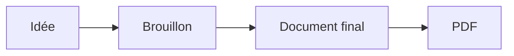
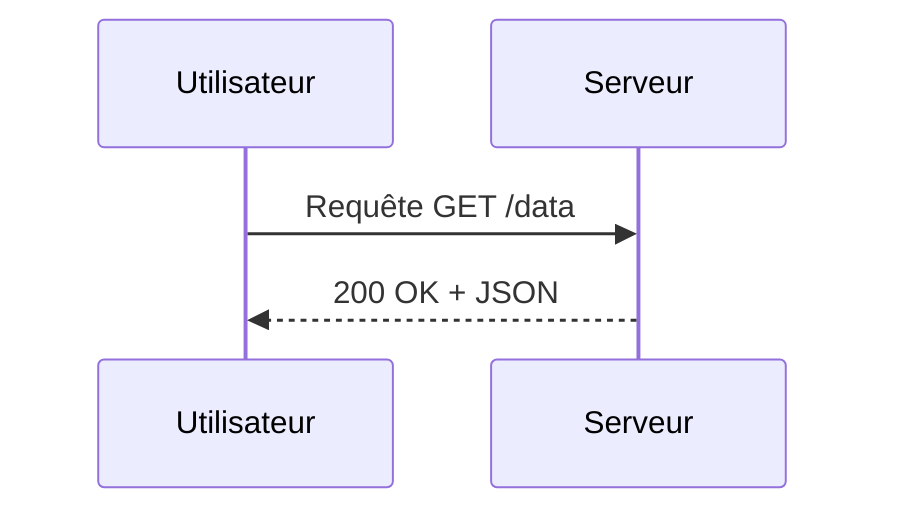
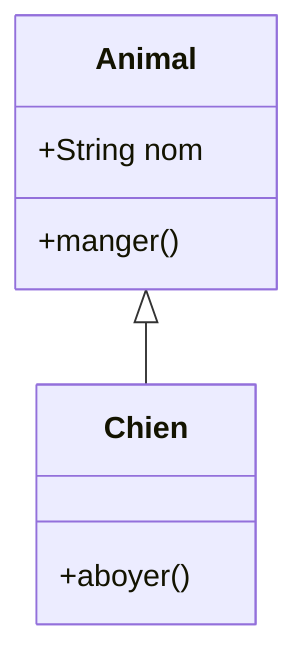
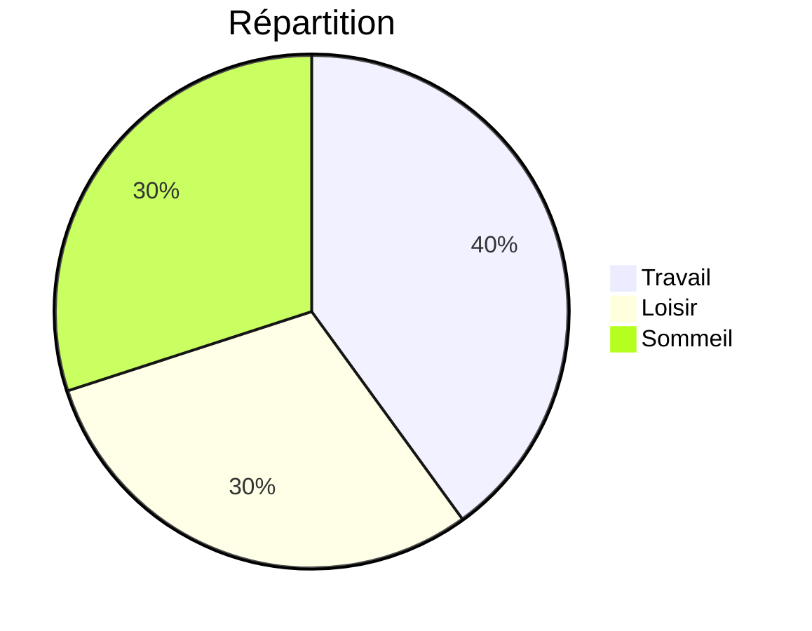

# Bienvenue dans md2pdf

**md2pdf** est un éditeur de texte qui produit des PDF prêts à imprimer
ou à partager. Vous écrivez à gauche, vous voyez le résultat formaté à
droite, et vous cliquez sur **Exporter .pdf** quand c'est prêt.

Vous lisez actuellement ce tutoriel **dans l'éditeur**. C'est juste un
document parmi d'autres : modifiez-le librement, enregistrez votre
travail, ou repartez d'une page blanche en effaçant tout.

À tout moment, le bouton **Aide** (en haut à droite, sur fond jaune)
rouvre cette page d'aide originale, sans toucher à votre document.

## Écrire du texte

md2pdf utilise la notation **Markdown**. C'est une convention très
simple : la mise en forme s'écrit avec quelques caractères du texte
courant, qui sont reconnus tels quels au moment du rendu.

Par exemple, si vous tapez :

```
Mon texte est **important** et un peu *nuancé*.
```

…alors le rendu (à droite) montre :

> Mon texte est **important** et un peu *nuancé*.

C'est la philosophie centrale de Markdown : **les caractères que vous
tapez sont l'instruction de mise en forme**. Rien de caché, rien à
apprendre par cœur — vous pouvez à tout moment regarder à gauche pour
voir « comment c'est fait ».

Tout ce que ce logiciel sait afficher peut s'écrire **uniquement avec
le clavier**, sans jamais ouvrir un menu ni utiliser un raccourci. Les
boutons et les raccourcis ne sont que des **accélérateurs** : ils
insèrent les caractères à votre place.

### La syntaxe Markdown en bref

| Vous tapez… | Vous obtenez… |
|---|---|
| `**gras**` | **gras** |
| `*italique*` | *italique* |
| `` `code` `` | `code` |
| `[lien](https://exemple.fr)` | [lien](https://exemple.fr) |
| `# Titre 1` (en début de ligne) | titre niveau 1 |
| `## Titre 2`, `### Titre 3`, `#### Titre 4` | sous-titres |
| `- élément` (en début de ligne) | • élément (liste à puces) |
| `1. élément` | 1. élément (liste numérotée) |
| `> texte` | citation indentée |
| `---` (sur une ligne seule) | ligne horizontale |
| `` | une image |

Les **titres**, **listes** et **citations** sont des « blocs ». Ils
doivent être placés en début de ligne pour être reconnus.

Le **premier `# Titre 1`** du document, placé tout en haut, joue le
rôle de **titre principal du document** : il est automatiquement
centré dans le PDF, et c'est juste en dessous que s'affichent l'auteur,
l'organisation et la date (si vous les renseignez dans **Réglages**).
Vos sections internes utilisent donc plutôt `## Titre 2` ou
`### Titre 3`.

### Si vous préférez ne pas taper les caractères

Si la syntaxe vous semble fastidieuse, utilisez les **raccourcis
clavier** comme dans Word — ils insèrent les caractères pour vous.
Sélectionnez d'abord le texte, puis :

| Pour faire… | Tapez… |
|---|---|
| **Gras** | `Cmd/Ctrl` + `B` |
| *Italique* | `Cmd/Ctrl` + `I` |
| `Code en ligne` | `Cmd/Ctrl` + `E` |
| Lien hypertexte | `Cmd/Ctrl` + `K` |
| Texte normal (retirer titre) | `Cmd/Ctrl` + `0` |
| Titres 1 à 4 | `Cmd/Ctrl` + `1` à `4` |
| Liste à puces | `Cmd/Ctrl` + `Maj` + `L` |
| Liste numérotée | `Cmd/Ctrl` + `Maj` + `O` |
| Citation | `Cmd/Ctrl` + `Maj` + `Q` |

Le bouton **Style** dans la barre d'outils (et le **clic-droit** dans
l'éditeur) ouvrent un menu qui propose les mêmes commandes, avec une
**coche** sur les formats déjà actifs autour du curseur.

### Astuce : sélectionner une ligne entière

Cliquez sur le **numéro de ligne** dans la marge gauche pour
sélectionner toute la ligne d'un coup. Glissez pour en sélectionner
plusieurs.

## Insérer une image

Trois moyens, au choix :

1. **Glisser-déposer** une image depuis votre Bureau ou un dossier
   directement dans l'éditeur.
2. **Coller** une capture d'écran (`Cmd/Ctrl` + `V` après l'avoir
   capturée).
3. Bouton **Style** → *« Insérer une image… »*, ou raccourci
   `Cmd/Ctrl` + `Alt` + `I`.

Les photos sont automatiquement **redimensionnées et compressées** (max
2000 pixels de côté) pour que votre document reste léger sans perte
visible de qualité.

Vous pouvez aussi glisser une image directement depuis une page web,
mais beaucoup de sites bloquent l'accès direct (Google Photos par
exemple) ; dans ce cas, téléchargez l'image localement d'abord.

## Sauvegarder, ouvrir, exporter

| Bouton | Raccourci | Effet |
|---|---|---|
| **Ouvrir** | `Cmd/Ctrl` + `O` | Charge un fichier `.md`, `.txt`, `.html` ou `.docx` (Word) |
| **Enregistrer** | `Cmd/Ctrl` + `S` | Télécharge votre document au format Markdown (`.md`) |
| **Exporter .pdf** | `Cmd/Ctrl` + `P` | Produit le PDF final, prêt à imprimer ou envoyer |
| **Réglages** | `Cmd/Ctrl` + `,` | Personnalise le rendu PDF |

> **À l'export PDF, sélectionnez "Marges : Aucune"** dans le dialogue
> d'impression (section *Plus de paramètres*). Sans ça, le navigateur
> ajoute ses propres marges par-dessus celles du document, ce qui
> rétrécit la zone imprimable et fait dépasser ou re-scaler le contenu.
> Les marges visibles dans le PDF sont gérées par md2pdf, pas par le
> navigateur.

Le format **Markdown** (`.md`) est un format texte ouvert, lisible
partout. Vous pouvez l'envoyer à quelqu'un qui n'utilise pas md2pdf —
il l'ouvrira dans n'importe quel éditeur de texte.

> **À noter pour les fichiers Word** : à l'import d'un `.docx`, le
> texte, les titres, les listes, le gras/italique, les liens et les
> citations sont récupérés, mais **pas les images**. Si votre document
> Word contenait des photos ou des illustrations, vous devrez les
> réinsérer manuellement après import.

Votre travail est **automatiquement sauvegardé** dans le navigateur, donc
si vous fermez l'onglet par accident, tout est récupéré à la prochaine
ouverture.

## Personnaliser le rendu PDF

Le bouton **Réglages** ouvre un panneau qui permet de configurer le PDF
sans toucher au contenu :

- **Auteur, organisation, date** affichés sous le titre principal
- **Format de page** (A4, A5, Letter…)
- **Marges** en millimètres
- **Justification** du texte
- **Interligne**
- **Tailles et couleurs** des titres (h1 à h4) et du corps
- **Style du code** (taille et couleur)
- **Style de la citation** (taille, couleur du texte, couleur de la
  barre verticale)
- **Numéro de page** : position, taille, couleur, italique

Les réglages sont **mémorisés entre vos sessions**. Le bouton
*Réinitialiser* en bas du panneau revient aux valeurs par défaut.

## Quelques détails utiles

### Page de titre

Le **premier titre niveau 1** (`# Mon titre`) du document est
automatiquement centré et fait office de titre général. Les
informations *Auteur / Organisation / Date* s'affichent juste en
dessous, centrées également.

### Caractères spéciaux et symboles

Les flèches (→, ←, ↑, ↓), les opérateurs mathématiques (≤, ≥, ≠), les
symboles divers (★, ♥, ✓) sont gérés correctement, à l'écran comme
dans le PDF.

### Bloc de code

Pour insérer du code :

```
Tout texte placé entre trois accents graves (```) est affiché
dans une police à largeur fixe, sur fond gris.
```

## Pour aller plus loin

md2pdf reconnaît la plupart des conventions Markdown classiques :

- Texte **gras** ou *italique*, ***les deux***
- Liens : `[texte du lien](https://exemple.fr)`
- Images de référence
- Tableaux comme celui ci-dessus
- Lignes horizontales (trois tirets sur une ligne)
- Formules mathématiques (voir la section suivante)
- Diagrammes Mermaid (voir la section suivante)

## Formules mathématiques

Vous pouvez inclure des **formules en LaTeX**, soit **en bloc** entre
`$$ … $$` (la formule s'affiche centrée sur sa propre ligne), soit
**inline** entre `$ … $` au milieu d'une phrase. Le rendu utilise
[MathJax](https://www.mathjax.org/) et produit un PDF de qualité
typographique professionnelle.

Pour les blocs, vous pouvez aussi utiliser un *fenced block* avec le
langage `math` — c'est la convention GitHub et ça évite le piège des
`$$` qui doivent être seuls sur leur ligne :

````
```math
x = \frac{-b \pm \sqrt{b^2 - 4ac}}{2a}
```
````

Le rendu est strictement identique à `$$ … $$`.

Par exemple, en tapant :

```
$$
x = \frac{-b \pm \sqrt{b^2 - 4ac}}{2a}
$$
```

…vous obtenez :

$$
x = \frac{-b \pm \sqrt{b^2 - 4ac}}{2a}
$$

### Exemples utiles

**Sommes et intégrales**

```
$$
\sum_{i=1}^{n} i^2 = \frac{n(n+1)(2n+1)}{6}
\qquad
\int_{0}^{\infty} e^{-x^2}\,dx = \frac{\sqrt{\pi}}{2}
$$
```

$$
\sum_{i=1}^{n} i^2 = \frac{n(n+1)(2n+1)}{6}
\qquad
\int_{0}^{\infty} e^{-x^2}\,dx = \frac{\sqrt{\pi}}{2}
$$

**Matrice**

```
$$
A = \begin{pmatrix}
1 & 2 & 3 \\
4 & 5 & 6 \\
7 & 8 & 9
\end{pmatrix}
$$
```

$$
A = \begin{pmatrix}
1 & 2 & 3 \\
4 & 5 & 6 \\
7 & 8 & 9
\end{pmatrix}
$$

**Système d'équations alignées**

```
$$
\begin{align*}
f(x)   &= ax^2 + bx + c \\
f'(x)  &= 2ax + b \\
f''(x) &= 2a
\end{align*}
$$
```

$$
\begin{align*}
f(x)   &= ax^2 + bx + c \\
f'(x)  &= 2ax + b \\
f''(x) &= 2a
\end{align*}
$$

**Formule inline** : tapez par exemple
`Soit $\epsilon > 0$ tel que…` et vous obtenez :

Soit $\epsilon > 0$ tel que…

### À savoir

- Les **formules inline** (`$…$`) s'affichent dans le flux du
  paragraphe à l'écran, mais **dans le PDF** elles sont rendues comme
  des blocs centrés (le paragraphe est coupé avant et repris après la
  formule). C'est une limitation de la bibliothèque qui produit le PDF.
  Pour les formules courtes au milieu d'une phrase, l'aperçu HTML
  correspond donc mieux à votre intention que le PDF.
- La taille des formules s'aligne sur la taille du texte courant ; si
  vous changez le réglage **Texte normal** dans **Réglages**, les
  formules grandissent ou rétrécissent en proportion.
- Si une formule est plus large que la zone de texte de la page, elle
  est automatiquement réduite pour tenir.
- Les commandes LaTeX usuelles fonctionnent : `\frac`, `\sqrt`,
  `\sum`, `\int`, `\lim`, `\vec`, `\partial`, lettres grecques
  (`\alpha`, `\beta`, …), opérateurs (`\pm`, `\times`, `\le`),
  flèches (`\to`, `\Rightarrow`), environnements `pmatrix` /
  `bmatrix` / `align*`, etc.

## Diagrammes Mermaid

[Mermaid](https://mermaid.js.org/) permet de décrire un diagramme avec
quelques lignes de texte. Placez votre code dans un bloc dont le langage
est `mermaid` :

````

````

…et vous obtenez :


Le diagramme est rendu en **SVG**, dans l'aperçu **et** dans le PDF
(qualité vectorielle, sans pixellisation à l'impression).

### Quelques exemples

**Diagramme de séquence** (échange entre deux acteurs) :



**Diagramme de classes** :



**Camembert** :



Autres types reconnus : `stateDiagram`, `gantt`, `mindmap`, etc. — voir
la [documentation Mermaid](https://mermaid.js.org/) pour la liste
complète et la syntaxe de chacun.

### Réglages

La section **Diagrammes Mermaid** du panneau **Réglages** propose trois
contrôles pour adapter la taille des diagrammes dans le PDF :

- **Agrandissement max.** : facteur d'agrandissement maximal (par
  défaut 2). Les petits diagrammes sont agrandis jusqu'à ce facteur ;
  jamais au-delà.
- **Largeur max. (% du texte)** : fraction de la largeur de la page
  (hors marges) que le diagramme peut occuper (par défaut 100 %).
- **Hauteur max. (% du texte)** : fraction de la hauteur de la page
  (hors marges) que le diagramme peut occuper (par défaut 70 %).

Ces deux dernières bornes évitent qu'un diagramme haut ne pousse à la
page suivante en laissant la précédente à moitié vide.

## Tableaux de données (CSV / TSV)

Pour un tableau dense, écrire la syntaxe pipe-style (`| a | b |`) à
la main est fastidieux. Vous pouvez à la place coller un **CSV** ou un
**TSV** dans un *fenced block* :

````
```csv
Note, Concert pitch (Hz), MIDI
A4,    440.00, 69
A#4,   466.16, 70
B4,    493.88, 71
```
````

Le **séparateur** est la virgule pour `csv`, la tabulation pour `tsv`.
La **première ligne** devient l'en-tête du tableau, les suivantes les
données.

Si l'une de vos cellules contient le séparateur (par exemple une
virgule dans un nom), entourez-la de guillemets doubles :

````
```csv
Nom, Description
"Doe, John", "Auteur, fondateur"
```
````

Pour insérer un guillemet littéral dans une cellule entre guillemets,
doublez-le : `""`.

## Listes de définitions

Pour une liste de **termes avec leur définition** (glossaire,
notation, dictionnaire), utilisez la syntaxe Pandoc : un terme sur
une ligne, puis sa définition sur la ligne suivante préfixée par
`:` et au moins une espace.

```
DAG
:   Directed Acyclic Graph — un graphe orienté sans cycle.

FFT
:   Fast Fourier Transform, l'algorithme en $O(n \log n)$ de
    Cooley & Tukey.
```

Plusieurs définitions pour le même terme : ajoutez d'autres lignes
`:` à la suite.

```
Polynôme
:   Une expression de la forme $a_0 + a_1 x + \dots + a_n x^n$.
:   Un objet du langage Faust qui représente la même chose.
```

À l'intérieur des termes et des définitions vous pouvez utiliser du
Markdown inline (gras, italique, code, formules, liens).

## Notes de bas de page

Vous pouvez ajouter une **note de bas de page** avec la syntaxe
Pandoc : un appel de note `[^id]` dans le texte, et la définition
`[^id]: contenu` n'importe où dans le document (généralement à la
fin).

```
La transformée de Fourier discrète[^dft] est l'outil de base pour
analyser un signal numérique.

[^dft]: Voir Cooley & Tukey (1965) pour l'algorithme rapide.
```

L'identifiant `id` peut être un nombre, un mot, ou un libellé court —
il sert seulement à relier l'appel à sa définition, et n'apparaît
nulle part dans le rendu. Les notes sont **numérotées
automatiquement** dans l'ordre où elles apparaissent dans le texte
(pas dans l'ordre des définitions), et regroupées en fin de document.

À l'intérieur d'une note vous pouvez utiliser **`gras`**, *italique*,
`code inline`, des liens, ou même `$math$`. Une même note peut être
référencée plusieurs fois — toutes les occurrences pointent vers la
même entrée.

Cliquer sur l'appel `¹` saute à la note ; cliquer sur le `↩` à la
fin de la note revient à l'appel.

## Encadrés (notes, théorèmes…)

Vous pouvez mettre en valeur un passage avec un **encadré** : ouvrez
avec `:::` suivi du nom de l'encadré, écrivez votre contenu, fermez
avec `:::` seul sur une ligne. C'est la syntaxe Pandoc des *fenced
divs*.

```
::: warning
Attention, cette opération est irréversible.
:::
```

Les noms d'encadrés reconnus se rangent en deux familles :

- **Génériques** (cadre coloré, fond teinté) :
  - `note` (bleu),
  - `tip` (vert),
  - `warning` (orange),
  - `caution` (rouge),
  - `important` (violet).
- **Académiques** (cadre sobre, titre en italique, façon LaTeX) :
  `theorem`, `lemma`, `proposition`, `corollary`, `definition`,
  `proof`, `example`, `remark`.

Vous pouvez ajouter un **titre** entre crochets après le nom :

```
::: theorem [Pythagore]
Dans un triangle rectangle, le carré de l'hypoténuse est égal à
la somme des carrés des deux autres côtés.
:::
```

…s'affiche avec le titre **« Théorème — Pythagore »**.

Si vous écrivez un encadré avec un nom qui n'est pas dans la liste
ci-dessus (par exemple `::: aside`), il sera rendu avec un cadre
neutre — utile pour vos propres conventions de mise en page.

L'intérieur d'un encadré est du Markdown comme le reste : vous pouvez
y mettre du texte mis en forme, des listes, des formules, voire des
tableaux.

## Crédits

md2pdf est un projet open source assemblé à partir de logiciels libres.
Merci à toutes les personnes qui maintiennent ces projets :

- **Édition et rendu** :
  [CodeMirror](https://codemirror.net/) pour l'éditeur,
  [marked](https://marked.js.org/) pour le parser Markdown,
  [paged.js](https://pagedjs.org/) pour la mise en page paginée
  (l'aperçu et le PDF passent par le moteur d'impression du
  navigateur sur ce même rendu).
- **Diagrammes et formules** :
  [Mermaid](https://mermaid.js.org/) pour les diagrammes,
  [MathJax](https://www.mathjax.org/) pour les formules LaTeX.
- **Imports** :
  [Mammoth.js](https://github.com/mwilliamson/mammoth.js) pour
  l'import Word (`.docx`),
  [Turndown](https://github.com/mixmark-io/turndown) pour la conversion
  HTML → Markdown.
- **Polices** :
  [Roboto Condensed](https://fonts.google.com/specimen/Roboto+Condensed) et
  [Roboto Mono](https://fonts.google.com/specimen/Roboto+Mono)
  (Christian Robertson, Google),
  [Noto Sans Math](https://fonts.google.com/noto/specimen/Noto+Sans+Math) et
  [Noto Sans Symbols](https://fonts.google.com/noto/specimen/Noto+Sans+Symbols)
  (Google) pour les caractères mathématiques et les symboles.
- **Outils de build** :
  [Vite](https://vitejs.dev/) et [TypeScript](https://www.typescriptlang.org/).

Le code source de md2pdf est sur
[GitHub](https://github.com/orlarey/md2pdf).

---

C'est tout pour le tour rapide. Vous pouvez maintenant :

- Effacer ce contenu et commencer à rédiger votre propre document
- L'enregistrer pour le retrouver plus tard
- Cliquer sur **Aide** à droite à tout moment pour revoir ce tutoriel

Bonne écriture.
