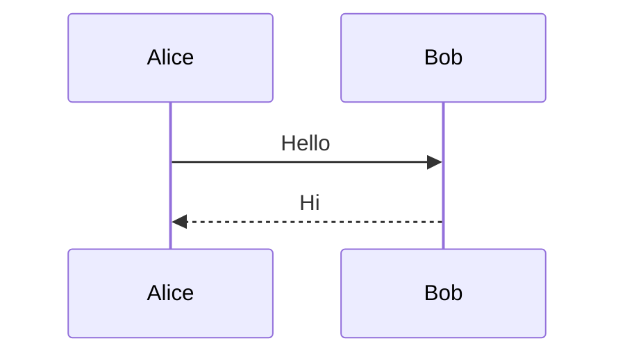

# Diagrams

A sequence diagram:


```mermaid
sequenceDiagram
  Alice ->> Bob: Hello
  Bob -->> Alice: Hi
```

The same source twice — should bundle one SVG, reference it twice:


```mermaid
sequenceDiagram
  Alice ->> Bob: Hello
  Bob -->> Alice: Hi
```

A chart block:

```chart bar
month, sales
Jan, 100
Feb, 200
Mar, 150
```
